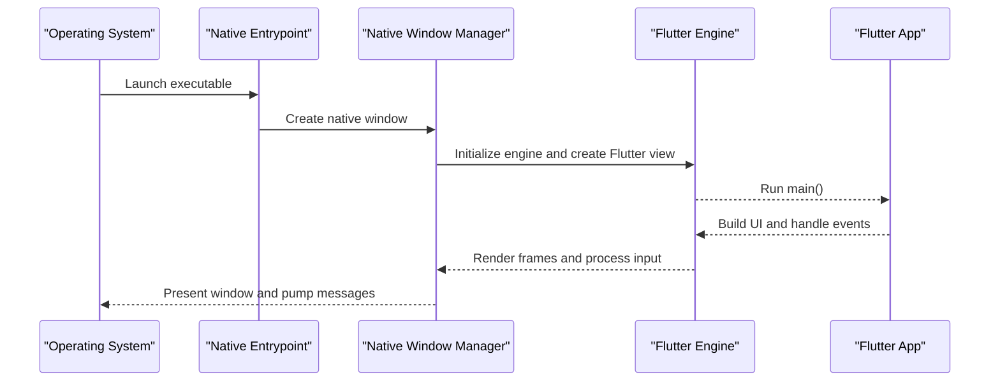
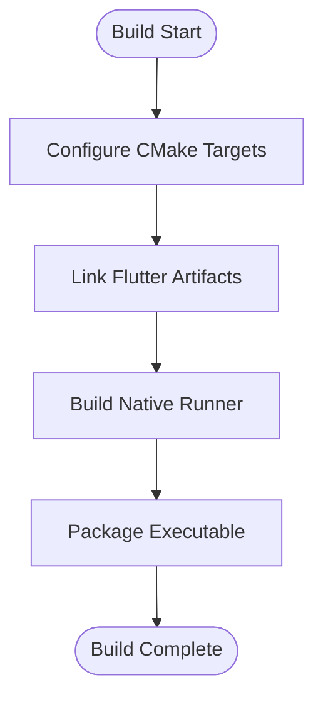
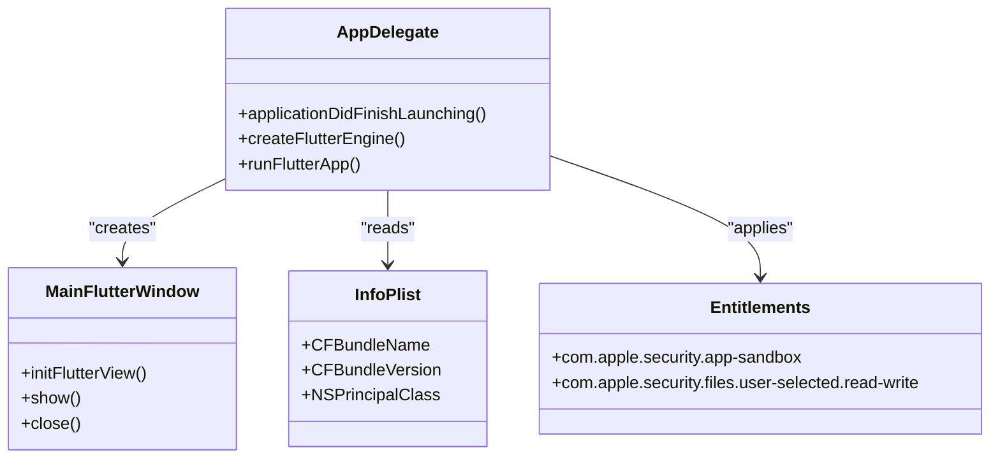
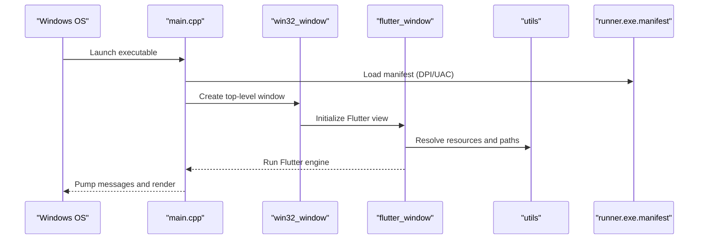
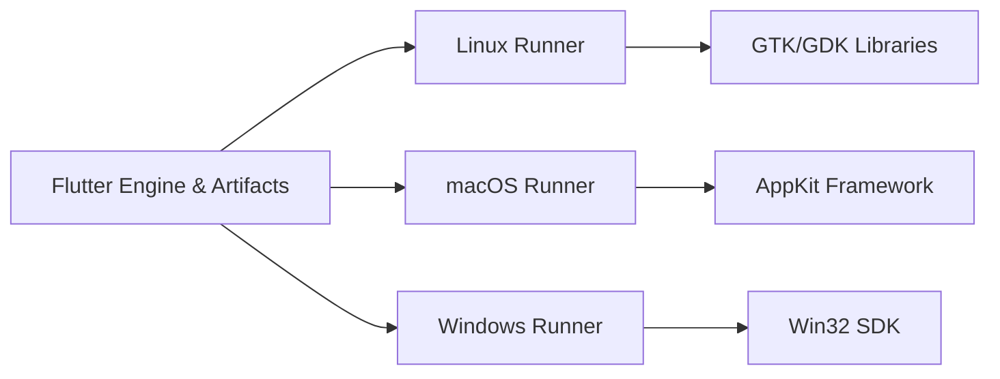

# Desktop Platform Implementations

<cite>
**Referenced Files in This Document**
- [linux/CMakeLists.txt](file://linux/CMakeLists.txt)
- [linux/flutter/CMakeLists.txt](file://linux/flutter/CMakeLists.txt)
- [linux/runner/CMakeLists.txt](file://linux/runner/CMakeLists.txt)
- [linux/runner/main.cc](file://linux/runner/main.cc)
- [linux/runner/my_application.cc](file://linux/runner/my_application.cc)
- [linux/runner/my_application.h](file://linux/runner/my_application.h)
- [macos/Runner/Info.plist](file://macos/Runner/Info.plist)
- [macos/Runner/AppDelegate.swift](file://macos/Runner/AppDelegate.swift)
- [macos/Runner/MainFlutterWindow.swift](file://macos/Runner/MainFlutterWindow.swift)
- [macos/Runner/DebugProfile.entitlements](file://macos/Runner/DebugProfile.entitlements)
- [macos/Runner/Release.entitlements](file://macos/Runner/Release.entitlements)
- [windows/CMakeLists.txt](file://windows/CMakeLists.txt)
- [windows/flutter/CMakeLists.txt](file://windows/flutter/CMakeLists.txt)
- [windows/runner/CMakeLists.txt](file://windows/runner/CMakeLists.txt)
- [windows/runner/main.cpp](file://windows/runner/main.cpp)
- [windows/runner/win32_window.h](file://windows/runner/win32_window.h)
- [windows/runner/win32_window.cpp](file://windows/runner/win32_window.cpp)
- [windows/runner/flutter_window.h](file://windows/runner/flutter_window.h)
- [windows/runner/flutter_window.cpp](file://windows/runner/flutter_window.cpp)
- [windows/runner/utils.h](file://windows/runner/utils.h)
- [windows/runner/utils.cpp](file://windows/runner/utils.cpp)
- [windows/runner/runner.exe.manifest](file://windows/runner/runner.exe.manifest)
</cite>

## Table of Contents
1. [Introduction](#introduction)
2. [Project Structure](#project-structure)
3. [Core Components](#core-components)
4. [Architecture Overview](#architecture-overview)
5. [Detailed Component Analysis](#detailed-component-analysis)
6. [Dependency Analysis](#dependency-analysis)
7. [Performance Considerations](#performance-considerations)
8. [Troubleshooting Guide](#troubleshooting-guide)
9. [Conclusion](#conclusion)
10. [Appendices](#appendices)

## Introduction
This document provides comprehensive guidance for desktop platform implementations across Linux, macOS, and Windows within a Flutter-based project. It focuses on build configuration, application packaging, distribution formats, native integration points, UI adaptations, system features (clipboard, file system access, system tray), debugging and profiling strategies, performance optimization, signing and notarization, and preparation for distribution channels. The content is grounded in the repository’s desktop runner code and configuration files.

## Project Structure
The desktop targets are implemented under platform-specific directories:
- Linux: CMake-based build with a native runner entrypoint and window management.
- macOS: Xcode workspace with Swift AppDelegate and Flutter window setup, plus entitlements and Info.plist.
- Windows: CMake-based build with Win32 windowing and Flutter window integration.

```mermaid
graph TB
subgraph "Linux"
L_CMake["linux/CMakeLists.txt"]
L_FlutterCMake["linux/flutter/CMakeLists.txt"]
L_RunnerCMake["linux/runner/CMakeLists.txt"]
L_Main["linux/runner/main.cc"]
L_App["linux/runner/my_application.{h,cc}"]
end
subgraph "macOS"
M_Info["macos/Runner/Info.plist"]
M_AppDelegate["macos/Runner/AppDelegate.swift"]
M_Window["macos/Runner/MainFlutterWindow.swift"]
M_EntD["macos/Runner/DebugProfile.entitlements"]
M_EntR["macos/Runner/Release.entitlements"]
end
subgraph "Windows"
W_CMake["windows/CMakeLists.txt"]
W_FlutterCMake["windows/flutter/CMakeLists.txt"]
W_RunnerCMake["windows/runner/CMakeLists.txt"]
W_Main["windows/runner/main.cpp"]
W_Win32Win["windows/runner/win32_window.{h,cc}"]
W_FlutterWin["windows/runner/flutter_window.{h,cc}"]
W_Utils["windows/runner/utils.{h,cc}"]
W_Manifest["windows/runner/runner.exe.manifest"]
end
L_CMake --> L_FlutterCMake
L_CMake --> L_RunnerCMake
L_RunnerCMake --> L_Main
L_Main --> L_App
M_AppDelegate --> M_Window
M_AppDelegate --> M_Info
M_AppDelegate --> M_EntD
M_AppDelegate --> M_EntR
W_CMake --> W_FlutterCMake
W_CMake --> W_RunnerCMake
W_RunnerCMake --> W_Main
W_Main --> W_Win32Win
W_Main --> W_FlutterWin
W_FlutterWin --> W_Utils
W_Win32Win --> W_Manifest
```

**Diagram sources**
- [linux/CMakeLists.txt](file://linux/CMakeLists.txt)
- [linux/flutter/CMakeLists.txt](file://linux/flutter/CMakeLists.txt)
- [linux/runner/CMakeLists.txt](file://linux/runner/CMakeLists.txt)
- [linux/runner/main.cc](file://linux/runner/main.cc)
- [linux/runner/my_application.cc](file://linux/runner/my_application.cc)
- [linux/runner/my_application.h](file://linux/runner/my_application.h)
- [macos/Runner/Info.plist](file://macos/Runner/Info.plist)
- [macos/Runner/AppDelegate.swift](file://macos/Runner/AppDelegate.swift)
- [macos/Runner/MainFlutterWindow.swift](file://macos/Runner/MainFlutterWindow.swift)
- [macos/Runner/DebugProfile.entitlements](file://macos/Runner/DebugProfile.entitlements)
- [macos/Runner/Release.entitlements](file://macos/Runner/Release.entitlements)
- [windows/CMakeLists.txt](file://windows/CMakeLists.txt)
- [windows/flutter/CMakeLists.txt](file://windows/flutter/CMakeLists.txt)
- [windows/runner/CMakeLists.txt](file://windows/runner/CMakeLists.txt)
- [windows/runner/main.cpp](file://windows/runner/main.cpp)
- [windows/runner/win32_window.h](file://windows/runner/win32_window.h)
- [windows/runner/win32_window.cpp](file://windows/runner/win32_window.cpp)
- [windows/runner/flutter_window.h](file://windows/runner/flutter_window.h)
- [windows/runner/flutter_window.cpp](file://windows/runner/flutter_window.cpp)
- [windows/runner/utils.h](file://windows/runner/utils.h)
- [windows/runner/utils.cpp](file://windows/runner/utils.cpp)
- [windows/runner/runner.exe.manifest](file://windows/runner/runner.exe.manifest)

**Section sources**
- [linux/CMakeLists.txt](file://linux/CMakeLists.txt)
- [linux/flutter/CMakeLists.txt](file://linux/flutter/CMakeLists.txt)
- [linux/runner/CMakeLists.txt](file://linux/runner/CMakeLists.txt)
- [linux/runner/main.cc](file://linux/runner/main.cc)
- [linux/runner/my_application.cc](file://linux/runner/my_application.cc)
- [linux/runner/my_application.h](file://linux/runner/my_application.h)
- [macos/Runner/Info.plist](file://macos/Runner/Info.plist)
- [macos/Runner/AppDelegate.swift](file://macos/Runner/AppDelegate.swift)
- [macos/Runner/MainFlutterWindow.swift](file://macos/Runner/MainFlutterWindow.swift)
- [macos/Runner/DebugProfile.entitlements](file://macos/Runner/DebugProfile.entitlements)
- [macos/Runner/Release.entitlements](file://macos/Runner/Release.entitlements)
- [windows/CMakeLists.txt](file://windows/CMakeLists.txt)
- [windows/flutter/CMakeLists.txt](file://windows/flutter/CMakeLists.txt)
- [windows/runner/CMakeLists.txt](file://windows/runner/CMakeLists.txt)
- [windows/runner/main.cpp](file://windows/runner/main.cpp)
- [windows/runner/win32_window.h](file://windows/runner/win32_window.h)
- [windows/runner/win32_window.cpp](file://windows/runner/win32_window.cpp)
- [windows/runner/flutter_window.h](file://windows/runner/flutter_window.h)
- [windows/runner/flutter_window.cpp](file://windows/runner/flutter_window.cpp)
- [windows/runner/utils.h](file://windows/runner/utils.h)
- [windows/runner/utils.cpp](file://windows/runner/utils.cpp)
- [windows/runner/runner.exe.manifest](file://windows/runner/runner.exe.manifest)

## Core Components
- Linux Runner
  - Entry point initializes GTK/GDK and creates the application instance.
  - Window lifecycle and menu handling are encapsulated in the application class.
- macOS Runner
  - AppDelegate sets up the Flutter engine and main window.
  - MainFlutterWindow manages the Flutter view lifecycle.
  - Info.plist defines app metadata; entitlements control sandbox permissions.
- Windows Runner
  - Entry point creates the Win32 window and hosts Flutter via flutter_window.
  - win32_window handles OS-level window creation and message loop.
  - utils provide helper functions for path resolution and resource loading.
  - manifest configures UAC and DPI awareness.

Key responsibilities:
- Cross-platform initialization and Flutter engine bootstrapping.
- Native window creation and event dispatch to Flutter.
- Platform-specific configuration (icons, info, entitlements).

**Section sources**
- [linux/runner/main.cc](file://linux/runner/main.cc)
- [linux/runner/my_application.h](file://linux/runner/my_application.h)
- [linux/runner/my_application.cc](file://linux/runner/my_application.cc)
- [macos/Runner/AppDelegate.swift](file://macos/Runner/AppDelegate.swift)
- [macos/Runner/MainFlutterWindow.swift](file://macos/Runner/MainFlutterWindow.swift)
- [macos/Runner/Info.plist](file://macos/Runner/Info.plist)
- [windows/runner/main.cpp](file://windows/runner/main.cpp)
- [windows/runner/win32_window.h](file://windows/runner/win32_window.h)
- [windows/runner/win32_window.cpp](file://windows/runner/win32_window.cpp)
- [windows/runner/flutter_window.h](file://windows/runner/flutter_window.h)
- [windows/runner/flutter_window.cpp](file://windows/runner/flutter_window.cpp)
- [windows/runner/utils.h](file://windows/runner/utils.h)
- [windows/runner/utils.cpp](file://windows/runner/utils.cpp)
- [windows/runner/runner.exe.manifest](file://windows/runner/runner.exe.manifest)

## Architecture Overview
The desktop architecture follows a consistent pattern:
- A native entrypoint initializes the platform toolkit (GTK on Linux, AppKit on macOS, Win32 on Windows).
- A Flutter window is created and the Flutter engine is started.
- Platform-specific configurations (icons, menus, entitlements, manifests) are applied at build time or runtime.

**Diagram sources**
- [linux/runner/main.cc](file://linux/runner/main.cc)
- [linux/runner/my_application.cc](file://linux/runner/my_application.cc)
- [macos/Runner/AppDelegate.swift](file://macos/Runner/AppDelegate.swift)
- [macos/Runner/MainFlutterWindow.swift](file://macos/Runner/MainFlutterWindow.swift)
- [windows/runner/main.cpp](file://windows/runner/main.cpp)
- [windows/runner/win32_window.cpp](file://windows/runner/win32_window.cpp)
- [windows/runner/flutter_window.cpp](file://windows/runner/flutter_window.cpp)

## Detailed Component Analysis

### Linux Implementation
- Build system
  - Top-level CMake orchestrates target creation and links Flutter artifacts.
  - flutter/CMakeLists integrates generated plugin registrant and assets.
  - runner/CMakeLists builds the native executable and links against GTK/GDK.
- Runtime
  - main.cc boots the application and delegates to my_application.
  - my_application manages window lifecycle, menus, and platform integration.

**Diagram sources**
- [linux/CMakeLists.txt](file://linux/CMakeLists.txt)
- [linux/flutter/CMakeLists.txt](file://linux/flutter/CMakeLists.txt)
- [linux/runner/CMakeLists.txt](file://linux/runner/CMakeLists.txt)

Packaging and Distribution Formats
- AppImage
  - Use linuxdeployqt or linuxdeploy with AppImagePlugin to bundle dependencies and produce a single portable artifact.
  - Ensure icons and .desktop entries are included.
- Snap
  - Define snapcraft.yaml referencing the built binary and required plugs (e.g., desktop, home, removable-media).
  - Build with snapcraft and publish to the Snap Store.
- Flatpak
  - Provide a Flatpak manifest describing the runtime, modules, and commands.
  - Build with flatpak-builder and distribute via Flathub or private repositories.

System Integration Examples
- File system access
  - Use platform channels or existing plugins to open/save dialogs and read/write files within user-scoped locations.
- Clipboard operations
  - Access clipboard via platform APIs or plugins to read/write text and images.
- System tray integration
  - Integrate a tray icon using a Linux-capable plugin; manage show/hide and context menus.

Debugging and Profiling
- Debug with gdb or lldb attached to the running process.
- Use GTK inspector by enabling environment variables during development.
- Profile CPU and memory with perf, valgrind, or KDE Valgrind GUI.
- Inspect logs via journalctl or stderr redirection.

**Section sources**
- [linux/CMakeLists.txt](file://linux/CMakeLists.txt)
- [linux/flutter/CMakeLists.txt](file://linux/flutter/CMakeLists.txt)
- [linux/runner/CMakeLists.txt](file://linux/runner/CMakeLists.txt)
- [linux/runner/main.cc](file://linux/runner/main.cc)
- [linux/runner/my_application.h](file://linux/runner/my_application.h)
- [linux/runner/my_application.cc](file://linux/runner/my_application.cc)

### macOS Implementation
- Application Bundle Structure
  - Info.plist defines app identity, version, and supported interfaces.
  - AppDelegate initializes Flutter and creates the main window.
  - MainFlutterWindow manages the Flutter view lifecycle.
- Entitlements
  - DebugProfile.entitlements and Release.entitlements declare sandbox permissions (e.g., file access, network).
- App Store Submission
  - Archive with Xcode, validate with altool or notarytool, and submit via Transporter or Xcode Organizer.
  - Ensure codesigning identities and provisioning profiles are configured.

**Diagram sources**
- [macos/Runner/AppDelegate.swift](file://macos/Runner/AppDelegate.swift)
- [macos/Runner/MainFlutterWindow.swift](file://macos/Runner/MainFlutterWindow.swift)
- [macos/Runner/Info.plist](file://macos/Runner/Info.plist)
- [macos/Runner/DebugProfile.entitlements](file://macos/Runner/DebugProfile.entitlements)
- [macos/Runner/Release.entitlements](file://macos/Runner/Release.entitlements)

System Integration Examples
- File system access
  - Request user-selected folder/file via NSOpenPanel/NSSavePanel and use sandboxed paths.
- Clipboard operations
  - Use NSPasteboard to read/write strings and images.
- System notifications and dock badge
  - Leverage UserNotifications framework through platform channels.

Signing and Notarization
- Codesign binaries and bundles with an Apple Developer certificate.
- Staple notarization tickets to the app bundle.
- Validate with spctl --assess --verbose.

**Section sources**
- [macos/Runner/Info.plist](file://macos/Runner/Info.plist)
- [macos/Runner/AppDelegate.swift](file://macos/Runner/AppDelegate.swift)
- [macos/Runner/MainFlutterWindow.swift](file://macos/Runner/MainFlutterWindow.swift)
- [macos/Runner/DebugProfile.entitlements](file://macos/Runner/DebugProfile.entitlements)
- [macos/Runner/Release.entitlements](file://macos/Runner/Release.entitlements)

### Windows Implementation
- Build system
  - Top-level CMake configures targets and links Flutter artifacts.
  - flutter/CMakeLists integrates generated plugin registrant and assets.
  - runner/CMakeLists builds the executable and links Win32 libraries.
- Runtime
  - main.cpp creates the Win32 window and starts Flutter.
  - win32_window handles window creation, sizing, and message loop.
  - flutter_window bridges Flutter rendering into the Win32 host.
  - utils provides helpers for path resolution and resource loading.
  - runner.exe.manifest configures DPI awareness and UAC settings.

**Diagram sources**
- [windows/CMakeLists.txt](file://windows/CMakeLists.txt)
- [windows/flutter/CMakeLists.txt](file://windows/flutter/CMakeLists.txt)
- [windows/runner/CMakeLists.txt](file://windows/runner/CMakeLists.txt)
- [windows/runner/main.cpp](file://windows/runner/main.cpp)
- [windows/runner/win32_window.h](file://windows/runner/win32_window.h)
- [windows/runner/win32_window.cpp](file://windows/runner/win32_window.cpp)
- [windows/runner/flutter_window.h](file://windows/runner/flutter_window.h)
- [windows/runner/flutter_window.cpp](file://windows/runner/flutter_window.cpp)
- [windows/runner/utils.h](file://windows/runner/utils.h)
- [windows/runner/utils.cpp](file://windows/runner/utils.cpp)
- [windows/runner/runner.exe.manifest](file://windows/runner/runner.exe.manifest)

Packaging and Installer Creation
- MSI/MSIX
  - Use WiX Toolset to author MSI packages or MSIX Packaging Tool to create MSIX bundles.
  - Include app icons, shortcuts, and dependencies.
- Microsoft Store Deployment
  - Package as MSIX and upload via Partner Center.
  - Configure app capabilities and privacy statements.

System Integration Examples
- File system access
  - Use Win32 APIs or plugins to open/save dialogs and access user folders.
- Clipboard operations
  - Read/write text and images via Win32 clipboard APIs.
- System tray integration
  - Add a tray icon with context menus using a Windows-capable plugin.

Signing and Distribution
- Sign executables with Authenticode certificates.
- For MSIX, sign with a trusted certificate and validate with signtool.
- Publish to Microsoft Store or distribute via private channels.

**Section sources**
- [windows/CMakeLists.txt](file://windows/CMakeLists.txt)
- [windows/flutter/CMakeLists.txt](file://windows/flutter/CMakeLists.txt)
- [windows/runner/CMakeLists.txt](file://windows/runner/CMakeLists.txt)
- [windows/runner/main.cpp](file://windows/runner/main.cpp)
- [windows/runner/win32_window.h](file://windows/runner/win32_window.h)
- [windows/runner/win32_window.cpp](file://windows/runner/win32_window.cpp)
- [windows/runner/flutter_window.h](file://windows/runner/flutter_window.h)
- [windows/runner/flutter_window.cpp](file://windows/runner/flutter_window.cpp)
- [windows/runner/utils.h](file://windows/runner/utils.h)
- [windows/runner/utils.cpp](file://windows/runner/utils.cpp)
- [windows/runner/runner.exe.manifest](file://windows/runner/runner.exe.manifest)

## Dependency Analysis
Desktop targets depend on Flutter toolchain outputs and platform SDKs:
- Linux depends on GTK/GDK and CMake.
- macOS depends on Xcode toolchain and AppKit.
- Windows depends on Visual Studio toolchain and Win32 SDK.

**Diagram sources**
- [linux/CMakeLists.txt](file://linux/CMakeLists.txt)
- [linux/runner/CMakeLists.txt](file://linux/runner/CMakeLists.txt)
- [macos/Runner/AppDelegate.swift](file://macos/Runner/AppDelegate.swift)
- [windows/CMakeLists.txt](file://windows/CMakeLists.txt)
- [windows/runner/CMakeLists.txt](file://windows/runner/CMakeLists.txt)

**Section sources**
- [linux/CMakeLists.txt](file://linux/CMakeLists.txt)
- [linux/runner/CMakeLists.txt](file://linux/runner/CMakeLists.txt)
- [macos/Runner/AppDelegate.swift](file://macos/Runner/AppDelegate.swift)
- [windows/CMakeLists.txt](file://windows/CMakeLists.txt)
- [windows/runner/CMakeLists.txt](file://windows/runner/CMakeLists.txt)

## Performance Considerations
- Rendering pipeline
  - Avoid excessive layout recalculations; prefer const widgets where possible.
  - Use RepaintBoundary to isolate expensive repaint regions.
- I/O and networking
  - Offload heavy work to isolates; batch file operations; cache responses.
- Memory usage
  - Monitor heap growth; release large objects promptly; avoid retaining references in callbacks.
- Platform-specific tips
  - Linux: Prefer GPU acceleration; ensure proper compositor behavior.
  - macOS: Leverage Metal backend; minimize main-thread blocking.
  - Windows: Enable hardware acceleration; optimize DPI scaling.

[No sources needed since this section provides general guidance]

## Troubleshooting Guide
- Linux
  - Check GTK errors and missing shared libraries with ldd and strace.
  - Use GTK Inspector to debug UI issues.
  - Review logs with journalctl or redirect stderr.
- macOS
  - Inspect Console.app for crash reports and assertion failures.
  - Validate entitlements and sandbox restrictions.
  - Use Instruments for CPU, memory, and energy profiling.
- Windows
  - Use Event Viewer and Visual Studio debugger.
  - Validate manifest settings for DPI and UAC.
  - Use Windows Performance Toolkit for tracing and profiling.

Common pitfalls
- Incorrect file paths due to sandboxing or working directory differences.
- Missing platform capabilities for clipboard/tray/file access.
- Inconsistent icon sizes and asset resolution across platforms.

**Section sources**
- [linux/runner/my_application.cc](file://linux/runner/my_application.cc)
- [macos/Runner/Info.plist](file://macos/Runner/Info.plist)
- [macos/Runner/DebugProfile.entitlements](file://macos/Runner/DebugProfile.entitlements)
- [macos/Runner/Release.entitlements](file://macos/Runner/Release.entitlements)
- [windows/runner/runner.exe.manifest](file://windows/runner/runner.exe.manifest)

## Conclusion
This document outlined desktop platform implementations for Linux, macOS, and Windows, covering build configuration, packaging, distribution, system integration, debugging, performance, and signing processes. By aligning native runners with Flutter’s cross-platform model and adhering to platform best practices, you can deliver robust desktop applications tailored to each ecosystem.

[No sources needed since this section summarizes without analyzing specific files]

## Appendices

### Cross-Platform Development Considerations
- Conditional compilation
  - Use platform checks to branch logic for Linux/macOS/Windows.
- Resource management
  - Centralize assets and resolve paths per platform.
- Feature parity
  - Abstract platform-specific features behind common interfaces.

[No sources needed since this section provides general guidance]