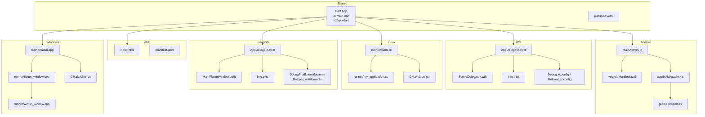
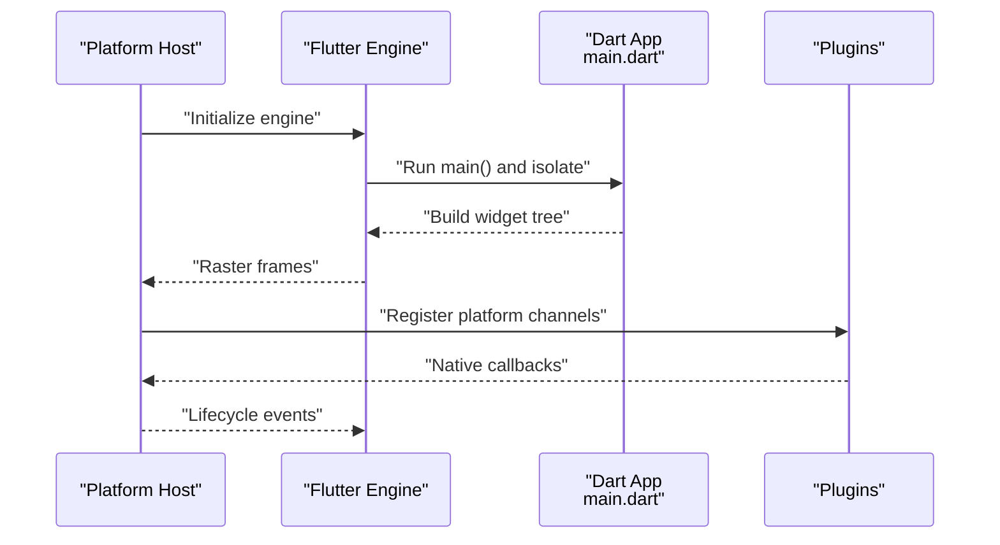
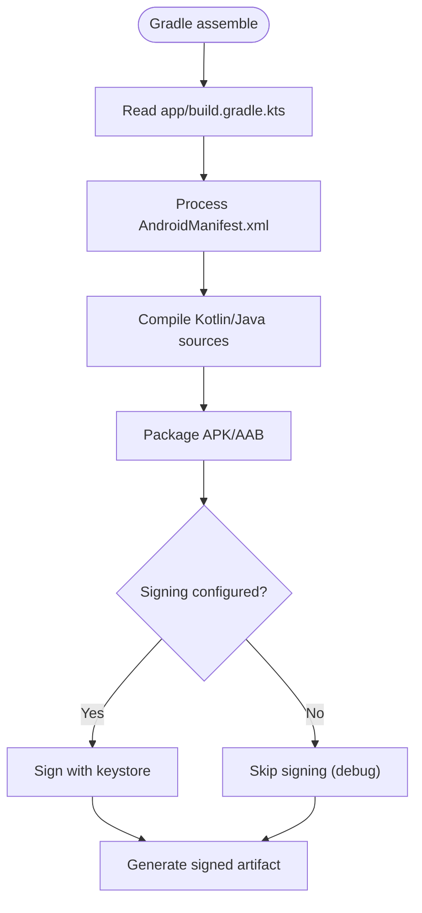
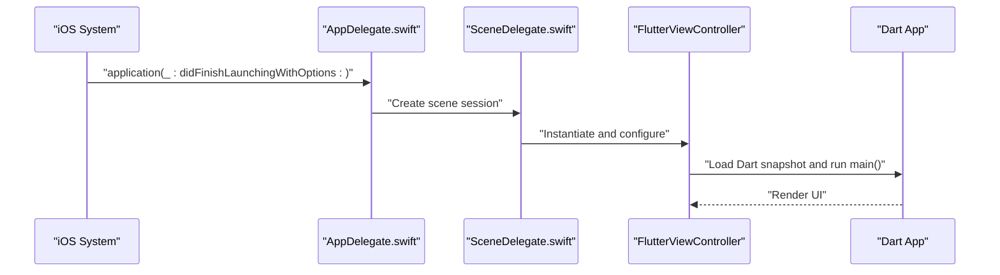
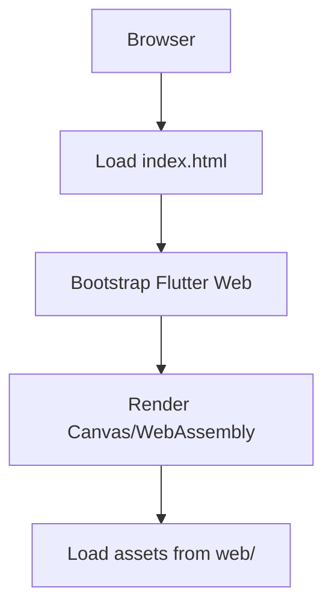
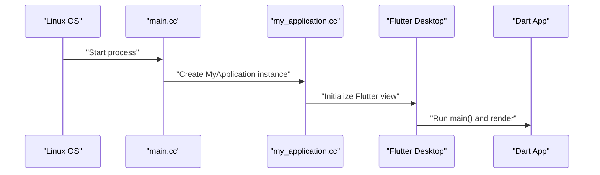
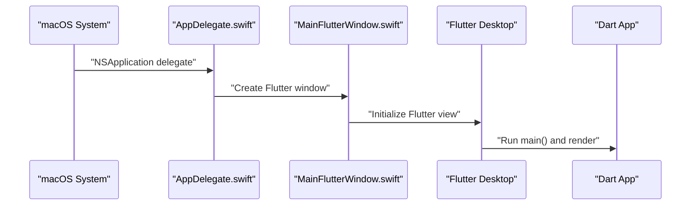
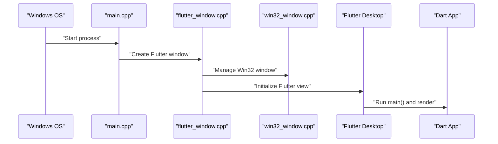
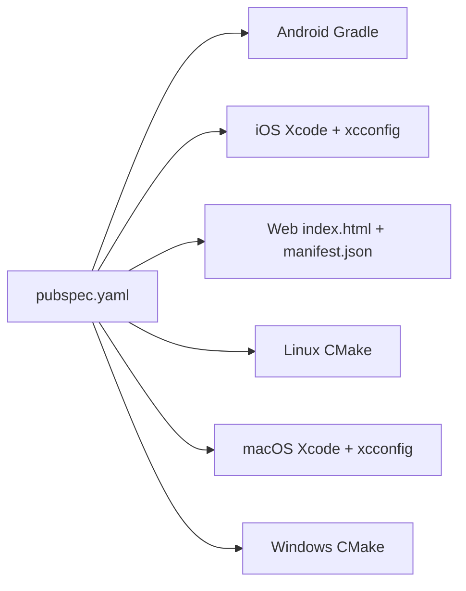

# Platform-Specific Implementation

<cite>
**Referenced Files in This Document**
- [AndroidManifest.xml](file://android/app/src/main/AndroidManifest.xml)
- [MainActivity.kt](file://android/app/src/main/kotlin/com/example/albatal_store/MainActivity.kt)
- [build.gradle.kts](file://android/app/build.gradle.kts)
- [gradle.properties](file://android/gradle.properties)
- [App.swift](file://ios/Runner/AppDelegate.swift)
- [Info.plist](file://ios/Runner/Info.plist)
- [SceneDelegate.swift](file://ios/Runner/SceneDelegate.swift)
- [Debug.xcconfig](file://ios/Flutter/Debug.xcconfig)
- [Release.xcconfig](file://ios/Flutter/Release.xcconfig)
- [main.cc](file://linux/runner/main.cc)
- [my_application.cc](file://linux/runner/my_application.cc)
- [CMakeLists.txt](file://linux/CMakeLists.txt)
- [AppDelegate.swift](file://macos/Runner/AppDelegate.swift)
- [Info.plist](file://macos/Runner/Info.plist)
- [MainFlutterWindow.swift](file://macos/Runner/MainFlutterWindow.swift)
- [DebugProfile.entitlements](file://macos/Runner/DebugProfile.entitlements)
- [Release.entitlements](file://macos/Runner/Release.entitlements)
- [index.html](file://web/index.html)
- [manifest.json](file://web/manifest.json)
- [main.cpp](file://windows/runner/main.cpp)
- [flutter_window.cpp](file://windows/runner/flutter_window.cpp)
- [win32_window.cpp](file://windows/runner/win32_window.cpp)
- [CMakeLists.txt](file://windows/CMakeLists.txt)
- [pubspec.yaml](file://pubspec.yaml)
- [app.dart](file://lib/app.dart)
- [main.dart](file://lib/main.dart)
</cite>

## Table of Contents
1. [Introduction](#introduction)
2. [Project Structure](#project-structure)
3. [Core Components](#core-components)
4. [Architecture Overview](#architecture-overview)
5. [Detailed Component Analysis](#detailed-component-analysis)
6. [Dependency Analysis](#dependency-analysis)
7. [Performance Considerations](#performance-considerations)
8. [Troubleshooting Guide](#troubleshooting-guide)
9. [Conclusion](#conclusion)
10. [Appendices](#appendices)

## Introduction
This document explains platform-specific implementations for Android, iOS, Web, Linux, macOS, and Windows within a Flutter application. It covers configuration files, native integrations, build configurations, signing processes, deployment preparation, permission handling, native feature access, UI rendering differences, performance characteristics, debugging and profiling techniques, cross-platform compatibility patterns, conditional compilation, and guidelines for adding new platforms and testing across targets.

## Project Structure
The repository follows the standard Flutter multi-platform layout:
- android/: Gradle-based Android app with Kotlin entrypoint and manifest
- ios/: Xcode workspace with Swift AppDelegate, Info.plist, and xcconfig files
- web/: HTML entrypoint and web manifest
- linux/: CMake-based desktop target with C++ entrypoints
- macos/: Xcode workspace with Swift AppDelegate and entitlements
- windows/: CMake-based desktop target with Win32 windowing
- lib/: Shared Dart code (entry points main.dart and app.dart)
- pubspec.yaml: Dependencies and assets configuration

**Diagram sources**
- [AndroidManifest.xml](file://android/app/src/main/AndroidManifest.xml)
- [MainActivity.kt](file://android/app/src/main/kotlin/com/example/albatal_store/MainActivity.kt)
- [build.gradle.kts](file://android/app/build.gradle.kts)
- [gradle.properties](file://android/gradle.properties)
- [App.swift](file://ios/Runner/AppDelegate.swift)
- [SceneDelegate.swift](file://ios/Runner/SceneDelegate.swift)
- [Info.plist](file://ios/Runner/Info.plist)
- [Debug.xcconfig](file://ios/Flutter/Debug.xcconfig)
- [Release.xcconfig](file://ios/Flutter/Release.xcconfig)
- [main.cc](file://linux/runner/main.cc)
- [my_application.cc](file://linux/runner/my_application.cc)
- [CMakeLists.txt](file://linux/CMakeLists.txt)
- [AppDelegate.swift](file://macos/Runner/AppDelegate.swift)
- [Info.plist](file://macos/Runner/Info.plist)
- [MainFlutterWindow.swift](file://macos/Runner/MainFlutterWindow.swift)
- [DebugProfile.entitlements](file://macos/Runner/DebugProfile.entitlements)
- [Release.entitlements](file://macos/Runner/Release.entitlements)
- [index.html](file://web/index.html)
- [manifest.json](file://web/manifest.json)
- [main.cpp](file://windows/runner/main.cpp)
- [flutter_window.cpp](file://windows/runner/flutter_window.cpp)
- [win32_window.cpp](file://windows/runner/win32_window.cpp)
- [CMakeLists.txt](file://windows/CMakeLists.txt)
- [pubspec.yaml](file://pubspec.yaml)
- [app.dart](file://lib/app.dart)
- [main.dart](file://lib/main.dart)

**Section sources**
- [pubspec.yaml](file://pubspec.yaml)
- [main.dart](file://lib/main.dart)
- [app.dart](file://lib/app.dart)

## Core Components
- Android
  - Entry point: MainActivity.kt initializes Flutter engine and registers plugins.
  - Permissions and app metadata: AndroidManifest.xml declares permissions, components, and theme.
  - Build: app/build.gradle.kts configures compile options, dependencies, and signing; gradle.properties sets JVM and Gradle settings.
- iOS
  - Entry points: AppDelegate.swift and SceneDelegate.swift manage lifecycle and FlutterViewController.
  - Configuration: Info.plist defines app metadata and usage descriptions; Debug.xcconfig/Release.xcconfig control build settings.
- Web
  - Entrypoint: index.html bootstraps Flutter web runtime; manifest.json provides PWA metadata.
- Linux
  - Entrypoints: main.cc and my_application.cc initialize GTK/Awesome and Flutter Desktop Engine.
  - Build: CMakeLists.txt configures targets and linking.
- macOS
  - Entry points: AppDelegate.swift and MainFlutterWindow.swift manage NSApplication and Flutter window.
  - Entitlements: DebugProfile.entitlements and Release.entitlements define sandbox capabilities.
  - Configuration: Info.plist defines app metadata and usage descriptions.
- Windows
  - Entrypoints: main.cpp, flutter_window.cpp, win32_window.cpp initialize Win32 and Flutter Desktop Engine.
  - Build: CMakeLists.txt configures targets and linking.

Key responsibilities:
- Initialize Flutter engine per platform
- Register platform plugins
- Configure app metadata and permissions
- Provide platform-specific optimizations and behaviors

**Section sources**
- [MainActivity.kt](file://android/app/src/main/kotlin/com/example/albatal_store/MainActivity.kt)
- [AndroidManifest.xml](file://android/app/src/main/AndroidManifest.xml)
- [build.gradle.kts](file://android/app/build.gradle.kts)
- [gradle.properties](file://android/gradle.properties)
- [App.swift](file://ios/Runner/AppDelegate.swift)
- [SceneDelegate.swift](file://ios/Runner/SceneDelegate.swift)
- [Info.plist](file://ios/Runner/Info.plist)
- [Debug.xcconfig](file://ios/Flutter/Debug.xcconfig)
- [Release.xcconfig](file://ios/Flutter/Release.xcconfig)
- [index.html](file://web/index.html)
- [manifest.json](file://web/manifest.json)
- [main.cc](file://linux/runner/main.cc)
- [my_application.cc](file://linux/runner/my_application.cc)
- [CMakeLists.txt](file://linux/CMakeLists.txt)
- [AppDelegate.swift](file://macos/Runner/AppDelegate.swift)
- [MainFlutterWindow.swift](file://macos/Runner/MainFlutterWindow.swift)
- [Info.plist](file://macos/Runner/Info.plist)
- [DebugProfile.entitlements](file://macos/Runner/DebugProfile.entitlements)
- [Release.entitlements](file://macos/Runner/Release.entitlements)
- [main.cpp](file://windows/runner/main.cpp)
- [flutter_window.cpp](file://windows/runner/flutter_window.cpp)
- [win32_window.cpp](file://windows/runner/win32_window.cpp)
- [CMakeLists.txt](file://windows/CMakeLists.txt)

## Architecture Overview
At runtime, each platform’s native host initializes the Flutter engine, loads the compiled Dart snapshot, and renders the shared UI. Platform-specific hosts handle lifecycle events, plugin registration, and OS integration.

**Diagram sources**
- [main.dart](file://lib/main.dart)
- [MainActivity.kt](file://android/app/src/main/kotlin/com/example/albatal_store/MainActivity.kt)
- [App.swift](file://ios/Runner/AppDelegate.swift)
- [SceneDelegate.swift](file://ios/Runner/SceneDelegate.swift)
- [main.cc](file://linux/runner/main.cc)
- [AppDelegate.swift](file://macos/Runner/AppDelegate.swift)
- [main.cpp](file://windows/runner/main.cpp)

## Detailed Component Analysis

### Android
- Configuration and permissions
  - AndroidManifest.xml declares required permissions and app components.
  - Theme and styles are defined under res/values and res/values-night.
- Native integration
  - MainActivity.kt extends FlutterActivity and registers plugins.
- Build and signing
  - app/build.gradle.kts configures compileSdk, minSdk, dependencies, and signingConfigs.
  - gradle.properties sets JVM args and Gradle daemon settings.

**Diagram sources**
- [build.gradle.kts](file://android/app/build.gradle.kts)
- [AndroidManifest.xml](file://android/app/src/main/AndroidManifest.xml)
- [gradle.properties](file://android/gradle.properties)

**Section sources**
- [AndroidManifest.xml](file://android/app/src/main/AndroidManifest.xml)
- [MainActivity.kt](file://android/app/src/main/kotlin/com/example/albatal_store/MainActivity.kt)
- [build.gradle.kts](file://android/app/build.gradle.kts)
- [gradle.properties](file://android/gradle.properties)

### iOS
- Lifecycle and hosting
  - AppDelegate.swift and SceneDelegate.swift manage app lifecycle and present FlutterViewController.
- Configuration
  - Info.plist contains app metadata and usage descriptions for permissions.
  - Debug.xcconfig and Release.xcconfig set build variants and flags.
- Signing and distribution
  - Code signing is configured via Xcode project settings and provisioning profiles.

**Diagram sources**
- [App.swift](file://ios/Runner/AppDelegate.swift)
- [SceneDelegate.swift](file://ios/Runner/SceneDelegate.swift)
- [Info.plist](file://ios/Runner/Info.plist)
- [Debug.xcconfig](file://ios/Flutter/Debug.xcconfig)
- [Release.xcconfig](file://ios/Flutter/Release.xcconfig)

**Section sources**
- [App.swift](file://ios/Runner/AppDelegate.swift)
- [SceneDelegate.swift](file://ios/Runner/SceneDelegate.swift)
- [Info.plist](file://ios/Runner/Info.plist)
- [Debug.xcconfig](file://ios/Flutter/Debug.xcconfig)
- [Release.xcconfig](file://ios/Flutter/Release.xcconfig)

### Web
- Entrypoint and metadata
  - index.html loads Flutter web bootstrap and canvas renderer.
  - manifest.json defines PWA metadata (name, icons, theme).
- Hosting considerations
  - Ensure correct MIME types and caching headers on your server.

**Diagram sources**
- [index.html](file://web/index.html)
- [manifest.json](file://web/manifest.json)

**Section sources**
- [index.html](file://web/index.html)
- [manifest.json](file://web/manifest.json)

### Linux
- Entrypoints and windowing
  - main.cc initializes the application and creates MyApplication.
  - my_application.cc handles window creation and Flutter embedding.
- Build system
  - CMakeLists.txt configures targets, includes, and linking for Flutter Desktop.

**Diagram sources**
- [main.cc](file://linux/runner/main.cc)
- [my_application.cc](file://linux/runner/my_application.cc)
- [CMakeLists.txt](file://linux/CMakeLists.txt)

**Section sources**
- [main.cc](file://linux/runner/main.cc)
- [my_application.cc](file://linux/runner/my_application.cc)
- [CMakeLists.txt](file://linux/CMakeLists.txt)

### macOS
- Entrypoints and windowing
  - AppDelegate.swift manages NSApplication lifecycle.
  - MainFlutterWindow.swift creates the Flutter window.
- Entitlements and configuration
  - DebugProfile.entitlements and Release.entitlements define sandbox capabilities.
  - Info.plist defines app metadata and usage descriptions.

**Diagram sources**
- [AppDelegate.swift](file://macos/Runner/AppDelegate.swift)
- [MainFlutterWindow.swift](file://macos/Runner/MainFlutterWindow.swift)
- [Info.plist](file://macos/Runner/Info.plist)
- [DebugProfile.entitlements](file://macos/Runner/DebugProfile.entitlements)
- [Release.entitlements](file://macos/Runner/Release.entitlements)

**Section sources**
- [AppDelegate.swift](file://macos/Runner/AppDelegate.swift)
- [MainFlutterWindow.swift](file://macos/Runner/MainFlutterWindow.swift)
- [Info.plist](file://macos/Runner/Info.plist)
- [DebugProfile.entitlements](file://macos/Runner/DebugProfile.entitlements)
- [Release.entitlements](file://macos/Runner/Release.entitlements)

### Windows
- Entrypoints and windowing
  - main.cpp initializes Win32 and Flutter Desktop.
  - flutter_window.cpp and win32_window.cpp manage window lifecycle and message loop.
- Build system
  - CMakeLists.txt configures targets and linking for Flutter Desktop.

**Diagram sources**
- [main.cpp](file://windows/runner/main.cpp)
- [flutter_window.cpp](file://windows/runner/flutter_window.cpp)
- [win32_window.cpp](file://windows/runner/win32_window.cpp)
- [CMakeLists.txt](file://windows/CMakeLists.txt)

**Section sources**
- [main.cpp](file://windows/runner/main.cpp)
- [flutter_window.cpp](file://windows/runner/flutter_window.cpp)
- [win32_window.cpp](file://windows/runner/win32_window.cpp)
- [CMakeLists.txt](file://windows/CMakeLists.txt)

## Dependency Analysis
- Cross-platform dependency management
  - pubspec.yaml centralizes Dart packages and asset declarations used by all platforms.
- Platform-specific dependencies
  - Android uses Gradle (build.gradle.kts); iOS/macOS use Xcode projects and xcconfig; Linux/Windows use CMakeLists.txt.
- Plugin registration
  - Each platform generates a GeneratedPluginRegistrant to bridge Dart plugins to native APIs.

**Diagram sources**
- [pubspec.yaml](file://pubspec.yaml)
- [build.gradle.kts](file://android/app/build.gradle.kts)
- [Debug.xcconfig](file://ios/Flutter/Debug.xcconfig)
- [Release.xcconfig](file://ios/Flutter/Release.xcconfig)
- [index.html](file://web/index.html)
- [manifest.json](file://web/manifest.json)
- [CMakeLists.txt](file://linux/CMakeLists.txt)
- [CMakeLists.txt](file://windows/CMakeLists.txt)

**Section sources**
- [pubspec.yaml](file://pubspec.yaml)
- [build.gradle.kts](file://android/app/build.gradle.kts)
- [Debug.xcconfig](file://ios/Flutter/Debug.xcconfig)
- [Release.xcconfig](file://ios/Flutter/Release.xcconfig)
- [index.html](file://web/index.html)
- [manifest.json](file://web/manifest.json)
- [CMakeLists.txt](file://linux/CMakeLists.txt)
- [CMakeLists.txt](file://windows/CMakeLists.txt)

## Performance Considerations
- Android
  - Enable R8/ProGuard shrinking and resource optimization in release builds.
  - Use hardware acceleration and vector drawables; profile with Android Studio Profiler.
- iOS
  - Optimize images and fonts; enable bitcode if needed; profile with Instruments.
- Web
  - Minimize bundle size; leverage lazy loading and service workers; measure with Chrome DevTools.
- Linux/macOS/Windows
  - Prefer GPU-accelerated rendering; avoid heavy synchronous operations on the UI thread; profile with platform profilers.

[No sources needed since this section provides general guidance]

## Troubleshooting Guide
- Android
  - Check AndroidManifest.xml for missing permissions or misconfigured components.
  - Validate Gradle sync and signing configuration in app/build.gradle.kts.
- iOS
  - Verify Info.plist keys for permissions and app metadata.
  - Ensure signing and provisioning profiles match the target environment.
- Web
  - Confirm index.html references correct Flutter bootstrap script and assets path.
  - Inspect browser console and network tab for load errors.
- Linux/macOS/Windows
  - Review CMake configuration and ensure required toolchains are installed.
  - Check platform logs and debugger output for initialization failures.

**Section sources**
- [AndroidManifest.xml](file://android/app/src/main/AndroidManifest.xml)
- [build.gradle.kts](file://android/app/build.gradle.kts)
- [Info.plist](file://ios/Runner/Info.plist)
- [index.html](file://web/index.html)
- [CMakeLists.txt](file://linux/CMakeLists.txt)
- [CMakeLists.txt](file://windows/CMakeLists.txt)

## Conclusion
This guide outlined platform-specific configurations, native integrations, build and signing processes, and deployment preparation across Android, iOS, Web, Linux, macOS, and Windows. It also covered performance tuning, debugging strategies, and cross-platform compatibility patterns. By following these practices, you can maintain consistent behavior while leveraging each platform’s strengths.

[No sources needed since this section summarizes without analyzing specific files]

## Appendices

### Platform Differences: UI Rendering and UX
- Android: Material Design defaults; adaptive layouts and night mode via resources.
- iOS: Human Interface Guidelines; navigation and status bar handled by UIKit.
- Web: Responsive design; consider viewport and touch interactions.
- Linux/macOS/Windows: Native window chrome and DPI scaling; ensure scalable assets.

[No sources needed since this section provides general guidance]

### Conditional Compilation and Platform Detection
- Use Dart’s built-in constants (e.g., kIsWeb) and package_info_plus or platform_detect libraries to branch logic.
- Organize platform-specific code using separate directories and imports guarded by platform checks.

[No sources needed since this section provides general guidance]

### Adding New Platform Support
- Create a new top-level directory (e.g., fuchsia/) with an appropriate host entrypoint and build configuration.
- Add platform-specific configuration files (manifest/plist/CMakeLists) and register plugins.
- Update CI to build and test the new target.

[No sources needed since this section provides general guidance]

### Testing Across Platforms
- Unit tests: Run with dart test.
- Widget tests: Use flutter test.
- Integration tests: Use flutter drive or platform-native integration frameworks.
- Automated builds: Configure GitHub Actions or similar to build for all targets.

[No sources needed since this section provides general guidance]