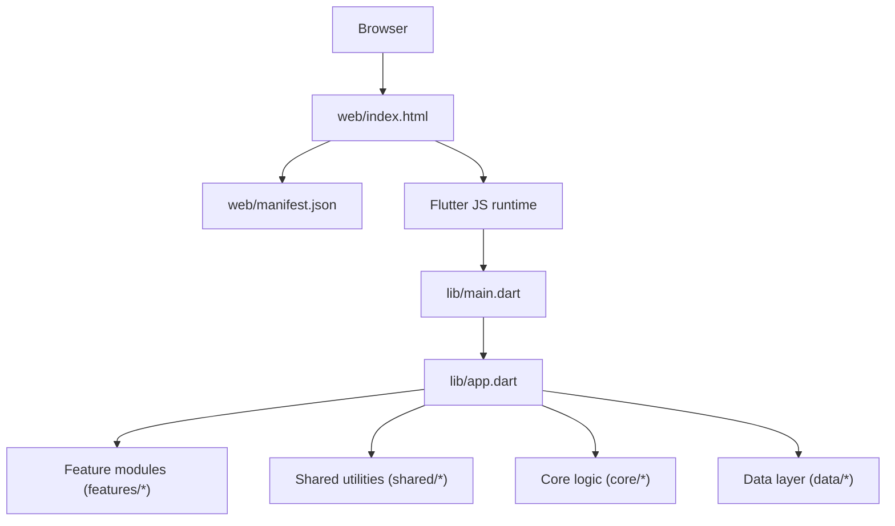
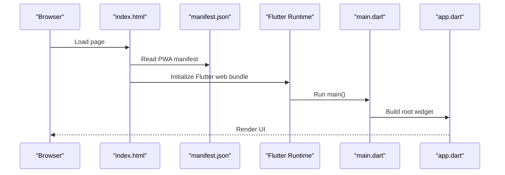
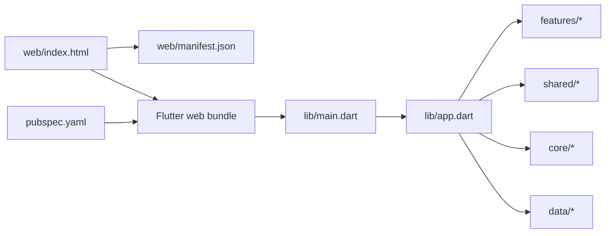

# Web Platform Implementation

<cite>
**Referenced Files in This Document**
- [index.html](file://web/index.html)
- [manifest.json](file://web/manifest.json)
- [pubspec.yaml](file://pubspec.yaml)
- [main.dart](file://lib/main.dart)
- [app.dart](file://lib/app.dart)
</cite>

## Table of Contents
1. [Introduction](#introduction)
2. [Project Structure](#project-structure)
3. [Core Components](#core-components)
4. [Architecture Overview](#architecture-overview)
5. [Detailed Component Analysis](#detailed-component-analysis)
6. [Dependency Analysis](#dependency-analysis)
7. [Performance Considerations](#performance-considerations)
8. [Troubleshooting Guide](#troubleshooting-guide)
9. [Conclusion](#conclusion)
10. [Appendices](#appendices)

## Introduction
This document explains how the Flutter web platform is implemented for this project, focusing on index.html configuration, SEO, PWA manifest integration, performance optimizations, browser compatibility, debugging, deployment, and security headers. It provides actionable guidance to improve web-specific behavior such as lazy loading, code splitting, service workers, push notifications, offline support, caching strategies, and progressive enhancement.

## Project Structure
The web entry points and assets are located under the web directory:
- web/index.html: The HTML shell loaded by the browser
- web/manifest.json: The Progressive Web App manifest
- web/icons: Icons used by the app and OS install prompts
- lib/main.dart and lib/app.dart: Flutter application bootstrap and root widget

[No sources needed since this diagram shows conceptual workflow, not actual code structure]

## Core Components
- web/index.html: Provides the HTML shell, meta tags, theme color, viewport, favicon, and links to the Flutter web bundle. It also integrates the PWA manifest and optional service worker registration.
- web/manifest.json: Declares PWA metadata including name, short_name, description, start_url, display mode, icons, and theme colors.
- pubspec.yaml: Declares dependencies and build options that affect web output size and features.
- lib/main.dart: Bootstraps the Flutter engine and runs the app.
- lib/app.dart: Defines the root widget and global configuration.

Key responsibilities:
- SEO and discoverability via meta tags and structured data
- PWA capabilities via manifest and optional service worker
- Performance via asset optimization, lazy loading, and code splitting
- Compatibility via feature detection and polyfills where necessary

**Section sources**
- [index.html](file://web/index.html)
- [manifest.json](file://web/manifest.json)
- [pubspec.yaml](file://pubspec.yaml)
- [main.dart](file://lib/main.dart)
- [app.dart](file://lib/app.dart)

## Architecture Overview
The web architecture follows a standard Flutter web pattern:
- The browser loads index.html
- index.html references the compiled Flutter web artifacts and the PWA manifest
- Flutter initializes and renders the app defined in main.dart and app.dart
- Feature modules and shared components compose the UI and business logic
- Optional service worker handles caching, background sync, and push notifications

**Diagram sources**
- [index.html](file://web/index.html)
- [manifest.json](file://web/manifest.json)
- [main.dart](file://lib/main.dart)
- [app.dart](file://lib/app.dart)

## Detailed Component Analysis

### index.html Configuration
Responsibilities:
- Set document title, charset, viewport, and theme color
- Provide SEO meta tags (description, canonical URL, Open Graph, Twitter Card)
- Link favicon and Apple touch icon
- Reference the Flutter web bundle and PWA manifest
- Optionally register a service worker for offline and push features

Best practices:
- Use semantic meta tags for SEO and social sharing
- Ensure theme_color matches your brand and PWA theme
- Include rel="icon" and apple-touch-icon for better UX on mobile
- Keep the HTML minimal to reduce initial payload

SEO checklist:
- Unique <title> per route if possible
- Descriptive <meta name="description">
- Canonical link to avoid duplicate content
- Open Graph and Twitter Card tags for rich previews
- Structured data (JSON-LD) for products or organization info

Accessibility:
- Ensure sufficient contrast for theme color
- Provide meaningful alt text for any images referenced here
- Avoid blocking resources on critical path

**Section sources**
- [index.html](file://web/index.html)

### manifest.json Setup (PWA)
Purpose:
- Define app identity and installation behavior
- Configure display mode, start URL, and icons
- Set theme and background colors for immersive experience

Recommended fields:
- name, short_name, description
- start_url pointing to the app entry
- display set to standalone or fullscreen
- icons array with multiple sizes for various devices
- theme_color and background_color
- orientation preference if applicable

Icons:
- Provide at least 192x192 and 512x512 PNGs
- Ensure no transparency issues for splash screens
- Validate with Lighthouse PWA checks

Security:
- Serve manifest over HTTPS
- Ensure correct MIME type (application/manifest+json)

**Section sources**
- [manifest.json](file://web/manifest.json)

### Service Worker, Push Notifications, and Offline
Service worker role:
- Cache static assets and API responses for offline use
- Intercept navigation and network requests
- Handle background sync and periodic tasks
- Enable push notifications when combined with server-side endpoints

Implementation approach:
- Register the service worker from index.html after Flutter bootstraps
- Use a precache strategy for core assets and a cache-first or network-first strategy for dynamic content
- Implement versioning and cache busting to avoid stale caches
- For push notifications, integrate with a backend provider and handle messages in the service worker

Offline UX:
- Show an offline banner when connectivity is lost
- Queue actions (e.g., cart updates) and sync when online
- Provide clear feedback during background operations

Push notifications:
- Request user permission
- Subscribe to push topics
- Display notifications even when the app is closed (browser-dependent)

**Section sources**
- [index.html](file://web/index.html)
- [manifest.json](file://web/manifest.json)

### Lazy Loading and Code Splitting
Strategies:
- Route-based code splitting to load only required code per route
- Lazy-load heavy widgets or libraries on demand
- Defer non-critical scripts and styles
- Use image formats like WebP/AVIF and responsive srcset

Flutter-specific tips:
- Prefer deferred imports for large libraries
- Minimize initial bundle by excluding unused plugins
- Use build modes appropriate for production (release)

Bundle size reduction:
- Remove debug symbols and enable minification
- Tree-shake unused code
- Optimize assets (compress images, fonts)

**Section sources**
- [pubspec.yaml](file://pubspec.yaml)
- [main.dart](file://lib/main.dart)
- [app.dart](file://lib/app.dart)

### Browser Compatibility, Polyfills, and Feature Detection
Compatibility:
- Target modern browsers; provide fallbacks for older ones
- Test on Chrome, Firefox, Safari, Edge, and mobile browsers

Polyfills:
- Add polyfills only when needed (e.g., Promise, fetch)
- Keep polyfill usage minimal to preserve performance

Feature detection:
- Detect service worker availability before registering
- Check for push notification APIs before requesting permissions
- Gracefully degrade features when unavailable

**Section sources**
- [index.html](file://web/index.html)

### Debugging Techniques
Using Developer Tools:
- Network tab: Inspect resource loading, waterfall, and cache hits
- Application tab: View cache storage, service worker status, and manifest
- Performance tab: Analyze frame times, script evaluation, and layout
- Console: Watch for errors and warnings
- Lighthouse: Run audits for performance, accessibility, best practices, and SEO

Common checks:
- Verify correct MIME types and compression
- Confirm service worker registration and lifecycle events
- Validate manifest fields and icon sizes
- Review cache policies and versioning

**Section sources**
- [index.html](file://web/index.html)
- [manifest.json](file://web/manifest.json)

### Deployment Strategies, CDN, and Security Headers
Deployment:
- Build release artifacts and deploy to a static host or CDN
- Use environment-specific configurations for staging and production

CDN configuration:
- Enable HTTP/2 or HTTP/3
- Set long-term cache headers for immutable assets with content hashing
- Use gzip or Brotli compression
- Configure CORS for API calls if needed

Security headers:
- Content-Security-Policy to restrict resource loading
- Strict-Transport-Security to enforce HTTPS
- Referrer-Policy to control referrer information
- Permissions-Policy to limit browser features
- X-Content-Type-Options to prevent MIME sniffing

HTTPS:
- Always serve over HTTPS for PWA features and security

**Section sources**
- [index.html](file://web/index.html)
- [manifest.json](file://web/manifest.json)

### Web-Specific Performance Optimizations
Caching strategies:
- Precache essential assets for fast first load
- Use cache-first for static assets and network-first for dynamic data
- Implement cache versioning and cleanup

Progressive enhancement:
- Ensure core functionality works without JavaScript where feasible
- Provide meaningful fallbacks for advanced features
- Prioritize above-the-fold content and critical CSS

Resource hints:
- Preconnect to critical origins
- Prefetch or preload key resources judiciously

Metrics:
- Track First Contentful Paint, Largest Contentful Paint, Time to Interactive, and Cumulative Layout Shift
- Monitor bundle size and dependency footprint

**Section sources**
- [index.html](file://web/index.html)
- [pubspec.yaml](file://pubspec.yaml)

## Dependency Analysis
High-level relationships:
- index.html depends on manifest.json and the Flutter web bundle
- main.dart initializes the Flutter engine and builds app.dart
- app.dart composes feature modules and shared utilities
- pubspec.yaml influences build outputs and available web features

**Diagram sources**
- [index.html](file://web/index.html)
- [manifest.json](file://web/manifest.json)
- [main.dart](file://lib/main.dart)
- [app.dart](file://lib/app.dart)
- [pubspec.yaml](file://pubspec.yaml)

**Section sources**
- [index.html](file://web/index.html)
- [manifest.json](file://web/manifest.json)
- [main.dart](file://lib/main.dart)
- [app.dart](file://lib/app.dart)
- [pubspec.yaml](file://pubspec.yaml)

## Performance Considerations
- Reduce initial payload by enabling minification and tree-shaking
- Use efficient image formats and responsive images
- Implement route-based code splitting and lazy loading
- Apply effective caching and cache invalidation strategies
- Monitor and optimize Core Web Vitals
- Avoid heavy synchronous work on the main thread

[No sources needed since this section provides general guidance]

## Troubleshooting Guide
Common issues and resolutions:
- Service worker not registering: Check HTTPS, MIME types, and console errors
- PWA not installing: Validate manifest fields, icon sizes, and start_url
- Stale assets: Ensure cache busting and proper cache-control headers
- Slow first load: Analyze bundle size, defer non-critical code, and optimize assets
- Push notifications failing: Verify permissions, subscription flow, and server endpoint

Debugging steps:
- Use Lighthouse to identify performance and PWA issues
- Inspect Application tab for cache and service worker state
- Review Network tab for failed requests and inefficient loading
- Validate SEO meta tags and structured data

**Section sources**
- [index.html](file://web/index.html)
- [manifest.json](file://web/manifest.json)

## Conclusion
A robust Flutter web implementation hinges on a well-configured index.html, a complete PWA manifest, thoughtful performance optimizations, and strong deployment and security practices. By applying the strategies outlined here—lazy loading, code splitting, caching, feature detection, and thorough debugging—you can deliver a fast, reliable, and engaging web experience across devices and browsers.

[No sources needed since this section summarizes without analyzing specific files]

## Appendices

### Checklist for Web Readiness
- SEO meta tags and structured data configured
- PWA manifest validated with correct icons and display mode
- Service worker registered and tested for offline and push
- HTTPS enforced and security headers set
- CDN configured with compression and caching
- Performance audited with Lighthouse and Core Web Vitals targets met
- Accessibility verified and keyboard navigation tested

[No sources needed since this section provides general guidance]