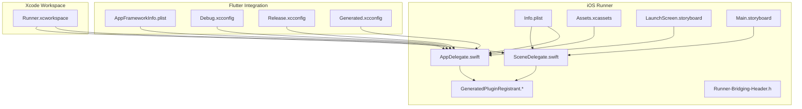
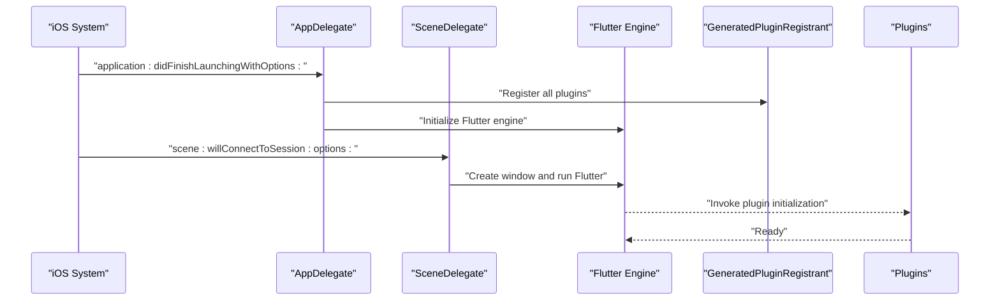
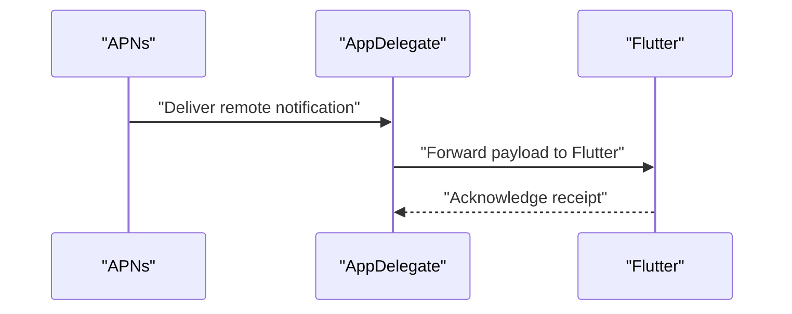
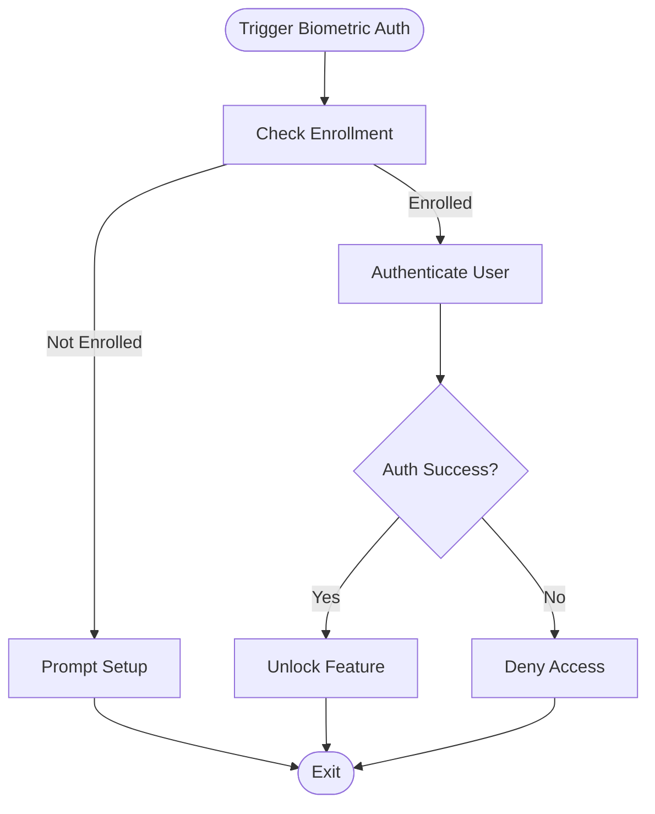
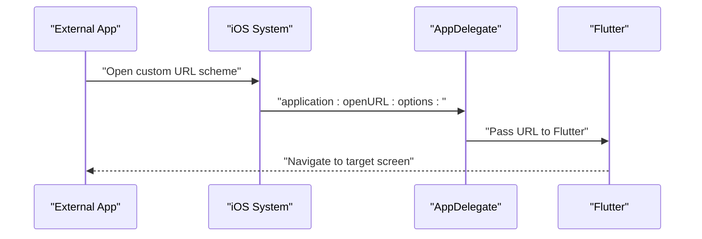
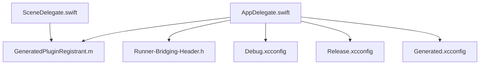

# iOS Platform Implementation

<cite>
**Referenced Files in This Document**
- [AppDelegate.swift](file://ios/Runner/AppDelegate.swift)
- [SceneDelegate.swift](file://ios/Runner/SceneDelegate.swift)
- [Info.plist](file://ios/Runner/Info.plist)
- [AppIcon Contents.json](file://ios/Runner/Assets.xcassets/AppIcon.appiconset/Contents.json)
- [LaunchImage Contents.json](file://ios/Runner/Assets.xcassets/LaunchImage.imageset/Contents.json)
- [LaunchScreen.storyboard](file://ios/Runner/Base.lproj/LaunchScreen.storyboard)
- [Main.storyboard](file://ios/Runner/Base.lproj/Main.storyboard)
- [GeneratedPluginRegistrant.h](file://ios/Runner/GeneratedPluginRegistrant.h)
- [GeneratedPluginRegistrant.m](file://ios/Runner/GeneratedPluginRegistrant.m)
- [Runner-Bridging-Header.h](file://ios/Runner/Runner-Bridging-Header.h)
- [AppFrameworkInfo.plist](file://ios/Flutter/AppFrameworkInfo.plist)
- [Debug.xcconfig](file://ios/Flutter/Debug.xcconfig)
- [Release.xcconfig](file://ios/Flutter/Release.xcconfig)
- [Generated.xcconfig](file://ios/Flutter/Generated.xcconfig)
- [Workspace Settings](file://ios/Runner.xcworkspace/xcshareddata/WorkspaceSettings.xcsettings)
- [Workspace Data](file://ios/Runner.xcworkspace/contents.xcworkspacedata)
</cite>

## Table of Contents
1. [Introduction](#introduction)
2. [Project Structure](#project-structure)
3. [Core Components](#core-components)
4. [Architecture Overview](#architecture-overview)
5. [Detailed Component Analysis](#detailed-component-analysis)
6. [Dependency Analysis](#dependency-analysis)
7. [Performance Considerations](#performance-considerations)
8. [Troubleshooting Guide](#troubleshooting-guide)
9. [Conclusion](#conclusion)
10. [Appendices](#appendices)

## Introduction
This document explains the iOS platform implementation for a Flutter application, focusing on native lifecycle integration, configuration, assets, and platform-specific features. It covers AppDelegate and SceneDelegate responsibilities, Info.plist settings, Xcode workspace setup, Swift Package Manager integration, asset management, and practical examples for push notifications, biometric authentication, and deep linking. It also includes debugging techniques, code signing and distribution guidance, performance optimization tips, and App Store review compliance considerations.

## Project Structure
The iOS project is located under ios/Runner and integrates with Flutter’s build system via xcconfig files and generated plugin registrants. Key directories and files include:
- Runner entry points: AppDelegate.swift and SceneDelegate.swift
- Configuration: Info.plist and Flutter xcconfig files
- Assets: Assets.xcassets (app icons and launch images), LaunchScreen.storyboard, Main.storyboard
- Plugin bridge: GeneratedPluginRegistrant and bridging header
- Workspace: Runner.xcworkspace with shared settings

**Diagram sources**
- [AppDelegate.swift](file://ios/Runner/AppDelegate.swift)
- [SceneDelegate.swift](file://ios/Runner/SceneDelegate.swift)
- [Info.plist](file://ios/Runner/Info.plist)
- [AppIcon Contents.json](file://ios/Runner/Assets.xcassets/AppIcon.appiconset/Contents.json)
- [LaunchImage Contents.json](file://ios/Runner/Assets.xcassets/LaunchImage.imageset/Contents.json)
- [LaunchScreen.storyboard](file://ios/Runner/Base.lproj/LaunchScreen.storyboard)
- [Main.storyboard](file://ios/Runner/Base.lproj/Main.storyboard)
- [GeneratedPluginRegistrant.h](file://ios/Runner/GeneratedPluginRegistrant.h)
- [GeneratedPluginRegistrant.m](file://ios/Runner/GeneratedPluginRegistrant.m)
- [Runner-Bridging-Header.h](file://ios/Runner/Runner-Bridging-Header.h)
- [AppFrameworkInfo.plist](file://ios/Flutter/AppFrameworkInfo.plist)
- [Debug.xcconfig](file://ios/Flutter/Debug.xcconfig)
- [Release.xcconfig](file://ios/Flutter/Release.xcconfig)
- [Generated.xcconfig](file://ios/Flutter/Generated.xcconfig)
- [Workspace Settings](file://ios/Runner.xcworkspace/xcshareddata/WorkspaceSettings.xcsettings)
- [Workspace Data](file://ios/Runner.xcworkspace/contents.xcworkspacedata)

**Section sources**
- [AppDelegate.swift](file://ios/Runner/AppDelegate.swift)
- [SceneDelegate.swift](file://ios/Runner/SceneDelegate.swift)
- [Info.plist](file://ios/Runner/Info.plist)
- [AppIcon Contents.json](file://ios/Runner/Assets.xcassets/AppIcon.appiconset/Contents.json)
- [LaunchImage Contents.json](file://ios/Runner/Assets.xcassets/LaunchImage.imageset/Contents.json)
- [LaunchScreen.storyboard](file://ios/Runner/Base.lproj/LaunchScreen.storyboard)
- [Main.storyboard](file://ios/Runner/Base.lproj/Main.storyboard)
- [GeneratedPluginRegistrant.h](file://ios/Runner/GeneratedPluginRegistrant.h)
- [GeneratedPluginRegistrant.m](file://ios/Runner/GeneratedPluginRegistrant.m)
- [Runner-Bridging-Header.h](file://ios/Runner/Runner-Bridging-Header.h)
- [AppFrameworkInfo.plist](file://ios/Flutter/AppFrameworkInfo.plist)
- [Debug.xcconfig](file://ios/Flutter/Debug.xcconfig)
- [Release.xcconfig](file://ios/Flutter/Release.xcconfig)
- [Generated.xcconfig](file://ios/Flutter/Generated.xcconfig)
- [Workspace Settings](file://ios/Runner.xcworkspace/xcshareddata/WorkspaceSettings.xcsettings)
- [Workspace Data](file://ios/Runner.xcworkspace/contents.xcworkspacedata)

## Core Components
- AppDelegate.swift: Initializes Flutter engine, registers plugins, and handles app-level events such as background tasks and URL scheme routing.
- SceneDelegate.swift: Manages window lifecycle and scene transitions for iOS 13+ multi-scene support; typically delegates UI to Flutter.
- Info.plist: Declares app metadata, permissions, capabilities, and URL schemes required by the app and plugins.
- Assets.xcassets: Centralized asset catalog for app icons and launch images.
- Storyboards: LaunchScreen.storyboard for initial splash; Main.storyboard for any native UI (if used).
- GeneratedPluginRegistrant: Automatically generated code that registers Flutter plugins at runtime.
- Bridging Header: Allows Swift code to import Objective-C headers when needed.
- xcconfig files: Configure build settings for Debug/Release and environment variables.

**Section sources**
- [AppDelegate.swift](file://ios/Runner/AppDelegate.swift)
- [SceneDelegate.swift](file://ios/Runner/SceneDelegate.swift)
- [Info.plist](file://ios/Runner/Info.plist)
- [AppIcon Contents.json](file://ios/Runner/Assets.xcassets/AppIcon.appiconset/Contents.json)
- [LaunchImage Contents.json](file://ios/Runner/Assets.xcassets/LaunchImage.imageset/Contents.json)
- [LaunchScreen.storyboard](file://ios/Runner/Base.lproj/LaunchScreen.storyboard)
- [Main.storyboard](file://ios/Runner/Base.lproj/Main.storyboard)
- [GeneratedPluginRegistrant.h](file://ios/Runner/GeneratedPluginRegistrant.h)
- [GeneratedPluginRegistrant.m](file://ios/Runner/GeneratedPluginRegistrant.m)
- [Runner-Bridging-Header.h](file://ios/Runner/Runner-Bridging-Header.h)
- [Debug.xcconfig](file://ios/Flutter/Debug.xcconfig)
- [Release.xcconfig](file://ios/Flutter/Release.xcconfig)
- [Generated.xcconfig](file://ios/Flutter/Generated.xcconfig)

## Architecture Overview
At runtime, iOS launches the app through AppDelegate, which sets up the Flutter engine and registers plugins. For iOS 13+, SceneDelegate manages scenes and windows, while Flutter renders the UI. Info.plist provides essential metadata and permission declarations. The generated plugin registrant ensures third-party plugins are initialized automatically.

**Diagram sources**
- [AppDelegate.swift](file://ios/Runner/AppDelegate.swift)
- [SceneDelegate.swift](file://ios/Runner/SceneDelegate.swift)
- [GeneratedPluginRegistrant.h](file://ios/Runner/GeneratedPluginRegistrant.h)
- [GeneratedPluginRegistrant.m](file://ios/Runner/GeneratedPluginRegistrant.m)

## Detailed Component Analysis

### AppDelegate.swift
Responsibilities:
- Initialize Flutter engine and ensure plugins are registered before Flutter starts.
- Handle app lifecycle callbacks (foreground/background, termination).
- Process incoming URLs and route them to Flutter if needed.
- Integrate with system services (e.g., push notifications, background fetch) by forwarding events to Flutter or handling them natively.

Key patterns:
- Use standard iOS app delegate methods to integrate with system services.
- Keep Flutter initialization minimal and fast to reduce cold start time.
- Avoid heavy work in didReceiveRemoteNotification unless necessary; prefer background processing APIs.

Best practices:
- Defer non-critical initialization until after Flutter is ready.
- Ensure thread safety when interacting with native SDKs from multiple threads.
- Log important lifecycle transitions for debugging.

**Section sources**
- [AppDelegate.swift](file://ios/Runner/AppDelegate.swift)

### SceneDelegate.swift
Responsibilities:
- Manage scene lifecycle for iOS 13+.
- Create and configure UIWindow for Flutter rendering.
- Forward scene events to Flutter if custom behavior is required.

Key patterns:
- Use scene:willConnectToSession:options: to set up the root view controller (typically Flutter’s).
- Handle scene restoration and reconnection gracefully.

Best practices:
- Keep scene setup lightweight; rely on Flutter for UI.
- Avoid blocking operations during scene connection.

**Section sources**
- [SceneDelegate.swift](file://ios/Runner/SceneDelegate.swift)

### Info.plist Configuration
Common keys and their roles:
- Application name and version: CFBundleName, CFBundleShortVersionString, CFBundleVersion
- Bundle identifier: CFBundleIdentifier
- Supported interface orientations: UISupportedInterfaceOrientations
- Background modes: UIBackgroundModes (e.g., audio, location, fetch)
- Permissions: NSCameraUsageDescription, NSMicrophoneUsageDescription, NSPhotoLibraryUsageDescription, etc.
- Capabilities: Associated Domains, Push Notifications, Background Modes
- URL schemes: CFBundleURLTypes for deep linking
- Privacy manifests and usage descriptions for modern iOS versions

Guidelines:
- Provide clear, user-facing usage descriptions for privacy-sensitive permissions.
- Only request permissions when necessary and explain why.
- Validate URL schemes to avoid conflicts with other apps.

**Section sources**
- [Info.plist](file://ios/Runner/Info.plist)

### Asset Management
- App Icons: Managed via Assets.xcassets/AppIcon.appiconset/Contents.json. Ensure all required sizes are present for different devices and App Store requirements.
- Launch Images: Managed via Assets.xcassets/LaunchImage.imageset/Contents.json. Provide high-resolution images for various screen densities.
- Launch Screen: LaunchScreen.storyboard can be used for a native splash screen; keep it simple to minimize startup time.

Recommendations:
- Prefer vector-based assets where possible.
- Use adaptive icon configurations for modern iOS versions.
- Test launch experience across device types and orientations.

**Section sources**
- [AppIcon Contents.json](file://ios/Runner/Assets.xcassets/AppIcon.appiconset/Contents.json)
- [LaunchImage Contents.json](file://ios/Runner/Assets.xcassets/LaunchImage.imageset/Contents.json)
- [LaunchScreen.storyboard](file://ios/Runner/Base.lproj/LaunchScreen.storyboard)

### Xcode Workspace Setup and Project Configuration
- Open ios/Runner.xcworkspace to use the correct workspace configuration.
- Verify deployment target matches your minimum supported iOS version.
- Check Build Settings for architecture targets (arm64, arm64e) and code signing identities.
- Use xcconfig files to manage environment-specific settings (Debug vs Release).

Swift Package Manager Integration:
- Add packages via Xcode > File > Add Packages.
- Ensure package compatibility with your deployment target.
- Resolve dependencies and verify build targets.

**Section sources**
- [Workspace Settings](file://ios/Runner.xcworkspace/xcshareddata/WorkspaceSettings.xcsettings)
- [Workspace Data](file://ios/Runner.xcworkspace/contents.xcworkspacedata)
- [Debug.xcconfig](file://ios/Flutter/Debug.xcconfig)
- [Release.xcconfig](file://ios/Flutter/Release.xcconfig)
- [Generated.xcconfig](file://ios/Flutter/Generated.xcconfig)

### iOS-Specific Features Examples

#### Push Notifications
- Enable Push Notifications capability in Xcode.
- Register for remote notifications in AppDelegate.
- Handle didReceiveRemoteNotification and handleEventsForBackgroundURLSession as needed.
- Forward notification payloads to Flutter for UI updates.

**Diagram sources**
- [AppDelegate.swift](file://ios/Runner/AppDelegate.swift)

#### Biometric Authentication
- Use LocalAuthentication framework to prompt Face ID/Touch ID.
- Request access and handle errors gracefully (user cancel, enrollment missing).
- Secure sensitive data using the keychain and associate with biometric policy.

[No sources needed since this diagram shows conceptual workflow, not actual code structure]

#### Deep Linking
- Define URL schemes in Info.plist under CFBundleURLTypes.
- Implement application:openURL:options: in AppDelegate to parse and route URLs.
- Pass the URL to Flutter to navigate to specific screens.

**Diagram sources**
- [AppDelegate.swift](file://ios/Runner/AppDelegate.swift)
- [Info.plist](file://ios/Runner/Info.plist)

### Debugging Techniques
- Xcode Debugger: Set breakpoints in AppDelegate and SceneDelegate; inspect logs and state during app lifecycle.
- Instruments:
  - Time Profiler: Identify CPU bottlenecks.
  - Allocations/Memory Graph: Detect memory leaks and retain cycles.
  - Leaks: Find objects retained unexpectedly.
- Logging: Use os_log for structured logging; enable debug builds with verbose logs.

Tips:
- Use “Debug Workflow” to attach to running processes.
- Profile on real devices for accurate performance insights.
- Monitor network requests with Network link conditioner and HTTP traffic tools.

**Section sources**
- [AppDelegate.swift](file://ios/Runner/AppDelegate.swift)
- [SceneDelegate.swift](file://ios/Runner/SceneDelegate.swift)

### Code Signing, IPA Building, and Distribution
- Configure code signing identities and provisioning profiles in Xcode.
- Select appropriate build configuration (Debug/Release) and archive the app.
- Export IPA and upload to App Store Connect for distribution.
- Use TestFlight for beta testing; distribute internal and external testers.

Compliance:
- Ensure privacy manifest entries match usage descriptions.
- Follow App Store Review Guidelines for permissions and data handling.
- Validate app metadata and screenshots for store listing.

**Section sources**
- [Info.plist](file://ios/Runner/Info.plist)

### iOS-Specific Optimizations and Memory Management
- Minimize work in app startup; defer heavy initialization.
- Use lazy loading for large assets and views.
- Avoid strong reference cycles; use weak references in closures and delegates.
- Prefer value types and immutable data structures where feasible.
- Profile memory usage regularly; fix leaks promptly.

**Section sources**
- [AppDelegate.swift](file://ios/Runner/AppDelegate.swift)
- [SceneDelegate.swift](file://ios/Runner/SceneDelegate.swift)

## Dependency Analysis
The iOS layer depends on Flutter’s generated plugin registrant and xcconfig files for build settings. The bridging header enables Swift-to-Objective-C interoperability when required.

**Diagram sources**
- [AppDelegate.swift](file://ios/Runner/AppDelegate.swift)
- [SceneDelegate.swift](file://ios/Runner/SceneDelegate.swift)
- [GeneratedPluginRegistrant.m](file://ios/Runner/GeneratedPluginRegistrant.m)
- [Runner-Bridging-Header.h](file://ios/Runner/Runner-Bridging-Header.h)
- [Debug.xcconfig](file://ios/Flutter/Debug.xcconfig)
- [Release.xcconfig](file://ios/Flutter/Release.xcconfig)
- [Generated.xcconfig](file://ios/Flutter/Generated.xcconfig)

**Section sources**
- [GeneratedPluginRegistrant.h](file://ios/Runner/GeneratedPluginRegistrant.h)
- [GeneratedPluginRegistrant.m](file://ios/Runner/GeneratedPluginRegistrant.m)
- [Runner-Bridging-Header.h](file://ios/Runner/Runner-Bridging-Header.h)
- [Debug.xcconfig](file://ios/Flutter/Debug.xcconfig)
- [Release.xcconfig](file://ios/Flutter/Release.xcconfig)
- [Generated.xcconfig](file://ios/Flutter/Generated.xcconfig)

## Performance Considerations
- Startup time: Keep AppDelegate and SceneDelegate minimal; move heavy work off the main thread.
- Rendering: Rely on Flutter for UI; avoid unnecessary native view controllers.
- Networking: Use efficient caching strategies and batch requests.
- Memory: Profile with Instruments; resolve leaks early.
- Background tasks: Use appropriate background modes and respect system limits.

[No sources needed since this section provides general guidance]

## Troubleshooting Guide
Common issues and resolutions:
- Permission denied: Verify Info.plist usage descriptions and user prompts.
- Push notifications not received: Check capability configuration and APNs certificates; validate payload format.
- Deep links not handled: Confirm URL schemes in Info.plist and AppDelegate routing logic.
- Build failures: Inspect xcconfig settings and ensure compatible deployment targets.

**Section sources**
- [Info.plist](file://ios/Runner/Info.plist)
- [AppDelegate.swift](file://ios/Runner/AppDelegate.swift)

## Conclusion
This iOS implementation integrates Flutter seamlessly through AppDelegate and SceneDelegate, uses Info.plist for configuration and permissions, and leverages xcconfig for build settings. Proper asset management, feature implementations (push notifications, biometrics, deep linking), debugging workflows, and distribution practices ensure a robust and compliant app. Continuous profiling and adherence to App Store guidelines will maintain quality and performance.

[No sources needed since this section summarizes without analyzing specific files]

## Appendices

### Example: Adding a New Capability
- Enable the desired capability in Xcode (e.g., Push Notifications).
- Update Info.plist with required keys and usage descriptions.
- Implement corresponding handlers in AppDelegate or SceneDelegate.
- Test on a real device and validate behavior.

[No sources needed since this section provides general guidance]