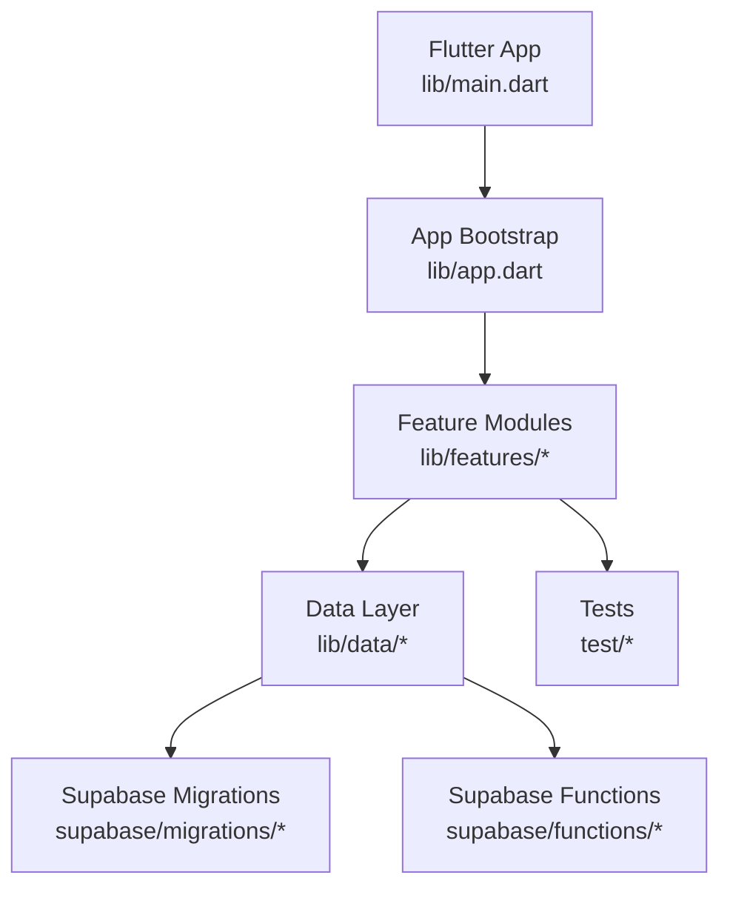
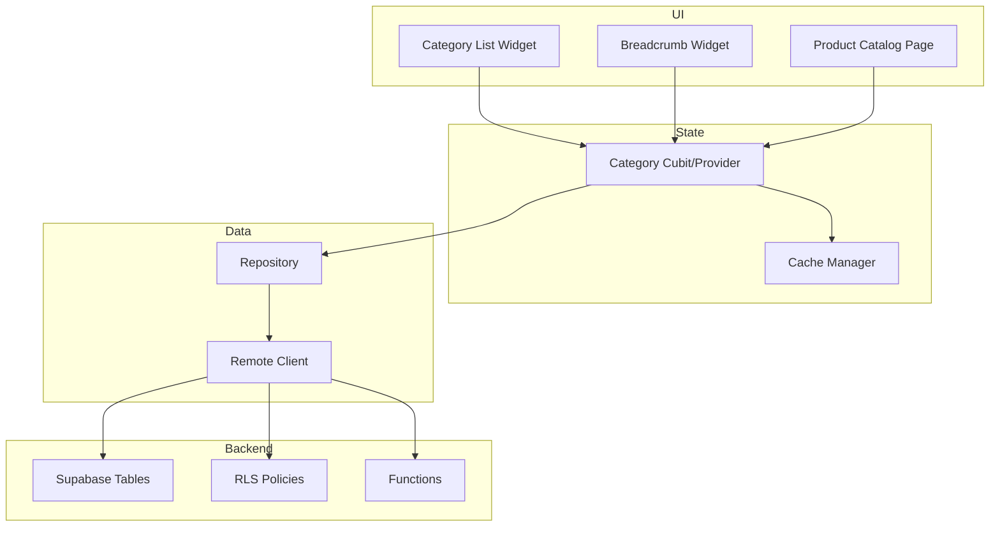
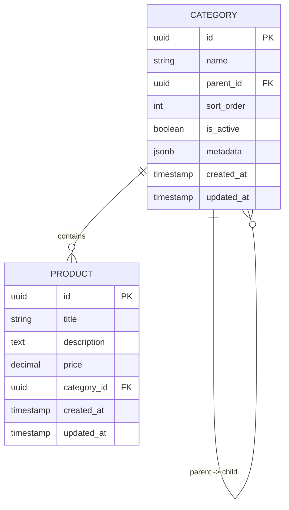
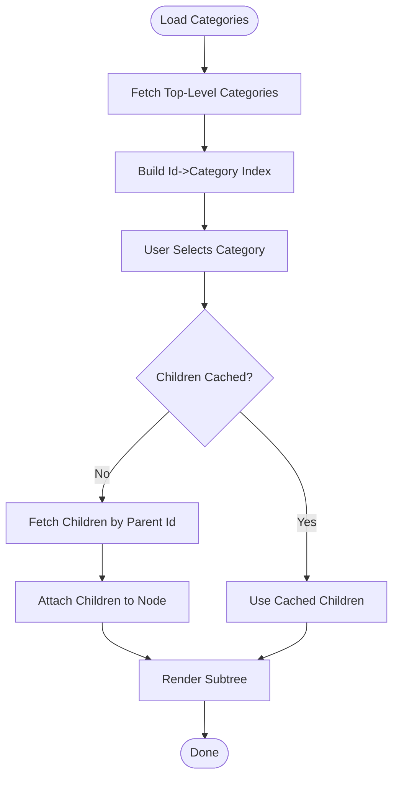
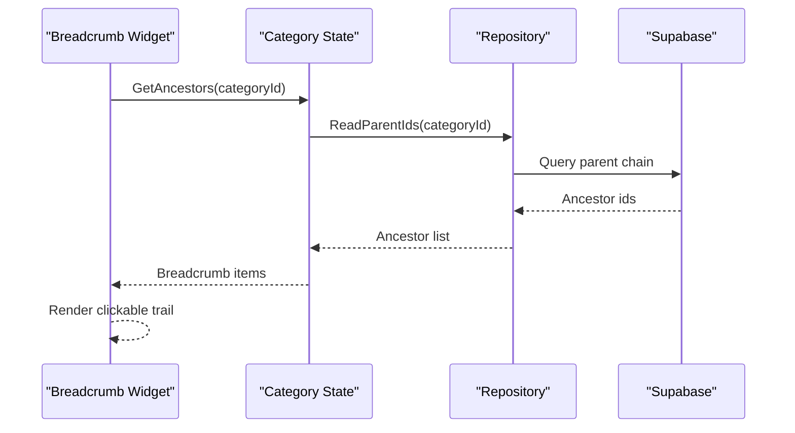
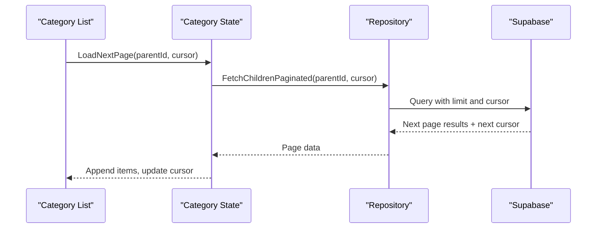
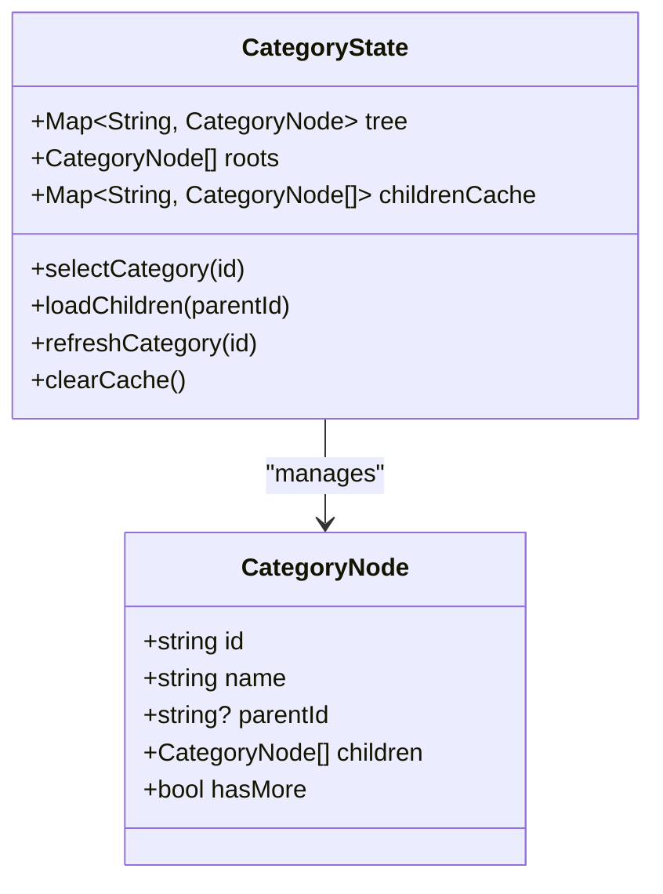
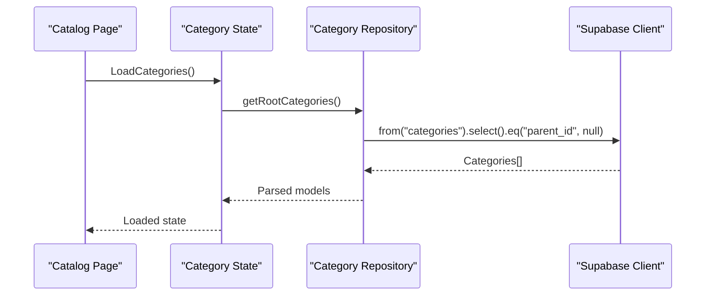
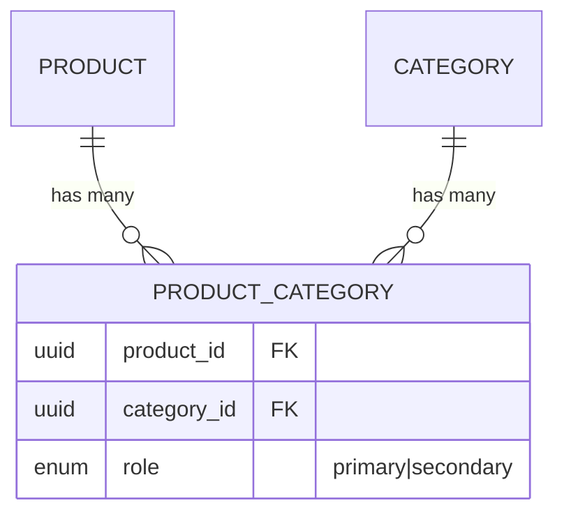
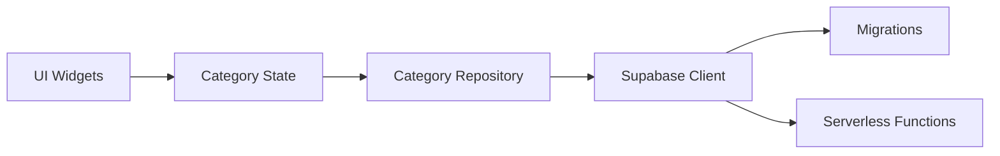

# Category Management

<cite>
**Referenced Files in This Document**
- [README.md](file://README.md)
- [pubspec.yaml](file://pubspec.yaml)
- [lib/main.dart](file://lib/main.dart)
- [lib/app.dart](file://lib/app.dart)
- [supabase/migrations/001_initial_schema.sql](file://supabase/migrations/001_initial_schema.sql)
- [supabase/migrations/002_rls_policies.sql](file://supabase/migrations/002_rls_policies.sql)
- [supabase/migrations/003_auth_profiles_and_hardening.sql](file://supabase/migrations/003_auth_profiles_and_hardening.sql)
- [supabase/migrations/004_stock_function.sql](file://supabase/migrations/004_stock_function.sql)
- [supabase/migrations/005_storage_buckets.sql](file://supabase/migrations/005_storage_buckets.sql)
- [supabase/migrations/006_payments_table.sql](file://supabase/migrations/006_payments_table.sql)
- [supabase/migrations/007_stock_increment_function.sql](file://supabase/migrations/007_stock_increment_function.sql)
- [supabase/migrations/008_order_fulfillment.sql](file://supabase/migrations/008_order_fulfillment.sql)
- [supabase/migrations/009_shipping_zones.sql](file://supabase/migrations/009_shipping_zones.sql)
- [supabase/migrations/010_notifications_analytics.sql](file://supabase/migrations/010_notifications_analytics.sql)
- [supabase/migrations/011_orders_idempotency_and_expiry.sql](file://supabase/migrations/011_orders_idempotency_and_expiry.sql)
- [supabase/functions/checkout/index.ts](file://supabase/functions/checkout/index.ts)
- [supabase/functions/paymob-initiate/index.ts](file://supabase/functions/paymob-initiate/index.ts)
- [supabase/functions/paymob-order/index.ts](file://supabase/functions/paymob-order/index.ts)
- [supabase/functions/paymob-payment-key/index.ts](file://supabase/functions/paymob-payment-key/index.ts)
- [supabase/functions/paymob-auth/index.ts](file://supabase/functions/paymob-auth/index.ts)
- [supabase/functions/paymob-callback/index.ts](file://supabase/functions/paymob-callback/index.ts)
- [supabase/functions/send-order-notification/index.ts](file://supabase/functions/send-order-notification/index.ts)
- [supabase/functions/cancel-expired-orders/index.ts](file://supabase/functions/cancel-expired-orders/index.ts)
- [test/catalog_cubit_test.dart](file://test/catalog_cubit_test.dart)
- [test/catalog_states_test.dart](file://test/catalog_states_test.dart)
- [test/product_detail_test.dart](file://test/product_detail_test.dart)
- [test/integration_test.dart](file://test/integration_test.dart)
</cite>

## Table of Contents
1. [Introduction](#introduction)
2. [Project Structure](#project-structure)
3. [Core Components](#core-components)
4. [Architecture Overview](#architecture-overview)
5. [Detailed Component Analysis](#detailed-component-analysis)
6. [Dependency Analysis](#dependency-analysis)
7. [Performance Considerations](#performance-considerations)
8. [Troubleshooting Guide](#troubleshooting-guide)
9. [Conclusion](#conclusion)
10. [Appendices](#appendices)

## Introduction
This document explains the category management system for the store application, focusing on hierarchical categories, navigation patterns, and relationships with products. It covers how category trees are represented, how breadcrumbs are constructed, and how dynamic loading is implemented. It also documents database schema elements relevant to categories, API integration patterns, state management considerations, performance strategies for deep hierarchies, caching approaches, and guidelines for extending category types and implementing recommendations.

## Project Structure
The project follows a Flutter architecture with feature-oriented organization under lib/features and shared utilities under lib/shared. The data layer integrates with Supabase via migrations and serverless functions. Tests validate catalog behavior and UI flows.

[No sources needed since this diagram shows conceptual workflow, not actual code structure]

**Section sources**
- [README.md](file://README.md)
- [pubspec.yaml](file://pubspec.yaml)
- [lib/main.dart](file://lib/main.dart)
- [lib/app.dart](file://lib/app.dart)

## Core Components
- Category model: Represents a node in the category hierarchy with fields such as id, name, parent reference, sort order, visibility flags, and metadata.
- Category tree builder: Assembles flat category lists into nested trees using parent-child relationships.
- Navigation helpers: Build breadcrumb paths by traversing from a leaf category up to root nodes.
- Dynamic loader: Fetches categories on demand (e.g., children of a selected category) to support large catalogs.
- State manager: Holds current selection, loaded subtrees, and cache entries; exposes methods to load, refresh, and navigate.
- Product-category mapping: Associates products with one or more categories through a join table or foreign key(s).

Key responsibilities:
- Maintain a consistent representation of the category graph.
- Provide efficient queries for immediate children and full ancestry.
- Keep UI responsive by lazy-loading deeper levels.
- Ensure consistency between cached states and remote data.

[No sources needed since this section provides general guidance]

## Architecture Overview
The category system spans UI, state, data, and backend layers. UI components request categories from the state manager, which coordinates with the data layer to fetch from Supabase. Serverless functions may orchestrate complex operations like checkout that indirectly rely on product-category associations.

[No sources needed since this diagram shows conceptual workflow, not actual code structure]

## Detailed Component Analysis

### Category Data Model and Relationships
- Category entity includes identifiers, display attributes, ordering, and optional metadata.
- Parent-child relationships are modeled via a self-referencing foreign key on the category table.
- Products link to categories via a dedicated association table or a direct foreign key on the product table.

**Diagram sources**
- [supabase/migrations/001_initial_schema.sql](file://supabase/migrations/001_initial_schema.sql)

**Section sources**
- [supabase/migrations/001_initial_schema.sql](file://supabase/migrations/001_initial_schema.sql)

### Category Tree Construction
- Load top-level categories (where parent is null).
- For each selected category, fetch its children on demand.
- Build an in-memory tree by indexing categories by id and linking children to parents.
- Memoize subtrees to avoid recomputation when navigating back and forth.

[No sources needed since this diagram shows conceptual workflow, not actual code structure]

### Breadcrumb Navigation
- Starting from a leaf category, traverse parent references until reaching a root.
- Reverse the path to present a left-to-right breadcrumb trail.
- Each breadcrumb item should be clickable to navigate to the corresponding category view.

[No sources needed since this diagram shows conceptual workflow, not actual code structure]

### Dynamic Loading and Pagination
- Implement pagination for large category sets at each level.
- Use cursor-based or offset-based pagination depending on dataset size and query complexity.
- Debounce rapid navigations to prevent redundant requests.

[No sources needed since this diagram shows conceptual workflow, not actual code structure]

### State Management for Category Hierarchies
- Maintain separate caches for:
  - Root categories
  - Child pages per parent
  - Ancestry chains for breadcrumbs
- Expose actions:
  - selectCategory(id)
  - loadChildren(parentId)
  - refreshCategory(id)
  - clearCache()
- Emit UI-friendly states:
  - initial
  - loading
  - loaded
  - error

[No sources needed since this diagram shows conceptual workflow, not actual code structure]

### API Integration Patterns
- Repository methods encapsulate Supabase calls for categories and their relations.
- Error handling maps network/database errors to user-facing messages.
- Retry policies and timeouts are configured for robustness.

[No sources needed since this diagram shows conceptual workflow, not actual code structure]

### Relationship Mapping Between Categories and Products
- Products can belong to one primary category and optionally multiple secondary categories via a join table.
- Queries for “products in category” use joins or filtered selects based on schema design.
- Recommendations can leverage shared category membership across products.

[No sources needed since this diagram shows conceptual workflow, not actual code structure]

## Dependency Analysis
- UI depends on state managers for category data and actions.
- State managers depend on repositories for data access.
- Repositories depend on Supabase client and functions.
- Migrations define schema constraints and indexes critical for performance.

[No sources needed since this diagram shows conceptual workflow, not actual code structure]

**Section sources**
- [supabase/migrations/001_initial_schema.sql](file://supabase/migrations/001_initial_schema.sql)
- [supabase/migrations/002_rls_policies.sql](file://supabase/migrations/002_rls_policies.sql)
- [supabase/functions/checkout/index.ts](file://supabase/functions/checkout/index.ts)

## Performance Considerations
- Indexing:
  - Add indexes on category.parent_id for fast child lookups.
  - Add indexes on product.category_id and any join tables for efficient filtering.
- Lazy loading:
  - Only load immediate children; defer deeper levels until requested.
- Caching:
  - Cache subtrees keyed by parent id; invalidate on updates.
  - Store breadcrumbs for recently visited categories.
- Pagination:
  - Use cursor-based pagination for large category lists.
- Concurrency:
  - Coalesce concurrent requests for the same parent to a single network call.
- Real-time updates:
  - Subscribe to category changes via Supabase real-time channels; merge incremental updates into local cache.
- Deep trees:
  - Limit default depth rendered; provide “load more” controls.
  - Precompute ancestor paths for frequently accessed categories.

[No sources needed since this section provides general guidance]

## Troubleshooting Guide
Common issues and resolutions:
- Missing parent references:
  - Validate RLS policies and ensure parent_id constraints are enforced.
- Stale cache:
  - Implement explicit refresh actions and invalidation on mutations.
- Slow navigation:
  - Verify indexes exist on parent_id and product-category keys.
- Permission errors:
  - Review RLS policies for read/write access on categories and related tables.
- Inconsistent breadcrumbs:
  - Ensure ancestry traversal handles missing parents gracefully and falls back to partial paths.

**Section sources**
- [supabase/migrations/002_rls_policies.sql](file://supabase/migrations/002_rls_policies.sql)
- [supabase/migrations/001_initial_schema.sql](file://supabase/migrations/001_initial_schema.sql)

## Conclusion
The category management system centers around a well-defined hierarchical model, efficient lazy loading, and robust state management. By leveraging proper indexing, caching, and real-time subscriptions, the app can handle deep category trees and deliver responsive navigation. Extending category types and enabling recommendations are straightforward with the established data model and repository abstractions.

[No sources needed since this section summarizes without analyzing specific files]

## Appendices

### Guidelines for Adding New Category Types
- Extend the category metadata field to include type-specific attributes.
- Introduce validation rules in the repository layer to enforce type constraints.
- Update UI components to render type-specific badges or filters.
- Adjust recommendation logic to consider category type when computing similarity.

[No sources needed since this section provides general guidance]

### Implementing Category-Based Recommendations
- Compute co-occurrence matrices from product-category associations.
- Surface “related products” by intersecting category memberships.
- Cache recommendation results per category to reduce computation.

[No sources needed since this section provides general guidance]

### Optimizing Category Navigation UX
- Provide instant feedback during loading with skeletons or spinners.
- Persist last-selected category per session for quick resumption.
- Offer search and filter overlays to jump directly to deep categories.

[No sources needed since this section provides general guidance]