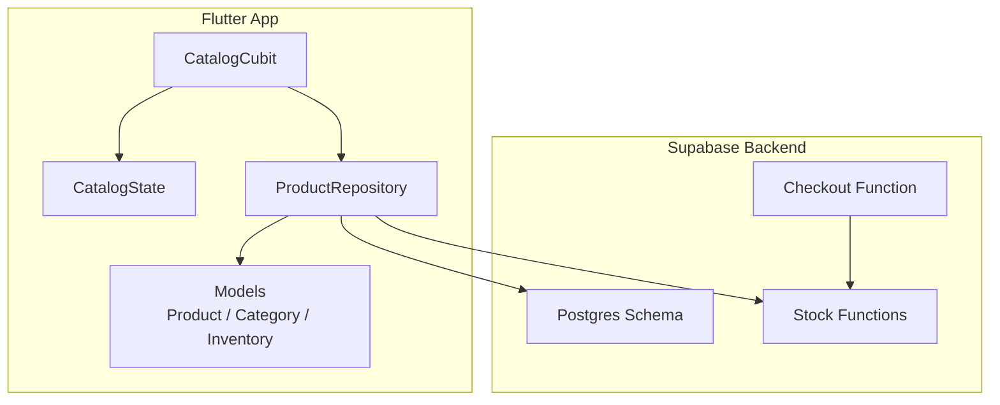
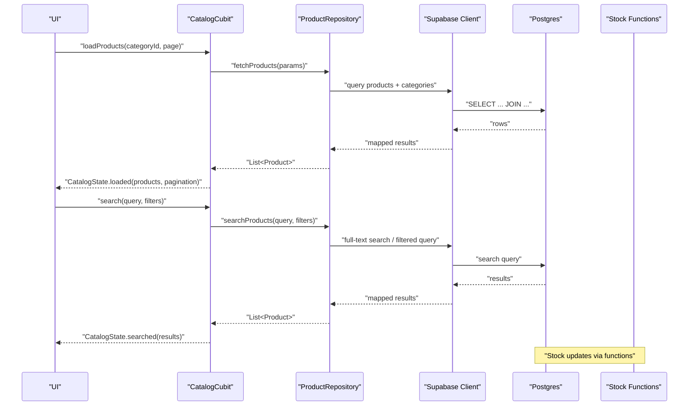
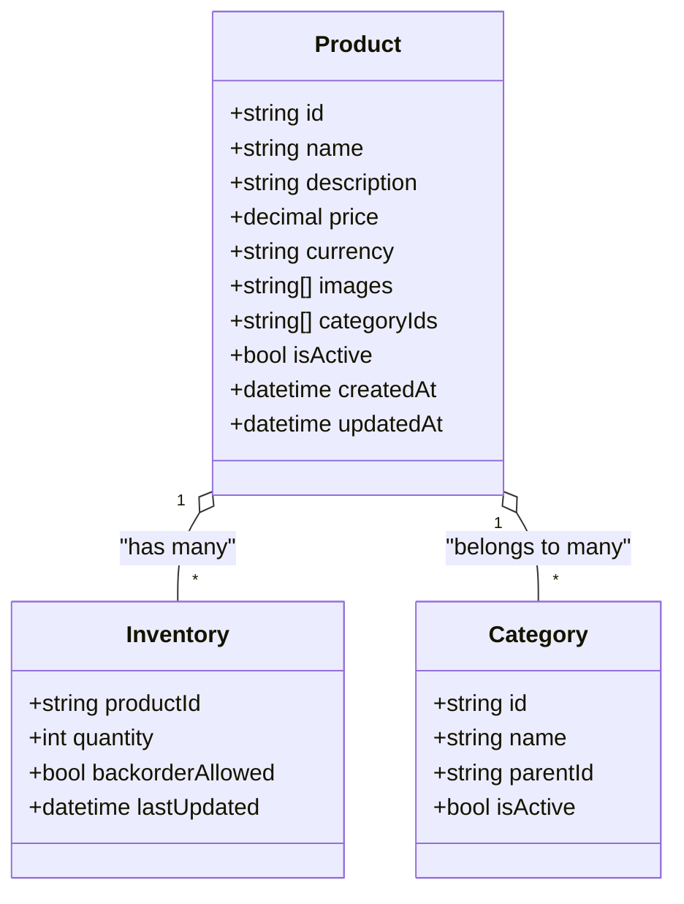
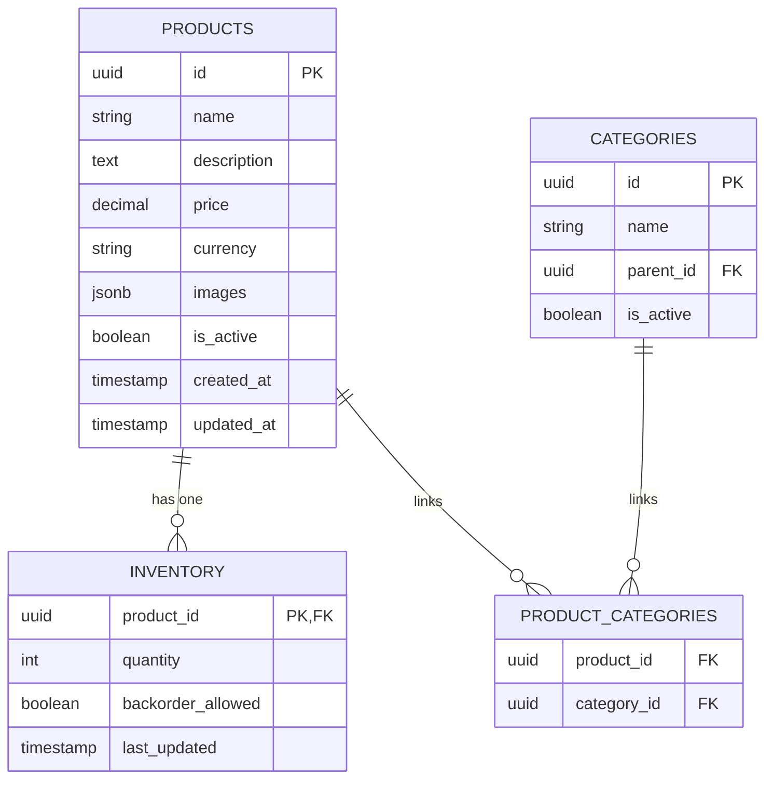
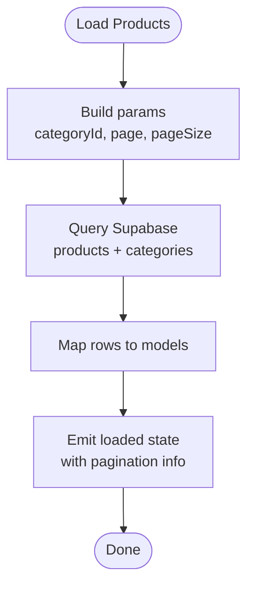
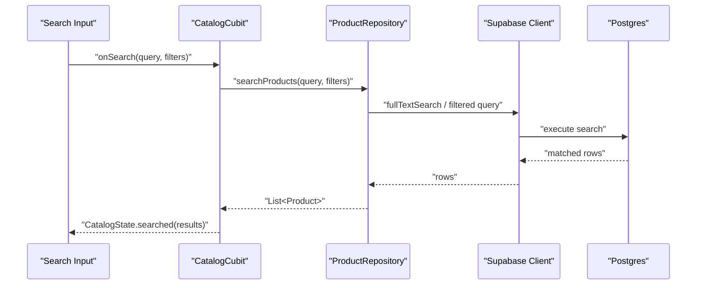
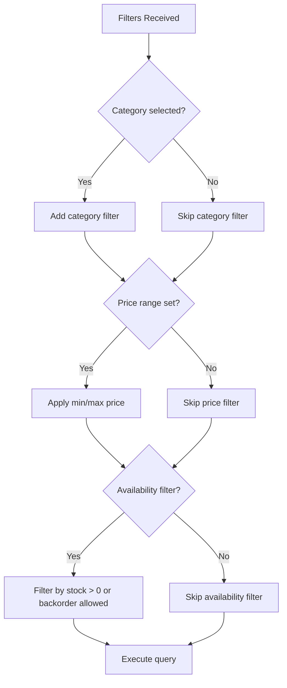
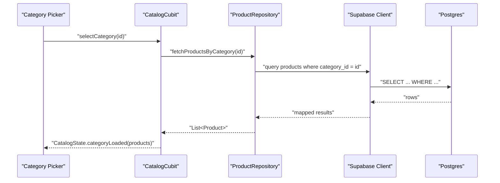
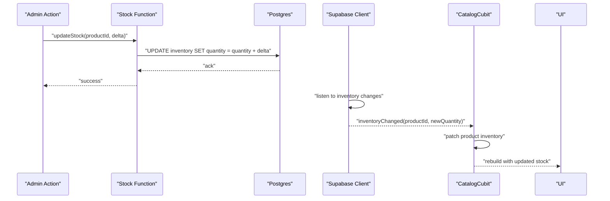
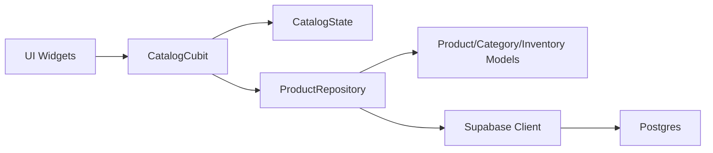

# Product Catalog

<cite>
**Referenced Files in This Document**
- [lib/features/catalog/cubit/catalog_cubit.dart](file://lib/features/catalog/cubit/catalog_cubit.dart)
- [lib/features/catalog/cubit/catalog_state.dart](file://lib/features/catalog/cubit/catalog_state.dart)
- [lib/features/catalog/repository/product_repository.dart](file://lib/features/catalog/repository/product_repository.dart)
- [lib/features/catalog/models/product_model.dart](file://lib/features/catalog/models/product_model.dart)
- [lib/features/catalog/models/category_model.dart](file://lib/features/catalog/models/category_model.dart)
- [lib/features/catalog/models/inventory_model.dart](file://lib/features/catalog/models/inventory_model.dart)
- [supabase/migrations/001_initial_schema.sql](file://supabase/migrations/001_initial_schema.sql)
- [supabase/migrations/004_stock_function.sql](file://supabase/migrations/004_stock_function.sql)
- [supabase/migrations/007_stock_increment_function.sql](file://supabase/migrations/007_stock_increment_function.sql)
- [supabase/functions/checkout/index.ts](file://supabase/functions/checkout/index.ts)
- [test/catalog_cubit_test.dart](file://test/catalog_cubit_test.dart)
- [test/catalog_states_test.dart](file://test/catalog_states_test.dart)
</cite>

## Table of Contents
1. [Introduction](#introduction)
2. [Project Structure](#project-structure)
3. [Core Components](#core-components)
4. [Architecture Overview](#architecture-overview)
5. [Detailed Component Analysis](#detailed-component-analysis)
6. [Dependency Analysis](#dependency-analysis)
7. [Performance Considerations](#performance-considerations)
8. [Troubleshooting Guide](#troubleshooting-guide)
9. [Conclusion](#conclusion)
10. [Appendices](#appendices)

## Introduction
This document explains the product catalog feature, including browsing, search, filtering, and category navigation. It covers data models for products, categories, and inventory; database schema and relationships; pagination strategies; image loading optimization; real-time inventory updates; performance considerations for large catalogs; caching and search optimization; and guidelines for extending attributes, advanced search, and media assets.

## Project Structure
The catalog feature is implemented using a clean architecture with clear separation between UI state (Cubit), repository/data access, and domain models. The backend uses Supabase migrations for schema and functions for stock operations.

**Diagram sources**
- [lib/features/catalog/cubit/catalog_cubit.dart](file://lib/features/catalog/cubit/catalog_cubit.dart)
- [lib/features/catalog/cubit/catalog_state.dart](file://lib/features/catalog/cubit/catalog_state.dart)
- [lib/features/catalog/repository/product_repository.dart](file://lib/features/catalog/repository/product_repository.dart)
- [lib/features/catalog/models/product_model.dart](file://lib/features/catalog/models/product_model.dart)
- [lib/features/catalog/models/category_model.dart](file://lib/features/catalog/models/category_model.dart)
- [lib/features/catalog/models/inventory_model.dart](file://lib/features/catalog/models/inventory_model.dart)
- [supabase/migrations/001_initial_schema.sql](file://supabase/migrations/001_initial_schema.sql)
- [supabase/migrations/004_stock_function.sql](file://supabase/migrations/004_stock_function.sql)
- [supabase/migrations/007_stock_increment_function.sql](file://supabase/migrations/007_stock_increment_function.sql)
- [supabase/functions/checkout/index.ts](file://supabase/functions/checkout/index.ts)

**Section sources**
- [lib/features/catalog/cubit/catalog_cubit.dart](file://lib/features/catalog/cubit/catalog_cubit.dart)
- [lib/features/catalog/cubit/catalog_state.dart](file://lib/features/catalog/cubit/catalog_state.dart)
- [lib/features/catalog/repository/product_repository.dart](file://lib/features/catalog/repository/product_repository.dart)
- [lib/features/catalog/models/product_model.dart](file://lib/features/catalog/models/product_model.dart)
- [lib/features/catalog/models/category_model.dart](file://lib/features/catalog/models/category_model.dart)
- [lib/features/catalog/models/inventory_model.dart](file://lib/features/catalog/models/inventory_model.dart)
- [supabase/migrations/001_initial_schema.sql](file://supabase/migrations/001_initial_schema.sql)
- [supabase/migrations/004_stock_function.sql](file://supabase/migrations/004_stock_function.sql)
- [supabase/migrations/007_stock_increment_function.sql](file://supabase/migrations/007_stock_increment_function.sql)
- [supabase/functions/checkout/index.ts](file://supabase/functions/checkout/index.ts)

## Core Components
- CatalogCubit: Manages catalog state, triggers load/search/filter/pagination, and coordinates with the repository.
- CatalogState: Holds current list, filters, search query, pagination info, and loading/error flags.
- ProductRepository: Encapsulates data fetching from Supabase, applies server-side or client-side filtering as appropriate, and maps to domain models.
- Domain Models: Product, Category, and Inventory entities used across the app.

Key responsibilities:
- Browsing: Load paginated product lists with optional category scope.
- Search: Apply text search queries against product fields.
- Filtering: Filter by category, price range, availability, etc.
- Pagination: Fetch next pages efficiently without re-fetching entire datasets.
- Real-time inventory: Subscribe to stock changes and update UI accordingly.

**Section sources**
- [lib/features/catalog/cubit/catalog_cubit.dart](file://lib/features/catalog/cubit/catalog_cubit.dart)
- [lib/features/catalog/cubit/catalog_state.dart](file://lib/features/catalog/cubit/catalog_state.dart)
- [lib/features/catalog/repository/product_repository.dart](file://lib/features/catalog/repository/product_repository.dart)
- [lib/features/catalog/models/product_model.dart](file://lib/features/catalog/models/product_model.dart)
- [lib/features/catalog/models/category_model.dart](file://lib/features/catalog/models/category_model.dart)
- [lib/features/catalog/models/inventory_model.dart](file://lib/features/catalog/models/inventory_model.dart)

## Architecture Overview
The catalog follows a unidirectional data flow: UI events are dispatched to the Cubit, which calls the Repository to fetch or mutate data via Supabase. Responses are mapped to domain models and emitted as new states.

**Diagram sources**
- [lib/features/catalog/cubit/catalog_cubit.dart](file://lib/features/catalog/cubit/catalog_cubit.dart)
- [lib/features/catalog/repository/product_repository.dart](file://lib/features/catalog/repository/product_repository.dart)
- [supabase/migrations/001_initial_schema.sql](file://supabase/migrations/001_initial_schema.sql)
- [supabase/migrations/004_stock_function.sql](file://supabase/migrations/004_stock_function.sql)
- [supabase/migrations/007_stock_increment_function.sql](file://supabase/migrations/007_stock_increment_function.sql)
- [supabase/functions/checkout/index.ts](file://supabase/functions/checkout/index.ts)

## Detailed Component Analysis

### Data Models
- Product: Represents a sellable item with identifiers, metadata, pricing, images, and references to categories and inventory.
- Category: Hierarchical grouping of products.
- Inventory: Tracks stock levels per product and optionally per variant/location.

**Diagram sources**
- [lib/features/catalog/models/product_model.dart](file://lib/features/catalog/models/product_model.dart)
- [lib/features/catalog/models/category_model.dart](file://lib/features/catalog/models/category_model.dart)
- [lib/features/catalog/models/inventory_model.dart](file://lib/features/catalog/models/inventory_model.dart)

**Section sources**
- [lib/features/catalog/models/product_model.dart](file://lib/features/catalog/models/product_model.dart)
- [lib/features/catalog/models/category_model.dart](file://lib/features/catalog/models/category_model.dart)
- [lib/features/catalog/models/inventory_model.dart](file://lib/features/catalog/models/inventory_model.dart)

### Database Schema and Relationships
The schema defines core tables for products, categories, and inventory, along with constraints and indexes to support efficient querying and search.

Notes:
- Indexes on frequently filtered columns (e.g., category_id, is_active).
- Full-text search index on searchable product fields.
- Foreign keys enforce referential integrity between products, categories, and inventory.

**Diagram sources**
- [supabase/migrations/001_initial_schema.sql](file://supabase/migrations/001_initial_schema.sql)

**Section sources**
- [supabase/migrations/001_initial_schema.sql](file://supabase/migrations/001_initial_schema.sql)

### Browsing and Pagination
- The Cubit exposes methods to load initial pages and append subsequent pages.
- Pagination parameters include page number and page size.
- The repository constructs queries that limit and offset results or use keyset pagination if supported by the backend.

**Diagram sources**
- [lib/features/catalog/cubit/catalog_cubit.dart](file://lib/features/catalog/cubit/catalog_cubit.dart)
- [lib/features/catalog/repository/product_repository.dart](file://lib/features/catalog/repository/product_repository.dart)

**Section sources**
- [lib/features/catalog/cubit/catalog_cubit.dart](file://lib/features/catalog/cubit/catalog_cubit.dart)
- [lib/features/catalog/repository/product_repository.dart](file://lib/features/catalog/repository/product_repository.dart)

### Search Functionality
- Search accepts a query string and optional filters (category, price range, availability).
- The repository delegates to a search endpoint or builds a full-text search query.
- Results are merged with category and inventory context before mapping to models.

**Diagram sources**
- [lib/features/catalog/cubit/catalog_cubit.dart](file://lib/features/catalog/cubit/catalog_cubit.dart)
- [lib/features/catalog/repository/product_repository.dart](file://lib/features/catalog/repository/product_repository.dart)
- [supabase/migrations/001_initial_schema.sql](file://supabase/migrations/001_initial_schema.sql)

**Section sources**
- [lib/features/catalog/cubit/catalog_cubit.dart](file://lib/features/catalog/cubit/catalog_cubit.dart)
- [lib/features/catalog/repository/product_repository.dart](file://lib/features/catalog/repository/product_repository.dart)

### Filtering Logic
- Filters include category selection, price range, and availability.
- The repository composes filter conditions into the query.
- For complex filters, consider server-side processing to reduce payload size.

**Diagram sources**
- [lib/features/catalog/repository/product_repository.dart](file://lib/features/catalog/repository/product_repository.dart)

**Section sources**
- [lib/features/catalog/repository/product_repository.dart](file://lib/features/catalog/repository/product_repository.dart)

### Category Navigation
- Categories are fetched and cached locally.
- Selecting a category scopes product queries to that category or its descendants.
- The Cubit emits a state reflecting the active category and refreshed product list.

**Diagram sources**
- [lib/features/catalog/cubit/catalog_cubit.dart](file://lib/features/catalog/cubit/catalog_cubit.dart)
- [lib/features/catalog/repository/product_repository.dart](file://lib/features/catalog/repository/product_repository.dart)
- [supabase/migrations/001_initial_schema.sql](file://supabase/migrations/001_initial_schema.sql)

**Section sources**
- [lib/features/catalog/cubit/catalog_cubit.dart](file://lib/features/catalog/cubit/catalog_cubit.dart)
- [lib/features/catalog/repository/product_repository.dart](file://lib/features/catalog/repository/product_repository.dart)

### Real-time Inventory Updates
- Stock changes are applied through dedicated functions to ensure consistency.
- The app subscribes to inventory changes and updates local state without full refresh.

**Diagram sources**
- [supabase/migrations/004_stock_function.sql](file://supabase/migrations/004_stock_function.sql)
- [supabase/migrations/007_stock_increment_function.sql](file://supabase/migrations/007_stock_increment_function.sql)
- [supabase/functions/checkout/index.ts](file://supabase/functions/checkout/index.ts)
- [lib/features/catalog/cubit/catalog_cubit.dart](file://lib/features/catalog/cubit/catalog_cubit.dart)

**Section sources**
- [supabase/migrations/004_stock_function.sql](file://supabase/migrations/004_stock_function.sql)
- [supabase/migrations/007_stock_increment_function.sql](file://supabase/migrations/007_stock_increment_function.sql)
- [supabase/functions/checkout/index.ts](file://supabase/functions/checkout/index.ts)
- [lib/features/catalog/cubit/catalog_cubit.dart](file://lib/features/catalog/cubit/catalog_cubit.dart)

### Image Loading Optimization
- Use lazy loading and placeholder images while thumbnails load.
- Cache images at the application level to avoid repeated network requests.
- Prefer CDN-hosted images and request optimized sizes based on device density.

[No sources needed since this section provides general guidance]

## Dependency Analysis
The catalog components depend on each other in a layered manner: UI depends on Cubit, Cubit depends on Repository, Repository depends on Models and Supabase.

**Diagram sources**
- [lib/features/catalog/cubit/catalog_cubit.dart](file://lib/features/catalog/cubit/catalog_cubit.dart)
- [lib/features/catalog/cubit/catalog_state.dart](file://lib/features/catalog/cubit/catalog_state.dart)
- [lib/features/catalog/repository/product_repository.dart](file://lib/features/catalog/repository/product_repository.dart)
- [lib/features/catalog/models/product_model.dart](file://lib/features/catalog/models/product_model.dart)
- [lib/features/catalog/models/category_model.dart](file://lib/features/catalog/models/category_model.dart)
- [lib/features/catalog/models/inventory_model.dart](file://lib/features/catalog/models/inventory_model.dart)

**Section sources**
- [lib/features/catalog/cubit/catalog_cubit.dart](file://lib/features/catalog/cubit/catalog_cubit.dart)
- [lib/features/catalog/cubit/catalog_state.dart](file://lib/features/catalog/cubit/catalog_state.dart)
- [lib/features/catalog/repository/product_repository.dart](file://lib/features/catalog/repository/product_repository.dart)
- [lib/features/catalog/models/product_model.dart](file://lib/features/catalog/models/product_model.dart)
- [lib/features/catalog/models/category_model.dart](file://lib/features/catalog/models/category_model.dart)
- [lib/features/catalog/models/inventory_model.dart](file://lib/features/catalog/models/inventory_model.dart)

## Performance Considerations
- Server-side pagination: Use LIMIT/OFFSET or keyset pagination to minimize payloads.
- Indexed queries: Ensure indexes on category_id, is_active, and search vectors.
- Debounced search: Throttle user input to reduce network churn.
- Caching: Cache category trees and recent product lists; invalidate on mutations.
- Image optimization: Request appropriately sized thumbnails; leverage CDN cache headers.
- Batch updates: Coalesce multiple inventory updates to reduce UI rebuilds.
- Avoid N+1 queries: Join related data when possible or batch fetch relations.

[No sources needed since this section provides general guidance]

## Troubleshooting Guide
Common issues and resolutions:
- Empty search results: Verify full-text search index and query normalization.
- Stale inventory: Confirm subscription listeners are active and functions are invoked atomically.
- Slow category navigation: Check query plans and add composite indexes on category joins.
- Memory pressure with large catalogs: Implement virtualized lists and dispose subscriptions.

Validation references:
- Unit tests for Cubit behavior and state transitions.
- Integration points with checkout function to validate stock decrements.

**Section sources**
- [test/catalog_cubit_test.dart](file://test/catalog_cubit_test.dart)
- [test/catalog_states_test.dart](file://test/catalog_states_test.dart)
- [supabase/functions/checkout/index.ts](file://supabase/functions/checkout/index.ts)

## Conclusion
The product catalog feature is structured around a clear separation of concerns: Cubit manages state and orchestration, Repository handles data access, and Models represent domain concepts. The backend leverages Postgres with targeted functions for stock management. With proper indexing, pagination, caching, and image optimization, the system scales well for large catalogs and delivers responsive user experiences.

[No sources needed since this section summarizes without analyzing specific files]

## Appendices

### Adding New Product Attributes
- Extend the Product model with new fields.
- Add corresponding columns in the schema migration.
- Update repository mappings and any search/filter logic.
- Adjust UI widgets to display and edit new attributes.

[No sources needed since this section provides general guidance]

### Implementing Advanced Search Features
- Introduce faceted search by adding indexed fields and aggregations.
- Support multi-language search with language-specific vectors.
- Implement ranking boosts for title, brand, or popularity.

[No sources needed since this section provides general guidance]

### Managing Product Media Assets
- Store images in a storage bucket with RLS policies.
- Generate thumbnails on upload or via CDN transformations.
- Maintain an ordered list of image URLs in the product record.

[No sources needed since this section provides general guidance]