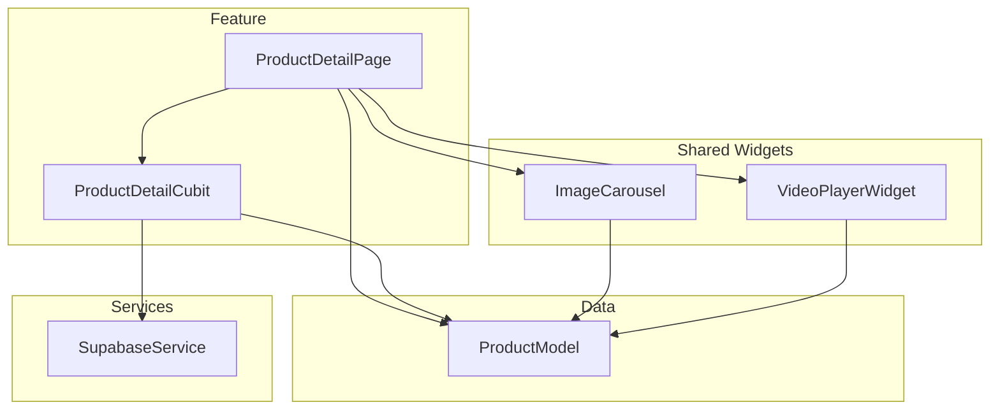
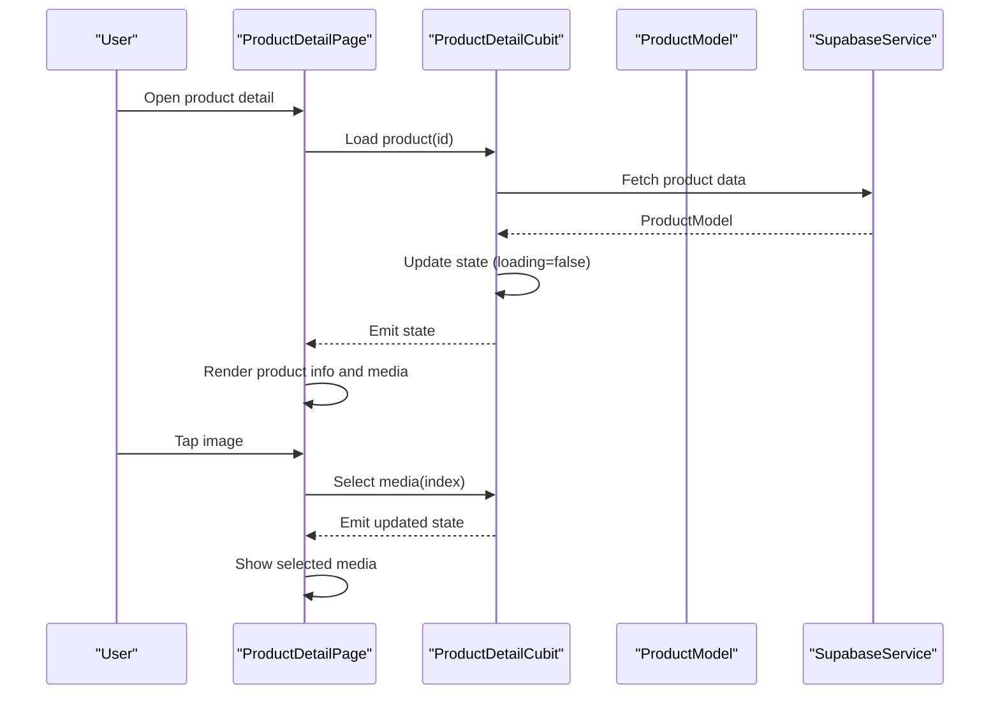
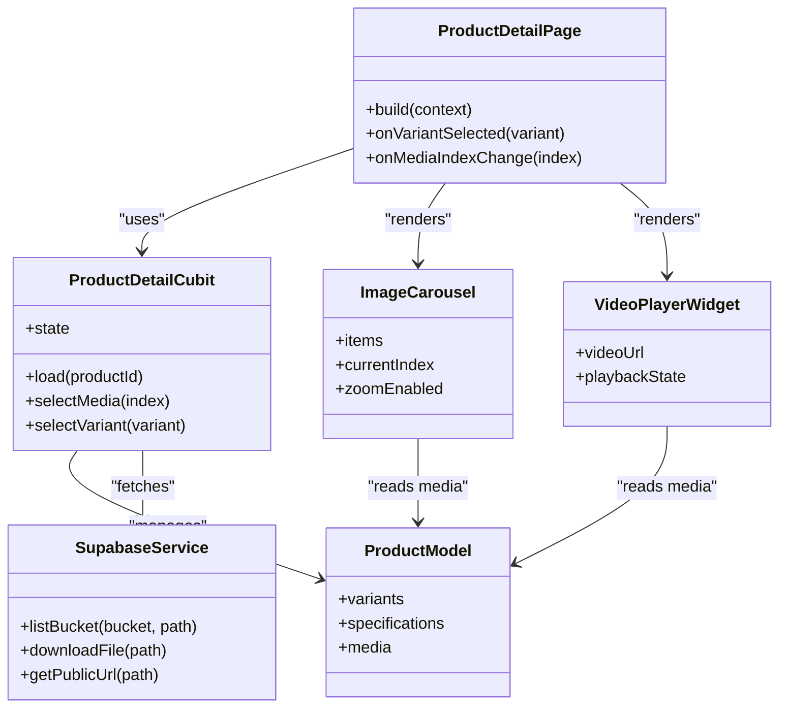

# Product Details & Media

<cite>
**Referenced Files in This Document**
- [lib/features/catalog/product_detail_page.dart](file://lib/features/catalog/product_detail_page.dart)
- [lib/features/catalog/product_detail_cubit.dart](file://lib/features/catalog/product_detail_cubit.dart)
- [lib/data/models/product_model.dart](file://lib/data/models/product_model.dart)
- [lib/shared/widgets/media/image_carousel.dart](file://lib/shared/widgets/media/image_carousel.dart)
- [lib/shared/widgets/media/video_player_widget.dart](file://lib/shared/widgets/media/video_player_widget.dart)
- [lib/core/services/supabase_service.dart](file://lib/core/services/supabase_service.dart)
- [supabase/migrations/005_storage_buckets.sql](file://supabase/migrations/005_storage_buckets.sql)
- [test/product_detail_test.dart](file://test/product_detail_test.dart)
- [test/details_page_test.dart](file://test/details_page_test.dart)
</cite>

## Table of Contents
1. [Introduction](#introduction)
2. [Project Structure](#project-structure)
3. [Core Components](#core-components)
4. [Architecture Overview](#architecture-overview)
5. [Detailed Component Analysis](#detailed-component-analysis)
6. [Dependency Analysis](#dependency-analysis)
7. [Performance Considerations](#performance-considerations)
8. [Accessibility Guide](#accessibility-guide)
9. [Troubleshooting Guide](#troubleshooting-guide)
10. [Conclusion](#conclusion)
11. [Appendices](#appendices)

## Introduction
This document explains the implementation of product detail views and media management in the application. It covers product detail UI, image galleries, video support, rich descriptions, data models (including variants and specifications), integration with Supabase storage for images, lazy loading strategies, optimization techniques for large media, accessibility considerations, keyboard navigation, screen reader compatibility, and guidelines for extending media types and implementing product comparison features.

## Project Structure
The product details feature is organized around a page, a state manager (Cubit), reusable media widgets, and a service layer for Supabase storage. The relevant files are:
- Feature page and state: product detail page and cubit
- Data model: product model including variants and media references
- Shared widgets: image carousel and video player widget
- Service: Supabase integration for storage operations
- Tests: unit and widget tests for product detail behavior

**Diagram sources**
- [lib/features/catalog/product_detail_page.dart](file://lib/features/catalog/product_detail_page.dart)
- [lib/features/catalog/product_detail_cubit.dart](file://lib/features/catalog/product_detail_cubit.dart)
- [lib/shared/widgets/media/image_carousel.dart](file://lib/shared/widgets/media/image_carousel.dart)
- [lib/shared/widgets/media/video_player_widget.dart](file://lib/shared/widgets/media/video_player_widget.dart)
- [lib/data/models/product_model.dart](file://lib/data/models/product_model.dart)
- [lib/core/services/supabase_service.dart](file://lib/core/services/supabase_service.dart)

**Section sources**
- [lib/features/catalog/product_detail_page.dart](file://lib/features/catalog/product_detail_page.dart)
- [lib/features/catalog/product_detail_cubit.dart](file://lib/features/catalog/product_detail_cubit.dart)
- [lib/shared/widgets/media/image_carousel.dart](file://lib/shared/widgets/media/image_carousel.dart)
- [lib/shared/widgets/media/video_player_widget.dart](file://lib/shared/widgets/media/video_player_widget.dart)
- [lib/data/models/product_model.dart](file://lib/data/models/product_model.dart)
- [lib/core/services/supabase_service.dart](file://lib/core/services/supabase_service.dart)

## Core Components
- ProductDetailPage: Renders product information, media gallery, description, and variant selection controls. It listens to the cubit state and rebuilds accordingly.
- ProductDetailCubit: Manages loading states, selected media index, selected variant, and fetches product data from the repository/service layer.
- ImageCarousel: Displays multiple images with swipe or tap navigation, optional zoom overlay, and responsive sizing.
- VideoPlayerWidget: Embeds and plays product videos with play/pause controls and accessibility labels.
- ProductModel: Represents product fields, variants, specifications, and media assets (images/videos).
- SupabaseService: Provides methods to list, download, and manage product media stored in Supabase buckets.

Key responsibilities:
- Decouple UI from data fetching via the cubit
- Reuse media components across pages
- Centralize storage interactions through a service

**Section sources**
- [lib/features/catalog/product_detail_page.dart](file://lib/features/catalog/product_detail_page.dart)
- [lib/features/catalog/product_detail_cubit.dart](file://lib/features/catalog/product_detail_cubit.dart)
- [lib/shared/widgets/media/image_carousel.dart](file://lib/shared/widgets/media/image_carousel.dart)
- [lib/shared/widgets/media/video_player_widget.dart](file://lib/shared/widgets/media/video_player_widget.dart)
- [lib/data/models/product_model.dart](file://lib/data/models/product_model.dart)
- [lib/core/services/supabase_service.dart](file://lib/core/services/supabase_service.dart)

## Architecture Overview
The product detail flow uses a clean separation between presentation and business logic. The page subscribes to the cubit’s state stream; the cubit orchestrates data retrieval and updates local UI state. Media widgets consume the product model and request resources via the Supabase service when needed.

**Diagram sources**
- [lib/features/catalog/product_detail_page.dart](file://lib/features/catalog/product_detail_page.dart)
- [lib/features/catalog/product_detail_cubit.dart](file://lib/features/catalog/product_detail_cubit.dart)
- [lib/data/models/product_model.dart](file://lib/data/models/product_model.dart)
- [lib/core/services/supabase_service.dart](file://lib/core/services/supabase_service.dart)

## Detailed Component Analysis

### Product Detail Page
Responsibilities:
- Display product title, price, description, and variant selectors
- Compose media sections using shared widgets
- Bind user actions to cubit methods (e.g., select variant, change media index)
- Provide semantic labels and keyboard focus order

Implementation highlights:
- Uses cubit state to drive conditional rendering (loading, error, success)
- Delegates media rendering to ImageCarousel and VideoPlayerWidget
- Ensures accessible labels for dynamic content changes

**Section sources**
- [lib/features/catalog/product_detail_page.dart](file://lib/features/catalog/product_detail_page.dart)
- [test/product_detail_test.dart](file://test/product_detail_test.dart)
- [test/details_page_test.dart](file://test/details_page_test.dart)

### Product Detail Cubit
Responsibilities:
- Manage product loading lifecycle
- Track selected media index and active variant
- Handle errors and retry scenarios
- Expose immutable state to the UI

State transitions:
- Initial -> Loading -> Success/Error
- On media interaction -> Updated media index
- On variant selection -> Updated variant state

Error handling:
- Catches network/storage errors and exposes user-friendly messages
- Allows retry by re-invoking load method

**Section sources**
- [lib/features/catalog/product_detail_cubit.dart](file://lib/features/catalog/product_detail_cubit.dart)

### Product Model
Fields and relationships:
- Basic product info (id, name, description, price)
- Variants array (size, color, stock, SKU)
- Specifications map or list (key-value pairs)
- Media assets (images and videos) with URLs or paths

Complexity notes:
- O(1) access to current variant by index
- O(n) iteration over variants/specifications for rendering
- Media arrays can be large; consider lazy evaluation and pagination at the service layer

**Section sources**
- [lib/data/models/product_model.dart](file://lib/data/models/product_model.dart)

### Image Carousel
Features:
- Horizontal paging with swipe gestures
- Optional zoom overlay on long press or double tap
- Responsive sizing based on viewport
- Lazy loading of thumbnails and full-size images

Zoom functionality:
- Overlay mode with pan and pinch-to-zoom
- Reset gesture to return to default scale

Responsive display:
- Adapts grid/column count based on screen width
- Maintains aspect ratio for consistent layout

Keyboard and accessibility:
- Arrow keys navigate slides
- Focus indicators and ARIA-like semantics for Flutter (semantic labels)

**Section sources**
- [lib/shared/widgets/media/image_carousel.dart](file://lib/shared/widgets/media/image_carousel.dart)

### Video Player Widget
Features:
- Play/pause controls with accessibility labels
- Fullscreen toggle where supported
- Error fallback and retry option
- Respects system media controls on platforms that expose them

Integration:
- Receives video URL from product model
- Handles buffering and playback errors gracefully

**Section sources**
- [lib/shared/widgets/media/video_player_widget.dart](file://lib/shared/widgets/media/video_player_widget.dart)

### Supabase Storage Integration
Capabilities:
- List bucket contents for a product
- Download images/videos by path
- Generate public URLs for CDN delivery
- Handle authentication and RLS policies

Storage schema:
- Buckets defined in migrations
- Paths typically include product id and asset type

Optimization:
- Use thumbnail sizes for previews
- Cache downloaded images locally
- Leverage browser/app caching headers

**Section sources**
- [lib/core/services/supabase_service.dart](file://lib/core/services/supabase_service.dart)
- [supabase/migrations/005_storage_buckets.sql](file://supabase/migrations/005_storage_buckets.sql)

## Dependency Analysis
The following diagram shows how components depend on each other:

**Diagram sources**
- [lib/features/catalog/product_detail_page.dart](file://lib/features/catalog/product_detail_page.dart)
- [lib/features/catalog/product_detail_cubit.dart](file://lib/features/catalog/product_detail_cubit.dart)
- [lib/data/models/product_model.dart](file://lib/data/models/product_model.dart)
- [lib/shared/widgets/media/image_carousel.dart](file://lib/shared/widgets/media/image_carousel.dart)
- [lib/shared/widgets/media/video_player_widget.dart](file://lib/shared/widgets/media/video_player_widget.dart)
- [lib/core/services/supabase_service.dart](file://lib/core/services/supabase_service.dart)

**Section sources**
- [lib/features/catalog/product_detail_page.dart](file://lib/features/catalog/product_detail_page.dart)
- [lib/features/catalog/product_detail_cubit.dart](file://lib/features/catalog/product_detail_cubit.dart)
- [lib/data/models/product_model.dart](file://lib/data/models/product_model.dart)
- [lib/shared/widgets/media/image_carousel.dart](file://lib/shared/widgets/media/image_carousel.dart)
- [lib/shared/widgets/media/video_player_widget.dart](file://lib/shared/widgets/media/video_player_widget.dart)
- [lib/core/services/supabase_service.dart](file://lib/core/services/supabase_service.dart)

## Performance Considerations
- Lazy loading:
  - Load thumbnails first, then full-resolution images on demand
  - Defer video initialization until visible or user action
- Caching:
  - Cache images in memory and disk to reduce repeated downloads
  - Use Supabase CDN URLs to leverage edge caching
- Image optimization:
  - Serve appropriately sized images per device density
  - Prefer modern formats (WebP/AVIF) when available
- Rendering efficiency:
  - Use const constructors and avoid unnecessary rebuilds
  - Paginate or virtualize large media lists
- Network resilience:
  - Implement retries with exponential backoff for failed requests
  - Provide graceful fallbacks for missing assets

[No sources needed since this section provides general guidance]

## Accessibility Guide
- Keyboard navigation:
  - Ensure focusable elements for carousel slides, variant selectors, and media controls
  - Support arrow keys to move between slides and buttons
- Screen readers:
  - Provide descriptive labels for images and videos
  - Announce state changes (e.g., “Slide 2 of 5”, “Video playing”)
- Contrast and focus:
  - Maintain sufficient contrast ratios
  - Visible focus indicators for all interactive elements
- Dynamic content:
  - Use live regions or announcements for important updates (e.g., variant availability)
- Testing:
  - Validate with platform accessibility tools and automated checks

**Section sources**
- [test/product_detail_test.dart](file://test/product_detail_test.dart)
- [test/details_page_test.dart](file://test/details_page_test.dart)

## Troubleshooting Guide
Common issues and resolutions:
- Images not loading:
  - Verify bucket permissions and RLS policies
  - Check file paths and public URL generation
  - Inspect network logs for 403/404 responses
- Videos failing to play:
  - Confirm supported formats and MIME types
  - Ensure CORS and CDN settings allow playback
- Zoom not working:
  - Validate gesture detection and overlay visibility
  - Test on different screen densities and orientations
- Variant selection not updating:
  - Ensure cubit state emission and UI subscription are correct
  - Check for null or invalid variant indices

**Section sources**
- [lib/core/services/supabase_service.dart](file://lib/core/services/supabase_service.dart)
- [lib/features/catalog/product_detail_cubit.dart](file://lib/features/catalog/product_detail_cubit.dart)
- [lib/shared/widgets/media/image_carousel.dart](file://lib/shared/widgets/media/image_carousel.dart)
- [lib/shared/widgets/media/video_player_widget.dart](file://lib/shared/widgets/media/video_player_widget.dart)

## Conclusion
The product details and media subsystem combines a clear state-driven architecture with reusable media components and robust storage integration. By applying lazy loading, caching, and accessibility best practices, the implementation delivers a performant and inclusive shopping experience. Extensibility points exist for additional media types, comparison features, and advanced variant displays.

[No sources needed since this section summarizes without analyzing specific files]

## Appendices

### Adding New Media Types
Steps:
- Extend the product model to include new media metadata
- Create a dedicated widget for the new media type
- Integrate with SupabaseService for listing and downloading
- Add UI composition in the product detail page
- Update tests to cover new behavior

**Section sources**
- [lib/data/models/product_model.dart](file://lib/data/models/product_model.dart)
- [lib/shared/widgets/media/image_carousel.dart](file://lib/shared/widgets/media/image_carousel.dart)
- [lib/shared/widgets/media/video_player_widget.dart](file://lib/shared/widgets/media/video_player_widget.dart)
- [lib/core/services/supabase_service.dart](file://lib/core/services/supabase_service.dart)

### Implementing Product Comparison Features
Guidelines:
- Store selected products in a separate state container
- Provide a comparison view that aggregates key attributes and media
- Allow side-by-side media inspection with synchronized navigation
- Persist comparison selections across sessions if needed

[No sources needed since this section provides general guidance]

### Managing Product Variant Displays
Recommendations:
- Group variants by attribute sets (e.g., size, color)
- Highlight out-of-stock variants and disable selection
- Provide quick-add to cart with variant context
- Keep variant selection state synchronized with the cubit

**Section sources**
- [lib/features/catalog/product_detail_cubit.dart](file://lib/features/catalog/product_detail_cubit.dart)
- [lib/data/models/product_model.dart](file://lib/data/models/product_model.dart)