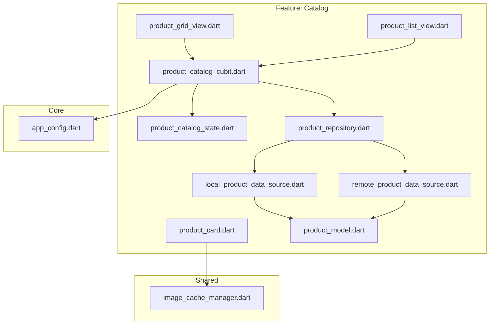
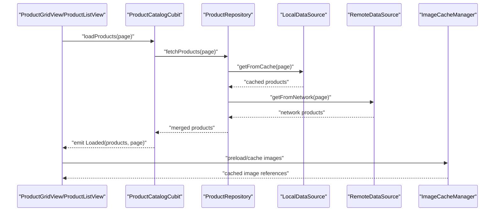
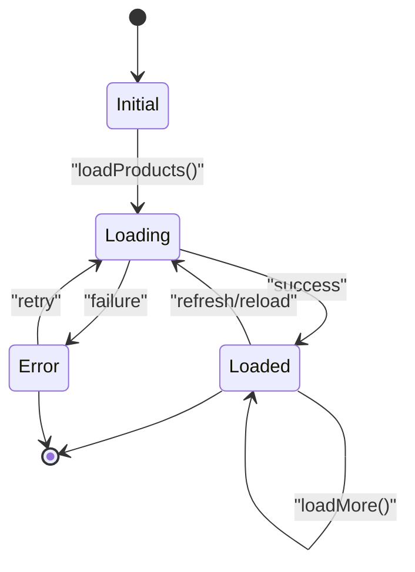
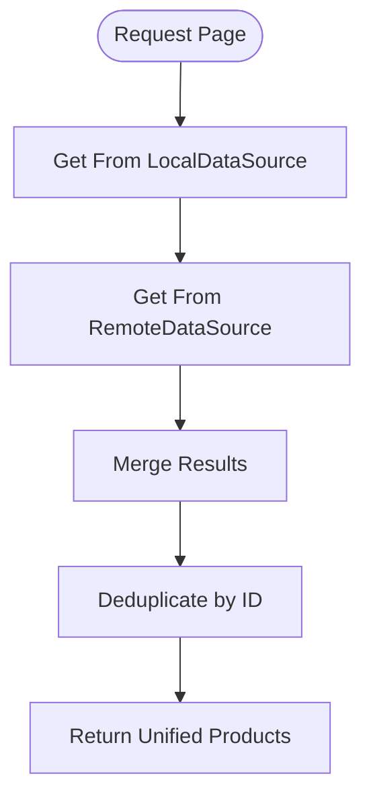
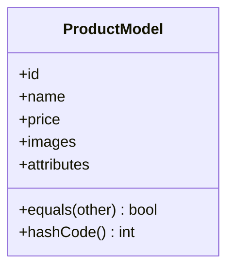
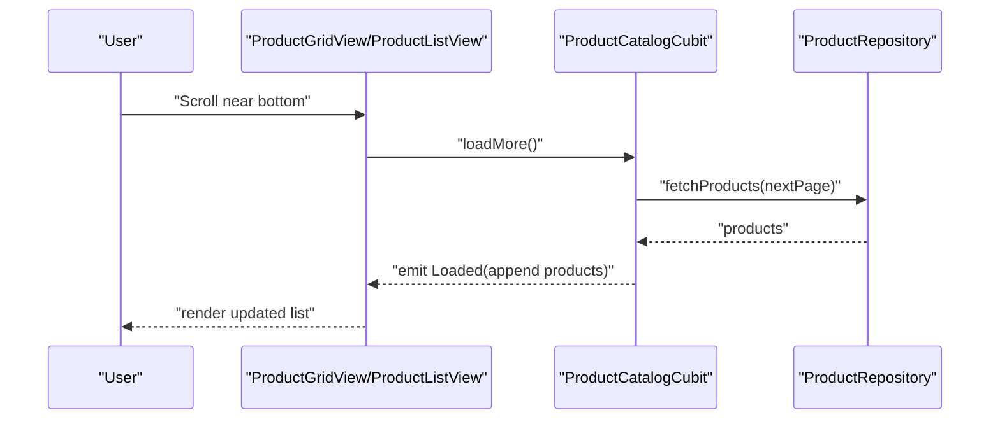
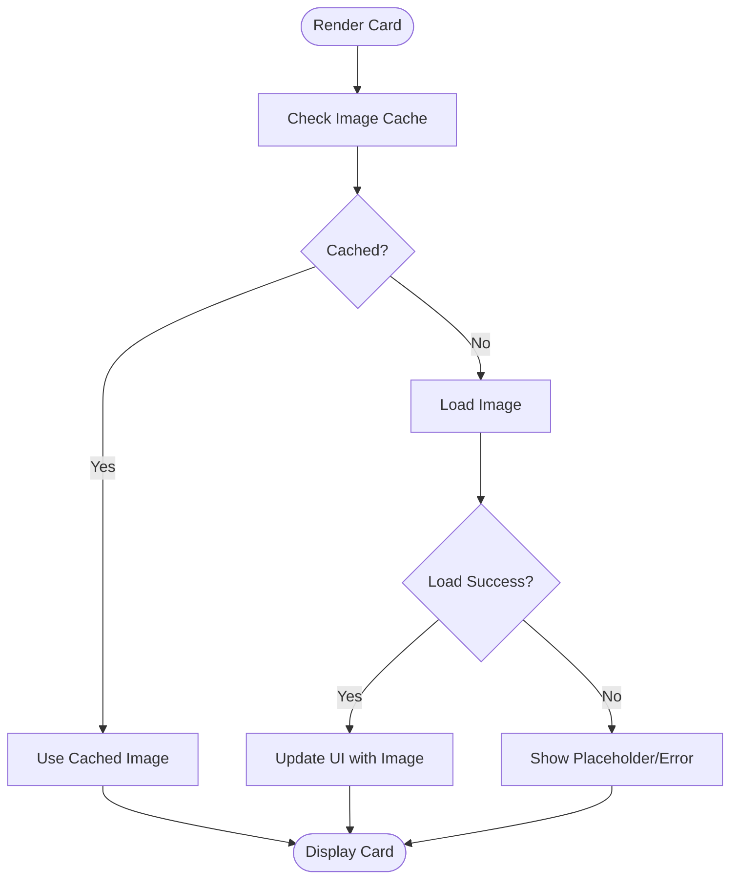
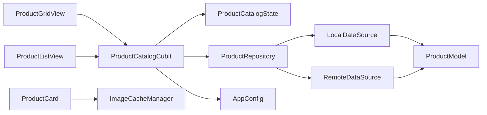

# Product Listing & Browsing

<cite>
**Referenced Files in This Document**
- [lib/features/catalog/cubit/product_catalog_cubit.dart](file://lib/features/catalog/cubit/product_catalog_cubit.dart)
- [lib/features/catalog/state/product_catalog_state.dart](file://lib/features/catalog/state/product_catalog_state.dart)
- [lib/features/catalog/repository/product_repository.dart](file://lib/features/catalog/repository/product_repository.dart)
- [lib/features/catalog/data_source/local_product_data_source.dart](file://lib/features/catalog/data_source/local_product_data_source.dart)
- [lib/features/catalog/data_source/remote_product_data_source.dart](file://lib/features/catalog/data_source/remote_product_data_source.dart)
- [lib/features/catalog/model/product_model.dart](file://lib/features/catalog/model/product_model.dart)
- [lib/features/catalog/view/product_grid_view.dart](file://lib/features/catalog/view/product_grid_view.dart)
- [lib/features/catalog/view/product_list_view.dart](file://lib/features/catalog/view/product_list_view.dart)
- [lib/features/catalog/widget/product_card.dart](file://lib/features/catalog/widget/product_card.dart)
- [lib/shared/util/image_cache_manager.dart](file://lib/shared/util/image_cache_manager.dart)
- [lib/core/config/app_config.dart](file://lib/core/config/app_config.dart)
</cite>

## Table of Contents
1. [Introduction](#introduction)
2. [Project Structure](#project-structure)
3. [Core Components](#core-components)
4. [Architecture Overview](#architecture-overview)
5. [Detailed Component Analysis](#detailed-component-analysis)
6. [Dependency Analysis](#dependency-analysis)
7. [Performance Considerations](#performance-considerations)
8. [Troubleshooting Guide](#troubleshooting-guide)
9. [Conclusion](#conclusion)
10. [Appendices](#appendices)

## Introduction
This document explains the product listing and browsing functionality, focusing on:
- Grid and list views for displaying products
- Pagination strategies and infinite scrolling
- Cubit state management for loading, error handling, and data synchronization
- UI components for product cards and image caching
- Performance optimizations for large catalogs, lazy loading, and memory management
- Customization guidelines for layouts and platform-specific optimizations

The implementation follows a feature-based structure with clear separation between presentation (views/widgets), state management (Cubit), domain logic (repository), and data access (data sources).

## Project Structure
Product-related code is organized under features/catalog with subfolders for cubit, state, repository, data source, model, view, and widget. Shared utilities like image caching are located under shared/util. Configuration lives under core/config.

**Diagram sources**
- [lib/features/catalog/view/product_grid_view.dart](file://lib/features/catalog/view/product_grid_view.dart)
- [lib/features/catalog/view/product_list_view.dart](file://lib/features/catalog/view/product_list_view.dart)
- [lib/features/catalog/widget/product_card.dart](file://lib/features/catalog/widget/product_card.dart)
- [lib/features/catalog/cubit/product_catalog_cubit.dart](file://lib/features/catalog/cubit/product_catalog_cubit.dart)
- [lib/features/catalog/state/product_catalog_state.dart](file://lib/features/catalog/state/product_catalog_state.dart)
- [lib/features/catalog/repository/product_repository.dart](file://lib/features/catalog/repository/product_repository.dart)
- [lib/features/catalog/data_source/local_product_data_source.dart](file://lib/features/catalog/data_source/local_product_data_source.dart)
- [lib/features/catalog/data_source/remote_product_data_source.dart](file://lib/features/catalog/data_source/remote_product_data_source.dart)
- [lib/features/catalog/model/product_model.dart](file://lib/features/catalog/model/product_model.dart)
- [lib/shared/util/image_cache_manager.dart](file://lib/shared/util/image_cache_manager.dart)
- [lib/core/config/app_config.dart](file://lib/core/config/app_config.dart)

**Section sources**
- [lib/features/catalog/view/product_grid_view.dart](file://lib/features/catalog/view/product_grid_view.dart)
- [lib/features/catalog/view/product_list_view.dart](file://lib/features/catalog/view/product_list_view.dart)
- [lib/features/catalog/widget/product_card.dart](file://lib/features/catalog/widget/product_card.dart)
- [lib/features/catalog/cubit/product_catalog_cubit.dart](file://lib/features/catalog/cubit/product_catalog_cubit.dart)
- [lib/features/catalog/state/product_catalog_state.dart](file://lib/features/catalog/state/product_catalog_state.dart)
- [lib/features/catalog/repository/product_repository.dart](file://lib/features/catalog/repository/product_repository.dart)
- [lib/features/catalog/data_source/local_product_data_source.dart](file://lib/features/catalog/data_source/local_product_data_source.dart)
- [lib/features/catalog/data_source/remote_product_data_source.dart](file://lib/features/catalog/data_source/remote_product_data_source.dart)
- [lib/features/catalog/model/product_model.dart](file://lib/features/catalog/model/product_model.dart)
- [lib/shared/util/image_cache_manager.dart](file://lib/shared/util/image_cache_manager.dart)
- [lib/core/config/app_config.dart](file://lib/core/config/app_config.dart)

## Core Components
- ProductCatalogCubit: Manages catalog state including loading, errors, pagination, and data sync. Emits states reflecting current status and provides methods to load, refresh, and paginate.
- ProductCatalogState: Immutable state object representing the catalog’s snapshot (products, page info, loading flags, errors).
- ProductRepository: Orchestrates fetching from local and remote data sources, merging results and handling conflicts or fallbacks.
- LocalDataSource and RemoteDataSource: Implement data retrieval from cache/database and network respectively.
- ProductModel: Domain representation of a product used across layers.
- Views and Widgets: ProductGridView and ProductListView render lists; ProductCard displays individual items with optimized images.

Key responsibilities:
- State transitions: initial -> loading -> loaded/error/success
- Pagination: fetch next page when threshold reached
- Infinite scroll: trigger additional loads near bottom
- Image caching: reuse cached images to reduce network usage and improve performance

**Section sources**
- [lib/features/catalog/cubit/product_catalog_cubit.dart](file://lib/features/catalog/cubit/product_catalog_cubit.dart)
- [lib/features/catalog/state/product_catalog_state.dart](file://lib/features/catalog/state/product_catalog_state.dart)
- [lib/features/catalog/repository/product_repository.dart](file://lib/features/catalog/repository/product_repository.dart)
- [lib/features/catalog/data_source/local_product_data_source.dart](file://lib/features/catalog/data_source/local_product_data_source.dart)
- [lib/features/catalog/data_source/remote_product_data_source.dart](file://lib/features/catalog/data_source/remote_product_data_source.dart)
- [lib/features/catalog/model/product_model.dart](file://lib/features/catalog/model/product_model.dart)
- [lib/features/catalog/view/product_grid_view.dart](file://lib/features/catalog/view/product_grid_view.dart)
- [lib/features/catalog/view/product_list_view.dart](file://lib/features/catalog/view/product_list_view.dart)
- [lib/features/catalog/widget/product_card.dart](file://lib/features/catalog/widget/product_card.dart)

## Architecture Overview
The architecture separates concerns into layers:
- Presentation layer (Views/Widgets) subscribes to Cubit state and renders UI
- State layer (Cubit + State) encapsulates business rules for pagination and sync
- Repository layer coordinates data sources and merges results
- Data layer (Local/Remote) handles persistence and network calls
- Shared utilities provide image caching and configuration

**Diagram sources**
- [lib/features/catalog/view/product_grid_view.dart](file://lib/features/catalog/view/product_grid_view.dart)
- [lib/features/catalog/view/product_list_view.dart](file://lib/features/catalog/view/product_list_view.dart)
- [lib/features/catalog/cubit/product_catalog_cubit.dart](file://lib/features/catalog/cubit/product_catalog_cubit.dart)
- [lib/features/catalog/repository/product_repository.dart](file://lib/features/catalog/repository/product_repository.dart)
- [lib/features/catalog/data_source/local_product_data_source.dart](file://lib/features/catalog/data_source/local_product_data_source.dart)
- [lib/features/catalog/data_source/remote_product_data_source.dart](file://lib/features/catalog/data_source/remote_product_data_source.dart)
- [lib/shared/util/image_cache_manager.dart](file://lib/shared/util/image_cache_manager.dart)

## Detailed Component Analysis

### ProductCatalogCubit
Responsibilities:
- Emit states: Initial, Loading, Loaded, Error
- Manage pagination: current page, hasMore, pageSize
- Handle refresh and reload operations
- Merge and synchronize data from repository
- Expose methods to load first page, load more, and reset

State transitions:
- On load start: emit Loading
- On success: emit Loaded with products and pagination metadata
- On failure: emit Error with message
- On refresh: clear previous page and reload

**Diagram sources**
- [lib/features/catalog/cubit/product_catalog_cubit.dart](file://lib/features/catalog/cubit/product_catalog_cubit.dart)
- [lib/features/catalog/state/product_catalog_state.dart](file://lib/features/catalog/state/product_catalog_state.dart)

**Section sources**
- [lib/features/catalog/cubit/product_catalog_cubit.dart](file://lib/features/catalog/cubit/product_catalog_cubit.dart)
- [lib/features/catalog/state/product_catalog_state.dart](file://lib/features/catalog/state/product_catalog_state.dart)

### ProductRepository
Responsibilities:
- Coordinate local and remote data sources
- Merge results (e.g., prefer fresh network data, fallback to cache)
- Deduplicate products by ID
- Return consistent domain models to Cubit

Data flow:
- Request page N
- Fetch from LocalDataSource
- Fetch from RemoteDataSource
- Merge and deduplicate
- Return unified list

**Diagram sources**
- [lib/features/catalog/repository/product_repository.dart](file://lib/features/catalog/repository/product_repository.dart)
- [lib/features/catalog/data_source/local_product_data_source.dart](file://lib/features/catalog/data_source/local_product_data_source.dart)
- [lib/features/catalog/data_source/remote_product_data_source.dart](file://lib/features/catalog/data_source/remote_product_data_source.dart)
- [lib/features/catalog/model/product_model.dart](file://lib/features/catalog/model/product_model.dart)

**Section sources**
- [lib/features/catalog/repository/product_repository.dart](file://lib/features/catalog/repository/product_repository.dart)
- [lib/features/catalog/data_source/local_product_data_source.dart](file://lib/features/catalog/data_source/local_product_data_source.dart)
- [lib/features/catalog/data_source/remote_product_data_source.dart](file://lib/features/catalog/data_source/remote_product_data_source.dart)
- [lib/features/catalog/model/product_model.dart](file://lib/features/catalog/model/product_model.dart)

### Product Model
Responsibilities:
- Represent product fields (ID, name, price, images, etc.)
- Provide equality/hash for deduplication
- Map to/from DTOs if needed

**Diagram sources**
- [lib/features/catalog/model/product_model.dart](file://lib/features/catalog/model/product_model.dart)

**Section sources**
- [lib/features/catalog/model/product_model.dart](file://lib/features/catalog/model/product_model.dart)

### ProductGridView and ProductListView
Responsibilities:
- Subscribe to Cubit state
- Render grid/list based on screen size and user preference
- Implement pagination triggers (scroll thresholds)
- Display loading indicators and error messages

Pagination strategy:
- Use scroll controller to detect near-bottom threshold
- Call Cubit.loadMore() when threshold reached
- Respect hasMore flag to stop loading

Infinite scrolling:
- Trigger incremental loads automatically
- Debounce rapid scrolls to avoid excessive requests

Responsive design:
- Adjust columns per row based on available width
- Switch between grid and list modes via settings

**Diagram sources**
- [lib/features/catalog/view/product_grid_view.dart](file://lib/features/catalog/view/product_grid_view.dart)
- [lib/features/catalog/view/product_list_view.dart](file://lib/features/catalog/view/product_list_view.dart)
- [lib/features/catalog/cubit/product_catalog_cubit.dart](file://lib/features/catalog/cubit/product_catalog_cubit.dart)
- [lib/features/catalog/repository/product_repository.dart](file://lib/features/catalog/repository/product_repository.dart)

**Section sources**
- [lib/features/catalog/view/product_grid_view.dart](file://lib/features/catalog/view/product_grid_view.dart)
- [lib/features/catalog/view/product_list_view.dart](file://lib/features/catalog/view/product_list_view.dart)

### ProductCard
Responsibilities:
- Display product details (image, title, price)
- Integrate with image cache manager for efficient loading
- Handle placeholder and error states gracefully

Image optimization:
- Use cached image references
- Show skeleton placeholders while loading
- Retry failed images with fallback

**Diagram sources**
- [lib/features/catalog/widget/product_card.dart](file://lib/features/catalog/widget/product_card.dart)
- [lib/shared/util/image_cache_manager.dart](file://lib/shared/util/image_cache_manager.dart)

**Section sources**
- [lib/features/catalog/widget/product_card.dart](file://lib/features/catalog/widget/product_card.dart)
- [lib/shared/util/image_cache_manager.dart](file://lib/shared/util/image_cache_manager.dart)

### Image Cache Manager
Responsibilities:
- Maintain an in-memory cache of decoded images
- Evict least-used entries to manage memory
- Provide fast retrieval and async loading

Optimization techniques:
- Decode images once and store references
- Limit cache size based on device memory
- Clear cache on app lifecycle events if needed

**Section sources**
- [lib/shared/util/image_cache_manager.dart](file://lib/shared/util/image_cache_manager.dart)

### App Config
Responsibilities:
- Define pagination defaults (pageSize, threshold)
- Configure image cache limits
- Provide feature flags for grid/list mode

Usage:
- Read values in Cubit and Views to control behavior
- Allow runtime customization via settings

**Section sources**
- [lib/core/config/app_config.dart](file://lib/core/config/app_config.dart)

## Dependency Analysis
The following diagram shows key dependencies among catalog components:

**Diagram sources**
- [lib/features/catalog/view/product_grid_view.dart](file://lib/features/catalog/view/product_grid_view.dart)
- [lib/features/catalog/view/product_list_view.dart](file://lib/features/catalog/view/product_list_view.dart)
- [lib/features/catalog/cubit/product_catalog_cubit.dart](file://lib/features/catalog/cubit/product_catalog_cubit.dart)
- [lib/features/catalog/state/product_catalog_state.dart](file://lib/features/catalog/state/product_catalog_state.dart)
- [lib/features/catalog/repository/product_repository.dart](file://lib/features/catalog/repository/product_repository.dart)
- [lib/features/catalog/data_source/local_product_data_source.dart](file://lib/features/catalog/data_source/local_product_data_source.dart)
- [lib/features/catalog/data_source/remote_product_data_source.dart](file://lib/features/catalog/data_source/remote_product_data_source.dart)
- [lib/features/catalog/model/product_model.dart](file://lib/features/catalog/model/product_model.dart)
- [lib/features/catalog/widget/product_card.dart](file://lib/features/catalog/widget/product_card.dart)
- [lib/shared/util/image_cache_manager.dart](file://lib/shared/util/image_cache_manager.dart)
- [lib/core/config/app_config.dart](file://lib/core/config/app_config.dart)

**Section sources**
- [lib/features/catalog/cubit/product_catalog_cubit.dart](file://lib/features/catalog/cubit/product_catalog_cubit.dart)
- [lib/features/catalog/repository/product_repository.dart](file://lib/features/catalog/repository/product_repository.dart)
- [lib/features/catalog/data_source/local_product_data_source.dart](file://lib/features/catalog/data_source/local_product_data_source.dart)
- [lib/features/catalog/data_source/remote_product_data_source.dart](file://lib/features/catalog/data_source/remote_product_data_source.dart)
- [lib/features/catalog/view/product_grid_view.dart](file://lib/features/catalog/view/product_grid_view.dart)
- [lib/features/catalog/view/product_list_view.dart](file://lib/features/catalog/view/product_list_view.dart)
- [lib/features/catalog/widget/product_card.dart](file://lib/features/catalog/widget/product_card.dart)
- [lib/shared/util/image_cache_manager.dart](file://lib/shared/util/image_cache_manager.dart)
- [lib/core/config/app_config.dart](file://lib/core/config/app_config.dart)

## Performance Considerations
- Pagination:
  - Use reasonable page sizes (e.g., 20–50 items) to balance memory and UX
  - Avoid loading entire catalogs at once
- Infinite Scrolling:
  - Set a threshold (e.g., last 20% of list) to trigger loadMore
  - Debounce scroll events to prevent redundant requests
- Image Optimization:
  - Cache decoded images using ImageCacheManager
  - Use placeholders and low-resolution previews where possible
  - Resize images to display dimensions to reduce memory footprint
- Memory Management:
  - Limit cache size and evict least-used entries
  - Dispose controllers and listeners properly
- Rendering Efficiency:
  - Use sliver-based lists for better performance
  - Avoid heavy computations during build; offload to Cubit/repository
- Network Efficiency:
  - Enable request deduplication and caching headers
  - Retry with backoff on transient failures

[No sources needed since this section provides general guidance]

## Troubleshooting Guide
Common issues and resolutions:
- Stuck in Loading state:
  - Verify Cubit emits Loaded on success and Error on failure
  - Ensure repository returns data and handles exceptions
- Duplicate products:
  - Confirm deduplication by ID in repository
  - Validate ProductModel equality/hashCode
- Images not loading:
  - Check ImageCacheManager cache hits and fallback paths
  - Inspect network responses and URL validity
- Infinite scroll not triggering:
  - Review scroll threshold and hasMore flag logic
  - Ensure loadMore is called only when appropriate
- High memory usage:
  - Reduce page size and image cache limits
  - Monitor cache eviction and dispose unused resources

**Section sources**
- [lib/features/catalog/cubit/product_catalog_cubit.dart](file://lib/features/catalog/cubit/product_catalog_cubit.dart)
- [lib/features/catalog/repository/product_repository.dart](file://lib/features/catalog/repository/product_repository.dart)
- [lib/features/catalog/widget/product_card.dart](file://lib/features/catalog/widget/product_card.dart)
- [lib/shared/util/image_cache_manager.dart](file://lib/shared/util/image_cache_manager.dart)

## Conclusion
The product listing and browsing system uses a clean separation of concerns with Cubit managing state, repository coordinating data sources, and views rendering efficiently. Pagination and infinite scrolling enhance UX for large catalogs, while image caching and responsive design optimize performance and adaptability. Following the customization guidelines ensures maintainable and scalable implementations across platforms.

[No sources needed since this section summarizes without analyzing specific files]

## Appendices

### Customizing Product Display Layouts
- Change grid columns based on screen width using breakpoints
- Toggle between grid and list modes via settings
- Customize card layout by extending ProductCard or providing custom builders

### Platform-Specific Optimizations
- Android:
  - Use vector drawables for icons
  - Leverage hardware acceleration for image decoding
- iOS:
  - Utilize native image caches where applicable
  - Optimize asset bundles for smaller app size

[No sources needed since this section provides general guidance]