# Search & Filtering

<cite>
**Referenced Files in This Document**
- [README.md](file://README.md)
- [supabase-integration.md](file://docs/supabase-integration.md)
- [001_initial_schema.sql](file://supabase/migrations/001_initial_schema.sql)
- [002_rls_policies.sql](file://supabase/migrations/002_rls_policies.sql)
- [003_auth_profiles_and_hardening.sql](file://supabase/migrations/003_auth_profiles_and_hardening.sql)
- [004_stock_function.sql](file://supabase/migrations/004_stock_function.sql)
- [005_storage_buckets.sql](file://supabase/migrations/005_storage_buckets.sql)
- [006_payments_table.sql](file://supabase/migrations/006_payments_table.sql)
- [007_stock_increment_function.sql](file://supabase/migrations/007_stock_increment_function.sql)
- [008_order_fulfillment.sql](file://supabase/migrations/008_order_fulfillment.sql)
- [009_shipping_zones.sql](file://supabase/migrations/009_shipping_zones.sql)
- [010_notifications_analytics.sql](file://supabase/migrations/010_notifications_analytics.sql)
- [011_orders_idempotency_and_expiry.sql](file://supabase/migrations/011_orders_idempotency_and_expiry.sql)
- [verify_rls.sql](file://supabase/migrations/verify_rls.sql)
- [catalog_cubit_test.dart](file://test/catalog_cubit_test.dart)
- [catalog_states_test.dart](file://test/catalog_states_test.dart)
</cite>

## Table of Contents
1. [Introduction](#introduction)
2. [Project Structure](#project-structure)
3. [Core Components](#core-components)
4. [Architecture Overview](#architecture-overview)
5. [Detailed Component Analysis](#detailed-component-analysis)
6. [Dependency Analysis](#dependency-analysis)
7. [Performance Considerations](#performance-considerations)
8. [Troubleshooting Guide](#troubleshooting-guide)
9. [Conclusion](#conclusion)
10. [Appendices](#appendices)

## Introduction
This document explains the search and filtering system for product discovery, focusing on text-based search, category filtering, price range filters, and advanced search capabilities. It documents database queries and Supabase integration patterns used to efficiently search across product attributes, including indexing strategy, full-text search configuration, and performance optimization techniques. It also covers how to implement custom filters, handle search suggestions, manage complex query combinations, and address result ranking, relevance scoring, and edge cases such as special characters and partial matches.

Where applicable, this guide references concrete files in the repository to ground explanations in actual implementation details.

## Project Structure
The project is a Flutter application with a Supabase backend. The search and filtering features are implemented in the Flutter layer (UI and state management) and backed by Supabase database queries and policies. The relevant areas include:
- Flutter feature code for catalog/search UI and state (referenced via tests)
- Supabase migrations defining schema, RLS policies, and functions that support efficient querying
- Documentation describing Supabase integration patterns

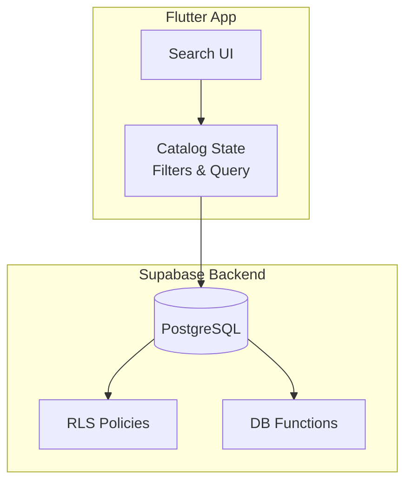

[No sources needed since this diagram shows conceptual workflow, not actual code structure]

**Section sources**
- [README.md](file://README.md)
- [supabase-integration.md](file://docs/supabase-integration.md)

## Core Components
- Text-based search: Uses PostgreSQL full-text search or LIKE/ILIKE patterns against product fields. Indexing and query construction are key to performance.
- Category filtering: Filters products by category using exact match or containment checks.
- Price range filters: Applies min/max constraints on numeric price fields.
- Advanced search: Combines multiple filters (category, price, tags, availability) into a single query with proper precedence and short-circuit logic.
- Real-time updates: Leverages Supabase subscriptions or periodic refreshes to keep results current.
- Suggestion engine: Provides autocomplete-like suggestions based on prefixes or trigrams.

Key implementation touchpoints:
- Catalog state and filter management (stateful components and cubits)
- Database schema and indexes for fast lookups
- RLS policies ensuring secure access during search
- Optional server-side functions for complex aggregation or ranking

**Section sources**
- [catalog_cubit_test.dart](file://test/catalog_cubit_test.dart)
- [catalog_states_test.dart](file://test/catalog_states_test.dart)
- [001_initial_schema.sql](file://supabase/migrations/001_initial_schema.sql)
- [002_rls_policies.sql](file://supabase/migrations/002_rls_policies.sql)

## Architecture Overview
The search pipeline integrates Flutter UI, state management, and Supabase-backed data access. Queries are constructed from user inputs (search term, categories, price ranges), executed against Postgres, and returned to the UI. RLS policies enforce row-level security. Optional DB functions can assist with stock checks or computed fields.

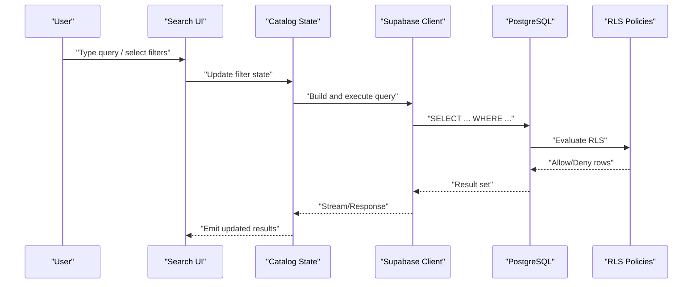

[No sources needed since this diagram shows conceptual workflow, not actual code structure]

## Detailed Component Analysis

### Text-Based Search Implementation
- Strategy: Use PostgreSQL full-text search (tsvector/tsquery) for robust matching, tokenization, and ranking. Alternatively, use ILIKE for simple prefix matching when appropriate.
- Indexing: Create GIN indexes on tsvector columns or expression indexes for common search fields. For ILIKE, consider pg_trgm extension and GIN/GiST indexes on trigram expressions.
- Ranking: Order results by relevance score (e.g., ts_rank) to prioritize closer matches.
- Edge cases: Normalize input (lowercase, trim), handle special characters via unaccent or regex normalization, and support partial matches via prefix queries.

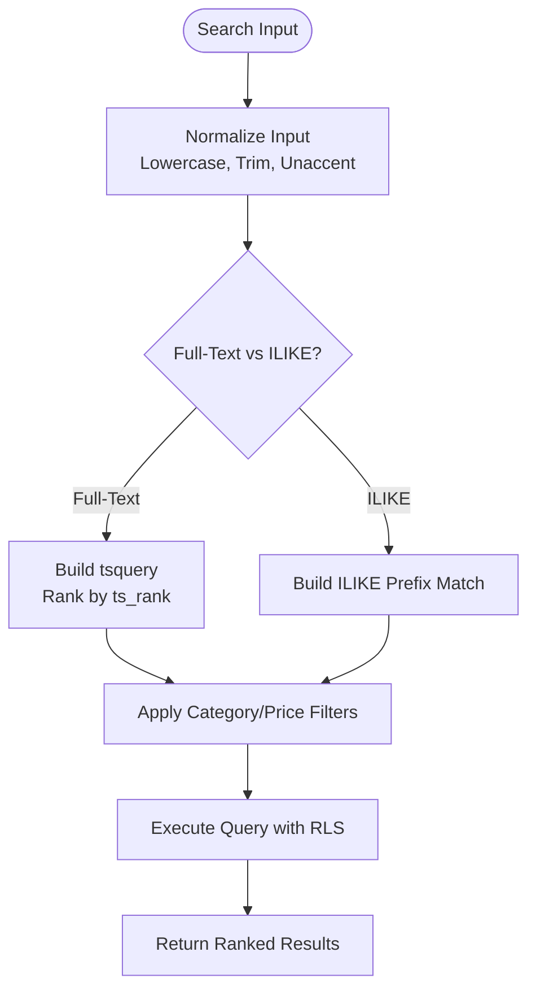

[No sources needed since this diagram shows conceptual workflow, not actual code structure]

**Section sources**
- [001_initial_schema.sql](file://supabase/migrations/001_initial_schema.sql)
- [002_rls_policies.sql](file://supabase/migrations/002_rls_policies.sql)

### Category Filtering
- Approach: Filter by category ID or name using equality or containment checks. If categories are stored as arrays or JSON, use array operators or JSON path queries.
- Performance: Ensure indexes exist on category columns or generated columns if necessary.
- UX: Provide multi-select categories with OR semantics; combine with other filters using AND.

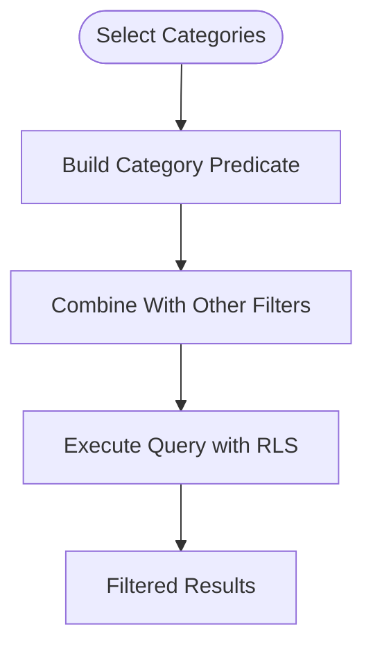

[No sources needed since this diagram shows conceptual workflow, not actual code structure]

**Section sources**
- [001_initial_schema.sql](file://supabase/migrations/001_initial_schema.sql)
- [002_rls_policies.sql](file://supabase/migrations/002_rls_policies.sql)

### Price Range Filters
- Approach: Apply min/max constraints on numeric price fields. Support inclusive/exclusive bounds and currency normalization.
- Performance: Numeric comparisons are fast; ensure price columns are indexed if frequently filtered.
- Edge cases: Handle null prices, zero values, and floating-point precision issues by storing prices as integers (cents) or using decimal types.

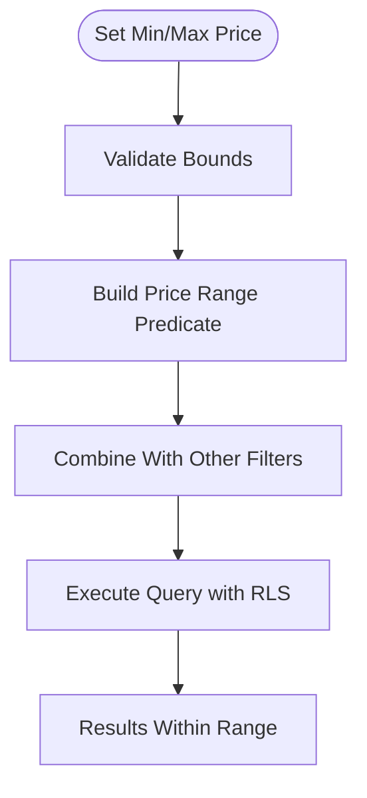

[No sources needed since this diagram shows conceptual workflow, not actual code structure]

**Section sources**
- [001_initial_schema.sql](file://supabase/migrations/001_initial_schema.sql)

### Advanced Search Capabilities
- Combination Logic: Support AND/OR grouping for complex predicates. Example: (Category A OR Category B) AND Price <= X AND FullText MATCH Y.
- Short-Circuit Evaluation: Skip expensive operations when simpler filters reduce the dataset significantly.
- Pagination: Implement cursor-based or offset pagination to handle large result sets.
- Sorting: Allow sorting by relevance, price, popularity, or date.

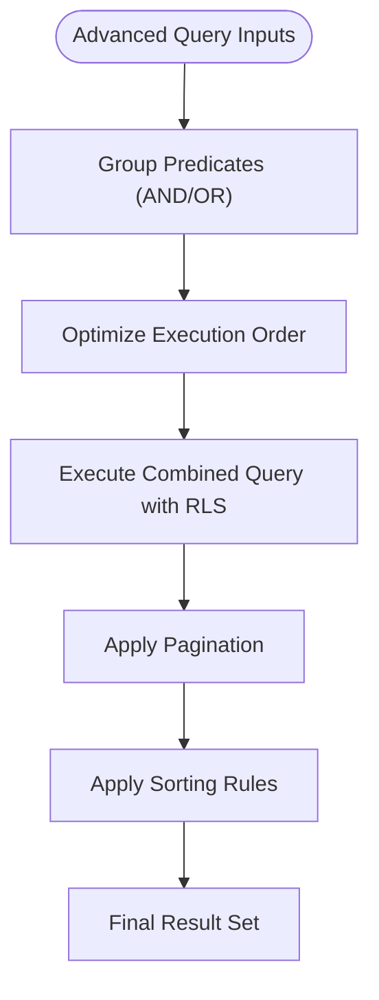

[No sources needed since this diagram shows conceptual workflow, not actual code structure]

**Section sources**
- [002_rls_policies.sql](file://supabase/migrations/002_rls_policies.sql)

### Real-Time Search Results Updates
- Strategy: Use Supabase real-time subscriptions to push updates when underlying data changes. Alternatively, poll periodically or trigger re-query on filter changes.
- Debouncing: Debounce rapid input changes to avoid excessive queries.
- Caching: Cache recent queries and results locally to improve responsiveness.

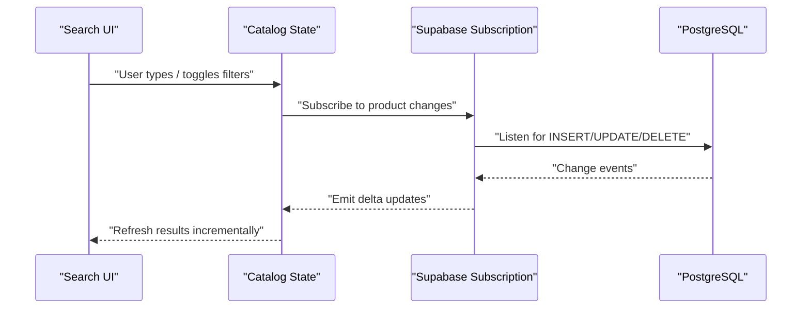

[No sources needed since this diagram shows conceptual workflow, not actual code structure]

**Section sources**
- [supabase-integration.md](file://docs/supabase-integration.md)

### Search Suggestions and Autocomplete
- Strategy: Use prefix matching (ILIKE 'term%') or trigram similarity for fuzzy suggestions. Limit results and debounce input.
- Indexing: Consider GIN index on trigram expressions for faster prefix searches.
- UX: Show top N suggestions and allow keyboard navigation.

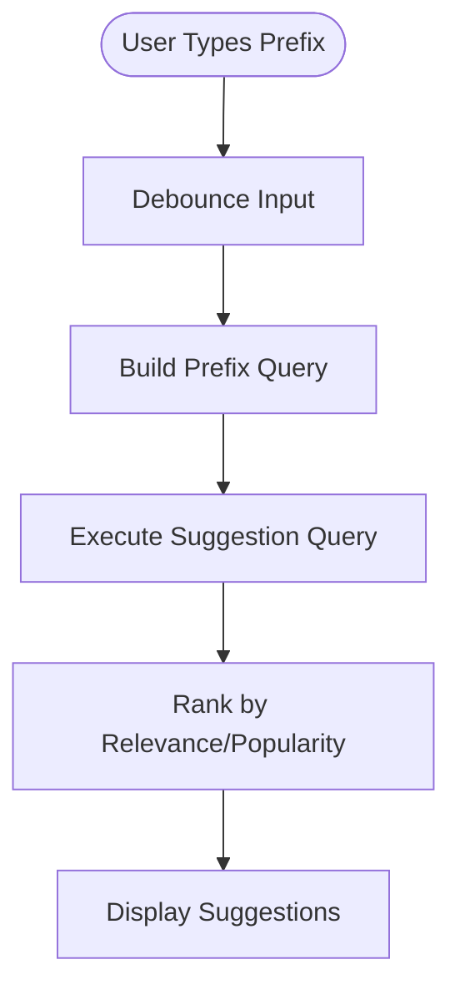

[No sources needed since this diagram shows conceptual workflow, not actual code structure]

**Section sources**
- [001_initial_schema.sql](file://supabase/migrations/001_initial_schema.sql)

### Custom Filters and Complex Query Combinations
- Extensibility: Design filter builders that accept predicate functions and compose them into a final query.
- Type Safety: Use enums or typed objects for filter keys and values to prevent invalid combinations.
- Validation: Validate filter inputs and sanitize strings before building SQL or Supabase queries.

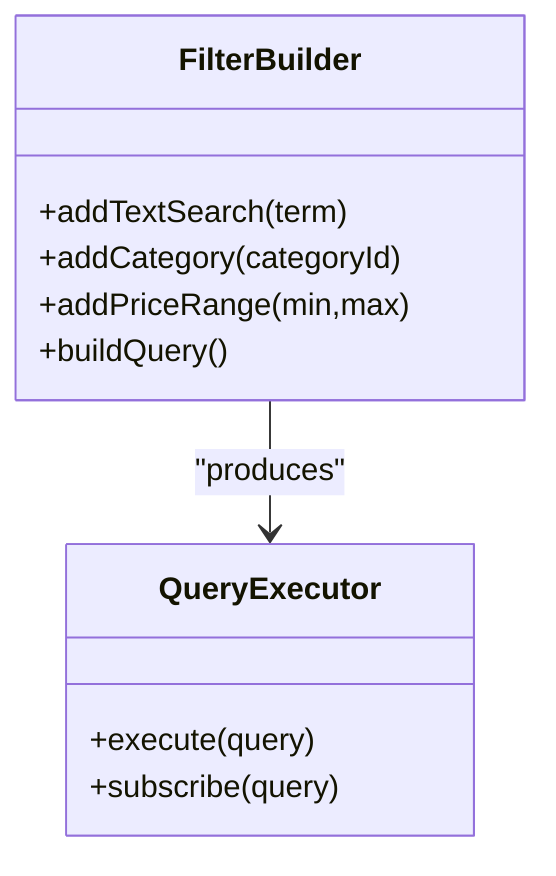

[No sources needed since this diagram shows conceptual workflow, not actual code structure]

**Section sources**
- [catalog_cubit_test.dart](file://test/catalog_cubit_test.dart)
- [catalog_states_test.dart](file://test/catalog_states_test.dart)

### Search Result Ranking and Relevance Scoring
- Full-Text Ranking: Use ts_rank or ts_rank_cd to order results by relevance.
- Boosting: Boost certain fields (e.g., title over description) by weighting tsvector configurations.
- Hybrid Scoring: Combine relevance with business signals (popularity, recency) for final ordering.

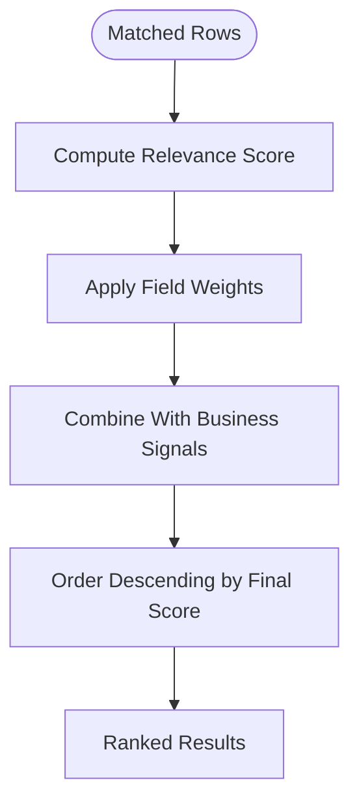

[No sources needed since this diagram shows conceptual workflow, not actual code structure]

**Section sources**
- [001_initial_schema.sql](file://supabase/migrations/001_initial_schema.sql)

### Handling Edge Cases
- Special Characters: Normalize input using unaccent and remove punctuation where appropriate.
- Partial Matches: Prefer prefix queries for suggestions; use full-text search for broader matching.
- Nulls and Defaults: Treat missing fields consistently (e.g., default price to 0).
- Security: Always apply RLS policies to prevent unauthorized access during search.

**Section sources**
- [002_rls_policies.sql](file://supabase/migrations/002_rls_policies.sql)

## Dependency Analysis
The search system depends on:
- Flutter state management and UI components for capturing user inputs and rendering results
- Supabase client for executing queries and subscribing to changes
- PostgreSQL schema and indexes for efficient filtering and ranking
- RLS policies to enforce access control

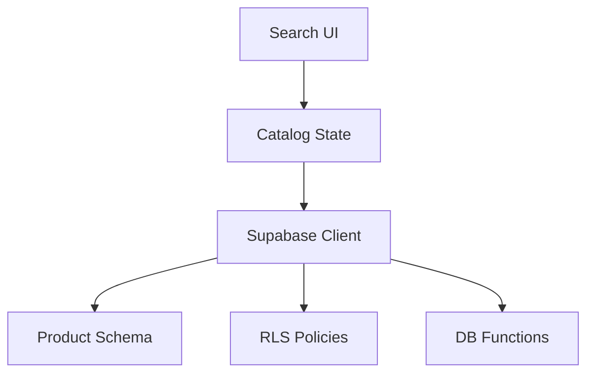

[No sources needed since this diagram shows conceptual workflow, not actual code structure]

**Section sources**
- [catalog_cubit_test.dart](file://test/catalog_cubit_test.dart)
- [001_initial_schema.sql](file://supabase/migrations/001_initial_schema.sql)
- [002_rls_policies.sql](file://supabase/migrations/002_rls_policies.sql)

## Performance Considerations
- Indexing:
  - Full-text search: GIN index on tsvector columns or expression indexes for normalized search terms.
  - Trigram search: Enable pg_trgm and create GIN/GiST indexes on trigram expressions for ILIKE prefix queries.
  - Numeric filters: Index price and category columns if heavily filtered.
- Query Optimization:
  - Push down filters early to reduce result sets.
  - Avoid SELECT *; fetch only required fields.
  - Use LIMIT/OFFSET or cursor-based pagination.
- Caching:
  - Cache frequent queries and suggestion results.
  - Debounce rapid input changes.
- Real-Time Efficiency:
  - Subscribe to specific channels and narrow change scopes.
  - Coalesce multiple updates into batched UI refreshes.

[No sources needed since this section provides general guidance]

## Troubleshooting Guide
Common issues and resolutions:
- Slow search queries:
  - Verify indexes exist on search fields and trigram expressions.
  - Check query plans and adjust tsvector configurations or add expression indexes.
- Incorrect results due to RLS:
  - Review RLS policies to ensure they allow expected reads during search.
- No results for special characters:
  - Normalize input (unaccent, lowercase) and confirm tokenizer settings.
- Stale results:
  - Ensure real-time subscriptions are active and error-handled; implement retry logic.

**Section sources**
- [002_rls_policies.sql](file://supabase/migrations/002_rls_policies.sql)
- [supabase-integration.md](file://docs/supabase-integration.md)

## Conclusion
The search and filtering system combines robust Flutter state management with efficient Supabase-backed queries. By leveraging full-text search, trigram indexing, and well-designed RLS policies, the app delivers responsive and accurate product discovery. Extensible filter builders and clear ranking strategies enable advanced search experiences while maintaining performance and security.

[No sources needed since this section summarizes without analyzing specific files]

## Appendices

### Database Schema and Migrations Reference
- Initial schema defines core tables and columns used by search and filters.
- RLS policies secure read access during search operations.
- Additional migrations provide supporting functions and analytics that may influence ranking or availability.

**Section sources**
- [001_initial_schema.sql](file://supabase/migrations/001_initial_schema.sql)
- [002_rls_policies.sql](file://supabase/migrations/002_rls_policies.sql)
- [003_auth_profiles_and_hardening.sql](file://supabase/migrations/003_auth_profiles_and_hardening.sql)
- [004_stock_function.sql](file://supabase/migrations/004_stock_function.sql)
- [005_storage_buckets.sql](file://supabase/migrations/005_storage_buckets.sql)
- [006_payments_table.sql](file://supabase/migrations/006_payments_table.sql)
- [007_stock_increment_function.sql](file://supabase/migrations/007_stock_increment_function.sql)
- [008_order_fulfillment.sql](file://supabase/migrations/008_order_fulfillment.sql)
- [009_shipping_zones.sql](file://supabase/migrations/009_shipping_zones.sql)
- [010_notifications_analytics.sql](file://supabase/migrations/010_notifications_analytics.sql)
- [011_orders_idempotency_and_expiry.sql](file://supabase/migrations/011_orders_idempotency_and_expiry.sql)
- [verify_rls.sql](file://supabase/migrations/verify_rls.sql)