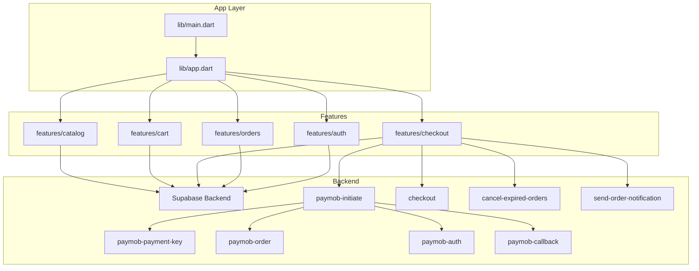
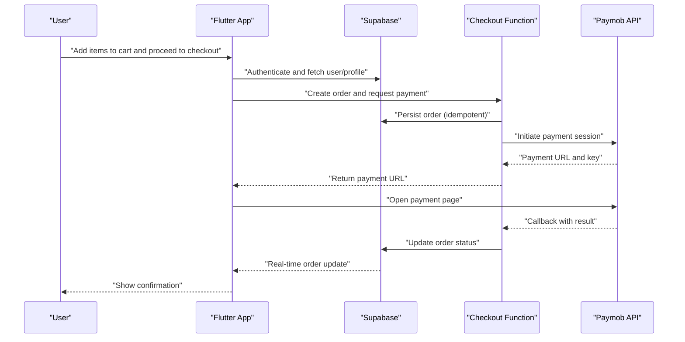
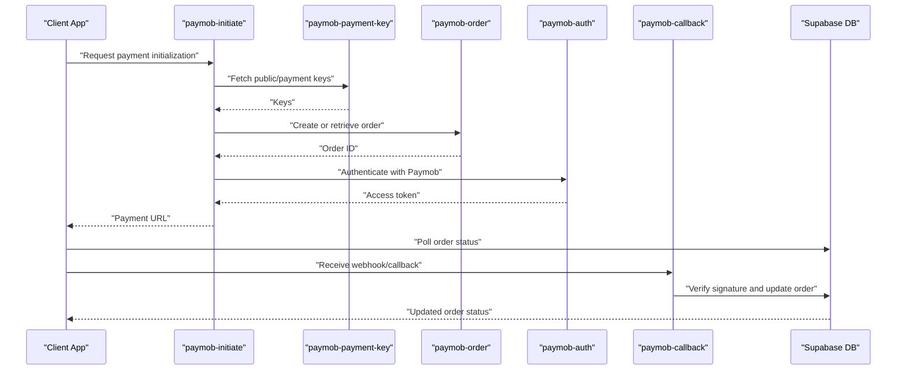
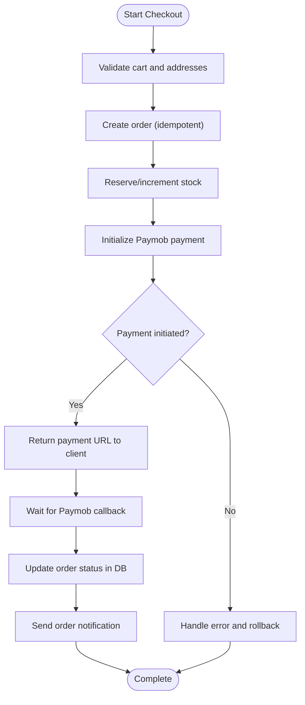
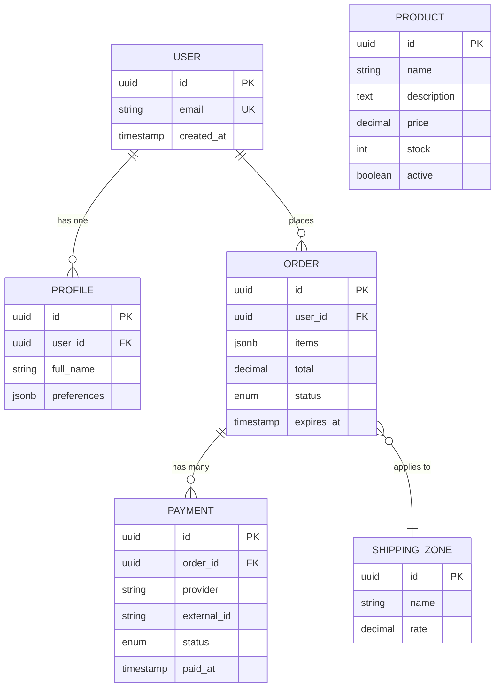
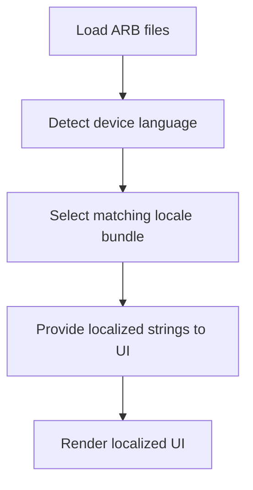
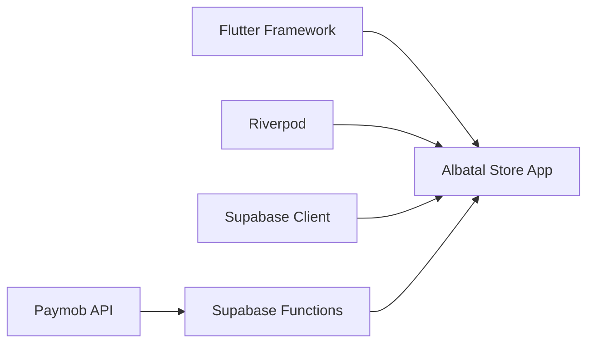

# Project Overview

<cite>
**Referenced Files in This Document**
- [README.md](file://README.md)
- [pubspec.yaml](file://pubspec.yaml)
- [lib/main.dart](file://lib/main.dart)
- [lib/app.dart](file://lib/app.dart)
- [supabase/migrations/001_initial_schema.sql](file://supabase/migrations/001_initial_schema.sql)
- [supabase/functions/paymob-initiate/index.ts](file://supabase/functions/paymob-initiate/index.ts)
- [supabase/functions/paymob-payment-key/index.ts](file://supabase/functions/paymob-payment-key/index.ts)
- [supabase/functions/paymob-order/index.ts](file://supabase/functions/paymob-order/index.ts)
- [supabase/functions/paymob-auth/index.ts](file://supabase/functions/paymob-auth/index.ts)
- [supabase/functions/paymob-callback/index.ts](file://supabase/functions/paymob-callback/index.ts)
- [supabase/functions/checkout/index.ts](file://supabase/functions/checkout/index.ts)
- [supabase/functions/cancel-expired-orders/index.ts](file://supabase/functions/cancel-expired-orders/index.ts)
- [supabase/functions/send-order-notification/index.ts](file://supabase/functions/send-order-notification/index.ts)
- [supabase/migrations/006_payments_table.sql](file://supabase/migrations/006_payments_table.sql)
- [supabase/migrations/011_orders_idempotency_and_expiry.sql](file://supabase/migrations/011_orders_idempotency_and_expiry.sql)
- [l10n/app_en.arb](file://l10n/app_en.arb)
- [l10n/app_ar.arb](file://l10n/app_ar.arb)
</cite>

## Table of Contents
1. [Introduction](#introduction)
2. [Project Structure](#project-structure)
3. [Core Components](#core-components)
4. [Architecture Overview](#architecture-overview)
5. [Detailed Component Analysis](#detailed-component-analysis)
6. [Dependency Analysis](#dependency-analysis)
7. [Performance Considerations](#performance-considerations)
8. [Troubleshooting Guide](#troubleshooting-guide)
9. [Conclusion](#conclusion)

## Introduction
Albatal Store is a cross-platform e-commerce mobile application built with Flutter, designed to deliver a seamless shopping experience across Android, iOS, Web, Linux, macOS, and Windows. The app provides a product catalog, shopping cart, checkout flow, and secure payment integration via Paymob. It leverages Supabase for authentication, database, storage, and serverless functions, while using Riverpod for scalable state management. The project follows Clean Architecture principles to ensure maintainability, testability, and clear separation of concerns.

Target audience:
- End users seeking a modern, accessible shopping experience on multiple devices
- Merchants and businesses looking for a robust, extensible storefront solution

Business value proposition:
- Unified codebase reduces development and maintenance costs
- Secure, PCI-aware payments through Paymob
- Real-time data and reliable backend via Supabase
- Internationalization support for broader market reach

## Project Structure
The repository is organized by platform targets and feature boundaries:
- lib: Core application logic, features, shared utilities, and app bootstrap
- supabase: Database migrations and serverless functions (Paymob integration, order lifecycle)
- android, ios, linux, macos, web, windows: Platform-specific configurations and native integrations
- l10n: Localization resources for English and Arabic
- docs: Walkthroughs and guides for foundation, money, storefront, and Supabase integration
- scripts: Deployment helpers for staging environments

**Diagram sources**
- [lib/main.dart](file://lib/main.dart)
- [lib/app.dart](file://lib/app.dart)
- [supabase/functions/paymob-initiate/index.ts](file://supabase/functions/paymob-initiate/index.ts)
- [supabase/functions/paymob-payment-key/index.ts](file://supabase/functions/paymob-payment-key/index.ts)
- [supabase/functions/paymob-order/index.ts](file://supabase/functions/paymob-order/index.ts)
- [supabase/functions/paymob-auth/index.ts](file://supabase/functions/paymob-auth/index.ts)
- [supabase/functions/paymob-callback/index.ts](file://supabase/functions/paymob-callback/index.ts)
- [supabase/functions/checkout/index.ts](file://supabase/functions/checkout/index.ts)
- [supabase/functions/cancel-expired-orders/index.ts](file://supabase/functions/cancel-expired-orders/index.ts)
- [supabase/functions/send-order-notification/index.ts](file://supabase/functions/send-order-notification/index.ts)

**Section sources**
- [README.md](file://README.md)
- [pubspec.yaml](file://pubspec.yaml)
- [lib/main.dart](file://lib/main.dart)
- [lib/app.dart](file://lib/app.dart)

## Core Components
- Product Catalog: Browse, search, and filter products; view details; manage wishlist items.
- Shopping Cart: Add/remove items, adjust quantities, persist selections across sessions.
- Checkout Flow: Collect shipping address, select shipping zones, review order summary, and initiate payment.
- Payment Integration: Securely initialize and complete payments via Paymob through Supabase Functions.
- Orders Management: Track order status, handle idempotent creation, and process cancellations/expirations.
- Authentication & Profiles: User sign-in/sign-up, profile management, and access control via RLS policies.
- Internationalization: UI text localization for English and Arabic.

Key technology stack:
- Flutter for cross-platform UI
- Riverpod for reactive state management
- Supabase for Auth, Database, Storage, and Serverless Functions
- Paymob for payment processing
- Multi-platform support: Android, iOS, Web, Linux, macOS, Windows

Practical examples:
- A user browses the catalog, adds items to the cart, proceeds to checkout, selects a shipping zone, pays via Paymob, and views order confirmation and history.

**Section sources**
- [pubspec.yaml](file://pubspec.yaml)
- [l10n/app_en.arb](file://l10n/app_en.arb)
- [l10n/app_ar.arb](file://l10n/app_ar.arb)

## Architecture Overview
The app adheres to Clean Architecture:
- Presentation layer: Flutter widgets and Riverpod providers
- Domain layer: Business rules, entities, and use cases
- Data layer: Repositories implementing remote/local data sources (Supabase)

Serverless orchestration:
- Checkout function coordinates order creation and payment initiation
- Paymob functions handle token retrieval, order creation, authentication, and callback verification
- Background tasks cancel expired orders and send notifications

**Diagram sources**
- [supabase/functions/checkout/index.ts](file://supabase/functions/checkout/index.ts)
- [supabase/functions/paymob-initiate/index.ts](file://supabase/functions/paymob-initiate/index.ts)
- [supabase/functions/paymob-payment-key/index.ts](file://supabase/functions/paymob-payment-key/index.ts)
- [supabase/functions/paymob-order/index.ts](file://supabase/functions/paymob-order/index.ts)
- [supabase/functions/paymob-auth/index.ts](file://supabase/functions/paymob-auth/index.ts)
- [supabase/functions/paymob-callback/index.ts](file://supabase/functions/paymob-callback/index.ts)
- [supabase/migrations/011_orders_idempotency_and_expiry.sql](file://supabase/migrations/011_orders_idempotency_and_expiry.sql)

## Detailed Component Analysis

### Payment Orchestration via Paymob
This sequence shows how the app initiates a payment, handles callbacks, and persists results.

**Diagram sources**
- [supabase/functions/paymob-initiate/index.ts](file://supabase/functions/paymob-initiate/index.ts)
- [supabase/functions/paymob-payment-key/index.ts](file://supabase/functions/paymob-payment-key/index.ts)
- [supabase/functions/paymob-order/index.ts](file://supabase/functions/paymob-order/index.ts)
- [supabase/functions/paymob-auth/index.ts](file://supabase/functions/paymob-auth/index.ts)
- [supabase/functions/paymob-callback/index.ts](file://supabase/functions/paymob-callback/index.ts)

**Section sources**
- [supabase/functions/paymob-initiate/index.ts](file://supabase/functions/paymob-initiate/index.ts)
- [supabase/functions/paymob-payment-key/index.ts](file://supabase/functions/paymob-payment-key/index.ts)
- [supabase/functions/paymob-order/index.ts](file://supabase/functions/paymob-order/index.ts)
- [supabase/functions/paymob-auth/index.ts](file://supabase/functions/paymob-auth/index.ts)
- [supabase/functions/paymob-callback/index.ts](file://supabase/functions/paymob-callback/index.ts)

### Checkout Flow and Order Lifecycle
The checkout function orchestrates order creation, stock checks, and payment initiation. Idempotency and expiration handling are enforced at the schema level.

**Diagram sources**
- [supabase/functions/checkout/index.ts](file://supabase/functions/checkout/index.ts)
- [supabase/migrations/011_orders_idempotency_and_expiry.sql](file://supabase/migrations/011_orders_idempotency_and_expiry.sql)
- [supabase/functions/send-order-notification/index.ts](file://supabase/functions/send-order-notification/index.ts)
- [supabase/functions/cancel-expired-orders/index.ts](file://supabase/functions/cancel-expired-orders/index.ts)

**Section sources**
- [supabase/functions/checkout/index.ts](file://supabase/functions/checkout/index.ts)
- [supabase/migrations/011_orders_idempotency_and_expiry.sql](file://supabase/migrations/011_orders_idempotency_and_expiry.sql)
- [supabase/functions/send-order-notification/index.ts](file://supabase/functions/send-order-notification/index.ts)
- [supabase/functions/cancel-expired-orders/index.ts](file://supabase/functions/cancel-expired-orders/index.ts)

### Data Model Highlights
Key entities include users, profiles, products, orders, payments, and shipping zones. Payments are persisted to support reconciliation and audit trails.

**Diagram sources**
- [supabase/migrations/001_initial_schema.sql](file://supabase/migrations/001_initial_schema.sql)
- [supabase/migrations/006_payments_table.sql](file://supabase/migrations/006_payments_table.sql)
- [supabase/migrations/009_shipping_zones.sql](file://supabase/migrations/009_shipping_zones.sql)

**Section sources**
- [supabase/migrations/001_initial_schema.sql](file://supabase/migrations/001_initial_schema.sql)
- [supabase/migrations/006_payments_table.sql](file://supabase/migrations/006_payments_table.sql)
- [supabase/migrations/009_shipping_zones.sql](file://supabase/migrations/009_shipping_zones.sql)

### Internationalization
The app supports English and Arabic through ARB files, enabling localized strings and pluralization.

**Diagram sources**
- [l10n/app_en.arb](file://l10n/app_en.arb)
- [l10n/app_ar.arb](file://l10n/app_ar.arb)

**Section sources**
- [l10n/app_en.arb](file://l10n/app_en.arb)
- [l10n/app_ar.arb](file://l10n/app_ar.arb)

## Dependency Analysis
High-level dependencies:
- Flutter framework and plugins defined in pubspec.yaml
- Supabase client for real-time data and authentication
- Riverpod providers for state management
- Paymob SDK/API via serverless functions for secure payment flows

**Diagram sources**
- [pubspec.yaml](file://pubspec.yaml)
- [supabase/functions/paymob-initiate/index.ts](file://supabase/functions/paymob-initiate/index.ts)

**Section sources**
- [pubspec.yaml](file://pubspec.yaml)

## Performance Considerations
- Use pagination and selective fields for large catalogs
- Cache frequently accessed data locally where appropriate
- Debounce search inputs and implement optimistic updates for cart actions
- Leverage Supabase real-time subscriptions sparingly to reduce bandwidth
- Optimize images and assets for each platform target

## Troubleshooting Guide
Common issues and resolutions:
- Payment failures: Verify Paymob keys and environment configuration; inspect function logs for errors during initialization and callback verification.
- Order not updating: Ensure idempotency keys are provided; check order expiry policies and background cancellation jobs.
- Authentication errors: Confirm Supabase project settings and RLS policies; validate user profile existence.
- Localization missing: Ensure ARB files are correctly formatted and generated; verify locale detection logic.

Operational tips:
- Monitor Supabase function execution logs for Paymob callbacks and order lifecycle events.
- Use staging verification steps before production deployment.
- Keep secrets out of source control; use environment variables and secure secret management.

**Section sources**
- [supabase/functions/paymob-callback/index.ts](file://supabase/functions/paymob-callback/index.ts)
- [supabase/functions/cancel-expired-orders/index.ts](file://supabase/functions/cancel-expired-orders/index.ts)
- [supabase/migrations/011_orders_idempotency_and_expiry.sql](file://supabase/migrations/011_orders_idempotency_and_expiry.sql)

## Conclusion
Albatal Store delivers a modern, secure, and scalable e-commerce experience across platforms. Its Clean Architecture design, combined with Supabase’s real-time capabilities and Paymob’s robust payment processing, ensures reliability and extensibility. With internationalization and multi-platform support, the app meets diverse user needs while providing merchants with a strong foundation for growth.