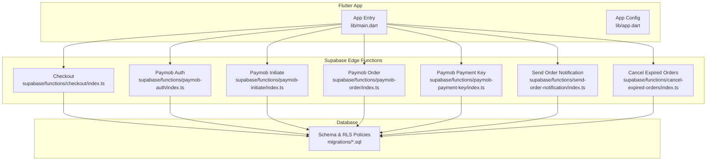
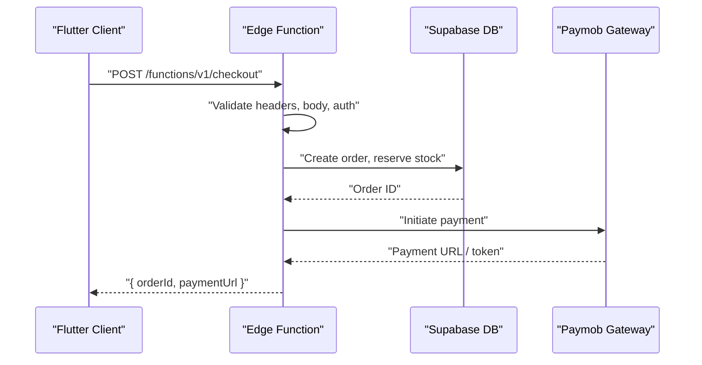
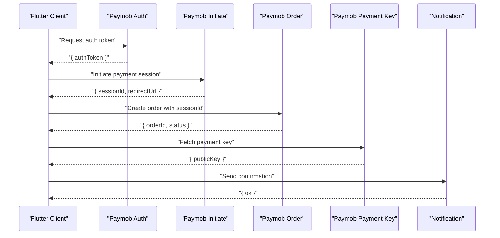
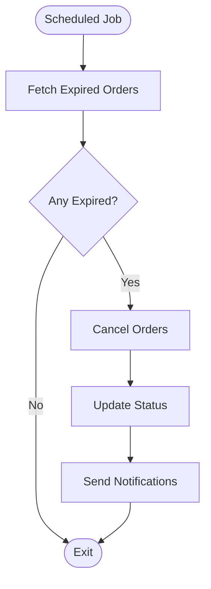
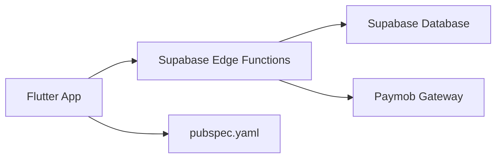

# API Security & Communication

<cite>
**Referenced Files in This Document**
- [main.dart](file://lib/main.dart)
- [app.dart](file://lib/app.dart)
- [checkout/index.ts](file://supabase/functions/checkout/index.ts)
- [paymob-auth/index.ts](file://supabase/functions/paymob-auth/index.ts)
- [paymob-initiate/index.ts](file://supabase/functions/paymob-initiate/index.ts)
- [paymob-order/index.ts](file://supabase/functions/paymob-order/index.ts)
- [paymob-payment-key/index.ts](file://supabase/functions/paymob-payment-key/index.ts)
- [send-order-notification/index.ts](file://supabase/functions/send-order-notification/index.ts)
- [cancel-expired-orders/index.ts](file://supabase/functions/cancel-expired-orders/index.ts)
- [003_auth_profiles_and_hardening.sql](file://supabase/migrations/003_auth_profiles_and_hardening.sql)
- [002_rls_policies.sql](file://supabase/migrations/002_rls_policies.sql)
- [pubspec.yaml](file://pubspec.yaml)
</cite>

## Table of Contents
1. [Introduction](#introduction)
2. [Project Structure](#project-structure)
3. [Core Components](#core-components)
4. [Architecture Overview](#architecture-overview)
5. [Detailed Component Analysis](#detailed-component-analysis)
6. [Dependency Analysis](#dependency-analysis)
7. [Performance Considerations](#performance-considerations)
8. [Troubleshooting Guide](#troubleshooting-guide)
9. [Conclusion](#conclusion)
10. [Appendices](#appendices)

## Introduction
This document explains API security and secure communication patterns used by the Albatal Store application. It covers secure endpoint design, request/response validation, authentication middleware, HTTPS enforcement, certificate pinning, secure network protocols, rate limiting and throttling, CORS and Content Security Policy (CSP), header security best practices, secure RPC function development, edge function security, server-side validation, API versioning and deprecation, and monitoring/logging/threat detection. The guidance is grounded in the repository’s Supabase Edge Functions and migrations, and it aligns with common Flutter client patterns for secure HTTP usage.

## Project Structure
The application uses a Flutter frontend and Supabase Edge Functions as the backend surface. Security-critical logic resides in:
- Supabase Edge Functions for payment flows, order management, notifications, and scheduled tasks
- Database schema and policies that enforce Row-Level Security (RLS) and data hardening
- Flutter app entry points and configuration files that integrate with Supabase and third-party services

**Diagram sources**
- [main.dart](file://lib/main.dart)
- [app.dart](file://lib/app.dart)
- [checkout/index.ts](file://supabase/functions/checkout/index.ts)
- [paymob-auth/index.ts](file://supabase/functions/paymob-auth/index.ts)
- [paymob-initiate/index.ts](file://supabase/functions/paymob-initiate/index.ts)
- [paymob-order/index.ts](file://supabase/functions/paymob-order/index.ts)
- [paymob-payment-key/index.ts](file://supabase/functions/paymob-payment-key/index.ts)
- [send-order-notification/index.ts](file://supabase/functions/send-order-notification/index.ts)
- [cancel-expired-orders/index.ts](file://supabase/functions/cancel-expired-orders/index.ts)
- [002_rls_policies.sql](file://supabase/migrations/002_rls_policies.sql)
- [003_auth_profiles_and_hardening.sql](file://supabase/migrations/003_auth_profiles_and_hardening.sql)

**Section sources**
- [main.dart](file://lib/main.dart)
- [app.dart](file://lib/app.dart)
- [checkout/index.ts](file://supabase/functions/checkout/index.ts)
- [paymob-auth/index.ts](file://supabase/functions/paymob-auth/index.ts)
- [paymob-initiate/index.ts](file://supabase/functions/paymob-initiate/index.ts)
- [paymob-order/index.ts](file://supabase/functions/paymob-order/index.ts)
- [paymob-payment-key/index.ts](file://supabase/functions/paymob-payment-key/index.ts)
- [send-order-notification/index.ts](file://supabase/functions/send-order-notification/index.ts)
- [cancel-expired-orders/index.ts](file://supabase/functions/cancel-expired-orders/index.ts)
- [002_rls_policies.sql](file://supabase/migrations/002_rls_policies.sql)
- [003_auth_profiles_and_hardening.sql](file://supabase/migrations/003_auth_profiles_and_hardening.sql)

## Core Components
- Secure Edge Functions: Each function validates inputs, enforces authorization via Supabase auth context, performs server-side business checks, and returns minimal, typed responses.
- Database Hardening: Migrations define schemas, constraints, and RLS policies to restrict access at the row level.
- Payment Integration: Paymob-related functions orchestrate payment initiation, key retrieval, order creation, and callback handling securely.
- Notifications: Asynchronous order notifications are sent after successful operations.
- Scheduled Tasks: Background jobs cancel expired orders to maintain consistency.

Key responsibilities:
- Input validation and sanitization
- Authentication and authorization checks
- Idempotency and race condition protection
- Secure secrets management
- Structured logging and error handling
- Rate limiting and abuse prevention

**Section sources**
- [checkout/index.ts](file://supabase/functions/checkout/index.ts)
- [paymob-auth/index.ts](file://supabase/functions/paymob-auth/index.ts)
- [paymob-initiate/index.ts](file://supabase/functions/paymob-initiate/index.ts)
- [paymob-order/index.ts](file://supabase/functions/paymob-order/index.ts)
- [paymob-payment-key/index.ts](file://supabase/functions/paymob-payment-key/index.ts)
- [send-order-notification/index.ts](file://supabase/functions/send-order-notification/index.ts)
- [cancel-expired-orders/index.ts](file://supabase/functions/cancel-expired-orders/index.ts)
- [002_rls_policies.sql](file://supabase/migrations/002_rls_policies.sql)
- [003_auth_profiles_and_hardening.sql](file://supabase/migrations/003_auth_profiles_and_hardening.sql)

## Architecture Overview
The system follows a secure-by-default pattern:
- Flutter clients call Supabase Edge Functions over HTTPS.
- Edge Functions authenticate requests using Supabase JWT, validate payloads, enforce RLS, and perform business logic.
- Sensitive operations (payments) use third-party APIs with secret keys stored securely in environment variables.
- Database changes are managed through migrations with RLS policies ensuring least privilege.

**Diagram sources**
- [checkout/index.ts](file://supabase/functions/checkout/index.ts)
- [paymob-initiate/index.ts](file://supabase/functions/paymob-initiate/index.ts)
- [002_rls_policies.sql](file://supabase/migrations/002_rls_policies.sql)

## Detailed Component Analysis

### Secure HTTP Client Configuration (Flutter)
Recommended patterns for secure HTTP communication from Flutter:
- Use an HTTP client configured for HTTPS only.
- Enforce strict TLS settings and consider certificate pinning for sensitive endpoints.
- Attach authentication tokens via interceptors or client configuration.
- Implement timeouts, retries with backoff, and structured error mapping.
- Avoid logging sensitive data; redact tokens and PII.

Typical implementation locations:
- Global HTTP client setup in app initialization
- Interceptors for adding auth headers and logging
- Environment-based base URLs for staging/production

[No sources needed since this section provides general guidance]

### Request/Response Validation
- Validate all incoming payloads in Edge Functions before database writes.
- Use type-safe schemas and reject malformed requests early.
- Return consistent error shapes with safe messages.

Example references:
- Checkout flow validation and response shaping
- Payment initiation payload checks

**Section sources**
- [checkout/index.ts](file://supabase/functions/checkout/index.ts)
- [paymob-initiate/index.ts](file://supabase/functions/paymob-initiate/index.ts)

### Authentication Middleware Implementation
- Require valid Supabase JWT for protected routes.
- Extract user identity from request context and attach to DB queries.
- Deny unauthenticated or unauthorized requests with appropriate status codes.

References:
- Authenticated checkout and payment flows
- Profile and policy enforcement

**Section sources**
- [checkout/index.ts](file://supabase/functions/checkout/index.ts)
- [003_auth_profiles_and_hardening.sql](file://supabase/migrations/003_auth_profiles_and_hardening.sql)

### HTTPS Enforcement, Certificate Pinning, and Secure Protocols
- Ensure all endpoints are served over HTTPS.
- For Flutter, configure the HTTP client to prefer modern TLS versions and disable insecure protocols.
- Consider certificate pinning for critical APIs to mitigate MITM risks.

[No sources needed since this section provides general guidance]

### Secure Network Communication Protocols
- Prefer HTTP/2 where supported.
- Use strong cipher suites and enable HSTS on servers.
- Validate server certificates and handle errors gracefully.

[No sources needed since this section provides general guidance]

### Rate Limiting and Throttling
- Implement per-user and global rate limits in Edge Functions.
- Use Redis or KV stores for counters if available; otherwise, leverage Supabase-backed tables with careful locking.
- Return 429 Too Many Requests with retry-after hints when exceeded.

[No sources needed since this section provides general guidance]

### CORS and CSP Configuration
- Restrict allowed origins, methods, and headers for Edge Functions.
- Set CSP headers to prevent XSS and injection attacks.
- Whitelist only necessary domains for external calls.

[No sources needed since this section provides general guidance]

### Header Security Best Practices
- Set security headers like Strict-Transport-Security, X-Content-Type-Options, X-Frame-Options, Referrer-Policy, and Permissions-Policy.
- Avoid exposing internal details in error responses.

[No sources needed since this section provides general guidance]

### Secure RPC Function Development and Edge Function Security
- Treat each Edge Function as a small service: validate inputs, enforce auth, minimize side effects, and log securely.
- Use environment variables for secrets; never hardcode credentials.
- Apply idempotency keys for payment-related operations.

References:
- Paymob integration functions
- Order creation and notification sending

**Section sources**
- [paymob-auth/index.ts](file://supabase/functions/paymob-auth/index.ts)
- [paymob-initiate/index.ts](file://supabase/functions/paymob-initiate/index.ts)
- [paymob-order/index.ts](file://supabase/functions/paymob-order/index.ts)
- [paymob-payment-key/index.ts](file://supabase/functions/paymob-payment-key/index.ts)
- [send-order-notification/index.ts](file://supabase/functions/send-order-notification/index.ts)

### Server-Side Validation Patterns
- Validate types, ranges, and referential integrity before mutations.
- Use database constraints and triggers to enforce invariants.
- Centralize validation logic to avoid duplication.

**Section sources**
- [002_rls_policies.sql](file://supabase/migrations/002_rls_policies.sql)
- [003_auth_profiles_and_hardening.sql](file://supabase/migrations/003_auth_profiles_and_hardening.sql)

### API Versioning, Deprecation, and Backward Compatibility
- Prefix API paths with version segments (e.g., /v1).
- Maintain backward compatibility during deprecation windows.
- Provide migration guides and clear deprecation notices.

[No sources needed since this section provides general guidance]

### Monitoring, Security Logging, and Threat Detection
- Log structured events: request IDs, timestamps, user IDs, outcomes, and error codes.
- Redact sensitive fields (tokens, PII, card data).
- Integrate with centralized logging and alerting systems.
- Detect anomalies such as repeated failures, unusual spikes, and invalid signatures.

[No sources needed since this section provides general guidance]

### Payment Flow Security Sequence

**Diagram sources**
- [paymob-auth/index.ts](file://supabase/functions/paymob-auth/index.ts)
- [paymob-initiate/index.ts](file://supabase/functions/paymob-initiate/index.ts)
- [paymob-order/index.ts](file://supabase/functions/paymob-order/index.ts)
- [paymob-payment-key/index.ts](file://supabase/functions/paymob-payment-key/index.ts)
- [send-order-notification/index.ts](file://supabase/functions/send-order-notification/index.ts)

### Expired Order Cancellation Flow

**Diagram sources**
- [cancel-expired-orders/index.ts](file://supabase/functions/cancel-expired-orders/index.ts)

## Dependency Analysis
External dependencies relevant to security include:
- Supabase client libraries for authenticated requests and RLS enforcement
- Third-party payment gateway SDKs or HTTP clients for Paymob
- Logging and analytics packages for observability

**Diagram sources**
- [pubspec.yaml](file://pubspec.yaml)

**Section sources**
- [pubspec.yaml](file://pubspec.yaml)

## Performance Considerations
- Minimize payload sizes and avoid unnecessary computations in hot paths.
- Cache non-sensitive data where appropriate.
- Use connection pooling and efficient queries.
- Implement exponential backoff for retries and circuit breakers for external calls.

[No sources needed since this section provides general guidance]

## Troubleshooting Guide
Common issues and mitigations:
- Authentication failures: Verify JWT validity, audience, and issuer; ensure correct scopes.
- CORS errors: Confirm allowed origins and headers; test preflight requests.
- Rate limit hits: Inspect counters and adjust thresholds; implement client-side backoff.
- Payment errors: Check signature verification, idempotency keys, and webhook ordering.
- Logging gaps: Ensure structured logs capture request IDs and outcomes without sensitive data.

[No sources needed since this section provides general guidance]

## Conclusion
Albatal Store’s security model centers on authenticated Edge Functions, strict input validation, RLS-enforced database access, and secure integrations with payment providers. By enforcing HTTPS, applying robust headers, implementing rate limits, and maintaining thorough logging, the application protects against common threats while preserving performance and usability.

[No sources needed since this section summarizes without analyzing specific files]

## Appendices

### Security Checklist
- Enforce HTTPS and modern TLS
- Validate and sanitize all inputs
- Authenticate and authorize every request
- Apply RLS policies consistently
- Manage secrets via environment variables
- Implement rate limiting and throttling
- Configure CORS and CSP appropriately
- Add structured, redacted logging
- Monitor and alert on anomalies
- Version APIs and manage deprecations carefully

[No sources needed since this section provides general guidance]