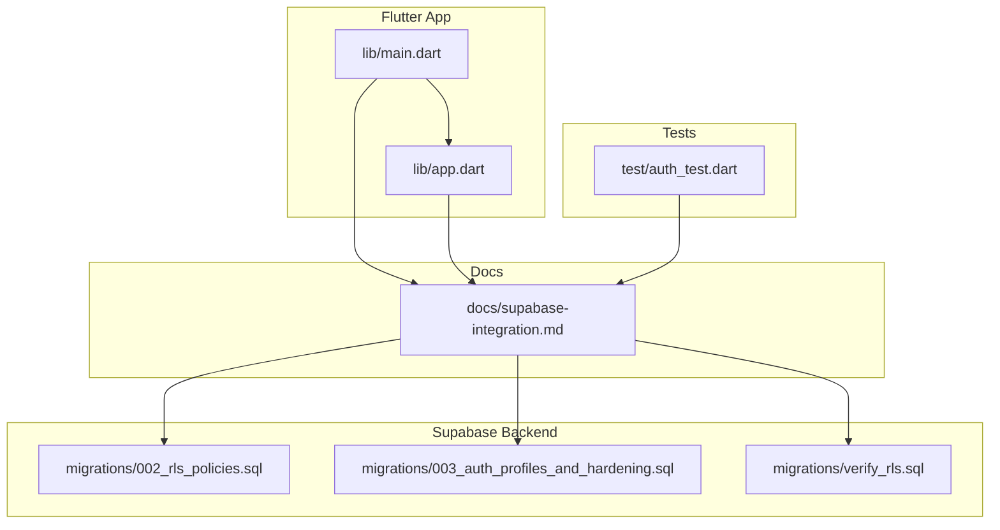
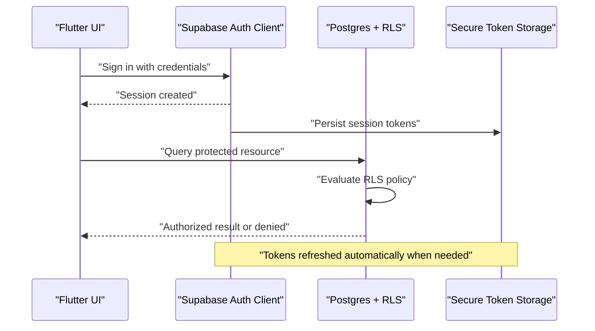
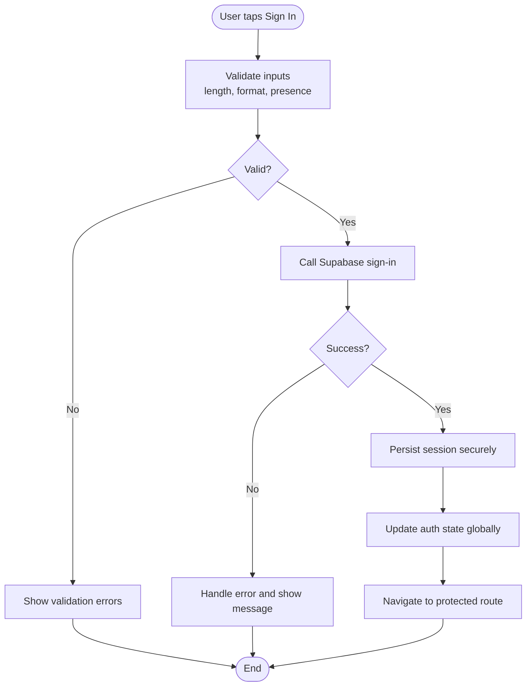
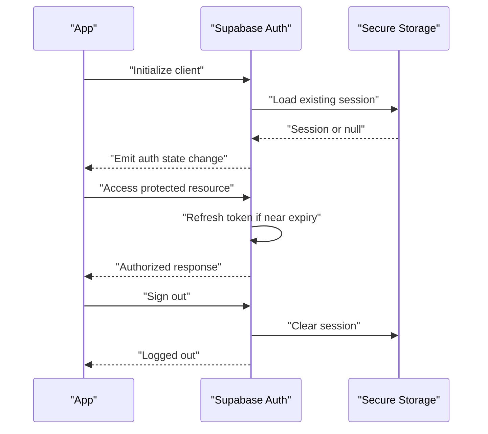
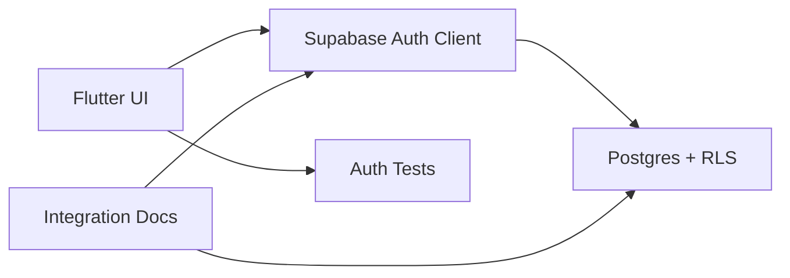

# Authentication Security

<cite>
**Referenced Files in This Document**
- [supabase-integration.md](file://docs/supabase-integration.md)
- [003_auth_profiles_and_hardening.sql](file://supabase/migrations/003_auth_profiles_and_hardening.sql)
- [002_rls_policies.sql](file://supabase/migrations/002_rls_policies.sql)
- [verify_rls.sql](file://supabase/migrations/verify_rls.sql)
- [auth_test.dart](file://test/auth_test.dart)
- [main.dart](file://lib/main.dart)
- [app.dart](file://lib/app.dart)
</cite>

## Table of Contents
1. [Introduction](#introduction)
2. [Project Structure](#project-structure)
3. [Core Components](#core-components)
4. [Architecture Overview](#architecture-overview)
5. [Detailed Component Analysis](#detailed-component-analysis)
6. [Dependency Analysis](#dependency-analysis)
7. [Performance Considerations](#performance-considerations)
8. [Troubleshooting Guide](#troubleshooting-guide)
9. [Conclusion](#conclusion)
10. [Appendices](#appendices)

## Introduction
This document explains the authentication security implementation in the Albatal Store application. It covers secure token management, session handling, JWT validation, Supabase integration, user profile security, password hashing strategies, Row Level Security (RLS), input validation, protection against brute force and credential stuffing, secure token storage, automatic logout, multi-device sessions, registration flows, email verification, and account recovery.

## Project Structure
The repository is a Flutter app with Supabase as the backend. Authentication-related configuration and policies are defined in migrations and documentation files under docs and supabase directories. The Flutter entry points are in lib/main.dart and lib/app.dart. Tests for authentication behavior exist under test/auth_test.dart.

**Diagram sources**
- [main.dart](file://lib/main.dart)
- [app.dart](file://lib/app.dart)
- [supabase-integration.md](file://docs/supabase-integration.md)
- [002_rls_policies.sql](file://supabase/migrations/002_rls_policies.sql)
- [003_auth_profiles_and_hardening.sql](file://supabase/migrations/003_auth_profiles_and_hardening.sql)
- [verify_rls.sql](file://supabase/migrations/verify_rls.sql)

**Section sources**
- [supabase-integration.md](file://docs/supabase-integration.md)
- [002_rls_policies.sql](file://supabase/migrations/002_rls_policies.sql)
- [003_auth_profiles_and_hardening.sql](file://supabase/migrations/003_auth_profiles_and_hardening.sql)
- [verify_rls.sql](file://supabase/migrations/verify_rls.sql)
- [auth_test.dart](file://test/auth_test.dart)
- [main.dart](file://lib/main.dart)
- [app.dart](file://lib/app.dart)

## Core Components
- Supabase client initialization and configuration for auth and RLS enforcement.
- Auth state management to track login status and propagate across the app.
- Secure token lifecycle: obtain, store, refresh, and invalidate tokens.
- User profile model and security constraints via RLS policies.
- Input validation for credentials and registration payloads.
- Protection mechanisms against brute force and credential stuffing.
- Email verification and account recovery flows.

Key responsibilities:
- Keep secrets out of source code; use environment-based configuration.
- Enforce least privilege at the database layer with RLS.
- Validate all inputs on both client and server sides.
- Persist sessions securely and handle expiration gracefully.

**Section sources**
- [supabase-integration.md](file://docs/supabase-integration.md)
- [003_auth_profiles_and_hardening.sql](file://supabase/migrations/003_auth_profiles_and_hardening.sql)
- [002_rls_policies.sql](file://supabase/migrations/002_rls_policies.sql)

## Architecture Overview
Authentication integrates Flutter UI with Supabase Auth and Postgres RLS. Tokens are managed by the SDK and persisted securely. RLS policies restrict data access per authenticated user.

**Diagram sources**
- [supabase-integration.md](file://docs/supabase-integration.md)
- [002_rls_policies.sql](file://supabase/migrations/002_rls_policies.sql)

## Detailed Component Analysis

### Secure Login Flow
- Collects email/password with strict input validation.
- Calls Supabase sign-in; on success, stores session securely and updates global auth state.
- On failure, returns actionable error messages without leaking sensitive details.
- Supports automatic token refresh handled by the SDK.

[No diagram sources since this flow is conceptual]

**Section sources**
- [supabase-integration.md](file://docs/supabase-integration.md)
- [auth_test.dart](file://test/auth_test.dart)

### Session Handling and Token Management
- Session persistence uses platform-secure storage provided by the SDK.
- Automatic refresh occurs before expiry; if refresh fails, the app logs out and prompts re-authentication.
- Multi-device sessions are supported by default; each device maintains its own session.
- Logout clears local session and invalidates server-side session.

**Diagram sources**
- [supabase-integration.md](file://docs/supabase-integration.md)

**Section sources**
- [supabase-integration.md](file://docs/supabase-integration.md)

### JWT Validation Patterns
- The SDK validates JWT signatures and claims automatically.
- Applications should rely on SDK-provided session state rather than manual parsing.
- For custom endpoints, validate tokens server-side and enforce RLS.

[No sources needed since this section provides general guidance]

### Supabase Integration and Configuration
- Initialize Supabase client with environment variables.
- Configure auth providers and redirect URLs for web where applicable.
- Ensure RLS policies are enabled and verified.

**Section sources**
- [supabase-integration.md](file://docs/supabase-integration.md)

### User Profile Security
- Profiles are stored in a dedicated table linked to the authenticated user.
- Access to profiles is restricted via RLS so users can only read/update their own records.
- Sensitive fields are minimized and validated on write.

**Section sources**
- [003_auth_profiles_and_hardening.sql](file://supabase/migrations/003_auth_profiles_and_hardening.sql)
- [002_rls_policies.sql](file://supabase/migrations/002_rls_policies.sql)

### Password Hashing Strategies
- Password hashing is performed server-side by Supabase; clients never handle raw hashes.
- Enforce strong password requirements and rate limiting at the provider level.

**Section sources**
- [003_auth_profiles_and_hardening.sql](file://supabase/migrations/003_auth_profiles_and_hardening.sql)

### Row Level Security (RLS) Policies
- RLS policies enforce row-level access control for authenticated users.
- Policies ensure users can only access their own data and prevent unauthorized reads/writes.
- Verification scripts help confirm policies are active and effective.

**Section sources**
- [002_rls_policies.sql](file://supabase/migrations/002_rls_policies.sql)
- [verify_rls.sql](file://supabase/migrations/verify_rls.sql)

### Input Validation for Credentials
- Enforce minimum length, allowed characters, and required fields.
- Normalize inputs (trim whitespace) before sending to the server.
- Provide clear, non-leaking error messages.

**Section sources**
- [auth_test.dart](file://test/auth_test.dart)

### Protection Against Brute Force and Credential Stuffing
- Enable rate limiting and account lockout features through Supabase settings.
- Implement client-side delays and disable repeated attempts after failures.
- Monitor and alert on suspicious activity patterns.

**Section sources**
- [supabase-integration.md](file://docs/supabase-integration.md)

### Secure Storage of Authentication Tokens
- Use platform-secure storage provided by the SDK to persist sessions.
- Avoid logging tokens or storing them in insecure locations.
- Clear tokens on logout and when switching users.

**Section sources**
- [supabase-integration.md](file://docs/supabase-integration.md)

### Automatic Logout Mechanisms
- Detect expired or invalid sessions and prompt re-authentication.
- Invalidate local caches and navigate to login on logout.
- Respect user-initiated logout across devices when supported by provider settings.

**Section sources**
- [supabase-integration.md](file://docs/supabase-integration.md)

### Multi-Device Session Management
- Each device maintains an independent session.
- Support revoking sessions centrally if needed via provider APIs.
- Display active sessions and allow users to manage devices.

**Section sources**
- [supabase-integration.md](file://docs/supabase-integration.md)

### Registration Flows, Email Verification, and Account Recovery
- Registration collects minimal required fields and enforces validation.
- Send verification emails and require confirmation before enabling full access.
- Account recovery sends time-limited reset links and enforces password strength.

**Section sources**
- [supabase-integration.md](file://docs/supabase-integration.md)

## Dependency Analysis
Authentication depends on:
- Flutter UI components that trigger auth actions.
- Supabase client for auth operations and session management.
- Database layer secured by RLS policies.
- Tests validating expected behaviors.

**Diagram sources**
- [supabase-integration.md](file://docs/supabase-integration.md)
- [002_rls_policies.sql](file://supabase/migrations/002_rls_policies.sql)
- [auth_test.dart](file://test/auth_test.dart)

**Section sources**
- [supabase-integration.md](file://docs/supabase-integration.md)
- [002_rls_policies.sql](file://supabase/migrations/002_rls_policies.sql)
- [auth_test.dart](file://test/auth_test.dart)

## Performance Considerations
- Minimize network calls by caching non-sensitive UI state while relying on SDK-managed sessions.
- Debounce rapid login attempts to reduce load and improve UX.
- Prefer server-side validations and RLS to avoid heavy client-side checks.

[No sources needed since this section provides general guidance]

## Troubleshooting Guide
Common issues and resolutions:
- Invalid session: Re-initialize the client and ensure secure storage is accessible.
- RLS denial: Verify policies are enabled and match current user context.
- Rate limited: Wait for cooldown or adjust provider settings.
- Email not received: Check spam folder and verify provider configuration.

Use tests to reproduce and validate fixes.

**Section sources**
- [auth_test.dart](file://test/auth_test.dart)
- [supabase-integration.md](file://docs/supabase-integration.md)

## Conclusion
The Albatal Store leverages Supabase for robust authentication, secure token management, and fine-grained data access via RLS. By combining strict input validation, secure storage, and server-enforced policies, the app mitigates common threats and supports safe multi-device sessions. Follow the guidelines here to maintain security during feature development and updates.

[No sources needed since this section summarizes without analyzing specific files]

## Appendices

### Implementation Checklist
- Initialize Supabase client with environment variables.
- Implement login, register, logout, and password reset flows with validation.
- Persist sessions securely and handle refresh/logout.
- Define and verify RLS policies for all sensitive tables.
- Add tests covering auth states and edge cases.
- Enable rate limiting and monitoring for suspicious activity.

[No sources needed since this section provides general guidance]