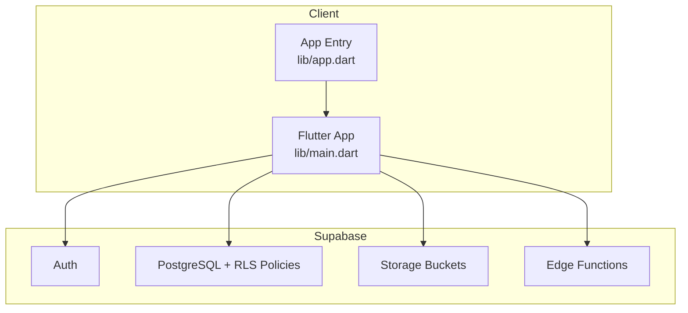
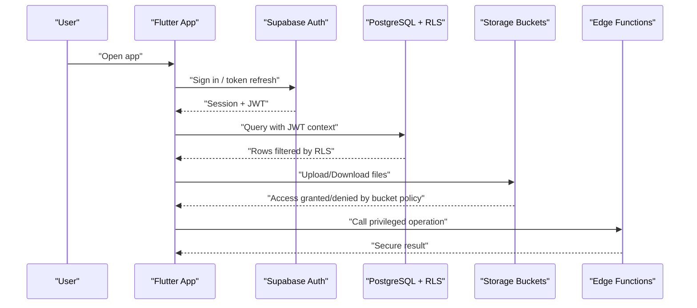
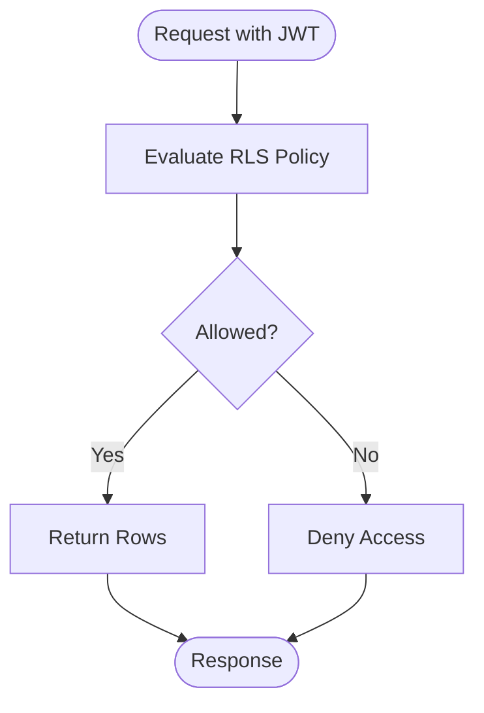
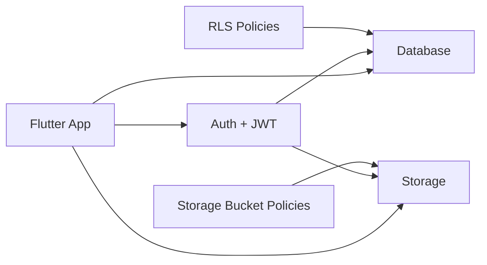

# Data Protection & Storage Security

<cite>
**Referenced Files in This Document**
- [002_rls_policies.sql](file://supabase/migrations/002_rls_policies.sql)
- [003_auth_profiles_and_hardening.sql](file://supabase/migrations/003_auth_profiles_and_hardening.sql)
- [005_storage_buckets.sql](file://supabase/migrations/005_storage_buckets.sql)
- [verify_rls.sql](file://supabase/migrations/verify_rls.sql)
- [main.dart](file://lib/main.dart)
- [app.dart](file://lib/app.dart)
- [supabase-integration.md](file://docs/supabase-integration.md)
</cite>

## Table of Contents
1. [Introduction](#introduction)
2. [Project Structure](#project-structure)
3. [Core Components](#core-components)
4. [Architecture Overview](#architecture-overview)
5. [Detailed Component Analysis](#detailed-component-analysis)
6. [Dependency Analysis](#dependency-analysis)
7. [Performance Considerations](#performance-considerations)
8. [Troubleshooting Guide](#troubleshooting-guide)
9. [Conclusion](#conclusion)
10. [Appendices](#appendices)

## Introduction
This document explains how data protection and secure storage are implemented across the Albatal Store application. It focuses on Row Level Security (RLS) policies, database access controls, data isolation strategies, secure local storage, encrypted preferences, secure caching, input validation and sanitization, output encoding, secure file upload/download, storage bucket permissions, integrity verification, privacy compliance, retention and deletion, API response protection, CORS, WebSocket security, backup and disaster recovery, and breach response.

## Project Structure
The application is a Flutter app backed by Supabase. Security is enforced primarily at the database layer via RLS policies and storage buckets, while the client enforces safe usage patterns and integrates securely with Supabase services.

**Diagram sources**
- [main.dart](file://lib/main.dart)
- [app.dart](file://lib/app.dart)
- [supabase-integration.md](file://docs/supabase-integration.md)

**Section sources**
- [supabase-integration.md](file://docs/supabase-integration.md)

## Core Components
- Database access control via RLS policies to enforce row-level isolation per user and role.
- Storage bucket policies to restrict read/write access to authenticated users and specific paths.
- Auth profiles and hardening measures to ensure minimal data exposure and strong defaults.
- Client-side integration that respects server-enforced policies and applies safe handling practices.

Key implementation anchors:
- RLS policies and verification scripts
- Storage bucket definitions and permissions
- Auth profile schema and hardening rules
- Supabase integration configuration

**Section sources**
- [002_rls_policies.sql](file://supabase/migrations/002_rls_policies.sql)
- [003_auth_profiles_and_hardening.sql](file://supabase/migrations/003_auth_profiles_and_hardening.sql)
- [005_storage_buckets.sql](file://supabase/migrations/005_storage_buckets.sql)
- [verify_rls.sql](file://supabase/migrations/verify_rls.sql)
- [supabase-integration.md](file://docs/supabase-integration.md)

## Architecture Overview
Security boundaries are layered:
- Client enforces safe UI flows and uses least-privilege operations.
- Supabase Auth authenticates users and issues tokens.
- PostgreSQL RLS enforces fine-grained access to rows.
- Storage Bucket policies enforce path-based access.
- Edge functions perform privileged server-side logic when needed.

[No sources needed since this diagram shows conceptual workflow, not actual code structure]

## Detailed Component Analysis

### Row Level Security (RLS) Policies
RLS ensures that each user can only access their own data or data they are explicitly permitted to see. Policies should be defined per table and per operation (SELECT, INSERT, UPDATE, DELETE). Verification scripts help validate that policies behave as expected.

Implementation anchors:
- Policy definitions and conditions
- Role-based and user-scoped filters
- Verification tests to assert correct behavior

**Diagram sources**
- [002_rls_policies.sql](file://supabase/migrations/002_rls_policies.sql)
- [verify_rls.sql](file://supabase/migrations/verify_rls.sql)

**Section sources**
- [002_rls_policies.sql](file://supabase/migrations/002_rls_policies.sql)
- [verify_rls.sql](file://supabase/migrations/verify_rls.sql)

### Database Access Controls and Data Isolation
- Use explicit policies instead of relying on default public access.
- Enforce tenant/user scoping using authenticated user IDs from JWT claims.
- Prefer parameterized queries and server-side constraints to prevent injection.
- Apply NOT NULL, CHECK constraints, and foreign keys to maintain integrity.

Hardening measures include:
- Restricting roles and privileges
- Disabling unnecessary extensions
- Auditing sensitive tables where appropriate

**Section sources**
- [003_auth_profiles_and_hardening.sql](file://supabase/migrations/003_auth_profiles_and_hardening.sql)

### Secure Local Storage and Encrypted Preferences
Guidelines for storing sensitive data on-device:
- Avoid storing secrets in plain text; use platform keystores/keychains.
- For Flutter, prefer secure storage plugins that wrap OS key stores.
- Encrypt application preferences containing sensitive values before persisting.
- Limit cache lifetime and scope for sensitive data.

Operational notes:
- Clear caches on logout or after inactivity.
- Do not log sensitive fields.
- Validate and sanitize all inputs before writing to any persistent store.

[No sources needed since this section provides general guidance]

### Secure Caching Mechanisms
- Cache non-sensitive data only.
- Set short TTLs for cached responses.
- Invalidate caches on auth state changes or policy updates.
- Ensure cache directories are not exposed to other apps.

[No sources needed since this section provides general guidance]

### Input Validation, Sanitization, and Output Encoding
To prevent injection and XSS:
- Validate and normalize inputs on the client before sending requests.
- Enforce schemas and constraints on the server (database checks).
- Encode outputs appropriately for the rendering context.
- Use parameterized queries and avoid string concatenation.

Practical examples to look for in the codebase:
- Input validators for forms and payloads
- Server-side constraints and triggers
- Output encoding utilities used in views

[No sources needed since this section provides general guidance]

### Secure File Upload and Download
Storage bucket policies should:
- Restrict uploads to authenticated users only.
- Scope paths by user ID or order ID to isolate files.
- Allow downloads only to authorized users.
- Optionally enforce file type and size limits.

Integrity verification:
- Compute checksums on upload and verify on download if required.
- Use signed URLs for time-limited access.

**Section sources**
- [005_storage_buckets.sql](file://supabase/migrations/005_storage_buckets.sql)

### API Response Protection and CORS
- Minimize payload size and exclude sensitive fields.
- Apply rate limiting and request signing where applicable.
- Configure CORS to allow only trusted origins.
- Use HTTPS-only cookies and secure headers.

[No sources needed since this section provides general guidance]

### Securing WebSocket Connections
- Require authentication before establishing connections.
- Authorize channels/topics per user or tenant.
- Validate messages on both ends and reject malformed inputs.
- Implement reconnection backoff and idle timeouts.

[No sources needed since this section provides general guidance]

### Privacy Compliance, Retention, and Secure Deletion
- Honor user consent and data minimization principles.
- Provide mechanisms to export and delete personal data.
- Implement scheduled jobs to purge expired or stale records.
- Ensure cascading deletes remove related artifacts (files, logs).

[No sources needed since this section provides general guidance]

### Backup Security and Disaster Recovery
- Encrypt backups at rest and in transit.
- Restrict access to backup repositories.
- Test restore procedures regularly.
- Define RTO/RPO targets and automate failover drills.

[No sources needed since this section provides general guidance]

### Data Breach Response Protocols
- Detect anomalies and alert on suspicious activity.
- Contain affected systems and revoke compromised credentials.
- Notify stakeholders and regulators as required.
- Perform post-mortem and update defenses.

[No sources needed since this section provides general guidance]

## Dependency Analysis
Security depends on correct configuration and consistent enforcement across layers.

**Diagram sources**
- [002_rls_policies.sql](file://supabase/migrations/002_rls_policies.sql)
- [005_storage_buckets.sql](file://supabase/migrations/005_storage_buckets.sql)
- [supabase-integration.md](file://docs/supabase-integration.md)

**Section sources**
- [002_rls_policies.sql](file://supabase/migrations/002_rls_policies.sql)
- [005_storage_buckets.sql](file://supabase/migrations/005_storage_buckets.sql)
- [supabase-integration.md](file://docs/supabase-integration.md)

## Performance Considerations
- Keep RLS policies simple and indexed to avoid slow queries.
- Avoid heavy computations inside policies; precompute where possible.
- Cache non-sensitive data judiciously to reduce repeated calls.
- Monitor query plans and add indexes for frequently filtered columns.

[No sources needed since this section provides general guidance]

## Troubleshooting Guide
Common issues and checks:
- RLS denies access unexpectedly: review policy conditions and test with verification scripts.
- Storage upload denied: confirm bucket policies and file path scoping.
- CORS errors: verify allowed origins and methods.
- Token expiration: implement refresh logic and handle session expiry gracefully.

Useful references:
- RLS policy definitions and verification
- Storage bucket configuration
- Supabase integration notes

**Section sources**
- [verify_rls.sql](file://supabase/migrations/verify_rls.sql)
- [005_storage_buckets.sql](file://supabase/migrations/005_storage_buckets.sql)
- [supabase-integration.md](file://docs/supabase-integration.md)

## Conclusion
Albatal Store’s security model centers on strict database-level isolation via RLS, scoped storage bucket policies, and careful client-side practices. By combining these server-enforced controls with robust input validation, secure local storage, and operational safeguards like backups and incident response, the application maintains strong confidentiality, integrity, and availability for user data.

[No sources needed since this section summarizes without analyzing specific files]

## Appendices

### Appendix A: Key Migration Anchors
- RLS policies and verification
- Auth profiles and hardening
- Storage buckets and permissions

**Section sources**
- [002_rls_policies.sql](file://supabase/migrations/002_rls_policies.sql)
- [003_auth_profiles_and_hardening.sql](file://supabase/migrations/003_auth_profiles_and_hardening.sql)
- [005_storage_buckets.sql](file://supabase/migrations/005_storage_buckets.sql)
- [verify_rls.sql](file://supabase/migrations/verify_rls.sql)