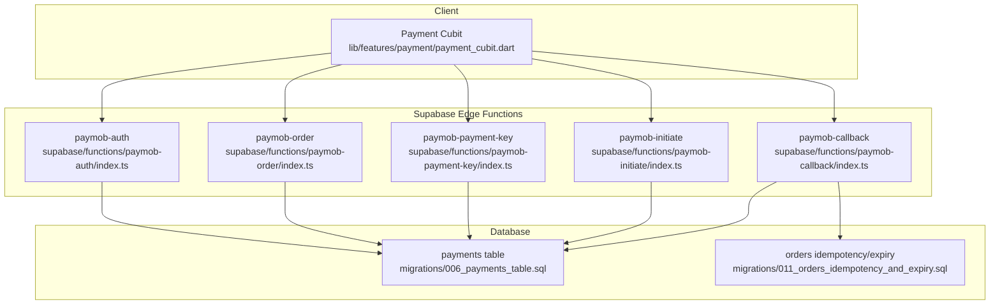
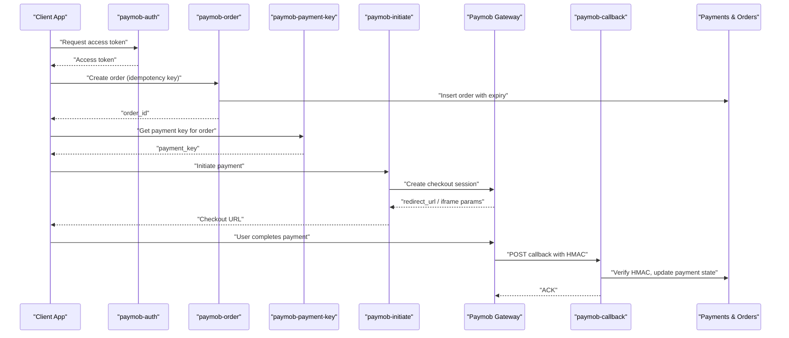
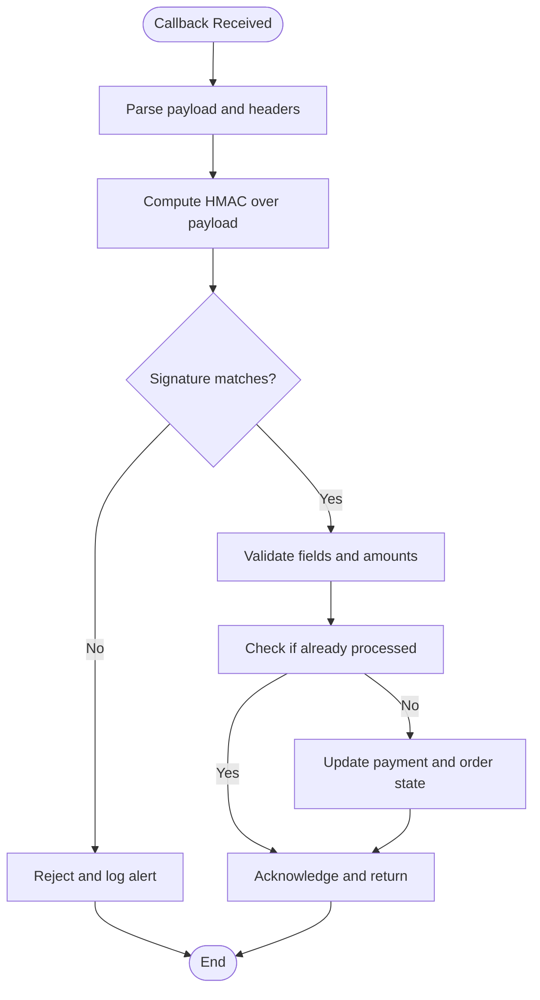
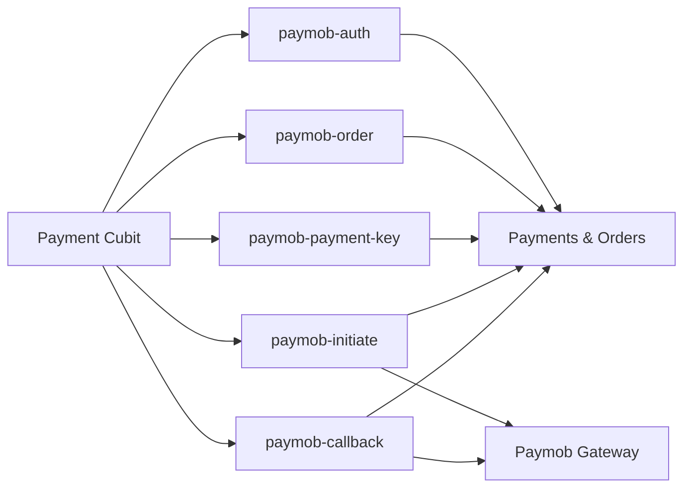

# Payment Security

<cite>
**Referenced Files in This Document**
- [supabase/functions/paymob-auth/index.ts](file://supabase/functions/paymob-auth/index.ts)
- [supabase/functions/paymob-initiate/index.ts](file://supabase/functions/paymob-initiate/index.ts)
- [supabase/functions/paymob-payment-key/index.ts](file://supabase/functions/paymob-payment-key/index.ts)
- [supabase/functions/paymob-order/index.ts](file://supabase/functions/paymob-order/index.ts)
- [supabase/functions/paymob-callback/index.ts](file://supabase/functions/paymob-callback/index.ts)
- [supabase/migrations/006_payments_table.sql](file://supabase/migrations/006_payments_table.sql)
- [supabase/migrations/011_orders_idempotency_and_expiry.sql](file://supabase/migrations/011_orders_idempotency_and_expiry.sql)
- [lib/features/payment/payment_cubit.dart](file://lib/features/payment/payment_cubit.dart)
- [test/payment_test.dart](file://test/payment_test.dart)
- [test/payment_integration_test.dart](file://test/payment_integration_test.dart)
</cite>

## Table of Contents
1. [Introduction](#introduction)
2. [Project Structure](#project-structure)
3. [Core Components](#core-components)
4. [Architecture Overview](#architecture-overview)
5. [Detailed Component Analysis](#detailed-component-analysis)
6. [Dependency Analysis](#dependency-analysis)
7. [Performance Considerations](#performance-considerations)
8. [Troubleshooting Guide](#troubleshooting-guide)
9. [Conclusion](#conclusion)
10. [Appendices](#appendices)

## Introduction
This document explains the payment security implementation and PCI DSS compliance considerations for the Albatal Store application, focusing on secure integration with Paymob. It covers HMAC signature verification, callback validation, transaction security, secure data transmission, encryption practices, sensitive information handling, idempotency keys, state management, webhook processing, logging, fraud prevention, testing, monitoring, and failure handling. The goal is to provide a comprehensive guide that balances technical depth with accessibility for both developers and reviewers.

## Project Structure
The payment system spans serverless functions (Supabase Edge Functions), database schema migrations, and client-side orchestration:
- Serverless functions handle authentication with Paymob, order creation, payment key retrieval, initiation, and callback processing.
- Database migrations define payments and orders with idempotency and expiry controls.
- Client-side components orchestrate checkout flows and manage payment state.

**Diagram sources**
- [supabase/functions/paymob-auth/index.ts](file://supabase/functions/paymob-auth/index.ts)
- [supabase/functions/paymob-order/index.ts](file://supabase/functions/paymob-order/index.ts)
- [supabase/functions/paymob-payment-key/index.ts](file://supabase/functions/paymob-payment-key/index.ts)
- [supabase/functions/paymob-initiate/index.ts](file://supabase/functions/paymob-initiate/index.ts)
- [supabase/functions/paymob-callback/index.ts](file://supabase/functions/paymob-callback/index.ts)
- [supabase/migrations/006_payments_table.sql](file://supabase/migrations/006_payments_table.sql)
- [supabase/migrations/011_orders_idempotency_and_expiry.sql](file://supabase/migrations/011_orders_idempotency_and_expiry.sql)
- [lib/features/payment/payment_cubit.dart](file://lib/features/payment/payment_cubit.dart)

**Section sources**
- [supabase/functions/paymob-auth/index.ts](file://supabase/functions/paymob-auth/index.ts)
- [supabase/functions/paymob-order/index.ts](file://supabase/functions/paymob-order/index.ts)
- [supabase/functions/paymob-payment-key/index.ts](file://supabase/functions/paymob-payment-key/index.ts)
- [supabase/functions/paymob-initiate/index.ts](file://supabase/functions/paymob-initiate/index.ts)
- [supabase/functions/paymob-callback/index.ts](file://supabase/functions/paymob-callback/index.ts)
- [supabase/migrations/006_payments_table.sql](file://supabase/migrations/006_payments_table.sql)
- [supabase/migrations/011_orders_idempotency_and_expiry.sql](file://supabase/migrations/011_orders_idempotency_and_expiry.sql)
- [lib/features/payment/payment_cubit.dart](file://lib/features/payment/payment_cubit.dart)

## Core Components
- Paymob Authentication: Securely obtains an access token using API credentials stored securely on the server.
- Order Creation: Creates an order record with idempotency support and sets expiration to prevent stale orders.
- Payment Key Retrieval: Fetches a one-time payment key scoped to the order and amount.
- Payment Initiation: Initiates the Paymob checkout session and returns a redirect URL or iframe parameters.
- Callback Processing: Validates Paymob callbacks via HMAC signatures, updates payment state, and enforces idempotency.
- Payments Schema: Defines the payments table with required fields and constraints for auditability and integrity.
- Idempotency and Expiry: Ensures orders cannot be processed multiple times and expire after a defined window.
- Client Orchestration: Manages user interactions, calls server endpoints, and handles success/failure states.

**Section sources**
- [supabase/functions/paymob-auth/index.ts](file://supabase/functions/paymob-auth/index.ts)
- [supabase/functions/paymob-order/index.ts](file://supabase/functions/paymob-order/index.ts)
- [supabase/functions/paymob-payment-key/index.ts](file://supabase/functions/paymob-payment-key/index.ts)
- [supabase/functions/paymob-initiate/index.ts](file://supabase/functions/paymob-initiate/index.ts)
- [supabase/functions/paymob-callback/index.ts](file://supabase/functions/paymob-callback/index.ts)
- [supabase/migrations/006_payments_table.sql](file://supabase/migrations/006_payments_table.sql)
- [supabase/migrations/011_orders_idempotency_and_expiry.sql](file://supabase/migrations/011_orders_idempotency_and_expiry.sql)
- [lib/features/payment/payment_cubit.dart](file://lib/features/payment/payment_cubit.dart)

## Architecture Overview
The secure checkout flow uses server-only secrets and cryptographic verification to protect sensitive operations. The client never touches raw card data; it interacts with server endpoints that communicate with Paymob.

**Diagram sources**
- [supabase/functions/paymob-auth/index.ts](file://supabase/functions/paymob-auth/index.ts)
- [supabase/functions/paymob-order/index.ts](file://supabase/functions/paymob-order/index.ts)
- [supabase/functions/paymob-payment-key/index.ts](file://supabase/functions/paymob-payment-key/index.ts)
- [supabase/functions/paymob-initiate/index.ts](file://supabase/functions/paymob-initiate/index.ts)
- [supabase/functions/paymob-callback/index.ts](file://supabase/functions/paymob-callback/index.ts)
- [supabase/migrations/006_payments_table.sql](file://supabase/migrations/006_payments_table.sql)
- [supabase/migrations/011_orders_idempotency_and_expiry.sql](file://supabase/migrations/011_orders_idempotency_and_expiry.sql)

## Detailed Component Analysis

### Paymob Authentication
Purpose:
- Obtain a short-lived access token from Paymob using server-stored credentials.
- Ensure no client-side exposure of secrets.

Security considerations:
- Secrets must be provided via environment variables configured at deployment time.
- Token responses should be validated and cached minimally.
- Errors should not leak internal details.

Implementation references:
- Access token request and response handling are implemented in the auth function.

**Section sources**
- [supabase/functions/paymob-auth/index.ts](file://supabase/functions/paymob-auth/index.ts)

### Order Creation with Idempotency
Purpose:
- Create an order tied to a customer and cart total.
- Enforce idempotency via a unique idempotency key to prevent duplicate charges.
- Set an expiration window to avoid processing stale orders.

Security considerations:
- Validate all inputs (amount currency, order metadata).
- Reject expired orders.
- Persist only non-sensitive order data; do not store PAN/CVV.

Implementation references:
- Order creation logic and idempotency checks are implemented in the order function.
- Idempotency and expiry policies are enforced by migration definitions.

**Section sources**
- [supabase/functions/paymob-order/index.ts](file://supabase/functions/paymob-order/index.ts)
- [supabase/migrations/011_orders_idempotency_and_expiry.sql](file://supabase/migrations/011_orders_idempotency_and_expiry.sql)

### Payment Key Retrieval
Purpose:
- Retrieve a one-time payment key scoped to the specific order and amount.
- Ensure the key is valid and not reused.

Security considerations:
- Validate order existence and status before issuing a key.
- Bind the key to order ID and amount to prevent tampering.

Implementation references:
- Payment key issuance is handled in the payment key function.

**Section sources**
- [supabase/functions/paymob-payment-key/index.ts](file://supabase/functions/paymob-payment-key/index.ts)

### Payment Initiation
Purpose:
- Start a Paymob checkout session using the obtained access token and payment key.
- Return a redirect URL or iframe parameters to the client.

Security considerations:
- Do not expose secrets to the client.
- Validate returned checkout data and enforce timeouts.

Implementation references:
- Checkout initiation is implemented in the initiate function.

**Section sources**
- [supabase/functions/paymob-initiate/index.ts](file://supabase/functions/paymob-initiate/index.ts)

### Callback Validation and State Management
Purpose:
- Receive asynchronous payment notifications from Paymob.
- Verify HMAC signatures to ensure authenticity and integrity.
- Update payment records idempotently and transition order state safely.

Security considerations:
- Strict HMAC verification using shared secret.
- Validate all expected fields and amounts.
- Prevent replay attacks by checking timestamps and deduplicating callbacks.
- Log minimal, non-sensitive context.

Implementation references:
- HMAC verification and state transitions are implemented in the callback function.

**Diagram sources**
- [supabase/functions/paymob-callback/index.ts](file://supabase/functions/paymob-callback/index.ts)

**Section sources**
- [supabase/functions/paymob-callback/index.ts](file://supabase/functions/paymob-callback/index.ts)

### Payments Schema and Auditability
Purpose:
- Define a payments table with fields necessary for auditing, reconciliation, and dispute resolution.
- Include constraints to maintain referential integrity and data quality.

Security considerations:
- Never store PAN, CVV, or full magnetic stripe data.
- Store only tokens, last four digits, provider reference IDs, and statuses.
- Use appropriate indexes for performance and query safety.

Implementation references:
- Payments table schema is defined in the migration file.

**Section sources**
- [supabase/migrations/006_payments_table.sql](file://supabase/migrations/006_payments_table.sql)

### Client-Side Payment Orchestration
Purpose:
- Coordinate the checkout flow: obtain token, create order, get payment key, initiate payment, and handle results.
- Manage UI state and errors without exposing sensitive data.

Security considerations:
- Do not hardcode secrets or tokens.
- Handle failures gracefully and avoid leaking stack traces.
- Use HTTPS-only endpoints and validate server responses.

Implementation references:
- Payment cubit orchestrates the flow and manages state.

**Section sources**
- [lib/features/payment/payment_cubit.dart](file://lib/features/payment/payment_cubit.dart)

## Dependency Analysis
The following diagram shows how components depend on each other and external services.

**Diagram sources**
- [lib/features/payment/payment_cubit.dart](file://lib/features/payment/payment_cubit.dart)
- [supabase/functions/paymob-auth/index.ts](file://supabase/functions/paymob-auth/index.ts)
- [supabase/functions/paymob-order/index.ts](file://supabase/functions/paymob-order/index.ts)
- [supabase/functions/paymob-payment-key/index.ts](file://supabase/functions/paymob-payment-key/index.ts)
- [supabase/functions/paymob-initiate/index.ts](file://supabase/functions/paymob-initiate/index.ts)
- [supabase/functions/paymob-callback/index.ts](file://supabase/functions/paymob-callback/index.ts)

**Section sources**
- [lib/features/payment/payment_cubit.dart](file://lib/features/payment/payment_cubit.dart)
- [supabase/functions/paymob-auth/index.ts](file://supabase/functions/paymob-auth/index.ts)
- [supabase/functions/paymob-order/index.ts](file://supabase/functions/paymob-order/index.ts)
- [supabase/functions/paymob-payment-key/index.ts](file://supabase/functions/paymob-payment-key/index.ts)
- [supabase/functions/paymob-initiate/index.ts](file://supabase/functions/paymob-initiate/index.ts)
- [supabase/functions/paymob-callback/index.ts](file://supabase/functions/paymob-callback/index.ts)

## Performance Considerations
- Minimize network round-trips by batching where safe and caching short-lived tokens server-side with strict TTLs.
- Use connection pooling and keep-alive for upstream HTTP clients when calling Paymob APIs.
- Index frequently queried columns in payments and orders tables to speed up lookups during callbacks and reconciliation.
- Implement retry with exponential backoff for transient failures, ensuring idempotency keys remain consistent.
- Avoid heavy computations in synchronous paths; offload background tasks like notifications to queues or scheduled jobs.

[No sources needed since this section provides general guidance]

## Troubleshooting Guide
Common issues and resolutions:
- HMAC mismatch on callbacks:
  - Verify the signing secret configuration and payload normalization.
  - Confirm timestamp and nonce handling to prevent replay.
- Duplicate transactions:
  - Ensure idempotency keys are generated per checkout attempt and persisted.
  - Validate that callback handlers check existing payment records before updating.
- Expired orders:
  - Review order expiry windows and client retry behavior.
  - Re-create orders when expired and inform users accordingly.
- Missing or invalid payment keys:
  - Validate order existence and status before requesting keys.
  - Log contextual identifiers (order_id, amount) without sensitive data.
- Logging pitfalls:
  - Avoid logging PAN, CVV, tokens, or full payloads.
  - Include correlation IDs for tracing across client and server logs.

**Section sources**
- [supabase/functions/paymob-callback/index.ts](file://supabase/functions/paymob-callback/index.ts)
- [supabase/functions/paymob-order/index.ts](file://supabase/functions/paymob-order/index.ts)
- [supabase/functions/paymob-payment-key/index.ts](file://supabase/functions/paymob-payment-key/index.ts)
- [supabase/migrations/011_orders_idempotency_and_expiry.sql](file://supabase/migrations/011_orders_idempotency_and_expiry.sql)

## Conclusion
The Albatal Store implements a secure, PCI-conscious payment flow centered around server-only secrets, robust HMAC verification, idempotent order and payment handling, and careful data minimization. By adhering to these patterns—secure authentication, validated callbacks, strict input checks, and comprehensive auditability—the application reduces risk and aligns with PCI DSS expectations. Continuous testing, monitoring, and incident response procedures further strengthen resilience against fraud and operational failures.

[No sources needed since this section summarizes without analyzing specific files]

## Appendices

### PCI DSS Compliance Checklist
- Do not store sensitive authentication data (PAN, CVV, full track data) post-authorization.
- Use tokenization via Paymob; store only tokens and last-four digits.
- Encrypt data in transit (TLS) and at rest where applicable.
- Restrict access to secrets and production environments.
- Maintain audit trails for all payment-related actions.
- Perform regular vulnerability scans and code reviews focused on payment flows.

[No sources needed since this section provides general guidance]

### Testing Payment Security
- Unit tests for HMAC verification and signature computation.
- Integration tests simulating Paymob callbacks with valid and invalid signatures.
- Idempotency tests verifying duplicate requests are rejected.
- Negative tests for expired orders and malformed payloads.
- Security tests validating absence of sensitive data in logs and responses.

**Section sources**
- [test/payment_test.dart](file://test/payment_test.dart)
- [test/payment_integration_test.dart](file://test/payment_integration_test.dart)

### Monitoring and Alerting
- Track callback latency, error rates, and HMAC failures.
- Alert on anomalies such as sudden spikes in failed validations or duplicate attempts.
- Monitor order expiry and cleanup processes.
- Correlate events using order_id and payment_id across systems.

[No sources needed since this section provides general guidance]

### Handling Payment Failures Securely
- Present generic messages to users while logging detailed diagnostics server-side.
- Retry idempotently for transient errors; fail fast for authorization declines.
- Record failure reasons and provider codes for reconciliation.
- Ensure retries do not bypass idempotency checks.

[No sources needed since this section provides general guidance]