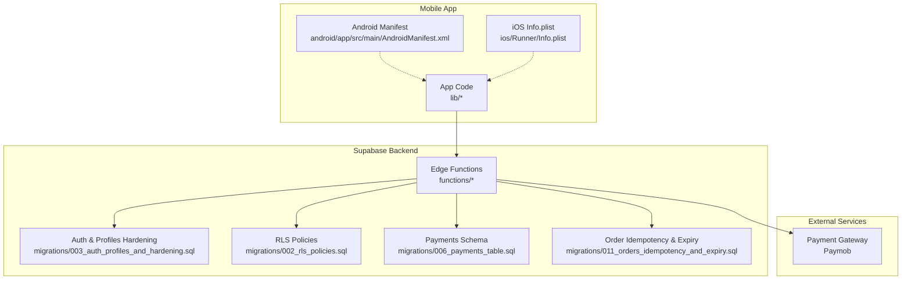
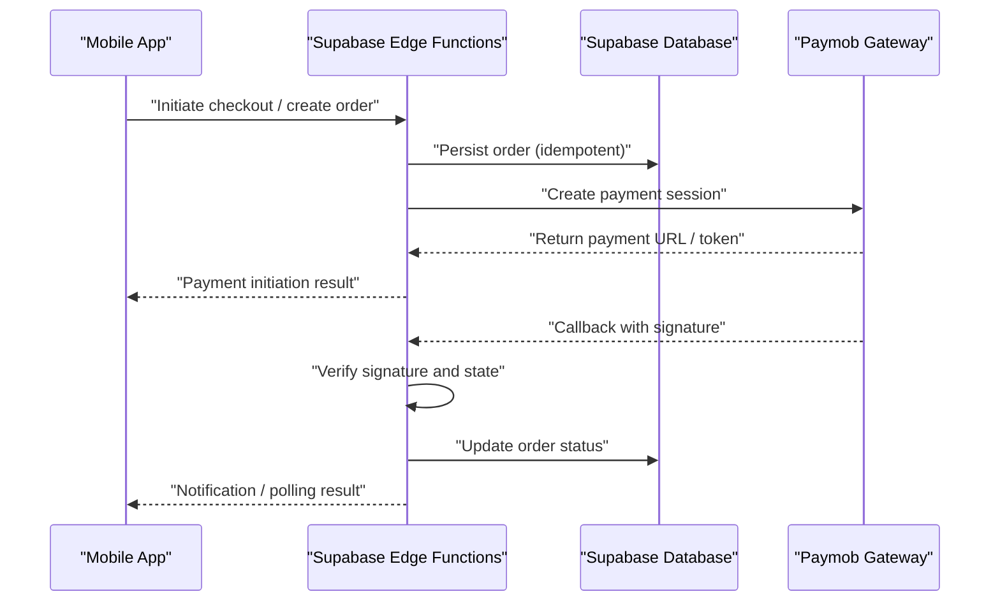
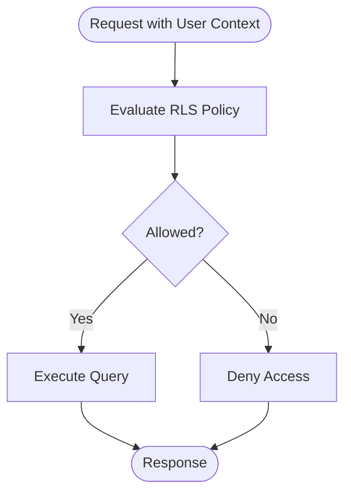
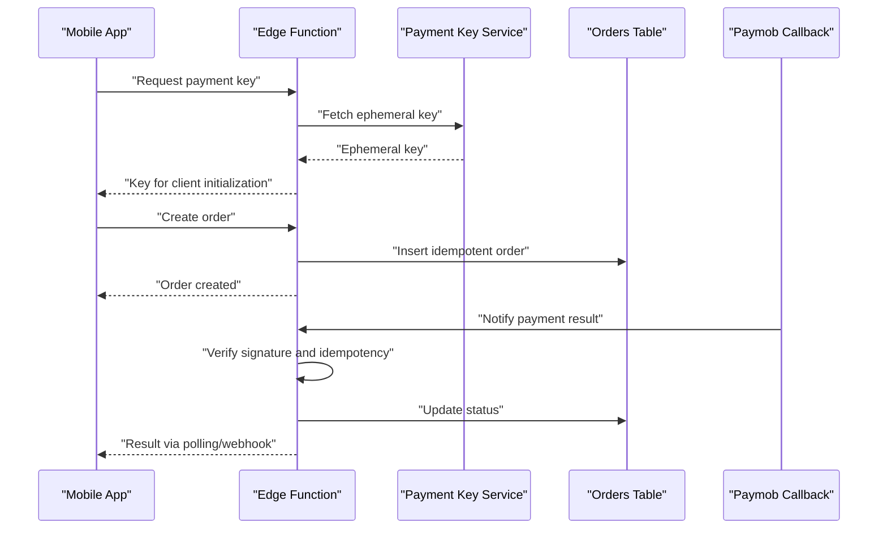
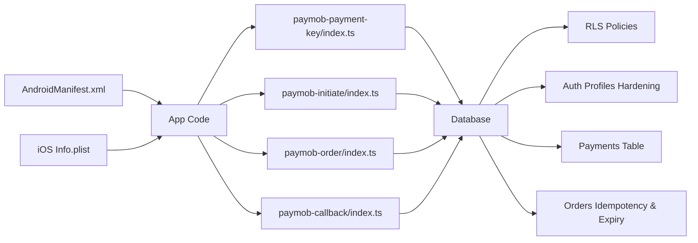

# Security Considerations

<cite>
**Referenced Files in This Document**
- [README.md](file://README.md)
- [supabase-integration.md](file://docs/supabase-integration.md)
- [002_rls_policies.sql](file://supabase/migrations/002_rls_policies.sql)
- [003_auth_profiles_and_hardening.sql](file://supabase/migrations/003_auth_profiles_and_hardening.sql)
- [006_payments_table.sql](file://supabase/migrations/006_payments_table.sql)
- [011_orders_idempotency_and_expiry.sql](file://supabase/migrations/011_orders_idempotency_and_expiry.sql)
- [verify_rls.sql](file://supabase/migrations/verify_rls.sql)
- [paymob-auth/index.ts](file://supabase/functions/paymob-auth/index.ts)
- [paymob-initiate/index.ts](file://supabase/functions/paymob-initiate/index.ts)
- [paymob-order/index.ts](file://supabase/functions/paymob-order/index.ts)
- [paymob-payment-key/index.ts](file://supabase/functions/paymob-payment-key/index.ts)
- [paymob-callback/index.ts](file://supabase/functions/paymob-callback/index.ts)
- [checkout/index.ts](file://supabase/functions/checkout/index.ts)
- [cancel-expired-orders/index.ts](file://supabase/functions/cancel-expired-orders/index.ts)
- [send-order-notification/index.ts](file://supabase/functions/send-order-notification/index.ts)
- [android/app/src/main/AndroidManifest.xml](file://android/app/src/main/AndroidManifest.xml)
- [ios/Runner/Info.plist](file://ios/Runner/Info.plist)
- [secrets-staging.env](file://secrets-staging.env)
</cite>

## Table of Contents
1. [Introduction](#introduction)
2. [Project Structure](#project-structure)
3. [Core Components](#core-components)
4. [Architecture Overview](#architecture-overview)
5. [Detailed Component Analysis](#detailed-component-analysis)
6. [Dependency Analysis](#dependency-analysis)
7. [Performance Considerations](#performance-considerations)
8. [Troubleshooting Guide](#troubleshooting-guide)
9. [Conclusion](#conclusion)
10. [Appendices](#appendices)

## Introduction
This document provides a comprehensive security overview for the Albatal Store application, focusing on authentication and session handling, secure communication patterns, payment security and PCI considerations, Row Level Security (RLS), API security, data protection strategies, secure storage, certificate pinning, and operational security practices such as auditing and incident response. It references concrete implementation points within the repository to ground recommendations in actual code and configuration.

## Project Structure
Security-relevant areas are distributed across:
- Supabase migrations defining RLS policies and schema hardening
- Edge Functions implementing server-side payment flows and order lifecycle management
- Platform manifests and configurations for Android and iOS
- Environment secrets used by functions and services
- Documentation describing Supabase integration

**Diagram sources**
- [002_rls_policies.sql](file://supabase/migrations/002_rls_policies.sql)
- [003_auth_profiles_and_hardening.sql](file://supabase/migrations/003_auth_profiles_and_hardening.sql)
- [006_payments_table.sql](file://supabase/migrations/006_payments_table.sql)
- [011_orders_idempotency_and_expiry.sql](file://supabase/migrations/011_orders_idempotency_and_expiry.sql)
- [paymob-auth/index.ts](file://supabase/functions/paymob-auth/index.ts)
- [paymob-initiate/index.ts](file://supabase/functions/paymob-initiate/index.ts)
- [paymob-order/index.ts](file://supabase/functions/paymob-order/index.ts)
- [paymob-payment-key/index.ts](file://supabase/functions/paymob-payment-key/index.ts)
- [paymob-callback/index.ts](file://supabase/functions/paymob-callback/index.ts)
- [checkout/index.ts](file://supabase/functions/checkout/index.ts)
- [cancel-expired-orders/index.ts](file://supabase/functions/cancel-expired-orders/index.ts)
- [send-order-notification/index.ts](file://supabase/functions/send-order-notification/index.ts)
- [android/app/src/main/AndroidManifest.xml](file://android/app/src/main/AndroidManifest.xml)
- [ios/Runner/Info.plist](file://ios/Runner/Info.plist)

**Section sources**
- [README.md](file://README.md)
- [supabase-integration.md](file://docs/supabase-integration.md)

## Core Components
- Authentication and Profile Hardening: Migrations define auth-related tables and constraints that support secure user profiles and access control.
- Row Level Security (RLS): Policies restrict row-level access based on authenticated user context.
- Payment Integration: Edge Functions orchestrate Paymob interactions, including initiation, key retrieval, order creation, and callback verification.
- Order Lifecycle: Idempotency and expiry mechanisms protect against duplicate processing and stale orders.
- Platform Configurations: Android and iOS manifests expose permissions and network security settings relevant to secure communication.

Key responsibilities:
- Server-side enforcement of business rules and secrets via Edge Functions
- Database-level authorization via RLS
- Secure transport and platform-specific network behavior

**Section sources**
- [003_auth_profiles_and_hardening.sql](file://supabase/migrations/003_auth_profiles_and_hardening.sql)
- [002_rls_policies.sql](file://supabase/migrations/002_rls_policies.sql)
- [006_payments_table.sql](file://supabase/migrations/006_payments_table.sql)
- [011_orders_idempotency_and_expiry.sql](file://supabase/migrations/011_orders_idempotency_and_expiry.sql)
- [paymob-auth/index.ts](file://supabase/functions/paymob-auth/index.ts)
- [paymob-initiate/index.ts](file://supabase/functions/paymob-initiate/index.ts)
- [paymob-order/index.ts](file://supabase/functions/paymob-order/index.ts)
- [paymob-payment-key/index.ts](file://supabase/functions/paymob-payment-key/index.ts)
- [paymob-callback/index.ts](file://supabase/functions/paymob-callback/index.ts)
- [checkout/index.ts](file://supabase/functions/checkout/index.ts)
- [cancel-expired-orders/index.ts](file://supabase/functions/cancel-expired-orders/index.ts)
- [send-order-notification/index.ts](file://supabase/functions/send-order-notification/index.ts)
- [android/app/src/main/AndroidManifest.xml](file://android/app/src/main/AndroidManifest.xml)
- [ios/Runner/Info.plist](file://ios/Runner/Info.plist)

## Architecture Overview
The app communicates with Supabase Edge Functions for sensitive operations. Payments flow through Paymob via server-side endpoints to avoid exposing secrets on the client. RLS enforces per-user data access at the database layer.

**Diagram sources**
- [paymob-initiate/index.ts](file://supabase/functions/paymob-initiate/index.ts)
- [paymob-order/index.ts](file://supabase/functions/paymob-order/index.ts)
- [paymob-payment-key/index.ts](file://supabase/functions/paymob-payment-key/index.ts)
- [paymob-callback/index.ts](file://supabase/functions/paymob-callback/index.ts)
- [checkout/index.ts](file://supabase/functions/checkout/index.ts)
- [011_orders_idempotency_and_expiry.sql](file://supabase/migrations/011_orders_idempotency_and_expiry.sql)

## Detailed Component Analysis

### Authentication and Session Handling
- Auth profile hardening migration introduces constraints and structure to support secure user profiles and access control.
- RLS policies ensure users can only access their own data unless explicitly permitted.
- Sessions and tokens are managed by Supabase Auth; the app should store tokens securely using platform-provided secure storage and refresh them as needed.

Recommendations:
- Enforce short-lived sessions and automatic refresh
- Validate user identity on every sensitive operation
- Avoid logging or persisting raw tokens beyond what is necessary

**Section sources**
- [003_auth_profiles_and_hardening.sql](file://supabase/migrations/003_auth_profiles_and_hardening.sql)
- [002_rls_policies.sql](file://supabase/migrations/002_rls_policies.sql)

### Row Level Security (RLS) Policies
- RLS policies restrict row-level access based on authenticated user context.
- The verify script validates policy correctness and coverage.

Best practices:
- Default-deny posture with explicit allow rules
- Use user ID claims to scope queries
- Regularly audit policies with the provided verification script

**Diagram sources**
- [002_rls_policies.sql](file://supabase/migrations/002_rls_policies.sql)
- [verify_rls.sql](file://supabase/migrations/verify_rls.sql)

**Section sources**
- [002_rls_policies.sql](file://supabase/migrations/002_rls_policies.sql)
- [verify_rls.sql](file://supabase/migrations/verify_rls.sql)

### Payment Security and PCI Compliance
- Sensitive payment operations occur in Edge Functions to keep secrets off the device.
- Key retrieval, order creation, and callback verification are isolated server-side.
- Orders include idempotency and expiry controls to prevent duplicates and stale states.

PCI considerations:
- Do not handle raw PAN or CVV on the client; rely on gateway-hosted UI or SDKs
- Minimize PCI scope by delegating card data handling to Paymob
- Ensure callbacks are verified cryptographically before updating order state

**Diagram sources**
- [paymob-payment-key/index.ts](file://supabase/functions/paymob-payment-key/index.ts)
- [paymob-order/index.ts](file://supabase/functions/paymob-order/index.ts)
- [paymob-callback/index.ts](file://supabase/functions/paymob-callback/index.ts)
- [011_orders_idempotency_and_expiry.sql](file://supabase/migrations/011_orders_idempotency_and_expiry.sql)
- [006_payments_table.sql](file://supabase/migrations/006_payments_table.sql)

**Section sources**
- [paymob-auth/index.ts](file://supabase/functions/paymob-auth/index.ts)
- [paymob-initiate/index.ts](file://supabase/functions/paymob-initiate/index.ts)
- [paymob-order/index.ts](file://supabase/functions/paymob-order/index.ts)
- [paymob-payment-key/index.ts](file://supabase/functions/paymob-payment-key/index.ts)
- [paymob-callback/index.ts](file://supabase/functions/paymob-callback/index.ts)
- [checkout/index.ts](file://supabase/functions/checkout/index.ts)
- [006_payments_table.sql](file://supabase/migrations/006_payments_table.sql)
- [011_orders_idempotency_and_expiry.sql](file://supabase/migrations/011_orders_idempotency_and_expiry.sql)

### Secure Communication Patterns
- All communications should use HTTPS/TLS.
- Prefer server-side proxies for secret usage and cryptographic verification.
- Validate and sanitize inputs on both client and server sides.

Platform notes:
- Android manifest may include cleartext traffic exceptions; review and minimize if present.
- iOS Info.plist may contain App Transport Security settings; enforce strict TLS where possible.

**Section sources**
- [android/app/src/main/AndroidManifest.xml](file://android/app/src/main/AndroidManifest.xml)
- [ios/Runner/Info.plist](file://ios/Runner/Info.plist)

### Data Protection Strategies
- Encrypt sensitive fields at rest where appropriate (e.g., PII).
- Apply least-privilege access via RLS and service roles.
- Redact logs and avoid printing secrets or tokens.

**Section sources**
- [003_auth_profiles_and_hardening.sql](file://supabase/migrations/003_auth_profiles_and_hardening.sql)
- [002_rls_policies.sql](file://supabase/migrations/002_rls_policies.sql)

### Input Validation and Output Encoding
- Validate all inputs on the server side before persistence or external calls.
- Encode outputs when rendering to prevent injection.
- Use parameterized queries and typed schemas.

[No sources needed since this section provides general guidance]

### Secure Storage of Sensitive Data
- Store tokens and secrets using platform secure storage APIs.
- Avoid storing raw credentials in preferences or files.
- Rotate keys regularly and limit exposure surface.

[No sources needed since this section provides general guidance]

### Certificate Pinning
- Implement certificate pinning for critical endpoints to mitigate MITM risks.
- Update pinned certificates via safe update mechanisms.

[No sources needed since this section provides general guidance]

### API Security
- Enforce authentication and authorization at API boundaries.
- Rate-limit and throttle sensitive endpoints.
- Use idempotency keys for write operations.

**Section sources**
- [011_orders_idempotency_and_expiry.sql](file://supabase/migrations/011_orders_idempotency_and_expiry.sql)

## Dependency Analysis
The following diagram maps core security dependencies between platform configs, backend migrations, and Edge Functions.

**Diagram sources**
- [android/app/src/main/AndroidManifest.xml](file://android/app/src/main/AndroidManifest.xml)
- [ios/Runner/Info.plist](file://ios/Runner/Info.plist)
- [paymob-payment-key/index.ts](file://supabase/functions/paymob-payment-key/index.ts)
- [paymob-initiate/index.ts](file://supabase/functions/paymob-initiate/index.ts)
- [paymob-order/index.ts](file://supabase/functions/paymob-order/index.ts)
- [paymob-callback/index.ts](file://supabase/functions/paymob-callback/index.ts)
- [002_rls_policies.sql](file://supabase/migrations/002_rls_policies.sql)
- [003_auth_profiles_and_hardening.sql](file://supabase/migrations/003_auth_profiles_and_hardening.sql)
- [006_payments_table.sql](file://supabase/migrations/006_payments_table.sql)
- [011_orders_idempotency_and_expiry.sql](file://supabase/migrations/011_orders_idempotency_and_expiry.sql)

**Section sources**
- [android/app/src/main/AndroidManifest.xml](file://android/app/src/main/AndroidManifest.xml)
- [ios/Runner/Info.plist](file://ios/Runner/Info.plist)
- [002_rls_policies.sql](file://supabase/migrations/002_rls_policies.sql)
- [003_auth_profiles_and_hardening.sql](file://supabase/migrations/003_auth_profiles_and_hardening.sql)
- [006_payments_table.sql](file://supabase/migrations/006_payments_table.sql)
- [011_orders_idempotency_and_expiry.sql](file://supabase/migrations/011_orders_idempotency_and_expiry.sql)
- [paymob-payment-key/index.ts](file://supabase/functions/paymob-payment-key/index.ts)
- [paymob-initiate/index.ts](file://supabase/functions/paymob-initiate/index.ts)
- [paymob-order/index.ts](file://supabase/functions/paymob-order/index.ts)
- [paymob-callback/index.ts](file://supabase/functions/paymob-callback/index.ts)

## Performance Considerations
- Keep payloads minimal and validate early to reduce unnecessary work.
- Use idempotency to avoid redundant writes under retries.
- Cache non-sensitive data appropriately while ensuring freshness for security-sensitive values.

[No sources needed since this section provides general guidance]

## Troubleshooting Guide
- Verify RLS policies using the provided verification script to ensure correct scoping.
- Inspect Edge Function logs for failed signature verifications or idempotency conflicts.
- Review platform network configurations if TLS errors occur during development or production.

**Section sources**
- [verify_rls.sql](file://supabase/migrations/verify_rls.sql)
- [paymob-callback/index.ts](file://supabase/functions/paymob-callback/index.ts)
- [011_orders_idempotency_and_expiry.sql](file://supabase/migrations/011_orders_idempotency_and_expiry.sql)

## Conclusion
Albatal Store’s security model centers on server-side enforcement via Supabase Edge Functions, strong database-level authorization through RLS, and careful separation of sensitive operations from the mobile client. By adhering to the practices outlined here—secure communication, input validation, output encoding, idempotency, and regular audits—the application minimizes attack surface and aligns with industry best practices for mobile commerce.

[No sources needed since this section summarizes without analyzing specific files]

## Appendices

### Operational Security Guidelines
- Secrets Management: Store secrets in environment variables and inject into Edge Functions; never commit secrets to source control.
- Auditing: Periodically run RLS verification and review function logs for anomalies.
- Incident Response: Define playbooks for compromised keys, unexpected callbacks, and data breaches; include rollback and notification steps.

**Section sources**
- [secrets-staging.env](file://secrets-staging.env)
- [verify_rls.sql](file://supabase/migrations/verify_rls.sql)