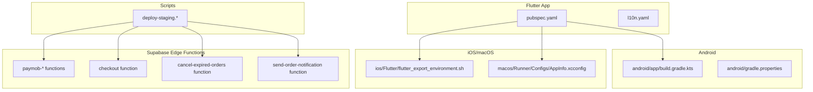
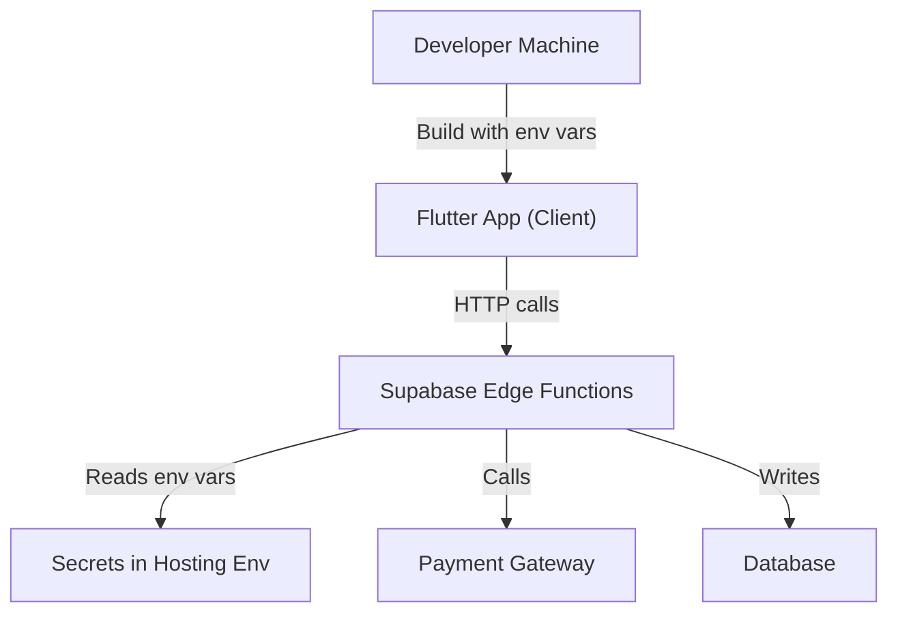
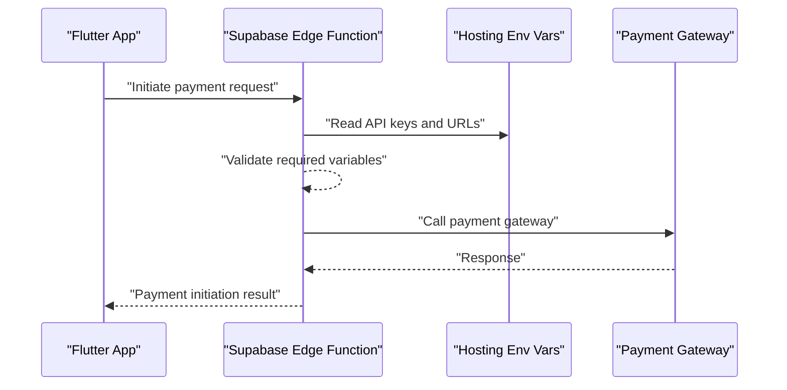
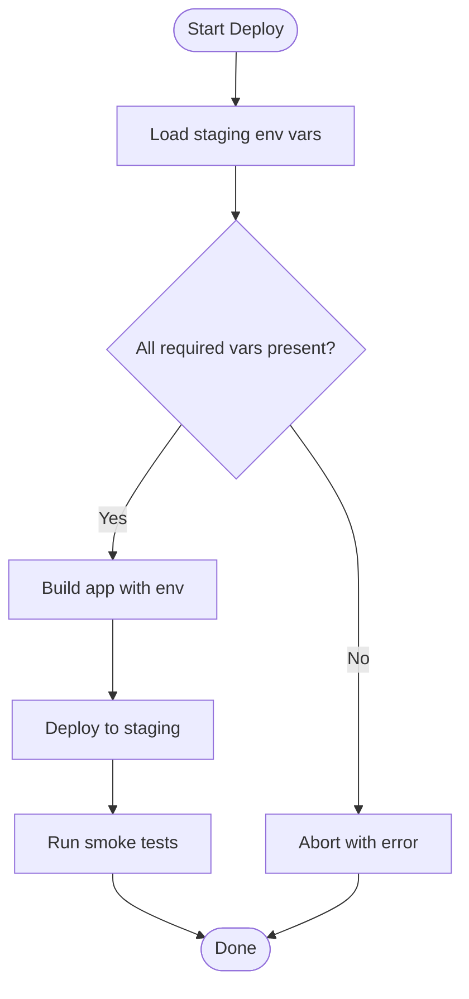
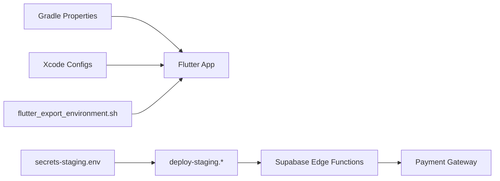

# App Configuration & Environment

<cite>
**Referenced Files in This Document**
- [README.md](file://README.md)
- [pubspec.yaml](file://pubspec.yaml)
- [secrets-staging.env](file://secrets-staging.env)
- [scripts/deploy-staging.sh](file://scripts/deploy-staging.sh)
- [scripts/deploy-staging.ps1](file://scripts/deploy-staging.ps1)
- [scripts/deploy-staging.bat](file://scripts/deploy-staging.bat)
- [android/app/build.gradle.kts](file://android/app/build.gradle.kts)
- [android/gradle.properties](file://android/gradle.properties)
- [ios/Flutter/flutter_export_environment.sh](file://ios/Flutter/flutter_export_environment.sh)
- [macos/Runner/Configs/AppInfo.xcconfig](file://macos/Runner/Configs/AppInfo.xcconfig)
- [supabase/functions/paymob-auth/index.ts](file://supabase/functions/paymob-auth/index.ts)
- [supabase/functions/paymob-initiate/index.ts](file://supabase/functions/paymob-initiate/index.ts)
- [supabase/functions/paymob-order/index.ts](file://supabase/functions/paymob-order/index.ts)
- [supabase/functions/paymob-payment-key/index.ts](file://supabase/functions/paymob-payment-key/index.ts)
- [supabase/functions/paymob-callback/index.ts](file://supabase/functions/paymob-callback/index.ts)
- [supabase/functions/checkout/index.ts](file://supabase/functions/checkout/index.ts)
- [supabase/functions/cancel-expired-orders/index.ts](file://supabase/functions/cancel-expired-orders/index.ts)
- [supabase/functions/send-order-notification/index.ts](file://supabase/functions/send-order-notification/index.ts)
</cite>

## Table of Contents
1. [Introduction](#introduction)
2. [Project Structure](#project-structure)
3. [Core Components](#core-components)
4. [Architecture Overview](#architecture-overview)
5. [Detailed Component Analysis](#detailed-component-analysis)
6. [Dependency Analysis](#dependency-analysis)
7. [Performance Considerations](#performance-considerations)
8. [Troubleshooting Guide](#troubleshooting-guide)
9. [Conclusion](#conclusion)
10. [Appendices](#appendices)

## Introduction
This document explains how configuration and environment management are handled across the application, covering:
- Where configuration lives (files, platform configs, scripts)
- Build-time vs runtime configuration
- How environment variables are loaded and used
- Validation and error handling for missing or invalid configurations
- API endpoints, service URLs, and third-party integrations
- Security and secret management
- Deployment-specific settings for development, staging, and production
- Best practices for versioning and migrating configuration changes

The goal is to provide a clear, actionable guide for developers and operators to configure, secure, and evolve the app safely across environments.

## Project Structure
Configuration-related artifacts are spread across multiple layers:
- Flutter/Dart layer: package metadata and localization config
- Android build system: Gradle properties and module build script
- iOS/macOS build system: Xcode configs and exported environment scripts
- Supabase Edge Functions: server-side integration with secrets via environment variables
- Scripts: deployment helpers that may inject environment-specific values

**Diagram sources**
- [pubspec.yaml](file://pubspec.yaml)
- [android/app/build.gradle.kts](file://android/app/build.gradle.kts)
- [android/gradle.properties](file://android/gradle.properties)
- [ios/Flutter/flutter_export_environment.sh](file://ios/Flutter/flutter_export_environment.sh)
- [macos/Runner/Configs/AppInfo.xcconfig](file://macos/Runner/Configs/AppInfo.xcconfig)
- [supabase/functions/paymob-auth/index.ts](file://supabase/functions/paymob-auth/index.ts)
- [supabase/functions/checkout/index.ts](file://supabase/functions/checkout/index.ts)
- [supabase/functions/cancel-expired-orders/index.ts](file://supabase/functions/cancel-expired-orders/index.ts)
- [supabase/functions/send-order-notification/index.ts](file://supabase/functions/send-order-notification/index.ts)
- [scripts/deploy-staging.sh](file://scripts/deploy-staging.sh)

**Section sources**
- [README.md](file://README.md)
- [pubspec.yaml](file://pubspec.yaml)
- [android/app/build.gradle.kts](file://android/app/build.gradle.kts)
- [android/gradle.properties](file://android/gradle.properties)
- [ios/Flutter/flutter_export_environment.sh](file://ios/Flutter/flutter_export_environment.sh)
- [macos/Runner/Configs/AppInfo.xcconfig](file://macos/Runner/Configs/AppInfo.xcconfig)
- [scripts/deploy-staging.sh](file://scripts/deploy-staging.sh)
- [scripts/deploy-staging.ps1](file://scripts/deploy-staging.ps1)
- [scripts/deploy-staging.bat](file://scripts/deploy-staging.bat)

## Core Components
- Package and localization configuration:
  - pubspec.yaml defines dependencies and assets; l10n.yaml controls localization generation.
- Android build-time configuration:
  - android/app/build.gradle.kts and android/gradle.properties define build variants and properties.
- iOS/macOS build-time configuration:
  - ios/Flutter/flutter_export_environment.sh exports environment variables into the app at build time.
  - macos/Runner/Configs/AppInfo.xcconfig holds Xcode-level configuration.
- Server-side integration configuration:
  - Supabase Edge Functions read secrets from environment variables provided by the hosting platform.
- Deployment scripts:
  - deploy-staging.* scripts orchestrate environment-specific deployments and may inject variables.

Key responsibilities:
- Define where configuration lives per platform
- Separate build-time constants from runtime secrets
- Provide consistent loading patterns across platforms
- Centralize secrets on the server side (Edge Functions)

**Section sources**
- [pubspec.yaml](file://pubspec.yaml)
- [android/app/build.gradle.kts](file://android/app/build.gradle.kts)
- [android/gradle.properties](file://android/gradle.properties)
- [ios/Flutter/flutter_export_environment.sh](file://ios/Flutter/flutter_export_environment.sh)
- [macos/Runner/Configs/AppInfo.xcconfig](file://macos/Runner/Configs/AppInfo.xcconfig)
- [supabase/functions/paymob-auth/index.ts](file://supabase/functions/paymob-auth/index.ts)
- [supabase/functions/checkout/index.ts](file://supabase/functions/checkout/index.ts)
- [supabase/functions/cancel-expired-orders/index.ts](file://supabase/functions/cancel-expired-orders/index.ts)
- [supabase/functions/send-order-notification/index.ts](file://supabase/functions/send-order-notification/index.ts)
- [scripts/deploy-staging.sh](file://scripts/deploy-staging.sh)

## Architecture Overview
The configuration architecture separates concerns between client and server:
- Client-side (Flutter):
  - Build-time constants via platform configs and exported environment variables
  - Runtime behavior controlled by feature flags and localized strings
- Server-side (Supabase Edge Functions):
  - Secrets and service URLs injected as environment variables at deploy time
  - No sensitive data embedded in the client binary

[No sources needed since this diagram shows conceptual workflow, not actual code structure]

## Detailed Component Analysis

### Flutter Package and Localization Configuration
- pubspec.yaml:
  - Declares dependencies and assets; used by the build pipeline to assemble the app.
- l10n.yaml:
  - Controls localization generation; ensures consistent language resources across builds.

Operational notes:
- Keep non-secret app metadata here (e.g., app name, version).
- Avoid embedding secrets in pubspec.yaml.

**Section sources**
- [pubspec.yaml](file://pubspec.yaml)
- [l10n.yaml](file://l10n.yaml)

### Android Build-Time Configuration
- android/app/build.gradle.kts:
  - Defines build types, product flavors, and can inject build-time constants.
- android/gradle.properties:
  - Holds global Gradle properties; suitable for non-sensitive build flags.

Guidelines:
- Use build variants to switch base URLs or feature toggles at build time.
- Do not place secrets in Gradle files committed to source control.

**Section sources**
- [android/app/build.gradle.kts](file://android/app/build.gradle.kts)
- [android/gradle.properties](file://android/gradle.properties)

### iOS/macOS Build-Time Configuration
- ios/Flutter/flutter_export_environment.sh:
  - Exports environment variables available to the Flutter app during build.
- macos/Runner/Configs/AppInfo.xcconfig:
  - Xcode configuration file for app metadata and build settings.

Guidelines:
- Export only safe, non-secret values into flutter_export_environment.sh.
- Store secrets in CI/CD or platform secret managers.

**Section sources**
- [ios/Flutter/flutter_export_environment.sh](file://ios/Flutter/flutter_export_environment.sh)
- [macos/Runner/Configs/AppInfo.xcconfig](file://macos/Runner/Configs/AppInfo.xcconfig)

### Supabase Edge Functions Integration
These functions handle payment flows and order operations. They should read secrets from environment variables provided by the hosting platform.

- paymob-auth/index.ts
- paymob-initiate/index.ts
- paymob-order/index.ts
- paymob-payment-key/index.ts
- paymob-callback/index.ts
- checkout/index.ts
- cancel-expired-orders/index.ts
- send-order-notification/index.ts

Recommended pattern:
- Read keys and URLs from process.env or equivalent platform-provided env accessors.
- Validate presence of required variables at startup and fail fast if missing.
- Log minimal diagnostics without exposing secrets.

**Diagram sources**
- [supabase/functions/paymob-initiate/index.ts](file://supabase/functions/paymob-initiate/index.ts)
- [supabase/functions/paymob-auth/index.ts](file://supabase/functions/paymob-auth/index.ts)
- [supabase/functions/paymob-order/index.ts](file://supabase/functions/paymob-order/index.ts)
- [supabase/functions/paymob-payment-key/index.ts](file://supabase/functions/paymob-payment-key/index.ts)
- [supabase/functions/paymob-callback/index.ts](file://supabase/functions/paymob-callback/index.ts)

**Section sources**
- [supabase/functions/paymob-auth/index.ts](file://supabase/functions/paymob-auth/index.ts)
- [supabase/functions/paymob-initiate/index.ts](file://supabase/functions/paymob-initiate/index.ts)
- [supabase/functions/paymob-order/index.ts](file://supabase/functions/paymob-order/index.ts)
- [supabase/functions/paymob-payment-key/index.ts](file://supabase/functions/paymob-payment-key/index.ts)
- [supabase/functions/paymob-callback/index.ts](file://supabase/functions/paymob-callback/index.ts)
- [supabase/functions/checkout/index.ts](file://supabase/functions/checkout/index.ts)
- [supabase/functions/cancel-expired-orders/index.ts](file://supabase/functions/cancel-expired-orders/index.ts)
- [supabase/functions/send-order-notification/index.ts](file://supabase/functions/send-order-notification/index.ts)

### Deployment Scripts and Staging Configuration
- scripts/deploy-staging.sh
- scripts/deploy-staging.ps1
- scripts/deploy-staging.bat
- secrets-staging.env

Purpose:
- Orchestrate staging deployments and inject environment-specific values.
- secrets-staging.env provides a template or example for staging secrets.

Best practices:
- Never commit real secrets; use templates and CI/CD secret stores.
- Ensure scripts validate required variables before proceeding.
- Keep OS-specific scripts aligned in behavior.

**Diagram sources**
- [scripts/deploy-staging.sh](file://scripts/deploy-staging.sh)
- [scripts/deploy-staging.ps1](file://scripts/deploy-staging.ps1)
- [scripts/deploy-staging.bat](file://scripts/deploy-staging.bat)
- [secrets-staging.env](file://secrets-staging.env)

**Section sources**
- [scripts/deploy-staging.sh](file://scripts/deploy-staging.sh)
- [scripts/deploy-staging.ps1](file://scripts/deploy-staging.ps1)
- [scripts/deploy-staging.bat](file://scripts/deploy-staging.bat)
- [secrets-staging.env](file://secrets-staging.env)

## Dependency Analysis
Configuration dependencies flow from build systems and hosting platforms into the app and server functions:

**Diagram sources**
- [android/gradle.properties](file://android/gradle.properties)
- [android/app/build.gradle.kts](file://android/app/build.gradle.kts)
- [ios/Flutter/flutter_export_environment.sh](file://ios/Flutter/flutter_export_environment.sh)
- [macos/Runner/Configs/AppInfo.xcconfig](file://macos/Runner/Configs/AppInfo.xcconfig)
- [scripts/deploy-staging.sh](file://scripts/deploy-staging.sh)
- [scripts/deploy-staging.ps1](file://scripts/deploy-staging.ps1)
- [scripts/deploy-staging.bat](file://scripts/deploy-staging.bat)
- [secrets-staging.env](file://secrets-staging.env)
- [supabase/functions/paymob-initiate/index.ts](file://supabase/functions/paymob-initiate/index.ts)

**Section sources**
- [android/gradle.properties](file://android/gradle.properties)
- [android/app/build.gradle.kts](file://android/app/build.gradle.kts)
- [ios/Flutter/flutter_export_environment.sh](file://ios/Flutter/flutter_export_environment.sh)
- [macos/Runner/Configs/AppInfo.xcconfig](file://macos/Runner/Configs/AppInfo.xcconfig)
- [scripts/deploy-staging.sh](file://scripts/deploy-staging.sh)
- [scripts/deploy-staging.ps1](file://scripts/deploy-staging.ps1)
- [scripts/deploy-staging.bat](file://scripts/deploy-staging.bat)
- [secrets-staging.env](file://secrets-staging.env)
- [supabase/functions/paymob-initiate/index.ts](file://supabase/functions/paymob-initiate/index.ts)

## Performance Considerations
- Prefer build-time configuration for static values (e.g., base URLs for different environments) to avoid runtime overhead.
- Minimize runtime configuration lookups; cache validated configuration once at startup.
- On the server side, initialize and validate environment variables early in function initialization to fail fast and reduce wasted work.

[No sources needed since this section provides general guidance]

## Troubleshooting Guide
Common issues and resolutions:
- Missing environment variables:
  - Ensure all required variables are set in the hosting platform’s environment for Edge Functions.
  - Validate at startup and surface clear errors indicating which variables are missing.
- Invalid configuration values:
  - Implement validation checks for URLs, timeouts, and feature flags.
  - Fail fast with descriptive messages when values do not meet constraints.
- Secret leaks:
  - Audit logs and responses to ensure no secrets are printed.
  - Remove any hardcoded secrets from source control immediately.
- Build-time mismatches:
  - Confirm that flutter_export_environment.sh and Xcode/Gradle configs align with expected variable names.
  - Rebuild after updating environment variables to propagate changes.

**Section sources**
- [supabase/functions/paymob-initiate/index.ts](file://supabase/functions/paymob-initiate/index.ts)
- [supabase/functions/paymob-auth/index.ts](file://supabase/functions/paymob-auth/index.ts)
- [supabase/functions/paymob-order/index.ts](file://supabase/functions/paymob-order/index.ts)
- [supabase/functions/paymob-payment-key/index.ts](file://supabase/functions/paymob-payment-key/index.ts)
- [supabase/functions/paymob-callback/index.ts](file://supabase/functions/paymob-callback/index.ts)
- [supabase/functions/checkout/index.ts](file://supabase/functions/checkout/index.ts)
- [supabase/functions/cancel-expired-orders/index.ts](file://supabase/functions/cancel-expired-orders/index.ts)
- [supabase/functions/send-order-notification/index.ts](file://supabase/functions/send-order-notification/index.ts)
- [ios/Flutter/flutter_export_environment.sh](file://ios/Flutter/flutter_export_environment.sh)
- [macos/Runner/Configs/AppInfo.xcconfig](file://macos/Runner/Configs/AppInfo.xcconfig)
- [android/app/build.gradle.kts](file://android/app/build.gradle.kts)
- [android/gradle.properties](file://android/gradle.properties)
- [scripts/deploy-staging.sh](file://scripts/deploy-staging.sh)
- [scripts/deploy-staging.ps1](file://scripts/deploy-staging.ps1)
- [scripts/deploy-staging.bat](file://scripts/deploy-staging.bat)
- [secrets-staging.env](file://secrets-staging.env)

## Conclusion
A robust configuration strategy separates build-time constants from runtime secrets, centralizes sensitive data on the server, and enforces validation at both build and runtime boundaries. By leveraging platform-specific configuration mechanisms and secure secret management, the application can be reliably deployed across development, staging, and production environments with clear upgrade paths and strong security posture.

[No sources needed since this section summarizes without analyzing specific files]

## Appendices

### Build-Time vs Runtime Configuration
- Build-time:
  - Platform configs (Gradle, Xcode), exported environment variables, and asset definitions.
- Runtime:
  - Feature flags and service endpoints resolved at startup; validated and cached.

[No sources needed since this section provides general guidance]

### Environment-Specific Settings and Overrides
- Use deployment scripts to inject environment-specific values.
- Maintain separate templates for each environment; never commit real secrets.

**Section sources**
- [scripts/deploy-staging.sh](file://scripts/deploy-staging.sh)
- [scripts/deploy-staging.ps1](file://scripts/deploy-staging.ps1)
- [scripts/deploy-staging.bat](file://scripts/deploy-staging.bat)
- [secrets-staging.env](file://secrets-staging.env)

### API Endpoints and Third-Party Integrations
- Configure service URLs and API keys in server-side Edge Functions via environment variables.
- Validate endpoints and keys at startup; log failures without exposing secrets.

**Section sources**
- [supabase/functions/paymob-initiate/index.ts](file://supabase/functions/paymob-initiate/index.ts)
- [supabase/functions/paymob-auth/index.ts](file://supabase/functions/paymob-auth/index.ts)
- [supabase/functions/paymob-order/index.ts](file://supabase/functions/paymob-order/index.ts)
- [supabase/functions/paymob-payment-key/index.ts](file://supabase/functions/paymob-payment-key/index.ts)
- [supabase/functions/paymob-callback/index.ts](file://supabase/functions/paymob-callback/index.ts)
- [supabase/functions/checkout/index.ts](file://supabase/functions/checkout/index.ts)

### Security and Secret Management
- Store secrets in CI/CD or hosting platform secret managers.
- Use .env templates for local development; exclude real secrets from version control.
- Audit logs and responses to prevent accidental secret exposure.

**Section sources**
- [secrets-staging.env](file://secrets-staging.env)
- [supabase/functions/paymob-initiate/index.ts](file://supabase/functions/paymob-initiate/index.ts)

### Versioning and Migration Guidelines
- Treat configuration as code: version control templates and migration scripts.
- Introduce deprecation windows for configuration changes; provide backward-compatible defaults.
- Update deployment scripts and platform configs together with application changes.

[No sources needed since this section provides general guidance]