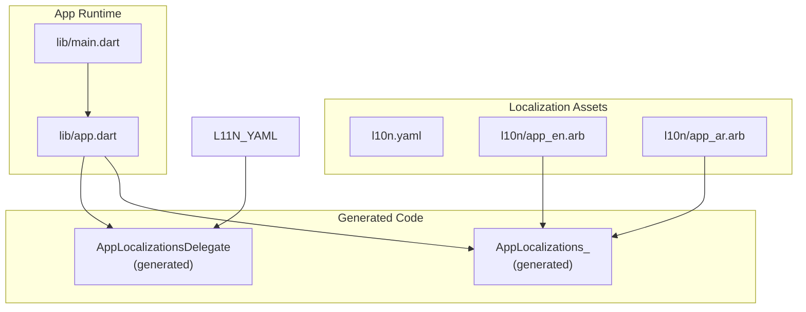
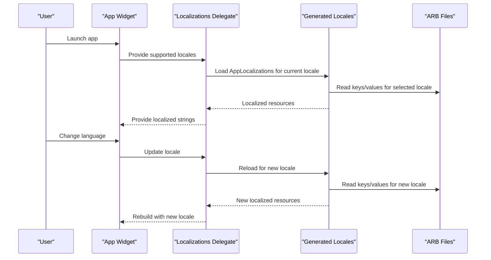
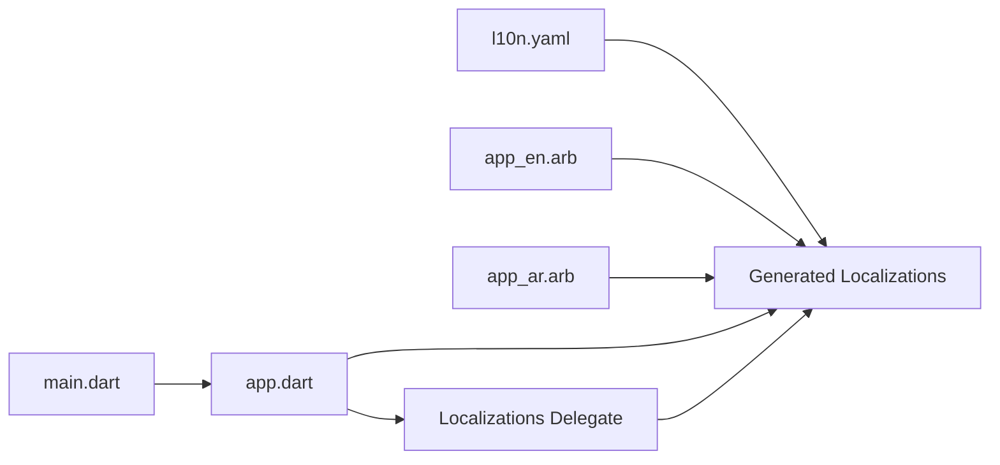

# Internationalization & Localization

<cite>
**Referenced Files in This Document**
- [l10n.yaml](file://l10n.yaml)
- [app_en.arb](file://l10n/app_en.arb)
- [app_ar.arb](file://l10n/app_ar.arb)
- [main.dart](file://lib/main.dart)
- [app.dart](file://lib/app.dart)
</cite>

## Table of Contents
1. [Introduction](#introduction)
2. [Project Structure](#project-structure)
3. [Core Components](#core-components)
4. [Architecture Overview](#architecture-overview)
5. [Detailed Component Analysis](#detailed-component-analysis)
6. [Dependency Analysis](#dependency-analysis)
7. [Performance Considerations](#performance-considerations)
8. [Troubleshooting Guide](#troubleshooting-guide)
9. [Conclusion](#conclusion)
10. [Appendices](#appendices)

## Introduction
This document explains the internationalization (i18n) and localization (l10n) system used by the project. It covers ARB file structure, translation key management, dynamic language switching, l10n configuration, pluralization rules, date/time formatting for different locales, language detection, fallback strategies, loading optimization, accessibility considerations, text direction handling, cultural formatting conventions, and guidelines for maintaining consistency and adding new languages.

## Project Structure
The i18n/l10n setup is centered around:
- A Flutter l10n configuration file that defines how translations are generated.
- ARB files containing localized strings for each supported locale.
- Application entry points where the generated localization delegates and locale settings are wired into the app.

**Diagram sources**
- [l10n.yaml](file://l10n.yaml)
- [app_en.arb](file://l10n/app_en.arb)
- [app_ar.arb](file://l10n/app_ar.arb)
- [main.dart](file://lib/main.dart)
- [app.dart](file://lib/app.dart)

**Section sources**
- [l10n.yaml](file://l10n.yaml)
- [app_en.arb](file://l10n/app_en.arb)
- [app_ar.arb](file://l10n/app_ar.arb)
- [main.dart](file://lib/main.dart)
- [app.dart](file://lib/app.dart)

## Core Components
- l10n configuration: Defines base ARB path, output directory, class name, and supported locales.
- ARB files: Provide keys and values per locale; support parameters, pluralization, and ICU message syntax.
- Generated localizations: Dart classes and a delegate to load and provide localized resources at runtime.
- App wiring: The main and app files configure supported locales, initial locale, and language switching.

Key responsibilities:
- Configuration: Centralized in the l10n config file.
- Translation content: Stored in ARB files under the l10n directory.
- Runtime access: Through generated localizations classes and delegates.
- Locale selection: Determined from device settings or user preference, with fallbacks.

**Section sources**
- [l10n.yaml](file://l10n.yaml)
- [app_en.arb](file://l10n/app_en.arb)
- [app_ar.arb](file://l10n/app_ar.arb)
- [main.dart](file://lib/main.dart)
- [app.dart](file://lib/app.dart)

## Architecture Overview
The i18n architecture follows Flutter’s standard approach using arb-to-Dart generation and a localization delegate.

**Diagram sources**
- [l10n.yaml](file://l10n.yaml)
- [app_en.arb](file://l10n/app_en.arb)
- [app_ar.arb](file://l10n/app_ar.arb)
- [main.dart](file://lib/main.dart)
- [app.dart](file://lib/app.dart)

## Detailed Component Analysis

### l10n Configuration
- Purpose: Define where ARB files live, which locale codes are supported, and the generated class names.
- Typical fields:
  - arb-dir: Path to ARB files.
  - output-dir: Where generated Dart code is written.
  - output-class: Name of the generated localizations class.
  - synthetic-package: Whether to use synthetic package imports.
  - locale-separator: Character separating language and region.
  - preferred-separator: Preferred separator for display.
- Supported locales: Enumerated list of locale codes (e.g., en, ar).

Operational notes:
- Changing supported locales requires regenerating code.
- Output class name determines the import alias used in Dart code.

**Section sources**
- [l10n.yaml](file://l10n.yaml)

### ARB File Structure and Key Management
- Location: Under the configured arb-dir (typically l10n/).
- Naming: app_<locale>.arb (e.g., app_en.arb, app_ar.arb).
- Keys:
  - Use dot-separated hierarchical keys for organization (e.g., common.ok, cart.total).
  - Keep keys consistent across locales.
- Values:
  - Plain strings or ICU MessageFormat expressions for parameters, pluralization, and formatting.
- Parameters:
  - Use placeholders like {name} in keys and pass arguments when calling getters.
- Pluralization:
  - Use ICU plural forms keyed by count categories (zero, one, two, few, many, other).
- Date/time formatting:
  - Use ICU datetime patterns via the generated formatters or intl library helpers.

Best practices:
- Avoid hardcoding UI text directly in widgets; always reference keys.
- Group related keys logically.
- Validate keys across all locales to prevent missing translations.

**Section sources**
- [app_en.arb](file://l10n/app_en.arb)
- [app_ar.arb](file://l10n/app_ar.arb)

### Dynamic Language Switching
- Mechanism:
  - Maintain a current locale state (e.g., in a provider/cubit/state manager).
  - When the user selects a language, update the locale and rebuild the widget tree.
- Integration:
  - Ensure MaterialApp or equivalent supports multiple locales and uses the generated delegate.
  - Pass the current locale to the localization delegate so it can reload resources.
- Fallback strategy:
  - If a specific locale is unavailable, fall back to a default (e.g., en).
  - Region-specific variants should fall back to the base language if needed.

Implementation outline:
- On language change:
  - Update stored locale.
  - Persist choice (optional).
  - Trigger a rebuild with the new locale.
  - Ensure any cached data depending on locale is invalidated.

**Section sources**
- [main.dart](file://lib/main.dart)
- [app.dart](file://lib/app.dart)

### Date/Time and Number Formatting
- Use ICU patterns for dates and numbers through the generated localizations or intl utilities.
- Examples of patterns:
  - Short date: e.g., MM/dd/yyyy vs dd/MM/yyyy depending on locale.
  - Time: 12-hour vs 24-hour formats.
  - Numbers: Decimal/thousands separators vary by locale.
- Guidelines:
  - Always format via localized formatters rather than manual string manipulation.
  - For currency, prefer currency formatters tied to the active locale.

**Section sources**
- [app_en.arb](file://l10n/app_en.arb)
- [app_ar.arb](file://l10n/app_ar.arb)

### RTL Support (Arabic)
- Text direction:
  - Detect locale script/direction and set Material app’s textDirection accordingly.
  - For Arabic (ar), use right-to-left layout; for English (en), left-to-right.
- Layout considerations:
  - Use logical properties (start/end) instead of hardcoded left/right.
  - Test icons and images for directional semantics.
- Accessibility:
  - Ensure labels and hints are localized and readable in RTL contexts.

**Section sources**
- [app_ar.arb](file://l10n/app_ar.arb)
- [app_en.arb](file://l10n/app_en.arb)
- [app.dart](file://lib/app.dart)

### Language Detection and Fallbacks
- Detection order:
  - Start with user-selected locale (if persisted).
  - Otherwise, use device locale.
  - Map device locale to supported locales; if not supported, choose a default.
- Fallback chain:
  - Exact match (e.g., ar-SA) -> base language (ar) -> default (en).
- Implementation tips:
  - Normalize incoming locales before matching.
  - Cache the resolved locale to avoid repeated computations.

**Section sources**
- [main.dart](file://lib/main.dart)
- [app.dart](file://lib/app.dart)

### Loading Optimization
- Lazy loading:
  - Generated localizations typically load only the requested locale.
- Minimize rebuilds:
  - Scope locale changes to necessary parts of the tree.
- Asset size:
  - Only include required locales in production builds.
- Caching:
  - Avoid reloading unchanged resources; rely on framework caching.

**Section sources**
- [l10n.yaml](file://l10n.yaml)
- [app.dart](file://lib/app.dart)

### Accessibility Considerations
- Screen reader labels:
  - All accessible names must be localized.
- Contrast and readability:
  - Verify color contrast remains acceptable across languages due to text length differences.
- Directional cues:
  - Ensure icons and animations make sense in both LTR and RTL.
- Focus order:
  - Maintain logical focus order in RTL layouts.

[No sources needed since this section provides general guidance]

### Workflow for Adding New Languages
Steps:
1. Add a new ARB file: l10n/app_<code>.arb with all required keys.
2. Update l10n configuration to include the new locale code.
3. Regenerate localization code.
4. Wire the new locale into the app’s supported locales list.
5. Implement language switch UI and persistence.
6. Test:
   - Verify all keys resolve.
   - Check pluralization and formatting.
   - Validate RTL behavior if applicable.
   - Run accessibility checks.

**Section sources**
- [l10n.yaml](file://l10n.yaml)
- [app_en.arb](file://l10n/app_en.arb)
- [app_ar.arb](file://l10n/app_ar.arb)
- [main.dart](file://lib/main.dart)
- [app.dart](file://lib/app.dart)

## Dependency Analysis
The following diagram shows how configuration, assets, and runtime components interact.

**Diagram sources**
- [l10n.yaml](file://l10n.yaml)
- [app_en.arb](file://l10n/app_en.arb)
- [app_ar.arb](file://l10n/app_ar.arb)
- [main.dart](file://lib/main.dart)
- [app.dart](file://lib/app.dart)

**Section sources**
- [l10n.yaml](file://l10n.yaml)
- [app_en.arb](file://l10n/app_en.arb)
- [app_ar.arb](file://l10n/app_ar.arb)
- [main.dart](file://lib/main.dart)
- [app.dart](file://lib/app.dart)

## Performance Considerations
- Prefer minimal locale lists to reduce generated code size.
- Avoid frequent locale switches during critical rendering paths.
- Use lazy initialization for heavy features dependent on locale.
- Profile memory usage when supporting many locales with large translation sets.

[No sources needed since this section provides general guidance]

## Troubleshooting Guide
Common issues and resolutions:
- Missing translation keys:
  - Ensure every key exists in all ARB files.
  - Regenerate code after editing ARB files.
- Incorrect locale resolution:
  - Verify supported locales list includes the target locale.
  - Confirm fallback logic maps to a valid default.
- Pluralization not working:
  - Check ICU plural forms and parameter names.
  - Validate argument types passed to plural getters.
- Date/time formatting errors:
  - Use ICU patterns compatible with intl.
  - Test across locales for expected formats.
- RTL layout problems:
  - Replace hardcoded left/right margins/paddings with start/end.
  - Ensure icons are mirrored where appropriate.

**Section sources**
- [l10n.yaml](file://l10n.yaml)
- [app_en.arb](file://l10n/app_en.arb)
- [app_ar.arb](file://l10n/app_ar.arb)
- [main.dart](file://lib/main.dart)
- [app.dart](file://lib/app.dart)

## Conclusion
The project’s i18n/l10n system leverages Flutter’s ARB-based generation pipeline to provide robust, maintainable localization. By centralizing configuration, organizing keys consistently, and implementing clear language switching and fallback strategies, the app can scale to additional locales while preserving quality and performance. Following the outlined workflows and best practices ensures accessibility, correct cultural formatting, and smooth user experiences across languages and regions.

[No sources needed since this section summarizes without analyzing specific files]

## Appendices

### Example: Adding a New Translation Key
- Steps:
  - Add the key to all ARB files with appropriate values.
  - Regenerate localization code.
  - Reference the key in widgets via the generated localizations class.
- Validation:
  - Build and run to ensure no missing key errors.
  - Inspect UI in each locale for correctness.

**Section sources**
- [app_en.arb](file://l10n/app_en.arb)
- [app_ar.arb](file://l10n/app_ar.arb)

### Example: Handling Pluralization
- Use ICU plural forms in ARB keys.
- Pass numeric arguments to plural getters.
- Test with zero, one, two, few, many, and other counts.

**Section sources**
- [app_en.arb](file://l10n/app_en.arb)
- [app_ar.arb](file://l10n/app_ar.arb)

### Example: Locale-Specific Date/Time Formatting
- Use ICU datetime patterns in ARB or formatters.
- Respect locale preferences for short/long formats and time zones.

**Section sources**
- [app_en.arb](file://l10n/app_en.arb)
- [app_ar.arb](file://l10n/app_ar.arb)