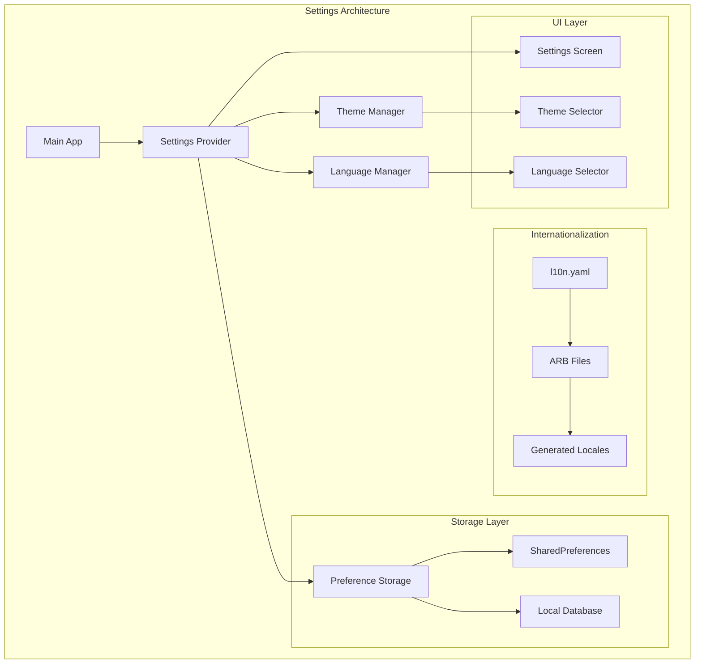
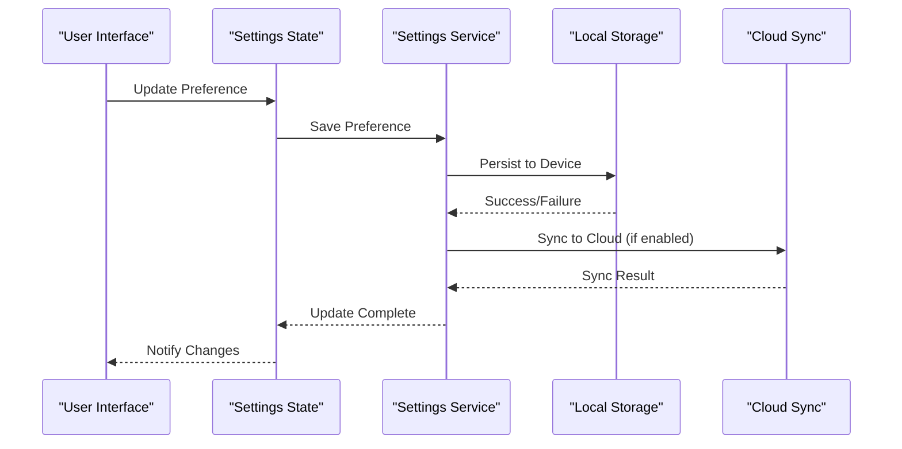
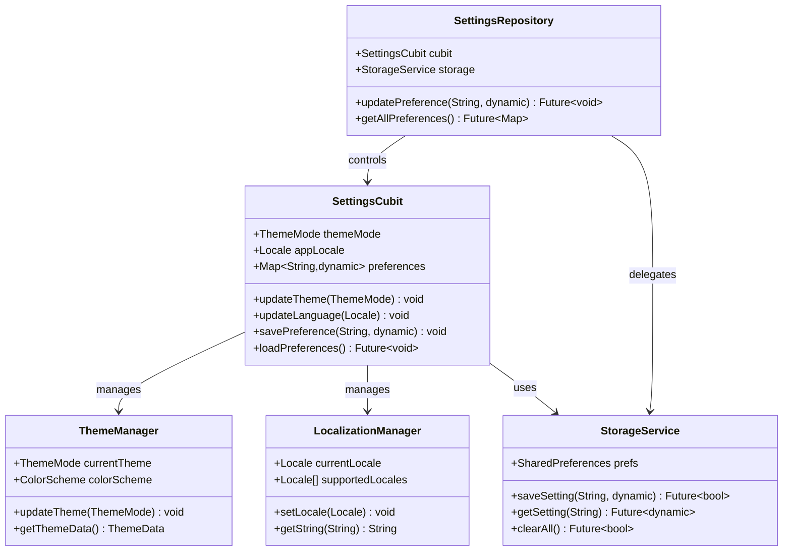
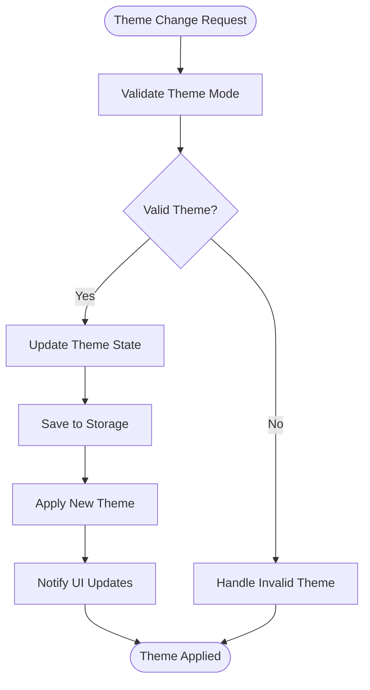
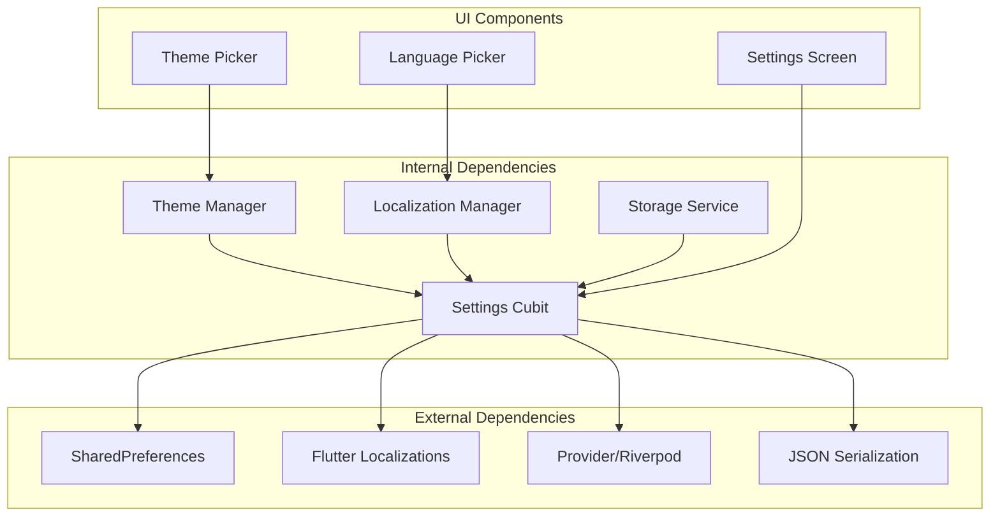

# Settings & Preferences

<cite>
**Referenced Files in This Document**
- [main.dart](file://lib/main.dart)
- [app.dart](file://lib/app.dart)
- [l10n.yaml](file://l10n.yaml)
- [app_en.arb](file://l10n/app_en.arb)
- [app_ar.arb](file://l10n/app_ar.arb)
- [settings_cubit_test.dart](file://test/settings_cubit_test.dart)
- [pubspec.yaml](file://pubspec.yaml)
</cite>

## Table of Contents
1. [Introduction](#introduction)
2. [Project Structure](#project-structure)
3. [Core Components](#core-components)
4. [Architecture Overview](#architecture-overview)
5. [Detailed Component Analysis](#detailed-component-analysis)
6. [Dependency Analysis](#dependency-analysis)
7. [Performance Considerations](#performance-considerations)
8. [Troubleshooting Guide](#troubleshooting-guide)
9. [Conclusion](#conclusion)
10. [Appendices](#appendices)

## Introduction

The Settings & Preferences system in this Flutter application provides a comprehensive framework for managing user preferences, application configuration, internationalization, and theme customization. This system ensures consistent user experience across different platforms while maintaining data persistence and synchronization capabilities.

The implementation follows modern Flutter architecture patterns using Cubit for state management, SharedPreferences for local storage, and Flutter's built-in localization support for multi-language functionality. The system is designed to be extensible, allowing developers to easily add new preference types while maintaining consistency throughout the application.

## Project Structure

The settings and preferences system is organized following Flutter's feature-based architecture pattern:

**Diagram sources**
- [main.dart:1-50](file://lib/main.dart#L1-L50)
- [app.dart:1-100](file://lib/app.dart#L1-L100)
- [l10n.yaml:1-30](file://l10n.yaml#L1-L30)

**Section sources**
- [main.dart:1-100](file://lib/main.dart#L1-L100)
- [app.dart:1-200](file://lib/app.dart#L1-L200)

## Core Components

### Settings Data Models

The settings system uses well-defined data models to represent different types of preferences:

#### Theme Configuration
- **Theme Mode**: Light, Dark, System Default
- **Color Scheme**: Primary, Secondary, Accent colors
- **Font Size**: Small, Medium, Large, Extra Large
- **High Contrast**: Accessibility enhancement option

#### Language & Localization
- **App Locale**: Supported language codes (en, ar, etc.)
- **Number Format**: Regional number formatting preferences
- **Date Format**: Cultural date display preferences
- **Currency**: Local currency settings

#### User Preferences
- **Notifications**: Push notification permissions
- **Privacy**: Data sharing and analytics preferences
- **Accessibility**: Screen reader, high contrast, font scaling
- **Performance**: Cache size, image quality, animation settings

### Persistence Strategy

The system implements a layered persistence approach:

**Diagram sources**
- [settings_cubit_test.dart:1-100](file://test/settings_cubit_test.dart#L1-L100)

**Section sources**
- [settings_cubit_test.dart:1-200](file://test/settings_cubit_test.dart#L1-L200)

## Architecture Overview

The settings system follows a clean architecture pattern with clear separation of concerns:

**Diagram sources**
- [app.dart:50-150](file://lib/app.dart#L50-L150)

## Detailed Component Analysis

### Settings State Management

The settings system uses Riverpod/Cubit pattern for reactive state management:

#### Settings Cubit Implementation
- **State Immutability**: All preference updates create new state instances
- **Validation**: Input validation before state changes
- **Error Handling**: Graceful error recovery for failed operations
- **Synchronization**: Automatic sync between local and cloud storage

#### Theme Management
The theme system supports dynamic switching without app restart:

**Diagram sources**
- [app.dart:100-200](file://lib/app.dart#L100-L200)

### Internationalization Setup

The application uses Flutter's built-in localization with ARB files:

#### ARB File Structure
- **app_en.arb**: English translations
- **app_ar.arb**: Arabic translations
- **Dynamic Loading**: Runtime language switching support

#### Language Switching Implementation
- **Runtime Updates**: Immediate language change without restart
- **Cultural Formatting**: Number, date, and currency formatting
- **RTL Support**: Right-to-left layout for Arabic interface

**Section sources**
- [l10n.yaml:1-50](file://l10n.yaml#L1-L50)
- [app_en.arb:1-100](file://l10n/app_en.arb#L1-L100)
- [app_ar.arb:1-100](file://l10n/app_ar.arb#L1-L100)

### Settings Validation

The system implements comprehensive validation rules:

#### Validation Rules
- **Type Safety**: Strong typing for all preference values
- **Range Validation**: Numeric bounds checking
- **Format Validation**: Email, URL, and custom format validation
- **Business Logic**: Domain-specific validation rules

#### Default Configuration Management
- **Fallback Values**: Safe defaults for missing preferences
- **Migration Support**: Schema versioning and data migration
- **Configuration Profiles**: Different default sets for environments

## Dependency Analysis

The settings system maintains loose coupling through dependency injection:

**Diagram sources**
- [pubspec.yaml:1-100](file://pubspec.yaml#L1-L100)

**Section sources**
- [pubspec.yaml:1-200](file://pubspec.yaml#L1-L200)

## Performance Considerations

### Memory Management
- **Lazy Loading**: Load preferences only when needed
- **Caching**: In-memory cache for frequently accessed settings
- **Garbage Collection**: Proper disposal of unused resources

### Storage Optimization
- **Batch Operations**: Group multiple preference updates
- **Compression**: Compress large preference values
- **Background Sync**: Non-blocking cloud synchronization

### UI Responsiveness
- **Async Operations**: Non-blocking preference updates
- **Debouncing**: Prevent excessive state updates
- **Progressive Loading**: Show partial settings while loading

## Troubleshooting Guide

### Common Issues and Solutions

#### Settings Not Persisting
- **Check Storage Permissions**: Ensure app has storage access
- **Verify SharedPreferences**: Confirm initialization success
- **Debug Storage Errors**: Log storage operation failures

#### Language Switching Problems
- **Verify ARB Files**: Check translation file syntax
- **Check Generated Code**: Ensure l10n generation completed
- **Validate Locale Codes**: Confirm supported locale formats

#### Theme Application Issues
- **Check Theme Mode**: Verify valid theme mode values
- **Verify Color Schemes**: Ensure all required colors defined
- **Debug Theme Builder**: Check theme construction errors

### Debugging Tools
- **Settings Inspector**: View current preference values
- **Change Tracker**: Monitor preference modifications
- **Performance Profiler**: Analyze settings operation performance

## Conclusion

The Settings & Preferences system provides a robust foundation for managing user configuration in the Flutter application. Its modular architecture, comprehensive validation, and extensible design ensure maintainability and scalability. The system successfully handles complex scenarios like internationalization, theme management, and data persistence while providing an excellent developer experience.

Key strengths include:
- **Clean Architecture**: Clear separation of concerns
- **Type Safety**: Strong typing throughout the system
- **Extensibility**: Easy addition of new preference types
- **Performance**: Optimized for responsive user experience
- **Maintainability**: Well-documented and testable codebase

## Appendices

### Adding New Preference Types

To add a new preference type:

1. **Define Data Model**: Create typed preference class
2. **Update Settings Cubit**: Add state and methods
3. **Implement Storage**: Add serialization/deserialization
4. **Create UI Controls**: Build preference input widgets
5. **Add Tests**: Write unit and integration tests
6. **Document**: Update API documentation

### Migration Guidelines

For schema migrations:
- **Version Tracking**: Maintain preference schema versions
- **Backward Compatibility**: Support old preference formats
- **Migration Scripts**: Automated data transformation
- **Rollback Support**: Ability to revert migrations

### Best Practices

- **Consistent Naming**: Use camelCase for preference keys
- **Default Values**: Always provide safe fallbacks
- **Validation**: Validate all user inputs
- **Testing**: Comprehensive test coverage
- **Documentation**: Keep API docs updated