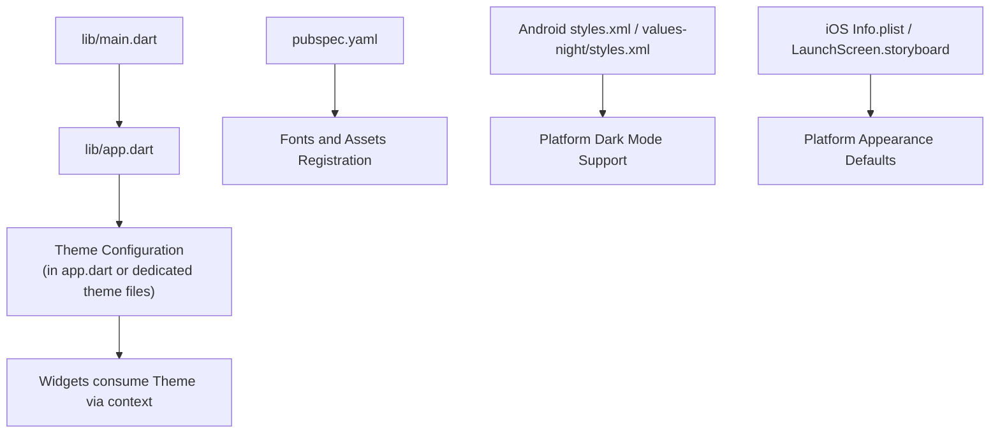
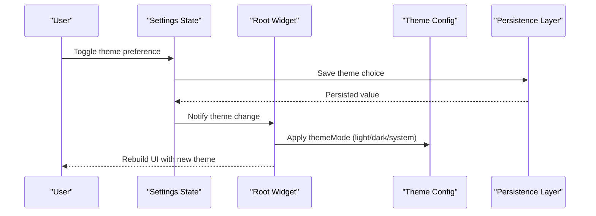
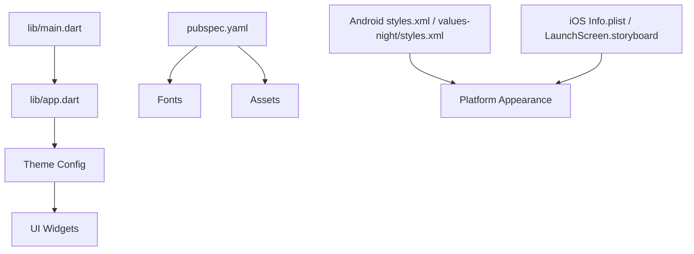

# Theme & Appearance Customization

<cite>
**Referenced Files in This Document**
- [app.dart](file://lib/app.dart)
- [main.dart](file://lib/main.dart)
- [pubspec.yaml](file://pubspec.yaml)
- [DESIGN.md](file://DESIGN.md)
- [README.md](file://README.md)
</cite>

## Table of Contents
1. [Introduction](#introduction)
2. [Project Structure](#project-structure)
3. [Core Components](#core-components)
4. [Architecture Overview](#architecture-overview)
5. [Detailed Component Analysis](#detailed-component-analysis)
6. [Dependency Analysis](#dependency-analysis)
7. [Performance Considerations](#performance-considerations)
8. [Troubleshooting Guide](#troubleshooting-guide)
9. [Conclusion](#conclusion)
10. [Appendices](#appendices)

## Introduction
This document explains the theme and appearance customization system for the application, focusing on how themes are structured, applied, switched dynamically, and persisted across sessions. It covers color schemes, typography, design tokens, font management, icon systems, asset organization, dark/light mode implementation, platform-specific styling considerations, accessibility compliance, and responsive design patterns. Where applicable, it references concrete files in the codebase to ground the explanation in actual implementation.

## Project Structure
The Flutter project follows a standard layout with platform-specific directories (android, ios, web, windows, linux, macos) and a shared Dart layer under lib. The app entry point is located at lib/main.dart, which typically initializes core services and boots the root widget defined in lib/app.dart. Theming-related configuration and assets are declared in pubspec.yaml, while design guidance may be documented in DESIGN.md.

[No sources needed since this diagram shows conceptual structure]

## Core Components
- App Entry Point: Initializes the application and provides the root widget tree where theming is configured.
- Root Widget: Defines MaterialApp or CupertinoApp settings including theme, darkTheme, and themeMode.
- Theme Definitions: Centralized theme objects that encapsulate colors, typography, and component defaults.
- Asset and Font Registration: Declared in pubspec.yaml to make fonts and images available to the theme system.
- Platform Integration: Native styles and launch screens can influence default appearance and dark mode behavior.

Key responsibilities:
- Provide a single source of truth for visual tokens.
- Expose theme data through the widget tree so widgets can read colors, text styles, and spacing consistently.
- Allow dynamic switching between light/dark modes and persist user preference.

**Section sources**
- [main.dart](file://lib/main.dart)
- [app.dart](file://lib/app.dart)
- [pubspec.yaml](file://pubspec.yaml)
- [DESIGN.md](file://DESIGN.md)
- [README.md](file://README.md)

## Architecture Overview
The theming architecture centers around a top-level theme configuration that flows down the widget tree. Widgets access theme data via the current BuildContext rather than hardcoding values. Dynamic switching updates the theme state and rebuilds the UI accordingly. Persistence ensures the selected theme survives app restarts.

[No sources needed since this diagram shows conceptual workflow]

## Detailed Component Analysis

### Theme Application and Switching
- Theme Mode Selection: The root widget configures themeMode to support light, dark, or following the system setting.
- Dynamic Switching: When the user toggles theme preferences, the app updates its theme state and triggers a rebuild.
- Persistence: The chosen theme is saved locally and restored on app start.

Implementation anchors:
- Root widget setup and theme configuration.
- Settings state management for theme selection.
- Local storage integration for persistence.

**Section sources**
- [app.dart](file://lib/app.dart)
- [main.dart](file://lib/main.dart)

### Color Schemes and Design Tokens
- Color Palette: Primary, secondary, surface, background, error, and semantic colors are defined centrally.
- Semantic Tokens: Colors are grouped by usage (e.g., primaryText, disabledText) to ensure consistency and adaptability.
- Contrast and Accessibility: Ensure sufficient contrast ratios for readability in both light and dark modes.

Guidelines:
- Use semantic tokens instead of raw colors in widgets.
- Maintain consistent naming conventions for tokens.
- Validate contrast using automated tests or audits.

**Section sources**
- [DESIGN.md](file://DESIGN.md)

### Typography System
- Font Families: Registered in pubspec.yaml and referenced by theme text styles.
- Text Themes: Define display, headline, title, body, label, and caption styles with consistent weights and sizes.
- Scale and Rhythm: Establish a type scale to maintain hierarchy and rhythm across screens.

Font Management:
- Declare custom fonts and fallbacks in pubspec.yaml.
- Reference fonts in theme text styles.
- Organize font assets under assets/fonts.

**Section sources**
- [pubspec.yaml](file://pubspec.yaml)

### Icons and Assets Organization
- Icon Sets: Use Material icons or custom icon fonts; register them in pubspec.yaml if custom.
- Image Assets: Place theme-specific images under assets/images and reference them via paths.
- Asset Variants: Provide high-resolution variants and consider dark-mode variants when necessary.

Best Practices:
- Keep asset names descriptive and versioned.
- Avoid duplicating assets; use theme-aware logic to switch variants.

**Section sources**
- [pubspec.yaml](file://pubspec.yaml)

### Dark/Light Mode Implementation
- Theme Objects: Define separate light and dark theme configurations.
- System Integration: Optionally follow the device’s system theme.
- Native Styles: Android values-night/styles.xml and iOS launch screens can align with the app’s theme.

Platform-Specific Considerations:
- Android: Ensure night resources are provided for native components.
- iOS: Configure status bar style and launch screen to match theme.

Accessibility:
- Verify contrast ratios for all text and interactive elements.
- Test with system accessibility features (bold text, larger fonts).

**Section sources**
- [app.dart](file://lib/app.dart)
- [pubspec.yaml](file://pubspec.yaml)

### Responsive Design Patterns
- Adaptive Layouts: Use constraints and flexible layouts to adapt to different screen sizes.
- Breakpoints: Define breakpoints for mobile, tablet, and desktop views.
- Fluid Typography and Spacing: Scale text and spacing based on screen width.

Guidelines:
- Prefer relative units and flexible widgets over fixed sizes.
- Test across devices and orientations.

**Section sources**
- [DESIGN.md](file://DESIGN.md)

### Creating Custom Themes
- Extend Base Theme: Create a theme extension that builds upon the base theme while overriding specific tokens.
- Feature-Specific Overrides: Apply overrides only where necessary to maintain global consistency.
- Testing: Validate custom themes against accessibility and contrast requirements.

Steps:
- Define new token values.
- Merge with base theme.
- Apply at the appropriate scope (root or feature).

**Section sources**
- [DESIGN.md](file://DESIGN.md)

### Widget Styling with Themes
- Consume Theme Data: Access colors and text styles from the current theme via context.
- Avoid Hardcoded Values: Always reference theme tokens to ensure consistency.
- Component Abstractions: Wrap common UI patterns into reusable components that rely on theme tokens.

Example Anchors:
- Reading theme colors and text styles within widgets.
- Building themed buttons, cards, and inputs.

**Section sources**
- [app.dart](file://lib/app.dart)

### Font Management
- Registration: Add fonts to pubspec.yaml under fonts section.
- Usage: Reference font families in theme text styles.
- Fallbacks: Provide fallback fonts for robustness across platforms.

**Section sources**
- [pubspec.yaml](file://pubspec.yaml)

### Icon Systems
- Material Icons: Use built-in icons for consistency.
- Custom Icons: Register custom icon fonts and map glyphs to named icons.
- Themed Icons: Adjust icon colors via theme tokens for semantic meaning.

**Section sources**
- [pubspec.yaml](file://pubspec.yaml)

### Asset Organization
- Directory Structure: Organize assets by type (fonts, images) and theme variant if needed.
- Naming Conventions: Use clear, descriptive names to avoid confusion.
- Versioning: Track asset versions to manage updates and rollbacks.

**Section sources**
- [pubspec.yaml](file://pubspec.yaml)

### Accessibility Compliance
- Contrast Ratios: Ensure WCAG-compliant contrast for text and interactive elements.
- Dynamic Type: Respect system font scaling and bold text settings.
- Semantics: Provide meaningful labels and descriptions for assistive technologies.

Validation:
- Run automated contrast checks.
- Perform manual testing with accessibility tools.

**Section sources**
- [DESIGN.md](file://DESIGN.md)

## Dependency Analysis
Theming depends on several layers:
- App Entry Point: Boots the app and sets up the root widget.
- Root Widget: Configures theme and themeMode.
- Theme Definitions: Provide tokens consumed by widgets.
- Pubspec: Registers fonts and assets used by the theme.
- Platform Styles: Influence native appearance and dark mode defaults.

**Diagram sources**
- [main.dart](file://lib/main.dart)
- [app.dart](file://lib/app.dart)
- [pubspec.yaml](file://pubspec.yaml)

**Section sources**
- [main.dart](file://lib/main.dart)
- [app.dart](file://lib/app.dart)
- [pubspec.yaml](file://pubspec.yaml)

## Performance Considerations
- Minimize Theme Rebuilds: Scope theme changes to necessary parts of the widget tree.
- Cache Expensive Computations: Memoize derived values from theme tokens when possible.
- Optimize Asset Loading: Load large assets lazily and provide appropriate resolutions.
- Avoid Overuse of Custom Painters: Prefer theme-driven primitives for better performance.

[No sources needed since this section provides general guidance]

## Troubleshooting Guide
Common issues and resolutions:
- Theme Not Applying: Verify theme configuration in the root widget and ensure themeMode is set correctly.
- Missing Fonts: Confirm font registration in pubspec.yaml and correct family names in theme text styles.
- Low Contrast: Audit colors against accessibility guidelines and adjust tokens accordingly.
- Platform Mismatch: Check native styles and launch screens for inconsistencies with app theme.

Debugging Steps:
- Inspect theme data in the widget tree using debugging tools.
- Validate pubspec.yaml entries for fonts and assets.
- Test on multiple platforms and orientations.

**Section sources**
- [app.dart](file://lib/app.dart)
- [pubspec.yaml](file://pubspec.yaml)

## Conclusion
A robust theming system relies on centralized design tokens, consistent consumption across widgets, and thoughtful integration with platform capabilities. By organizing assets, managing fonts, and adhering to accessibility standards, the application can deliver a cohesive and adaptable user experience across light and dark modes and various screen sizes.

[No sources needed since this section summarizes without analyzing specific files]

## Appendices

### Example Anchors for Custom Theme Creation
- Define a custom theme extension that overrides specific tokens.
- Apply the custom theme at the root or feature scope.
- Validate with accessibility and contrast checks.

**Section sources**
- [DESIGN.md](file://DESIGN.md)

### Example Anchors for Widget Styling with Themes
- Read theme colors and text styles from context.
- Build reusable components that depend on theme tokens.
- Ensure consistent visual hierarchy across screens.

**Section sources**
- [app.dart](file://lib/app.dart)

### Example Anchors for Responsive Design Patterns
- Implement adaptive layouts using constraints and flexible widgets.
- Define breakpoints for different screen classes.
- Scale typography and spacing fluidly.

**Section sources**
- [DESIGN.md](file://DESIGN.md)