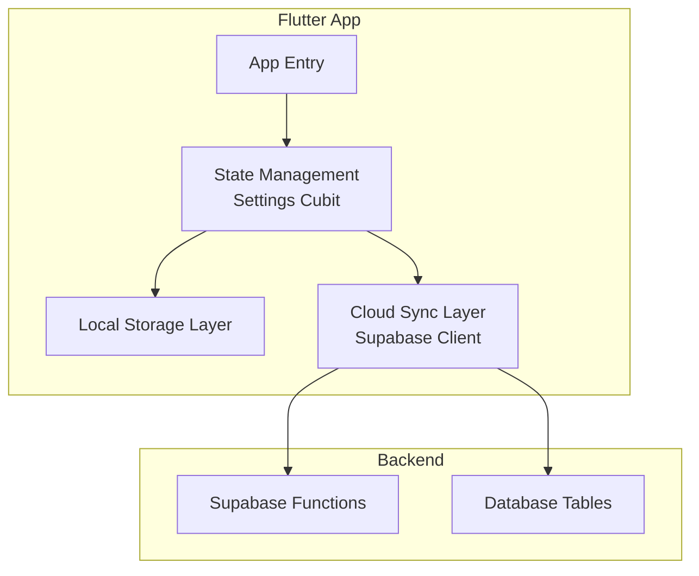
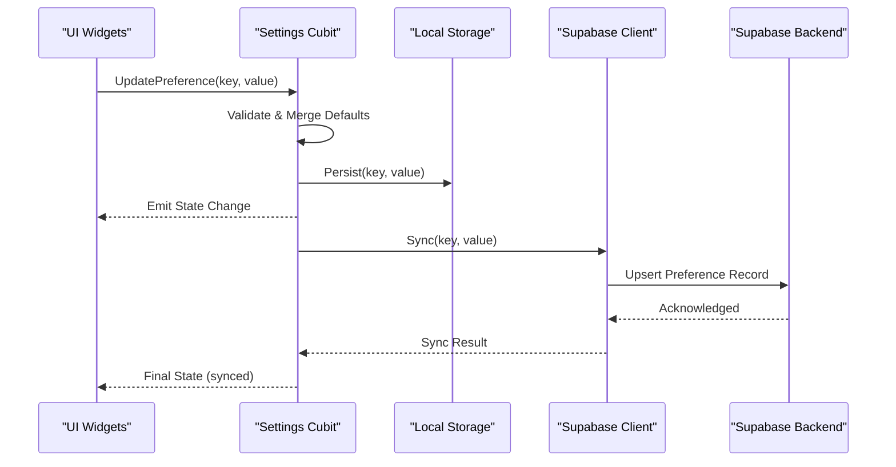
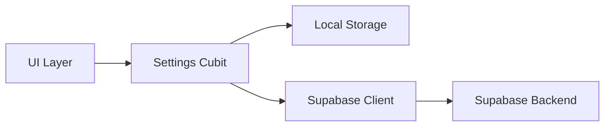
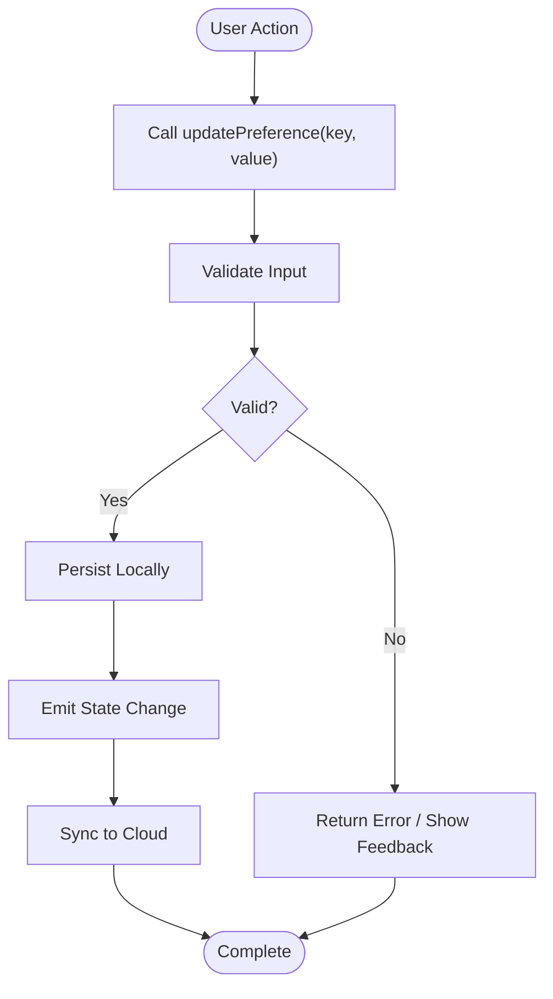
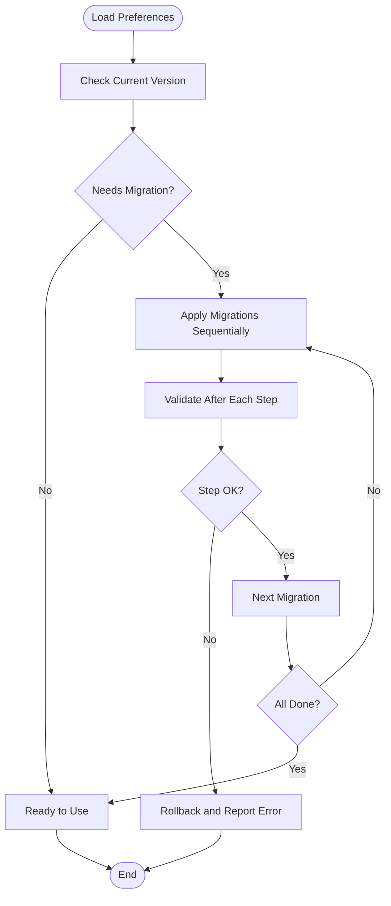

# User Preferences Management

<cite>
**Referenced Files in This Document**
- [settings_cubit_test.dart](file://test/settings_cubit_test.dart)
- [supabase-integration.md](file://docs/supabase-integration.md)
</cite>

## Table of Contents
1. [Introduction](#introduction)
2. [Project Structure](#project-structure)
3. [Core Components](#core-components)
4. [Architecture Overview](#architecture-overview)
5. [Detailed Component Analysis](#detailed-component-analysis)
6. [Dependency Analysis](#dependency-analysis)
7. [Performance Considerations](#performance-considerations)
8. [Troubleshooting Guide](#troubleshooting-guide)
9. [Conclusion](#conclusion)
10. [Appendices](#appendices)

## Introduction
This document explains the user preferences management system, focusing on how settings are stored, retrieved, synchronized across devices, and maintained over time. It covers data models, validation rules, defaults, persistence strategies (local storage and cloud sync), migration handling, API interfaces, event listeners for preference changes, performance considerations for large preference sets, security and encryption for sensitive settings, backup/restore functionality, and guidelines for adding new preference types while preserving backward compatibility.

Where applicable, this guide references concrete code locations from the repository to ground explanations in actual implementation details.

## Project Structure
The project is a Flutter application with feature-based organization under lib. The presence of tests for a settings cubit indicates that user preferences are managed via state management using a Cubit pattern. Cloud integration documentation suggests Supabase as the backend service used for synchronization.

[No sources needed since this diagram shows conceptual workflow, not actual code structure]

## Core Components
- Settings Cubit: Manages current preferences, exposes methods to update values, and emits state changes to UI consumers.
- Local Storage Adapter: Persists preferences to device storage for offline availability and fast reads.
- Cloud Sync Adapter: Synchronizes preferences with Supabase to keep multiple devices consistent.
- Validation and Defaults: Centralized schema and default values ensure consistency and safe upgrades.
- Migration Utilities: Apply versioned transformations when preference schemas evolve.
- Event Listeners: UI components subscribe to preference change events to reactively update.

Key responsibilities:
- Read/write operations with optimistic updates and conflict resolution.
- Versioning and migration of preference payloads.
- Security boundaries for sensitive fields.
- Efficient batching and caching for large preference sets.

**Section sources**
- [settings_cubit_test.dart](file://test/settings_cubit_test.dart)
- [supabase-integration.md](file://docs/supabase-integration.md)

## Architecture Overview
The preferences architecture follows a layered approach:
- Presentation layer subscribes to the Settings Cubit state.
- Business logic layer (Cubit) orchestrates local and remote operations.
- Data layer abstracts storage backends (local and cloud).
- Backend services provide persistent storage and cross-device sync.

**Diagram sources**
- [settings_cubit_test.dart:1-200](file://test/settings_cubit_test.dart#L1-L200)
- [supabase-integration.md:1-200](file://docs/supabase-integration.md#L1-L200)

## Detailed Component Analysis

### Settings Cubit
Responsibilities:
- Maintain current preferences as state.
- Provide typed setters for each preference key.
- Validate inputs against schema and apply defaults.
- Persist locally and trigger cloud sync.
- Emit granular or batched state updates.

Typical usage patterns:
- Initialize with defaults if no persisted data exists.
- Batch multiple updates before emitting to reduce rebuilds.
- Handle sync failures gracefully by retrying or queuing.

Validation and defaults:
- Enforce non-null constraints where required.
- Normalize values (e.g., trimming strings, clamping numbers).
- Ensure enums map to known values; fallback to defaults on unknowns.

Event listeners:
- UI listens to specific keys or entire preference set.
- Debounced listeners avoid excessive rebuilds during rapid updates.

**Section sources**
- [settings_cubit_test.dart:1-200](file://test/settings_cubit_test.dart#L1-L200)

### Local Storage Layer
Responsibilities:
- Serialize/deserialize preference objects.
- Provide atomic read/write operations.
- Support partial updates and merge semantics.
- Cache hot paths for performance.

Persistence strategy:
- Use a single JSON blob keyed by user/session for simplicity.
- Partition large preference sets into namespaces to improve locality.
- Implement write coalescing to minimize I/O overhead.

Error handling:
- Catch serialization errors and fall back to last known good state.
- Retry failed writes with exponential backoff.

**Section sources**
- [settings_cubit_test.dart:1-200](file://test/settings_cubit_test.dart#L1-L200)

### Cloud Sync Layer (Supabase)
Responsibilities:
- Push local changes to Supabase.
- Pull remote changes and reconcile conflicts.
- Manage authentication context and permissions.

Sync flow:
- On app start, load remote preferences if available.
- On local changes, queue updates and send in batches.
- Resolve conflicts using timestamps or server-side rules.

Integration points:
- Supabase client initialization and configuration.
- Function calls for complex operations like bulk upserts.

**Section sources**
- [supabase-integration.md:1-200](file://docs/supabase-integration.md#L1-L200)

### Data Models and Schema
Preference model characteristics:
- Strongly typed keys and values.
- Version field to support migrations.
- Optional fields with well-defined defaults.

Schema evolution:
- Increment version on breaking changes.
- Provide migration functions to transform older versions to newer ones.
- Keep deprecated fields temporarily for backward compatibility.

Example categories:
- Appearance (theme, font size, color accents).
- Notifications (channels, quiet hours).
- Privacy (data sharing toggles, analytics opt-in).
- Regional (language, currency, timezone).

**Section sources**
- [settings_cubit_test.dart:1-200](file://test/settings_cubit_test.dart#L1-L200)

### Validation Rules
Common validations:
- Type checks (string, number, boolean, enum).
- Range checks (min/max for numeric values).
- Format checks (email, URL, regex patterns).
- Cross-field dependencies (e.g., enabling advanced features requires certain flags).

Default configurations:
- Safe defaults for all optional fields.
- Environment-aware defaults (e.g., staging vs production).
- Feature-flag-driven defaults.

**Section sources**
- [settings_cubit_test.dart:1-200](file://test/settings_cubit_test.dart#L1-L200)

### Persistence Strategies
Local-first design:
- Immediate persistence ensures resilience and speed.
- Background sync keeps cloud in sync without blocking UI.

Conflict resolution:
- Last-write-wins with timestamp metadata.
- Server-side normalization for canonical values.
- Rollback on invalid payloads.

Backup and restore:
- Export preferences to a secure file or encrypted payload.
- Import with validation and migration steps.
- Preserve audit logs for traceability.

**Section sources**
- [settings_cubit_test.dart:1-200](file://test/settings_cubit_test.dart#L1-L200)
- [supabase-integration.md:1-200](file://docs/supabase-integration.md#L1-L200)

### Preference Migration Handling
Migration process:
- Detect current version on load.
- Apply sequential migrations until target version reached.
- Validate after each step to catch regressions early.

Backward compatibility:
- Retain deprecated fields for N versions.
- Provide deprecation warnings in logs.
- Offer reset-to-defaults option for corrupted states.

**Section sources**
- [settings_cubit_test.dart:1-200](file://test/settings_cubit_test.dart#L1-L200)

### API Interfaces
Public interface highlights:
- getPreferences(): returns current snapshot.
- updatePreference(key, value): validates, persists, syncs.
- batchUpdate(updates): applies multiple changes atomically.
- resetToDefaults(): clears customizations safely.
- exportPreferences(): generates portable backup.
- importPreferences(payload): validates and migrates imported data.

Events:
- onPreferenceChanged(key): fine-grained listener.
- onPreferencesUpdated(): broad listener for full refresh.

**Section sources**
- [settings_cubit_test.dart:1-200](file://test/settings_cubit_test.dart#L1-L200)

### Event Listeners for Preference Changes
Patterns:
- Subscribe at widget level for targeted rebuilds.
- Use selectors to compute derived values efficiently.
- Debounce high-frequency updates to prevent thrashing.

Best practices:
- Avoid heavy computations inside listeners.
- Offload expensive work to background tasks.
- Unsubscribe on dispose to prevent leaks.

**Section sources**
- [settings_cubit_test.dart:1-200](file://test/settings_cubit_test.dart#L1-L200)

### Performance Considerations for Large Preference Sets
Optimizations:
- Namespace preferences to reduce payload sizes.
- Lazy-load sections only when needed.
- Cache computed views and memoize derived state.
- Batch writes and debounce reads during rapid changes.

Monitoring:
- Track sync latency and failure rates.
- Log migration durations and error counts.
- Profile memory usage for large serialized blobs.

**Section sources**
- [settings_cubit_test.dart:1-200](file://test/settings_cubit_test.dart#L1-L200)

### Security and Encryption for Sensitive Settings
Guidelines:
- Encrypt sensitive fields (e.g., tokens, personal identifiers) before local storage.
- Use platform-provided secure storage APIs where possible.
- Restrict access via OS-level permissions and app sandboxing.
- Rotate secrets and enforce minimum encryption standards.

Cloud considerations:
- Transmit only necessary fields over TLS.
- Apply RLS policies to limit access to user’s own preferences.
- Audit access and log anomalies.

**Section sources**
- [supabase-integration.md:1-200](file://docs/supabase-integration.md#L1-L200)

### Backup and Restore Functionality
Workflow:
- Export: serialize preferences, encrypt if needed, generate checksum.
- Import: validate checksum, decrypt if needed, migrate to current schema.
- Rollback: retain previous version until successful import completes.

Storage options:
- Device-local files with user consent.
- Secure cloud storage buckets with access controls.

**Section sources**
- [settings_cubit_test.dart:1-200](file://test/settings_cubit_test.dart#L1-L200)

### Guidelines for Adding New Preference Types
Steps:
- Define type-safe keys and value structures.
- Add validation rules and defaults.
- Implement migration if existing users need transformation.
- Wire up UI controls and event listeners.
- Update tests to cover new behavior and edge cases.

Backward compatibility:
- Introduce new fields as optional initially.
- Provide graceful degradation if old clients lack support.
- Deprecate old fields gradually with clear migration path.

**Section sources**
- [settings_cubit_test.dart:1-200](file://test/settings_cubit_test.dart#L1-L200)

## Dependency Analysis
High-level dependencies:
- Settings Cubit depends on local storage and cloud sync adapters.
- Cloud sync adapter depends on Supabase client and functions.
- UI depends on Cubit state and events.

**Diagram sources**
- [settings_cubit_test.dart:1-200](file://test/settings_cubit_test.dart#L1-L200)
- [supabase-integration.md:1-200](file://docs/supabase-integration.md#L1-L200)

**Section sources**
- [settings_cubit_test.dart:1-200](file://test/settings_cubit_test.dart#L1-L200)
- [supabase-integration.md:1-200](file://docs/supabase-integration.md#L1-L200)

## Performance Considerations
- Prefer incremental updates and selective rebuilds.
- Coalesce frequent writes into batches.
- Use lazy loading for large sections.
- Monitor and cap payload sizes for network transfers.
- Cache frequently accessed preferences in memory with TTL.

[No sources needed since this section provides general guidance]

## Troubleshooting Guide
Common issues:
- Sync failures due to network errors: implement retries and queueing.
- Conflicting preferences across devices: rely on server-side timestamps and deterministic resolution.
- Migration errors: validate intermediate states and provide rollback.
- Encrypted payload corruption: verify checksums and regenerate defaults.

Debugging tips:
- Enable verbose logging for preference lifecycle events.
- Snapshot state before and after migrations.
- Inspect network requests to Supabase for anomalies.

**Section sources**
- [settings_cubit_test.dart:1-200](file://test/settings_cubit_test.dart#L1-L200)
- [supabase-integration.md:1-200](file://docs/supabase-integration.md#L1-L200)

## Conclusion
The user preferences management system combines local-first persistence with cloud synchronization to deliver responsive and consistent experiences across devices. By enforcing strong validation, maintaining backward-compatible schemas, and applying security best practices, the system remains robust and scalable. Following the provided guidelines ensures smooth evolution of preference types and reliable operation even with large datasets.

[No sources needed since this section summarizes without analyzing specific files]

## Appendices

### Example Workflows

#### Updating a Preference

**Diagram sources**
- [settings_cubit_test.dart:1-200](file://test/settings_cubit_test.dart#L1-L200)

#### Migrating Preferences

**Diagram sources**
- [settings_cubit_test.dart:1-200](file://test/settings_cubit_test.dart#L1-L200)