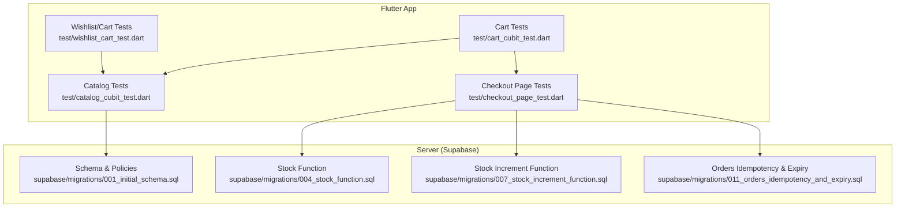
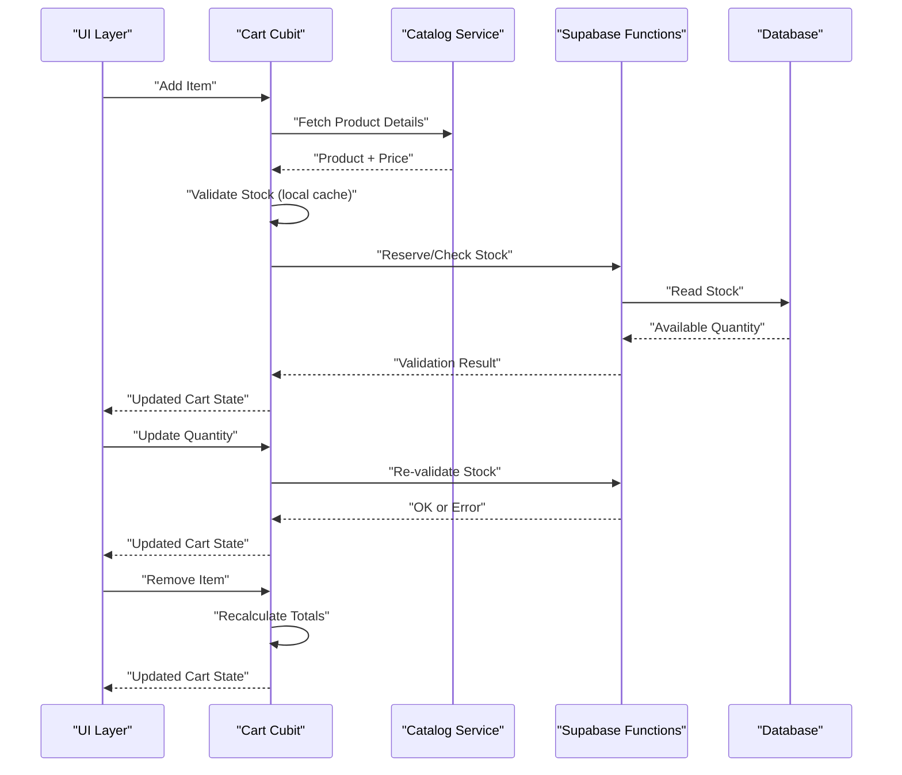
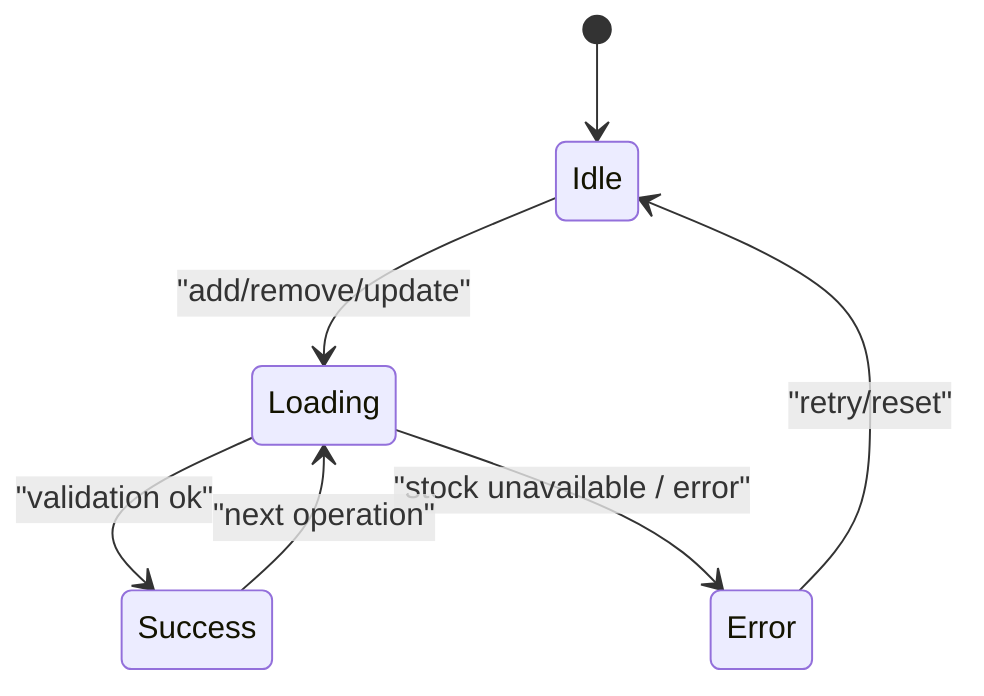
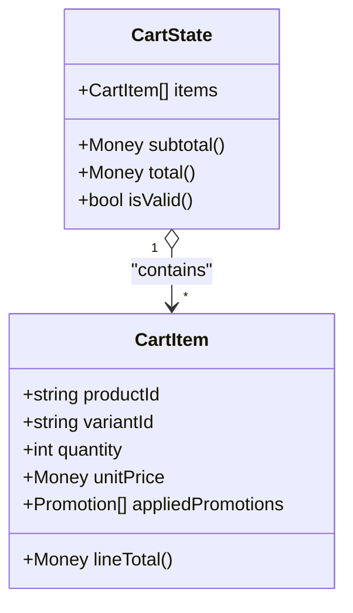
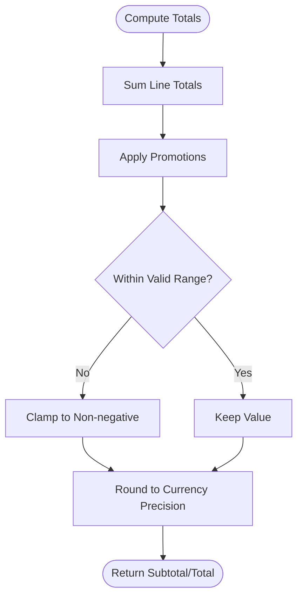
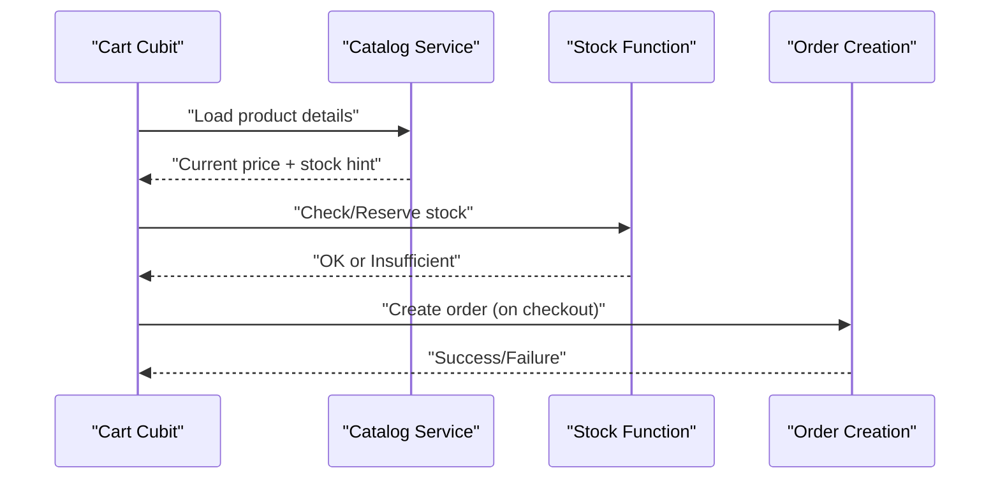
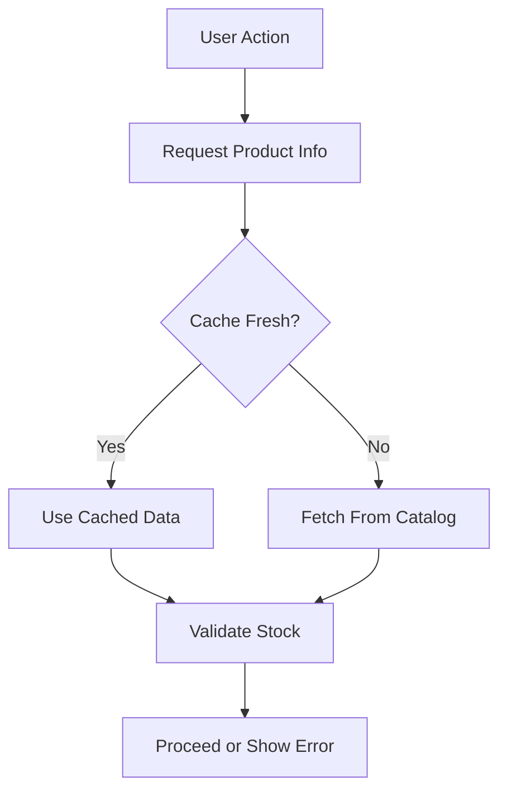
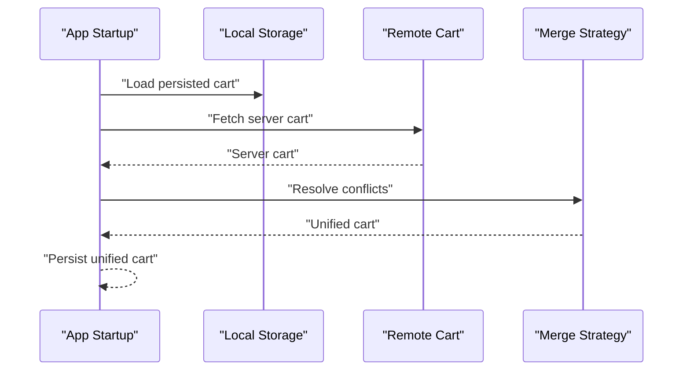
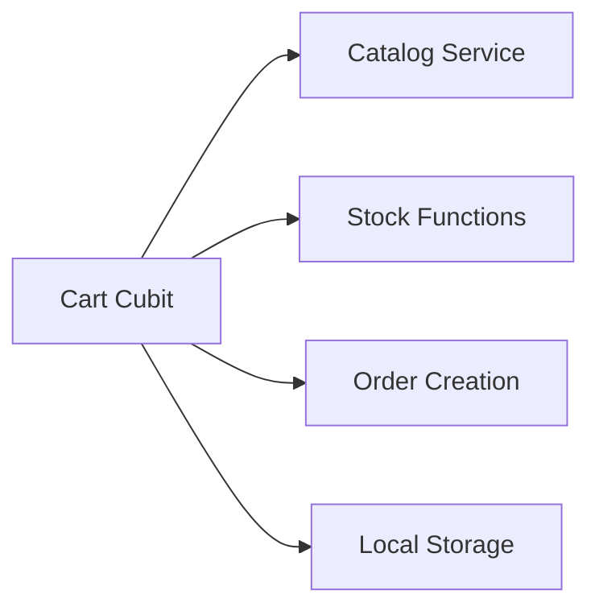

# Shopping Cart

<cite>
**Referenced Files in This Document**
- [cart_cubit_test.dart](file://test/cart_cubit_test.dart)
- [wishlist_cart_test.dart](file://test/wishlist_cart_test.dart)
- [catalog_cubit_test.dart](file://test/catalog_cubit_test.dart)
- [checkout_page_test.dart](file://test/checkout_page_test.dart)
- [supabase-integration.md](file://docs/supabase-integration.md)
- [001_initial_schema.sql](file://supabase/migrations/001_initial_schema.sql)
- [004_stock_function.sql](file://supabase/migrations/004_stock_function.sql)
- [007_stock_increment_function.sql](file://supabase/migrations/007_stock_increment_function.sql)
- [011_orders_idempotency_and_expiry.sql](file://supabase/migrations/011_orders_idempotency_and_expiry.sql)
</cite>

## Table of Contents
1. [Introduction](#introduction)
2. [Project Structure](#project-structure)
3. [Core Components](#core-components)
4. [Architecture Overview](#architecture-overview)
5. [Detailed Component Analysis](#detailed-component-analysis)
6. [Dependency Analysis](#dependency-analysis)
7. [Performance Considerations](#performance-considerations)
8. [Troubleshooting Guide](#troubleshooting-guide)
9. [Conclusion](#conclusion)
10. [Appendices](#appendices)

## Introduction
This document explains the shopping cart functionality with a focus on state management, data models, price calculations, inventory validation, and persistence. It covers how items are added and removed, how quantities are updated, how prices are computed (including promotions), and how the cart synchronizes with server-side data. It also provides guidance for testing strategies and performance optimization for large carts.

## Project Structure
The repository is a Flutter application organized by features and layers. The cart-related logic is primarily exercised through tests that validate Cubit state transitions, integration points with the catalog, and checkout flows. Server-side behavior relevant to stock and orders is defined in Supabase migrations.

**Diagram sources**
- [cart_cubit_test.dart](file://test/cart_cubit_test.dart)
- [wishlist_cart_test.dart](file://test/wishlist_cart_test.dart)
- [catalog_cubit_test.dart](file://test/catalog_cubit_test.dart)
- [checkout_page_test.dart](file://test/checkout_page_test.dart)
- [001_initial_schema.sql](file://supabase/migrations/001_initial_schema.sql)
- [004_stock_function.sql](file://supabase/migrations/004_stock_function.sql)
- [007_stock_increment_function.sql](file://supabase/migrations/007_stock_increment_function.sql)
- [011_orders_idempotency_and_expiry.sql](file://supabase/migrations/011_orders_idempotency_and_expiry.sql)

**Section sources**
- [cart_cubit_test.dart](file://test/cart_cubit_test.dart)
- [wishlist_cart_test.dart](file://test/wishlist_cart_test.dart)
- [catalog_cubit_test.dart](file://test/catalog_cubit_test.dart)
- [checkout_page_test.dart](file://test/checkout_page_test.dart)
- [supabase-integration.md](file://docs/supabase-integration.md)
- [001_initial_schema.sql](file://supabase/migrations/001_initial_schema.sql)
- [004_stock_function.sql](file://supabase/migrations/004_stock_function.sql)
- [007_stock_increment_function.sql](file://supabase/migrations/007_stock_increment_function.sql)
- [011_orders_idempotency_and_expiry.sql](file://supabase/migrations/011_orders_idempotency_and_expiry.sql)

## Core Components
- Cart state management: The cart uses a Cubit-based state machine. Tests assert state transitions when adding/removing items and updating quantities.
- Data models: Cart items represent product references, quantities, and pricing metadata. These are validated against catalog availability and current prices.
- Price calculation: Totals are derived from item prices and quantities, including any applicable promotional adjustments.
- Inventory validation: Before finalizing or persisting, the system validates available stock using server-side functions.
- Persistence: The cart persists across sessions via local storage and synchronizes with server-side order/cart records during checkout.

Key behaviors validated by tests include:
- Adding an item updates the cart state and totals.
- Removing an item removes it from the cart and recalculates totals.
- Updating quantity enforces minimums/maximums and revalidates stock.
- Promotional pricing affects line-item and cart totals where applicable.
- Out-of-stock conditions prevent invalid operations and surface errors.

**Section sources**
- [cart_cubit_test.dart](file://test/cart_cubit_test.dart)
- [wishlist_cart_test.dart](file://test/wishlist_cart_test.dart)
- [catalog_cubit_test.dart](file://test/catalog_cubit_test.dart)
- [checkout_page_test.dart](file://test/checkout_page_test.dart)

## Architecture Overview
The cart integrates with the product catalog for availability and pricing, and with server-side services for stock checks and order creation. The following diagram shows the high-level flow from UI actions to server-side validations.

**Diagram sources**
- [cart_cubit_test.dart](file://test/cart_cubit_test.dart)
- [catalog_cubit_test.dart](file://test/catalog_cubit_test.dart)
- [checkout_page_test.dart](file://test/checkout_page_test.dart)
- [004_stock_function.sql](file://supabase/migrations/004_stock_function.sql)
- [007_stock_increment_function.sql](file://supabase/migrations/007_stock_increment_function.sql)

## Detailed Component Analysis

### Cart Cubit State Management
- Responsibilities:
  - Maintain immutable cart state.
  - Emit new states on add/remove/update operations.
  - Compute totals and apply promotions.
  - Coordinate with catalog and server for validation.
- Typical state transitions:
  - Idle -> Loading -> Success/Error on add/remove/update.
  - Error states capture out-of-stock or network failures.
- Validation rules:
  - Minimum quantity enforcement.
  - Maximum quantity limits based on stock.
  - Price recalculation on quantity changes.

**Diagram sources**
- [cart_cubit_test.dart](file://test/cart_cubit_test.dart)

**Section sources**
- [cart_cubit_test.dart](file://test/cart_cubit_test.dart)

### Data Models for Cart Items
- Fields typically include:
  - Product identifier.
  - Selected variant (e.g., size/color).
  - Quantity.
  - Unit price at time of addition.
  - Applied promotions/discounts.
- Derived fields:
  - Line total = unit price × quantity − discounts.
  - Cart subtotal and total after applying global promotions.

**Diagram sources**
- [cart_cubit_test.dart](file://test/cart_cubit_test.dart)
- [wishlist_cart_test.dart](file://test/wishlist_cart_test.dart)

**Section sources**
- [cart_cubit_test.dart](file://test/cart_cubit_test.dart)
- [wishlist_cart_test.dart](file://test/wishlist_cart_test.dart)

### Price Calculations and Promotions
- Calculation steps:
  - Sum line totals across all items.
  - Apply cart-level promotions (percentage, fixed amount, buy-one-get-one).
  - Round according to currency rules.
- Edge cases:
  - Overlapping promotions resolved by precedence rules.
  - Zero or negative totals prevented.
  - Currency precision handled consistently.

**Diagram sources**
- [cart_cubit_test.dart](file://test/cart_cubit_test.dart)

**Section sources**
- [cart_cubit_test.dart](file://test/cart_cubit_test.dart)

### Inventory Validation and Synchronization
- Local validation:
  - Prevent adding more than cached stock.
  - Revalidate on quantity updates.
- Server-side validation:
  - Use stock functions to check and reserve inventory atomically.
  - Return errors if insufficient stock.
- Checkout synchronization:
  - Finalize stock decrements only upon successful order creation.
  - Ensure idempotency to avoid double-decrements.

**Diagram sources**
- [checkout_page_test.dart](file://test/checkout_page_test.dart)
- [004_stock_function.sql](file://supabase/migrations/004_stock_function.sql)
- [007_stock_increment_function.sql](file://supabase/migrations/007_stock_increment_function.sql)
- [011_orders_idempotency_and_expiry.sql](file://supabase/migrations/011_orders_idempotency_and_expiry.sql)

**Section sources**
- [checkout_page_test.dart](file://test/checkout_page_test.dart)
- [004_stock_function.sql](file://supabase/migrations/004_stock_function.sql)
- [007_stock_increment_function.sql](file://supabase/migrations/007_stock_increment_function.sql)
- [011_orders_idempotency_and_expiry.sql](file://supabase/migrations/011_orders_idempotency_and_expiry.sql)

### Integration with Product Catalog
- Availability checks:
  - Fetch latest product info before adding/updating.
  - Handle stale cache by refreshing on critical paths.
- Pricing updates:
  - Refresh prices on add/update to reflect current catalog values.
  - Surface price change warnings to users if needed.

**Diagram sources**
- [catalog_cubit_test.dart](file://test/catalog_cubit_test.dart)
- [cart_cubit_test.dart](file://test/cart_cubit_test.dart)

**Section sources**
- [catalog_cubit_test.dart](file://test/catalog_cubit_test.dart)
- [cart_cubit_test.dart](file://test/cart_cubit_test.dart)

### Persistent Storage Across Sessions
- Local persistence:
  - Persist cart items and totals to device storage.
  - Load cart on app start and reconcile with server if needed.
- Server reconciliation:
  - Merge local and remote carts respecting conflict resolution rules.
  - Preserve user intent while ensuring consistency.

**Diagram sources**
- [cart_cubit_test.dart](file://test/cart_cubit_test.dart)
- [wishlist_cart_test.dart](file://test/wishlist_cart_test.dart)

**Section sources**
- [cart_cubit_test.dart](file://test/cart_cubit_test.dart)
- [wishlist_cart_test.dart](file://test/wishlist_cart_test.dart)

## Dependency Analysis
The cart depends on:
- Catalog service for product details and pricing.
- Stock functions for atomic inventory checks and reservations.
- Order creation endpoints for finalizing purchases.
- Local storage for persistence.

**Diagram sources**
- [cart_cubit_test.dart](file://test/cart_cubit_test.dart)
- [catalog_cubit_test.dart](file://test/catalog_cubit_test.dart)
- [checkout_page_test.dart](file://test/checkout_page_test.dart)
- [004_stock_function.sql](file://supabase/migrations/004_stock_function.sql)
- [007_stock_increment_function.sql](file://supabase/migrations/007_stock_increment_function.sql)
- [011_orders_idempotency_and_expiry.sql](file://supabase/migrations/011_orders_idempotency_and_expiry.sql)

**Section sources**
- [cart_cubit_test.dart](file://test/cart_cubit_test.dart)
- [catalog_cubit_test.dart](file://test/catalog_cubit_test.dart)
- [checkout_page_test.dart](file://test/checkout_page_test.dart)
- [004_stock_function.sql](file://supabase/migrations/004_stock_function.sql)
- [007_stock_increment_function.sql](file://supabase/migrations/007_stock_increment_function.sql)
- [011_orders_idempotency_and_expiry.sql](file://supabase/migrations/011_orders_idempotency_and_expiry.sql)

## Performance Considerations
- Batch operations:
  - Group multiple quantity updates into a single state emission to reduce rebuilds.
- Efficient recomputation:
  - Cache intermediate totals and invalidate only affected lines.
- Network optimization:
  - Debounce stock checks; use optimistic UI with rollback on failure.
- Memory usage:
  - Avoid retaining large images or heavy objects in cart state.
- Concurrency:
  - Serialize conflicting mutations to prevent race conditions.

[No sources needed since this section provides general guidance]

## Troubleshooting Guide
Common issues and resolutions:
- Out-of-stock errors:
  - Verify stock function responses and ensure UI surfaces actionable messages.
- Price mismatches:
  - Confirm that prices are refreshed from catalog before add/update.
- Persistence inconsistencies:
  - Check merge strategy logs and ensure idempotent operations.
- Checkout failures:
  - Review order creation idempotency and expiry policies.

**Section sources**
- [cart_cubit_test.dart](file://test/cart_cubit_test.dart)
- [checkout_page_test.dart](file://test/checkout_page_test.dart)
- [011_orders_idempotency_and_expiry.sql](file://supabase/migrations/011_orders_idempotency_and_expiry.sql)

## Conclusion
The cart implementation emphasizes robust state management, accurate price calculations, and reliable inventory validation. By integrating with the catalog and server-side stock functions, it ensures consistency between client and server. Testing coverage validates core behaviors, while persistence and reconciliation strategies maintain continuity across sessions. For large carts, batching, caching, and debouncing improve responsiveness and reliability.

[No sources needed since this section summarizes without analyzing specific files]

## Appendices

### Testing Strategies for Cart Functionality
- Unit tests:
  - Assert state transitions for add/remove/update.
  - Validate totals and promotion application.
- Integration tests:
  - Mock catalog and stock functions to verify end-to-end flows.
  - Simulate network failures and recovery.
- Edge case tests:
  - Out-of-stock, zero quantity, maximum quantity, overlapping promotions.

**Section sources**
- [cart_cubit_test.dart](file://test/cart_cubit_test.dart)
- [wishlist_cart_test.dart](file://test/wishlist_cart_test.dart)
- [catalog_cubit_test.dart](file://test/catalog_cubit_test.dart)
- [checkout_page_test.dart](file://test/checkout_page_test.dart)

### Server-Side References
- Initial schema and policies define foundational tables and access controls.
- Stock functions provide atomic checks and increments.
- Order idempotency and expiry policies protect against duplicate processing and stale orders.

**Section sources**
- [001_initial_schema.sql](file://supabase/migrations/001_initial_schema.sql)
- [004_stock_function.sql](file://supabase/migrations/004_stock_function.sql)
- [007_stock_increment_function.sql](file://supabase/migrations/007_stock_increment_function.sql)
- [011_orders_idempotency_and_expiry.sql](file://supabase/migrations/011_orders_idempotency_and_expiry.sql)
- [supabase-integration.md](file://docs/supabase-integration.md)