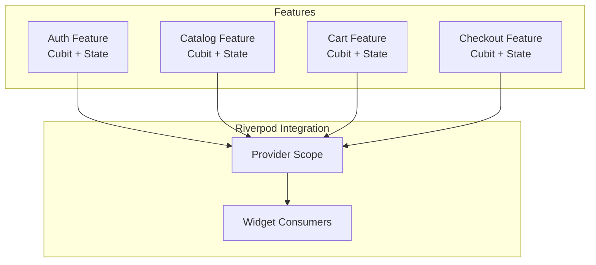
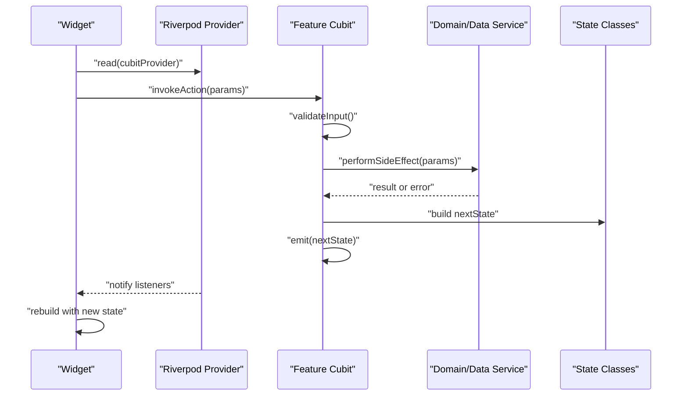
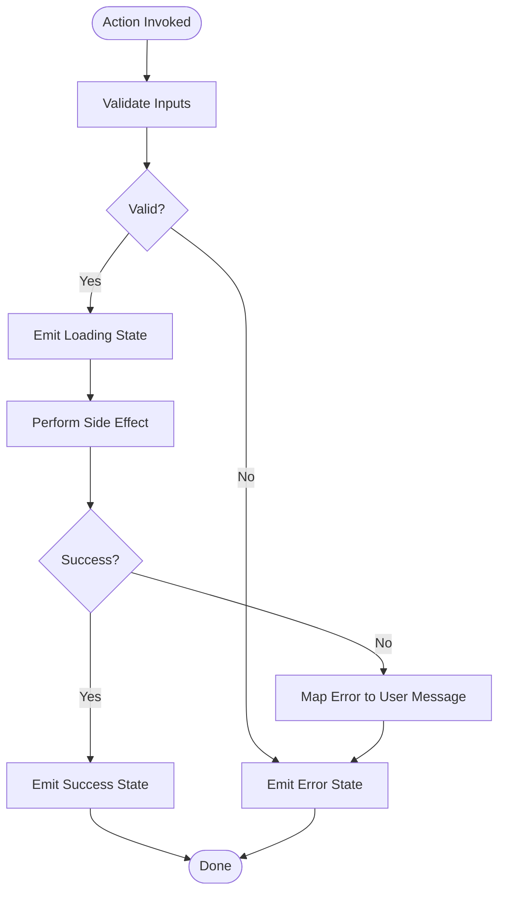
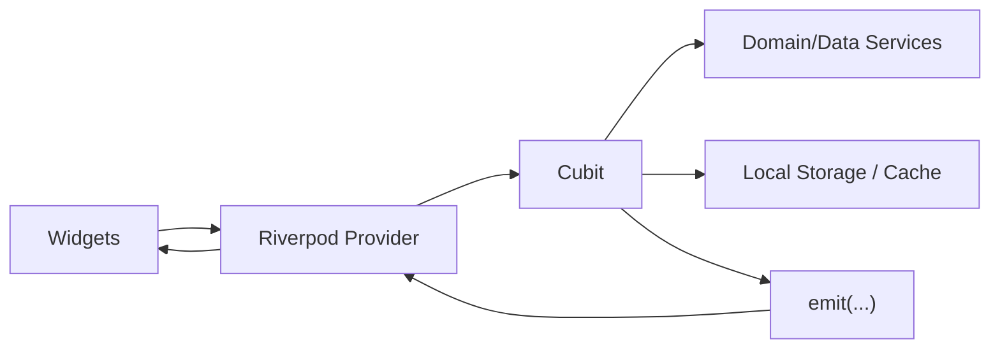

# Cubit Pattern Fundamentals

<cite>
**Referenced Files in This Document**
- [lib/features/auth/cubit/auth_cubit.dart](file://lib/features/auth/cubit/auth_cubit.dart)
- [lib/features/auth/state/auth_state.dart](file://lib/features/auth/state/auth_state.dart)
- [lib/features/catalog/cubit/catalog_cubit.dart](file://lib/features/catalog/cubit/catalog_cubit.dart)
- [lib/features/catalog/state/catalog_state.dart](file://lib/features/catalog/state/catalog_state.dart)
- [lib/features/cart/cubit/cart_cubit.dart](file://lib/features/cart/cubit/cart_cubit.dart)
- [lib/features/cart/state/cart_state.dart](file://lib/features/cart/state/cart_state.dart)
- [lib/features/checkout/cubit/checkout_cubit.dart](file://lib/features/checkout/cubit/checkout_cubit.dart)
- [lib/features/checkout/state/checkout_state.dart](file://lib/features/checkout/state/checkout_state.dart)
- [test/cart_cubit_test.dart](file://test/cart_cubit_test.dart)
- [test/catalog_cubit_test.dart](file://test/catalog_cubit_test.dart)
- [test/orders_cubit_test.dart](file://test/orders_cubit_test.dart)
- [test/settings_cubit_test.dart](file://test/settings_cubit_test.dart)
</cite>

## Table of Contents
1. [Introduction](#introduction)
2. [Project Structure](#project-structure)
3. [Core Components](#core-components)
4. [Architecture Overview](#architecture-overview)
5. [Detailed Component Analysis](#detailed-component-analysis)
6. [Dependency Analysis](#dependency-analysis)
7. [Performance Considerations](#performance-considerations)
8. [Troubleshooting Guide](#troubleshooting-guide)
9. [Conclusion](#conclusion)
10. [Appendices](#appendices)

## Introduction
This document explains the Cubit pattern fundamentals as implemented in the Albatal Store application using Riverpod’s Cubit integration. It covers state class design, emit patterns, lifecycle management, and project-specific conventions across auth, catalog, cart, and checkout features. The goal is to provide a practical guide for creating new Cubits, managing complex state hierarchies, and maintaining predictable state transitions with robust error handling.

## Project Structure
The app organizes feature-based state management under lib/features/<feature>/cubit and lib/features/<feature>/state. Each feature typically exposes:
- A Cubit class that encapsulates business logic and emits state changes
- One or more state classes representing immutable snapshots of UI state
- Tests validating behavior and state transitions

[No sources needed since this diagram shows conceptual workflow, not actual code structure]

## Core Components
At a high level, each feature follows a consistent structure:
- State classes define the shape of UI state and are immutable. They often extend a base state or implement equality/hashCode properly.
- Cubit classes expose methods that perform actions and call emit(...) to transition to new states.
- Providers wrap Cubits so widgets can consume them via Riverpod.

Key responsibilities:
- State classes: represent read-only snapshots; include loading, success, and error variants where applicable.
- Cubits: handle side effects (network calls, validations), update local state, and emit new states.
- Error handling: map domain/data errors into user-friendly states and ensure recoverability.

Examples by feature:
- Auth: manages authentication status, user profile presence, and login/logout flows.
- Catalog: handles product listing, filtering, pagination, and search results.
- Cart: maintains items, quantities, totals, and persistence interactions.
- Checkout: orchestrates address selection, payment initiation, and order confirmation.

**Section sources**
- [lib/features/auth/cubit/auth_cubit.dart](file://lib/features/auth/cubit/auth_cubit.dart)
- [lib/features/auth/state/auth_state.dart](file://lib/features/auth/state/auth_state.dart)
- [lib/features/catalog/cubit/catalog_cubit.dart](file://lib/features/catalog/cubit/catalog_cubit.dart)
- [lib/features/catalog/state/catalog_state.dart](file://lib/features/catalog/state/catalog_state.dart)
- [lib/features/cart/cubit/cart_cubit.dart](file://lib/features/cart/cubit/cart_cubit.dart)
- [lib/features/cart/state/cart_state.dart](file://lib/features/cart/state/cart_state.dart)
- [lib/features/checkout/cubit/checkout_cubit.dart](file://lib/features/checkout/cubit/checkout_cubit.dart)
- [lib/features/checkout/state/checkout_state.dart](file://lib/features/checkout/state/checkout_state.dart)

## Architecture Overview
The following sequence illustrates a typical action flow in a Cubit-driven feature:

[No sources needed since this diagram shows conceptual workflow, not actual code structure]

## Detailed Component Analysis

### Auth Cubit
Responsibilities:
- Manage authentication status and user profile presence
- Handle login, logout, and session restoration
- Emit states reflecting loading, authenticated, unauthenticated, and error conditions

State design conventions:
- Use distinct states for loading vs. success vs. error
- Keep user data minimal and immutable within state
- Include explicit fields for error messages when necessary

Emit patterns:
- Transition from initial to loading before async operations
- Emit success state on completion
- Emit error state with actionable messages on failure

Lifecycle considerations:
- Restore session on initialization if supported
- Clear sensitive data on logout

Error handling:
- Map network and validation errors to user-facing messages
- Ensure idempotent retries where appropriate

**Section sources**
- [lib/features/auth/cubit/auth_cubit.dart](file://lib/features/auth/cubit/auth_cubit.dart)
- [lib/features/auth/state/auth_state.dart](file://lib/features/auth/state/auth_state.dart)

### Catalog Cubit
Responsibilities:
- Fetch and cache product listings
- Support filtering, sorting, and pagination
- Manage search queries and result sets

State design conventions:
- Separate lists from metadata (e.g., page info, total count)
- Represent empty, loading, loaded, and error scenarios explicitly

Emit patterns:
- Emit loading state while fetching
- Emit loaded state with updated list and metadata
- Emit error state with retry guidance

Complexity tips:
- Normalize IDs to avoid duplicates
- Debounce search inputs at the UI layer to reduce emissions

**Section sources**
- [lib/features/catalog/cubit/catalog_cubit.dart](file://lib/features/catalog/cubit/catalog_cubit.dart)
- [lib/features/catalog/state/catalog_state.dart](file://lib/features/catalog/state/catalog_state.dart)

### Cart Cubit
Responsibilities:
- Maintain cart items, quantities, and totals
- Persist cart across sessions
- Apply promotions or discounts if applicable

State design conventions:
- Keep item collections immutable; replace entire lists on updates
- Compute derived values (totals) consistently

Emit patterns:
- Emit incremental updates for add/remove/quantity changes
- Emit full recompute after bulk operations

Persistence:
- Sync with storage on critical mutations
- Handle conflicts gracefully

**Section sources**
- [lib/features/cart/cubit/cart_cubit.dart](file://lib/features/cart/cubit/cart_cubit.dart)
- [lib/features/cart/state/cart_state.dart](file://lib/features/cart/state/cart_state.dart)

### Checkout Cubit
Responsibilities:
- Orchestrate multi-step checkout: address selection, payment initiation, confirmation
- Coordinate with external services (e.g., payments)
- Provide clear feedback during long-running operations

State design conventions:
- Model steps as state variants or step identifiers
- Capture partial progress and errors per step

Emit patterns:
- Emit step-specific loading states
- Emit success only after final confirmation
- Emit actionable errors for recovery

Idempotency:
- Guard against duplicate submissions
- Track request identifiers for safe retries

**Section sources**
- [lib/features/checkout/cubit/checkout_cubit.dart](file://lib/features/checkout/cubit/checkout_cubit.dart)
- [lib/features/checkout/state/checkout_state.dart](file://lib/features/checkout/state/checkout_state.dart)

### Conceptual Overview
The following flowchart summarizes best practices for emitting state transitions safely:

[No sources needed since this diagram shows conceptual workflow, not actual code structure]

## Dependency Analysis
Cubits depend on providers for lifecycle and consumption, and on domain/data services for side effects. Widgets subscribe via Riverpod to react to state changes.

[No sources needed since this diagram shows conceptual workflow, not actual code structure]

## Performance Considerations
- Prefer fine-grained state slices to minimize rebuilds
- Avoid heavy computations inside emit; precompute derived data in state constructors
- Debounce frequent actions (e.g., search) at the UI layer
- Use immutable updates to enable efficient diffing
- Batch related updates to reduce emission frequency

[No sources needed since this section provides general guidance]

## Troubleshooting Guide
Common issues and resolutions:
- Missing loading states: ensure every async operation emits a loading state before starting
- Non-deterministic UI: verify state immutability and proper equality semantics
- Duplicate side effects: guard against concurrent invocations and use idempotency keys
- Unhandled exceptions: always catch and map errors to user-friendly states
- Stale data: refresh or invalidate caches on relevant actions

Testing strategies:
- Assert emitted states for each action path
- Mock services to isolate Cubit logic
- Verify error mapping and recovery flows

**Section sources**
- [test/cart_cubit_test.dart](file://test/cart_cubit_test.dart)
- [test/catalog_cubit_test.dart](file://test/catalog_cubit_test.dart)
- [test/orders_cubit_test.dart](file://test/orders_cubit_test.dart)
- [test/settings_cubit_test.dart](file://test/settings_cubit_test.dart)

## Conclusion
Adhering to the Cubit pattern in Albatal Store ensures predictable state transitions, clear separation of concerns, and testable business logic. By designing immutable state classes, emitting explicit transitions, and handling errors consistently, teams can maintain scalable and reliable features across auth, catalog, cart, and checkout domains.

## Appendices

### Guidelines for Creating New Cubits
- Create a dedicated cubit and state folder under the feature directory
- Define one or more state classes representing all possible UI states
- Implement methods that validate inputs, perform side effects, and emit new states
- Wrap the Cubit in a provider for widget consumption
- Write tests covering success, error, and edge cases

### Naming Conventions
- Cubit files: <feature>_cubit.dart
- State files: <feature>_state.dart
- State classes: <Feature>State, <Feature>LoadingState, <Feature>ErrorState
- Methods: verb-based names describing the action (e.g., loadProducts, addToCart)

### Managing Complex State Hierarchies
- Compose smaller state objects instead of monolithic models
- Use sealed-like structures to enumerate mutually exclusive states
- Centralize derived computations in state constructors or helper functions

### Best Practices for Predictable Transitions
- Always emit a loading state before async work
- Never mutate existing state; create new instances
- Map low-level errors to actionable messages
- Keep Cubits free of UI logic; focus on state transitions

[No sources needed since this section provides general guidance]