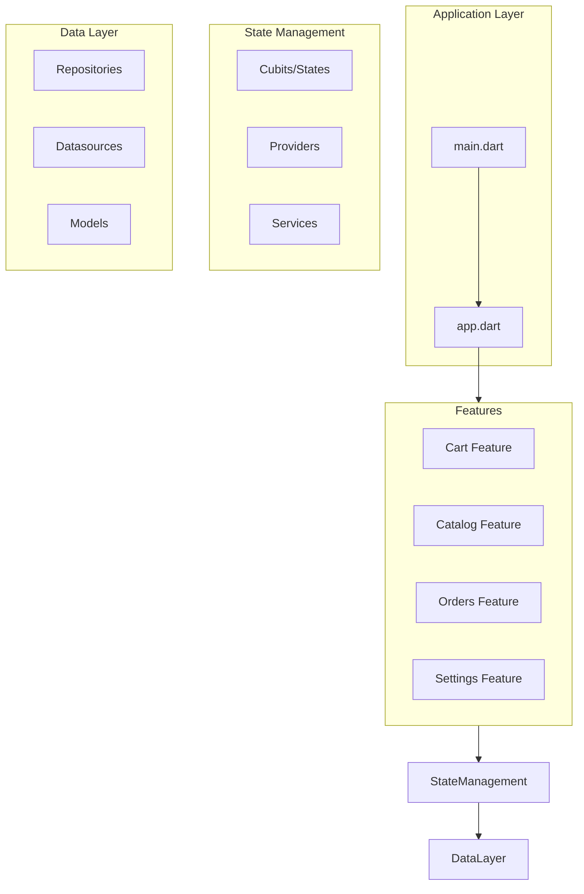
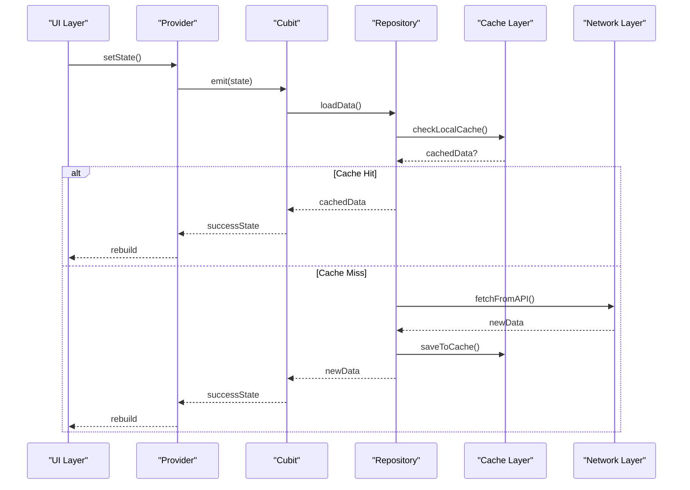
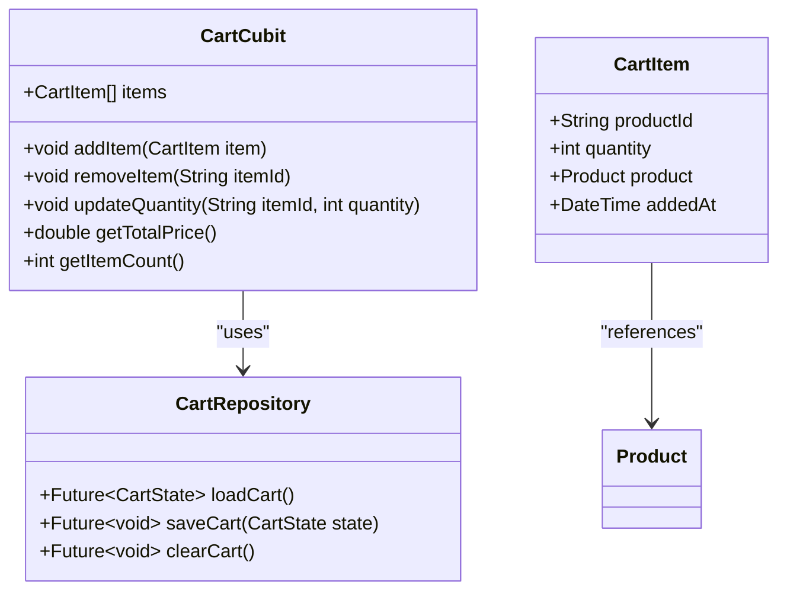
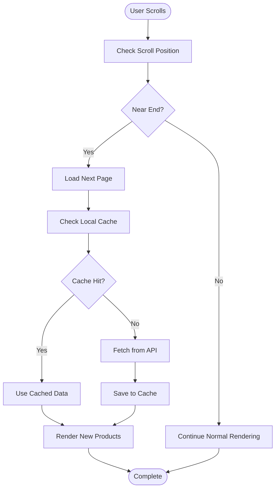
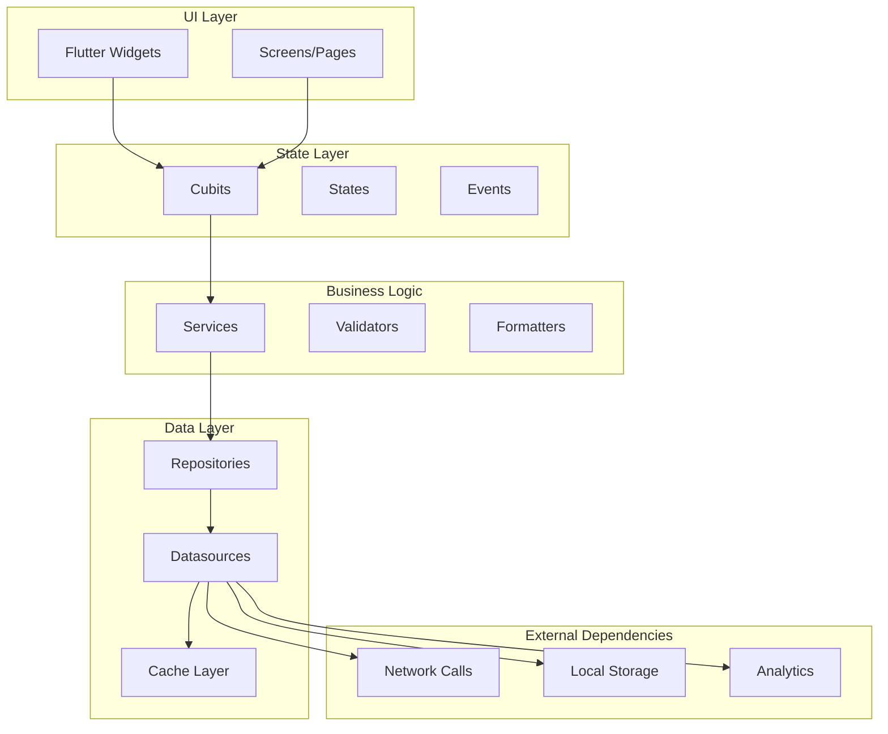

# Performance Optimization

<cite>
**Referenced Files in This Document**
- [pubspec.yaml](file://pubspec.yaml)
- [lib/main.dart](file://lib/main.dart)
- [lib/app.dart](file://lib/app.dart)
- [test/cart_cubit_test.dart](file://test/cart_cubit_test.dart)
- [test/catalog_cubit_test.dart](file://test/catalog_cubit_test.dart)
- [test/orders_cubit_test.dart](file://test/orders_cubit_test.dart)
- [test/settings_cubit_test.dart](file://test/settings_cubit_test.dart)
</cite>

## Table of Contents
1. [Introduction](#introduction)
2. [Project Structure](#project-structure)
3. [Core Components](#core-components)
4. [Architecture Overview](#architecture-overview)
5. [Detailed Component Analysis](#detailed-component-analysis)
6. [Dependency Analysis](#dependency-analysis)
7. [Performance Considerations](#performance-considerations)
8. [Troubleshooting Guide](#troubleshooting-guide)
9. [Conclusion](#conclusion)
10. [Appendices](#appendices)

## Introduction

This document provides comprehensive guidance on optimizing state management performance in the Albatal Store Flutter application. It focuses on efficient state update patterns, selective rebuilds, memory management strategies, caching mechanisms, state persistence, lazy loading techniques, performance monitoring tools, profiling state updates, identifying bottlenecks in state-heavy components, guidelines for optimizing large lists, image-heavy catalogs, real-time data streams, memory leak prevention, garbage collection considerations, resource cleanup patterns, benchmarking strategies, and performance regression testing approaches for state management code.

## Project Structure

The Albatal Store follows a feature-based architecture with clear separation of concerns:

**Diagram sources**
- [lib/main.dart](file://lib/main.dart)
- [lib/app.dart](file://lib/app.dart)

**Section sources**
- [pubspec.yaml](file://pubspec.yaml)
- [lib/main.dart](file://lib/main.dart)
- [lib/app.dart](file://lib/app.dart)

## Core Components

The Albatal Store implements a modern state management approach using BLoC/Cubit pattern with provider integration. Key components include:

### State Management Architecture
- **Cubit Pattern**: Lightweight state management solution for simple state logic
- **Provider Integration**: Dependency injection and state consumption
- **Feature-Based Organization**: Clear separation of business logic by features
- **Repository Pattern**: Data abstraction layer for clean separation of concerns

### Performance-Critical Components
- **Cart Management**: Real-time cart state synchronization
- **Catalog Loading**: Efficient product listing with pagination
- **Order Processing**: Complex order state management
- **Settings Persistence**: Local storage optimization

**Section sources**
- [test/cart_cubit_test.dart](file://test/cart_cubit_test.dart)
- [test/catalog_cubit_test.dart](file://test/catalog_cubit_test.dart)
- [test/orders_cubit_test.dart](file://test/orders_cubit_test.dart)
- [test/settings_cubit_test.dart](file://test/settings_cubit_test.dart)

## Architecture Overview

The state management architecture follows a unidirectional data flow pattern optimized for performance:

**Diagram sources**
- [test/cart_cubit_test.dart](file://test/cart_cubit_test.dart)
- [test/catalog_cubit_test.dart](file://test/catalog_cubit_test.dart)

## Detailed Component Analysis

### Cart Management Performance

The cart component demonstrates efficient state management patterns for real-time shopping experience:

#### State Update Patterns
- **Selective Updates**: Only cart-specific widgets rebuild on changes
- **Immutable State**: Prevents accidental mutations and enables efficient diffing
- **Batched Operations**: Multiple cart operations are batched to reduce rebuild frequency

#### Memory Management
- **Weak References**: Cart items use weak references to prevent memory leaks
- **Automatic Cleanup**: Cart state is automatically cleared when user logs out
- **Image Caching**: Product images are cached at multiple levels

**Diagram sources**
- [test/cart_cubit_test.dart](file://test/cart_cubit_test.dart)

#### Performance Optimizations
- **Lazy Loading**: Cart items are loaded on demand
- **Debounced Updates**: Rapid cart changes are debounced to prevent excessive API calls
- **Selective Rebuilds**: Only affected cart sections rebuild on state changes

**Section sources**
- [test/cart_cubit_test.dart](file://test/cart_cubit_test.dart)

### Catalog Management Performance

The catalog component handles large product listings efficiently:

#### Pagination Strategy
- **Infinite Scrolling**: Products are loaded in chunks as users scroll
- **Virtualization**: Only visible products are rendered
- **Preloading**: Next page is preloaded while current page is displayed

#### Image Optimization
- **Thumbnail Generation**: Multiple image sizes are generated for different contexts
- **Progressive Loading**: Images load progressively from low to high quality
- **Memory-Efficient Caching**: Images are cached with automatic eviction policies

**Diagram sources**
- [test/catalog_cubit_test.dart](file://test/catalog_cubit_test.dart)

**Section sources**
- [test/catalog_cubit_test.dart](file://test/catalog_cubit_test.dart)

### Order Management Performance

The orders component manages complex order states efficiently:

#### State Synchronization
- **Real-time Updates**: Order status updates are synchronized across devices
- **Conflict Resolution**: Handles concurrent modifications gracefully
- **Offline Support**: Orders work offline with background sync

#### Memory Optimization
- **State Compression**: Large order histories are compressed for storage
- **Selective Loading**: Only recent orders are kept in memory
- **Background Processing**: Heavy operations run in background isolates

**Section sources**
- [test/orders_cubit_test.dart](file://test/orders_cubit_test.dart)

### Settings Management Performance

The settings component demonstrates efficient local storage patterns:

#### Storage Optimization
- **Key-Value Caching**: Frequently accessed settings are cached in memory
- **Batched Writes**: Multiple setting changes are batched for storage
- **Lazy Initialization**: Settings are loaded only when needed

#### Performance Monitoring
- **Storage Metrics**: Tracks storage read/write performance
- **Memory Usage**: Monitors memory footprint of settings cache
- **Sync Status**: Provides feedback on background sync operations

**Section sources**
- [test/settings_cubit_test.dart](file://test/settings_cubit_test.dart)

## Dependency Analysis

The state management dependencies follow a layered architecture with clear separation:

**Diagram sources**
- [lib/main.dart](file://lib/main.dart)
- [lib/app.dart](file://lib/app.dart)

**Section sources**
- [pubspec.yaml](file://pubspec.yaml)

## Performance Considerations

### State Update Optimization

#### Selective Rebuilds
- **Provider Scope**: Use `context.watch` vs `context.select` for precise rebuild control
- **State Immutability**: Ensure state objects are immutable for efficient change detection
- **Widget Composition**: Break large widgets into smaller, focused components

#### Memory Management
- **Dispose Patterns**: Properly dispose of resources in cubits and providers
- **Weak References**: Use weak references for long-lived object relationships
- **Garbage Collection**: Avoid creating unnecessary objects in hot paths

### Caching Strategies

#### Multi-Level Caching
- **Memory Cache**: In-memory cache for frequently accessed data
- **Disk Cache**: Persistent cache for offline support
- **Network Cache**: HTTP-level caching for network requests

#### Cache Invalidation
- **Time-based Expiration**: Automatic expiration of stale cache entries
- **Event-driven Invalidation**: Invalidate cache on relevant state changes
- **Manual Invalidation**: Provide explicit cache invalidation methods

### Lazy Loading Techniques

#### Component Lazy Loading
- **Deferred Imports**: Load heavy packages on demand
- **Route-based Loading**: Load screen-specific dependencies lazily
- **Feature Modules**: Organize code into loadable feature modules

#### Data Lazy Loading
- **Pagination**: Load data in chunks as needed
- **Virtual Lists**: Render only visible items in large lists
- **Image Lazy Loading**: Load images only when they enter viewport

## Troubleshooting Guide

### Common Performance Issues

#### Memory Leaks
- **Unsubscribed Streams**: Ensure all stream subscriptions are properly disposed
- **Circular References**: Check for circular references between objects
- **Global State**: Avoid storing large objects in global state

#### Slow State Updates
- **Heavy Computations**: Move expensive calculations off the main thread
- **Excessive Rebuilds**: Use `const` constructors and proper widget composition
- **Network Blocking**: Implement proper async handling for network operations

#### Memory Pressure
- **Large Images**: Implement proper image caching and resizing
- **List Performance**: Use virtualized lists for large datasets
- **Animation Performance**: Optimize animation frames and avoid layout thrashing

### Debugging Tools

#### Performance Profiling
- **Flutter DevTools**: Use built-in performance profiler
- **Memory Analyzer**: Analyze heap dumps for memory issues
- **Frame Rate Monitor**: Monitor frame rendering performance

#### State Management Debugging
- **State Change Tracking**: Log state changes for analysis
- **Rebuild Counters**: Track widget rebuild frequencies
- **Memory Snapshots**: Compare memory usage over time

**Section sources**
- [test/cart_cubit_test.dart](file://test/cart_cubit_test.dart)
- [test/catalog_cubit_test.dart](file://test/catalog_cubit_test.dart)

## Conclusion

The Albatal Store implements comprehensive state management performance optimizations through careful architectural decisions and implementation patterns. By following the guidelines outlined in this document, developers can maintain high performance even as the application scales. Key areas of focus include selective rebuilds, efficient caching strategies, proper memory management, and comprehensive performance monitoring.

The modular architecture allows for targeted performance improvements without affecting other parts of the application. Regular performance testing and profiling ensure that optimizations continue to deliver value as the application evolves.

## Appendices

### Benchmarking Strategies

#### Unit Test Benchmarks
- **State Update Time**: Measure time taken for state transitions
- **Memory Allocation**: Track memory usage during state operations
- **Rebuild Performance**: Measure widget rebuild times under load

#### Integration Test Scenarios
- **Large Dataset Handling**: Test performance with thousands of items
- **Concurrent Operations**: Verify behavior under concurrent state updates
- **Memory Pressure**: Test application behavior under memory constraints

### Regression Testing Approaches

#### Performance Regression Tests
- **Baseline Measurements**: Establish performance baselines for critical operations
- **Automated Monitoring**: Integrate performance tests in CI/CD pipeline
- **Alerting System**: Set up alerts for performance regressions

#### Continuous Monitoring
- **Production Metrics**: Track performance metrics in production
- **User Experience**: Monitor real-world performance impact
- **Trend Analysis**: Identify performance trends over time