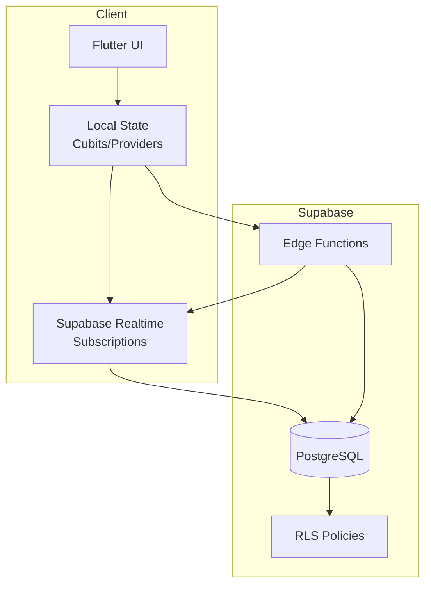
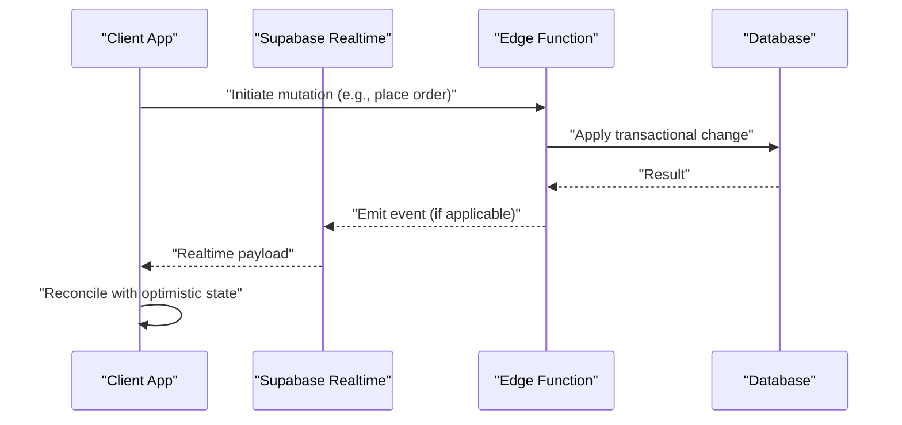
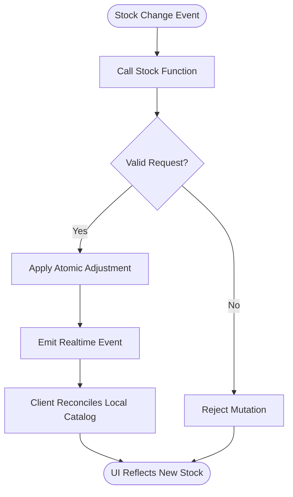
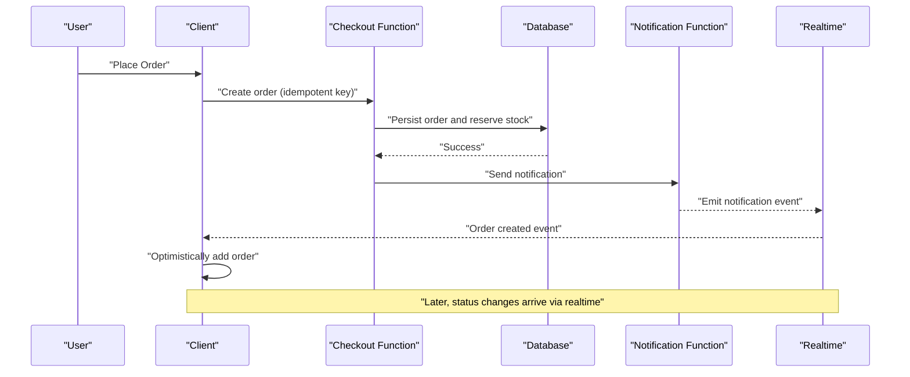
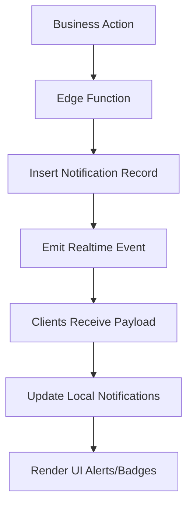
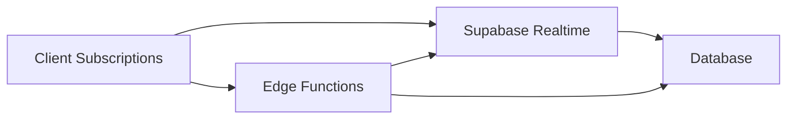

# Reactive Updates Patterns

<cite>
**Referenced Files in This Document**
- [supabase-integration.md](file://docs/supabase-integration.md)
- [001_initial_schema.sql](file://supabase/migrations/001_initial_schema.sql)
- [004_stock_function.sql](file://supabase/migrations/004_stock_function.sql)
- [007_stock_increment_function.sql](file://supabase/migrations/007_stock_increment_function.sql)
- [008_order_fulfillment.sql](file://supabase/migrations/008_order_fulfillment.sql)
- [010_notifications_analytics.sql](file://supabase/migrations/010_notifications_analytics.sql)
- [011_orders_idempotency_and_expiry.sql](file://supabase/migrations/011_orders_idempotency_and_expiry.sql)
- [cancel-expired-orders/index.ts](file://supabase/functions/cancel-expired-orders/index.ts)
- [checkout/index.ts](file://supabase/functions/checkout/index.ts)
- [send-order-notification/index.ts](file://supabase/functions/send-order-notification/index.ts)
</cite>

## Table of Contents
1. [Introduction](#introduction)
2. [Project Structure](#project-structure)
3. [Core Components](#core-components)
4. [Architecture Overview](#architecture-overview)
5. [Detailed Component Analysis](#detailed-component-analysis)
6. [Dependency Analysis](#dependency-analysis)
7. [Performance Considerations](#performance-considerations)
8. [Troubleshooting Guide](#troubleshooting-guide)
9. [Conclusion](#conclusion)
10. [Appendices](#appendices)

## Introduction
This document explains reactive update patterns used by the Albatal Store to deliver real-time experiences with Supabase. It covers subscription management, automatic state synchronization, optimistic updates, conflict resolution, offline-first considerations, and graceful degradation when connections fail. It also details live inventory updates, order status changes, and notification systems, along with efficient state updates, batch operations, and performance optimization strategies for frequent state changes. Finally, it addresses error recovery patterns and retry mechanisms.

## Project Structure
The reactive system spans database migrations, serverless functions, and client-side state management:
- Database schema and functions define authoritative data models and safe mutations (e.g., stock adjustments, order lifecycle).
- Edge functions implement business logic and orchestrate side effects such as payments and notifications.
- Client code subscribes to real-time channels and applies updates to local state efficiently.

[No sources needed since this diagram shows conceptual workflow, not actual code structure]

## Core Components
- Real-time subscriptions: Subscribe to table-level or filtered events to receive incremental updates without polling.
- Optimistic updates: Immediately reflect user actions in local state; reconcile with server on success or rollback on failure.
- Conflict resolution: Use deterministic server-side functions and idempotency keys to avoid double-processing and ensure consistency.
- Offline-first: Persist pending mutations locally and replay them when connectivity is restored.
- Batch operations: Coalesce multiple rapid updates into a single reconciliation pass to reduce UI churn.

Key implementation anchors:
- Inventory and stock adjustments are enforced via dedicated SQL functions to prevent race conditions.
- Order fulfillment and expiration are coordinated through scheduled functions and triggers.
- Notifications are emitted via edge functions and delivered through real-time channels.

**Section sources**
- [004_stock_function.sql](file://supabase/migrations/004_stock_function.sql)
- [007_stock_increment_function.sql](file://supabase/migrations/007_stock_increment_function.sql)
- [008_order_fulfillment.sql](file://supabase/migrations/008_order_fulfillment.sql)
- [011_orders_idempotency_and_expiry.sql](file://supabase/migrations/011_orders_idempotency_and_expiry.sql)
- [010_notifications_analytics.sql](file://supabase/migrations/010_notifications_analytics.sql)
- [checkout/index.ts](file://supabase/functions/checkout/index.ts)
- [send-order-notification/index.ts](file://supabase/functions/send-order-notification/index.ts)
- [cancel-expired-orders/index.ts](file://supabase/functions/cancel-expired-orders/index.ts)

## Architecture Overview
The reactive architecture combines Supabase Realtime with server-side guarantees:
- Clients subscribe to relevant tables or queries.
- Serverless functions perform validated mutations and emit events.
- Database constraints and functions enforce correctness and atomicity.
- The client reconciles optimistic changes with authoritative server state.

**Diagram sources**
- [checkout/index.ts](file://supabase/functions/checkout/index.ts)
- [send-order-notification/index.ts](file://supabase/functions/send-order-notification/index.ts)
- [008_order_fulfillment.sql](file://supabase/migrations/008_order_fulfillment.sql)

## Detailed Component Analysis

### Live Inventory Updates
Inventory is updated safely using server-side functions that adjust stock atomically. Clients subscribe to product or stock-related events and apply deltas to local catalogs.

**Diagram sources**
- [004_stock_function.sql](file://supabase/migrations/004_stock_function.sql)
- [007_stock_increment_function.sql](file://supabase/migrations/007_stock_increment_function.sql)

**Section sources**
- [004_stock_function.sql](file://supabase/migrations/004_stock_function.sql)
- [007_stock_increment_function.sql](file://supabase/migrations/007_stock_increment_function.sql)

### Order Status Changes
Order lifecycle transitions are governed by server-side logic and idempotency controls. Clients subscribe to order events and update their local orders list accordingly.

**Diagram sources**
- [checkout/index.ts](file://supabase/functions/checkout/index.ts)
- [send-order-notification/index.ts](file://supabase/functions/send-order-notification/index.ts)
- [011_orders_idempotency_and_expiry.sql](file://supabase/migrations/011_orders_idempotency_and_expiry.sql)

**Section sources**
- [008_order_fulfillment.sql](file://supabase/migrations/008_order_fulfillment.sql)
- [011_orders_idempotency_and_expiry.sql](file://supabase/migrations/011_orders_idempotency_and_expiry.sql)
- [checkout/index.ts](file://supabase/functions/checkout/index.ts)
- [send-order-notification/index.ts](file://supabase/functions/send-order-notification/index.ts)

### Notification System
Notifications are produced by edge functions and distributed via real-time channels. Clients subscribe to notification topics and render alerts or badges.

**Diagram sources**
- [010_notifications_analytics.sql](file://supabase/migrations/010_notifications_analytics.sql)
- [send-order-notification/index.ts](file://supabase/functions/send-order-notification/index.ts)

**Section sources**
- [010_notifications_analytics.sql](file://supabase/migrations/010_notifications_analytics.sql)
- [send-order-notification/index.ts](file://supabase/functions/send-order-notification/index.ts)

### Subscription Management and Automatic State Synchronization
- Subscribe to specific tables or filtered queries to minimize bandwidth.
- Maintain a single subscription per resource type and scope to avoid duplicates.
- On connection loss, auto-reconnect and rehydrate from persisted cache.
- Apply incoming events as patches rather than full refreshes where possible.

Best practices:
- Debounce high-frequency events before UI updates.
- Merge overlapping updates within a microtask window.
- Use versioned entities to detect and resolve conflicts deterministically.

**Section sources**
- [supabase-integration.md](file://docs/supabase-integration.md)

### Optimistic Updates and Conflict Resolution
- Immediately reflect intended changes in local state.
- Attach an idempotency key to mutations to prevent duplicate processing.
- On server rejection, roll back local state and surface actionable errors.
- Prefer server-side functions for critical adjustments (e.g., stock decrements) to guarantee consistency.

Conflict resolution strategies:
- Last-writer-wins with vector clocks or timestamps for non-critical fields.
- Deterministic merge rules for structured objects (e.g., cart items).
- Server-authoritative reconciliation after transient failures.

**Section sources**
- [011_orders_idempotency_and_expiry.sql](file://supabase/migrations/011_orders_idempotency_and_expiry.sql)
- [004_stock_function.sql](file://supabase/migrations/004_stock_function.sql)

### Offline-First Considerations
- Persist pending mutations locally with metadata (timestamp, idempotency key).
- Queue and replay mutations upon reconnection.
- Show offline indicators and allow limited functionality while disconnected.
- Periodic reconciliation to align local state with server truth.

**Section sources**
- [supabase-integration.md](file://docs/supabase-integration.md)

### Efficient State Updates and Batch Operations
- Coalesce rapid updates into batches to reduce rebuilds.
- Use immutable updates with structural sharing to minimize diffing cost.
- Avoid unnecessary widget rebuilds by scoping state changes.
- For large datasets, paginate and virtualize lists.

**Section sources**
- [supabase-integration.md](file://docs/supabase-integration.md)

### Error Recovery, Retry Mechanisms, and Graceful Degradation
- Implement exponential backoff with jitter for retries.
- Distinguish between transient and permanent errors; skip retries for the latter.
- Provide fallback UI states (e.g., cached view, “retry” action).
- Monitor connection health and trigger manual reconnect flows when needed.

**Section sources**
- [supabase-integration.md](file://docs/supabase-integration.md)

## Dependency Analysis
The reactive pipeline depends on well-defined contracts between client, functions, and database:
- Client relies on predictable event shapes and consistent ordering.
- Edge functions encapsulate business rules and side effects.
- Database enforces integrity via constraints and functions.

**Diagram sources**
- [checkout/index.ts](file://supabase/functions/checkout/index.ts)
- [send-order-notification/index.ts](file://supabase/functions/send-order-notification/index.ts)
- [001_initial_schema.sql](file://supabase/migrations/001_initial_schema.sql)

**Section sources**
- [001_initial_schema.sql](file://supabase/migrations/001_initial_schema.sql)
- [supabase-integration.md](file://docs/supabase-integration.md)

## Performance Considerations
- Prefer targeted subscriptions over broad table listeners.
- Throttle and debounce UI updates for high-frequency events.
- Use server-side filtering and projections to reduce payload size.
- Cache frequently accessed read-only data and invalidate selectively.
- Profile network usage and memory footprint under sustained real-time load.

[No sources needed since this section provides general guidance]

## Troubleshooting Guide
Common issues and resolutions:
- Duplicate mutations: Ensure idempotency keys are present and unique per attempt.
- Stale UI: Verify subscription filters match current query parameters.
- Missed events: Implement periodic reconciliation and watermark tracking.
- High CPU/memory: Reduce rebuild scope and coalesce updates.

Operational checks:
- Inspect function logs for failed transactions or policy denials.
- Validate RLS policies for real-time access.
- Confirm migration versions match deployed schema.

**Section sources**
- [011_orders_idempotency_and_expiry.sql](file://supabase/migrations/011_orders_idempotency_and_expiry.sql)
- [supabase-integration.md](file://docs/supabase-integration.md)

## Conclusion
By combining Supabase Realtime with robust server-side functions and careful client-side state management, the Albatal Store achieves responsive, consistent, and resilient user experiences. Optimistic updates improve perceived performance, while deterministic reconciliation ensures correctness. With thoughtful batching, caching, and error handling, the system scales gracefully under frequent updates and intermittent connectivity.

[No sources needed since this section summarizes without analyzing specific files]

## Appendices

### Key Migrations and Functions
- Initial schema defines core entities and relationships.
- Stock functions provide safe, atomic adjustments.
- Order fulfillment and idempotency migrations protect against race conditions and expired orders.
- Notifications schema supports analytics and delivery.

**Section sources**
- [001_initial_schema.sql](file://supabase/migrations/001_initial_schema.sql)
- [004_stock_function.sql](file://supabase/migrations/004_stock_function.sql)
- [007_stock_increment_function.sql](file://supabase/migrations/007_stock_increment_function.sql)
- [008_order_fulfillment.sql](file://supabase/migrations/008_order_fulfillment.sql)
- [010_notifications_analytics.sql](file://supabase/migrations/010_notifications_analytics.sql)
- [011_orders_idempotency_and_expiry.sql](file://supabase/migrations/011_orders_idempotency_and_expiry.sql)

### Edge Functions
- Checkout orchestrates order creation and payment flow.
- Send order notification emits events for clients.
- Cancel expired orders runs periodically to maintain data integrity.

**Section sources**
- [checkout/index.ts](file://supabase/functions/checkout/index.ts)
- [send-order-notification/index.ts](file://supabase/functions/send-order-notification/index.ts)
- [cancel-expired-orders/index.ts](file://supabase/functions/cancel-expired-orders/index.ts)