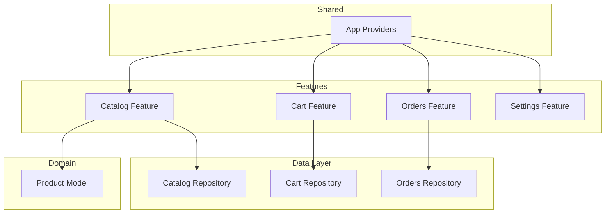
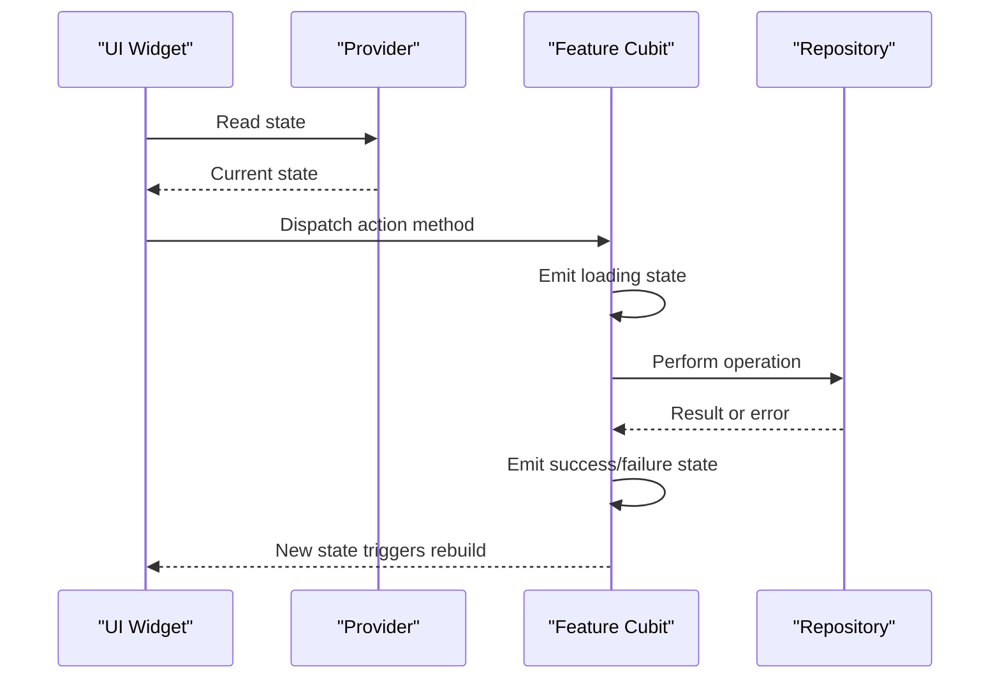
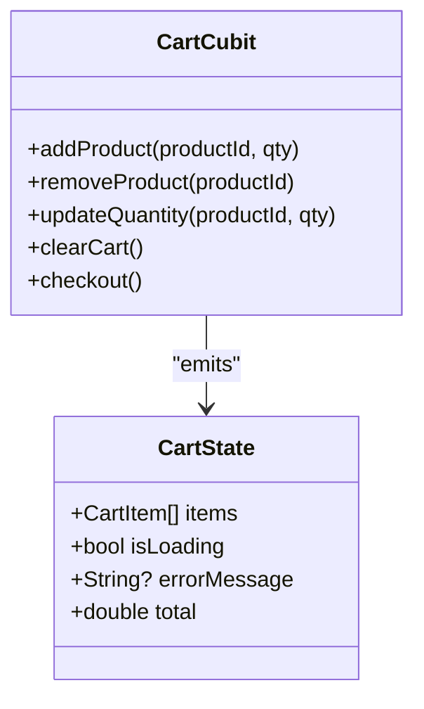
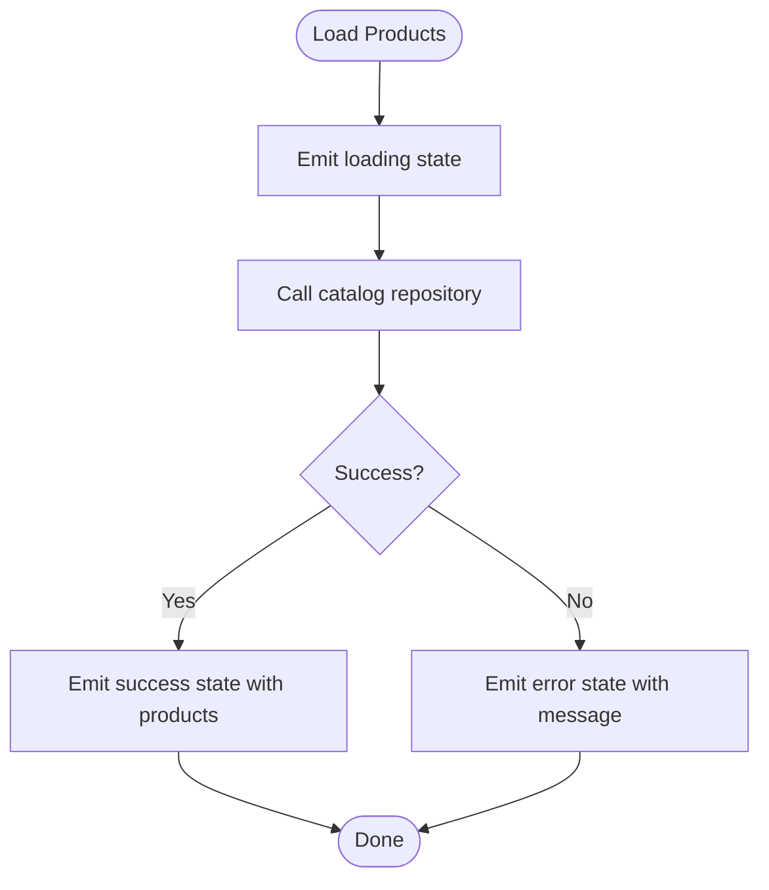
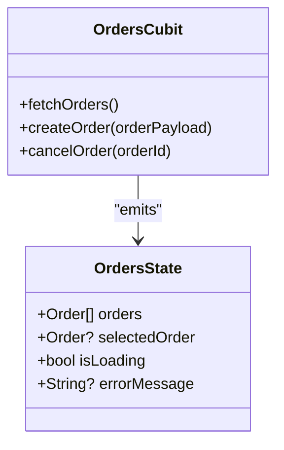
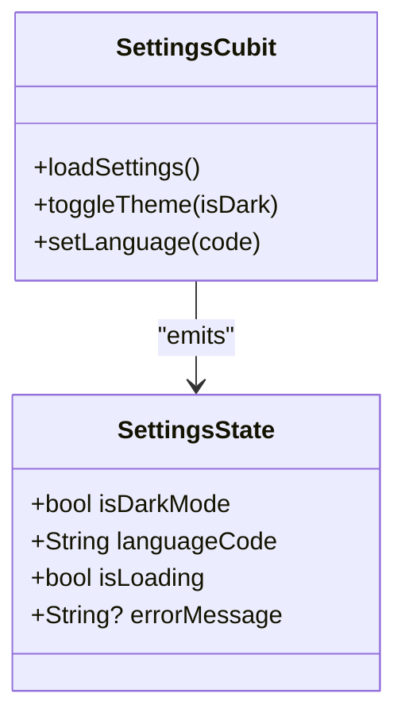
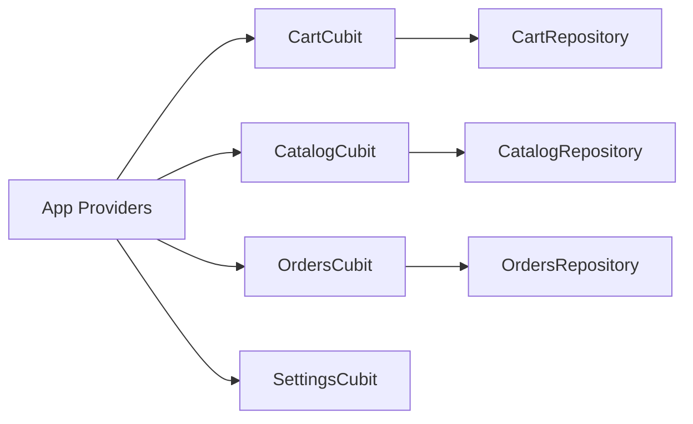

# State Management

<cite>
**Referenced Files in This Document**
- [lib/features/cart/cubit/cart_cubit.dart](file://lib/features/cart/cubit/cart_cubit.dart)
- [lib/features/cart/state/cart_state.dart](file://lib/features/cart/state/cart_state.dart)
- [test/cart_cubit_test.dart](file://test/cart_cubit_test.dart)
- [lib/features/catalog/cubit/catalog_cubit.dart](file://lib/features/catalog/cubit/catalog_cubit.dart)
- [lib/features/catalog/state/catalog_state.dart](file://lib/features/catalog/state/catalog_state.dart)
- [test/catalog_cubit_test.dart](file://test/catalog_cubit_test.dart)
- [test/catalog_states_test.dart](file://test/catalog_states_test.dart)
- [lib/features/orders/cubit/orders_cubit.dart](file://lib/features/orders/cubit/orders_cubit.dart)
- [lib/features/orders/state/orders_state.dart](file://lib/features/orders/state/orders_state.dart)
- [test/orders_cubit_test.dart](file://test/orders_cubit_test.dart)
- [lib/features/settings/cubit/settings_cubit.dart](file://lib/features/settings/cubit/settings_cubit.dart)
- [lib/features/settings/state/settings_state.dart](file://lib/features/settings/state/settings_state.dart)
- [test/settings_cubit_test.dart](file://test/settings_cubit_test.dart)
- [lib/shared/providers/app_providers.dart](file://lib/shared/providers/app_providers.dart)
- [lib/core/domain/models/product_model.dart](file://lib/core/domain/models/product_model.dart)
- [lib/data/repositories/catalog_repository.dart](file://lib/data/repositories/catalog_repository.dart)
- [lib/data/repositories/cart_repository.dart](file://lib/data/repositories/cart_repository.dart)
- [lib/data/repositories/orders_repository.dart](file://lib/data/repositories/orders_repository.dart)
</cite>

## Table of Contents
1. [Introduction](#introduction)
2. [Project Structure](#project-structure)
3. [Core Components](#core-components)
4. [Architecture Overview](#architecture-overview)
5. [Detailed Component Analysis](#detailed-component-analysis)
6. [Dependency Analysis](#dependency-analysis)
7. [Performance Considerations](#performance-considerations)
8. [Troubleshooting Guide](#troubleshooting-guide)
9. [Conclusion](#conclusion)
10. [Appendices](#appendices)

## Introduction
This document explains the state management approach used across the application, focusing on the Cubit pattern for unidirectional data flow and reactive UI updates. It covers how states are modeled, how Cubits manage lifecycle and side effects, and how widgets consume state reactively. It also documents testing strategies, performance considerations, persistence patterns, synchronization techniques (including optimistic updates), and guidelines for creating new Cubits and debugging state issues.

## Project Structure
The codebase organizes state by feature. Each feature typically includes:
- A Cubit that encapsulates business logic and side effects
- A state file defining immutable state classes
- Tests validating behavior and transitions
- Providers wiring dependencies into the app

**Diagram sources**
- [lib/shared/providers/app_providers.dart](file://lib/shared/providers/app_providers.dart)
- [lib/features/cart/cubit/cart_cubit.dart](file://lib/features/cart/cubit/cart_cubit.dart)
- [lib/features/catalog/cubit/catalog_cubit.dart](file://lib/features/catalog/cubit/catalog_cubit.dart)
- [lib/features/orders/cubit/orders_cubit.dart](file://lib/features/orders/cubit/orders_cubit.dart)
- [lib/features/settings/cubit/settings_cubit.dart](file://lib/features/settings/cubit/settings_cubit.dart)
- [lib/data/repositories/catalog_repository.dart](file://lib/data/repositories/catalog_repository.dart)
- [lib/data/repositories/cart_repository.dart](file://lib/data/repositories/cart_repository.dart)
- [lib/data/repositories/orders_repository.dart](file://lib/data/repositories/orders_repository.dart)
- [lib/core/domain/models/product_model.dart](file://lib/core/domain/models/product_model.dart)

**Section sources**
- [lib/shared/providers/app_providers.dart](file://lib/shared/providers/app_providers.dart)
- [lib/features/cart/cubit/cart_cubit.dart](file://lib/features/cart/cubit/cart_cubit.dart)
- [lib/features/catalog/cubit/catalog_cubit.dart](file://lib/features/catalog/cubit/catalog_cubit.dart)
- [lib/features/orders/cubit/orders_cubit.dart](file://lib/features/orders/cubit/orders_cubit.dart)
- [lib/features/settings/cubit/settings_cubit.dart](file://lib/features/settings/cubit/settings_cubit.dart)

## Core Components
- Cubits: Encapsulate state and actions per feature. They expose methods to mutate state and handle asynchronous operations while emitting new states.
- States: Immutable representations of UI state, including loading, success, error, and domain-specific fields.
- Providers: Centralized dependency injection points that wire repositories and other services into Cubits.
- Repositories: Data access abstractions used by Cubits to fetch or persist data.

Key responsibilities:
- Cubits: Transform user interactions into state changes; coordinate with repositories; emit loading/success/error states.
- States: Provide a single source of truth for UI rendering.
- Providers: Ensure consistent instantiation and lifetime of dependencies.

**Section sources**
- [lib/features/cart/cubit/cart_cubit.dart](file://lib/features/cart/cubit/cart_cubit.dart)
- [lib/features/cart/state/cart_state.dart](file://lib/features/cart/state/cart_state.dart)
- [lib/features/catalog/cubit/catalog_cubit.dart](file://lib/features/catalog/cubit/catalog_cubit.dart)
- [lib/features/catalog/state/catalog_state.dart](file://lib/features/catalog/state/catalog_state.dart)
- [lib/features/orders/cubit/orders_cubit.dart](file://lib/features/orders/cubit/orders_cubit.dart)
- [lib/features/orders/state/orders_state.dart](file://lib/features/orders/state/orders_state.dart)
- [lib/features/settings/cubit/settings_cubit.dart](file://lib/features/settings/cubit/settings_cubit.dart)
- [lib/features/settings/state/settings_state.dart](file://lib/features/settings/state/settings_state.dart)
- [lib/shared/providers/app_providers.dart](file://lib/shared/providers/app_providers.dart)

## Architecture Overview
The application follows a unidirectional data flow:
- Widgets read state from providers/Cubits.
- User actions trigger Cubit methods.
- Cubits call repositories for I/O.
- Repositories return results; Cubits update state accordingly.
- Widgets rebuild reactively based on emitted states.

**Diagram sources**
- [lib/shared/providers/app_providers.dart](file://lib/shared/providers/app_providers.dart)
- [lib/features/catalog/cubit/catalog_cubit.dart](file://lib/features/catalog/cubit/catalog_cubit.dart)
- [lib/data/repositories/catalog_repository.dart](file://lib/data/repositories/catalog_repository.dart)

## Detailed Component Analysis

### Cart Feature
- Responsibilities: Manage cart items, quantities, totals, and checkout readiness.
- State modeling: Includes item list, counts, totals, and flags for loading and errors.
- Reactive updates: Actions like add/remove/update quantity transition states immediately and reflect in UI.

**Diagram sources**
- [lib/features/cart/cubit/cart_cubit.dart](file://lib/features/cart/cubit/cart_cubit.dart)
- [lib/features/cart/state/cart_state.dart](file://lib/features/cart/state/cart_state.dart)

**Section sources**
- [lib/features/cart/cubit/cart_cubit.dart](file://lib/features/cart/cubit/cart_cubit.dart)
- [lib/features/cart/state/cart_state.dart](file://lib/features/cart/state/cart_state.dart)
- [test/cart_cubit_test.dart](file://test/cart_cubit_test.dart)

### Catalog Feature
- Responsibilities: Fetch product listings, search/filter, and detail retrieval.
- State modeling: Contains products list, pagination info, loading flags, and error messages.
- Loading strategy: Emits loading before network calls and success/error after completion.

**Diagram sources**
- [lib/features/catalog/cubit/catalog_cubit.dart](file://lib/features/catalog/cubit/catalog_cubit.dart)
- [lib/data/repositories/catalog_repository.dart](file://lib/data/repositories/catalog_repository.dart)

**Section sources**
- [lib/features/catalog/cubit/catalog_cubit.dart](file://lib/features/catalog/cubit/catalog_cubit.dart)
- [lib/features/catalog/state/catalog_state.dart](file://lib/features/catalog/state/catalog_state.dart)
- [test/catalog_cubit_test.dart](file://test/catalog_cubit_test.dart)
- [test/catalog_states_test.dart](file://test/catalog_states_test.dart)

### Orders Feature
- Responsibilities: Retrieve order history, create orders, and track status.
- State modeling: Order list, current order details, loading, and error handling.
- Real-time considerations: Can integrate with streams for live updates if needed.

**Diagram sources**
- [lib/features/orders/cubit/orders_cubit.dart](file://lib/features/orders/cubit/orders_cubit.dart)
- [lib/features/orders/state/orders_state.dart](file://lib/features/orders/state/orders_state.dart)

**Section sources**
- [lib/features/orders/cubit/orders_cubit.dart](file://lib/features/orders/cubit/orders_cubit.dart)
- [lib/features/orders/state/orders_state.dart](file://lib/features/orders/state/orders_state.dart)
- [test/orders_cubit_test.dart](file://test/orders_cubit_test.dart)

### Settings Feature
- Responsibilities: Persist user preferences and theme settings.
- State modeling: Theme mode, language, and other toggles.
- Persistence: Reads/writes to local storage via repository or service.

**Diagram sources**
- [lib/features/settings/cubit/settings_cubit.dart](file://lib/features/settings/cubit/settings_cubit.dart)
- [lib/features/settings/state/settings_state.dart](file://lib/features/settings/state/settings_state.dart)

**Section sources**
- [lib/features/settings/cubit/settings_cubit.dart](file://lib/features/settings/cubit/settings_cubit.dart)
- [lib/features/settings/state/settings_state.dart](file://lib/features/settings/state/settings_state.dart)
- [test/settings_cubit_test.dart](file://test/settings_cubit_test.dart)

## Dependency Analysis
Providers centralize dependency injection, ensuring Cubits receive consistent repository instances. This reduces coupling and simplifies testing.

**Diagram sources**
- [lib/shared/providers/app_providers.dart](file://lib/shared/providers/app_providers.dart)
- [lib/features/cart/cubit/cart_cubit.dart](file://lib/features/cart/cubit/cart_cubit.dart)
- [lib/features/catalog/cubit/catalog_cubit.dart](file://lib/features/catalog/cubit/catalog_cubit.dart)
- [lib/features/orders/cubit/orders_cubit.dart](file://lib/features/orders/cubit/orders_cubit.dart)
- [lib/features/settings/cubit/settings_cubit.dart](file://lib/features/settings/cubit/settings_cubit.dart)
- [lib/data/repositories/cart_repository.dart](file://lib/data/repositories/cart_repository.dart)
- [lib/data/repositories/catalog_repository.dart](file://lib/data/repositories/catalog_repository.dart)
- [lib/data/repositories/orders_repository.dart](file://lib/data/repositories/orders_repository.dart)

**Section sources**
- [lib/shared/providers/app_providers.dart](file://lib/shared/providers/app_providers.dart)

## Performance Considerations
- Minimize rebuilds: Keep state granular and avoid unnecessary recomputation. Use derived values only when needed.
- Debounce heavy operations: For search or filtering, debounce inputs to reduce repository calls.
- Avoid large state copies: Prefer immutable updates that replace only changed parts.
- Lazy loading: Load lists incrementally and paginate to reduce memory footprint.
- Caching: Cache frequently accessed data at the repository layer to avoid redundant network requests.
- Stream-based updates: For real-time features, use streams to push incremental updates rather than polling.

[No sources needed since this section provides general guidance]

## Troubleshooting Guide
Common issues and resolutions:
- Unexpected UI not updating: Verify that Cubit emits a new state instance and that widgets listen to the correct provider/stream.
- Memory leaks: Ensure long-lived subscriptions are canceled; prefer scoped providers where possible.
- Race conditions: Guard concurrent operations with flags or idempotency keys; ensure loading states are correctly managed.
- Error propagation: Always emit explicit error states with actionable messages; surface them in UI with retry options.
- Testing failures: Mock repositories and assert state transitions precisely; verify both success and error paths.

Practical references:
- Unit tests for Cubits demonstrate expected transitions and error handling.
- State tests validate model correctness and equality semantics.

**Section sources**
- [test/cart_cubit_test.dart](file://test/cart_cubit_test.dart)
- [test/catalog_cubit_test.dart](file://test/catalog_cubit_test.dart)
- [test/catalog_states_test.dart](file://test/catalog_states_test.dart)
- [test/orders_cubit_test.dart](file://test/orders_cubit_test.dart)
- [test/settings_cubit_test.dart](file://test/settings_cubit_test.dart)

## Conclusion
The application employs a clear, maintainable state management architecture using Cubits and immutable states. Features are isolated, dependencies are injected centrally, and tests cover critical behaviors. Following the guidelines here will help you extend the system safely, keep UI responsive, and handle complex scenarios such as real-time updates and optimistic interactions.

[No sources needed since this section summarizes without analyzing specific files]

## Appendices

### Guidelines for Creating New Cubits
- Define an immutable state class with loading, error, and domain fields.
- Implement a Cubit with methods corresponding to user actions.
- Emit loading before async work; emit success or error afterward.
- Keep business logic out of widgets; delegate to Cubits.
- Wire dependencies through providers for consistency and testability.

### Managing Complex State Hierarchies
- Split concerns by feature; avoid monolithic states.
- Compose smaller states within larger ones when necessary.
- Use derived computations sparingly; cache expensive calculations.

### Debugging State Issues
- Log state transitions during development.
- Assert in tests for edge cases and error paths.
- Use structured error messages to aid diagnosis.

### State Synchronization, Optimistic Updates, and Conflict Resolution
- Optimistic updates: Immediately apply local changes, then reconcile with server results; revert on failure.
- Conflict resolution: Use versioning or timestamps to detect conflicts; prompt users or apply deterministic merges.
- Real-time sync: Subscribe to streams and merge incoming events with local state carefully, preserving user intent.

### Testing Strategies
- Unit tests for Cubits:
  - Instantiate Cubit with mocked repositories.
  - Trigger actions and assert emitted states.
  - Cover success, error, and loading transitions.
- Widget tests for state-dependent UI:
  - Provide mock providers or stubbed Cubits.
  - Interact with UI and assert visual outcomes based on state.

**Section sources**
- [test/cart_cubit_test.dart](file://test/cart_cubit_test.dart)
- [test/catalog_cubit_test.dart](file://test/catalog_cubit_test.dart)
- [test/catalog_states_test.dart](file://test/catalog_states_test.dart)
- [test/orders_cubit_test.dart](file://test/orders_cubit_test.dart)
- [test/settings_cubit_test.dart](file://test/settings_cubit_test.dart)