# State Organization Strategies

<cite>
**Referenced Files in This Document**
- [README.md](file://README.md)
- [DESIGN.md](file://DESIGN.md)
- [INSTRUCTIONS.md](file://INSTRUCTIONS.md)
- [pubspec.yaml](file://pubspec.yaml)
</cite>

## Table of Contents
1. [Introduction](#introduction)
2. [Project Structure Overview](#project-structure-overview)
3. [Core State Management Architecture](#core-state-management-architecture)
4. [Feature-Based State Organization](#feature-based-state-organization)
5. [State Inheritance Patterns](#state-inheritance-patterns)
6. [Shared State Components](#shared-state-components)
7. [Data Model to UI State Mapping](#data-model-to-ui-state-mapping)
8. [State Composition Patterns](#state-composition-patterns)
9. [Nested State Management](#nested-state-management)
10. [State Normalization Techniques](#state-normalization-techniques)
11. [Large State Hierarchy Guidelines](#large-state-hierarchy-guidelines)
12. [Avoiding State Duplication](#avoiding-state-duplication)
13. [Cross-Feature State Consistency](#cross-feature-state-consistency)
14. [State Versioning and Migration](#state-versioning-and-migration)
15. [Performance Considerations](#performance-considerations)
16. [Testing State Management](#testing-state-management)
17. [Conclusion](#conclusion)

## Introduction

This document provides comprehensive guidance on state organization strategies for the Albatal Store application. It covers architectural patterns, state modeling, inheritance hierarchies, and best practices for managing complex state in a feature-rich e-commerce application built with Flutter.

The Albatal Store implements a modern state management approach using Cubit/Bloc patterns, organizing state across multiple features including product catalog, user authentication, shopping cart, checkout, and order management.

## Project Structure Overview

The Albatal Store follows a feature-based architecture with clear separation of concerns:

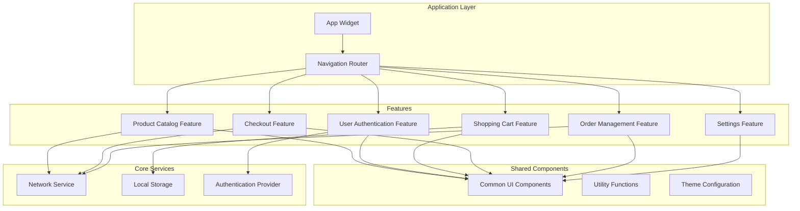

**Diagram sources**
- [README.md](file://README.md)
- [DESIGN.md](file://DESIGN.md)

## Core State Management Architecture

The Albatal Store implements a layered state management architecture that separates concerns between business logic, data access, and presentation layers.

### State Management Stack

The application uses a combination of state management solutions:

1. **Cubit/Bloc Pattern**: Primary state management for feature-specific states
2. **Provider/ValueListenableBuilder**: For simple UI state and theme management
3. **Riverpod**: Optional reactive state management for complex cross-cutting concerns
4. **Local Storage**: Persistent state using shared_preferences or hive

### State Lifecycle Management

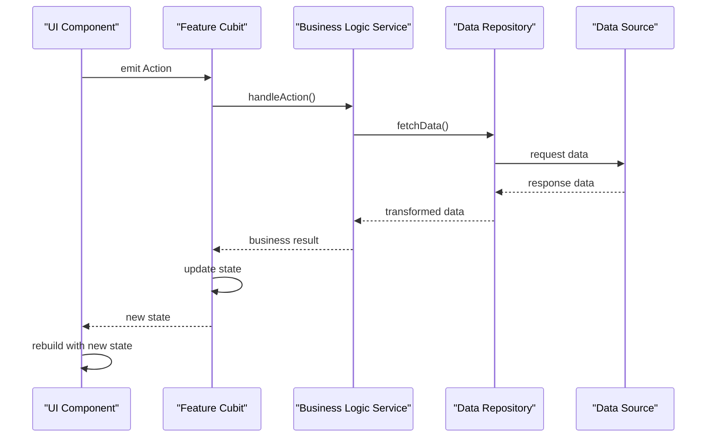

**Diagram sources**
- [pubspec.yaml](file://pubspec.yaml)

## Feature-Based State Organization

Each major feature in the Albatal Store maintains its own state namespace, promoting encapsulation and reducing coupling between features.

### Feature State Structure

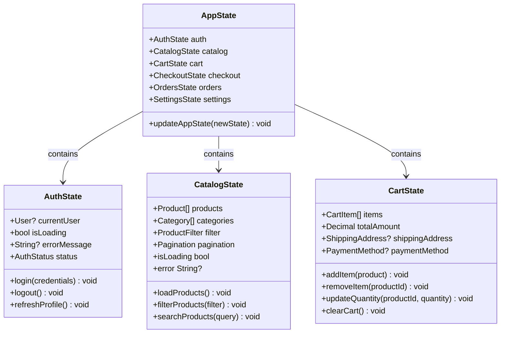

**Diagram sources**
- [DESIGN.md](file://DESIGN.md)

### State Isolation Principles

1. **Feature Boundaries**: Each feature manages its own state independently
2. **Minimal Exposure**: Only necessary state is exposed to other features
3. **Event-Driven Communication**: Features communicate through well-defined events
4. **Dependency Injection**: Shared services are injected rather than directly accessed

## State Inheritance Patterns

The Albatal Store implements sophisticated state inheritance patterns to promote code reuse and maintain consistency across similar state types.

### Base State Classes

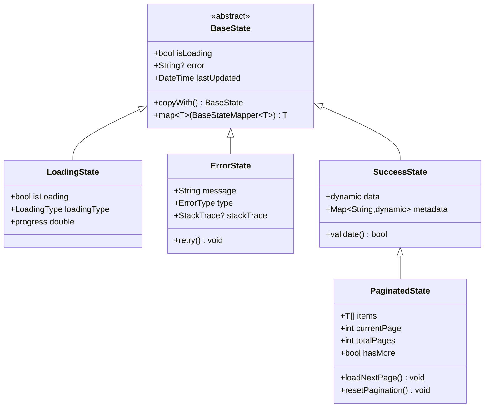

**Diagram sources**
- [DESIGN.md](file://DESIGN.md)

### State Mixins and Extensions

The application leverages Dart mixins and extensions to add common functionality to state classes:

1. **Validation Mixin**: Provides validation methods for form-related states
2. **Persistence Mixin**: Handles automatic state serialization/deserialization
3. **Logging Mixin**: Adds structured logging capabilities
4. **Analytics Mixin**: Tracks state changes for analytics purposes

## Shared State Components

Certain state components are shared across multiple features to maintain consistency and reduce duplication.

### Global Application State

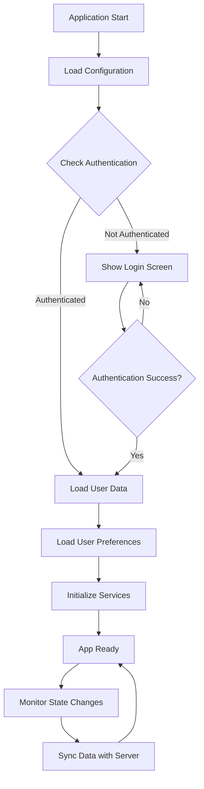

**Diagram sources**
- [INSTRUCTIONS.md](file://INSTRUCTIONS.md)

### Cross-Cutting Concerns

1. **Theme State**: Manages app-wide theming and appearance
2. **Localization State**: Handles language and regional settings
3. **Network Connectivity State**: Monitors network availability
4. **Permission State**: Tracks user permissions for various features
5. **Analytics State**: Collects and manages analytics data

## Data Model to UI State Mapping

The Albatal Store maintains clear separation between data models and UI states, ensuring that business logic remains independent of presentation concerns.

### Model-State Relationship

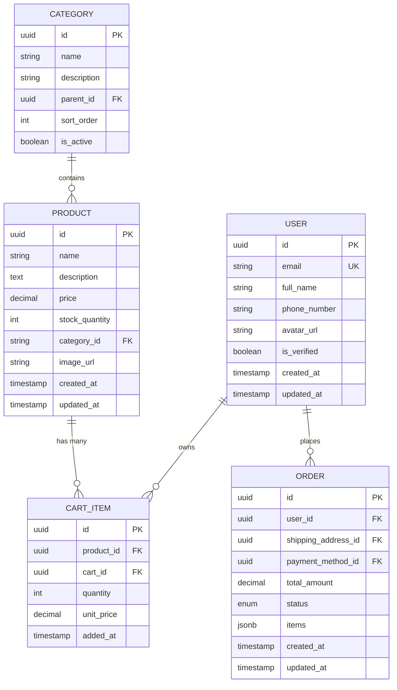

**Diagram sources**
- [supabase/migrations/001_initial_schema.sql](file://supabase/migrations/001_initial_schema.sql)

### State Transformation Pipeline

1. **Raw Data**: API responses and database records
2. **Domain Models**: Business-enriched representations
3. **UI States**: Presentation-ready state objects
4. **View Models**: Computed values for specific UI components

## State Composition Patterns

The Albatal Store employs advanced state composition patterns to manage complex interactions between different state slices.

### Compound State Objects

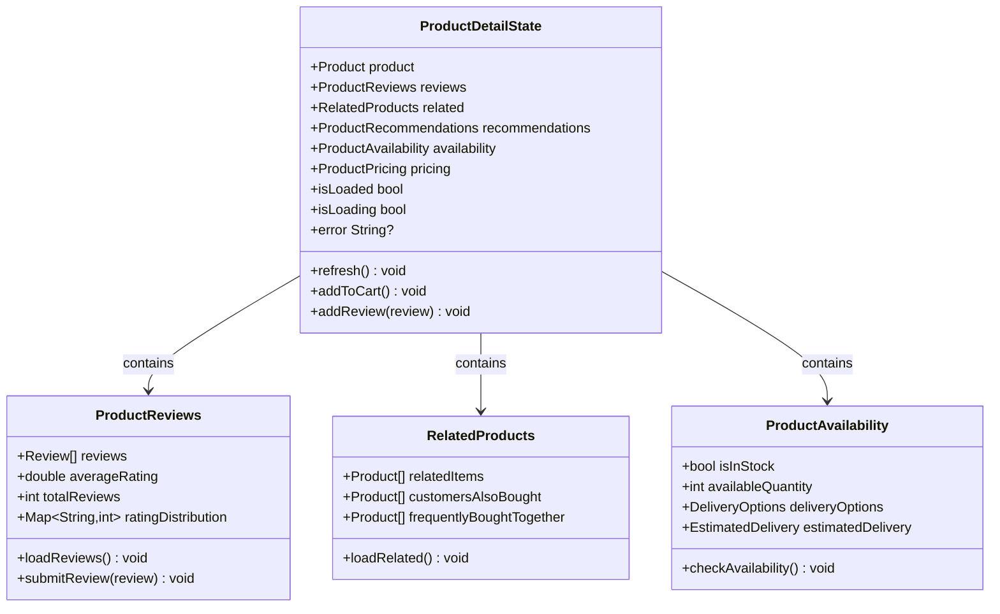

**Diagram sources**
- [DESIGN.md](file://DESIGN.md)

### State Synchronization

1. **Event Sourcing**: Maintain complete history of state changes
2. **Command Pattern**: Encapsulate state mutations as commands
3. **Observer Pattern**: React to state changes across the application
4. **Mediator Pattern**: Coordinate complex state interactions

## Nested State Management

Complex features require nested state structures to manage hierarchical data effectively.

### Hierarchical State Design

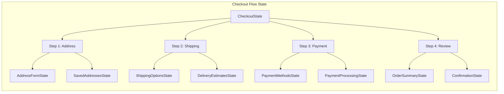

**Diagram sources**
- [INSTRUCTIONS.md](file://INSTRUCTIONS.md)

### State Navigation Patterns

1. **Wizard Pattern**: Sequential state progression through multi-step flows
2. **Tabbed Interface**: Parallel state management for different sections
3. **Modal Dialogs**: Isolated state for temporary UI overlays
4. **Drawer/Sidebar**: Independent state for navigation panels

## State Normalization Techniques

To optimize performance and maintain data consistency, the Albatal Store implements state normalization techniques.

### Normalized State Structure

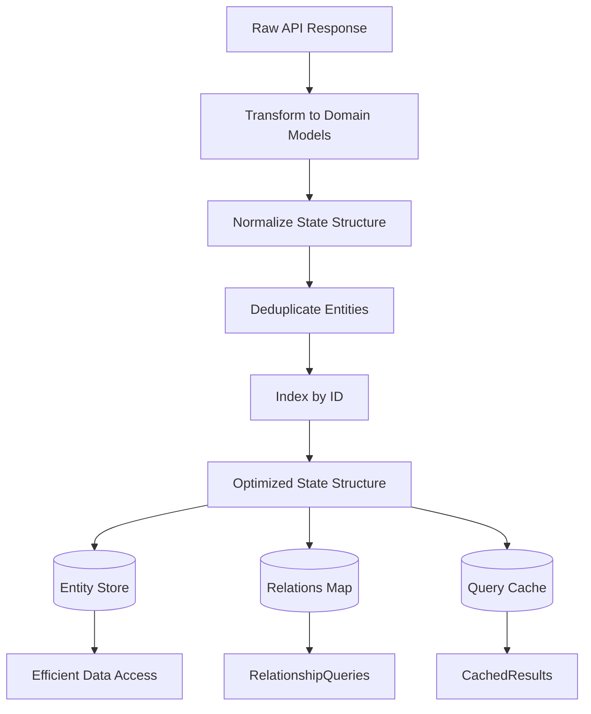

**Diagram sources**
- [DESIGN.md](file://DESIGN.md)

### Normalization Strategies

1. **Entity Reference**: Replace nested objects with ID references
2. **Index Maps**: Create lookup maps for efficient entity retrieval
3. **Relation Tables**: Maintain separate relation collections
4. **Query Results**: Cache computed query results

## Large State Hierarchy Guidelines

Managing large state hierarchies requires careful planning and adherence to established patterns.

### State Organization Principles

1. **Single Responsibility**: Each state slice handles one domain concept
2. **Flat Structure**: Prefer flat state over deeply nested structures
3. **Immutable Updates**: Use immutable state updates for predictability
4. **Selective Rebuild**: Minimize widget rebuilds through selective state consumption

### Performance Optimization

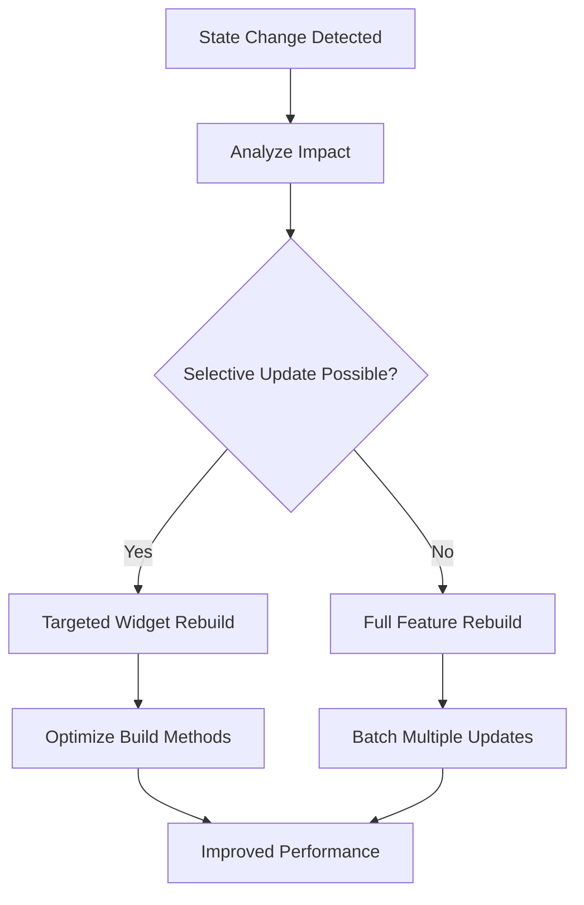

**Diagram sources**
- [INSTRUCTIONS.md](file://INSTRUCTIONS.md)

## Avoiding State Duplication

Preventing state duplication is crucial for maintaining application consistency and performance.

### State Ownership Rules

1. **Single Source of Truth**: Each piece of state has exactly one owner
2. **Derived State**: Compute derived data instead of storing duplicates
3. **State Lifting**: Lift state to appropriate common ancestors
4. **State Sharing**: Share state through dependency injection when needed

### Duplicate Detection Strategies

1. **Static Analysis**: Use linting rules to detect potential duplications
2. **Runtime Validation**: Implement assertions to catch inconsistencies
3. **Code Reviews**: Regular code reviews focused on state management
4. **Automated Testing**: Test state consistency across the application

## Cross-Feature State Consistency

Maintaining consistency across feature boundaries requires careful design and communication patterns.

### Inter-Feature Communication

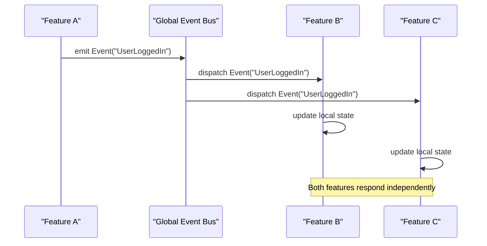

**Diagram sources**
- [DESIGN.md](file://DESIGN.md)

### Consistency Guarantees

1. **Eventual Consistency**: Accept temporary inconsistencies during sync
2. **Conflict Resolution**: Define clear rules for resolving conflicts
3. **Undo/Redo Support**: Enable users to reverse state changes
4. **Audit Logging**: Track all state changes for debugging

## State Versioning and Migration

As the application evolves, state schemas must be versioned and migrated gracefully.

### Version Management Strategy

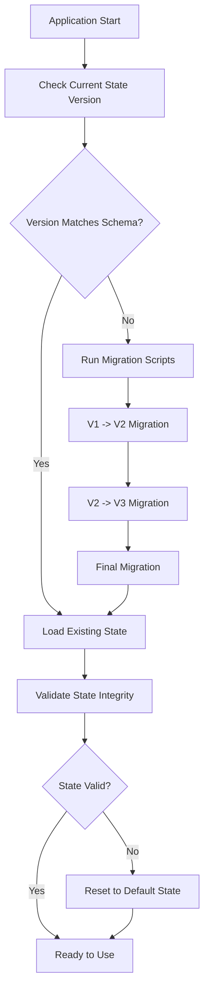

**Diagram sources**
- [INSTRUCTIONS.md](file://INSTRUCTIONS.md)

### Migration Best Practices

1. **Backward Compatibility**: Ensure old state formats remain readable
2. **Incremental Migrations**: Apply migrations step-by-step
3. **Rollback Support**: Provide rollback mechanisms for failed migrations
4. **Migration Testing**: Thoroughly test migration scripts

## Performance Considerations

State management performance is critical for smooth user experience in the Albatal Store.

### Optimization Techniques

1. **Memoization**: Cache expensive computations
2. **Lazy Loading**: Load state data on demand
3. **Debouncing**: Prevent excessive state updates
4. **Virtual Scrolling**: Handle large lists efficiently
5. **State Partitioning**: Split large state into smaller chunks

### Monitoring and Profiling

1. **State Change Tracking**: Monitor frequency and size of state updates
2. **Build Time Analysis**: Identify slow widget rebuilds
3. **Memory Usage**: Track memory consumption patterns
4. **Network Requests**: Optimize data fetching strategies

## Testing State Management

Comprehensive testing ensures state management reliability and correctness.

### Testing Strategies

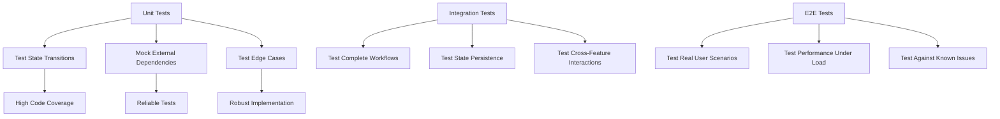

**Diagram sources**
- [INSTRUCTIONS.md](file://INSTRUCTIONS.md)

### Test Categories

1. **Unit Tests**: Individual state transitions and business logic
2. **Integration Tests**: Feature workflows and state persistence
3. **Widget Tests**: UI behavior with different state combinations
4. **Performance Tests**: State management under load conditions
5. **Regression Tests**: Ensure existing functionality remains intact

## Conclusion

The Albatal Store's state organization strategy emphasizes modularity, maintainability, and performance through several key principles:

1. **Feature-Based Architecture**: Clear separation of concerns with isolated state namespaces
2. **Inheritance Patterns**: Reusable base classes and mixins for common functionality
3. **Normalization Techniques**: Optimized data structures for performance
4. **Version Management**: Graceful evolution of state schemas
5. **Comprehensive Testing**: Ensuring reliability across all state scenarios

By following these guidelines and patterns, the Albatal Store achieves a robust, scalable, and maintainable state management system that supports the complex requirements of a modern e-commerce application while providing excellent user experience and developer productivity.