# Testing State Management

<cite>
**Referenced Files in This Document**
- [cart_cubit_test.dart](file://test/cart_cubit_test.dart)
- [catalog_cubit_test.dart](file://test/catalog_cubit_test.dart)
- [orders_cubit_test.dart](file://test/orders_cubit_test.dart)
- [settings_cubit_test.dart](file://test/settings_cubit_test.dart)
- [checkout_page_test.dart](file://test/checkout_page_test.dart)
- [checkout_address_test.dart](file://test/checkout_address_test.dart)
- [payment_integration_test.dart](file://test/payment_integration_test.dart)
- [payment_test.dart](file://test/payment_test.dart)
- [auth_test.dart](file://test/auth_test.dart)
- [product_detail_test.dart](file://test/product_detail_test.dart)
- [wishlist_cart_test.dart](file://test/wishlist_cart_test.dart)
- [app_widget_test.dart](file://test/app_widget_test.dart)
- [widget_test.dart](file://test/widget_test.dart)
- [integration_test.dart](file://test/integration_test.dart)
</cite>

## Table of Contents
1. [Introduction](#introduction)
2. [Project Structure](#project-structure)
3. [Core Components](#core-components)
4. [Architecture Overview](#architecture-overview)
5. [Detailed Component Analysis](#detailed-component-analysis)
6. [Dependency Analysis](#dependency-analysis)
7. [Performance Considerations](#performance-considerations)
8. [Troubleshooting Guide](#troubleshooting-guide)
9. [Conclusion](#conclusion)

## Introduction
This document provides comprehensive guidance for testing state management in the Albatal Store, focusing on Cubits and ProviderContainer-based widget tests. It covers unit testing strategies for Cubits (including mocking external dependencies, verifying state transitions, and error handling), widget testing approaches for state-dependent UI components, and integration testing patterns for complex flows such as checkout and payment workflows. It also includes examples for async operations, real-time subscriptions, edge cases, test data setup, isolation, performance considerations, coverage maintenance, and debugging failing state tests.

## Project Structure
The repository organizes tests under a dedicated test directory with clear separation between unit tests for Cubits, widget tests for feature screens, and integration tests for end-to-end flows. The structure aligns with feature boundaries and makes it straightforward to locate tests related to specific domains like cart, catalog, orders, settings, checkout, and payments.

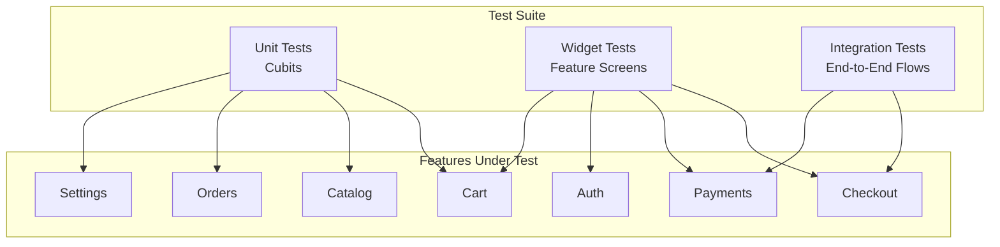

[No sources needed since this diagram shows conceptual workflow, not actual code structure]

## Core Components
This section outlines the primary state management components and their corresponding tests:

- Cart Cubit and tests: Manage cart items, totals, and persistence interactions. Tests verify item addition/removal, quantity updates, and error scenarios.
- Catalog Cubit and tests: Handle product listing, filtering, and pagination. Tests assert loading states, success payloads, and failure paths.
- Orders Cubit and tests: Orchestrate order lifecycle including creation, status updates, and cancellation. Tests cover idempotency and error recovery.
- Settings Cubit and tests: Manage user preferences and configuration. Tests validate default values and preference updates.
- Checkout and Payment tests: Validate multi-step flows, provider injection, and integration points with backend services.

Key testing techniques demonstrated across these files include:
- Using mock providers or dependency overrides to isolate external calls
- Asserting state sequences and final outcomes
- Handling asynchronous operations and streams
- Verifying UI reactions to state changes via widget tests

**Section sources**
- [cart_cubit_test.dart](file://test/cart_cubit_test.dart)
- [catalog_cubit_test.dart](file://test/catalog_cubit_test.dart)
- [orders_cubit_test.dart](file://test/orders_cubit_test.dart)
- [settings_cubit_test.dart](file://test/settings_cubit_test.dart)
- [checkout_page_test.dart](file://test/checkout_page_test.dart)
- [checkout_address_test.dart](file://test/checkout_address_test.dart)
- [payment_integration_test.dart](file://test/payment_integration_test.dart)
- [payment_test.dart](file://test/payment_test.dart)
- [auth_test.dart](file://test/auth_test.dart)

## Architecture Overview
The testing architecture separates concerns by layer:

- Unit tests target Cubits directly, injecting mocked repositories or services to control behavior deterministically.
- Widget tests render feature screens using ProviderContainer to supply dependencies and simulate user interactions.
- Integration tests orchestrate full flows across multiple features, often leveraging test-specific configurations and fixtures.

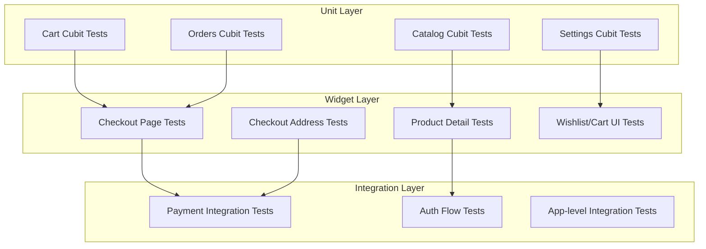

[No sources needed since this diagram shows conceptual workflow, not actual code structure]

## Detailed Component Analysis

### Cart Cubit Testing Strategy
Focus areas:
- Adding/removing items, updating quantities, and recalculating totals
- Error handling when interacting with storage or network layers
- Async operations and stream emissions

Recommended approach:
- Instantiate the Cart Cubit with injected mocks for repositories/services
- Emit events and assert resulting states
- Verify side effects through mock expectations

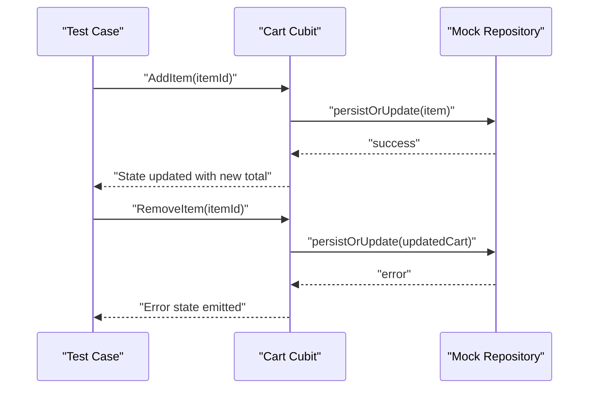

**Diagram sources**
- [cart_cubit_test.dart](file://test/cart_cubit_test.dart)

**Section sources**
- [cart_cubit_test.dart](file://test/cart_cubit_test.dart)

### Catalog Cubit Testing Strategy
Focus areas:
- Loading, success, and error states during product fetches
- Pagination and filtering logic
- Stream-based updates if applicable

Recommended approach:
- Provide mock responses for product listings
- Assert state transitions from loading to loaded or error
- Validate that filters are applied correctly before emitting states

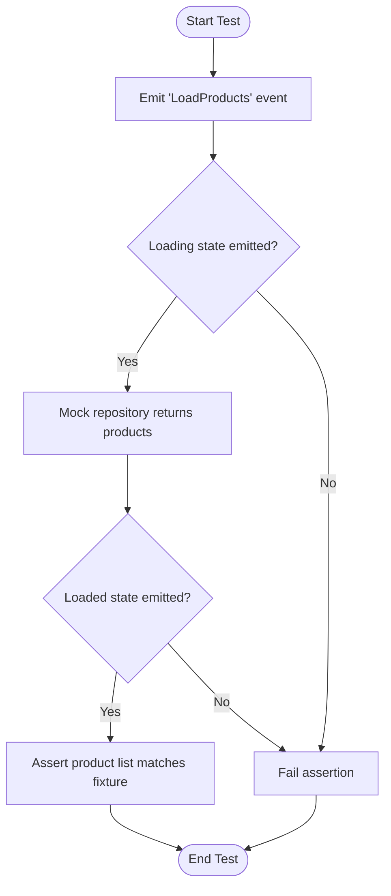

**Diagram sources**
- [catalog_cubit_test.dart](file://test/catalog_cubit_test.dart)

**Section sources**
- [catalog_cubit_test.dart](file://test/catalog_cubit_test.dart)

### Orders Cubit Testing Strategy
Focus areas:
- Order creation, status transitions, and cancellation
- Idempotency and retry mechanisms
- Error recovery and user feedback

Recommended approach:
- Mock order service methods to return controlled results
- Simulate success and failure paths
- Assert final order state and any UI-relevant flags

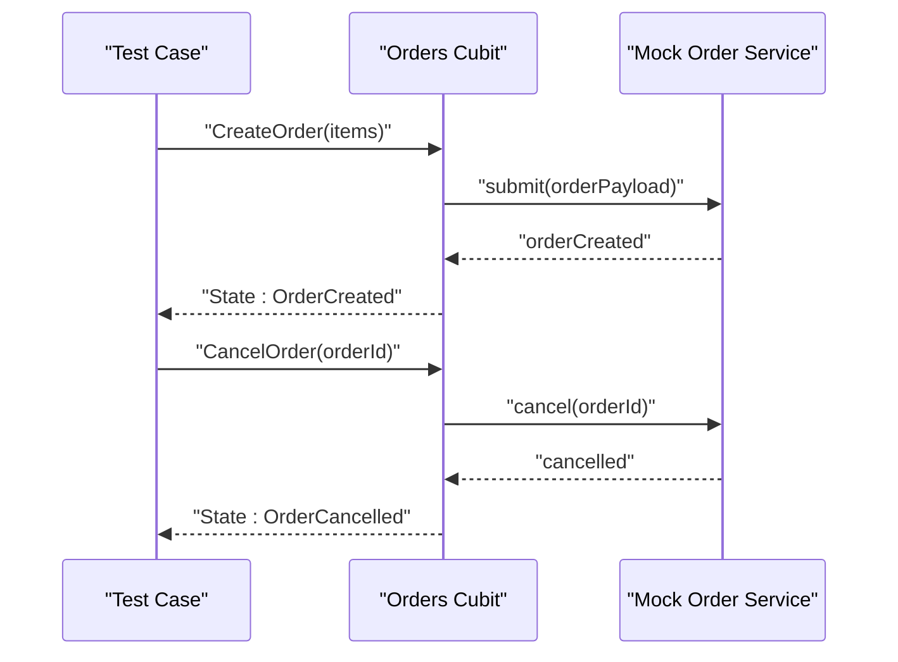

**Diagram sources**
- [orders_cubit_test.dart](file://test/orders_cubit_test.dart)

**Section sources**
- [orders_cubit_test.dart](file://test/orders_cubit_test.dart)

### Settings Cubit Testing Strategy
Focus areas:
- Default settings initialization
- Updating and persisting preferences
- Validation and error handling

Recommended approach:
- Initialize Settings Cubit with a mock preferences store
- Emit update events and assert state changes
- Verify persisted values via mock expectations

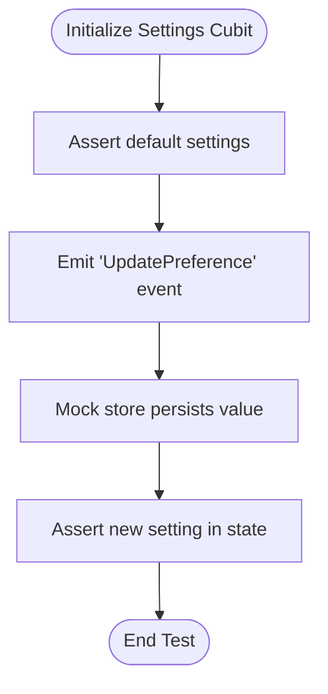

**Diagram sources**
- [settings_cubit_test.dart](file://test/settings_cubit_test.dart)

**Section sources**
- [settings_cubit_test.dart](file://test/settings_cubit_test.dart)

### Widget Testing with ProviderContainer
Focus areas:
- Rendering state-dependent UI components
- Injecting dependencies via ProviderContainer
- Simulating user interactions and asserting UI updates

Recommended approach:
- Wrap widgets in ProviderContainer with required providers
- Use tester interactions to trigger actions
- Assert visible elements reflect expected states

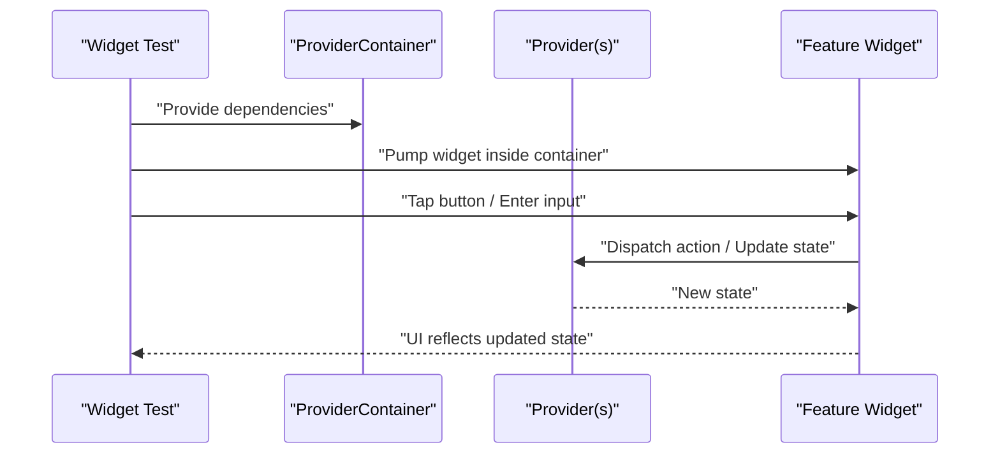

**Diagram sources**
- [checkout_page_test.dart](file://test/checkout_page_test.dart)
- [checkout_address_test.dart](file://test/checkout_address_test.dart)
- [product_detail_test.dart](file://test/product_detail_test.dart)
- [wishlist_cart_test.dart](file://test/wishlist_cart_test.dart)
- [app_widget_test.dart](file://test/app_widget_test.dart)
- [widget_test.dart](file://test/widget_test.dart)

**Section sources**
- [checkout_page_test.dart](file://test/checkout_page_test.dart)
- [checkout_address_test.dart](file://test/checkout_address_test.dart)
- [product_detail_test.dart](file://test/product_detail_test.dart)
- [wishlist_cart_test.dart](file://test/wishlist_cart_test.dart)
- [app_widget_test.dart](file://test/app_widget_test.dart)
- [widget_test.dart](file://test/widget_test.dart)

### Integration Testing Patterns: Checkout and Payments
Focus areas:
- Multi-step checkout flows
- Payment initiation, callback handling, and confirmation
- Real-time updates and error propagation

Recommended approach:
- Use integration tests to drive end-to-end flows
- Provide test-specific configurations and stubbed endpoints where appropriate
- Assert final outcomes and intermediate UI states

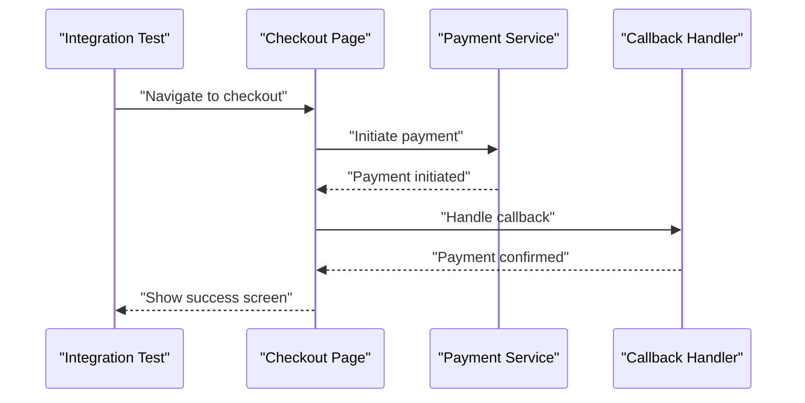

**Diagram sources**
- [payment_integration_test.dart](file://test/payment_integration_test.dart)
- [payment_test.dart](file://test/payment_test.dart)

**Section sources**
- [payment_integration_test.dart](file://test/payment_integration_test.dart)
- [payment_test.dart](file://test/payment_test.dart)

### Auth Flow Testing
Focus areas:
- Login, registration, and session management
- Error handling for invalid credentials and network failures
- Redirects and UI state after auth events

Recommended approach:
- Mock authentication service to return controlled results
- Assert navigation and UI updates based on auth state
- Cover both success and failure paths

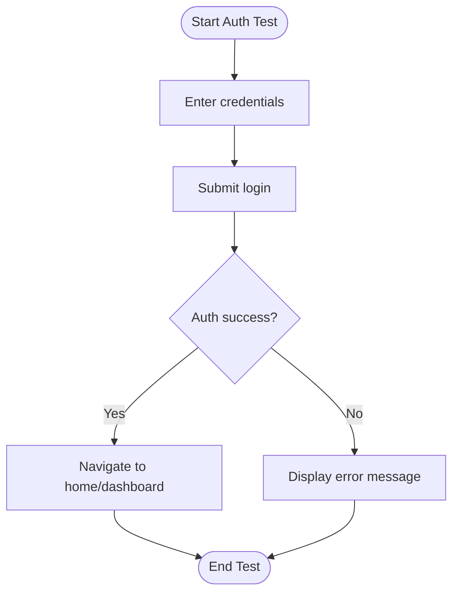

**Diagram sources**
- [auth_test.dart](file://test/auth_test.dart)

**Section sources**
- [auth_test.dart](file://test/auth_test.dart)

### Conceptual Overview
For complex state flows, consider the following general patterns:
- Compose small, focused unit tests for each Cubit method
- Build widget tests around critical user journeys
- Use integration tests sparingly for high-value flows that require coordination across multiple components
- Maintain deterministic behavior by isolating external dependencies

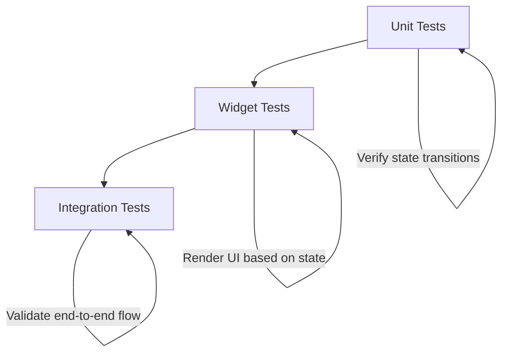

[No sources needed since this diagram shows conceptual workflow, not actual code structure]

## Dependency Analysis
Tests rely on isolated dependencies to ensure reliability and speed:

- Unit tests inject mocks for repositories and services
- Widget tests use ProviderContainer to provide test doubles
- Integration tests coordinate multiple components and may use test-specific environments

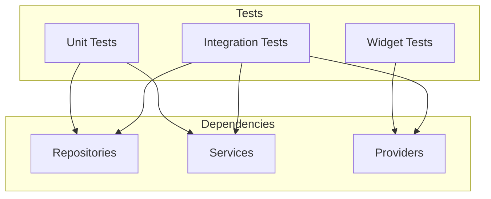

[No sources needed since this diagram shows conceptual workflow, not actual code structure]

**Section sources**
- [cart_cubit_test.dart](file://test/cart_cubit_test.dart)
- [catalog_cubit_test.dart](file://test/catalog_cubit_test.dart)
- [orders_cubit_test.dart](file://test/orders_cubit_test.dart)
- [settings_cubit_test.dart](file://test/settings_cubit_test.dart)
- [checkout_page_test.dart](file://test/checkout_page_test.dart)
- [checkout_address_test.dart](file://test/checkout_address_test.dart)
- [payment_integration_test.dart](file://test/payment_integration_test.dart)
- [payment_test.dart](file://test/payment_test.dart)
- [auth_test.dart](file://test/auth_test.dart)

## Performance Considerations
- Prefer unit tests over widget/integration tests for fast feedback loops
- Keep widget tests minimal and focused on critical UI behaviors
- Avoid heavy async operations in unit tests; use synchronous assertions where possible
- Reuse test fixtures and mocks to reduce setup overhead
- Parallelize independent tests to improve CI throughput

[No sources needed since this section provides general guidance]

## Troubleshooting Guide
Common issues and resolutions:
- Flaky async tests: Ensure proper awaiting and pumping frames; use timers or pumpAndSettle judiciously
- State not updating in widget tests: Verify ProviderContainer wiring and that actions are dispatched within the correct context
- Integration test timeouts: Reduce scope, stub slow endpoints, and increase timeouts only when necessary
- Coverage gaps: Add targeted tests for error branches and edge cases; review uncovered lines in reports

Debugging tips:
- Print state snapshots at key transitions to understand flow
- Isolate failing tests by running them individually
- Use descriptive test names to quickly identify problematic scenarios

**Section sources**
- [integration_test.dart](file://test/integration_test.dart)
- [widget_test.dart](file://test/widget_test.dart)

## Conclusion
Effective testing of state management in the Albatal Store combines precise unit tests for Cubits, focused widget tests with ProviderContainer, and selective integration tests for complex flows. By isolating dependencies, asserting state transitions, and covering error paths, teams can maintain reliable, fast, and maintainable tests that safeguard core business logic and user experiences.

[No sources needed since this section summarizes without analyzing specific files]