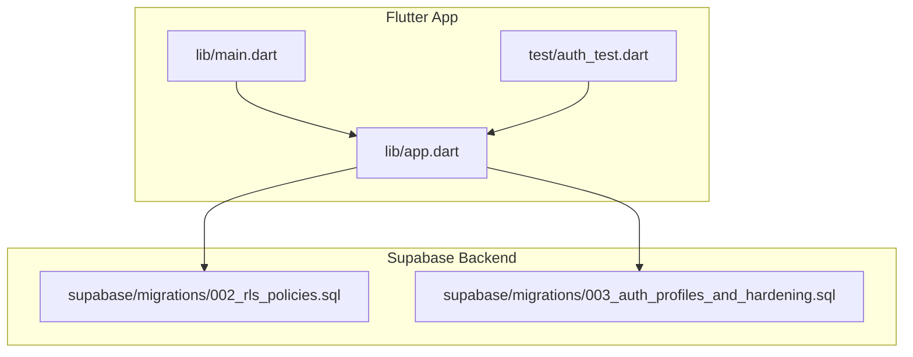
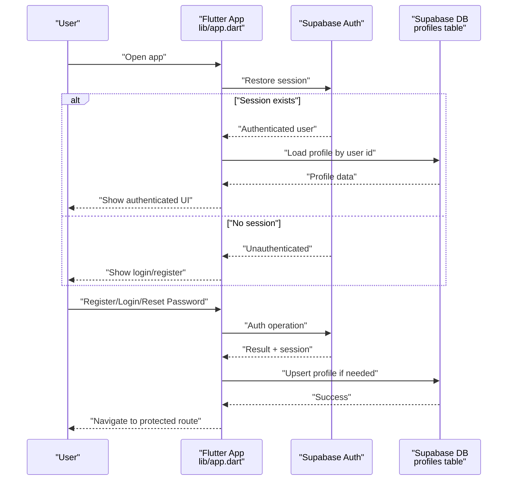
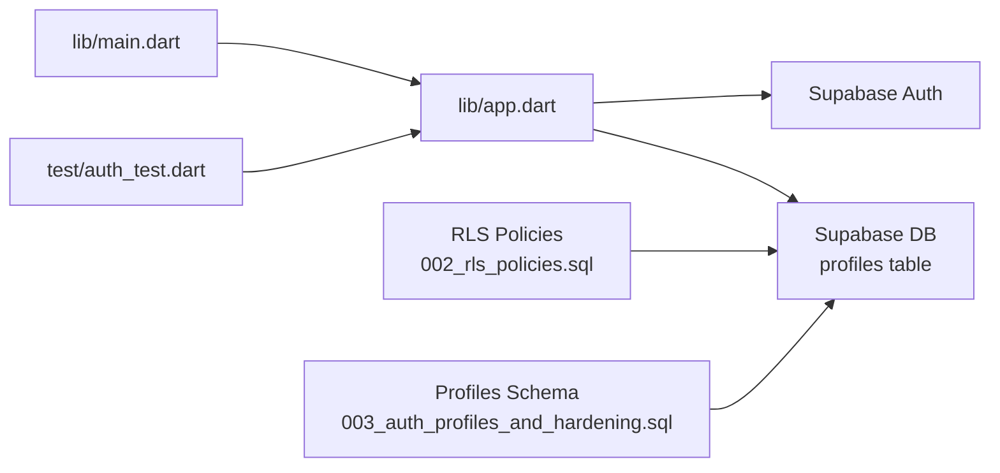

# Authentication & User Management

<cite>
**Referenced Files in This Document**
- [README.md](file://README.md)
- [supabase-integration.md](file://docs/supabase-integration.md)
- [003_auth_profiles_and_hardening.sql](file://supabase/migrations/003_auth_profiles_and_hardening.sql)
- [002_rls_policies.sql](file://supabase/migrations/002_rls_policies.sql)
- [app.dart](file://lib/app.dart)
- [main.dart](file://lib/main.dart)
- [auth_test.dart](file://test/auth_test.dart)
</cite>

## Table of Contents
1. [Introduction](#introduction)
2. [Project Structure](#project-structure)
3. [Core Components](#core-components)
4. [Architecture Overview](#architecture-overview)
5. [Detailed Component Analysis](#detailed-component-analysis)
6. [Dependency Analysis](#dependency-analysis)
7. [Performance Considerations](#performance-considerations)
8. [Troubleshooting Guide](#troubleshooting-guide)
9. [Conclusion](#conclusion)

## Introduction
This document explains how Supabase authentication and user management are implemented in Albatal Store. It covers the complete authentication flow (registration, login, password reset, session management), profile management with custom data in the profiles table, protected routes, and user context handling. It also documents security best practices, error handling patterns, loading states, UX considerations, and troubleshooting techniques.

## Project Structure
Albatal Store is a Flutter application that integrates with Supabase for authentication and database operations. The project includes:
- Supabase migrations defining schema, RLS policies, and profile hardening
- Documentation describing Supabase integration
- Application entry points and tests related to authentication

**Diagram sources**
- [main.dart](file://lib/main.dart)
- [app.dart](file://lib/app.dart)
- [002_rls_policies.sql](file://supabase/migrations/002_rls_policies.sql)
- [003_auth_profiles_and_hardening.sql](file://supabase/migrations/003_auth_profiles_and_hardening.sql)

**Section sources**
- [README.md](file://README.md)
- [supabase-integration.md](file://docs/supabase-integration.md)

## Core Components
- Authentication flows: registration, login, password reset, and session persistence via Supabase Auth
- Profile management: custom user data stored in the profiles table, synchronized with Supabase Auth users
- Protected routes: UI guards that restrict access based on authentication state
- User context: application-wide access to current user and profile information
- Security: email verification, password policies, and Row Level Security (RLS) policies

Key implementation references:
- Supabase integration overview and setup guidance
- Database schema and RLS policies for auth and profiles
- Tests validating authentication behavior

**Section sources**
- [supabase-integration.md](file://docs/supabase-integration.md)
- [003_auth_profiles_and_hardening.sql](file://supabase/migrations/003_auth_profiles_and_hardening.sql)
- [002_rls_policies.sql](file://supabase/migrations/002_rls_policies.sql)
- [auth_test.dart](file://test/auth_test.dart)

## Architecture Overview
The app uses Supabase Auth for identity and sessions, and a relational database for profile data. RLS policies enforce row-level access to sensitive data. The Flutter app manages auth state and provides it through a user context to protected routes.

**Diagram sources**
- [app.dart](file://lib/app.dart)
- [003_auth_profiles_and_hardening.sql](file://supabase/migrations/003_auth_profiles_and_hardening.sql)
- [002_rls_policies.sql](file://supabase/migrations/002_rls_policies.sql)

## Detailed Component Analysis

### Authentication Flows
- Registration: Create a new user via Supabase Auth; optionally verify email; create or upsert a profile record linked to the user id.
- Login: Authenticate with credentials; restore session across app restarts; load profile data.
- Password Reset: Initiate password reset via email; handle confirmation and navigation after success.
- Session Management: Maintain persistent sessions; listen to auth state changes; update UI accordingly.

UX considerations:
- Show clear loading indicators during auth operations
- Provide actionable error messages and retry options
- Navigate to appropriate screens upon success or failure

Security considerations:
- Enforce email verification where required
- Apply password policy rules at both client and server levels
- Use secure storage for tokens managed by the SDK

**Section sources**
- [supabase-integration.md](file://docs/supabase-integration.md)
- [auth_test.dart](file://test/auth_test.dart)

### Profile Management
Custom user data is stored in the profiles table and associated with Supabase Auth users. Typical responsibilities include:
- Creating a profile on first sign-up
- Updating profile fields (e.g., display name, avatar URL)
- Reading profile data for UI personalization

Data model highlights:
- Primary key tied to the authenticated user id
- Additional user-specific attributes
- Constraints and defaults defined in migration

Access control:
- RLS policies ensure users can only read/write their own profile rows

**Section sources**
- [003_auth_profiles_and_hardening.sql](file://supabase/migrations/003_auth_profiles_and_hardening.sql)
- [002_rls_policies.sql](file://supabase/migrations/002_rls_policies.sql)

### Protected Routes and User Context
Protected routes guard sensitive screens by checking the current authentication state. The app typically:
- Subscribes to auth state changes
- Provides a user context containing the current user and profile
- Redirects unauthenticated users to login when accessing protected routes

Implementation references:
- App initialization and routing configuration
- Tests asserting protected route behavior

**Section sources**
- [app.dart](file://lib/app.dart)
- [auth_test.dart](file://test/auth_test.dart)

### Security Best Practices
- Email verification: Require verified emails for critical actions
- Password policies: Enforce complexity requirements and prevent common passwords
- Session security: Use short-lived tokens and refresh mechanisms provided by the SDK
- Data protection: Apply RLS policies to all tables containing user data
- Input validation: Validate and sanitize inputs before sending to the backend

**Section sources**
- [002_rls_policies.sql](file://supabase/migrations/002_rls_policies.sql)
- [003_auth_profiles_and_hardening.sql](file://supabase/migrations/003_auth_profiles_and_hardening.sql)

### Error Handling Patterns
Common errors and strategies:
- Network failures: Retry with exponential backoff and show user-friendly messages
- Invalid credentials: Prompt to re-enter credentials or initiate password reset
- Rate limiting: Inform users to try again later
- Validation errors: Highlight specific fields and provide corrective guidance

Loading states:
- Disable interactive elements during auth operations
- Show progress indicators and skeleton loaders where appropriate

**Section sources**
- [auth_test.dart](file://test/auth_test.dart)

## Dependency Analysis
The following diagram shows high-level dependencies between the Flutter app and Supabase components used for authentication and profile management.

**Diagram sources**
- [main.dart](file://lib/main.dart)
- [app.dart](file://lib/app.dart)
- [002_rls_policies.sql](file://supabase/migrations/002_rls_policies.sql)
- [003_auth_profiles_and_hardening.sql](file://supabase/migrations/003_auth_profiles_and_hardening.sql)
- [auth_test.dart](file://test/auth_test.dart)

**Section sources**
- [main.dart](file://lib/main.dart)
- [app.dart](file://lib/app.dart)
- [002_rls_policies.sql](file://supabase/migrations/002_rls_policies.sql)
- [003_auth_profiles_and_hardening.sql](file://supabase/migrations/003_auth_profiles_and_hardening.sql)
- [auth_test.dart](file://test/auth_test.dart)

## Performance Considerations
- Minimize redundant network calls by caching profile data locally while respecting auth state changes
- Debounce rapid UI interactions during login/register to avoid duplicate requests
- Use streaming auth state updates to keep UI responsive without polling
- Keep payload sizes small by selecting only necessary profile fields

## Troubleshooting Guide
Common issues and resolutions:
- Unable to log in: Verify credentials, check network connectivity, and confirm account is not locked due to too many attempts
- Email verification not received: Check spam folder, resend verification email, and ensure correct email address was used
- Profile not updating: Confirm RLS policies allow writes for the current user and that the profile row exists
- Session lost after restart: Ensure session persistence is enabled and that the app initializes Supabase correctly

Debugging techniques:
- Inspect auth state changes and network logs
- Validate RLS policies using Supabase dashboard
- Run authentication-related tests to reproduce issues consistently

**Section sources**
- [auth_test.dart](file://test/auth_test.dart)
- [supabase-integration.md](file://docs/supabase-integration.md)

## Conclusion
Albatal Store leverages Supabase Auth and a well-defined profiles schema with strong RLS policies to deliver secure and user-friendly authentication and user management. By following the documented flows, security practices, and troubleshooting steps, developers can maintain a robust and resilient auth system that scales with the application’s needs.