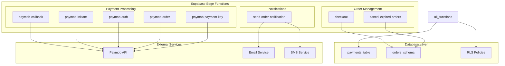
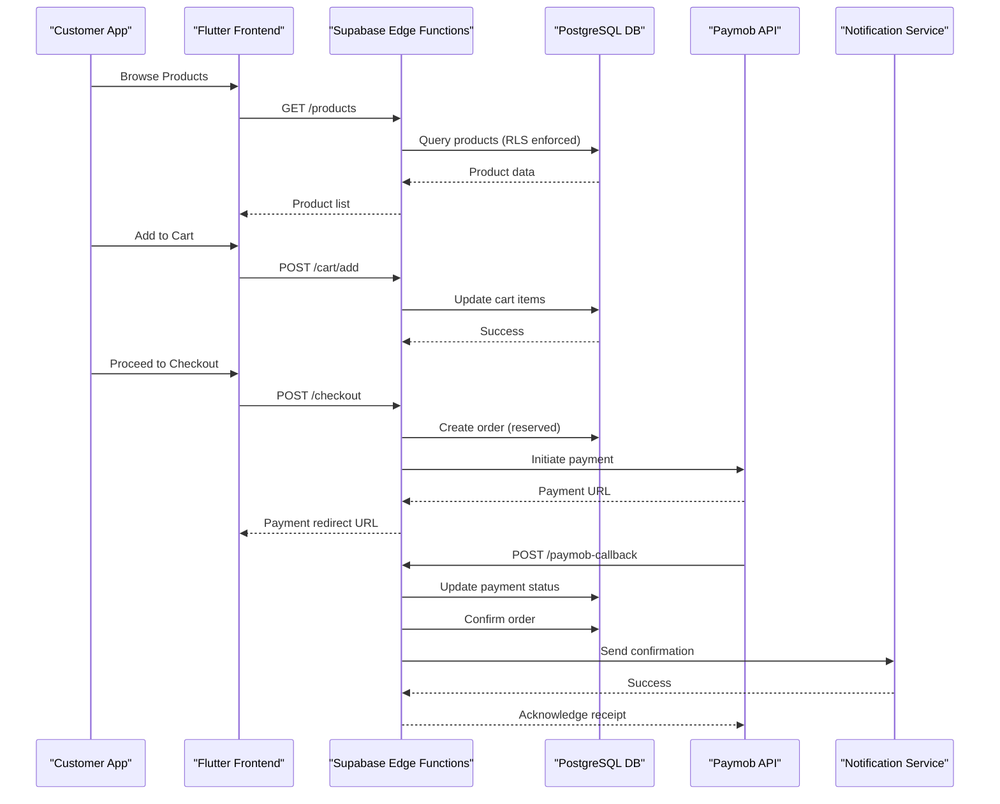
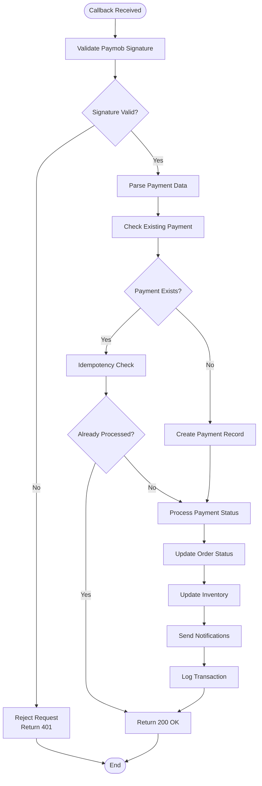
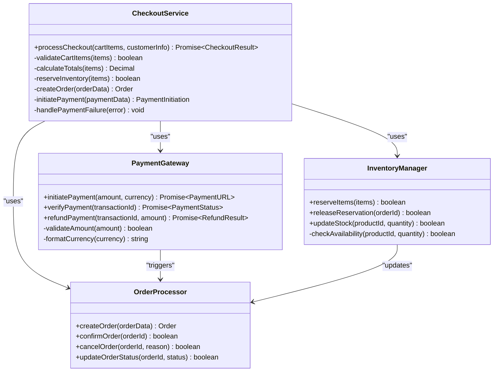
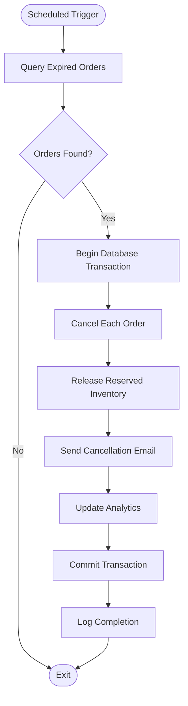
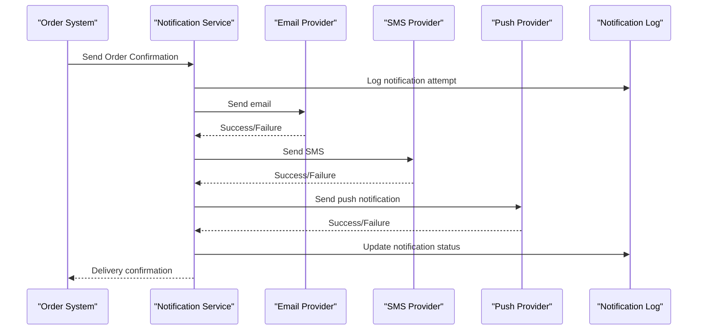
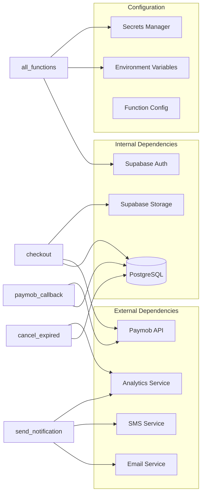
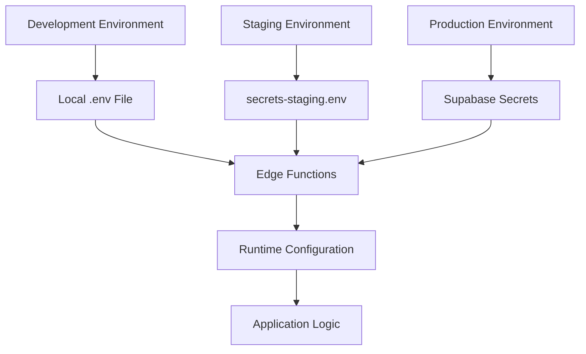
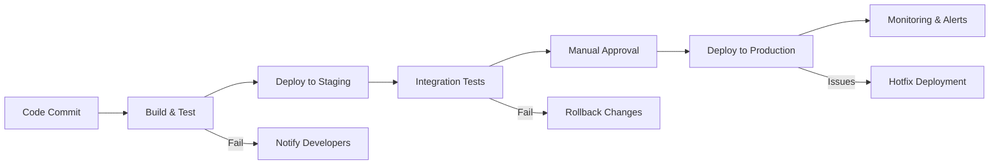

# Edge Functions & Serverless Backend

<cite>
**Referenced Files in This Document**
- [paymob-callback/index.ts](file://supabase/functions/paymob-callback/index.ts)
- [checkout/index.ts](file://supabase/functions/checkout/index.ts)
- [send-order-notification/index.ts](file://supabase/functions/send-order-notification/index.ts)
- [cancel-expired-orders/index.ts](file://supabase/functions/cancel-expired-orders/index.ts)
- [paymob-initiate/index.ts](file://supabase/functions/paymob-initiate/index.ts)
- [paymob-auth/index.ts](file://supabase/functions/paymob-auth/index.ts)
- [paymob-order/index.ts](file://supabase/functions/paymob-order/index.ts)
- [paymob-payment-key/index.ts](file://supabase/functions/paymob-payment-key/index.ts)
- [006_payments_table.sql](file://supabase/migrations/006_payments_table.sql)
- [011_orders_idempotency_and_expiry.sql](file://supabase/migrations/011_orders_idempotency_and_expiry.sql)
- [secrets-staging.env](file://secrets-staging.env)
</cite>

## Table of Contents
1. [Introduction](#introduction)
2. [Project Structure](#project-structure)
3. [Core Components](#core-components)
4. [Architecture Overview](#architecture-overview)
5. [Detailed Component Analysis](#detailed-component-analysis)
6. [Dependency Analysis](#dependency-analysis)
7. [Performance Considerations](#performance-considerations)
8. [Security & Configuration](#security--configuration)
9. [Testing & Debugging](#testing--debugging)
10. [Deployment & Monitoring](#deployment--monitoring)
11. [Troubleshooting Guide](#troubleshooting-guide)
12. [Conclusion](#conclusion)

## Introduction

Albatal Store implements a comprehensive serverless backend using Supabase Edge Functions to handle critical business operations including payment processing, order management, notifications, and background job execution. The architecture follows modern cloud-native patterns with TypeScript-based functions that provide secure, scalable, and maintainable server-side logic.

The edge functions serve as the backbone for payment integrations with Paymob, order lifecycle management, customer notifications, and automated background processes. This serverless approach ensures high availability, automatic scaling, and cost-effective operation while maintaining strict security boundaries through Row Level Security (RLS) policies.

## Project Structure

The Supabase Edge Functions are organized in a feature-based architecture within the `supabase/functions` directory, with each function encapsulating specific business capabilities:

**Diagram sources**
- [paymob-callback/index.ts](file://supabase/functions/paymob-callback/index.ts)
- [checkout/index.ts](file://supabase/functions/checkout/index.ts)
- [send-order-notification/index.ts](file://supabase/functions/send-order-notification/index.ts)
- [006_payments_table.sql](file://supabase/migrations/006_payments_table.sql)

**Section sources**
- [paymob-callback/index.ts](file://supabase/functions/paymob-callback/index.ts)
- [checkout/index.ts](file://supabase/functions/checkout/index.ts)
- [send-order-notification/index.ts](file://supabase/functions/send-order-notification/index.ts)

## Core Components

### Payment Processing Pipeline

The payment system is built around Paymob integration with multiple specialized functions handling different aspects of the payment lifecycle:

#### Paymob Callback Handler
The callback handler processes payment status updates from Paymob, validates signatures, updates payment records, and triggers downstream business logic like order fulfillment and inventory updates.

#### Checkout Processing
The checkout function orchestrates the complete checkout flow, including cart validation, payment initiation, order creation, and inventory reservation.

#### Order Notification Service
Handles sending order confirmations, shipping updates, and delivery notifications through multiple channels (email, SMS, push notifications).

#### Background Job Execution
Automated functions for order expiration, inventory reconciliation, and cleanup tasks run on scheduled intervals.

**Section sources**
- [paymob-callback/index.ts](file://supabase/functions/paymob-callback/index.ts)
- [checkout/index.ts](file://supabase/functions/checkout/index.ts)
- [send-order-notification/index.ts](file://supabase/functions/send-order-notification/index.ts)
- [cancel-expired-orders/index.ts](file://supabase/functions/cancel-expired-orders/index.ts)

## Architecture Overview

The serverless architecture follows a microservices pattern where each Edge Function serves a single responsibility:

**Diagram sources**
- [checkout/index.ts](file://supabase/functions/checkout/index.ts)
- [paymob-callback/index.ts](file://supabase/functions/paymob-callback/index.ts)
- [send-order-notification/index.ts](file://supabase/functions/send-order-notification/index.ts)

## Detailed Component Analysis

### Payment Processing Functions

#### Paymob Callback Handler
The callback handler is the most critical component in the payment pipeline, responsible for securely processing payment status updates from Paymob's webhook system.

**Diagram sources**
- [paymob-callback/index.ts](file://supabase/functions/paymob-callback/index.ts)

#### Checkout Processing Flow
The checkout function manages the complex orchestration between database operations, payment gateway integration, and inventory management.

**Diagram sources**
- [checkout/index.ts](file://supabase/functions/checkout/index.ts)
- [paymob-initiate/index.ts](file://supabase/functions/paymob-initiate/index.ts)

**Section sources**
- [paymob-callback/index.ts](file://supabase/functions/paymob-callback/index.ts)
- [checkout/index.ts](file://supabase/functions/checkout/index.ts)
- [paymob-initiate/index.ts](file://supabase/functions/paymob-initiate/index.ts)

### Order Management System

#### Expired Order Cancellation
The background job automatically cancels orders that exceed their expiration time, ensuring inventory consistency and preventing resource leaks.

**Diagram sources**
- [cancel-expired-orders/index.ts](file://supabase/functions/cancel-expired-orders/index.ts)

**Section sources**
- [cancel-expired-orders/index.ts](file://supabase/functions/cancel-expired-orders/index.ts)

### Notification System

#### Multi-Channel Order Notifications
The notification service handles order confirmations, shipping updates, and delivery notifications across multiple channels with retry logic and failure handling.

**Diagram sources**
- [send-order-notification/index.ts](file://supabase/functions/send-order-notification/index.ts)

**Section sources**
- [send-order-notification/index.ts](file://supabase/functions/send-order-notification/index.ts)

## Dependency Analysis

The edge functions have well-defined dependencies and communication patterns:

**Diagram sources**
- [paymob-callback/index.ts](file://supabase/functions/paymob-callback/index.ts)
- [checkout/index.ts](file://supabase/functions/checkout/index.ts)
- [send-order-notification/index.ts](file://supabase/functions/send-order-notification/index.ts)
- [cancel-expired-orders/index.ts](file://supabase/functions/cancel-expired-orders/index.ts)

**Section sources**
- [006_payments_table.sql](file://supabase/migrations/006_payments_table.sql)
- [011_orders_idempotency_and_expiry.sql](file://supabase/migrations/011_orders_idempotency_and_expiry.sql)

## Performance Considerations

### Cold Start Optimization
- **Function Bundling**: Minimize package size by excluding unnecessary dependencies
- **Connection Pooling**: Use connection pooling for database connections to reduce cold start latency
- **Lazy Loading**: Load heavy modules only when needed
- **Memory Management**: Optimize memory usage to prevent function throttling

### Database Performance
- **Index Strategy**: Ensure proper indexing on frequently queried columns
- **Query Optimization**: Use efficient SQL queries with proper JOIN strategies
- **Connection Limits**: Monitor and optimize database connection usage
- **Batch Operations**: Use batch operations for bulk updates

### Rate Limiting and Throttling
- **API Rate Limits**: Implement rate limiting for external API calls
- **Database Query Limits**: Set appropriate timeouts and limits for database operations
- **Retry Logic**: Implement exponential backoff for failed requests
- **Circuit Breaker Pattern**: Prevent cascading failures when external services are unavailable

### Cost Optimization
- **Execution Time**: Optimize function execution time to reduce costs
- **Memory Allocation**: Right-size memory allocation for each function
- **Concurrent Executions**: Monitor and optimize concurrent execution limits
- **Cold Start Frequency**: Reduce cold starts through function warm-up strategies

## Security & Configuration

### Environment Configuration
The application uses environment variables for configuration management:

**Diagram sources**
- [secrets-staging.env](file://secrets-staging.env)

### Security Best Practices
- **Input Validation**: Validate all incoming request data
- **Authentication**: Verify user authentication and authorization
- **Row Level Security**: Enforce RLS policies for database access
- **Secrets Management**: Store sensitive configuration in environment variables
- **Error Handling**: Implement comprehensive error handling without exposing sensitive information
- **Logging**: Log security-relevant events without logging sensitive data

### Database Security
- **RLS Policies**: Enable Row Level Security for all tables
- **Parameterized Queries**: Use parameterized queries to prevent SQL injection
- **Connection Security**: Use SSL/TLS for database connections
- **Audit Logging**: Maintain audit trails for sensitive operations

**Section sources**
- [secrets-staging.env](file://secrets-staging.env)
- [003_auth_profiles_and_hardening.sql](file://supabase/migrations/003_auth_profiles_and_hardening.sql)

## Testing & Debugging

### Unit Testing Strategies
- **Mock External Dependencies**: Mock Paymob API, email services, and other external dependencies
- **Database Testing**: Use test databases with isolated schemas
- **Integration Testing**: Test complete workflows with mocked external services
- **Performance Testing**: Load test functions under various scenarios

### Debugging Techniques
- **Structured Logging**: Implement structured logging with correlation IDs
- **Error Tracking**: Use error tracking services for production debugging
- **Function Logs**: Access function logs through Supabase dashboard
- **Local Development**: Use Supabase CLI for local development and testing

### Monitoring and Observability
- **Metrics Collection**: Collect custom metrics for business KPIs
- **Health Checks**: Implement health check endpoints for monitoring
- **Alerting**: Set up alerts for critical errors and performance issues
- **Tracing**: Implement distributed tracing for complex workflows

## Deployment & Monitoring

### Deployment Pipeline
The deployment process includes multiple stages with automated testing and validation:

### Monitoring Strategy
- **Real-time Monitoring**: Monitor function execution times, error rates, and resource usage
- **Business Metrics**: Track key business metrics like order completion rates and payment success rates
- **Alerting**: Set up alerts for critical issues and performance degradation
- **Dashboard**: Create dashboards for operational visibility

### Backup and Recovery
- **Database Backups**: Automated daily backups with point-in-time recovery
- **Configuration Backup**: Version control for all configuration files
- **Disaster Recovery**: Documented procedures for disaster recovery scenarios

## Troubleshooting Guide

### Common Issues and Solutions

#### Payment Processing Issues
- **Signature Validation Failures**: Verify webhook secret configuration and timestamp validation
- **Payment Status Mismatches**: Check idempotency keys and implement proper state reconciliation
- **Timeout Errors**: Implement retry logic with exponential backoff for external API calls

#### Database Connection Problems
- **Connection Pool Exhaustion**: Monitor connection usage and optimize query performance
- **Deadlock Detection**: Implement deadlock detection and resolution strategies
- **Slow Queries**: Use query profiling tools to identify and optimize slow queries

#### Performance Bottlenecks
- **Cold Start Latency**: Analyze function bundle size and optimize dependencies
- **Memory Usage**: Monitor memory consumption and optimize data structures
- **Database Performance**: Use query explain plans to identify optimization opportunities

### Debugging Checklist
- [ ] Check function logs for error messages
- [ ] Verify environment variable configuration
- [ ] Test database connectivity and permissions
- [ ] Validate external API responses and error codes
- [ ] Review rate limiting and throttling settings
- [ ] Check network connectivity and firewall rules

### Error Handling Patterns
- **Graceful Degradation**: Implement fallback mechanisms for non-critical failures
- **Circuit Breaker**: Prevent cascading failures when external services are down
- **Retry Logic**: Implement intelligent retry with exponential backoff
- **Dead Letter Queue**: Handle permanently failed messages for manual intervention

## Conclusion

Albatal Store's Supabase Edge Functions implementation provides a robust, scalable, and secure serverless backend architecture. The modular design with specialized functions for payment processing, order management, notifications, and background jobs ensures maintainability and clear separation of concerns.

Key strengths of this architecture include:
- **Scalability**: Automatic scaling based on demand
- **Security**: Comprehensive security measures including RLS and input validation
- **Reliability**: Robust error handling, retry logic, and monitoring
- **Maintainability**: Clear function boundaries and comprehensive testing strategies
- **Cost Efficiency**: Pay-per-use model with optimized resource allocation

The implementation demonstrates best practices for serverless architecture, including proper error handling, security considerations, performance optimization, and comprehensive monitoring. This foundation provides a solid base for future enhancements and scaling requirements.