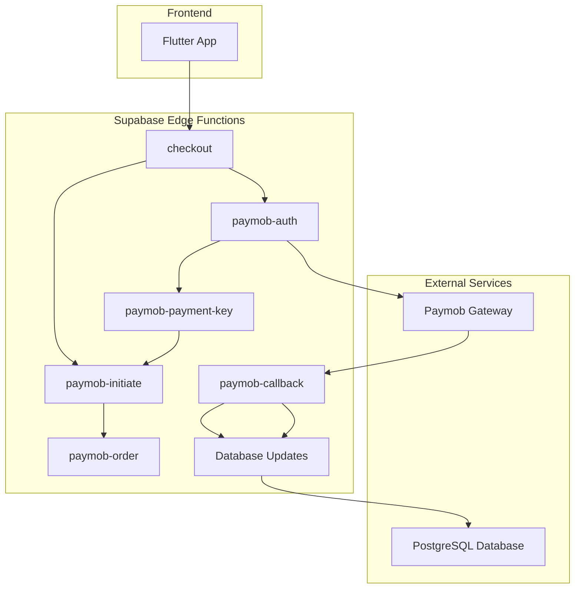
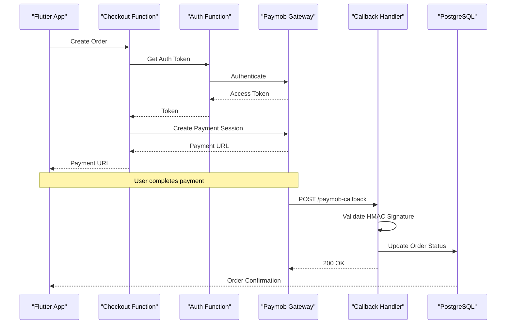
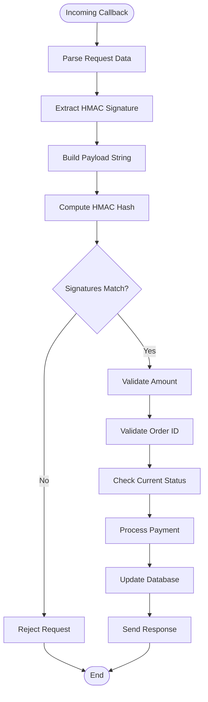
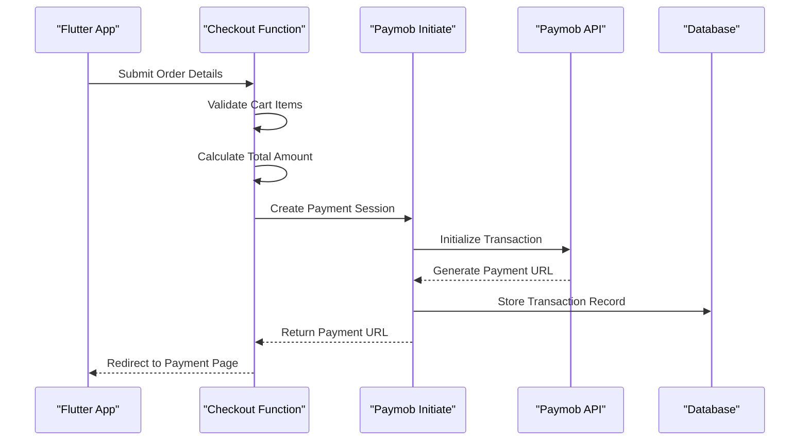
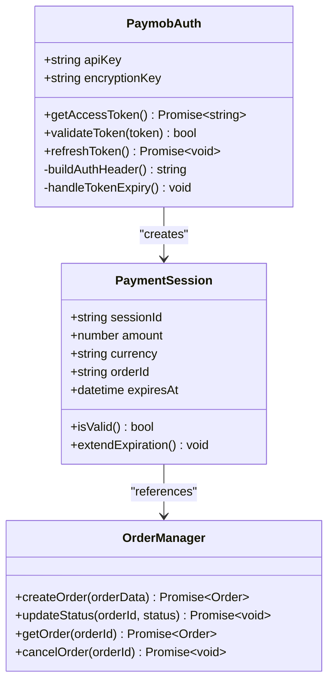
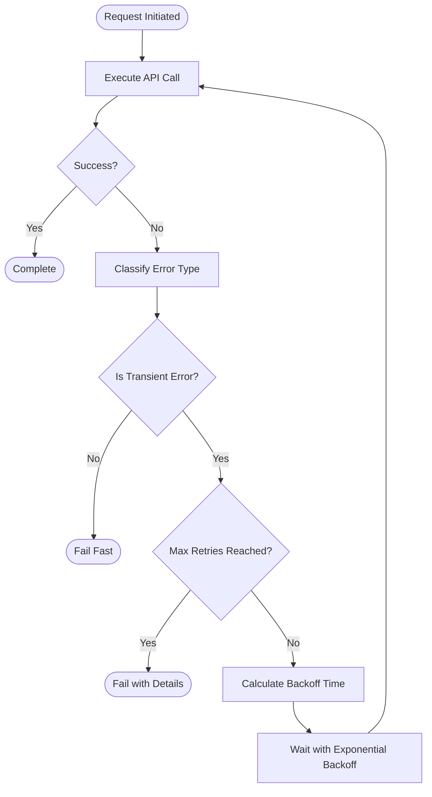
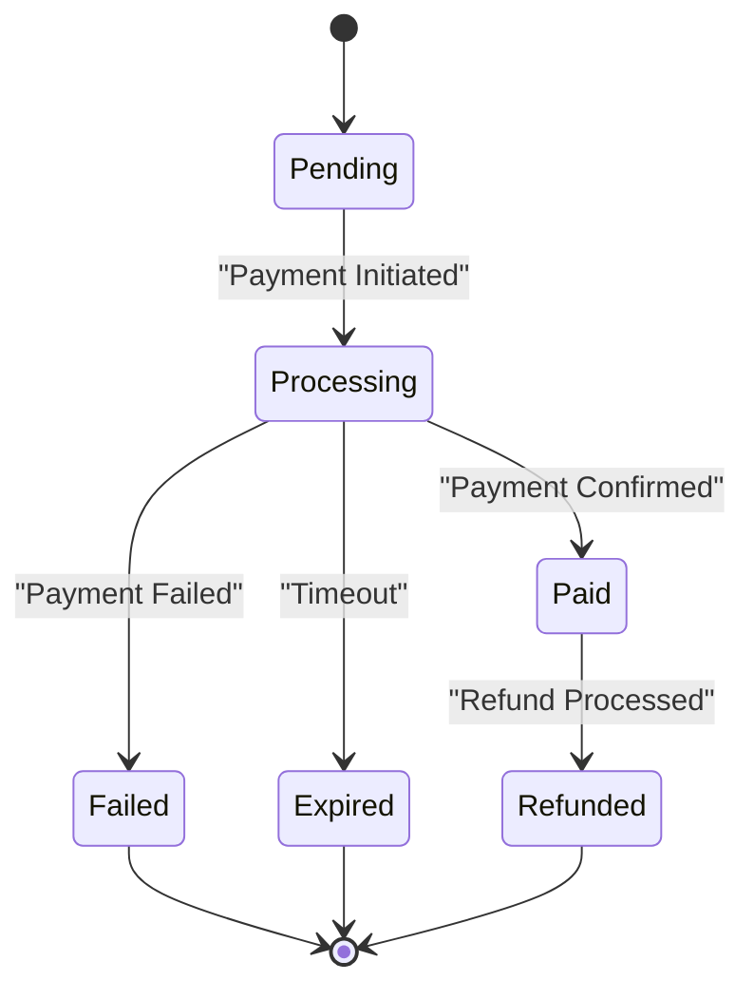

# Payment Processing Functions

<cite>
**Referenced Files in This Document**
- [paymob-callback/index.ts](file://supabase/functions/paymob-callback/index.ts)
- [paymob-initiate/index.ts](file://supabase/functions/paymob-initiate/index.ts)
- [paymob-auth/index.ts](file://supabase/functions/paymob-auth/index.ts)
- [paymob-order/index.ts](file://supabase/functions/paymob-order/index.ts)
- [paymob-payment-key/index.ts](file://supabase/functions/paymob-payment-key/index.ts)
- [checkout/index.ts](file://supabase/functions/checkout/index.ts)
- [006_payments_table.sql](file://supabase/migrations/006_payments_table.sql)
- [11_orders_idempotency_and_expiry.sql](file://supabase/migrations/11_orders_idempotency_and_expiry.sql)
</cite>

## Table of Contents
1. [Introduction](#introduction)
2. [Project Structure](#project-structure)
3. [Core Components](#core-components)
4. [Architecture Overview](#architecture-overview)
5. [Detailed Component Analysis](#detailed-component-analysis)
6. [Security Implementation](#security-implementation)
7. [Error Handling and Retry Mechanisms](#error-handling-and-retry-mechanisms)
8. [Idempotency Patterns](#idempotency-patterns)
9. [Performance Considerations](#performance-considerations)
10. [Troubleshooting Guide](#troubleshooting-guide)
11. [Conclusion](#conclusion)

## Introduction

This document provides comprehensive documentation for the Albatal Store's payment processing edge functions, focusing on the Paymob payment gateway integration. The system implements a secure, scalable payment processing pipeline that handles payment initiation, callback verification, order management, and status updates through Supabase Edge Functions.

The payment system is designed with security as a primary concern, implementing HMAC signature validation, secure token management, and robust error handling to ensure reliable payment processing while protecting sensitive financial data.

## Project Structure

The payment processing functionality is implemented using Supabase Edge Functions, organized into specialized modules for different aspects of the payment lifecycle:

**Diagram sources**
- [paymob-auth/index.ts](file://supabase/functions/paymob-auth/index.ts)
- [paymob-payment-key/index.ts](file://supabase/functions/paymob-payment-key/index.ts)
- [paymob-initiate/index.ts](file://supabase/functions/paymob-initiate/index.ts)
- [paymob-order/index.ts](file://supabase/functions/paymob-order/index.ts)
- [paymob-callback/index.ts](file://supabase/functions/paymob-callback/index.ts)
- [checkout/index.ts](file://supabase/functions/checkout/index.ts)

**Section sources**
- [paymob-callback/index.ts](file://supabase/functions/paymob-callback/index.ts)
- [paymob-initiate/index.ts](file://supabase/functions/paymob-initiate/index.ts)
- [paymob-auth/index.ts](file://supabase/functions/paymob-auth/index.ts)

## Core Components

### Authentication and Token Management

The authentication component handles secure communication with the Paymob gateway by managing API keys and generating authentication tokens. This component ensures that all requests to the payment provider are properly authenticated and secured.

### Payment Initiation

The payment initiation flow creates payment sessions with the Paymob gateway, generates unique transaction IDs, and returns payment URLs to the frontend application. This component validates order details and ensures proper currency and amount formatting.

### Callback Processing

The callback handler processes payment confirmations from Paymob, validates HMAC signatures, updates order statuses, and maintains audit trails. This is the most critical component for payment security and reliability.

### Order Management

Order management functions handle the creation, tracking, and updating of orders throughout the payment lifecycle. They maintain consistency between the application state and payment provider state.

**Section sources**
- [paymob-auth/index.ts](file://supabase/functions/paymob-auth/index.ts)
- [paymob-initiate/index.ts](file://supabase/functions/paymob-initiate/index.ts)
- [paymob-callback/index.ts](file://supabase/functions/paymob-callback/index.ts)
- [paymob-order/index.ts](file://supabase/functions/paymob-order/index.ts)

## Architecture Overview

The payment processing architecture follows a microservices pattern with clear separation of concerns and robust security measures:

**Diagram sources**
- [checkout/index.ts](file://supabase/functions/checkout/index.ts)
- [paymob-auth/index.ts](file://supabase/functions/paymob-auth/index.ts)
- [paymob-initiate/index.ts](file://supabase/functions/paymob-initiate/index.ts)
- [paymob-callback/index.ts](file://supabase/functions/paymob-callback/index.ts)

## Detailed Component Analysis

### Paymob Callback Handler

The callback handler is the most critical component for payment security. It processes incoming payment notifications from Paymob and performs comprehensive validation before updating order status.

#### Security Validation Flow

**Diagram sources**
- [paymob-callback/index.ts](file://supabase/functions/paymob-callback/index.ts)

#### Key Security Measures

1. **HMAC Signature Verification**: All callbacks must include valid HMAC signatures computed using the shared secret key
2. **Amount Validation**: Ensures the payment amount matches the expected order total
3. **Order ID Validation**: Verifies that the order exists and belongs to the current session
4. **Duplicate Prevention**: Prevents processing of duplicate payment confirmations
5. **Input Sanitization**: Validates and sanitizes all input parameters

**Section sources**
- [paymob-callback/index.ts](file://supabase/functions/paymob-callback/index.ts)

### Payment Initiation Flow

The payment initiation process creates secure payment sessions and manages the complete checkout experience:

**Diagram sources**
- [paymob-initiate/index.ts](file://supabase/functions/paymob-initiate/index.ts)
- [checkout/index.ts](file://supabase/functions/checkout/index.ts)

**Section sources**
- [paymob-initiate/index.ts](file://supabase/functions/paymob-initiate/index.ts)
- [checkout/index.ts](file://supabase/functions/checkout/index.ts)

### Authentication and Token Management

The authentication component manages secure communication with the Paymob gateway:

**Diagram sources**
- [paymob-auth/index.ts](file://supabase/functions/paymob-auth/index.ts)
- [paymob-order/index.ts](file://supabase/functions/paymob-order/index.ts)

**Section sources**
- [paymob-auth/index.ts](file://supabase/functions/paymob-auth/index.ts)
- [paymob-order/index.ts](file://supabase/functions/paymob-order/index.ts)

## Security Implementation

### HMAC Signature Validation

The system implements robust HMAC signature validation to ensure callback authenticity:

1. **Signature Generation**: Paymob generates HMAC signatures using SHA-256 hashing
2. **Secret Key Management**: Shared secrets are stored securely in environment variables
3. **Payload Construction**: Specific fields are concatenated in a defined order
4. **Comparison Logic**: Computed signatures are compared with received signatures

### Input Validation and Sanitization

All incoming data undergoes comprehensive validation:

- **Type Checking**: Ensures correct data types for all parameters
- **Range Validation**: Validates numeric values within acceptable ranges
- **Format Validation**: Checks email addresses, phone numbers, and other formatted data
- **Length Constraints**: Enforces maximum lengths for string inputs

### Secure Communication

The system implements multiple layers of security for external communications:

- **HTTPS Only**: All external API calls use HTTPS
- **Certificate Validation**: SSL certificate validation is enforced
- **Timeout Configuration**: Network requests have appropriate timeouts
- **Retry Logic**: Failed requests implement exponential backoff

**Section sources**
- [paymob-callback/index.ts](file://supabase/functions/paymob-callback/index.ts)
- [paymob-auth/index.ts](file://supabase/functions/paymob-auth/index.ts)

## Error Handling and Retry Mechanisms

### Comprehensive Error Classification

The system categorizes errors into distinct types for appropriate handling:

1. **Network Errors**: Connection failures, timeouts, DNS resolution issues
2. **Authentication Errors**: Invalid credentials, expired tokens, permission denied
3. **Validation Errors**: Malformed requests, missing required fields, invalid data
4. **Business Logic Errors**: Insufficient funds, order not found, payment failed
5. **System Errors**: Database connectivity issues, internal server errors

### Retry Strategy

The retry mechanism implements intelligent backoff strategies:

**Diagram sources**
- [paymob-callback/index.ts](file://supabase/functions/paymob-callback/index.ts)

### Error Logging and Monitoring

Comprehensive logging captures:

- Request/response payloads (sanitized)
- Error stack traces
- Performance metrics
- Security-related events
- Business logic violations

**Section sources**
- [paymob-callback/index.ts](file://supabase/functions/paymob-callback/index.ts)

## Idempotency Patterns

### Payment Idempotency

The system ensures that payment operations are idempotent to handle network retries and duplicate requests:

1. **Unique Request IDs**: Each payment request includes a unique identifier
2. **State Checking**: Before processing, the system checks if the operation has already been completed
3. **Atomic Operations**: Database updates use transactions to prevent partial updates
4. **Audit Trail**: All operations are logged with timestamps and request IDs

### Order State Management

Order states follow a strict transition model:

**Diagram sources**
- [11_orders_idempotency_and_expiry.sql](file://supabase/migrations/11_orders_idempotency_and_expiry.sql)

### Database-Level Idempotency

The database schema includes constraints and indexes to prevent duplicate processing:

- Unique constraints on transaction identifiers
- Indexes on frequently queried status fields
- Triggers for automatic timestamp updates
- Foreign key constraints for referential integrity

**Section sources**
- [11_orders_idempotency_and_expiry.sql](file://supabase/migrations/11_orders_idempotency_and_expiry.sql)
- [006_payments_table.sql](file://supabase/migrations/006_payments_table.sql)

## Performance Considerations

### Connection Pooling

Edge Functions leverage connection pooling for database operations:

- **Connection Reuse**: Maintains persistent connections to reduce overhead
- **Pool Size Limits**: Configurable limits prevent resource exhaustion
- **Idle Connection Cleanup**: Automatic cleanup of unused connections

### Caching Strategies

Multiple caching layers optimize performance:

1. **In-Memory Cache**: Short-lived cache for frequently accessed data
2. **Distributed Cache**: Redis-based cache for cross-function sharing
3. **CDN Caching**: Static assets cached at edge locations

### Database Optimization

Database queries are optimized for payment processing:

- **Index Strategy**: Strategic indexing on frequently queried columns
- **Query Optimization**: Efficient joins and filtered queries
- **Batch Operations**: Bulk updates for improved throughput

## Troubleshooting Guide

### Common Issues and Solutions

#### HMAC Signature Validation Failures

**Symptoms**: Callbacks rejected with signature mismatch errors

**Resolution Steps**:
1. Verify shared secret configuration
2. Check payload construction matches Paymob specifications
3. Ensure proper encoding and character set handling
4. Validate timestamp differences are within acceptable range

#### Payment Timeout Issues

**Symptoms**: Orders stuck in processing state

**Resolution Steps**:
1. Check Paymob gateway status
2. Verify network connectivity and firewall rules
3. Review timeout configurations
4. Monitor database lock contention

#### Duplicate Payment Processing

**Symptoms**: Multiple payments for single order

**Resolution Steps**:
1. Verify idempotency implementation
2. Check request deduplication logic
3. Review database constraints
4. Audit transaction logs

### Debugging Tools

The system includes comprehensive debugging capabilities:

- **Structured Logging**: Machine-readable log formats
- **Request Tracing**: End-to-end request correlation
- **Performance Profiling**: Bottleneck identification
- **Error Aggregation**: Centralized error reporting

**Section sources**
- [paymob-callback/index.ts](file://supabase/functions/paymob-callback/index.ts)
- [paymob-initiate/index.ts](file://supabase/functions/paymob-initiate/index.ts)

## Conclusion

The Albatal Store payment processing system implements a robust, secure, and scalable solution for handling payments through the Paymob gateway. The architecture emphasizes security through HMAC signature validation, comprehensive input validation, and secure token management.

Key strengths of the implementation include:

- **Security-First Design**: Multiple layers of security including HMAC validation, input sanitization, and secure communication
- **Reliability**: Comprehensive error handling, retry mechanisms, and idempotency patterns
- **Scalability**: Efficient database design, connection pooling, and caching strategies
- **Maintainability**: Clear separation of concerns, comprehensive logging, and structured error handling

The system successfully balances security requirements with performance needs while providing a solid foundation for future enhancements and additional payment gateway integrations.