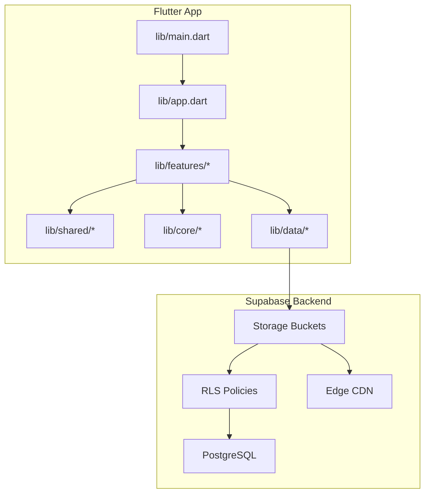
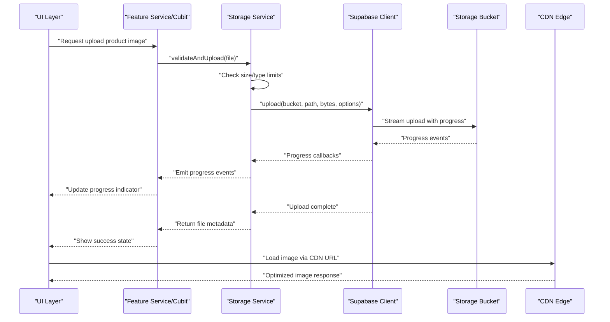
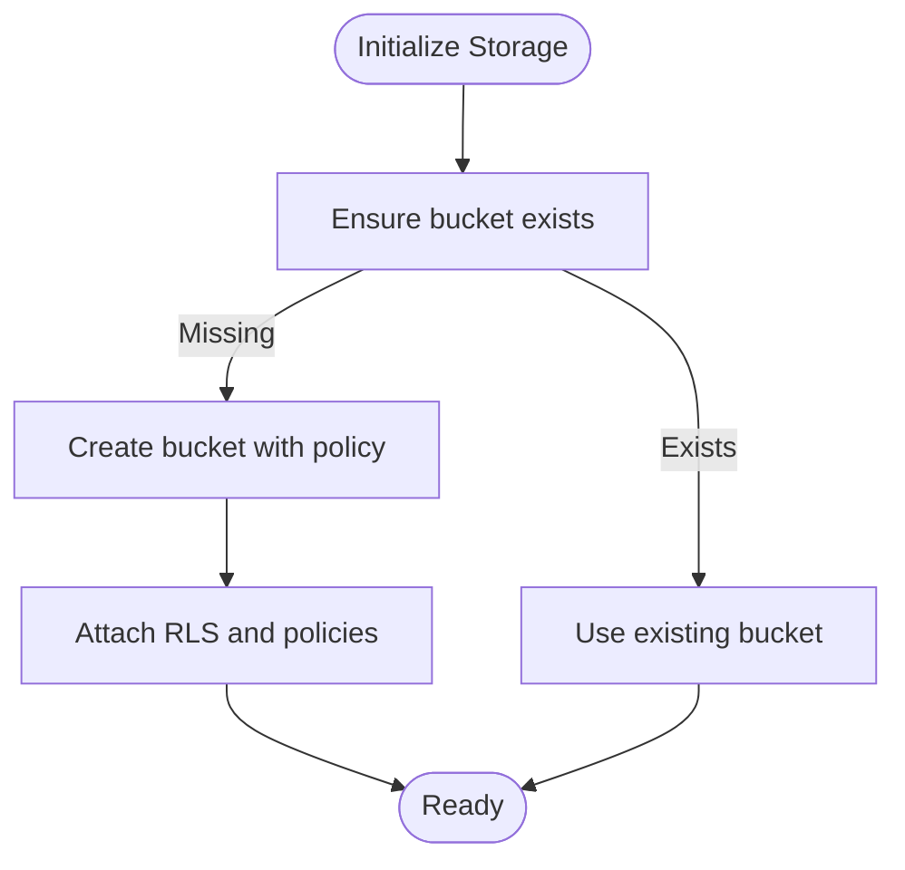
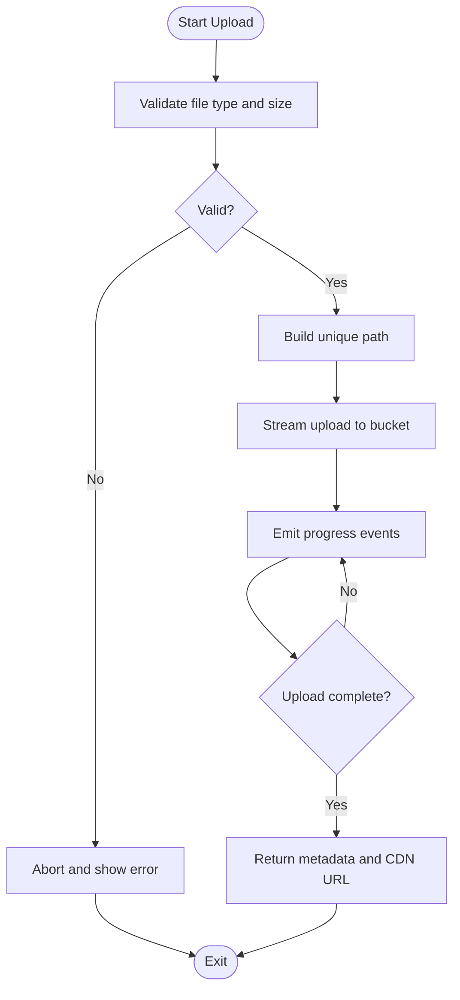
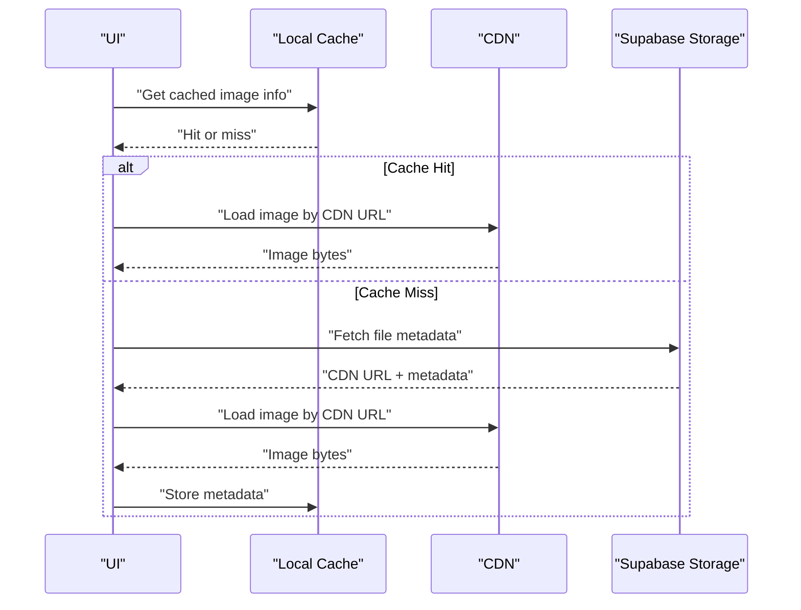
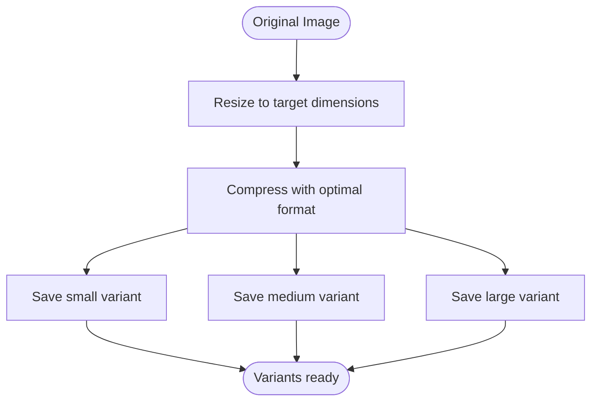
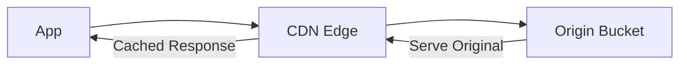
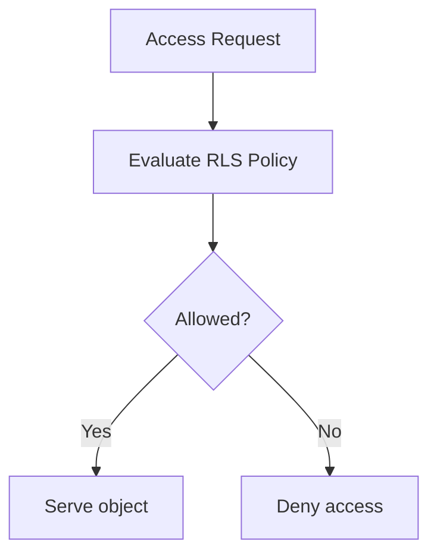
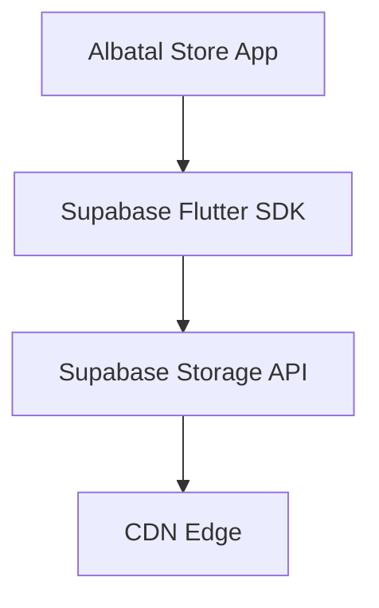

# File Storage & Media Management

<cite>
**Referenced Files in This Document**
- [supabase-integration.md](file://docs/supabase-integration.md)
- [005_storage_buckets.sql](file://supabase/migrations/005_storage_buckets.sql)
- [pubspec.yaml](file://pubspec.yaml)
- [main.dart](file://lib/main.dart)
- [app.dart](file://lib/app.dart)
</cite>

## Table of Contents
1. [Introduction](#introduction)
2. [Project Structure](#project-structure)
3. [Core Components](#core-components)
4. [Architecture Overview](#architecture-overview)
5. [Detailed Component Analysis](#detailed-component-analysis)
6. [Dependency Analysis](#dependency-analysis)
7. [Performance Considerations](#performance-considerations)
8. [Troubleshooting Guide](#troubleshooting-guide)
9. [Conclusion](#conclusion)

## Introduction
This document explains how Albatal Store integrates with Supabase Storage for file management and media handling. It covers storage bucket configuration, upload/download workflows, progress tracking, error handling, security policies, size limitations, content validation, image optimization, thumbnail generation, CDN integration, caching strategies, lazy loading, and bandwidth optimization. The goal is to provide a clear, actionable guide for developers implementing or extending media features in the app.

## Project Structure
The project follows a standard Flutter layout with feature modules under lib/features, shared utilities under lib/shared, core services under lib/core, and data access under lib/data. Supabase-related configuration and documentation are present in docs and migrations.

[No sources needed since this diagram shows conceptual workflow, not actual code structure]

**Section sources**
- [main.dart](file://lib/main.dart)
- [app.dart](file://lib/app.dart)

## Core Components
- Supabase client initialization and configuration: Ensure the Supabase client is initialized early in the app lifecycle and configured with correct project URL and anonymous/public keys.
- Storage service layer: A dedicated service encapsulates all storage operations (list, upload, download, delete) and exposes typed methods to UI and business logic layers.
- Upload pipeline: Validates input, enforces size/type limits, streams uploads with progress callbacks, and handles retries and errors.
- Download pipeline: Streams files, supports resume where applicable, caches metadata, and integrates with image decoders for thumbnails.
- Image optimization and thumbnails: Generates optimized variants and stores them alongside originals; uses CDN query parameters for on-the-fly resizing when available.
- Security and policies: Enforces RLS rules per bucket and path patterns; validates content types and sizes server-side as well as client-side.
- Caching and CDN: Leverages browser/native cache headers, ETag support, and CDN edge caching to reduce bandwidth and improve load times.

**Section sources**
- [supabase-integration.md](file://docs/supabase-integration.md)

## Architecture Overview
The app interacts with Supabase Storage via the official Supabase Flutter SDK. Requests flow from UI components through feature cubits/services to a storage service that calls Supabase APIs. Responses are streamed back with progress updates and transformed into domain models.

**Diagram sources**
- [supabase-integration.md](file://docs/supabase-integration.md)

## Detailed Component Analysis

### Storage Bucket Configuration
- Define buckets for different asset categories (e.g., products, avatars).
- Set public/private access based on sensitivity.
- Configure default metadata and CDN behavior.

**Diagram sources**
- [005_storage_buckets.sql](file://supabase/migrations/005_storage_buckets.sql)

**Section sources**
- [005_storage_buckets.sql](file://supabase/migrations/005_storage_buckets.sql)

### File Upload Workflow
- Input validation: type whitelist, max size, optional dimensions check.
- Path construction: deterministic paths using IDs or slugs to avoid collisions.
- Streaming upload: use stream-based API to handle large files efficiently.
- Progress tracking: emit incremental progress events to UI.
- Error handling: network errors, timeouts, permission denied, quota exceeded.
- Retry strategy: exponential backoff for transient failures.

**Diagram sources**
- [supabase-integration.md](file://docs/supabase-integration.md)

**Section sources**
- [supabase-integration.md](file://docs/supabase-integration.md)

### File Download and Media Asset Management
- Direct CDN URLs: prefer CDN links for images to leverage edge caching.
- Streaming downloads: for large assets, stream to disk or memory-mapped buffers.
- Thumbnail generation: create smaller variants for lists and previews.
- Metadata caching: store last-modified, ETag, and size locally to optimize re-fetches.

**Diagram sources**
- [supabase-integration.md](file://docs/supabase-integration.md)

**Section sources**
- [supabase-integration.md](file://docs/supabase-integration.md)

### Image Optimization and Thumbnails
- Generate multiple resolutions (e.g., small, medium, large) during upload.
- Use CDN transform parameters for on-demand resizing when supported.
- Prefer WebP/AVIF formats for better compression.
- Maintain aspect ratios and strip unnecessary EXIF data.

**Diagram sources**
- [supabase-integration.md](file://docs/supabase-integration.md)

**Section sources**
- [supabase-integration.md](file://docs/supabase-integration.md)

### CDN Integration
- Use CDN endpoints for public assets to reduce latency.
- Configure cache-control headers at bucket level.
- Enable gzip/brotli if supported by the backend.
- Invalidate cache selectively when necessary.

**Diagram sources**
- [supabase-integration.md](file://docs/supabase-integration.md)

**Section sources**
- [supabase-integration.md](file://docs/supabase-integration.md)

### Security Policies and Access Control
- Apply RLS policies to restrict who can read/write objects.
- Use path-based rules (e.g., /products/{productId}/...) to enforce ownership.
- Validate content types and sizes both client-side and server-side.
- Limit maximum file size and number of concurrent uploads.

**Diagram sources**
- [005_storage_buckets.sql](file://supabase/migrations/005_storage_buckets.sql)

**Section sources**
- [005_storage_buckets.sql](file://supabase/migrations/005_storage_buckets.sql)

### Size Limitations and Content Validation
- Enforce maximum file size per bucket or endpoint.
- Whitelist allowed MIME types (e.g., image/jpeg, image/png, image/webp).
- Reject malformed or unsafe payloads early.
- Provide user-friendly error messages and retry guidance.

**Section sources**
- [supabase-integration.md](file://docs/supabase-integration.md)

### Progress Tracking and Error Handling
- Emit periodic progress events during upload/download.
- Handle transient errors with retries and backoff.
- Surface meaningful errors to users (network issues, permissions, quota).
- Provide cancellation support for long-running operations.

**Section sources**
- [supabase-integration.md](file://docs/supabase-integration.md)

## Dependency Analysis
The app depends on the Supabase Flutter SDK for storage operations. Ensure dependencies are declared and versions pinned appropriately.

**Diagram sources**
- [pubspec.yaml](file://pubspec.yaml)

**Section sources**
- [pubspec.yaml](file://pubspec.yaml)

## Performance Considerations
- Lazy loading: Load images only when visible; use placeholders and skeleton loaders.
- Caching strategies: Cache metadata and images; respect ETag and cache-control headers.
- Bandwidth optimization: Use compressed formats, resize before upload, and serve appropriate sizes.
- Concurrency control: Limit simultaneous uploads to prevent throttling.
- Prefetching: Preload likely next images in galleries or carousels.

[No sources needed since this section provides general guidance]

## Troubleshooting Guide
Common issues and resolutions:
- Upload fails due to size limit: Verify client-side checks and bucket/server limits; compress or resize images.
- Permission denied: Review RLS policies and ensure authenticated context matches expected roles.
- Slow image loads: Confirm CDN URLs are used; check cache headers; verify image sizes and formats.
- Progress not updating: Ensure streaming upload is used and progress callbacks are wired correctly.
- Corrupted thumbnails: Validate encoding steps and ensure consistent aspect ratio handling.

**Section sources**
- [supabase-integration.md](file://docs/supabase-integration.md)

## Conclusion
By following the patterns outlined here—structured bucket configuration, robust upload/download pipelines, strong security policies, and performance-focused media handling—Albatal Store can deliver reliable, fast, and secure file management. Integrate these practices consistently across features to maintain a high-quality user experience.