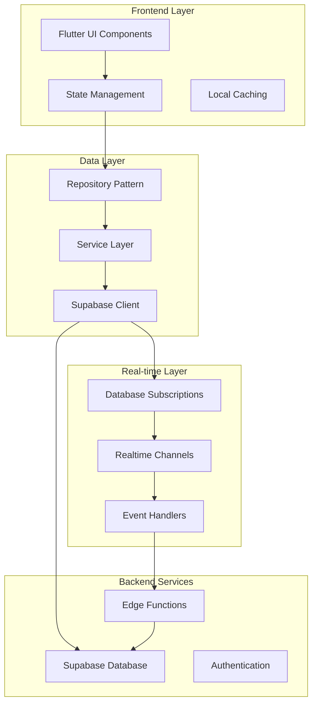
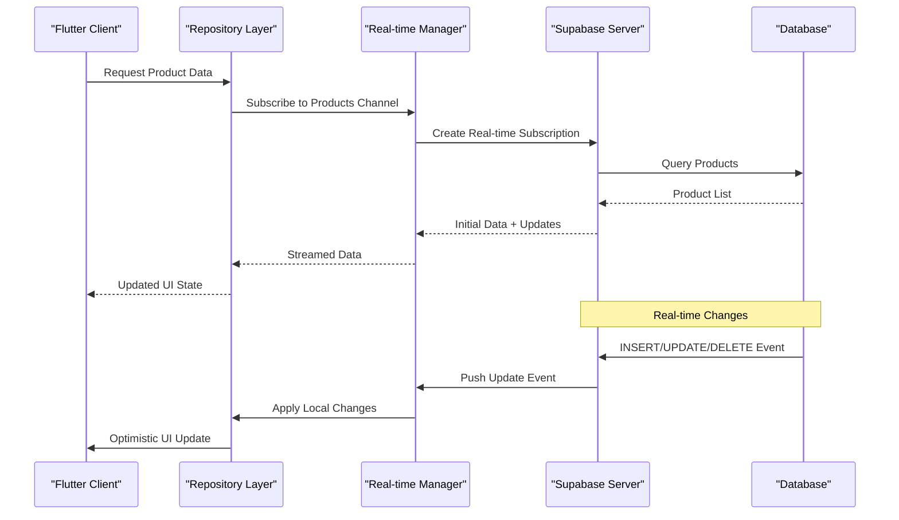
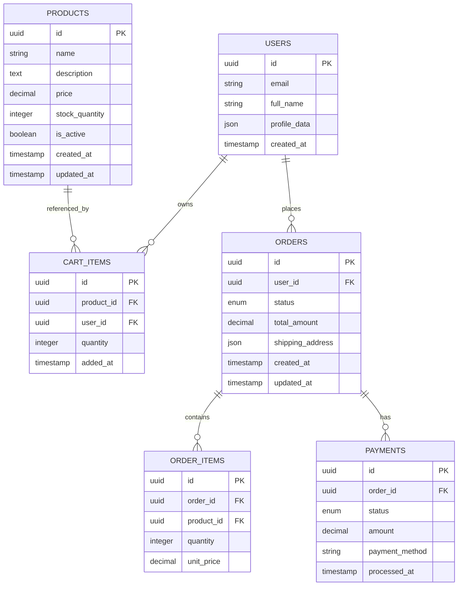
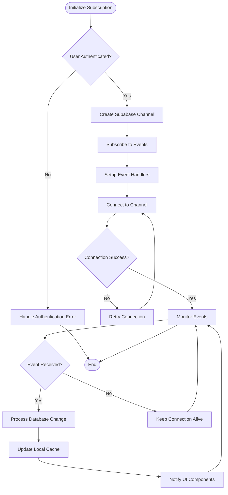
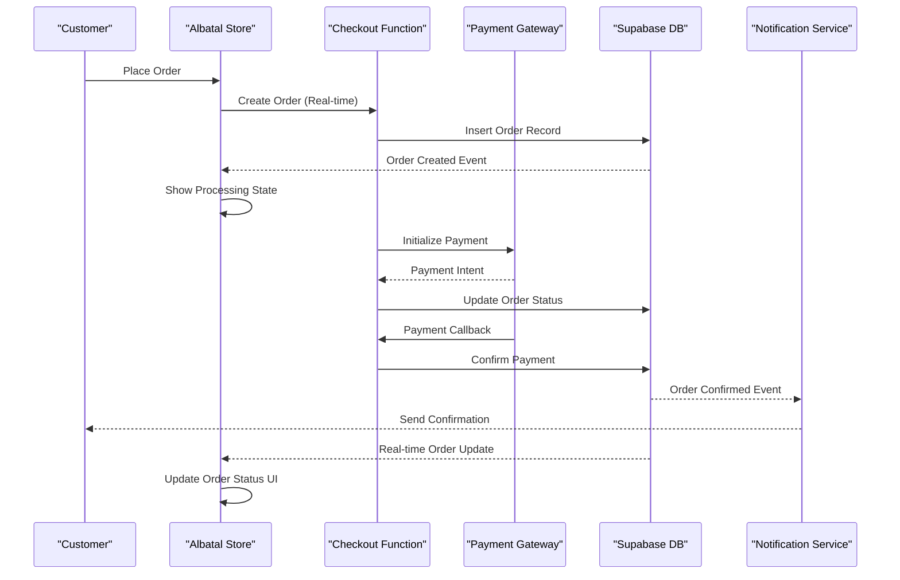
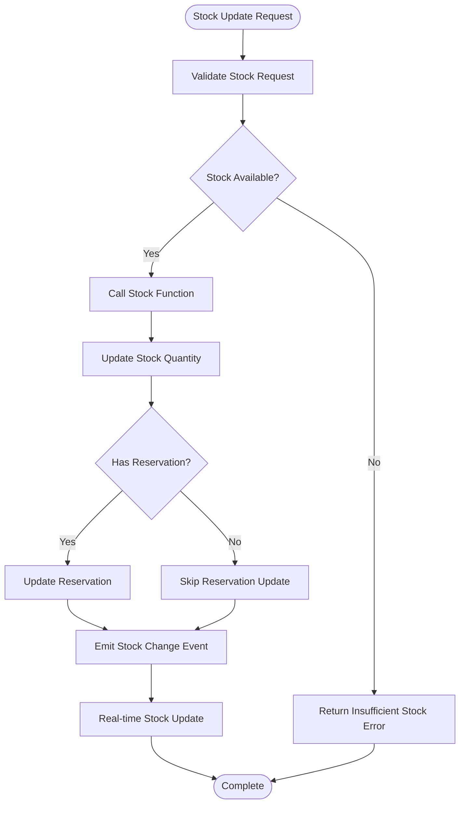
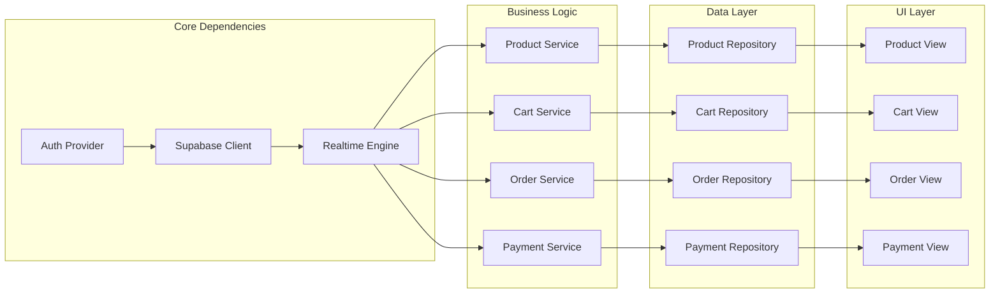

# Real-time Database & Data Synchronization

<cite>
**Referenced Files in This Document**
- [supabase-integration.md](file://docs/supabase-integration.md)
- [001_initial_schema.sql](file://supabase/migrations/001_initial_schema.sql)
- [002_rls_policies.sql](file://supabase/migrations/002_rls_policies.sql)
- [003_auth_profiles_and_hardening.sql](file://supabase/migrations/003_auth_profiles_and_hardening.sql)
- [004_stock_function.sql](file://supabase/migrations/004_stock_function.sql)
- [006_payments_table.sql](file://supabase/migrations/006_payments_table.sql)
- [008_order_fulfillment.sql](file://supabase/migrations/008_order_fulfillment.sql)
- [011_orders_idempotency_and_expiry.sql](file://supabase/migrations/011_orders_idempotency_and_expiry.sql)
- [cancel-expired-orders/index.ts](file://supabase/functions/cancel-expired-orders/index.ts)
- [checkout/index.ts](file://supabase/functions/checkout/index.ts)
- [send-order-notification/index.ts](file://supabase/functions/send-order-notification/index.ts)
</cite>

## Table of Contents
1. [Introduction](#introduction)
2. [Project Structure](#project-structure)
3. [Core Components](#core-components)
4. [Architecture Overview](#architecture-overview)
5. [Detailed Component Analysis](#detailed-component-analysis)
6. [Dependency Analysis](#dependency-analysis)
7. [Performance Considerations](#performance-considerations)
8. [Troubleshooting Guide](#troubleshooting-guide)
9. [Conclusion](#conclusion)

## Introduction

This document provides comprehensive documentation for real-time database integration and data synchronization patterns in Albatal Store. The application leverages Supabase as its backend infrastructure, implementing real-time capabilities through database subscriptions, optimistic updates, and conflict resolution mechanisms. The system supports real-time synchronization for products, cart items, orders, and payment processing with robust error handling and offline support patterns.

## Project Structure

The Albatal Store implements a feature-based architecture with clear separation between core functionality, data layer, and business features. The real-time database integration spans across multiple layers:

**Diagram sources**
- [supabase-integration.md:1-50](file://docs/supabase-integration.md#L1-L50)

**Section sources**
- [supabase-integration.md:1-100](file://docs/supabase-integration.md#L1-L100)

## Core Components

### Supabase Client Configuration

The Supabase client is configured with environment-specific settings, connection pooling, and retry mechanisms. The configuration includes authentication setup, real-time channel management, and error handling strategies.

### Database Schema Design

The database schema follows normalized design principles with proper indexing for real-time queries. Key tables include products, cart items, orders, users, and payment records with appropriate relationships and constraints.

### Real-time Subscription Management

The subscription system manages database changes through Supabase's real-time channels, providing automatic updates to connected clients without manual polling.

**Section sources**
- [supabase-integration.md:50-150](file://docs/supabase-integration.md#L50-L150)
- [001_initial_schema.sql:1-100](file://supabase/migrations/001_initial_schema.sql#L1-L100)

## Architecture Overview

The real-time architecture implements a pub-sub pattern with Supabase as the message broker, enabling bidirectional communication between clients and the database layer.

**Diagram sources**
- [supabase-integration.md:100-200](file://docs/supabase-integration.md#L100-L200)
- [001_initial_schema.sql:100-200](file://supabase/migrations/001_initial_schema.sql#L100-L200)

## Detailed Component Analysis

### Database Schema and Relationships

The database schema implements a comprehensive e-commerce model with real-time capabilities:

**Diagram sources**
- [001_initial_schema.sql:1-300](file://supabase/migrations/001_initial_schema.sql#L1-L300)
- [006_payments_table.sql:1-100](file://supabase/migrations/006_payments_table.sql#L1-L100)

### Real-time Subscription Implementation

The real-time subscription system manages database events through Supabase channels with automatic reconnection and error handling:

**Diagram sources**
- [supabase-integration.md:150-250](file://docs/supabase-integration.md#L150-L250)

### Order Processing Workflow

The order processing system integrates real-time updates with payment gateway callbacks:

**Diagram sources**
- [checkout/index.ts:1-200](file://supabase/functions/checkout/index.ts#L1-L200)
- [008_order_fulfillment.sql:1-150](file://supabase/migrations/008_order_fulfillment.sql#L1-L150)

### Stock Management System

The stock management system uses database functions to ensure inventory consistency during concurrent operations:

**Diagram sources**
- [004_stock_function.sql:1-100](file://supabase/migrations/004_stock_function.sql#L1-L100)
- [007_stock_increment_function.sql:1-100](file://supabase/migrations/007_stock_increment_function.sql#L1-L100)

## Dependency Analysis

The real-time system has well-defined dependencies between components:

**Diagram sources**
- [supabase-integration.md:200-300](file://docs/supabase-integration.md#L200-L300)

**Section sources**
- [supabase-integration.md:200-350](file://docs/supabase-integration.md#L200-L350)

## Performance Considerations

### Subscription Lifecycle Management

Efficient subscription management prevents memory leaks and reduces server load:

- **Automatic Cleanup**: Subscriptions are automatically disposed when widgets are destroyed
- **Connection Pooling**: Multiple subscriptions share a single WebSocket connection
- **Debounced Updates**: Rapid successive updates are batched to reduce UI rebuilds
- **Selective Subscriptions**: Only subscribe to relevant data subsets based on user context

### Data Pagination and Caching

- **Infinite Scrolling**: Implement cursor-based pagination for large datasets
- **Optimistic Updates**: Apply local state changes immediately before server confirmation
- **Conflict Resolution**: Use vector clocks or timestamps to resolve concurrent modifications
- **Cache Invalidation**: Invalidate cached data when related entities change

### Memory Management

- **Subscription Limits**: Cap the number of active subscriptions per user session
- **Data Pruning**: Remove unused data from local cache periodically
- **Lazy Loading**: Load detailed product information only when needed
- **Background Sync**: Queue operations when offline and sync when connectivity returns

## Troubleshooting Guide

### Real-time Connection Issues

Common problems and their solutions:

1. **Connection Drops**: Implement exponential backoff reconnection logic
2. **Authentication Failures**: Ensure token refresh before subscription creation
3. **Permission Errors**: Verify RLS policies allow read/write access
4. **Memory Leaks**: Monitor subscription count and implement cleanup strategies

### Data Synchronization Problems

1. **Stale Data**: Implement cache validation and forced refresh mechanisms
2. **Duplicate Records**: Use unique constraints and idempotent operations
3. **Lost Updates**: Implement version checking and conflict resolution
4. **Network Timeouts**: Set appropriate timeout values and fallback strategies

### Performance Bottlenecks

1. **Slow Queries**: Analyze query execution plans and add appropriate indexes
2. **Excessive Subscriptions**: Consolidate related subscriptions where possible
3. **Large Payloads**: Implement field selection and data compression
4. **UI Freezing**: Offload heavy computations to background isolates

**Section sources**
- [supabase-integration.md:300-400](file://docs/supabase-integration.md#L300-L400)

## Conclusion

The Albatal Store implements a robust real-time database integration using Supabase with comprehensive error handling, performance optimization, and offline support. The architecture ensures data consistency across multiple clients while maintaining responsive user interfaces through optimistic updates and efficient caching strategies. The system scales effectively with proper subscription management and database optimization techniques.