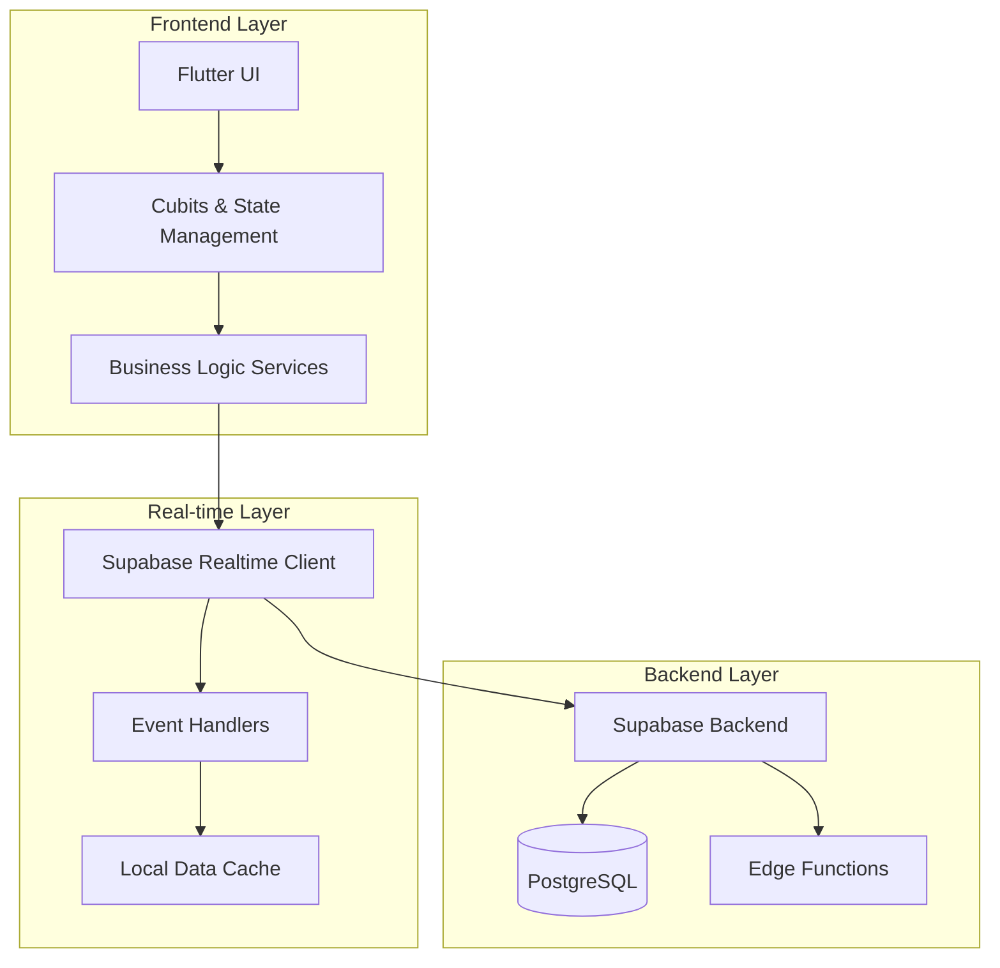
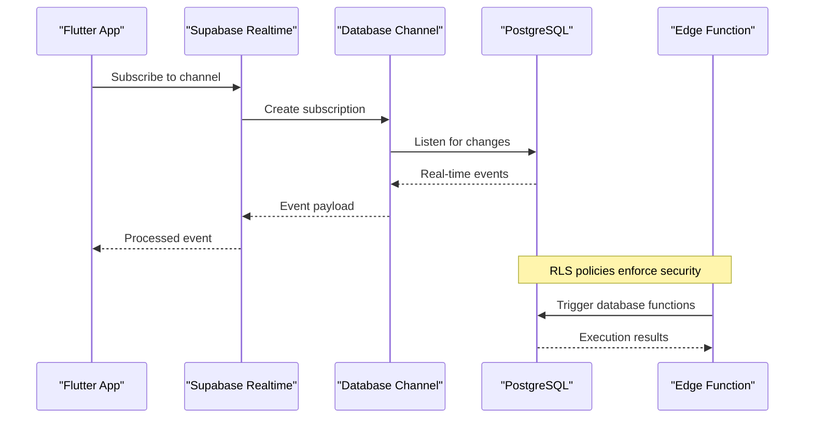
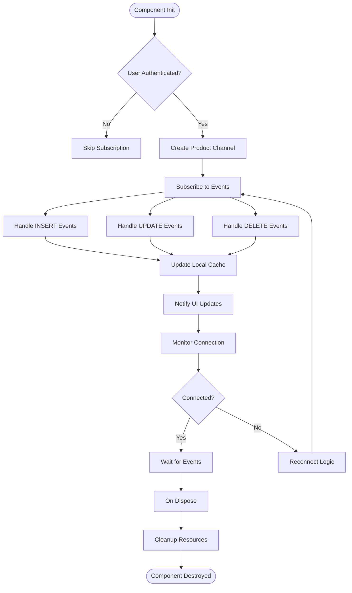
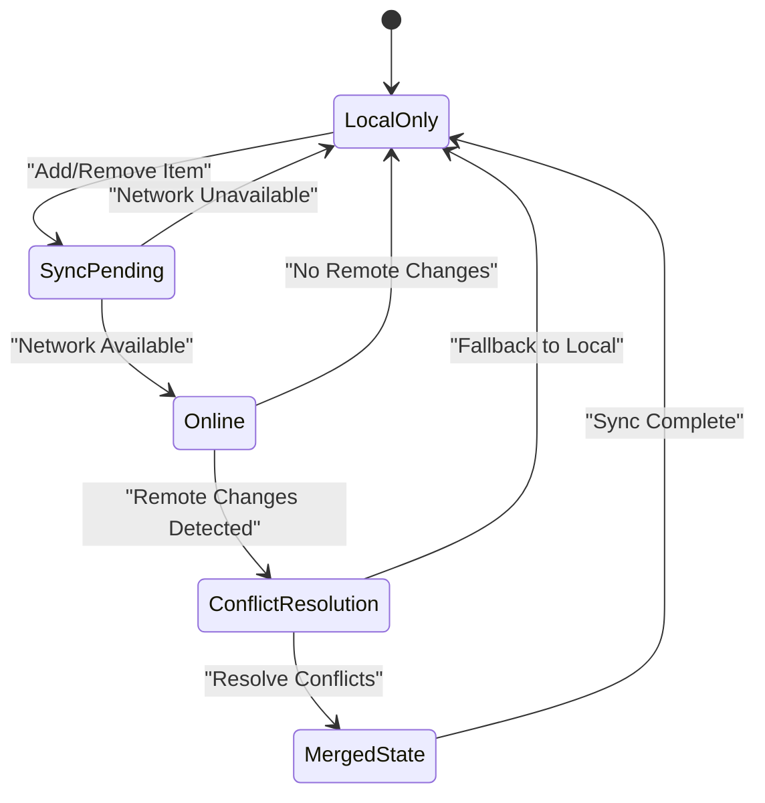
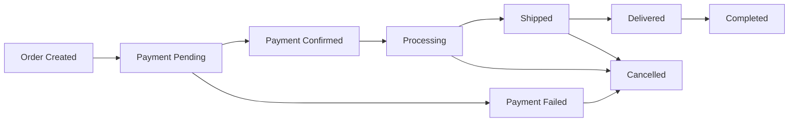
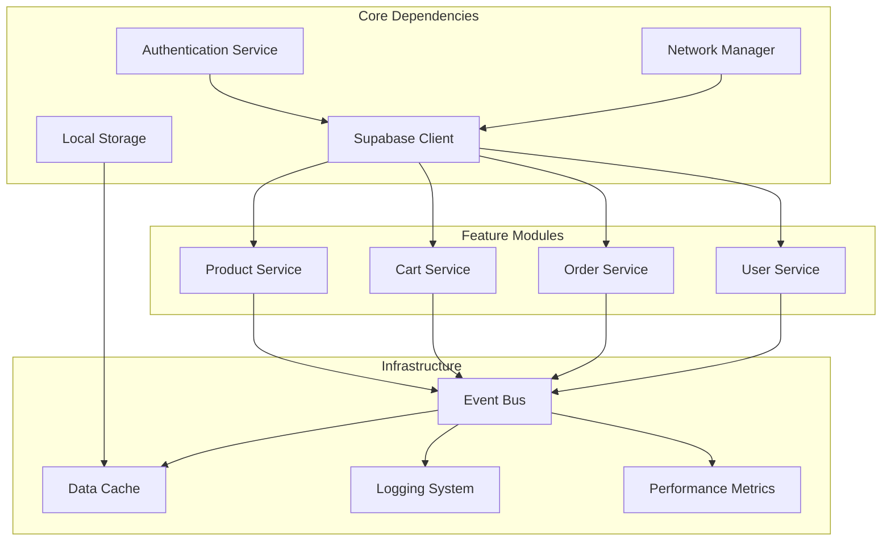
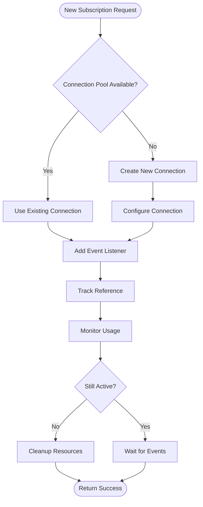

# Real-time Subscriptions & Listeners

<cite>
**Referenced Files in This Document**
- [supabase-integration.md](file://docs/supabase-integration.md)
- [main.dart](file://lib/main.dart)
- [app.dart](file://lib/app.dart)
- [001_initial_schema.sql](file://supabase/migrations/001_initial_schema.sql)
- [002_rls_policies.sql](file://supabase/migrations/002_rls_policies.sql)
- [008_order_fulfillment.sql](file://supabase/migrations/008_order_fulfillment.sql)
- [checkout/index.ts](file://supabase/functions/checkout/index.ts)
- [send-order-notification/index.ts](file://supabase/functions/send-order-notification/index.ts)
</cite>

## Table of Contents
1. [Introduction](#introduction)
2. [Project Structure](#project-structure)
3. [Core Components](#core-components)
4. [Architecture Overview](#architecture-overview)
5. [Detailed Component Analysis](#detailed-component-analysis)
6. [Dependency Analysis](#dependency-analysis)
7. [Performance Considerations](#performance-considerations)
8. [Troubleshooting Guide](#troubleshooting-guide)
9. [Conclusion](#conclusion)
10. [Appendices](#appendices)

## Introduction

This document provides comprehensive guidance for implementing real-time subscriptions and listeners in Albatal Store using Supabase's real-time capabilities. The implementation focuses on products, cart items, orders, and user data synchronization across multiple clients with proper lifecycle management, error handling, and performance optimization.

The real-time architecture enables instant updates for product catalog changes, cart synchronization between devices, order status tracking, and user profile updates without requiring manual polling or refresh operations.

## Project Structure

Albatal Store follows a feature-based architecture with clear separation of concerns:

**Diagram sources**
- [main.dart](file://lib/main.dart)
- [app.dart](file://lib/app.dart)
- [supabase-integration.md](file://docs/supabase-integration.md)

**Section sources**
- [supabase-integration.md](file://docs/supabase-integration.md)

## Core Components

### Supabase Real-time Client Configuration

The foundation of real-time functionality begins with proper client configuration and connection management. The Supabase client must be initialized with real-time capabilities enabled and configured for optimal performance.

Key configuration aspects include:
- Connection pooling and retry logic
- Authentication token management
- Channel subscription limits
- Error handling and reconnection strategies

### Event Handler Architecture

Event handlers serve as the bridge between Supabase real-time events and application state. Each handler is responsible for:
- Processing specific event types (INSERT, UPDATE, DELETE)
- Validating incoming data
- Updating local cache
- Triggering UI updates through state management

### State Synchronization Layer

The synchronization layer ensures consistency between remote and local data:
- Conflict resolution strategies
- Optimistic updates with rollback capability
- Batch processing for efficiency
- Offline-first data persistence

**Section sources**
- [supabase-integration.md](file://docs/supabase-integration.md)

## Architecture Overview

The real-time subscription architecture follows a pub-sub pattern with Supabase channels as the communication backbone:

**Diagram sources**
- [001_initial_schema.sql](file://supabase/migrations/001_initial_schema.sql)
- [002_rls_policies.sql](file://supabase/migrations/002_rls_policies.sql)
- [008_order_fulfillment.sql](file://supabase/migrations/008_order_fulfillment.sql)

## Detailed Component Analysis

### Product Catalog Subscriptions

Product catalog subscriptions enable real-time synchronization of product information including availability, pricing, and inventory levels.

#### Subscription Lifecycle Management

**Diagram sources**
- [001_initial_schema.sql](file://supabase/migrations/001_initial_schema.sql)

#### Product Event Processing

Product catalog events are processed through a centralized handler that manages:
- Inventory level validation against business rules
- Price change notifications
- Availability status updates
- Category and tag modifications

**Section sources**
- [001_initial_schema.sql](file://supabase/migrations/001_initial_schema.sql)

### Cart Items Synchronization

Cart synchronization ensures consistency across multiple devices and sessions while maintaining offline functionality.

#### Multi-device Cart Sync Strategy

#### Cart Event Types and Handling

Cart synchronization handles several event types:
- **Item Addition**: Validates stock availability and applies promotional pricing
- **Quantity Updates**: Recalculates totals and applies bulk discounts
- **Item Removal**: Triggers inventory release and wishlist suggestions
- **Cart Clear**: Resets all state and clears local storage

**Section sources**
- [001_initial_schema.sql](file://supabase/migrations/001_initial_schema.sql)

### Order Status Tracking

Order status tracking provides real-time visibility into order fulfillment progress with automatic notifications and UI updates.

#### Order Status Flow

#### Order Event Processing

Order events trigger multiple downstream processes:
- Payment gateway integration updates
- Inventory reservation adjustments
- Shipping label generation
- Customer notification dispatch
- Analytics and reporting updates

**Section sources**
- [008_order_fulfillment.sql](file://supabase/migrations/008_order_fulfillment.sql)

### User Data Synchronization

User data synchronization maintains consistency of profiles, preferences, and authentication state across sessions and devices.

#### User Profile Updates

User profile changes are synchronized with conflict resolution for concurrent edits:
- Profile information updates
- Address book modifications
- Preference and settings changes
- Notification preferences

#### Authentication State Management

Authentication state synchronization ensures consistent user experience:
- Session validation and renewal
- Permission changes propagation
- Role-based access control updates
- Security policy enforcement

**Section sources**
- [003_auth_profiles_and_hardening.sql](file://supabase/migrations/003_auth_profiles_and_hardening.sql)

## Dependency Analysis

The real-time subscription system has well-defined dependencies and interaction patterns:

**Diagram sources**
- [supabase-integration.md](file://docs/supabase-integration.md)
- [002_rls_policies.sql](file://supabase/migrations/002_rls_policies.sql)

**Section sources**
- [supabase-integration.md](file://docs/supabase-integration.md)
- [002_rls_policies.sql](file://supabase/migrations/002_rls_policies.sql)

## Performance Considerations

### Subscription Optimization Strategies

Efficient management of real-time subscriptions requires careful attention to resource usage and network efficiency:

#### Connection Pooling and Batching
- Implement connection pooling to reduce overhead
- Batch multiple updates when possible
- Use debouncing for high-frequency events
- Implement request coalescing for similar operations

#### Memory Management Best Practices
- Proper cleanup of subscription references
- Implement weak references for long-lived objects
- Monitor memory usage during extended sessions
- Clean up unused event handlers promptly

#### Network Efficiency
- Compress large payloads when possible
- Implement pagination for large datasets
- Use selective field projection to minimize data transfer
- Implement exponential backoff for reconnection attempts

### Concurrent Subscription Management

Managing multiple concurrent subscriptions efficiently:

**Diagram sources**
- [supabase-integration.md](file://docs/supabase-integration.md)

## Troubleshooting Guide

### Common Issues and Solutions

#### Connection Problems
- **Symptoms**: Frequent disconnections, delayed updates
- **Causes**: Network instability, server overload, firewall restrictions
- **Solutions**: Implement retry logic, adjust timeout settings, configure proxy support

#### Memory Leaks
- **Symptoms**: Increasing memory usage over time, app crashes
- **Causes**: Unclosed subscriptions, circular references, event handler accumulation
- **Solutions**: Implement proper cleanup, use weak references, monitor memory usage

#### Data Inconsistency
- **Symptoms**: Conflicting data states, missing updates
- **Causes**: Race conditions, incomplete transactions, network partitions
- **Solutions**: Implement optimistic locking, conflict resolution strategies, transaction boundaries

#### Performance Degradation
- **Symptoms**: Slow UI updates, high CPU usage
- **Causes**: Excessive subscriptions, inefficient event processing, blocking operations
- **Solutions**: Optimize subscription scope, implement lazy loading, use background processing

### Debugging Techniques

#### Logging and Monitoring
- Implement structured logging for all subscription events
- Track connection health metrics
- Monitor memory usage patterns
- Log performance bottlenecks

#### Testing Strategies
- Mock Supabase connections for unit tests
- Simulate network failures and reconnections
- Test concurrent update scenarios
- Validate data consistency under stress

**Section sources**
- [supabase-integration.md](file://docs/supabase-integration.md)

## Conclusion

Implementing robust real-time subscriptions in Albatal Store requires careful consideration of architecture, performance, and reliability. By following the patterns and best practices outlined in this document, developers can create responsive, scalable applications that provide seamless real-time experiences for users.

Key takeaways include:
- Proper subscription lifecycle management prevents memory leaks
- Efficient event processing maintains UI responsiveness
- Robust error handling ensures application stability
- Performance optimization techniques scale to large user bases
- Comprehensive testing validates real-time behavior under various conditions

The modular architecture allows for easy extension to additional features while maintaining consistency and reliability across the application.

## Appendices

### A. Migration References

The database schema migrations define the structure that real-time subscriptions operate on:

- **Initial Schema**: Core tables and relationships
- **RLS Policies**: Row-level security for data protection
- **Order Fulfillment**: Order processing workflows
- **Authentication**: User management and permissions

### B. Edge Functions Integration

Real-time functionality integrates with Supabase edge functions for complex business logic:

- **Checkout Processing**: Payment validation and order creation
- **Notification Dispatch**: Email and push notification sending
- **Analytics Collection**: User behavior and performance metrics
- **External API Integration**: Third-party service communication

**Section sources**
- [checkout/index.ts](file://supabase/functions/checkout/index.ts)
- [send-order-notification/index.ts](file://supabase/functions/send-order-notification/index.ts)