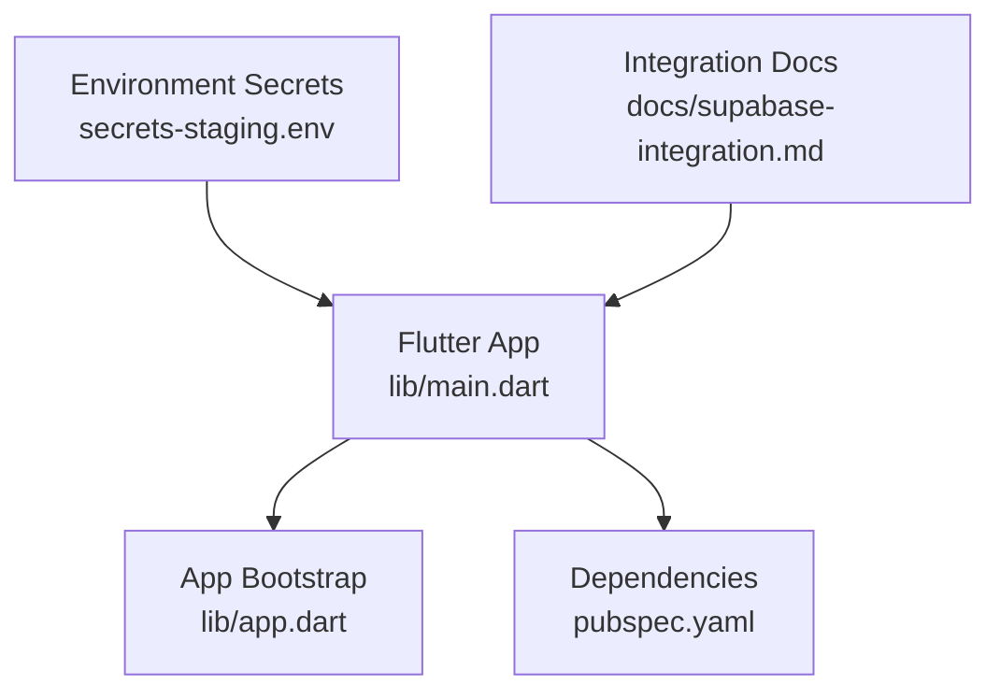
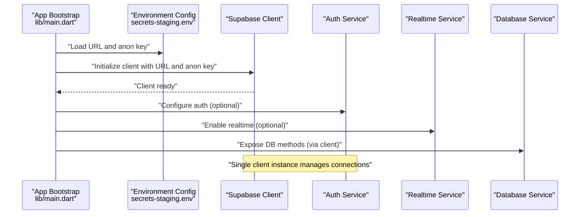
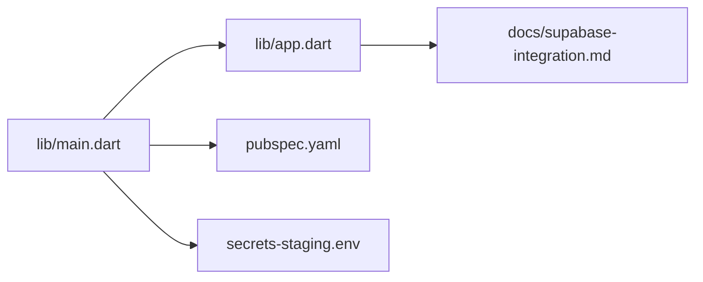

# Supabase Client Configuration & Setup

<cite>
**Referenced Files in This Document**
- [README.md](file://README.md)
- [supabase-integration.md](file://docs/supabase-integration.md)
- [secrets-staging.env](file://secrets-staging.env)
- [pubspec.yaml](file://pubspec.yaml)
- [main.dart](file://lib/main.dart)
- [app.dart](file://lib/app.dart)
</cite>

## Table of Contents
1. [Introduction](#introduction)
2. [Project Structure](#project-structure)
3. [Core Components](#core-components)
4. [Architecture Overview](#architecture-overview)
5. [Detailed Component Analysis](#detailed-component-analysis)
6. [Dependency Analysis](#dependency-analysis)
7. [Performance Considerations](#performance-considerations)
8. [Troubleshooting Guide](#troubleshooting-guide)
9. [Conclusion](#conclusion)
10. [Appendices](#appendices)

## Introduction
This document explains how the Albatal Store project configures and initializes the Supabase client, including environment setup, instantiation patterns, connection management, authentication configuration, database parameters, real-time subscriptions, security considerations, troubleshooting, and performance optimization. It is intended for developers who need to understand or extend the Supabase integration within this Flutter application.

## Project Structure
The Supabase-related configuration and documentation are primarily located under:
- docs/supabase-integration.md: Integration overview and guidance
- secrets-staging.env: Environment-specific secrets (e.g., staging keys)
- pubspec.yaml: Declares dependencies such as the Supabase Flutter SDK
- lib/main.dart and lib/app.dart: Application bootstrap where initialization typically occurs

**Diagram sources**
- [main.dart](file://lib/main.dart)
- [app.dart](file://lib/app.dart)
- [pubspec.yaml](file://pubspec.yaml)
- [secrets-staging.env](file://secrets-staging.env)
- [supabase-integration.md](file://docs/supabase-integration.md)

**Section sources**
- [README.md](file://README.md)
- [supabase-integration.md](file://docs/supabase-integration.md)
- [secrets-staging.env](file://secrets-staging.env)
- [pubspec.yaml](file://pubspec.yaml)
- [main.dart](file://lib/main.dart)
- [app.dart](file://lib/app.dart)

## Core Components
- Environment configuration:
  - Use environment files to store Supabase URL and anon key per target (development, staging, production).
  - Reference the provided staging secrets file as an example of secret placement.
- Dependency declaration:
  - Ensure the Supabase Flutter SDK is declared in the project’s dependency manifest.
- Initialization entry points:
  - The app bootstrap files are typical locations to initialize the Supabase client before running the UI.

Key responsibilities:
- Load environment variables securely.
- Instantiate a single shared Supabase client instance.
- Configure auth, realtime, and storage options if needed.
- Provide the client to feature modules via dependency injection or a global accessor.

**Section sources**
- [secrets-staging.env](file://secrets-staging.env)
- [pubspec.yaml](file://pubspec.yaml)
- [main.dart](file://lib/main.dart)
- [app.dart](file://lib/app.dart)

## Architecture Overview
At runtime, the Flutter app loads environment configuration, creates a Supabase client with appropriate settings, and exposes it to features that require database access, authentication, or real-time updates.

**Diagram sources**
- [main.dart](file://lib/main.dart)
- [app.dart](file://lib/app.dart)
- [secrets-staging.env](file://secrets-staging.env)

## Detailed Component Analysis

### Environment Setup
- Place Supabase credentials in environment files:
  - Use separate files for different targets (e.g., development, staging, production).
  - The repository includes a staging secrets file as a reference for secret layout.
- Recommended variables:
  - SUPABASE_URL: Base URL of your Supabase project.
  - SUPABASE_ANON_KEY: Public anon key used by the client.
- Security practices:
  - Never commit secrets to version control.
  - Use platform-specific secret loading mechanisms at build time or runtime.
  - Rotate keys regularly and restrict permissions using Supabase policies.

**Section sources**
- [secrets-staging.env](file://secrets-staging.env)

### Dependencies
- Declare the Supabase Flutter SDK in the project manifest to ensure availability across the app.
- Keep the SDK version pinned to avoid unexpected breaking changes.

**Section sources**
- [pubspec.yaml](file://pubspec.yaml)

### Client Instantiation Patterns
- Single-instance pattern:
  - Create one Supabase client during app startup and reuse it throughout the app lifecycle.
- Where to initialize:
  - Typical location is the main entry point or app bootstrap file.
- What to configure:
  - URL and anon key are required.
  - Optional: auth persistence, realtime channels, storage bucket defaults.

Best practices:
- Initialize after environment variables are loaded.
- Avoid re-initializing the client on each screen; share a single instance.
- Wrap initialization with error handling to fail fast when configuration is invalid.

**Section sources**
- [main.dart](file://lib/main.dart)
- [app.dart](file://lib/app.dart)

### Authentication Setup
- Use the anon key for unauthenticated operations and switch to user tokens when authenticated.
- Configure auth persistence according to platform capabilities (e.g., secure storage).
- Handle session events to update UI state and guard routes.

Security notes:
- Prefer server-side validation and RLS policies for sensitive data.
- Do not embed service role keys in the client.

**Section sources**
- [supabase-integration.md](file://docs/supabase-integration.md)

### Database Connection Parameters
- Required:
  - URL and anon key.
- Optional:
  - Headers for custom behavior.
  - Timeout and retry policies if supported by the SDK.
- Realtime:
  - Enable/disable realtime channels based on feature needs.
  - Manage channel subscriptions per feature scope.

**Section sources**
- [supabase-integration.md](file://docs/supabase-integration.md)

### Real-time Subscription Settings
- Subscribe to tables or functions as needed.
- Unsubscribe when leaving screens to free resources.
- Implement reconnection logic and backoff strategies if necessary.

**Section sources**
- [supabase-integration.md](file://docs/supabase-integration.md)

### Error Handling and Connection Lifecycle
- Validate environment variables early and surface clear errors.
- Catch network and auth errors at the client layer.
- Gracefully degrade UI when offline or when Supabase is unreachable.
- Close subscriptions and release resources on dispose.

**Section sources**
- [main.dart](file://lib/main.dart)
- [app.dart](file://lib/app.dart)

## Dependency Analysis
The following diagram shows how the app depends on the Supabase SDK and environment configuration.

**Diagram sources**
- [main.dart](file://lib/main.dart)
- [app.dart](file://lib/app.dart)
- [pubspec.yaml](file://pubspec.yaml)
- [secrets-staging.env](file://secrets-staging.env)
- [supabase-integration.md](file://docs/supabase-integration.md)

**Section sources**
- [pubspec.yaml](file://pubspec.yaml)
- [main.dart](file://lib/main.dart)
- [app.dart](file://lib/app.dart)
- [secrets-staging.env](file://secrets-staging.env)
- [supabase-integration.md](file://docs/supabase-integration.md)

## Performance Considerations
- Reuse a single Supabase client instance to minimize overhead.
- Limit realtime subscriptions to only what is needed and unsubscribe promptly.
- Batch operations where possible and use efficient queries.
- Cache frequently accessed data locally to reduce network calls.
- Monitor connection health and implement exponential backoff for retries.

[No sources needed since this section provides general guidance]

## Troubleshooting Guide
Common issues and resolutions:
- Missing or incorrect environment variables:
  - Verify SUPABASE_URL and SUPABASE_ANON_KEY are set and correct for the current target.
- Network connectivity problems:
  - Check device network status and firewall rules.
  - Test endpoints from a browser or curl to confirm reachability.
- Authentication failures:
  - Ensure the anon key has sufficient permissions and RLS policies are configured.
  - Confirm session persistence is enabled and working on the platform.
- Realtime subscription drops:
  - Implement reconnection logic and verify channel names and filters.
- Excessive resource usage:
  - Audit subscriptions and ensure they are disposed when no longer needed.

**Section sources**
- [secrets-staging.env](file://secrets-staging.env)
- [supabase-integration.md](file://docs/supabase-integration.md)

## Conclusion
By centralizing Supabase configuration in environment files, initializing a single client at app startup, and carefully managing authentication, realtime subscriptions, and error handling, the Albatal Store achieves a robust and maintainable backend integration. Follow the security and performance recommendations to keep the app resilient and efficient.

[No sources needed since this section summarizes without analyzing specific files]

## Appendices

### Appendix A: Environment Variables Reference
- SUPABASE_URL: Base URL of your Supabase project.
- SUPABASE_ANON_KEY: Public anon key used by the client.

**Section sources**
- [secrets-staging.env](file://secrets-staging.env)

### Appendix B: Checklist for Safe Deployment
- Pin SDK versions in the dependency manifest.
- Store secrets outside version control.
- Validate configuration at startup and fail fast on invalid values.
- Enable RLS policies and audit permissions.
- Add monitoring and logging for connection and auth events.

**Section sources**
- [pubspec.yaml](file://pubspec.yaml)
- [supabase-integration.md](file://docs/supabase-integration.md)