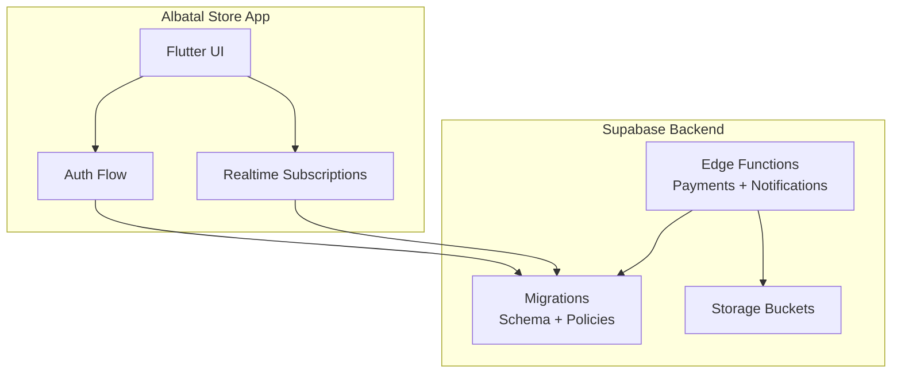
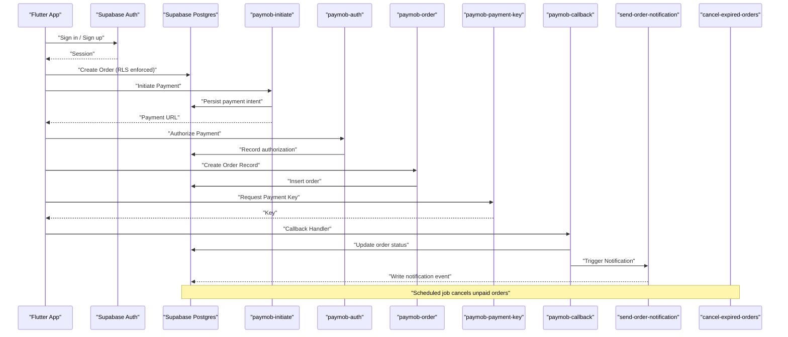
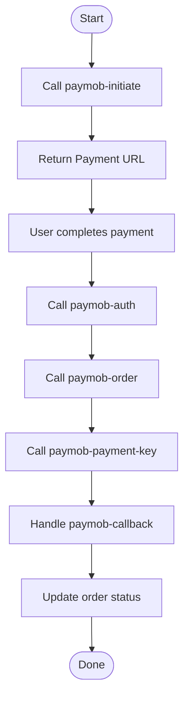
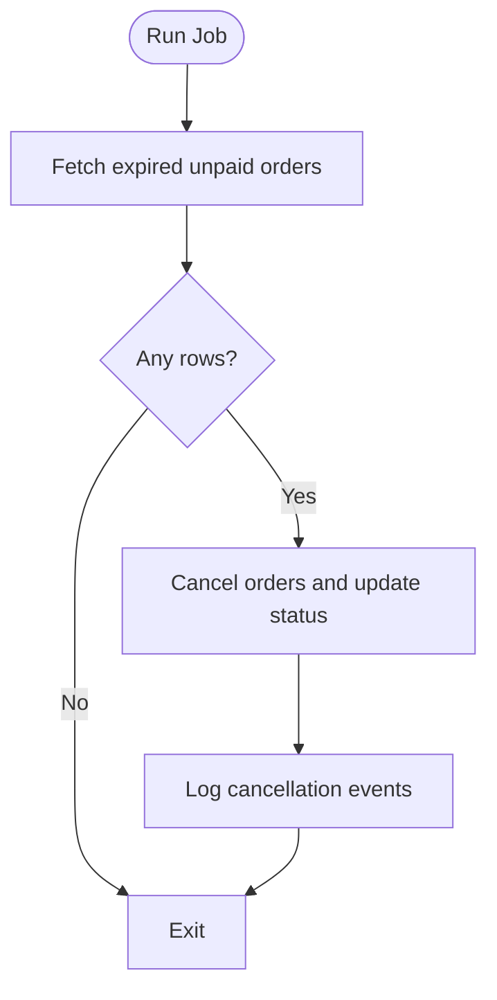
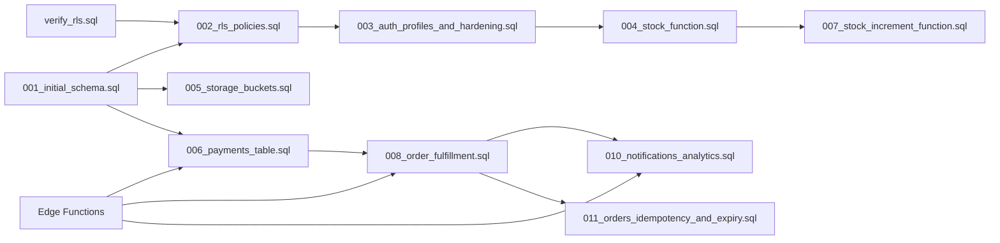

# Supabase Integration

<cite>
**Referenced Files in This Document**
- [README.md](file://README.md)
- [supabase-integration.md](file://docs/supabase-integration.md)
- [001_initial_schema.sql](file://supabase/migrations/001_initial_schema.sql)
- [002_rls_policies.sql](file://supabase/migrations/002_rls_policies.sql)
- [003_auth_profiles_and_hardening.sql](file://supabase/migrations/003_auth_profiles_and_hardening.sql)
- [004_stock_function.sql](file://supabase/migrations/004_stock_function.sql)
- [005_storage_buckets.sql](file://supabase/migrations/005_storage_buckets.sql)
- [006_payments_table.sql](file://supabase/migrations/006_payments_table.sql)
- [007_stock_increment_function.sql](file://supabase/migrations/007_stock_increment_function.sql)
- [008_order_fulfillment.sql](file://supabase/migrations/008_order_fulfillment.sql)
- [009_shipping_zones.sql](file://supabase/migrations/009_shipping_zones.sql)
- [010_notifications_analytics.sql](file://supabase/migrations/010_notifications_analytics.sql)
- [011_orders_idempotency_and_expiry.sql](file://supabase/migrations/011_orders_idempotency_and_expiry.sql)
- [verify_rls.sql](file://supabase/migrations/verify_rls.sql)
- [index.ts (cancel-expired-orders)](file://supabase/functions/cancel-expired-orders/index.ts)
- [index.ts (checkout)](file://supabase/functions/checkout/index.ts)
- [index.ts (paymob-auth)](file://supabase/functions/paymob-auth/index.ts)
- [index.ts (paymob-callback)](file://supabase/functions/paymob-callback/index.ts)
- [index.ts (paymob-initiate)](file://supabase/functions/paymob-initiate/index.ts)
- [index.ts (paymob-order)](file://supabase/functions/paymob-order/index.ts)
- [index.ts (paymob-payment-key)](file://supabase/functions/paymob-payment-key/index.ts)
- [index.ts (send-order-notification)](file://supabase/functions/send-order-notification/index.ts)
</cite>

## Table of Contents
1. [Introduction](#introduction)
2. [Project Structure](#project-structure)
3. [Core Components](#core-components)
4. [Architecture Overview](#architecture-overview)
5. [Detailed Component Analysis](#detailed-component-analysis)
6. [Dependency Analysis](#dependency-analysis)
7. [Performance Considerations](#performance-considerations)
8. [Troubleshooting Guide](#troubleshooting-guide)
9. [Conclusion](#conclusion)
10. [Appendices](#appendices)

## Introduction
This document explains how the Albatal Store integrates with Supabase across authentication, real-time database subscriptions, storage, and edge functions. It focuses on:
- Authentication setup using Supabase Auth
- Real-time data synchronization patterns
- File storage management
- Edge functions for payment processing, order notifications, and background jobs
- Security considerations including RLS policies and function permissions
- Performance optimization and error handling strategies
- Troubleshooting and monitoring approaches

Where applicable, this guide references concrete files in the repository to ground explanations in actual implementation details.

## Project Structure
The Supabase integration spans three main areas:
- Migrations under supabase/migrations defining schema, RLS policies, storage buckets, and functions
- Edge functions under supabase/functions implementing server-side logic for payments, notifications, and scheduled tasks
- Application documentation describing integration approach and usage

[No sources needed since this diagram shows conceptual workflow, not actual code structure]

## Core Components
- Authentication: User sign-up, login, session management via Supabase Auth.
- Database: Relational tables defined by migrations; access controlled by RLS policies.
- Realtime: Live updates for key entities such as orders and stock.
- Storage: Bucket-based file storage for images and documents.
- Edge Functions: Serverless endpoints for secure payment orchestration and notifications.

Key configuration and integration guidance are documented in the project’s Supabase integration notes.

**Section sources**
- [supabase-integration.md](file://docs/supabase-integration.md)

## Architecture Overview
The application uses Supabase as a unified backend for auth, data, realtime, storage, and serverless functions. The following sequence illustrates a typical checkout flow involving multiple edge functions and database interactions.

**Diagram sources**
- [index.ts (paymob-initiate)](file://supabase/functions/paymob-initiate/index.ts)
- [index.ts (paymob-auth)](file://supabase/functions/paymob-auth/index.ts)
- [index.ts (paymob-order)](file://supabase/functions/paymob-order/index.ts)
- [index.ts (paymob-payment-key)](file://supabase/functions/paymob-payment-key/index.ts)
- [index.ts (paymob-callback)](file://supabase/functions/paymob-callback/index.ts)
- [index.ts (send-order-notification)](file://supabase/functions/send-order-notification/index.ts)
- [index.ts (cancel-expired-orders)](file://supabase/functions/cancel-expired-orders/index.ts)
- [006_payments_table.sql](file://supabase/migrations/006_payments_table.sql)
- [008_order_fulfillment.sql](file://supabase/migrations/008_order_fulfillment.sql)
- [011_orders_idempotency_and_expiry.sql](file://supabase/migrations/011_orders_idempotency_and_expiry.sql)

## Detailed Component Analysis

### Authentication Setup
- Purpose: Manage user identity and sessions securely.
- Typical flow:
  - Initialize client with environment values.
  - Handle sign-in/sign-up and persist session state.
  - Protect routes based on authenticated state.
- Security:
  - Enforce RLS policies on all tables.
  - Use JWT claims from Supabase Auth to scope data access.

**Section sources**
- [supabase-integration.md](file://docs/supabase-integration.md)
- [003_auth_profiles_and_hardening.sql](file://supabase/migrations/003_auth_profiles_and_hardening.sql)

### Real-time Database Subscriptions
- Purpose: Keep UI synchronized with backend changes without polling.
- Common patterns:
  - Subscribe to table changes for orders, stock, and inventory.
  - Filter by user or tenant context using RLS.
  - Debounce or batch updates for performance.
- Data integrity:
  - Use triggers and functions to maintain consistency during mutations.

**Section sources**
- [004_stock_function.sql](file://supabase/migrations/004_stock_function.sql)
- [007_stock_increment_function.sql](file://supabase/migrations/007_stock_increment_function.sql)
- [008_order_fulfillment.sql](file://supabase/migrations/008_order_fulfillment.sql)
- [010_notifications_analytics.sql](file://supabase/migrations/010_notifications_analytics.sql)

### File Storage Management
- Purpose: Store product images, receipts, and other assets.
- Patterns:
  - Define buckets and policies per bucket.
  - Upload/download via signed URLs or direct calls when permitted.
  - Validate content types and sizes server-side where possible.

**Section sources**
- [005_storage_buckets.sql](file://supabase/migrations/005_storage_buckets.sql)

### Edge Functions Architecture

#### Payments Orchestration
- paymob-initiate: Starts a payment session and returns a payment URL.
- paymob-auth: Authorizes a payment after user interaction.
- paymob-order: Creates an order record upon successful authorization.
- paymob-payment-key: Retrieves a dynamic payment key for the client.
- paymob-callback: Handles provider callbacks and updates order status.

**Diagram sources**
- [index.ts (paymob-initiate)](file://supabase/functions/paymob-initiate/index.ts)
- [index.ts (paymob-auth)](file://supabase/functions/paymob-auth/index.ts)
- [index.ts (paymob-order)](file://supabase/functions/paymob-order/index.ts)
- [index.ts (paymob-payment-key)](file://supabase/functions/paymob-payment-key/index.ts)
- [index.ts (paymob-callback)](file://supabase/functions/paymob-callback/index.ts)
- [006_payments_table.sql](file://supabase/migrations/006_payments_table.sql)
- [008_order_fulfillment.sql](file://supabase/migrations/008_order_fulfillment.sql)

**Section sources**
- [index.ts (paymob-initiate)](file://supabase/functions/paymob-initiate/index.ts)
- [index.ts (paymob-auth)](file://supabase/functions/paymob-auth/index.ts)
- [index.ts (paymob-order)](file://supabase/functions/paymob-order/index.ts)
- [index.ts (paymob-payment-key)](file://supabase/functions/paymob-payment-key/index.ts)
- [index.ts (paymob-callback)](file://supabase/functions/paymob-callback/index.ts)
- [006_payments_table.sql](file://supabase/migrations/006_payments_table.sql)
- [008_order_fulfillment.sql](file://supabase/migrations/008_order_fulfillment.sql)

#### Order Notifications
- send-order-notification: Emits events or writes records for downstream consumers (e.g., email/SMS).
- Integrates with analytics and notification tables.

**Section sources**
- [index.ts (send-order-notification)](file://supabase/functions/send-order-notification/index.ts)
- [010_notifications_analytics.sql](file://supabase/migrations/010_notifications_analytics.sql)

#### Background Jobs
- cancel-expired-orders: Periodically cancels unpaid orders beyond a threshold.
- Uses idempotency and expiry fields to avoid duplicate work.

**Diagram sources**
- [index.ts (cancel-expired-orders)](file://supabase/functions/cancel-expired-orders/index.ts)
- [011_orders_idempotency_and_expiry.sql](file://supabase/migrations/011_orders_idempotency_and_expiry.sql)

**Section sources**
- [index.ts (cancel-expired-orders)](file://supabase/functions/cancel-expired-orders/index.ts)
- [011_orders_idempotency_and_expiry.sql](file://supabase/migrations/011_orders_idempotency_and_expiry.sql)

### Security Considerations
- RLS Policies:
  - Enforce row-level security on all tables.
  - Base policies on authenticated user IDs and roles.
- Function Permissions:
  - Use service role keys only within trusted edge functions.
  - Validate inputs and enforce business rules server-side.
- Data Access Patterns:
  - Prefer functions for sensitive operations (payments, stock adjustments).
  - Avoid exposing internal identifiers to clients.

**Section sources**
- [002_rls_policies.sql](file://supabase/migrations/002_rls_policies.sql)
- [003_auth_profiles_and_hardening.sql](file://supabase/migrations/003_auth_profiles_and_hardening.sql)
- [verify_rls.sql](file://supabase/migrations/verify_rls.sql)

## Dependency Analysis
The Supabase integration depends on:
- Schema and policies defined in migrations
- Edge functions that mutate data and interact with external payment providers
- Realtime channels driven by table changes

**Diagram sources**
- [001_initial_schema.sql](file://supabase/migrations/001_initial_schema.sql)
- [002_rls_policies.sql](file://supabase/migrations/002_rls_policies.sql)
- [003_auth_profiles_and_hardening.sql](file://supabase/migrations/003_auth_profiles_and_hardening.sql)
- [004_stock_function.sql](file://supabase/migrations/004_stock_function.sql)
- [005_storage_buckets.sql](file://supabase/migrations/005_storage_buckets.sql)
- [006_payments_table.sql](file://supabase/migrations/006_payments_table.sql)
- [007_stock_increment_function.sql](file://supabase/migrations/007_stock_increment_function.sql)
- [008_order_fulfillment.sql](file://supabase/migrations/008_order_fulfillment.sql)
- [009_shipping_zones.sql](file://supabase/migrations/009_shipping_zones.sql)
- [010_notifications_analytics.sql](file://supabase/migrations/010_notifications_analytics.sql)
- [011_orders_idempotency_and_expiry.sql](file://supabase/migrations/011_orders_idempotency_and_expiry.sql)
- [verify_rls.sql](file://supabase/migrations/verify_rls.sql)

**Section sources**
- [001_initial_schema.sql](file://supabase/migrations/001_initial_schema.sql)
- [002_rls_policies.sql](file://supabase/migrations/002_rls_policies.sql)
- [003_auth_profiles_and_hardening.sql](file://supabase/migrations/003_auth_profiles_and_hardening.sql)
- [004_stock_function.sql](file://supabase/migrations/004_stock_function.sql)
- [005_storage_buckets.sql](file://supabase/migrations/005_storage_buckets.sql)
- [006_payments_table.sql](file://supabase/migrations/006_payments_table.sql)
- [007_stock_increment_function.sql](file://supabase/migrations/007_stock_increment_function.sql)
- [008_order_fulfillment.sql](file://supabase/migrations/008_order_fulfillment.sql)
- [009_shipping_zones.sql](file://supabase/migrations/009_shipping_zones.sql)
- [010_notifications_analytics.sql](file://supabase/migrations/010_notifications_analytics.sql)
- [011_orders_idempotency_and_expiry.sql](file://supabase/migrations/011_orders_idempotency_and_expiry.sql)
- [verify_rls.sql](file://supabase/migrations/verify_rls.sql)

## Performance Considerations
- Realtime Optimization:
  - Subscribe only to necessary channels and filter by user ID.
  - Batch UI updates and debounce high-frequency events.
  - Use indexes on frequently filtered columns (e.g., order status, user_id).
- Connection Management:
  - Reuse Supabase client instances.
  - Implement reconnection backoff for transient network errors.
- Error Handling:
  - Surface actionable errors to users while logging detailed diagnostics.
  - Idempotent operations for retries (orders, payments).
- Storage:
  - Compress and resize images before upload.
  - Use CDN-friendly bucket configurations.

[No sources needed since this section provides general guidance]

## Troubleshooting Guide
Common issues and resolutions:
- Authentication failures:
  - Verify environment configuration and redirect URLs.
  - Check RLS policies for profiles and related tables.
- Realtime not updating:
  - Confirm channel subscriptions and filters.
  - Inspect triggers and functions that emit changes.
- Storage upload errors:
  - Validate bucket policies and allowed MIME types.
  - Ensure correct object paths and permissions.
- Payment flow problems:
  - Review edge function logs for provider responses.
  - Verify idempotency keys and callback signatures.
- Scheduled job not running:
  - Confirm cron configuration and function availability.
  - Check for unhandled exceptions and retry policies.

**Section sources**
- [002_rls_policies.sql](file://supabase/migrations/002_rls_policies.sql)
- [003_auth_profiles_and_hardening.sql](file://supabase/migrations/003_auth_profiles_and_hardening.sql)
- [005_storage_buckets.sql](file://supabase/migrations/005_storage_buckets.sql)
- [006_payments_table.sql](file://supabase/migrations/006_payments_table.sql)
- [008_order_fulfillment.sql](file://supabase/migrations/008_order_fulfillment.sql)
- [011_orders_idempotency_and_expiry.sql](file://supabase/migrations/011_orders_idempotency_and_expiry.sql)

## Conclusion
The Albatal Store leverages Supabase for a cohesive backend experience: secure authentication, robust relational data with RLS, live updates, scalable storage, and powerful edge functions for payments and notifications. By adhering to the security and performance practices outlined here, teams can maintain a reliable, secure, and responsive storefront.

[No sources needed since this section summarizes without analyzing specific files]

## Appendices

### Migration Index
- Initial schema and foundational tables
- RLS policies and hardening
- Stock management functions
- Storage buckets
- Payments and fulfillment
- Shipping zones
- Notifications and analytics
- Orders idempotency and expiry
- RLS verification utilities

**Section sources**
- [001_initial_schema.sql](file://supabase/migrations/001_initial_schema.sql)
- [002_rls_policies.sql](file://supabase/migrations/002_rls_policies.sql)
- [003_auth_profiles_and_hardening.sql](file://supabase/migrations/003_auth_profiles_and_hardening.sql)
- [004_stock_function.sql](file://supabase/migrations/004_stock_function.sql)
- [005_storage_buckets.sql](file://supabase/migrations/005_storage_buckets.sql)
- [006_payments_table.sql](file://supabase/migrations/006_payments_table.sql)
- [007_stock_increment_function.sql](file://supabase/migrations/007_stock_increment_function.sql)
- [008_order_fulfillment.sql](file://supabase/migrations/008_order_fulfillment.sql)
- [009_shipping_zones.sql](file://supabase/migrations/009_shipping_zones.sql)
- [010_notifications_analytics.sql](file://supabase/migrations/010_notifications_analytics.sql)
- [011_orders_idempotency_and_expiry.sql](file://supabase/migrations/011_orders_idempotency_and_expiry.sql)
- [verify_rls.sql](file://supabase/migrations/verify_rls.sql)

### Edge Functions Index
- Payment initiation and authorization
- Order creation and payment key retrieval
- Callback handling and notifications
- Background job for order expiration

**Section sources**
- [index.ts (paymob-initiate)](file://supabase/functions/paymob-initiate/index.ts)
- [index.ts (paymob-auth)](file://supabase/functions/paymob-auth/index.ts)
- [index.ts (paymob-order)](file://supabase/functions/paymob-order/index.ts)
- [index.ts (paymob-payment-key)](file://supabase/functions/paymob-payment-key/index.ts)
- [index.ts (paymob-callback)](file://supabase/functions/paymob-callback/index.ts)
- [index.ts (send-order-notification)](file://supabase/functions/send-order-notification/index.ts)
- [index.ts (cancel-expired-orders)](file://supabase/functions/cancel-expired-orders/index.ts)

### Additional References
- General project overview and setup instructions

**Section sources**
- [README.md](file://README.md)