# Accessibility Testing

<cite>
**Referenced Files in This Document**
- [accessibility_test.dart](file://test/accessibility_test.dart)
- [contrast_audit_test.dart](file://test/contrast_audit_test.dart)
- [app_widget_test.dart](file://test/app_widget_test.dart)
- [widget_test.dart](file://test/widget_test.dart)
- [integration_test.dart](file://test/integration_test.dart)
- [pubspec.yaml](file://pubspec.yaml)
- [l10n.yaml](file://l10n.yaml)
- [app_ar.arb](file://l10n/app_ar.arb)
- [app_en.arb](file://l10n/app_en.arb)
- [main.dart](file://lib/main.dart)
- [app.dart](file://lib/app.dart)
</cite>

## Table of Contents
1. [Introduction](#introduction)
2. [Project Structure](#project-structure)
3. [Core Components](#core-components)
4. [Architecture Overview](#architecture-overview)
5. [Detailed Component Analysis](#detailed-component-analysis)
6. [Dependency Analysis](#dependency-analysis)
7. [Performance Considerations](#performance-considerations)
8. [Troubleshooting Guide](#troubleshooting-guide)
9. [Conclusion](#conclusion)
10. [Appendices](#appendices)

## Introduction
This document explains how accessibility testing is implemented and maintained in Albatal Store using Flutter’s built-in testing tools and third-party packages. It covers automated strategies for screen reader compatibility, keyboard navigation, color contrast compliance, semantic labeling validation, focus management, internationalization accessibility, dynamic text scaling, and platform-specific features. It also provides guidance for complex UI layouts, custom widgets, and dynamic content updates, along with WCAG-aligned practices and inclusive design verification.

## Project Structure
Accessibility-related tests are organized under the test directory, with dedicated files for general accessibility audits, contrast checks, widget-level semantics, and integration flows. Internationalization assets and configuration reside under l10n and project root configuration files.

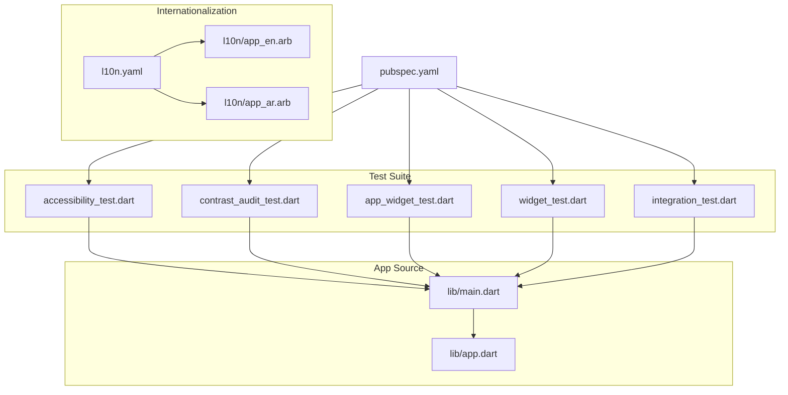

**Diagram sources**
- [accessibility_test.dart](file://test/accessibility_test.dart)
- [contrast_audit_test.dart](file://test/contrast_audit_test.dart)
- [app_widget_test.dart](file://test/app_widget_test.dart)
- [widget_test.dart](file://test/widget_test.dart)
- [integration_test.dart](file://test/integration_test.dart)
- [main.dart](file://lib/main.dart)
- [app.dart](file://lib/app.dart)
- [l10n.yaml](file://l10n.yaml)
- [app_en.arb](file://l10n/app_en.arb)
- [app_ar.arb](file://l10n/app_ar.arb)
- [pubspec.yaml](file://pubspec.yaml)

**Section sources**
- [accessibility_test.dart](file://test/accessibility_test.dart)
- [contrast_audit_test.dart](file://test/contrast_audit_test.dart)
- [app_widget_test.dart](file://test/app_widget_test.dart)
- [widget_test.dart](file://test/widget_test.dart)
- [integration_test.dart](file://test/integration_test.dart)
- [main.dart](file://lib/main.dart)
- [app.dart](file://lib/app.dart)
- [l10n.yaml](file://l10n.yaml)
- [app_en.arb](file://l10n/app_en.arb)
- [app_ar.arb](file://l10n/app_ar.arb)
- [pubspec.yaml](file://pubspec.yaml)

## Core Components
- Automated accessibility audit: A top-level test that boots the app and runs an accessibility audit to detect issues such as missing labels, low contrast, or unlabelled interactive elements.
- Contrast audit: A focused test that validates color contrast across key surfaces and text, ensuring readability against WCAG thresholds.
- Widget-level semantics tests: Tests that assert semantic properties (labels, roles, hints) on representative widgets and screens.
- Integration flows: End-to-end scenarios that verify keyboard navigation, focus traversal, and screen reader announcements during user journeys.

These components collectively ensure continuous verification of accessibility standards across unit, widget, and integration layers.

**Section sources**
- [accessibility_test.dart](file://test/accessibility_test.dart)
- [contrast_audit_test.dart](file://test/contrast_audit_test.dart)
- [app_widget_test.dart](file://test/app_widget_test.dart)
- [widget_test.dart](file://test/widget_test.dart)
- [integration_test.dart](file://test/integration_test.dart)

## Architecture Overview
The accessibility testing architecture integrates three layers:
- Unit/widget layer: Validates semantics and interactions on small scopes.
- App layer: Boots the application context and runs global audits.
- Integration layer: Simulates real user flows to validate focus order, keyboard navigation, and dynamic content announcements.

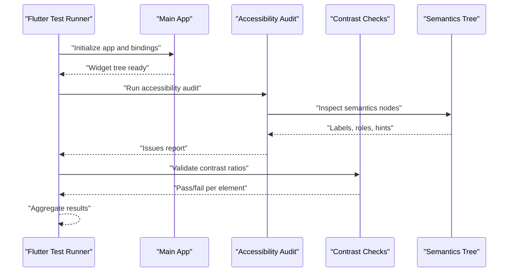

**Diagram sources**
- [accessibility_test.dart](file://test/accessibility_test.dart)
- [contrast_audit_test.dart](file://test/contrast_audit_test.dart)
- [app_widget_test.dart](file://test/app_widget_test.dart)
- [widget_test.dart](file://test/widget_test.dart)
- [integration_test.dart](file://test/integration_test.dart)

## Detailed Component Analysis

### Accessibility Audit Setup
Purpose:
- Boot the app in a test environment.
- Run an accessibility audit over the rendered widget tree.
- Assert no critical issues exist.

Key behaviors:
- Ensures all interactive elements have accessible labels.
- Verifies that images and icons include meaningful semantics.
- Detects potential focus and navigation problems.

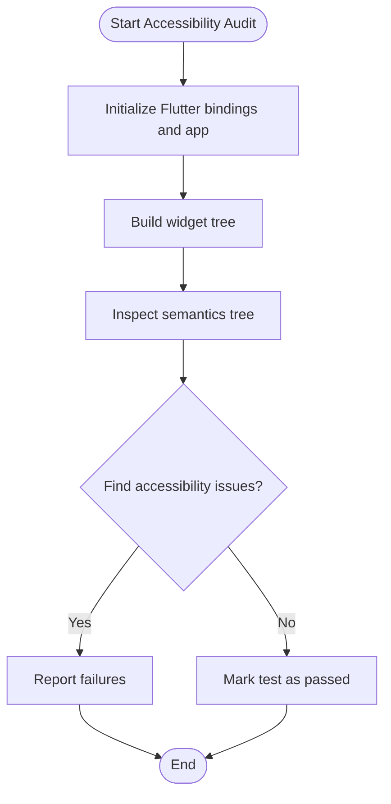

**Diagram sources**
- [accessibility_test.dart](file://test/accessibility_test.dart)

**Section sources**
- [accessibility_test.dart](file://test/accessibility_test.dart)

### Semantic Labeling Validation
Purpose:
- Validate that widgets expose correct semantics for assistive technologies.
- Ensure labels, hints, and roles reflect user intent.

Patterns:
- Use widget-level tests to assert semantics on buttons, inputs, and lists.
- Verify localized strings are correctly bound to semantic labels.
- Confirm dynamic content updates update semantics accordingly.

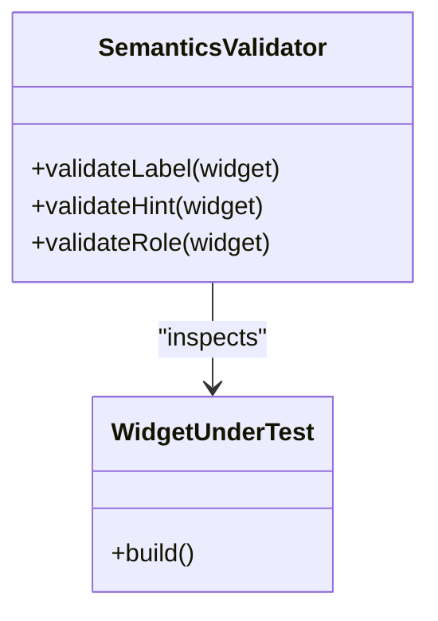

**Diagram sources**
- [app_widget_test.dart](file://test/app_widget_test.dart)
- [widget_test.dart](file://test/widget_test.dart)

**Section sources**
- [app_widget_test.dart](file://test/app_widget_test.dart)
- [widget_test.dart](file://test/widget_test.dart)

### Keyboard Navigation and Focus Management
Purpose:
- Ensure logical tab order and focus visibility.
- Validate that users can navigate via keyboard without traps.

Approach:
- Simulate key presses and focus changes in integration tests.
- Assert focus moves to expected targets.
- Verify that dialogs and overlays manage focus correctly.

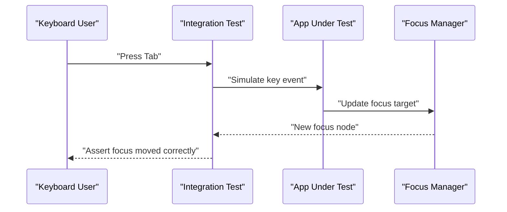

**Diagram sources**
- [integration_test.dart](file://test/integration_test.dart)

**Section sources**
- [integration_test.dart](file://test/integration_test.dart)

### Color Contrast Compliance
Purpose:
- Verify text and UI elements meet minimum contrast ratios.
- Prevent false positives by excluding non-visible or transparent elements.

Process:
- Traverse the widget tree to collect paint and text data.
- Compute contrast ratios between foreground and background.
- Fail when below WCAG thresholds.

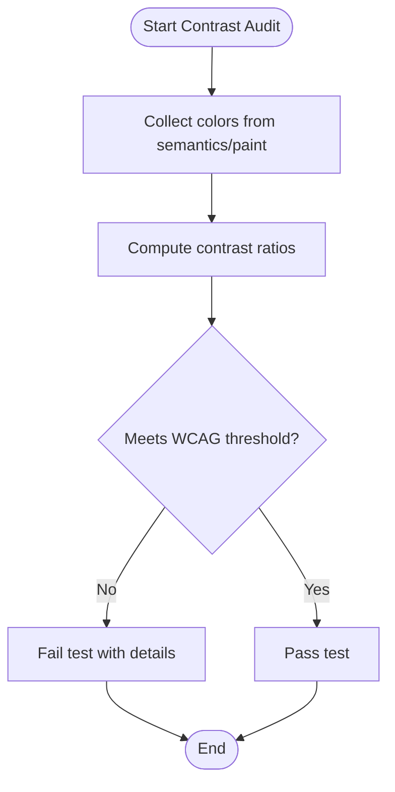

**Diagram sources**
- [contrast_audit_test.dart](file://test/contrast_audit_test.dart)

**Section sources**
- [contrast_audit_test.dart](file://test/contrast_audit_test.dart)

### Internationalization Accessibility
Purpose:
- Ensure localized content is properly exposed to assistive technologies.
- Validate that language switching does not break semantics or focus.

Implementation:
- Use ARB files for translations and generate localization delegates.
- Bind localized strings to semantic labels and hints.
- Test both English and Arabic contexts for correctness.

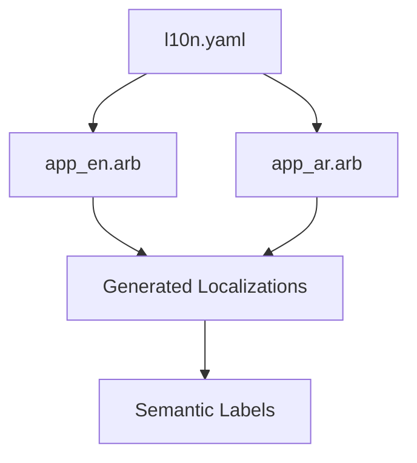

**Diagram sources**
- [l10n.yaml](file://l10n.yaml)
- [app_en.arb](file://l10n/app_en.arb)
- [app_ar.arb](file://l10n/app_ar.arb)

**Section sources**
- [l10n.yaml](file://l10n.yaml)
- [app_en.arb](file://l10n/app_en.arb)
- [app_ar.arb](file://l10n/app_ar.arb)

### Dynamic Text Scaling
Purpose:
- Verify UI adapts to increased font sizes without clipping or overlap.
- Ensure touch targets remain usable at larger scales.

Strategy:
- Configure text scale factors in tests.
- Rebuild UI and assert layout integrity.
- Check that content remains readable and navigable.

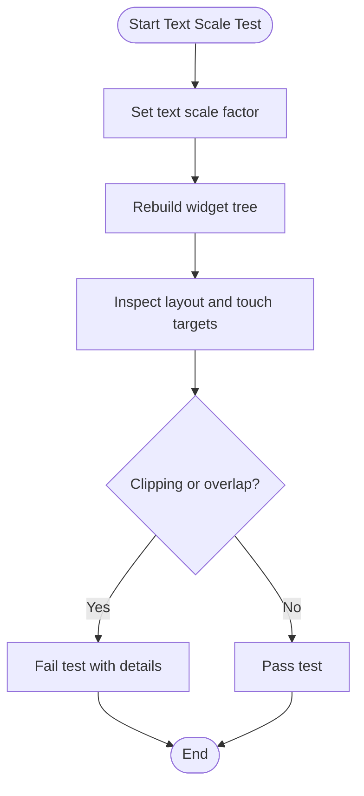

[No diagram sources since this flow is conceptual]

**Section sources**
- [app_widget_test.dart](file://test/app_widget_test.dart)
- [widget_test.dart](file://test/widget_test.dart)

### Platform-Specific Accessibility Features
Purpose:
- Validate behavior differences across platforms (e.g., TalkBack on Android, VoiceOver on iOS).
- Ensure platform-specific semantics and focus handling work as expected.

Approach:
- Conditionally run platform-specific assertions.
- Use platform detection to simulate relevant accessibility services.
- Verify that platform conventions are respected.

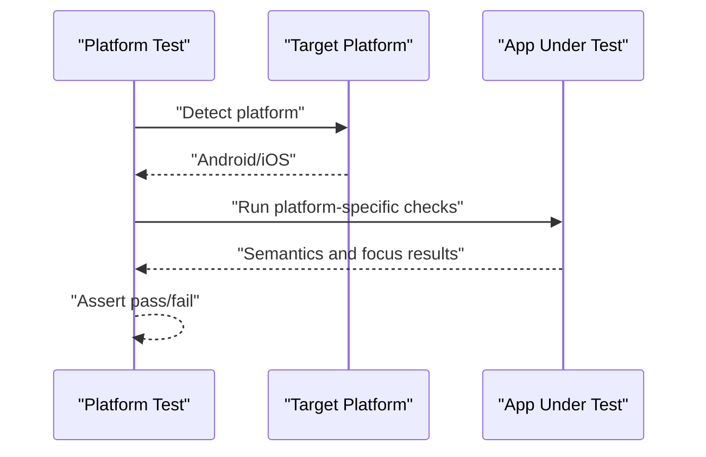

[No diagram sources since this flow is conceptual]

**Section sources**
- [integration_test.dart](file://test/integration_test.dart)

### Complex UI Layouts, Custom Widgets, and Dynamic Content
Challenges:
- Nested scrollables and overlapping layers can obscure semantics.
- Custom widgets may not expose proper roles or labels.
- Dynamic updates must refresh semantics promptly.

Guidelines:
- Wrap complex widgets with explicit semantics containers.
- Provide clear labels and hints for custom controls.
- Update semantics after state changes and animations complete.
- Use targeted widget tests to isolate problematic areas.

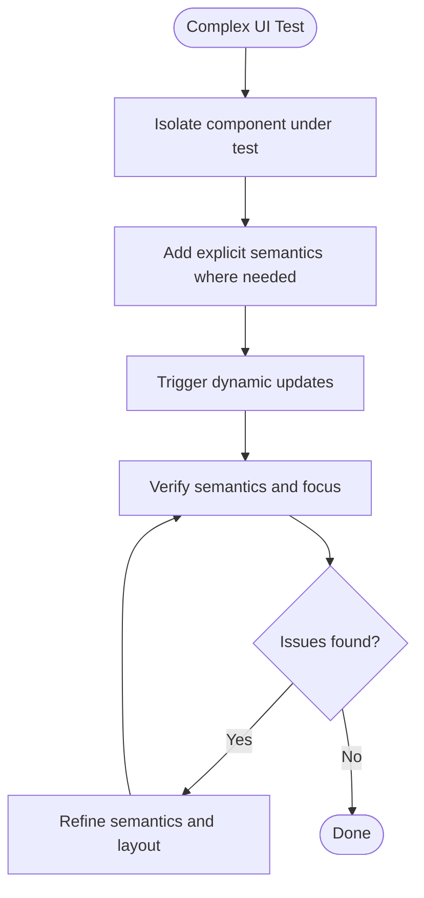

[No diagram sources since this flow is conceptual]

**Section sources**
- [app_widget_test.dart](file://test/app_widget_test.dart)
- [widget_test.dart](file://test/widget_test.dart)

## Dependency Analysis
Accessibility testing depends on Flutter’s testing framework and any third-party packages declared in pubspec. The test suite orchestrates audits, contrast checks, and integration flows, while the app source provides the widget trees under test.

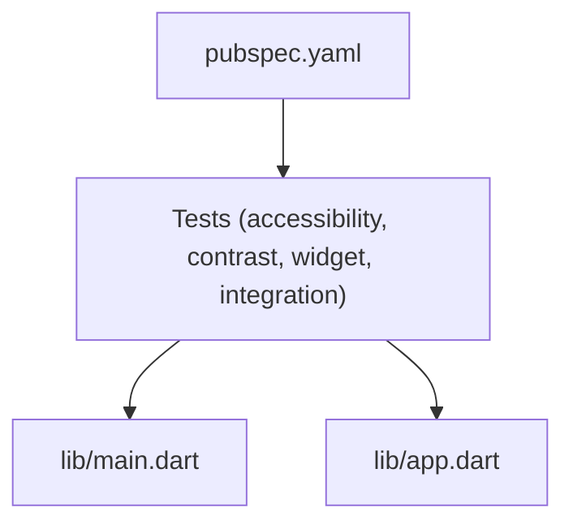

**Diagram sources**
- [pubspec.yaml](file://pubspec.yaml)
- [accessibility_test.dart](file://test/accessibility_test.dart)
- [contrast_audit_test.dart](file://test/contrast_audit_test.dart)
- [app_widget_test.dart](file://test/app_widget_test.dart)
- [widget_test.dart](file://test/widget_test.dart)
- [integration_test.dart](file://test/integration_test.dart)
- [main.dart](file://lib/main.dart)
- [app.dart](file://lib/app.dart)

**Section sources**
- [pubspec.yaml](file://pubspec.yaml)
- [accessibility_test.dart](file://test/accessibility_test.dart)
- [contrast_audit_test.dart](file://test/contrast_audit_test.dart)
- [app_widget_test.dart](file://test/app_widget_test.dart)
- [widget_test.dart](file://test/widget_test.dart)
- [integration_test.dart](file://test/integration_test.dart)
- [main.dart](file://lib/main.dart)
- [app.dart](file://lib/app.dart)

## Performance Considerations
- Keep audits scoped: Prefer widget-level tests for frequent feedback; reserve full-app audits for CI.
- Avoid heavy painting in tests: Minimize expensive operations to speed up contrast and semantics checks.
- Cache generated localizations: Ensure l10n generation is fast and deterministic.
- Parallelize tests: Run independent accessibility suites concurrently to reduce total time.

[No sources needed since this section provides general guidance]

## Troubleshooting Guide
Common issues and resolutions:
- Missing labels: Ensure every interactive element has a descriptive label and hint.
- Low contrast: Adjust colors to meet WCAG AA thresholds; exclude transparent or hidden elements from checks.
- Focus traps: Verify that dialogs and modals return focus appropriately and do not trap navigation.
- Dynamic content: After state changes, rebuild and re-check semantics to confirm updates propagate.
- Localization errors: Confirm ARB keys map to semantic labels and that language switches preserve semantics.

**Section sources**
- [accessibility_test.dart](file://test/accessibility_test.dart)
- [contrast_audit_test.dart](file://test/contrast_audit_test.dart)
- [app_widget_test.dart](file://test/app_widget_test.dart)
- [widget_test.dart](file://test/widget_test.dart)
- [integration_test.dart](file://test/integration_test.dart)

## Conclusion
Albatal Store employs a layered approach to accessibility testing: unit/widget semantics validation, app-wide audits, and integration flows covering keyboard navigation and platform specifics. By integrating contrast checks, internationalization support, and dynamic text scaling into the test suite, the project maintains strong WCAG alignment and inclusive design practices. Continuous auditing and targeted fixes ensure a robust, accessible user experience across platforms.

[No sources needed since this section summarizes without analyzing specific files]

## Appendices

### WCAG-Aligned Checklist
- All interactive elements have labels and hints.
- Color contrast meets minimum thresholds.
- Logical focus order and visible focus indicators.
- Screen reader announcements for dynamic updates.
- Scalable text without layout breakage.
- Platform-specific accessibility conventions respected.

[No sources needed since this section provides general guidance]