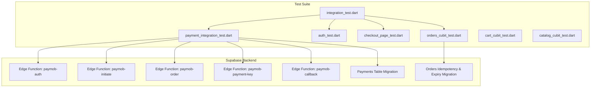
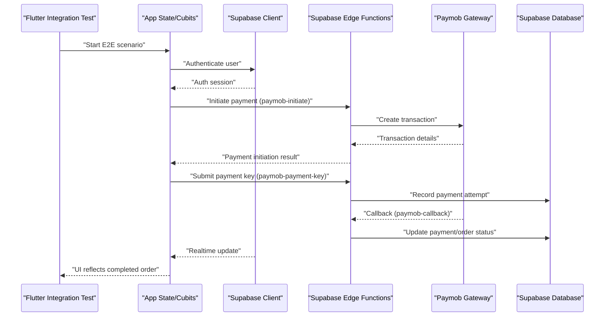
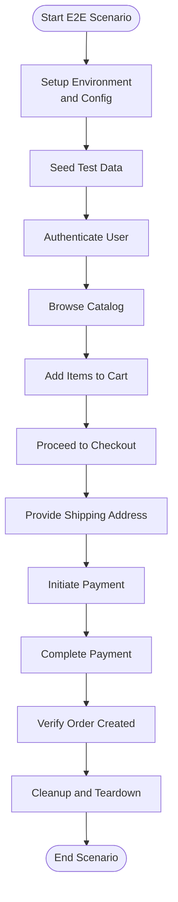
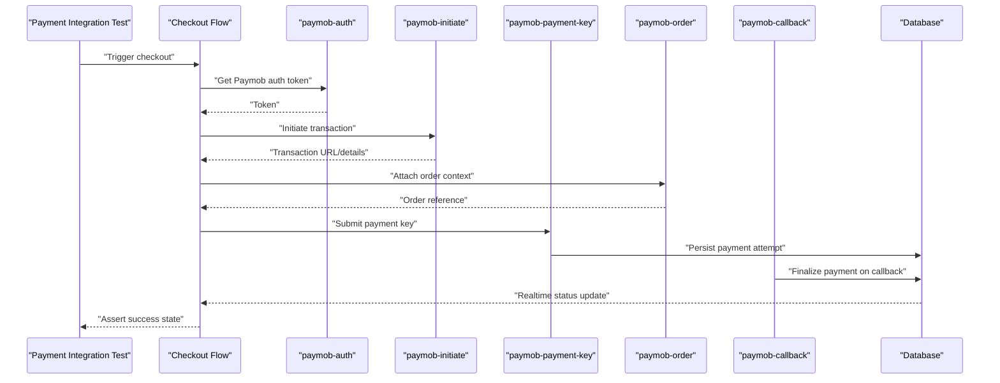
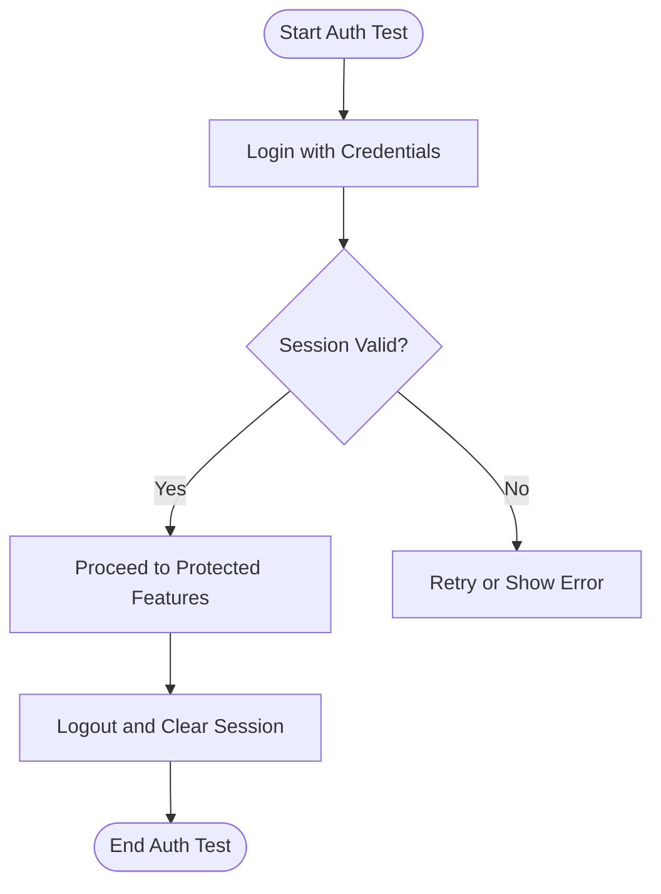
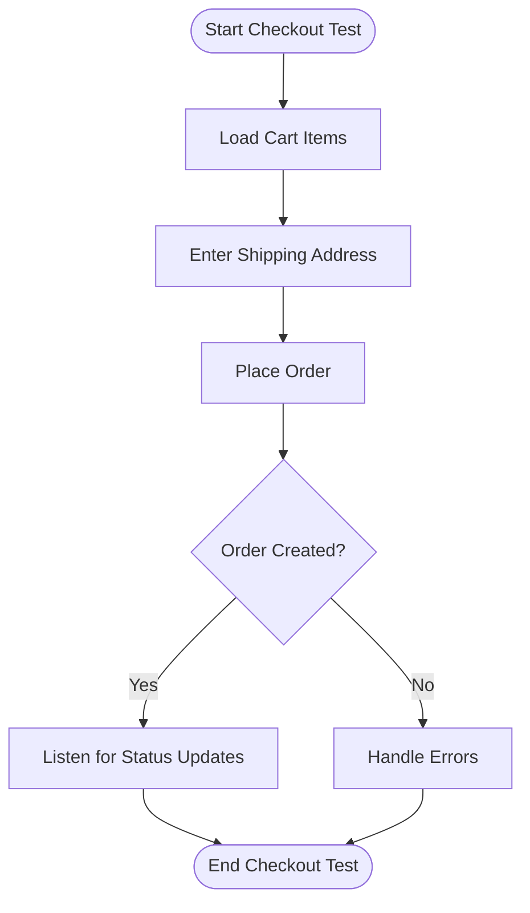
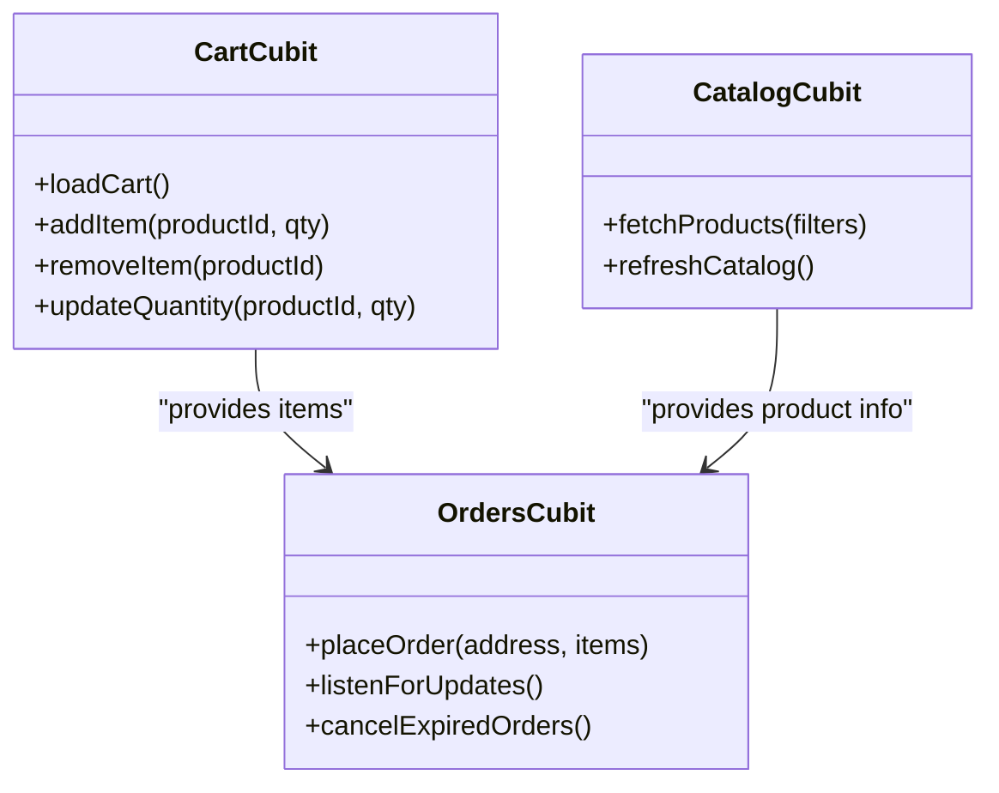
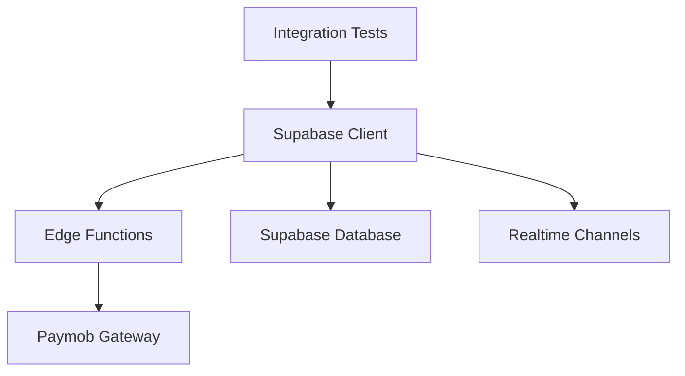

# Integration Testing

<cite>
**Referenced Files in This Document**
- [integration_test.dart](file://test/integration_test.dart)
- [payment_integration_test.dart](file://test/payment_integration_test.dart)
- [auth_test.dart](file://test/auth_test.dart)
- [checkout_page_test.dart](file://test/checkout_page_test.dart)
- [orders_cubit_test.dart](file://test/orders_cubit_test.dart)
- [cart_cubit_test.dart](file://test/cart_cubit_test.dart)
- [catalog_cubit_test.dart](file://test/catalog_cubit_test.dart)
- [supabase-integration.md](file://docs/supabase-integration.md)
- [paymob-auth/index.ts](file://supabase/functions/paymob-auth/index.ts)
- [paymob-initiate/index.ts](file://supabase/functions/paymob-initiate/index.ts)
- [paymob-order/index.ts](file://supabase/functions/paymob-order/index.ts)
- [paymob-payment-key/index.ts](file://supabase/functions/paymob-payment-key/index.ts)
- [paymob-callback/index.ts](file://supabase/functions/paymob-callback/index.ts)
- [006_payments_table.sql](file://supabase/migrations/006_payments_table.sql)
- [011_orders_idempotency_and_expiry.sql](file://supabase/migrations/011_orders_idempotency_and_expiry.sql)
- [pubspec.yaml](file://pubspec.yaml)
</cite>

## Table of Contents
1. [Introduction](#introduction)
2. [Project Structure](#project-structure)
3. [Core Components](#core-components)
4. [Architecture Overview](#architecture-overview)
5. [Detailed Component Analysis](#detailed-component-analysis)
6. [Dependency Analysis](#dependency-analysis)
7. [Performance Considerations](#performance-considerations)
8. [Troubleshooting Guide](#troubleshooting-guide)
9. [Conclusion](#conclusion)
10. [Appendices](#appendices)

## Introduction
This document explains the integration testing strategy for Albatal Store, focusing on end-to-end user workflows from authentication through order completion. It covers API integrations with Supabase, payment gateway flows with Paymob via Supabase Edge Functions, and real-time feature validation. The guide includes concrete examples from the codebase for test environment setup, database seeding, service mocking strategies, and continuous integration considerations. It also addresses common challenges such as network requests, file uploads, push notifications, and cross-service communication.

## Project Structure
Integration tests are organized under the test directory and complement unit tests by exercising real services and third-party integrations where appropriate. Key areas include:
- End-to-end flows (e.g., checkout, payments)
- Feature-specific integration suites (e.g., auth, orders, cart, catalog)
- Documentation references for Supabase integration patterns

**Diagram sources**
- [integration_test.dart](file://test/integration_test.dart)
- [payment_integration_test.dart](file://test/payment_integration_test.dart)
- [auth_test.dart](file://test/auth_test.dart)
- [checkout_page_test.dart](file://test/checkout_page_test.dart)
- [orders_cubit_test.dart](file://test/orders_cubit_test.dart)
- [paymob-auth/index.ts](file://supabase/functions/paymob-auth/index.ts)
- [paymob-initiate/index.ts](file://supabase/functions/paymob-initiate/index.ts)
- [paymob-order/index.ts](file://supabase/functions/paymob-order/index.ts)
- [paymob-payment-key/index.ts](file://supabase/functions/paymob-payment-key/index.ts)
- [paymob-callback/index.ts](file://supabase/functions/paymob-callback/index.ts)
- [006_payments_table.sql](file://supabase/migrations/006_payments_table.sql)
- [011_orders_idempotency_and_expiry.sql](file://supabase/migrations/011_orders_idempotency_and_expiry.sql)

**Section sources**
- [integration_test.dart](file://test/integration_test.dart)
- [payment_integration_test.dart](file://test/payment_integration_test.dart)
- [auth_test.dart](file://test/auth_test.dart)
- [checkout_page_test.dart](file://test/checkout_page_test.dart)
- [orders_cubit_test.dart](file://test/orders_cubit_test.dart)
- [supabase-integration.md](file://docs/supabase-integration.md)

## Core Components
This section outlines the primary integration test components and their responsibilities.

- End-to-end orchestration
  - A top-level integration entry point that composes multiple scenarios across features to validate complete user journeys.
  - Coordinates environment setup, test data preparation, and teardown.

- Payment integration suite
  - Exercises the full payment lifecycle using Supabase Edge Functions that wrap Paymob operations.
  - Validates success paths, error handling, idempotency, and callback processing.

- Authentication integration
  - Verifies sign-in/sign-up flows against Supabase Auth and ensures downstream state is consistent.

- Checkout and ordering
  - Validates address collection, cart-to-order transitions, and order persistence.
  - Confirms idempotent order creation and expiry handling.

- Real-time and state synchronization
  - Ensures UI reflects backend changes (e.g., order status updates) via Supabase real-time channels.

- Data layer and cubits
  - Tests interactions between application state (cubits) and data providers backed by Supabase.

**Section sources**
- [integration_test.dart](file://test/integration_test.dart)
- [payment_integration_test.dart](file://test/payment_integration_test.dart)
- [auth_test.dart](file://test/auth_test.dart)
- [checkout_page_test.dart](file://test/checkout_page_test.dart)
- [orders_cubit_test.dart](file://test/orders_cubit_test.dart)
- [cart_cubit_test.dart](file://test/cart_cubit_test.dart)
- [catalog_cubit_test.dart](file://test/catalog_cubit_test.dart)

## Architecture Overview
The integration architecture connects Flutter tests to Supabase services and Paymob via Edge Functions. The flow emphasizes secure server-side calls for sensitive operations and client-side verification of state transitions.

**Diagram sources**
- [payment_integration_test.dart](file://test/payment_integration_test.dart)
- [paymob-initiate/index.ts](file://supabase/functions/paymob-initiate/index.ts)
- [paymob-payment-key/index.ts](file://supabase/functions/paymob-payment-key/index.ts)
- [paymob-callback/index.ts](file://supabase/functions/paymob-callback/index.ts)
- [006_payments_table.sql](file://supabase/migrations/006_payments_table.sql)
- [011_orders_idempotency_and_expiry.sql](file://supabase/migrations/011_orders_idempotency_and_expiry.sql)

## Detailed Component Analysis

### End-to-End Orchestration
- Purpose: Compose multi-feature scenarios (auth, catalog, cart, checkout, payment) into cohesive user journeys.
- Responsibilities:
  - Initialize test environment and configuration.
  - Seed necessary test data (users, products, shipping zones).
  - Execute sequential steps and assert outcomes at each stage.
  - Clean up resources and reset state after each run.

[No sources needed since this diagram shows conceptual workflow, not actual code structure]

**Section sources**
- [integration_test.dart](file://test/integration_test.dart)

### Payment Integration Flow
- Purpose: Validate the complete payment process using Supabase Edge Functions and Paymob.
- Key endpoints exercised:
  - paymob-auth: Obtain or refresh Paymob credentials securely.
  - paymob-initiate: Create a transaction and return client-facing details.
  - paymob-payment-key: Submit the payment key from the client after authorization.
  - paymob-order: Associate order context with payment.
  - paymob-callback: Handle asynchronous webhook callbacks to finalize payments.

**Diagram sources**
- [payment_integration_test.dart](file://test/payment_integration_test.dart)
- [paymob-auth/index.ts](file://supabase/functions/paymob-auth/index.ts)
- [paymob-initiate/index.ts](file://supabase/functions/paymob-initiate/index.ts)
- [paymob-order/index.ts](file://supabase/functions/paymob-order/index.ts)
- [paymob-payment-key/index.ts](file://supabase/functions/paymob-payment-key/index.ts)
- [paymob-callback/index.ts](file://supabase/functions/paymob-callback/index.ts)
- [006_payments_table.sql](file://supabase/migrations/006_payments_table.sql)

**Section sources**
- [payment_integration_test.dart](file://test/payment_integration_test.dart)
- [paymob-auth/index.ts](file://supabase/functions/paymob-auth/index.ts)
- [paymob-initiate/index.ts](file://supabase/functions/paymob-initiate/index.ts)
- [paymob-order/index.ts](file://supabase/functions/paymob-order/index.ts)
- [paymob-payment-key/index.ts](file://supabase/functions/paymob-payment-key/index.ts)
- [paymob-callback/index.ts](file://supabase/functions/paymob-callback/index.ts)
- [006_payments_table.sql](file://supabase/migrations/006_payments_table.sql)

### Authentication Integration
- Purpose: Ensure users can authenticate and maintain sessions consistently across the app.
- Validation points:
  - Successful login and registration flows.
  - Session persistence and recovery.
  - Access control enforcement via RLS policies.

**Section sources**
- [auth_test.dart](file://test/auth_test.dart)

### Checkout and Ordering
- Purpose: Validate the transition from cart to order, including address capture and order persistence.
- Focus areas:
  - Address form validation and submission.
  - Order creation idempotency and expiry handling.
  - Real-time updates reflecting order status changes.

**Section sources**
- [checkout_page_test.dart](file://test/checkout_page_test.dart)
- [orders_cubit_test.dart](file://test/orders_cubit_test.dart)
- [011_orders_idempotency_and_expiry.sql](file://supabase/migrations/011_orders_idempotency_and_expiry.sql)

### Real-Time Feature Validation
- Purpose: Ensure UI reflects backend changes promptly via Supabase real-time channels.
- Strategy:
  - Subscribe to relevant tables/events during tests.
  - Assert UI state transitions after backend mutations.
  - Time-bound assertions to avoid flakiness.

**Section sources**
- [supabase-integration.md](file://docs/supabase-integration.md)

### Data Layer and Cubits
- Purpose: Validate state management behavior when interacting with Supabase-backed data providers.
- Areas covered:
  - Cart operations (add/remove/update quantities).
  - Catalog queries and filtering.
  - Orders retrieval and status synchronization.

**Diagram sources**
- [cart_cubit_test.dart](file://test/cart_cubit_test.dart)
- [catalog_cubit_test.dart](file://test/catalog_cubit_test.dart)
- [orders_cubit_test.dart](file://test/orders_cubit_test.dart)

**Section sources**
- [cart_cubit_test.dart](file://test/cart_cubit_test.dart)
- [catalog_cubit_test.dart](file://test/catalog_cubit_test.dart)
- [orders_cubit_test.dart](file://test/orders_cubit_test.dart)

## Dependency Analysis
Integration tests depend on:
- Supabase client configuration and migrations.
- Edge Functions for secure payment operations.
- External Paymob gateway for transaction processing.
- Real-time subscriptions for live state synchronization.

**Diagram sources**
- [payment_integration_test.dart](file://test/payment_integration_test.dart)
- [supabase-integration.md](file://docs/supabase-integration.md)

**Section sources**
- [pubspec.yaml](file://pubspec.yaml)
- [supabase-integration.md](file://docs/supabase-integration.md)

## Performance Considerations
- Use targeted test environments to minimize cold starts and reduce external latency.
- Parallelize independent scenarios while respecting shared resource constraints (e.g., single-user accounts).
- Employ timeouts and retries judiciously for network-dependent operations.
- Cache static test data where possible and seed only what is necessary per scenario.

[No sources needed since this section provides general guidance]

## Troubleshooting Guide
Common issues and resolutions:
- Network request failures
  - Validate connectivity and endpoint availability.
  - Inspect Edge Function logs for server-side errors.
  - Use deterministic fixtures to isolate flaky dependencies.

- File uploads
  - Ensure storage buckets exist and permissions are configured.
  - Mock upload responses in non-production runs if needed.

- Push notifications
  - Verify device registration tokens and platform configurations.
  - Simulate notification events in tests without relying on external services.

- Cross-service communication
  - Use idempotency keys to prevent duplicate side effects.
  - Assert final states rather than intermediate timing-sensitive steps.

**Section sources**
- [payment_integration_test.dart](file://test/payment_integration_test.dart)
- [supabase-integration.md](file://docs/supabase-integration.md)

## Conclusion
Albatal Store’s integration testing strategy combines end-to-end orchestration with focused payment and real-time validations. By leveraging Supabase Edge Functions for secure payment operations and asserting state transitions across the app, the suite provides confidence in critical user workflows. Maintaining clear separation of concerns, robust test data management, and careful CI configuration ensures reliability and scalability of the integration tests over time.

[No sources needed since this section summarizes without analyzing specific files]

## Appendices

### Test Environment Setup
- Configure Supabase project URLs and keys for the test environment.
- Prepare Edge Functions locally or in staging for realistic execution.
- Seed initial data (users, products, shipping zones) before running scenarios.

**Section sources**
- [supabase-integration.md](file://docs/supabase-integration.md)

### Database Seeding Strategies
- Use migrations to establish schema and baseline data.
- Create dedicated test datasets for isolation and repeatability.
- Reset or truncate dynamic tables between scenarios to avoid interference.

**Section sources**
- [006_payments_table.sql](file://supabase/migrations/006_payments_table.sql)
- [011_orders_idempotency_and_expiry.sql](file://supabase/migrations/011_orders_idempotency_and_expiry.sql)

### Service Mocking Strategies
- For non-payment flows, mock HTTP clients or data providers to simulate responses.
- Keep payment flows integrated with Edge Functions to validate security and idempotency.
- Use environment flags to toggle between mocked and real services.

**Section sources**
- [payment_integration_test.dart](file://test/payment_integration_test.dart)

### Continuous Integration Pipeline Configuration
- Define jobs for building, linting, and running integration tests.
- Provision a dedicated Supabase instance for CI runs.
- Upload artifacts and test reports for visibility.
- Secure secrets (API keys, tokens) via CI secret stores.

**Section sources**
- [pubspec.yaml](file://pubspec.yaml)