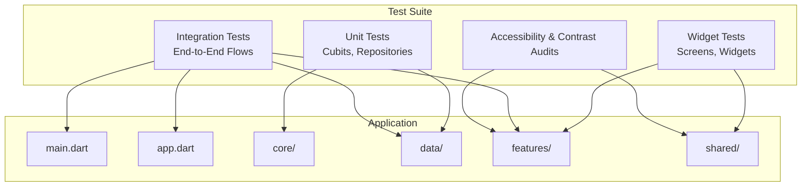
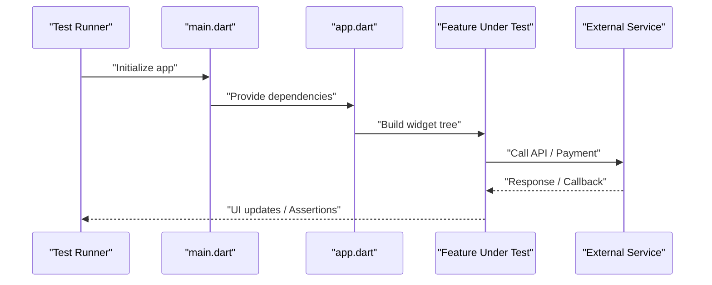
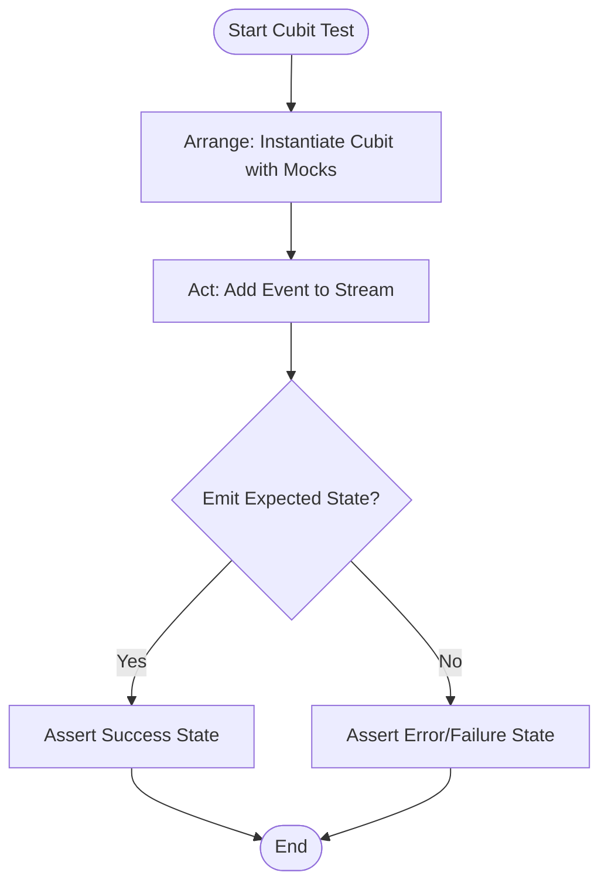
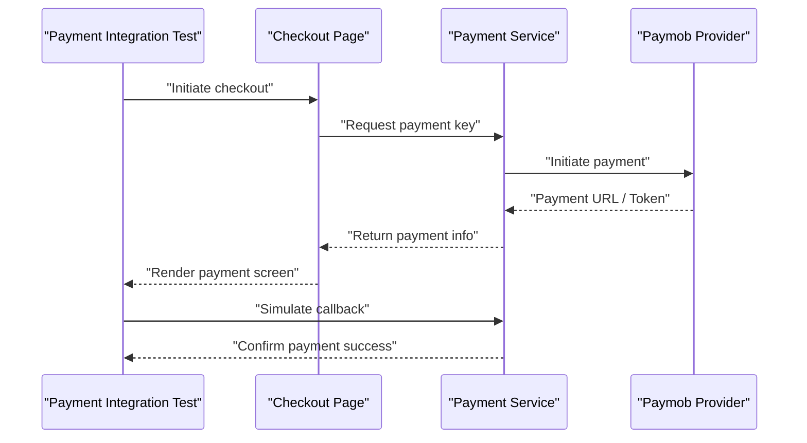
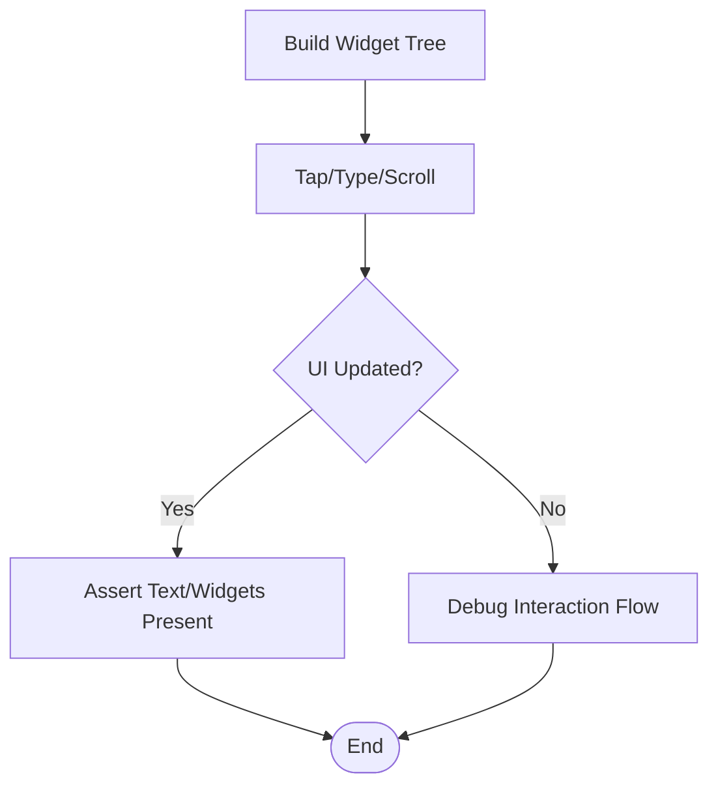
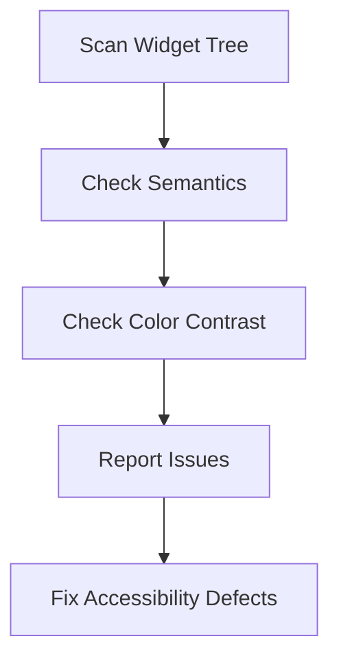
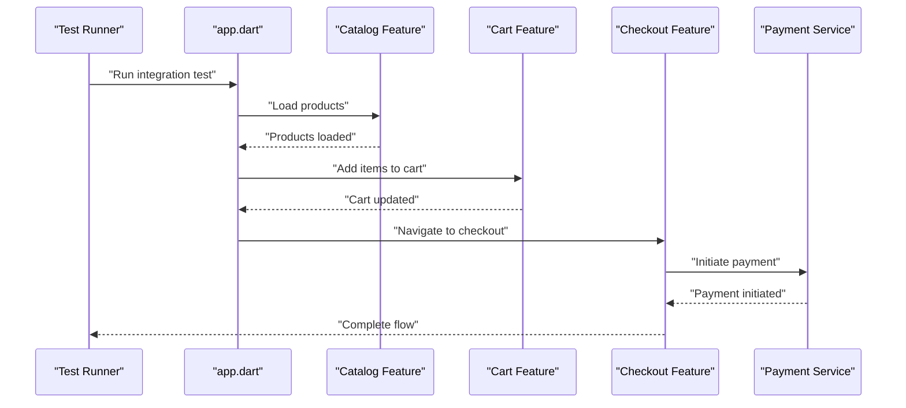
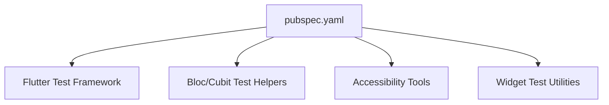

# Testing Strategy

<cite>
**Referenced Files in This Document**
- [test/widget_test.dart](file://test/widget_test.dart)
- [test/app_widget_test.dart](file://test/app_widget_test.dart)
- [test/cart_cubit_test.dart](file://test/cart_cubit_test.dart)
- [test/catalog_cubit_test.dart](file://test/catalog_cubit_test.dart)
- [test/orders_cubit_test.dart](file://test/orders_cubit_test.dart)
- [test/settings_cubit_test.dart](file://test/settings_cubit_test.dart)
- [test/catalog_states_test.dart](file://test/catalog_states_test.dart)
- [test/auth_test.dart](file://test/auth_test.dart)
- [test/payment_test.dart](file://test/payment_test.dart)
- [test/payment_integration_test.dart](file://test/payment_integration_test.dart)
- [test/integration_test.dart](file://test/integration_test.dart)
- [test/checkout_page_test.dart](file://test/checkout_page_test.dart)
- [test/checkout_address_test.dart](file://test/checkout_address_test.dart)
- [test/address_form_test.dart](file://test/address_form_test.dart)
- [test/product_detail_test.dart](file://test/product_detail_test.dart)
- [test/details_page_test.dart](file://test/details_page_test.dart)
- [test/wishlist_cart_test.dart](file://test/wishlist_cart_test.dart)
- [test/accessibility_test.dart](file://test/accessibility_test.dart)
- [test/contrast_audit_test.dart](file://test/contrast_audit_test.dart)
- [pubspec.yaml](file://pubspec.yaml)
- [lib/main.dart](file://lib/main.dart)
- [lib/app.dart](file://lib/app.dart)
</cite>

## Table of Contents
1. [Introduction](#introduction)
2. [Project Structure](#project-structure)
3. [Core Components](#core-components)
4. [Architecture Overview](#architecture-overview)
5. [Detailed Component Analysis](#detailed-component-analysis)
6. [Dependency Analysis](  #dependency-analysis)
7. [Performance Considerations](#performance-considerations)
8. [Troubleshooting Guide](#troubleshooting-guide)
9. [Conclusion](#conclusion)
10. [Appendices](#appendices)

## Introduction
This document describes the testing strategy and implementation for Albatal Store, focusing on the testing pyramid: unit tests for business logic (Cubits and repositories), widget tests for UI components, and integration tests for end-to-end flows. It explains patterns for Cubits, repositories, and external service integrations, including mocking strategies and test data management. It also covers accessibility testing, performance testing approaches, continuous integration considerations, and guidance for maintainable tests, debugging failures, coverage requirements, and quality gates.

## Project Structure
The project follows a feature-based layout with shared core and data layers. Tests are organized under the test directory, mirroring features and concerns:
- Unit tests for Cubits and domain logic
- Widget tests for screens and reusable widgets
- Integration tests for checkout, payments, and cross-feature flows
- Accessibility and contrast audits
- App-level entry points for bootstrapping tests

**Diagram sources**
- [lib/main.dart:1-200](file://lib/main.dart#L1-L200)
- [lib/app.dart:1-200](file://lib/app.dart#L1-L200)
- [test/widget_test.dart:1-200](file://test/widget_test.dart#L1-L200)
- [test/integration_test.dart:1-200](file://test/integration_test.dart#L1-L200)

**Section sources**
- [pubspec.yaml:1-200](file://pubspec.yaml#L1-L200)
- [lib/main.dart:1-200](file://lib/main.dart#L1-L200)
- [lib/app.dart:1-200](file://lib/app.dart#L1-L200)

## Core Components
This section outlines the primary testing targets and their responsibilities:
- Cubits: State machines driving UI state transitions; tested by asserting emitted states and side effects.
- Repositories: Data access abstractions; tested via dependency injection and mocks to isolate network and persistence.
- External Services: Payment providers and backend APIs; isolated using fakes or stubs in unit tests and controlled environments in integration tests.
- UI Widgets: Screens and reusable components; validated through widget tests that simulate user interactions and assert rendered output.

Key test files:
- Cubit tests: cart, catalog, orders, settings
- Repository/state tests: catalog states
- Auth and payment tests: auth flow, payment logic, and integration
- Widget tests: checkout pages, product details, wishlist/cart
- Accessibility and contrast audits
- Integration tests: end-to-end flows

**Section sources**
- [test/cart_cubit_test.dart:1-200](file://test/cart_cubit_test.dart#L1-L200)
- [test/catalog_cubit_test.dart:1-200](file://test/catalog_cubit_test.dart#L1-L200)
- [test/orders_cubit_test.dart:1-200](file://test/orders_cubit_test.dart#L1-L200)
- [test/settings_cubit_test.dart:1-200](file://test/settings_cubit_test.dart#L1-L200)
- [test/catalog_states_test.dart:1-200](file://test/catalog_states_test.dart#L1-L200)
- [test/auth_test.dart:1-200](file://test/auth_test.dart#L1-L200)
- [test/payment_test.dart:1-200](file://test/payment_test.dart#L1-L200)
- [test/checkout_page_test.dart:1-200](file://test/checkout_page_test.dart#L1-L200)
- [test/checkout_address_test.dart:1-200](file://test/checkout_address_test.dart#L1-L200)
- [test/product_detail_test.dart:1-200](file://test/product_detail_test.dart#L1-L200)
- [test/details_page_test.dart:1-200](file://test/details_page_test.dart#L1-L200)
- [test/wishlist_cart_test.dart:1-200](file://test/wishlist_cart_test.dart#L1-L200)
- [test/accessibility_test.dart:1-200](file://test/accessibility_test.dart#L1-L200)
- [test/contrast_audit_test.dart:1-200](file://test/contrast_audit_test.dart#L1-L200)
- [test/integration_test.dart:1-200](file://test/integration_test.dart#L1-L200)

## Architecture Overview
The application is bootstrapped via main.dart and app.dart. Tests target these entry points to run full app scenarios in integration tests, while unit and widget tests focus on isolated components.

**Diagram sources**
- [lib/main.dart:1-200](file://lib/main.dart#L1-L200)
- [lib/app.dart:1-200](file://lib/app.dart#L1-L200)
- [test/integration_test.dart:1-200](file://test/integration_test.dart#L1-L200)

## Detailed Component Analysis

### Unit Tests for Cubits
Cubits are tested by pumping events and asserting resulting states. The pattern includes:
- Arrange: Create a Cubit instance with mocked dependencies (repositories, services).
- Act: Add an event to the Cubit stream.
- Assert: Verify emitted states match expected outcomes.

Examples:
- Cart cubit: add/remove items, update quantities, persist changes.
- Catalog cubit: fetch products, handle loading/error states.
- Orders cubit: place order, track status transitions.
- Settings cubit: toggle preferences, persist configuration.

**Diagram sources**
- [test/cart_cubit_test.dart:1-200](file://test/cart_cubit_test.dart#L1-L200)
- [test/catalog_cubit_test.dart:1-200](file://test/catalog_cubit_test.dart#L1-L200)
- [test/orders_cubit_test.dart:1-200](file://test/orders_cubit_test.dart#L1-L200)
- [test/settings_cubit_test.dart:1-200](file://test/settings_cubit_test.dart#L1-L200)

**Section sources**
- [test/cart_cubit_test.dart:1-200](file://test/cart_cubit_test.dart#L1-L200)
- [test/catalog_cubit_test.dart:1-200](file://test/catalog_cubit_test.dart#L1-L200)
- [test/orders_cubit_test.dart:1-200](file://test/orders_cubit_test.dart#L1-L200)
- [test/settings_cubit_test.dart:1-200](file://test/settings_cubit_test.dart#L1-L200)

### Repository and State Tests
Repository tests validate data layer behavior by isolating network calls and persistence. Catalog state tests ensure correct transitions across loading, success, and error states.

Patterns:
- Use fake implementations for repositories to return deterministic data.
- Validate state emissions and side effects (e.g., caching, logging).

**Section sources**
- [test/catalog_states_test.dart:1-200](file://test/catalog_states_test.dart#L1-L200)

### Authentication Flow Tests
Auth tests cover login, registration, session handling, and error scenarios. They typically mock authentication providers and verify state transitions in relevant Cubits or services.

**Section sources**
- [test/auth_test.dart:1-200](file://test/auth_test.dart#L1-L200)

### Payment Logic and Integration
Payment tests split into:
- Unit tests for payment logic: validating amounts, currency formatting, idempotency checks.
- Integration tests for payment provider flows: initiating payment, handling callbacks, verifying order creation.

**Diagram sources**
- [test/payment_test.dart:1-200](file://test/payment_test.dart#L1-L200)
- [test/payment_integration_test.dart:1-200](file://test/payment_integration_test.dart#L1-L200)
- [test/checkout_page_test.dart:1-200](file://test/checkout_page_test.dart#L1-L200)

**Section sources**
- [test/payment_test.dart:1-200](file://test/payment_test.dart#L1-L200)
- [test/payment_integration_test.dart:1-200](file://test/payment_integration_test.dart#L1-L200)

### Widget Tests for UI Components
Widget tests validate UI rendering and user interactions:
- Checkout page: form validation, navigation, state updates.
- Address form: input fields, validation messages, submission flow.
- Product detail and details page: image loading, metadata display, actions.
- Wishlist/cart: item addition/removal, counters, visual feedback.

**Diagram sources**
- [test/checkout_page_test.dart:1-200](file://test/checkout_page_test.dart#L1-L200)
- [test/checkout_address_test.dart:1-200](file://test/checkout_address_test.dart#L1-L200)
- [test/address_form_test.dart:1-200](file://test/address_form_test.dart#L1-L200)
- [test/product_detail_test.dart:1-200](file://test/product_detail_test.dart#L1-L200)
- [test/details_page_test.dart:1-200](file://test/details_page_test.dart#L1-L200)
- [test/wishlist_cart_test.dart:1-200](file://test/wishlist_cart_test.dart#L1-L200)

**Section sources**
- [test/checkout_page_test.dart:1-200](file://test/checkout_page_test.dart#L1-L200)
- [test/checkout_address_test.dart:1-200](file://test/checkout_address_test.dart#L1-L200)
- [test/address_form_test.dart:1-200](file://test/address_form_test.dart#L1-L200)
- [test/product_detail_test.dart:1-200](file://test/product_detail_test.dart#L1-L200)
- [test/details_page_test.dart:1-200](file://test/details_page_test.dart#L1-L200)
- [test/wishlist_cart_test.dart:1-200](file://test/wishlist_cart_test.dart#L1-L200)

### Accessibility and Contrast Audits
Accessibility tests ensure compliance with standards:
- Semantic labels, focus traversal, and keyboard navigation.
- Color contrast checks to meet WCAG guidelines.

**Diagram sources**
- [test/accessibility_test.dart:1-200](file://test/accessibility_test.dart#L1-L200)
- [test/contrast_audit_test.dart:1-200](file://test/contrast_audit_test.dart#L1-L200)

**Section sources**
- [test/accessibility_test.dart:1-200](file://test/accessibility_test.dart#L1-L200)
- [test/contrast_audit_test.dart:1-200](file://test/contrast_audit_test.dart#L1-L200)

### Integration Tests for End-to-End Flows
Integration tests exercise full application flows:
- Bootstrapping the app via main.dart and app.dart.
- Simulating user journeys across features (catalog -> cart -> checkout -> payment).
- Validating state consistency and UI responses.

**Diagram sources**
- [lib/main.dart:1-200](file://lib/main.dart#L1-L200)
- [lib/app.dart:1-200](file://lib/app.dart#L1-L200)
- [test/integration_test.dart:1-200](file://test/integration_test.dart#L1-L200)

**Section sources**
- [test/integration_test.dart:1-200](file://test/integration_test.dart#L1-L200)

## Dependency Analysis
Testing relies on several packages defined in pubspec.yaml, including Flutter testing utilities, BLoC/Cubit testing helpers, and accessibility tools. Dependencies enable:
- Mocking and stubbing for repositories and services.
- Widget testing and interaction simulation.
- Accessibility auditing and contrast checks.

**Diagram sources**
- [pubspec.yaml:1-200](file://pubspec.yaml#L1-L200)

**Section sources**
- [pubspec.yaml:1-200](file://pubspec.yaml#L1-L200)

## Performance Considerations
- Keep unit tests fast by avoiding heavy I/O; use fakes and in-memory stores.
- Limit widget tests to critical paths; avoid unnecessary rebuilds.
- For integration tests, use lightweight endpoints and mock time-sensitive operations.
- Profile tests periodically to identify bottlenecks and optimize setup/teardown.

[No sources needed since this section provides general guidance]

## Troubleshooting Guide
Common issues and resolutions:
- Flaky tests: Stabilize async operations with pumpUntilFound or explicit waits.
- Mock mismatches: Ensure method signatures and parameters align with production code.
- UI timing: Use tester.pumpAndSettle() to allow animations and futures to complete.
- Accessibility failures: Review semantics nodes and color contrast values.

**Section sources**
- [test/widget_test.dart:1-200](file://test/widget_test.dart#L1-L200)
- [test/accessibility_test.dart:1-200](file://test/accessibility_test.dart#L1-L200)
- [test/contrast_audit_test.dart:1-200](file://test/contrast_audit_test.dart#L1-L200)

## Conclusion
Albatal Store’s testing strategy balances speed and reliability across unit, widget, and integration layers. By isolating dependencies, leveraging mocks/fakes, and enforcing accessibility and contrast checks, the suite ensures robustness and maintainability. Continuous integration should execute all tests, enforce coverage thresholds, and block merges on failures.

[No sources needed since this section summarizes without analyzing specific files]

## Appendices

### Guidelines for Writing Maintainable Tests
- Follow AAA structure: Arrange, Act, Assert.
- Name tests descriptively to reflect scenarios and expectations.
- Keep tests independent; avoid shared mutable state.
- Prefer small, focused tests over monolithic suites.
- Centralize test data and fixtures for reuse.

[No sources needed since this section provides general guidance]

### Test Organization and Coverage Requirements
- Organize tests by feature and concern, mirroring source structure.
- Enforce minimum coverage thresholds for critical modules (Cubits, repositories, payment logic).
- Use coverage reports to identify gaps and prioritize new tests.

[No sources needed since this section provides general guidance]

### Continuous Integration Testing Pipelines
- Run unit tests on every commit.
- Execute widget tests on multiple platforms (Android, iOS, Web).
- Schedule integration tests nightly or on release branches.
- Gate merges on passing tests and coverage thresholds.

[No sources needed since this section provides general guidance]

### Challenges and Mitigations
- Real-time features: Use timers and streams carefully; mock time-dependent logic.
- Payment integration testing: Employ sandbox environments and webhook simulators.
- Cross-platform compatibility: Run tests on Android, iOS, and Web emulators/simulators.

[No sources needed since this section provides general guidance]