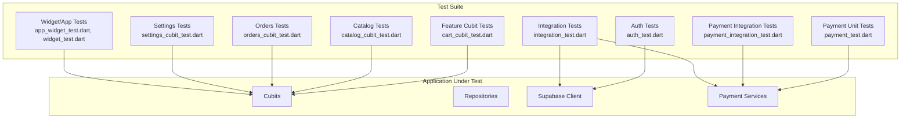
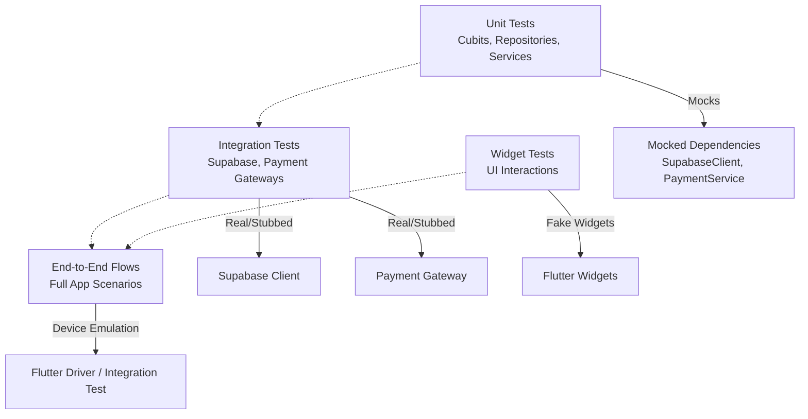
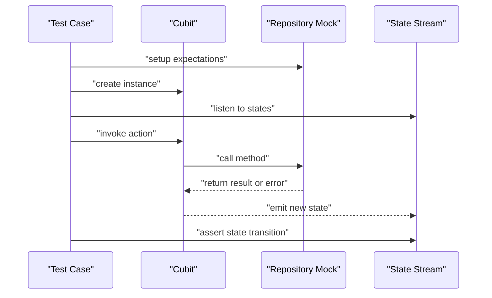
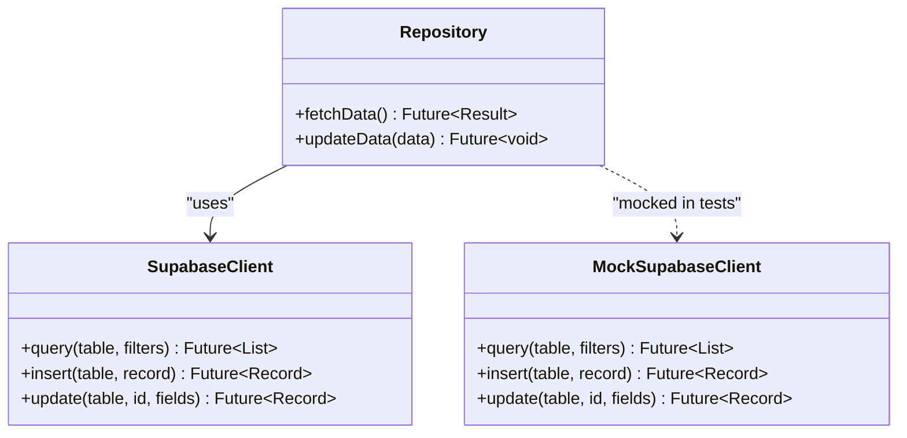
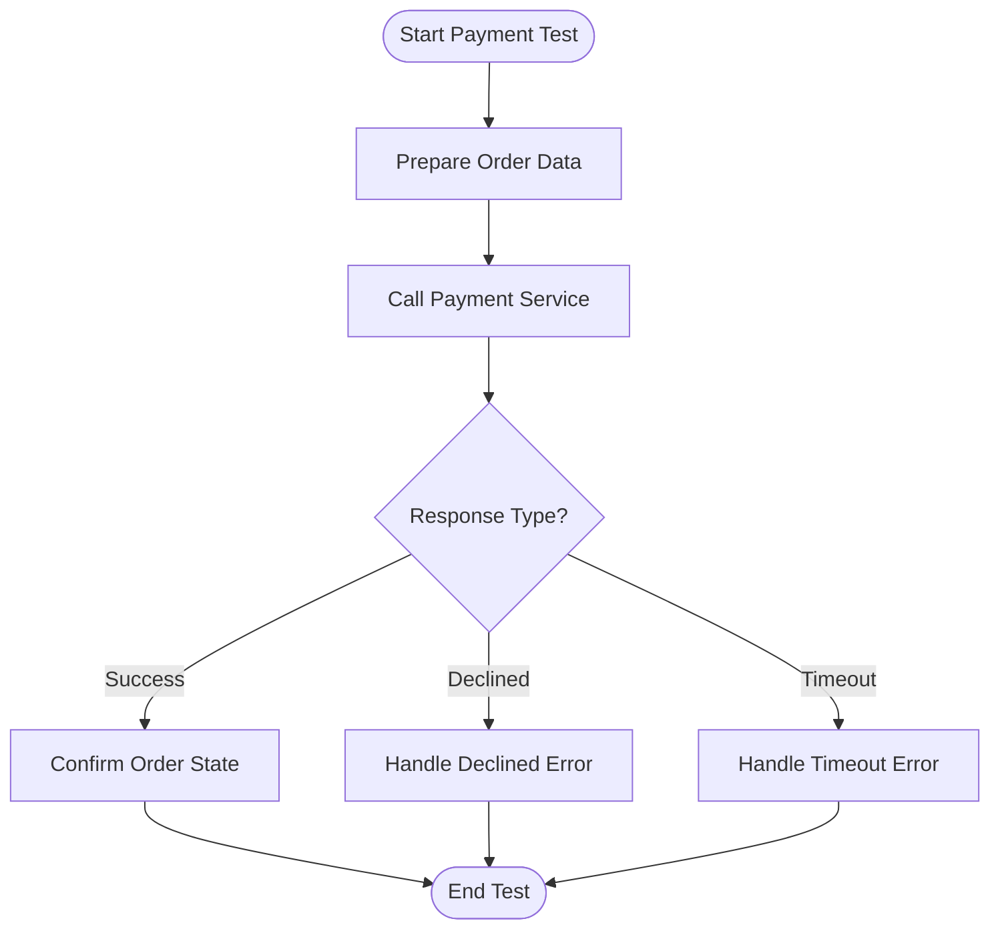

# Unit Testing

<cite>
**Referenced Files in This Document**
- [cart_cubit_test.dart](file://test/cart_cubit_test.dart)
- [catalog_cubit_test.dart](file://test/catalog_cubit_test.dart)
- [orders_cubit_test.dart](file://test/orders_cubit_test.dart)
- [settings_cubit_test.dart](file://test/settings_cubit_test.dart)
- [payment_test.dart](file://test/payment_test.dart)
- [payment_integration_test.dart](file://test/payment_integration_test.dart)
- [auth_test.dart](file://test/auth_test.dart)
- [app_widget_test.dart](file://test/app_widget_test.dart)
- [widget_test.dart](file://test/widget_test.dart)
- [integration_test.dart](file://test/integration_test.dart)
- [pubspec.yaml](file://pubspec.yaml)
</cite>

## Table of Contents
1. [Introduction](#introduction)
2. [Project Structure](#project-structure)
3. [Core Components](#core-components)
4. [Architecture Overview](#architecture-overview)
5. [Detailed Component Analysis](#detailed-component-analysis)
6. [Dependency Analysis](#dependency-analysis)
7. [Performance Considerations](#performance-considerations)
8. [Troubleshooting Guide](#troubleshooting-guide)
9. [Conclusion](#conclusion)

## Introduction
This document explains how unit testing is implemented in Albatal Store with a focus on Cubits, repositories, and integration points such as Supabase and payment services. It consolidates the testing patterns used across the codebase, including state management verification, error handling scenarios, asynchronous operations, mocking strategies, test data factories, and best practices for maintainable tests. The goal is to help developers write clear, fast, and reliable tests that cover business logic, edge cases, and real-time features while keeping performance in mind.

## Project Structure
The project follows a feature-based organization with tests colocated under the test directory. Key areas include:
- Feature-level Cubit tests (e.g., cart, catalog, orders, settings)
- Payment-related unit and integration tests
- Authentication tests
- Widget and app-level tests
- Integration tests for end-to-end flows

[No sources needed since this diagram shows conceptual workflow, not actual code structure]

## Core Components
This section summarizes the primary testing components and patterns observed in the repository:
- Cubit state management tests: verify initial states, transitions, and error states using stream-based assertions.
- Repository tests: isolate external dependencies by mocking Supabase clients or service interfaces.
- Payment tests: validate business rules around checkout and payment flows, including success and failure paths.
- Auth tests: ensure authentication state changes and error handling are correct.
- Widget and integration tests: exercise UI interactions and full flows where appropriate.

Key files demonstrating these patterns:
- [cart_cubit_test.dart](file://test/cart_cubit_test.dart)
- [catalog_cubit_test.dart](file://test/catalog_cubit_test.dart)
- [orders_cubit_test.dart](file://test/orders_cubit_test.dart)
- [settings_cubit_test.dart](file://test/settings_cubit_test.dart)
- [payment_test.dart](file://test/payment_test.dart)
- [payment_integration_test.dart](file://test/payment_integration_test.dart)
- [auth_test.dart](file://test/auth_test.dart)
- [app_widget_test.dart](file://test/app_widget_test.dart)
- [widget_test.dart](file://test/widget_test.dart)
- [integration_test.dart](file://test/integration_test.dart)

**Section sources**
- [cart_cubit_test.dart](file://test/cart_cubit_test.dart)
- [catalog_cubit_test.dart](file://test/catalog_cubit_test.dart)
- [orders_cubit_test.dart](file://test/orders_cubit_test.dart)
- [settings_cubit_test.dart](file://test/settings_cubit_test.dart)
- [payment_test.dart](file://test/payment_test.dart)
- [payment_integration_test.dart](file://test/payment_integration_test.dart)
- [auth_test.dart](file://test/auth_test.dart)
- [app_widget_test.dart](file://test/app_widget_test.dart)
- [widget_test.dart](file://test/widget_test.dart)
- [integration_test.dart](file://test/integration_test.dart)

## Architecture Overview
The testing architecture separates concerns between unit tests (fast, deterministic), integration tests (external dependencies), and widget tests (UI). The following diagram maps test categories to application layers:

[No sources needed since this diagram shows conceptual workflow, not actual code structure]

## Detailed Component Analysis

### Cubit State Management Testing
Cubit tests typically follow a consistent pattern:
- Initialize the Cubit with mocked dependencies.
- Assert the initial state.
- Emit actions and assert resulting states.
- Verify error states when dependencies fail.
- Handle async operations using pumpAndSettle or equivalent mechanisms.

Recommended structure:
- Arrange: create mocks, set up expectations, instantiate Cubit.
- Act: call methods or emit events.
- Assert: use stream-based assertions to verify state transitions.

Example references:
- [cart_cubit_test.dart](file://test/cart_cubit_test.dart)
- [catalog_cubit_test.dart](file://test/catalog_cubit_test.dart)
- [orders_cubit_test.dart](file://test/orders_cubit_test.dart)
- [settings_cubit_test.dart](file://test/settings_cubit_test.dart)

Best practices:
- Keep each test focused on one behavior.
- Use descriptive test names indicating scenario and expected outcome.
- Prefer small, isolated setups to reduce flakiness.

**Section sources**
- [cart_cubit_test.dart](file://test/cart_cubit_test.dart)
- [catalog_cubit_test.dart](file://test/catalog_cubit_test.dart)
- [orders_cubit_test.dart](file://test/orders_cubit_test.dart)
- [settings_cubit_test.dart](file://test/settings_cubit_test.dart)

#### Sequence Diagram: Typical Cubit Test Flow

[No sources needed since this diagram shows conceptual workflow, not actual code structure]

### Repository Testing Strategies with Mocking
Repository tests should isolate external dependencies like Supabase:
- Replace real Supabase client with a mock or fake implementation.
- Define clear contracts for repository methods (success, failure, network errors).
- Validate that repositories translate domain models correctly.
- Cover edge cases such as empty results, partial failures, and timeouts.

Common patterns:
- Use dependency injection to swap implementations in tests.
- Set up return values and exceptions on mocks before invoking repository methods.
- Assert that Cubits or services receive expected data or errors from repositories.

Example references:
- [auth_test.dart](file://test/auth_test.dart)
- [orders_cubit_test.dart](file://test/orders_cubit_test.dart)
- [catalog_cubit_test.dart](file://test/catalog_cubit_test.dart)

**Section sources**
- [auth_test.dart](file://test/auth_test.dart)
- [orders_cubit_test.dart](file://test/orders_cubit_test.dart)
- [catalog_cubit_test.dart](file://test/catalog_cubit_test.dart)

#### Class Diagram: Repository and Dependencies

[No sources needed since this diagram shows conceptual workflow, not actual code structure]

### Payment Processing Logic Testing
Payment tests cover both unit and integration scenarios:
- Unit tests validate business rules (totals, discounts, currency conversions).
- Integration tests simulate gateway responses and callback handling.
- Error scenarios include declined payments, timeouts, and invalid payloads.

Recommended approach:
- For unit tests, stub payment service methods to return success/failure outcomes.
- For integration tests, use controlled environments or sandbox endpoints.
- Ensure idempotency checks and order state transitions are verified.

Example references:
- [payment_test.dart](file://test/payment_test.dart)
- [payment_integration_test.dart](file://test/payment_integration_test.dart)

**Section sources**
- [payment_test.dart](file://test/payment_test.dart)
- [payment_integration_test.dart](file://test/payment_integration_test.dart)

#### Flowchart: Payment Processing Test Decision Tree

[No sources needed since this diagram shows conceptual workflow, not actual code structure]

### Real-Time Features Testing
Real-time features often rely on streams and event-driven updates:
- Use stream controllers or mock providers to simulate incoming events.
- Assert that UI reflects updates promptly and consistently.
- Cover race conditions and late arrivals gracefully.

Guidelines:
- Isolate real-time subscriptions in tests to avoid cross-test interference.
- Use timers or fake clocks if time-dependent logic exists.
- Validate cleanup and disposal to prevent memory leaks.

Example references:
- [integration_test.dart](file://test/integration_test.dart)
- [orders_cubit_test.dart](file://test/orders_cubit_test.dart)

**Section sources**
- [integration_test.dart](file://test/integration_test.dart)
- [orders_cubit_test.dart](file://test/orders_cubit_test.dart)

### Database Interactions Testing
Database tests should avoid hitting production databases:
- Use in-memory or test-specific databases.
- Seed minimal fixtures required for assertions.
- Wrap transactions to roll back after each test.

Patterns:
- Create a test database schema mirroring production.
- Provide helper functions to insert/update records deterministically.
- Assert repository outputs against known fixtures.

Example references:
- [auth_test.dart](file://test/auth_test.dart)
- [orders_cubit_test.dart](file://test/orders_cubit_test.dart)

**Section sources**
- [auth_test.dart](file://test/auth_test.dart)
- [orders_cubit_test.dart](file://test/orders_cubit_test.dart)

### Widget and App-Level Tests
Widget tests validate UI behavior without running the full app:
- Build widgets in isolation and interact via tester.
- Assert visible elements and user feedback.
- Combine with Cubit/state mocks to control inputs.

App-level tests ensure top-level configuration and navigation work:
- Verify app initialization and theme setup.
- Check routing correctness for key flows.

Example references:
- [app_widget_test.dart](file://test/app_widget_test.dart)
- [widget_test.dart](file://test/widget_test.dart)

**Section sources**
- [app_widget_test.dart](file://test/app_widget_test.dart)
- [widget_test.dart](file://test/widget_test.dart)

## Dependency Analysis
Testing dependencies are declared in the project manifest. Common packages include:
- Flutter testing framework
- Mockito or similar mocking libraries
- Fake implementations for external services
- Integration test utilities

Review the manifest to confirm available testing tools and versions.

**Section sources**
- [pubspec.yaml](file://pubspec.yaml)

## Performance Considerations
- Keep unit tests fast by avoiding heavy I/O; prefer mocks and fakes.
- Batch related assertions within a single test to reduce setup overhead.
- Use targeted selectors in widget tests to minimize rebuilds.
- Avoid sleeping or arbitrary delays; rely on stream completion or pumpAndSettle.
- Parallelize independent tests where possible to speed up CI runs.

[No sources needed since this section provides general guidance]

## Troubleshooting Guide
Common issues and resolutions:
- Flaky async tests: ensure proper stream completion and await all futures.
- Mock mismatches: verify method signatures and argument matchers.
- State assertion failures: check for intermediate states and use ordered assertions.
- Integration timeouts: configure realistic timeouts and retry policies in tests.
- Resource leaks: dispose streams and cancel subscriptions in tearDown.

Example references:
- [integration_test.dart](file://test/integration_test.dart)
- [payment_integration_test.dart](file://test/payment_integration_test.dart)

**Section sources**
- [integration_test.dart](file://test/integration_test.dart)
- [payment_integration_test.dart](file://test/payment_integration_test.dart)

## Conclusion
Albatal Store’s testing strategy emphasizes clear separation between unit, integration, and widget tests. By mocking external dependencies, validating state transitions, and covering error paths, the suite ensures robustness across business logic, real-time features, payments, and database interactions. Following the patterns and guidelines outlined here will help maintain a fast, readable, and reliable test suite that scales with the application.