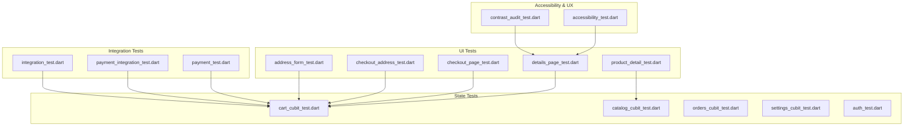
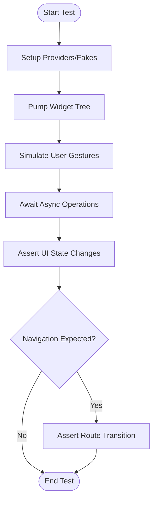
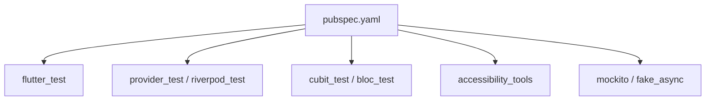

# Widget Testing

<cite>
**Referenced Files in This Document**
- [pubspec.yaml](file://pubspec.yaml)
- [main.dart](file://lib/main.dart)
- [app.dart](file://lib/app.dart)
- [widget_test.dart](file://test/widget_test.dart)
- [app_widget_test.dart](file://test/app_widget_test.dart)
- [details_page_test.dart](file://test/details_page_test.dart)
- [product_detail_test.dart](file://test/product_detail_test.dart)
- [checkout_page_test.dart](file://test/checkout_page_test.dart)
- [checkout_address_test.dart](file://test/checkout_address_test.dart)
- [address_form_test.dart](file://test/address_form_test.dart)
- [cart_cubit_test.dart](file://test/cart_cubit_test.dart)
- [catalog_cubit_test.dart](file://test/catalog_cubit_test.dart)
- [orders_cubit_test.dart](file://test/orders_cubit_test.dart)
- [settings_cubit_test.dart](file://test/settings_cubit_test.dart)
- [auth_test.dart](file://test/auth_test.dart)
- [wishlist_cart_test.dart](file://test/wishlist_cart_test.dart)
- [payment_test.dart](file://test/payment_test.dart)
- [payment_integration_test.dart](file://test/payment_integration_test.dart)
- [integration_test.dart](file://test/integration_test.dart)
- [accessibility_test.dart](file://test/accessibility_test.dart)
- [contrast_audit_test.dart](file://test/contrast_audit_test.dart)
</cite>

## Table of Contents
1. [Introduction](#introduction)
2. [Project Structure](#project-structure)
3. [Core Components](#core-components)
4. [Architecture Overview](#architecture-overview)
5. [Detailed Component Analysis](#detailed-component-analysis)
6. [Dependency Analysis](#dependency-analysis)
7. [Performance Considerations](#performance-considerations)
8. [Troubleshooting Guide](#troubleshooting-guide)
9. [Conclusion](#conclusion)
10. [Appendices](#appendices)

## Introduction
This document explains how widget testing is implemented and organized in Albatal Store, focusing on Flutter widget tests that simulate user interactions, validate state changes, and verify navigation flows. It covers patterns for complex UI components such as forms, product details pages, and checkout flows, including how to set up widget trees, provide fake providers for Riverpod/Cubit integration, and simulate gestures. It also addresses accessibility validation, responsive design checks, cross-platform considerations, and strategies for handling animated widgets, custom paint operations, and platform-specific UI elements. Finally, it provides guidelines for writing efficient, isolated tests and debugging failures.

## Project Structure
The project follows a feature-based layout with a dedicated test directory containing unit and widget tests. The root application entry points are defined in the main and app files, while individual features include their own cubit/state tests and page-level widget tests.

```mermaid
graph TB
A["lib/main.dart"] --> B["lib/app.dart"]
subgraph "Tests"
T1["test/widget_test.dart"]
T2["test/app_widget_test.dart"]
T3["test/details_page_test.dart"]
T4["test/product_detail_test.dart"]
T5["test/checkout_page_test.dart"]
T6["test/checkout_address_test.dart"]
T7["test/address_form_test.dart"]
T8["test/cart_cubit_test.dart"]
T9["test/catalog_cubit_test.dart"]
T10["test/orders_cubit_test.dart"]
T11["test/settings_cubit_test.dart"]
T12["test/auth_test.dart"]
T13["test/wishlist_cart_test.dart"]
T14["test/payment_test.dart"]
T15["test/payment_integration_test.dart"]
T16["test/integration_test.dart"]
T17["test/accessibility_test.dart"]
T18["test/contrast_audit_test.dart"]
end
B --> T1
B --> T2
B --> T3
B --> T4
B --> T5
B --> T6
B --> T7
B --> T8
B --> T9
B --> T10
B --> T11
B --> T12
B --> T13
B --> T14
B --> T15
B --> T16
B --> T17
B --> T18
```

**Diagram sources**
- [main.dart](file://lib/main.dart)
- [app.dart](file://lib/app.dart)
- [widget_test.dart](file://test/widget_test.dart)
- [app_widget_test.dart](file://test/app_widget_test.dart)
- [details_page_test.dart](file://test/details_page_test.dart)
- [product_detail_test.dart](file://test/product_detail_test.dart)
- [checkout_page_test.dart](file://test/checkout_page_test.dart)
- [checkout_address_test.dart](file://test/checkout_address_test.dart)
- [address_form_test.dart](file://test/address_form_test.dart)
- [cart_cubit_test.dart](file://test/cart_cubit_test.dart)
- [catalog_cubit_test.dart](file://test/catalog_cubit_test.dart)
- [orders_cubit_test.dart](file://test/orders_cubit_test.dart)
- [settings_cubit_test.dart](file://test/settings_cubit_test.dart)
- [auth_test.dart](file://test/auth_test.dart)
- [wishlist_cart_test.dart](file://test/wishlist_cart_test.dart)
- [payment_test.dart](file://test/payment_test.dart)
- [payment_integration_test.dart](file://test/payment_integration_test.dart)
- [integration_test.dart](file://test/integration_test.dart)
- [accessibility_test.dart](file://test/accessibility_test.dart)
- [contrast_audit_test.dart](file://test/contrast_audit_test.dart)

**Section sources**
- [main.dart](file://lib/main.dart)
- [app.dart](file://lib/app.dart)
- [pubspec.yaml](file://pubspec.yaml)

## Core Components
This section outlines the primary building blocks used across widget tests:
- Test harness setup: pumpWidget usage to mount the app or specific screens under test.
- Provider/Cubit fakes: replacing real dependencies with test doubles to isolate UI logic.
- Interaction simulation: tapping, typing, scrolling, and navigating within the widget tree.
- Assertions: verifying UI state transitions, route changes, and provider state updates.

Key test files demonstrate these patterns:
- App-level bootstrapping and basic smoke tests
- Feature-specific page tests (details, checkout, address form)
- Cubit/state tests for cart, catalog, orders, settings, and auth
- Payment and integration tests for end-to-end flows
- Accessibility and contrast audits

**Section sources**
- [widget_test.dart](file://test/widget_test.dart)
- [app_widget_test.dart](file://test/app_widget_test.dart)
- [details_page_test.dart](file://test/details_page_test.dart)
- [product_detail_test.dart](file://test/product_detail_test.dart)
- [checkout_page_test.dart](file://test/checkout_page_test.dart)
- [checkout_address_test.dart](file://test/checkout_address_test.dart)
- [address_form_test.dart](file://test/address_form_test.dart)
- [cart_cubit_test.dart](file://test/cart_cubit_test.dart)
- [catalog_cubit_test.dart](file://test/catalog_cubit_test.dart)
- [orders_cubit_test.dart](file://test/orders_cubit_test.dart)
- [settings_cubit_test.dart](file://test/settings_cubit_test.dart)
- [auth_test.dart](file://test/auth_test.dart)
- [wishlist_cart_test.dart](file://test/wishlist_cart_test.dart)
- [payment_test.dart](file://test/payment_test.dart)
- [payment_integration_test.dart](file://test/payment_integration_test.dart)
- [integration_test.dart](file://test/integration_test.dart)
- [accessibility_test.dart](file://test/accessibility_test.dart)
- [contrast_audit_test.dart](file://test/contrast_audit_test.dart)

## Architecture Overview
The testing architecture separates concerns into three layers:
- UI layer tests: render and interact with widgets, assert visual and behavioral outcomes.
- State layer tests: exercise Cubits/providers directly, ensuring deterministic state transitions.
- Integration layer tests: coordinate multiple features and external services via fakes/mocks.

[No sources needed since this diagram shows conceptual workflow, not actual code structure]

## Detailed Component Analysis

### App Bootstrapping and Smoke Tests
Purpose:
- Validate that the application mounts correctly and renders expected top-level content.
- Provide a baseline for subsequent feature tests.

Patterns:
- Use pumpWidget to mount the app entry point.
- Assert presence of key widgets or routes.
- Keep tests fast and minimal to catch regressions early.

Example references:
- [App-level smoke test](file://test/app_widget_test.dart)
- [Basic widget test template](file://test/widget_test.dart)

**Section sources**
- [app_widget_test.dart](file://test/app_widget_test.dart)
- [widget_test.dart](file://test/widget_test.dart)

### Product Details Page
Purpose:
- Verify rendering of product information, images, and actions.
- Simulate user interactions like adding to cart and toggling wishlist.
- Ensure navigation to related screens (e.g., cart, reviews).

Patterns:
- Build the widget tree with necessary providers/fakes.
- Tap buttons and assert UI state changes.
- Verify route transitions using Navigator observers or route assertions.

Example references:
- [Product details page test](file://test/details_page_test.dart)
- [Product detail focused test](file://test/product_detail_test.dart)

**Section sources**
- [details_page_test.dart](file://test/details_page_test.dart)
- [product_detail_test.dart](file://test/product_detail_test.dart)

### Checkout Flow
Purpose:
- Validate multi-step checkout processes including address selection, payment initiation, and confirmation.
- Ensure correct state propagation from cart and order providers.

Patterns:
- Pump the checkout page with preconfigured state.
- Interact with inputs and buttons; assert intermediate states and final outcomes.
- Mock external payment calls to avoid network dependencies.

Example references:
- [Checkout page test](file://test/checkout_page_test.dart)
- [Checkout address test](file://test/checkout_address_test.dart)

**Section sources**
- [checkout_page_test.dart](file://test/checkout_page_test.dart)
- [checkout_address_test.dart](file://test/checkout_address_test.dart)

### Address Form Validation
Purpose:
- Confirm input validation rules, error messages, and submission behavior.
- Ensure required fields are enforced and invalid inputs are highlighted.

Patterns:
- Type into text fields and trigger validation.
- Assert error messages and button enablement states.
- Submit and verify success path.

Example references:
- [Address form test](file://test/address_form_test.dart)

**Section sources**
- [address_form_test.dart](file://test/address_form_test.dart)

### Cart Cubit Integration
Purpose:
- Isolate cart state logic by exercising the Cubit directly.
- Verify add/remove items, quantity updates, and total calculations.

Patterns:
- Instantiate the Cubit in tests.
- Emit events and assert resulting states.
- Optionally integrate with widget tests to ensure UI reflects state changes.

Example references:
- [Cart cubit test](file://test/cart_cubit_test.dart)

**Section sources**
- [cart_cubit_test.dart](file://test/cart_cubit_test.dart)

### Catalog Cubit Integration
Purpose:
- Validate fetching, filtering, and displaying products.
- Ensure loading/error/success states are handled properly.

Patterns:
- Trigger load events and assert state transitions.
- Inject mock data where appropriate.

Example references:
- [Catalog cubit test](file://test/catalog_cubit_test.dart)

**Section sources**
- [catalog_cubit_test.dart](file://test/catalog_cubit_test.dart)

### Orders Cubit Integration
Purpose:
- Confirm order lifecycle management and persistence expectations.
- Validate state transitions for placing, updating, and canceling orders.

Patterns:
- Emit order-related events and assert resulting states.
- Integrate with repository fakes if needed.

Example references:
- [Orders cubit test](file://test/orders_cubit_test.dart)

**Section sources**
- [orders_cubit_test.dart](file://test/orders_cubit_test.dart)

### Settings Cubit Integration
Purpose:
- Ensure preferences update and persist as expected.
- Validate UI reflects setting changes.

Patterns:
- Update settings via Cubit methods/events.
- Assert state and optional side effects.

Example references:
- [Settings cubit test](file://test/settings_cubit_test.dart)

**Section sources**
- [settings_cubit_test.dart](file://test/settings_cubit_test.dart)

### Authentication Flows
Purpose:
- Test login, registration, logout, and session handling.
- Validate error states and user feedback.

Patterns:
- Simulate authentication events and assert state changes.
- Integrate with auth provider fakes.

Example references:
- [Auth test](file://test/auth_test.dart)

**Section sources**
- [auth_test.dart](file://test/auth_test.dart)

### Wishlist and Cart Interactions
Purpose:
- Verify toggling wishlist items and cart updates from product views.
- Ensure consistent state across features.

Patterns:
- Combine widget interactions with state assertions.
- Use shared fakes for consistency.

Example references:
- [Wishlist and cart test](file://test/wishlist_cart_test.dart)

**Section sources**
- [wishlist_cart_test.dart](file://test/wishlist_cart_test.dart)

### Payment Testing
Purpose:
- Validate payment initiation, callback handling, and result presentation.
- Avoid real network calls by mocking payment integrations.

Patterns:
- Stub payment service responses.
- Assert UI transitions after successful or failed payments.

Example references:
- [Payment test](file://test/payment_test.dart)
- [Payment integration test](file://test/payment_integration_test.dart)

**Section sources**
- [payment_test.dart](file://test/payment_test.dart)
- [payment_integration_test.dart](file://test/payment_integration_test.dart)

### Integration Tests
Purpose:
- Coordinate multiple features and providers to simulate realistic user journeys.
- Validate end-to-end flows without relying on live services.

Patterns:
- Set up comprehensive fakes/mocks.
- Drive navigation and interactions across screens.
- Assert final outcomes and persisted state.

Example references:
- [Integration test](file://test/integration_test.dart)

**Section sources**
- [integration_test.dart](file://test/integration_test.dart)

### Accessibility and Contrast Audits
Purpose:
- Ensure semantic labels, focus order, and color contrast meet standards.
- Catch regressions in accessibility early.

Patterns:
- Run accessibility checks against rendered widgets.
- Audit contrast ratios and report violations.

Example references:
- [Accessibility test](file://test/accessibility_test.dart)
- [Contrast audit test](file://test/contrast_audit_test.dart)

**Section sources**
- [accessibility_test.dart](file://test/accessibility_test.dart)
- [contrast_audit_test.dart](file://test/contrast_audit_test.dart)

### Conceptual Overview
The following flowchart illustrates a typical widget test sequence for a complex screen:

[No sources needed since this diagram shows conceptual workflow, not actual code structure]

## Dependency Analysis
Testing dependencies are declared in the package manifest and include Flutter testing utilities, provider/Cubit testing helpers, and accessibility tools.

**Diagram sources**
- [pubspec.yaml](file://pubspec.yaml)

**Section sources**
- [pubspec.yaml](file://pubspec.yaml)

## Performance Considerations
- Prefer unit tests for state logic to keep widget tests fast.
- Minimize heavy image loads and animations in tests; use lightweight placeholders when possible.
- Use fake providers to avoid expensive computations or network calls.
- Batch interactions and assertions to reduce rebuilds.
- Leverage golden tests sparingly due to maintenance overhead.

[No sources needed since this section provides general guidance]

## Troubleshooting Guide
Common issues and resolutions:
- Widget not found: Use precise finders and ensure the widget tree is fully pumped before interacting.
- Timing issues: Await async operations explicitly; use pumpAndSettle for animations and futures.
- Provider state mismatches: Verify fakes return expected values and that events are emitted in the correct order.
- Navigation flakiness: Use Navigator observers or route matchers to assert transitions deterministically.
- Platform-specific differences: Run tests on multiple platforms and conditionally assert based on platform checks.

**Section sources**
- [widget_test.dart](file://test/widget_test.dart)
- [app_widget_test.dart](file://test/app_widget_test.dart)
- [details_page_test.dart](file://test/details_page_test.dart)
- [product_detail_test.dart](file://test/product_detail_test.dart)
- [checkout_page_test.dart](file://test/checkout_page_test.dart)
- [checkout_address_test.dart](file://test/checkout_address_test.dart)
- [address_form_test.dart](file://test/address_form_test.dart)
- [cart_cubit_test.dart](file://test/cart_cubit_test.dart)
- [catalog_cubit_test.dart](file://test/catalog_cubit_test.dart)
- [orders_cubit_test.dart](file://test/orders_cubit_test.dart)
- [settings_cubit_test.dart](file://test/settings_cubit_test.dart)
- [auth_test.dart](file://test/auth_test.dart)
- [wishlist_cart_test.dart](file://test/wishlist_cart_test.dart)
- [payment_test.dart](file://test/payment_test.dart)
- [payment_integration_test.dart](file://test/payment_integration_test.dart)
- [integration_test.dart](file://test/integration_test.dart)
- [accessibility_test.dart](file://test/accessibility_test.dart)
- [contrast_audit_test.dart](file://test/contrast_audit_test.dart)

## Conclusion
Albatal Store’s testing strategy combines focused widget tests, robust state tests for Cubits/providers, and integration tests to cover critical user journeys. By isolating dependencies, simulating realistic interactions, and validating accessibility and responsiveness, the suite ensures reliability across platforms. Following the patterns and guidelines outlined here will help maintain fast, stable, and meaningful tests as the application evolves.

[No sources needed since this section summarizes without analyzing specific files]

## Appendices

### Guidelines for Writing Efficient Widget Tests
- Keep tests small and single-purpose.
- Use descriptive names that reflect scenarios.
- Prefer fakes over mocks when possible for readability.
- Avoid sleeping; await futures and pumpAndSettle for animations.
- Group related assertions and interactions logically.

[No sources needed since this section provides general guidance]

### Debugging Widget Failures
- Print widget trees to inspect unexpected structures.
- Use tester.log to trace interactions and rebuilds.
- Reduce the failing test to a minimal reproduction.
- Check platform-specific branches and conditional rendering.

[No sources needed since this section provides general guidance]