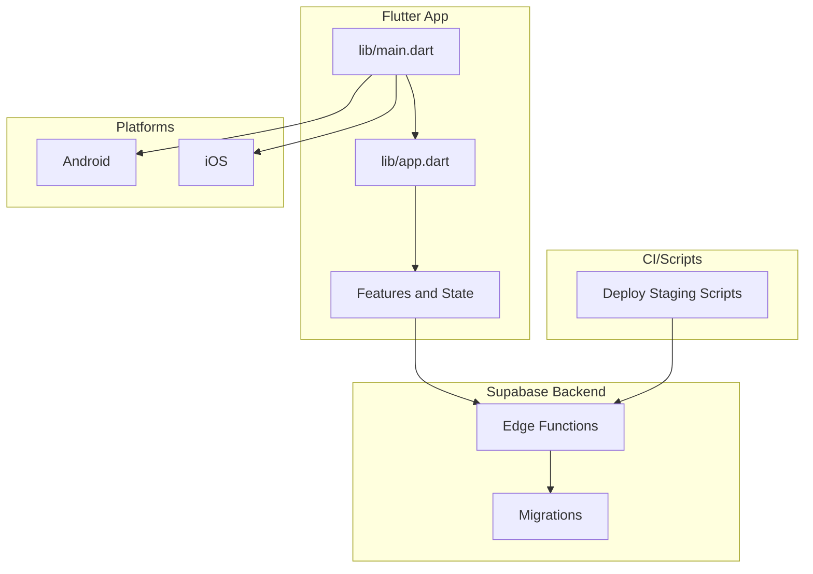
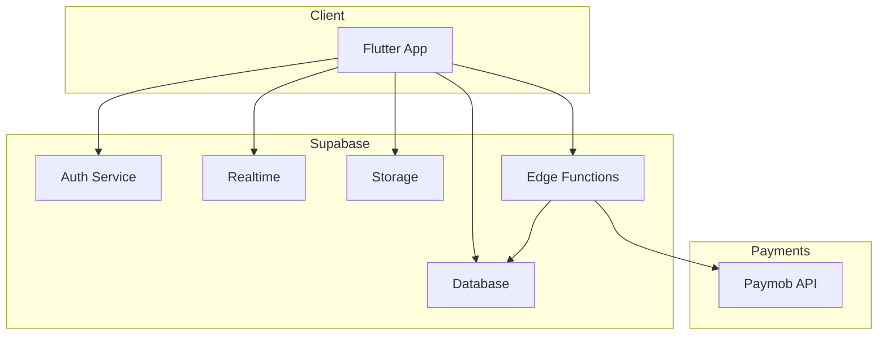
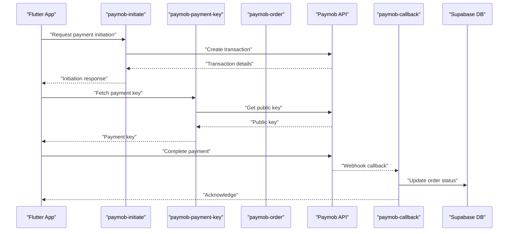
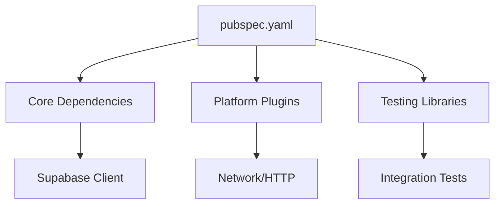

# Troubleshooting & FAQ

<cite>
**Referenced Files in This Document**
- [README.md](file://README.md)
- [INSTRUCTIONS.md](file://INSTRUCTIONS.md)
- [DESIGN.md](file://DESIGN.md)
- [pubspec.yaml](file://pubspec.yaml)
- [lib/main.dart](file://lib/main.dart)
- [lib/app.dart](file://lib/app.dart)
- [supabase-integration.md](file://docs/supabase-integration.md)
- [release-readiness.md](file://docs/release-readiness.md)
- [staging-verification.md](file://docs/staging-verification.md)
- [acceptance-checklist.md](file://docs/acceptance-checklist.md)
- [foundation-walkthrough.md](file://docs/foundation-walkthrough.md)
- [money-walkthrough.md](file://docs/money-walkthrough.md)
- [storefront-walkthrough.md](file://docs/storefront-walkthrough.md)
- [android/build.gradle.kts](file://android/build.gradle.kts)
- [android/app/build.gradle.kts](file://android/app/build.gradle.kts)
- [android/gradle.properties](file://android/gradle.properties)
- [android/app/src/main/AndroidManifest.xml](file://android/app/src/main/AndroidManifest.xml)
- [ios/Runner/Info.plist](file://ios/Runner/Info.plist)
- [ios/Runner/AppDelegate.swift](file://ios/Runner/AppDelegate.swift)
- [scripts/deploy-staging.sh](file://scripts/deploy-staging.sh)
- [scripts/deploy-staging.bat](file://scripts/deploy-staging.bat)
- [scripts/deploy-staging.ps1](file://scripts/deploy-staging.ps1)
- [secrets-staging.env](file://secrets-staging.env)
- [supabase/functions/paymob-initiate/index.ts](file://supabase/functions/paymob-initiate/index.ts)
- [supabase/functions/paymob-payment-key/index.ts](file://supabase/functions/paymob-payment-key/index.ts)
- [supabase/functions/paymob-order/index.ts](file://supabase/functions/paymob-order/index.ts)
- [supabase/functions/paymob-auth/index.ts](file://supabase/functions/paymob-auth/index.ts)
- [supabase/functions/paymob-callback/index.ts](file://supabase/functions/paymob-callback/index.ts)
- [supabase/functions/checkout/index.ts](file://supabase/functions/checkout/index.ts)
- [supabase/functions/cancel-expired-orders/index.ts](file://supabase/functions/cancel-expired-orders/index.ts)
- [supabase/functions/send-order-notification/index.ts](file://supabase/functions/send-order-notification/index.ts)
- [supabase/migrations/006_payments_table.sql](file://supabase/migrations/006_payments_table.sql)
- [supabase/migrations/008_order_fulfillment.sql](file://supabase/migrations/008_order_fulfillment.sql)
- [supabase/migrations/011_orders_idempotency_and_expiry.sql](file://supabase/migrations/011_orders_idempotency_and_expiry.sql)
- [test/payment_integration_test.dart](file://test/payment_integration_test.dart)
- [test/auth_test.dart](file://test/auth_test.dart)
- [test/integration_test.dart](file://test/integration_test.dart)
</cite>

## Table of Contents
1. Introduction
2. Project Structure
3. Core Components
4. Architecture Overview
5. Detailed Component Analysis
6. Dependency Analysis
7. Performance Considerations
8. Troubleshooting Guide
9. Conclusion
10. Appendices

## Introduction
This document provides comprehensive troubleshooting guidance and frequently asked questions for the Albatal Store project. It focuses on development, deployment, and production issues across Flutter, Supabase integration, payments (Paymob), real-time features, authentication, database connectivity, platform-specific problems, build issues, dependency conflicts, performance tuning, memory leaks, UI rendering, error logging, crash reporting, monitoring, and community support channels.

## Project Structure
The project is a multi-platform Flutter application with:
- Feature-based Dart code under lib
- Supabase Edge Functions for backend logic and payment orchestration
- SQL migrations for schema and policies
- Platform configurations for Android and iOS
- Scripts for staging deployments
- Documentation and tests to validate behavior

[No sources needed since this diagram shows conceptual workflow, not actual code structure]

## Core Components
- Application entrypoint and app configuration
- Supabase client initialization and environment handling
- Payment flow via Paymob through Supabase Edge Functions
- Real-time order updates and notifications
- Authentication flows and session management
- Platform integrations (Android/iOS) and build settings

Key areas to review when troubleshooting:
- Environment variables and secrets
- Network connectivity and CORS
- Database RLS policies and schema state
- Payment provider keys and callbacks
- Platform permissions and capabilities

**Section sources**
- [lib/main.dart](file://lib/main.dart)
- [lib/app.dart](file://lib/app.dart)
- [supabase-integration.md](file://docs/supabase-integration.md)
- [pubspec.yaml](file://pubspec.yaml)

## Architecture Overview
High-level architecture showing Flutter app interacting with Supabase services and payment functions.

[No sources needed since this diagram shows conceptual workflow, not actual code structure]

## Detailed Component Analysis

### Authentication Troubleshooting
Common symptoms:
- Login fails or redirects unexpectedly
- Session lost after app restart
- Profile data missing post-login

Diagnostic steps:
- Verify Supabase URL and anon key in environment configuration
- Check network logs for auth endpoint responses
- Validate RLS policies for profiles and related tables
- Ensure correct redirect URLs are configured for web and mobile deep links

Resolution checklist:
- Confirm environment variables match target project
- Inspect browser console and device logs for auth errors
- Re-run migration that hardens auth-related schemas if necessary
- Test with known credentials and verify profile creation

**Section sources**
- [auth_test.dart](file://test/auth_test.dart)
- [supabase-integration.md](file://docs/supabase-integration.md)
- [supabase/migrations/003_auth_profiles_and_hardening.sql](file://supabase/migrations/003_auth_profiles_and_hardening.sql)

### Database Connectivity and Realtime Issues
Common symptoms:
- Data not loading or stale
- Realtime events not received
- Permission denied errors

Diagnostic steps:
- Validate connection parameters and network reachability
- Review RLS policies and ensure they allow intended operations
- Check realtime subscriptions and presence of required indexes
- Inspect migration status and schema consistency

Resolution checklist:
- Apply pending migrations and verify schema versions
- Adjust RLS policies to grant appropriate access
- Add indexes for frequent queries
- Use Supabase dashboard to monitor realtime connections

**Section sources**
- [supabase-integration.md](file://docs/supabase-integration.md)
- [supabase/migrations/002_rls_policies.sql](file://supabase/migrations/002_rls_policies.sql)
- [supabase/migrations/001_initial_schema.sql](file://supabase/migrations/001_initial_schema.sql)

### Payment Processing (Paymob) Troubleshooting
Common symptoms:
- Payment initiation fails
- Callback never received
- Order not updated after payment

Diagnostic steps:
- Verify Paymob keys and function endpoints
- Inspect Edge Function logs for initiate, payment key, order, and callback flows
- Confirm webhook signature validation and payload parsing
- Check idempotency and order expiry handling

Resolution checklist:
- Update secrets for staging/production consistently
- Ensure HTTPS and allowed domains for callbacks
- Implement retry and reconciliation logic for failed callbacks
- Validate orders table schema and fulfillment states

**Diagram sources**
- [supabase/functions/paymob-initiate/index.ts](file://supabase/functions/paymob-initiate/index.ts)
- [supabase/functions/paymob-payment-key/index.ts](file://supabase/functions/paymob-payment-key/index.ts)
- [supabase/functions/paymob-order/index.ts](file://supabase/functions/paymob-order/index.ts)
- [supabase/functions/paymob-callback/index.ts](file://supabase/functions/paymob-callback/index.ts)
- [supabase/migrations/006_payments_table.sql](file://supabase/migrations/006_payments_table.sql)
- [supabase/migrations/008_order_fulfillment.sql](file://supabase/migrations/008_order_fulfillment.sql)
- [supabase/migrations/011_orders_idempotency_and_expiry.sql](file://supabase/migrations/011_orders_idempotency_and_expiry.sql)

**Section sources**
- [payment_integration_test.dart](file://test/payment_integration_test.dart)
- [supabase/functions/paymob-initiate/index.ts](file://supabase/functions/paymob-initiate/index.ts)
- [supabase/functions/paymob-payment-key/index.ts](file://supabase/functions/paymob-payment-key/index.ts)
- [supabase/functions/paymob-order/index.ts](file://supabase/functions/paymob-order/index.ts)
- [supabase/functions/paymob-auth/index.ts](file://supabase/functions/paymob-auth/index.ts)
- [supabase/functions/paymob-callback/index.ts](file://supabase/functions/paymob-callback/index.ts)
- [supabase/migrations/006_payments_table.sql](file://supabase/migrations/006_payments_table.sql)
- [supabase/migrations/008_order_fulfillment.sql](file://supabase/migrations/008_order_fulfillment.sql)
- [supabase/migrations/011_orders_idempotency_and_expiry.sql](file://supabase/migrations/011_orders_idempotency_and_expiry.sql)

### Checkout Flow Troubleshooting
Common symptoms:
- Cart not persisted
- Address validation failures
- Order creation errors

Diagnostic steps:
- Inspect checkout Edge Function logs
- Validate address form inputs and constraints
- Confirm stock reservation and inventory updates
- Check order idempotency keys to prevent duplicates

Resolution checklist:
- Normalize addresses and enforce validation rules
- Ensure stock increment function runs atomically
- Use idempotency keys for order creation
- Log detailed context for failed checkouts

**Section sources**
- [supabase/functions/checkout/index.ts](file://supabase/functions/checkout/index.ts)
- [supabase/migrations/004_stock_function.sql](file://supabase/migrations/004_stock_function.sql)
- [supabase/migrations/007_stock_increment_function.sql](file://supabase/migrations/007_stock_increment_function.sql)
- [supabase/migrations/011_orders_idempotency_and_expiry.sql](file://supabase/migrations/011_orders_idempotency_and_expiry.sql)

### Notifications and Order Expiry
Common symptoms:
- Expired orders not canceled
- Notification messages not sent

Diagnostic steps:
- Verify scheduled job execution and cron configuration
- Inspect cancel-expired-orders function logs
- Confirm notification delivery and recipient lists

Resolution checklist:
- Align cron schedule with business requirements
- Add retries and dead-letter handling for notifications
- Monitor order lifecycle transitions

**Section sources**
- [supabase/functions/cancel-expired-orders/index.ts](file://supabase/functions/cancel-expired-orders/index.ts)
- [supabase/functions/send-order-notification/index.ts](file://supabase/functions/send-order-notification/index.ts)

### Platform-Specific Build and Runtime Issues

#### Android
Common symptoms:
- Gradle sync failures
- Missing permissions or manifest misconfiguration
- ProGuard/R8 obfuscation crashes

Diagnostic steps:
- Check Gradle wrapper and properties
- Validate AndroidManifest entries for internet and background tasks
- Review app build script dependencies and compileSdk/targetSdk

Resolution checklist:
- Upgrade Gradle and Kotlin plugin versions as needed
- Ensure minSdkVersion aligns with dependencies
- Add required permissions and usesCleartextTraffic where applicable

**Section sources**
- [android/build.gradle.kts](file://android/build.gradle.kts)
- [android/app/build.gradle.kts](file://android/app/build.gradle.kts)
- [android/gradle.properties](file://android/gradle.properties)
- [android/app/src/main/AndroidManifest.xml](file://android/app/src/main/AndroidManifest.xml)

#### iOS
Common symptoms:
- CocoaPods installation failures
- Info.plist misconfigurations
- Signing and provisioning issues

Diagnostic steps:
- Validate Info.plist entries for network and background modes
- Check AppDelegate setup for plugins and custom initializations
- Ensure signing certificates and profiles are valid

Resolution checklist:
- Run pod install and update pods
- Configure NSAppTransportSecurity for HTTP if required
- Fix entitlements and bundle identifiers

**Section sources**
- [ios/Runner/Info.plist](file://ios/Runner/Info.plist)
- [ios/Runner/AppDelegate.swift](file://ios/Runner/AppDelegate.swift)

### Deployment and Staging
Common symptoms:
- Staging deployment scripts fail
- Secrets not applied correctly
- Edge Functions not deployed

Diagnostic steps:
- Review deploy scripts for environment variable injection
- Validate secrets file format and values
- Confirm Supabase project selection and region

Resolution checklist:
- Pin versions in scripts for reproducibility
- Use separate environments for staging and production
- Add dry-run and validation steps before deployment

**Section sources**
- [scripts/deploy-staging.sh](file://scripts/deploy-staging.sh)
- [scripts/deploy-staging.bat](file://scripts/deploy-staging.bat)
- [scripts/deploy-staging.ps1](file://scripts/deploy-staging.ps1)
- [secrets-staging.env](file://secrets-staging.env)

## Dependency Analysis
Review pubspec.yaml for version conflicts and upgrade paths. Common issues include incompatible plugin versions, mismatched platform SDKs, and transitive dependency conflicts.

[No sources needed since this diagram shows conceptual workflow, not actual code structure]

**Section sources**
- [pubspec.yaml](file://pubspec.yaml)

## Performance Considerations
- Minimize rebuilds by isolating state changes and using efficient widgets
- Debounce network requests and implement caching strategies
- Profile CPU and memory usage during heavy operations
- Optimize images and assets; use vector graphics where possible
- Avoid unnecessary allocations in hot loops
- Use background tasks judiciously and respect platform limits

[No sources needed since this section provides general guidance]

## Troubleshooting Guide

### Debugging Techniques for Flutter Applications
- Use verbose logging with contextual tags and correlation IDs
- Enable debug builds with dev flags for enhanced diagnostics
- Leverage DevTools for widget inspector, performance timeline, and memory profiler
- Capture network traces and inspect request/response payloads
- Reproduce issues on multiple devices and OS versions

**Section sources**
- [integration_test.dart](file://test/integration_test.dart)

### Error Logging Strategies and Crash Reporting
- Centralize error logging at feature boundaries
- Include user context, device info, and operation identifiers
- Mask sensitive data in logs
- Integrate crash reporting and analytics for production insights
- Set up alerting thresholds for critical errors

**Section sources**
- [release-readiness.md](file://docs/release-readiness.md)

### Monitoring Setup
- Instrument key user journeys and business metrics
- Track latency percentiles and error rates
- Monitor Supabase service health and function durations
- Correlate frontend metrics with backend logs

**Section sources**
- [staging-verification.md](file://docs/staging-verification.md)

### Systematic Approaches to Diagnosing Problems
- Define clear hypotheses and isolate variables
- Reproduce consistently with minimal steps
- Collect logs from all layers (client, server, provider)
- Validate assumptions with targeted tests
- Iterate fixes and verify with regression tests

**Section sources**
- [acceptance-checklist.md](file://docs/acceptance-checklist.md)

### Real-Time Features Troubleshooting
- Verify realtime subscriptions and presence
- Check event ordering and deduplication
- Handle reconnection and backoff strategies
- Validate schema changes do not break realtime listeners

**Section sources**
- [supabase-integration.md](file://docs/supabase-integration.md)

### Authentication Problems
- Confirm token refresh and expiration handling
- Validate redirect URIs and deep link schemes
- Ensure profile synchronization after login
- Test cross-device sessions and logout flows

**Section sources**
- [auth_test.dart](file://test/auth_test.dart)

### Database Connectivity Issues
- Validate connection strings and regions
- Inspect RLS policy denials and adjust grants
- Monitor query performance and add indexes
- Ensure migrations are applied and consistent

**Section sources**
- [supabase/migrations/002_rls_policies.sql](file://supabase/migrations/002_rls_policies.sql)
- [supabase/migrations/001_initial_schema.sql](file://supabase/migrations/001_initial_schema.sql)

### Payment Processing Issues
- Validate webhook signatures and payloads
- Implement idempotent order updates
- Reconcile failed transactions and timeouts
- Monitor Paymob API rate limits and errors

**Section sources**
- [payment_integration_test.dart](file://test/payment_integration_test.dart)
- [supabase/functions/paymob-callback/index.ts](file://supabase/functions/paymob-callback/index.ts)

### Platform-Specific Build Problems
- Resolve Gradle/CocoaPods version mismatches
- Fix manifest and plist misconfigurations
- Address signing and entitlements issues
- Clean and rebuild after dependency upgrades

**Section sources**
- [android/build.gradle.kts](file://android/build.gradle.kts)
- [android/app/build.gradle.kts](file://android/app/build.gradle.kts)
- [android/gradle.properties](file://android/gradle.properties)
- [android/app/src/main/AndroidManifest.xml](file://android/app/src/main/AndroidManifest.xml)
- [ios/Runner/Info.plist](file://ios/Runner/Info.plist)
- [ios/Runner/AppDelegate.swift](file://ios/Runner/AppDelegate.swift)

### Dependency Conflicts
- Audit pubspec.lock for outdated or conflicting packages
- Use resolution overrides sparingly and document rationale
- Prefer stable versions and test upgrades incrementally
- Maintain compatibility matrices for platforms

**Section sources**
- [pubspec.yaml](file://pubspec.yaml)

### Known Limitations
- Web platform constraints for certain native features
- Background task limitations on iOS
- Payment provider sandbox vs production differences
- Realtime subscription limits and costs

**Section sources**
- [release-readiness.md](file://docs/release-readiness.md)

## Conclusion
Use this guide to systematically diagnose and resolve issues across Flutter, Supabase, payments, and platform layers. Combine structured debugging, robust logging, and monitoring to maintain reliability. Follow best practices for environment management, testing, and deployment to reduce risk in production.

## Appendices

### FAQs
- How do I reset Supabase schema safely?
  - Apply migrations in order and verify RLS policies.
- Why are my realtime events delayed?
  - Check network conditions and server load; implement backoff.
- How can I confirm payment success reliably?
  - Use webhook callbacks and idempotent order updates.
- What should I log for production incidents?
  - Contextual logs without sensitive data, plus crash reports and metrics.
- How do I handle environment-specific secrets?
  - Use dedicated files per environment and inject via deploy scripts.

**Section sources**
- [supabase-integration.md](file://docs/supabase-integration.md)
- [secrets-staging.env](file://secrets-staging.env)
- [scripts/deploy-staging.sh](file://scripts/deploy-staging.sh)

### Community Resources and Support Channels
- Refer to project documentation and walkthroughs for feature context
- Use issue trackers and discussion forums for community help
- Consult official Flutter and Supabase docs for platform specifics

**Section sources**
- [README.md](file://README.md)
- [INSTRUCTIONS.md](file://INSTRUCTIONS.md)
- [DESIGN.md](file://DESIGN.md)
- [foundation-walkthrough.md](file://docs/foundation-walkthrough.md)
- [money-walkthrough.md](file://docs/money-walkthrough.md)
- [storefront-walkthrough.md](file://docs/storefront-walkthrough.md)

### Contribution Guidelines
- Follow coding standards and analysis options
- Write tests for new features and bug fixes
- Keep migrations backward-compatible and documented
- Provide clear PR descriptions and reproduction steps

**Section sources**
- [analysis_options.yaml](file://analysis_options.yaml)
- [acceptance-checklist.md](file://docs/acceptance-checklist.md)