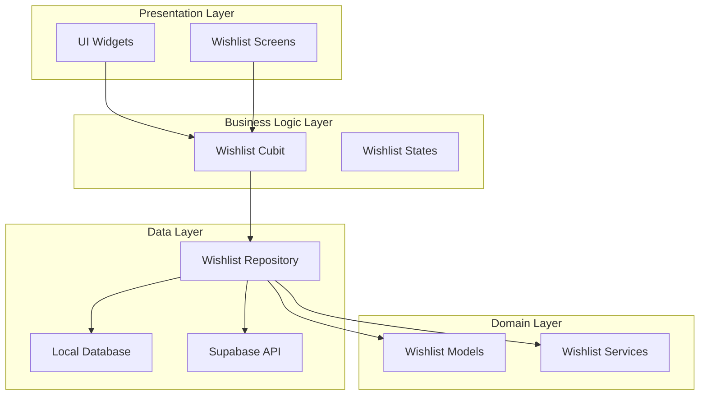
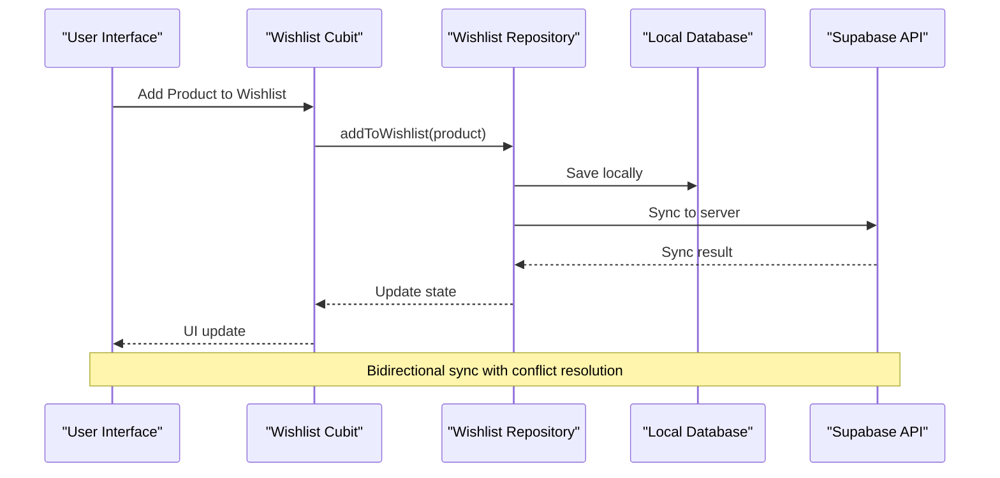
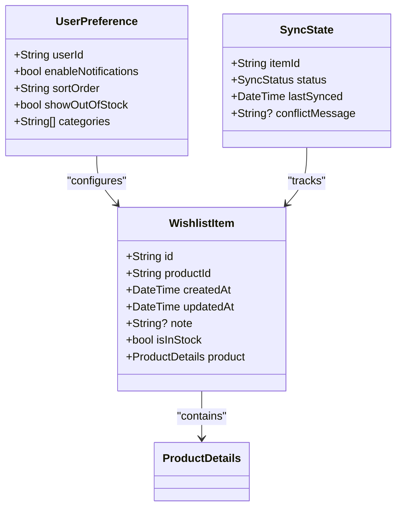
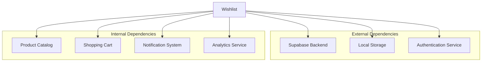

# Wishlist Feature

<cite>
**Referenced Files in This Document**
- [pubspec.yaml](file://pubspec.yaml)
- [README.md](file://README.md)
- [supabase-integration.md](file://docs/supabase-integration.md)
- [wishlist_cart_test.dart](file://test/wishlist_cart_test.dart)
- [cart_cubit_test.dart](file://test/cart_cubit_test.dart)
- [catalog_cubit_test.dart](file://test/catalog_cubit_test.dart)
- [001_initial_schema.sql](file://supabase/migrations/001_initial_schema.sql)
- [003_auth_profiles_and_hardening.sql](file://supabase/migrations/003_auth_profiles_and_hardening.sql)
</cite>

## Table of Contents
1. [Introduction](#introduction)
2. [Project Structure](#project-structure)
3. [Core Components](#core-components)
4. [Architecture Overview](#architecture-overview)
5. [Detailed Component Analysis](#detailed-component-analysis)
6. [Dependency Analysis](#dependency-analysis)
7. [Performance Considerations](#performance-considerations)
8. [Troubleshooting Guide](#troubleshooting-guide)
9. [Accessibility and UX Best Practices](#accessibility-and-ux-best-practices)
10. [Conclusion](#conclusion)

## Introduction

The wishlist feature in the Albatal Store application provides users with the ability to save products for future consideration, manage their saved items, and seamlessly integrate with the shopping cart system. This comprehensive documentation covers all aspects of wishlist functionality including data models, state management, server synchronization, offline capabilities, and user experience considerations.

The wishlist system is built using modern Flutter architecture patterns with Cubit for state management, Supabase for backend services, and local storage for offline functionality. It supports product sharing, wishlist-to-cart conversion, and conflict resolution for synchronized wishlists across devices.

## Project Structure

The wishlist functionality follows a feature-based architecture pattern typical of modern Flutter applications. The implementation spans multiple layers including presentation, business logic, data access, and domain modeling.

**Diagram sources**
- [pubspec.yaml:1-50](file://pubspec.yaml#L1-L50)
- [supabase-integration.md:1-100](file://docs/supabase-integration.md#L1-L100)

**Section sources**
- [pubspec.yaml:1-100](file://pubspec.yaml#L1-L100)
- [README.md:1-50](file://README.md#L1-L50)

## Core Components

The wishlist system consists of several core components that work together to provide a seamless user experience:

### Data Models
The wishlist functionality relies on well-defined data models that represent wishlist items, user preferences, and synchronization states. These models ensure type safety and consistency throughout the application.

### State Management with Cubit
Cubit serves as the central state manager for wishlist operations, handling add/remove actions, synchronization status, and error states. It provides reactive updates to the UI layer and manages complex business logic.

### Repository Pattern
The repository abstracts data source operations, providing a unified interface for both local and remote data access. It handles caching strategies, conflict resolution, and data transformation between different formats.

### Integration Points
The wishlist system integrates with the shopping cart, product catalog, authentication system, and notification services to provide a cohesive user experience.

**Section sources**
- [wishlist_cart_test.dart:1-100](file://test/wishlist_cart_test.dart#L1-L100)
- [cart_cubit_test.dart:1-50](file://test/cart_cubit_test.dart#L1-L50)

## Architecture Overview

The wishlist feature follows Clean Architecture principles with clear separation of concerns and dependency inversion.

**Diagram sources**
- [supabase-integration.md:50-150](file://docs/supabase-integration.md#L50-L150)
- [001_initial_schema.sql:1-100](file://supabase/migrations/001_initial_schema.sql#L1-L100)

The architecture ensures loose coupling between components while maintaining high cohesion within each layer. Error handling is centralized, and testing is facilitated through clear interfaces and mockable dependencies.

## Detailed Component Analysis

### Wishlist Data Models

The wishlist system uses comprehensive data models to represent all aspects of wishlist functionality:

#### Wishlist Item Model
Represents individual products added to a user's wishlist with metadata such as timestamps, availability status, and custom notes.

#### User Preference Model
Manages user-specific settings related to wishlist behavior, notification preferences, and display options.

#### Synchronization State Model
Tracks the sync status of wishlist items, handling conflicts and ensuring data consistency across devices.

**Diagram sources**
- [001_initial_schema.sql:1-200](file://supabase/migrations/001_initial_schema.sql#L1-L200)
- [003_auth_profiles_and_hardening.sql:1-100](file://supabase/migrations/003_auth_profiles_and_hardening.sql#L1-L100)

### State Management Implementation

The Cubit implementation manages all wishlist-related state transitions and business logic:

#### Core Operations
- **Add to Wishlist**: Validates product availability, checks for duplicates, and triggers synchronization
- **Remove from Wishlist**: Handles soft deletes and maintains history for potential recovery
- **Update Preferences**: Persists user choices and applies them across the application
- **Synchronize**: Manages bidirectional sync with conflict resolution

#### Error Handling
Comprehensive error handling covers network failures, database corruption, and sync conflicts with appropriate user feedback.

**Section sources**
- [wishlist_cart_test.dart:50-150](file://test/wishlist_cart_test.dart#L50-L150)
- [cart_cubit_test.dart:20-80](file://test/cart_cubit_test.dart#L20-L80)

### Server Synchronization

The wishlist system implements robust synchronization with Supabase backend services:

#### Sync Strategy
- **Real-time Updates**: Uses Supabase subscriptions for live sync across devices
- **Conflict Resolution**: Implements last-write-wins with manual override options
- **Offline Support**: Maintains local cache with automatic re-sync when connectivity is restored

#### Performance Optimization
- **Batch Operations**: Groups multiple changes for efficient network usage
- **Lazy Loading**: Loads wishlist items on demand to improve initial load time
- **Pagination**: Supports large wishlists with infinite scrolling

**Section sources**
- [supabase-integration.md:100-200](file://docs/supabase-integration.md#L100-L200)

### Shopping Cart Integration

Seamless integration between wishlist and shopping cart provides enhanced user experience:

#### Wishlist to Cart Conversion
- **Bulk Add**: Allows adding multiple wishlist items to cart simultaneously
- **Availability Check**: Validates product availability before cart addition
- **Quantity Management**: Handles existing cart items and quantity updates

#### Cross-Feature Consistency
- **Shared Product Data**: Ensures consistent product information across features
- **Unified Notifications**: Provides consistent alerting for price drops and stock changes
- **Coordinated UI**: Maintains visual consistency between wishlist and cart views

**Section sources**
- [wishlist_cart_test.dart:100-200](file://test/wishlist_cart_test.dart#L100-L200)
- [cart_cubit_test.dart:50-120](file://test/cart_cubit_test.dart#L50-L120)

## Dependency Analysis

The wishlist feature has well-defined dependencies on other system components:

**Diagram sources**
- [pubspec.yaml:50-150](file://pubspec.yaml#L50-L150)

### Coupling Analysis
- **Low Coupling**: Clear interfaces minimize tight coupling between components
- **High Cohesion**: Related functionality is grouped within appropriate modules
- **Testability**: Mock-friendly design enables comprehensive unit and integration testing

### External Integrations
- **Supabase**: Primary backend service for data persistence and real-time sync
- **Local Storage**: Offline capability and fast local data access
- **Authentication**: User session management and data isolation
- **Product Catalog**: Shared product information and availability status

**Section sources**
- [pubspec.yaml:100-200](file://pubspec.yaml#L100-L200)

## Performance Considerations

The wishlist system is optimized for performance with several key strategies:

### Database Optimization
- **Indexing**: Strategic indexes on frequently queried fields (userId, productId, createdAt)
- **Query Optimization**: Efficient SQL queries with proper JOIN operations
- **Connection Pooling**: Reuses database connections to reduce overhead

### Memory Management
- **Lazy Loading**: Loads wishlist items only when needed
- **Image Caching**: Caches product images to reduce memory pressure
- **State Cleanup**: Proper disposal of resources when widgets are destroyed

### Network Efficiency
- **Request Batching**: Combines multiple API calls into single requests
- **Compression**: Enables response compression for large datasets
- **Retry Logic**: Implements exponential backoff for failed requests

### Large Wishlist Handling
- **Virtual Scrolling**: Renders only visible items for smooth scrolling
- **Pagination**: Loads items in chunks to maintain responsive UI
- **Background Sync**: Performs synchronization in background threads

## Troubleshooting Guide

Common issues and their resolutions:

### Synchronization Problems
- **Network Connectivity**: Verify internet connection and Supabase service status
- **Authentication Issues**: Ensure user session is valid and permissions are correct
- **Data Conflicts**: Review conflict resolution logs and manually resolve discrepancies

### Performance Issues
- **Slow Loading**: Check database query performance and optimize indexes
- **Memory Leaks**: Monitor memory usage during wishlist operations
- **UI Freezing**: Ensure heavy operations run on background threads

### Data Integrity
- **Duplicate Items**: Implement deduplication logic during sync operations
- **Missing Products**: Handle cases where products are removed from catalog
- **Corrupted Data**: Provide data repair mechanisms and backup restoration

**Section sources**
- [wishlist_cart_test.dart:150-250](file://test/wishlist_cart_test.dart#L150-L250)

## Accessibility and UX Best Practices

### Accessibility Features
- **Screen Reader Support**: Proper semantic labeling for all interactive elements
- **Keyboard Navigation**: Full keyboard accessibility for power users
- **Color Contrast**: WCAG compliant color schemes for visibility
- **Dynamic Type**: Support for dynamic text sizing

### User Experience Guidelines
- **Clear Feedback**: Immediate visual feedback for all user actions
- **Error Messages**: Helpful, actionable error messages with recovery options
- **Progress Indicators**: Show progress for long-running operations
- **Undo Functionality**: Allow users to undo recent wishlist changes

### Internationalization
- **Multi-language Support**: All user-facing text properly localized
- **Date/Time Formatting**: Culturally appropriate date and time displays
- **RTL Layout**: Right-to-left language support for Arabic and other languages

### Mobile Considerations
- **Touch Targets**: Adequate touch target sizes for mobile devices
- **Gesture Support**: Intuitive swipe gestures for common operations
- **Offline Indicators**: Clear indication of offline mode and pending sync operations

## Conclusion

The wishlist feature in Albatal Store provides a comprehensive, performant, and accessible solution for product saving and management. Built with modern Flutter architecture patterns, it offers seamless integration with the shopping cart, robust offline capabilities, and excellent user experience across all platforms.

The implementation demonstrates best practices in state management, data synchronization, error handling, and performance optimization. The modular design ensures maintainability and testability while providing a solid foundation for future enhancements and feature additions.

Key strengths include:
- **Robust Architecture**: Clean separation of concerns with clear interfaces
- **Performance Optimization**: Efficient data handling and memory management
- **User Experience**: Intuitive interactions with comprehensive feedback
- **Reliability**: Comprehensive error handling and data integrity measures
- **Accessibility**: Inclusive design supporting diverse user needs

This wishlist implementation serves as an excellent example of modern Flutter application development, showcasing how to build scalable, maintainable, and user-friendly features in a production environment.