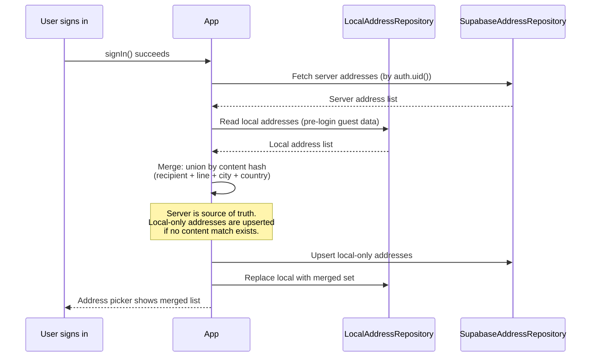

# DATA_POLICY.md — Al Batal Elite v1 Data Policy

**Status:** DRAFT — Decision document. No code changes made.
**Author:** Product Architect (opencode)
**Date:** 2026-07-25

---

## 0. Context

| Entity      | Current storage         | Server table exists | RLS policies | Schema compatible with local? |
|-------------|-------------------------|---------------------|--------------|-------------------------------|
| Cart        | SharedPreferences (local) | `cart_items`          | Full CRUD    | **NO** — server uses `variant_id`; local uses `productId`+`color`+`length` |
| Wishlist    | SharedPreferences (local) | `wishlists`           | SELECT/INSERT/DELETE (no UPDATE) | **YES** — both are `(user_id, product_id)` sets |
| Addresses   | SharedPreferences (local) | `addresses`           | Full CRUD    | **YES** — same fields, same shape |
| Orders      | Supabase (release) / local (debug) | `orders` | SELECT own   | N/A — already hybrid |

**Key architectural fact:** The `create_checkout_order` RPC (migration 013) accepts `p_address` as a JSONB **snapshot** — it does NOT read from the `addresses` table. Server-backed addresses are therefore **not a prerequisite** for checkout correctness.

**Key schema blocker:** The server `cart_items` table has `variant_id UUID NOT NULL REFERENCES product_variants(id)` with `UNIQUE(user_id, variant_id)`. The local cart model (`CartItem`) does **not** carry a `variant_id` — it stores `product.id` + `color` + `length`. Syncing the cart to the server requires resolving a variant ID from `(product_id, color, size)` on every write, which adds a network round-trip or a local variant cache.

---

## 1. Option Comparison

### Option A — Keep cart/wishlist/addresses local-only for v1

| Dimension             | Impact |
|-----------------------|--------|
| **User impact**       | Cart, wishlist, and saved addresses survive app restarts but are lost on uninstall or device switch. Users who reinstall or switch phones start empty. Acceptable for a soft launch with a single-device early-adopter audience. |
| **Technical effort** | **Zero.** No code changes, no migrations, no RLS verification needed. Current state ships as-is. |
| **Data loss risk**    | **High on reinstall/device switch.** SharedPreferences is wiped on uninstall. No recovery path. For a commerce app, losing saved addresses is the most painful (re-entry friction at checkout). |
| **Multi-device impact** | None. Data is siloed per device. No sync, no conflicts. |
| **Reinstall impact**  | **Full data loss** for cart, wishlist, and addresses. User must rebuild. |
| **Login/logout impact** | No merge needed (nothing to merge). Sign-out leaves local data intact (a privacy concern — see below). |
| **Checkout impact**   | None. Checkout already works with local data via the address snapshot. |
| **Privacy impact**    | **Poor.** Local data persists after sign-out. A shared device exposes the previous user's cart, wishlist, and addresses to the next user who signs in. No data leaves the device, but there is no user-controlled erasure. |
| **Recommendation**    | Acceptable only if soft launch is < 2 weeks away and multi-device/reinstall is explicitly out of scope. Must add a sign-out data-clear step regardless. |

---

### Option B — Make addresses server-backed. Keep cart/wishlist local-only.

| Dimension             | Impact |
|-----------------------|--------|
| **User impact**       | Saved addresses survive reinstall and device switches (the highest-friction re-entry data). Cart and wishlist are still per-device — low impact since they are easily rebuilt by browsing. |
| **Technical effort** | **Low–medium.** Schema is already compatible. Need: (1) a `SupabaseAddressRepository`, (2) a merge-on-login step for local→server, (3) a sign-out clear step for local cart/wishlist. No new migrations needed. RLS already covers full CRUD. |
| **Data loss risk**    | **Low for addresses** (server-backed, RLS-protected). **Medium for cart/wishlist** (local-only, lost on reinstall). |
| **Multi-device impact** | Addresses sync across devices. Cart and wishlist do not — acceptable for v1. |
| **Reinstall impact**  | Addresses recovered after login. Cart and wishlist lost — user re-browses, which is natural shopping behavior. |
| **Login/logout impact** | On login: merge local addresses into server (upsert by id or content hash). On logout: clear local cart + wishlist (privacy), optionally keep local addresses or clear them too. |
| **Checkout impact**   | None — checkout uses the address snapshot, not the addresses table. Server-backed addresses just improve the address-picker UX. |
| **Privacy impact**    | **Good for addresses** (server data is deletable via account deletion, RLS-isolated). **Cart/wishlist still local** — must clear on sign-out to avoid shared-device leakage. |
| **Recommendation**    | **Best balanced MVP.** Protects the highest-friction data (addresses) with minimal effort, while accepting the low cost of cart/wishlist being ephemeral. |

---

### Option C — Make cart, wishlist, and addresses fully cloud-synced

| Dimension             | Impact |
|-----------------------|--------|
| **User impact**       | Full continuity across devices, reinstalls, and sessions. Premium commerce experience. |
| **Technical effort** | **High.** Cart sync is blocked by a schema mismatch: server `cart_items.variant_id` vs. local `productId`+`color`+`length`. Must either (a) add a `variant_id` to the local `CartItem` model and resolve it at add-to-cart time, or (b) add a resolution RPC/server function. Wishlist and addresses are straightforward. Total: 3 new repositories, 1 model change, a merge strategy for all three, conflict resolution, and sign-out/account-deletion flows. |
| **Data loss risk**    | **Lowest** — all data is server-backed and RLS-protected. |
| **Multi-device impact** | Full sync. Requires merge-on-login logic for all three entities. Cart conflicts are the hardest (quantity merges, variant resolution). Wishlist is a set union (trivial). Addresses need id-based upsert. |
| **Reinstall impact**  | Full recovery after login for all three. |
| **Login/logout impact** | Login: merge local state into server for all three (3 merge strategies). Logout: clear all local caches. |
| **Checkout impact**   | None — checkout already works. |
| **Privacy impact**    | **Best.** All user data is server-side, deletable via account deletion, RLS-isolated. Local caches cleared on sign-out. |
| **Recommendation**    | **Best for production commerce quality**, but the cart schema work (variant_id resolution) makes this a multi-sprint effort. Defer to v2 unless the team has 3+ weeks before soft launch. |

---

## 2. Recommendations

### 2.1 Best option for fastest Android soft launch

**Option A** (local-only, with a mandatory sign-out clear step).

Rationale: Zero schema work, zero new repositories, zero merge logic. The only addition is clearing local cart/wishlist/addresses on sign-out to fix the shared-device privacy gap. This can ship today.

**Caveat:** This is a tactical decision, not a strategic one. It must be revisited within 2 weeks of launch.

### 2.2 Best option for production commerce quality

**Option C** (fully cloud-synced).

Rationale: Premium fabric-commerce brand positioning requires multi-device continuity. Losing a saved address on reinstall is unacceptable for a production commerce app long-term.

**Caveat:** Requires resolving the `cart_items.variant_id` schema gap first. This is the critical-path blocker. Wishlist and addresses can sync immediately.

### 2.3 Balanced MVP recommendation

**Option B** (server-backed addresses, local cart/wishlist).

Rationale:
- Addresses are the highest-friction re-entry data → server-back them (schema-ready, RLS-ready).
- Cart is the highest-complexity sync (variant_id gap) → defer to v2.
- Wishlist is low-stakes (users re-browse naturally) → defer to v2.
- Checkout is unaffected (address snapshot already works).
- Sign-out clears local cart/wishlist (privacy), keeps addresses on server.

This delivers 80% of the user-trust benefit with 20% of the effort.

---

## 3. Required Database Changes

### For Option B (recommended MVP)

| # | Change | Migration | Reason |
|---|--------|-----------|--------|
| 1 | **None required.** | — | The `addresses` table (migration 001) already has the correct schema and RLS policies (migration 002). No new columns, no new policies. |

### For Option C (future v2)

| # | Change | Migration | Reason |
|---|--------|-----------|--------|
| 1 | Add `variant_id UUID` to the local `CartItem` model | Dart code only | Needed to sync to `cart_items.variant_id` |
| 2 | Add a `resolve_variant_id(p_product_id, p_size, p_color)` RPC | New migration | Allows the client to resolve a variant ID at add-to-cart time without caching all variants locally |
| 3 | Add an `updated_at` trigger to `wishlists` | New migration | Currently missing — needed for sync conflict detection (last-write-wins) |
| 4 | Add an UPDATE policy to `wishlists` | New migration | Currently only SELECT/INSERT/DELETE exist. Needed if wishlist sync uses upsert instead of delete+insert |

---

## 4. Required Repository Changes

### For Option B (recommended MVP)

```
lib/features/addresses/
  ├── domain/repositories/address_repository.dart     # existing interface — no change
  └── data/
      ├── local_address_repository.dart               # existing — becomes the pre-login cache
      └── supabase_address_repository.dart            # NEW — reads/writes the addresses table
```

**Service locator change** (`service_locator.dart`):

- Register `AddressRepository` as `SupabaseAddressRepository` (server-backed) for release.
- Keep `LocalAddressRepository` available as a fallback / pre-login cache for guest users.
- Consider a `HybridAddressRepository` that delegates to local when unauthenticated and server when authenticated — mirrors the existing `OrdersRepository` pattern (`kDebugMode ? Local : Supabase`).

**Cart and wishlist repositories:** No changes. Stay local-only.

### For Option C (future v2)

```
lib/features/storefront/data/
  ├── supabase_cart_repository.dart                   # NEW — syncs to cart_items
  ├── supabase_wishlist_repository.dart                # NEW — syncs to wishlists
  └── supabase_address_repository.dart                 # NEW (same as Option B)
```

The `CartItem` domain entity must gain a `variantId` field. The `StorefrontPersistence` (SharedPreferences) must serialize it. The catalog lookup must populate it.

---

## 5. Required RLS Checks

### Already verified (migration 002 — `test_rls_adversarial.sql` created but NOT yet run)

The RLS adversarial test script (`supabase/tests/test_rls_adversarial.sql`, 44 tests) already covers addresses, wishlists, and cart_items:

- Section 1: anonymous cannot read any of the three tables. ✓ (policy exists)
- Section 2: user A cannot read user B's addresses/wishlist/cart. ✓ (policy exists)
- Section 3: non-admin cannot escalate. ✓ (no admin-only policies needed)

### Before Option B ships, the following MUST be verified on staging:

| # | Check | How |
|---|-------|-----|
| 1 | Anonymous user cannot SELECT/INSERT/UPDATE/DELETE addresses | Run `test_rls_adversarial.sql` Section 1 |
| 2 | User A cannot read user B's addresses | Run `test_rls_adversarial.sql` Section 2 |
| 3 | Authenticated user can CRUD own addresses | Run `test_rls_adversarial.sql` Section 2 (positive tests) |
| 4 | `addresses` table has no public-read policy (unlike products) | Manual: `SELECT polname FROM pg_policies WHERE tablename='addresses';` |

**Launch gate:** `test_rls_adversarial.sql` must pass with 0 failures before Option B ships. This is already documented in `STATE.md` as a pending verification.

---

## 6. Required Merge Strategy After Login

### For Option B (addresses only)



**Merge rules (addresses):**
1. Fetch server addresses.
2. Read local addresses.
3. For each local address: if an exact content match exists on server, skip. Otherwise, insert to server.
4. Replace local cache with server list (server is now the source of truth).
5. If the local list is empty, no upsert needed — just use server data.

**Edge case — default address conflict:** If both local and server have a different `is_default=true` address, the server's default wins. Local default is demoted.

### For Option C (future v2 — all three)

| Entity    | Merge strategy |
|-----------|----------------|
| Addresses | Content-hash upsert (as above) |
| Wishlist  | Set union — `INSERT ... ON CONFLICT (user_id, product_id) DO NOTHING` for local-only IDs |
| Cart      | **Hardest.** Must resolve `variant_id` for each local item, then `INSERT ... ON CONFLICT (user_id, variant_id) DO UPDATE SET quantity = EXCLUDED.quantity` (last-write-wins for quantity). Items that fail variant resolution are dropped with a user-visible warning. |

---

## 7. Required Sign-Out Behavior

### For Option B (recommended MVP)

| Data         | On sign-out action | Reason |
|--------------|---------------------|--------|
| Local cart   | **Clear** (remove `storefront_cart_lines_v1` from SharedPreferences) | Privacy: shared-device scenario. Next user should not see the previous user's cart. |
| Local wishlist | **Clear** (remove `storefront_wishlist_ids_v1`) | Same privacy rationale. |
| Local addresses | **Clear** (remove `saved_addresses_v1`) | Server-backed now. Local copy is a cache; clearing it prevents leakage. |
| Server addresses | **No action** (stay on server, RLS-protected) | User will recover them on next login. |

**Implementation:** Add a `clearLocalUserData()` method to the auth flow (or a `LocalDataClearer` service) called after `_client.auth.signOut()` succeeds in `SupabaseAuthRepository.signOut()`.

### For Option A (fastest soft launch)

Same as Option B's local clears, but **addresses are also cleared** since they have no server backup. This means full data loss on sign-out — the trade-off of Option A.

### For Option C (future v2)

Same as Option B. All three local caches cleared; all three server copies remain.

---

## 8. Required Account Deletion Behavior

### For all options

| Data              | On account deletion |
|-------------------|---------------------|
| `profiles`        | Deleted (cascade: `ON DELETE CASCADE` from `auth.users`) |
| `addresses`       | Deleted (`ON DELETE CASCADE` from `profiles`) |
| `wishlists`       | Deleted (`ON DELETE CASCADE` from `profiles`) |
| `cart_items`      | Deleted (`ON DELETE CASCADE` from `profiles`) |
| `orders`          | **NOT deleted** (`ON DELETE RESTRICT` from `profiles`) — orders are financial records and must be retained for legal/accounting compliance. The FK will block profile deletion. |
| `order_items`     | Retained (cascade from `orders`) |
| `payments`        | Retained (financial record) |

**Critical schema note:** The `orders` table has `user_id UUID NOT NULL REFERENCES profiles(id) ON DELETE RESTRICT`. This means `auth.users` deletion (which cascades to `profiles`) will **fail** if the user has any orders. This is a known constraint that must be handled:

- **Option 1 (recommended):** Anonymize instead of delete. Set `orders.user_id = NULL` (requires making the column nullable) or move orders to an `anonymized_orders` archive table. Then delete the profile.
- **Option 2:** Soft-delete the profile (mark `profiles.deleted_at`) and block login, but keep the row. Do not cascade-delete from `auth.users`.
- **Option 3 (NOT recommended):** Delete orders too. This violates financial record retention and should be rejected.

**Required for v1 (Option B):** None. Account deletion is not in scope for the soft launch. But the `orders` FK constraint must be documented so that when account deletion is built (v2), the team knows the blocker exists.

**Required for v2 (Option C):** Implement account-anonymization (Option 1 above) as a `delete_account()` RPC that anonymizes orders before deleting the profile.

---

## 9. Summary Decision Matrix

| Question | Answer |
|----------|--------|
| Fastest Android soft launch? | **Option A** — ship as-is + add sign-out clear. Zero schema work. |
| Production commerce quality? | **Option C** — full sync. Requires cart `variant_id` resolution first. |
| Balanced MVP? | **Option B** — server-backed addresses, local cart/wishlist. Schema-ready, RLS-ready, 1 new repository. |
| Database changes for MVP? | **None.** Addresses table and RLS already exist. |
| Repository changes for MVP? | 1 new: `SupabaseAddressRepository`. DI swap in `service_locator.dart`. |
| RLS checks before ship? | Run `test_rls_adversarial.sql` (44 tests) on staging. Must be 0 failures. |
| Merge on login? | Addresses: content-hash upsert. Cart/wishlist: no merge (local-only). |
| Sign-out behavior? | Clear all 3 local SharedPreferences keys. Server data untouched. |
| Account deletion? | Blocked by `orders.user_id ON DELETE RESTRICT`. Document for v2. Out of scope for v1. |

---

## 10. Next Steps (human-gated)

1. **Decision:** Human selects Option A, B, or C.
2. **If Option B:** Create `SupabaseAddressRepository`, add merge-on-login, add sign-out clear. Dispatch verifier sub-agent. Run `test_rls_adversarial.sql` on staging.
3. **If Option A:** Add sign-out clear step only. Ship.
4. **If Option C:** Scope the `variant_id` resolution work first. This is the critical path.

---

*End of DATA_POLICY.md — decision document. No code was modified.*
