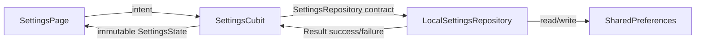

# Al Batal Elite

A premium fabric-commerce Flutter application with a tactile, textile-inspired design language. Built on a [`DESIGN.md`](https://stitch.withgoogle.com/docs/design-md/overview/) system — the convention from [Awesome DESIGN.md](https://github.com/VoltAgent/awesome-design-md) — so AI coding agents and human collaborators share a single source of truth for how every screen should look and feel.

---

## What is `DESIGN.md`?

> *"A plain-text design system document that AI agents read to generate consistent UI. No Figma exports, no JSON schemas, no special tooling. Drop it into your project root and any AI coding agent instantly understands how your UI should look."*
> — [VoltAgent/awesome-design-md](https://github.com/VoltAgent/awesome-design-md)

| File | Who reads it | What it defines |
| --- | --- | --- |
| `AGENTS.md` | Coding agents | How to build the project |
| `DESIGN.md` | Design agents | How the project should look and feel |

This repository ships its own [`DESIGN.md`](./DESIGN.md) — a complete, tokenized design system covering color, typography, spacing, components, elevation, and guardrails. Tell your AI agent: *"Build me a page in the Al Batal Elite design language"* and it will generate consistent UI from the tokens.

---

## Features

- **Two intentional themes** — Emerald/Gold light mode and hand-tuned Charcoal/Slate dark mode (not a simple inversion).
- **Montserrat + Inter typography** — display headings and body copy, split across two families with disciplined weight and tracking.
- **English & Arabic localization** — RTL mirrors automatically via directional insets and Material directional icons.
- **9 product swatches** — real fabric imagery across Silk, Cotton, Velvet, Linen, and Wool categories.
- **Feature-first Clean Architecture** — `settings` and `storefront` features with presentation → domain → data layers.
- **Cubit state management** — deterministic, testable state via `flutter_bloc` with fake repository seams.
- **Persistent preferences** — theme mode, wishlist, cart, and orders stored locally with `SharedPreferences`.
- **GoRouter navigation** — declarative routing with a bottom-navigation shell (Home, Categories, Cart, Wishlist, Profile).
- **InkSparkle ripple** — tactile splash on every tap that reinforces the premium feel.

---

## Design system at a glance

| Token | Value | Use |
| --- | --- | --- |
| `colors.emerald` | `#064E3B` | Primary brand — buttons, indicators, focus rings |
| `colors.gold` | `#D97706` | Warm accent — prices, promotions, secondary CTA |
| `colors.charcoal` | `#121212` | Dark scaffold background |
| `colors.slate` | `#1E293B` | Dark cards and navigation |
| `rounded.card` | 16px | Product cards, dialogs, summary cards |
| `rounded.control` | 8px | Buttons, inputs, FABs |
| `rounded.chip` | 4px | Chips, tags, badges |
| `typography.display-lg` | 48px / 700 / -0.96px | Hero headlines |
| `typography.body-md` | 16px / 400 / 0px | Default body text |

Full spec lives in [`DESIGN.md`](./DESIGN.md).

---

## Project structure

```
albatal_store/
├── DESIGN.md                         # Design system (AI agents read this)
├── INSTRUCTIONS.md                   # Build / handoff instructions
├── README.md                         # This file
├── l10n/                             # ARB message catalogs (en, ar)
├── lib/
│   ├── app.dart                      # App root + router + theme composition
│   ├── main.dart                     # Entry point
│   ├── core/
│   │   ├── entities/                 # Product, Order value objects
│   │   └── error/                    # AppError, Result<T> monad
│   ├── features/
│   │   ├── settings/                 # Theme / prefs feature
│   │   │   ├── data/                 # LocalSettingsRepository
│   │   │   ├── domain/repositories/  # SettingsRepository contract
│   │   │   └── presentation/         # SettingsCubit + SettingsPage
│   │   └── storefront/              # Commerce feature
│   │       ├── data/                 # LocalCatalogRepository, persistence
│   │       ├── domain/repositories/  # CatalogRepository contract
│   │       └── presentation/
│   │           ├── cubit/            # Cart, Catalog, Checkout, Orders, Wishlist
│   │           ├── pages/            # Home, Categories, Cart, Details, Orders, …
│   │           └── widgets/          # ProductTile, FlashSaleCard, PriceText, …
│   ├── generated/l10n/               # Generated localizations
│   └── shared/
│       ├── components/               # AppButton, AppShell, FeedbackView
│       ├── extensions/               # BuildContextX
│       ├── routing/                  # GoRouter config
│       ├── services/                 # Service locator (get_it)
│       └── theme/                    # AppTheme (Material 3, tokens)
├── assets/
│   ├── fonts/                        # Montserrat + Inter variable fonts
│   └── images/                       # 9 product fabric swatches (1.png – 9.png)
├── test/                             # Cubit + widget tests
└── pubspec.yaml
```

---

## Local setup

```bash
# 1. Generate platform folders if needed
flutter create .

# 2. Fetch dependencies and localizations
flutter pub get
flutter gen-l10n

# 3. Verify
flutter analyze
flutter test

# 4. Run
flutter run
```

---

## Architecture and data flow



The Cubit never touches `SharedPreferences` directly. The repository catches storage failures and folds them into `Result` values, keeping state transitions deterministic and the presentation layer testable with a fake repository.

---

## Dependencies

| Package | Role |
| --- | --- |
| `flutter_bloc` / `bloc` | Cubit state management — widgets observe, never own logic |
| `equatable` | Value-based immutable state equality |
| `get_it` | Narrow composition root for concrete implementations |
| `go_router` | Declarative routing, ready for nested commerce flows |
| `shared_preferences` | Local persistence for preferences, cart, wishlist, orders |
| `intl` + `flutter gen-l10n` | Generated messages and RTL support |
| `bloc_test` / `mocktail` | Deterministic state tests with fake repositories |

Flutter ≥ 3.19 / Dart ≥ 3.3 required. Run `flutter pub outdated` before the first production commit.

---

## How to extend

1. Open `DESIGN.md` — it is the single source of truth.
2. Add new tokens under `colors:`, `typography:`, `rounded:`, or `components:`.
3. Tell your AI agent: *"Build me a [component] using the Al Batal Elite design tokens."*
4. Reference tokens directly: `{colors.emerald}`, `{rounded.card}`, `{typography.title-lg}`.

> **Rule:** Headings stay in Montserrat, body stays in Inter. Round everything. No hard shadows. No terracotta outside destructive actions.

---

## License

Private — Al Batal Elite. Not for redistribution.
