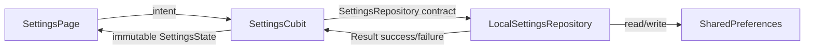

# Al Batal Elite — Foundation

A portable Flutter source foundation for the Al Batal Elite fabric-commerce application. It implements the cross-cutting system first: visual tokens, light/dark/system appearance, English/Arabic localization with RTL, local preference persistence, GoRouter navigation, focused reusable components, and testable Cubit state.

## Scope of this branch

Included:
- Emerald/Gold light mode and intentional Charcoal/Slate dark mode.
- `ThemeMode.system`, light, and dark modes persisted locally.
- English and Arabic generated localization; Flutter supplies RTL directionality from the `ar` locale.
- Direction-safe layout APIs (`EdgeInsetsDirectional`) and Material directional icons.
- Feature-first Clean Architecture for Settings: presentation → domain repository contract → data implementation.
- Explicit loading, ready, saving, and failure state in `SettingsCubit`.
- A bottom-navigation shell and temporary foundation placeholders.

Intentionally deferred: catalog data, images, remote APIs, authentication, payments, analytics, Sentry configuration, and platform shells. Adding those before their contracts exist would create speculative architecture.

## Local setup

1. Install a stable Flutter 3.x SDK (Dart 3.x).
2. From this project directory, generate platform folders if they do not already exist:
   ```bash
   flutter create .
   ```
   This preserves `lib/`, `test/`, and the project configuration.
3. Fetch packages and generate localizations:
   ```bash
   flutter pub get
   flutter gen-l10n
   ```
4. Verify and run:
   ```bash
   flutter analyze
   flutter test
   flutter run
   ```

> These commands were not run in this handoff environment because Flutter was intentionally not installed here.

## Fonts

The supplied design specifies Montserrat for headings and Inter for body text. The theme names those families and falls back safely to the device sans-serif fonts until licensed font files are added. Add them under `assets/fonts/`, declare them in `pubspec.yaml`, then Flutter will use them without network access at runtime.

## Architecture and data flow



The Cubit does not know `SharedPreferences`; the repository catches storage failures and turns them into `Result` values. This keeps state transitions deterministic and makes the presentation layer testable with a fake repository.

## Dependency decisions

- `flutter_bloc` / `bloc`: the requested Cubit state-management model; widgets observe state rather than own logic.
- `equatable`: concise, value-based immutable state equality.
- `get_it`: narrow composition root for concrete implementations.
- `go_router`: maintained declarative navigation, appropriate once nested commerce flows arrive.
- `shared_preferences`: light local persistence for user preferences only—not product, cart, or order storage.
- `intl` + Flutter localization generation: Flutter-native generated messages and RTL support.
- `bloc_test` / `mocktail`: deterministic state tests; `mocktail` is ready for interaction tests as repository behavior expands.

Versions are constrained to stable releases compatible with Flutter 3.19+/Dart 3.3+. Run `flutter pub outdated` locally before the first production commit to confirm the newest compatible stable patch versions for your SDK.

## Branch safety

A local branch named `feat/al-batal-foundation` was initialized. No commit was created and nothing was pushed.
