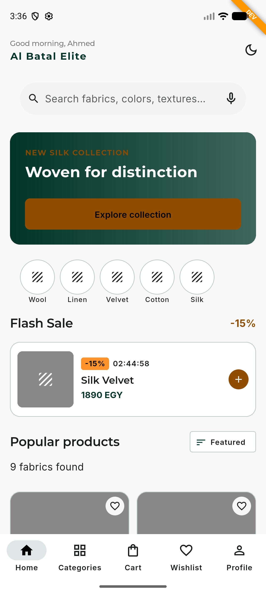
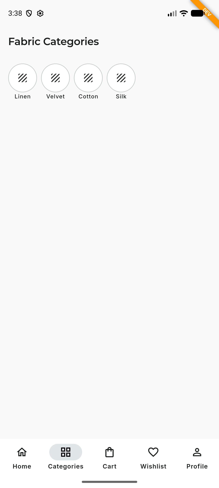

# Al Batal Elite

[](https://github.com/mostafasayed118/albatal-store-app/actions/workflows/ci.yml)
[](https://github.com/mostafasayed118/albatal-store-app/actions/workflows/android-release.yml)


A premium fabric-commerce Flutter application with a tactile, textile-inspired design language. Built on a [`DESIGN.md`](https://stitch.withgoogle.com/docs/design-md/overview/) system — the convention from [Awesome DESIGN.md](https://github.com/VoltAgent/awesome-design-md) — so AI coding agents and human collaborators share a single source of truth for how every screen should look and feel.

| Home | Categories |
|------|-----------|
|  |  |

---

## Features

### Customer App
- **Product catalog** — 9 fabric swatches across Silk, Cotton, Velvet, Linen, and Wool categories
- **Product search** — real-time search with debounce, category/color/price filters with fabric color swatches, 5 sort options
- **Product details** — image gallery with zoom, size guide, stock per variant, related products, delivery/returns info, star ratings
- **Cart** — add/remove/update items, quantity stepper, subtotal/shipping/total, guest-accessible cart review
- **Checkout** — address picker from saved addresses, payment method selection (Paymob card / Cash on Delivery), order review, confirmation
- **Wishlist** — save products, move to cart, responsive grid
- **Orders** — order history with status tracking (placed → shipped → delivered)
- **Authentication** — email/password sign up, sign in, password reset, email verification; sign-in honors `?redirect=` so you return to checkout after logging in
- **Profiles** — display name, phone, order history, time-of-day greeting
- **Guest shopping** — browse, search, and review the cart without sign-in; sign-in required for wishlist, addresses, checkout
- **English & Arabic** — full RTL support with 320+ localized strings
- **Two themes** — Emerald/Gold light mode and Charcoal/Slate dark mode, all colors from one token file (`AppColors`)

### Cloud Backend (Supabase)
- **Authentication** — Supabase Auth with email/password, session restore
- **User profiles** — profile data (name, phone, avatar) synced per customer
- **Row Level Security** — users can only access their own data
- **Server-side checkout** — the `create_checkout_order` RPC validates prices and stock, calculates totals, and creates orders atomically
- **Payments** — Paymob orchestration and callback verification through Edge Functions
- **Storage** — product images (public) and avatars (private)
- **Admin support** — admin role for catalog/order management

> **Note on local persistence:** Cart, wishlist, and addresses are persisted
> locally on-device via SharedPreferences (offline-first). The product
> **catalog, orders, admin operations, checkout, and Paymob payments are fully
> Supabase-backed** — catalog embeds product images from Storage, orders read
> live through Realtime, and checkout runs through server-side RPCs. Cloud
> sync for cart/wishlist/addresses is planned (the domain repository
> interfaces already exist so Cubits won't change when Supabase
> implementations are wired).

---

## Architecture

```
lib/
├── core/
│   ├── entities/          # Product, Order, Address, Profile, Money
│   ├── error/             # Result<T>, AppError
│   ├── utils/             # Currency formatting (`money()` helper)
├── features/
│   ├── auth/              # Authentication & profile
│   │   ├── data/          # SupabaseProfileRepository
│   │   ├── domain/        # ProfileRepository interface
│   │   └── presentation/  # AuthCubit, sign-in/up pages
│   ├── addresses/         # Shipping addresses (local persistence)
│   │   ├── data/          # LocalAddressRepository
│   │   ├── domain/        # AddressRepository interface
│   │   └── presentation/  # AddressesCubit, addresses page
│   ├── settings/          # Theme & language preferences (pure domain enums)
│   ├── admin/             # Supabase-backed order/inventory ops (typed domain: AdminOrder, LowStockVariant, AdminMappers, Result-based repo)
│   ├── payments/          # Paymob payment service, URL guard, payment UI
│   ├── support/           # Support contacts and request flows
│   └── storefront/        # Commerce feature (catalog, cart, checkout, orders)
│       ├── data/          # Repositories, persistence
│       ├── domain/        # Repository interfaces
│       └── presentation/
│           ├── cubit/     # Cart, Catalog, Checkout, Orders, Wishlist, Details
│           ├── pages/     # Home, Categories, Catalog, Cart, Details, Checkout, Orders
│           └── widgets/   # 30+ focused widget files (one public widget per file)
├── generated/l10n/        # Generated localizations
└── shared/
    ├── components/        # AppButton, AppShell, FeedbackView, ResponsiveShell
    ├── extensions/        # BuildContextX, IterableX
    ├── routing/           # GoRouter config (auth-gated routes with ?redirect=)
    ├── services/          # DI, Supabase config, storage, logging, environment
    ├── widgets/           # EnvironmentBanner
    └── theme/             # AppTheme (Material 3), AppColors token file, contrast helpers, grid delegate
```

Test-only fixtures (seed catalog + in-memory repository) live in
`test/fixtures/` so they are never compiled into release builds.

### Data Flow

```
UI (Widget)
  → observes state via BlocBuilder/BlocListener
    → Cubit (owns screen state, emits via StateStream)
      → Repository interface (domain layer)
        → Local repository or server-backed service (data layer)
          → SharedPreferences, Supabase API/RPC, or Edge Function
```

### Key Design Decisions

| Decision | Rationale |
|----------|-----------|
| One public widget per file | Discoverability, single responsibility, easier code review |
| Domain repository interfaces | Local-first implementations; cloud sync planned (interfaces keep Cubits unchanged when Supabase repos are wired) |
| `Money` value object (integer minor units) | Avoids decimal rounding errors; matches the `INTEGER` cents columns in Postgres so no `* 100` / `/ 100` leaks across layers |
| Order items snapshot product details | Past orders remain accurate after catalog changes |
| Server-side checkout | Client never trusted for price/stock validation |
| Guest-first browsing | Reduces friction; cart is public, sign-in gate only at checkout/wishlist |
| Single `CatalogFilters` value + memoized derived views | One source of truth for filters; O(1) product lookup and lazily memoized derived views keep large catalogs fast |
| Centralized `AppColors` tokens | Mirrors `DESIGN.md` exactly; zero duplicated hex values in `lib/` |

---

## Local Setup

> **Security:** the Flutter app does **not** package `.env` as an asset
> and does **not** read `.env` at runtime. Client config is injected at
> build time via `--dart-define-from-file`. Paymob keys, the Supabase
> service-role key, and Edge Function secrets live only in Supabase
> Edge Function secrets and never reach the Flutter build. See
> [`config/README.md`](config/README.md).

```bash
# 1. Install dependencies
flutter pub get
flutter gen-l10n

# 2. Create a local build-config file with your Supabase values.
#    Copy the placeholder template and fill in real values locally.
#    (config/env.staging.local.json is gitignored.)
cp config/env.staging.json config/env.staging.local.json
# Edit config/env.staging.local.json:
#   SUPABASE_URL, SUPABASE_ANON_KEY, (optional) SENTRY_DSN

# 3. Run the numbered migrations (001–039) in Supabase SQL Editor, in order.
# See docs/supabase-integration.md for the migration list and helper scripts.

# 4. Deploy the Edge Functions used by the configured flows.
#    Set their secrets server-side (NEVER in the Flutter build):
#      supabase functions secrets set PAYMOB_API_KEY=...
#      supabase functions secrets set PAYMOB_INTEGRATION_ID=...
#      supabase functions secrets set PAYMOB_HMAC_SECRET=...
#      supabase functions secrets set PAYMOB_IFRAME_ID=...
#      supabase functions secrets set SUPABASE_SERVICE_ROLE_KEY=...
#      supabase functions secrets set SCHEDULER_SECRET=...
supabase functions deploy checkout
supabase functions deploy paymob-initiate
supabase functions deploy paymob-callback
supabase functions deploy cancel-expired-orders
supabase functions deploy send-order-notification

# 5. Verify
flutter analyze
flutter test

# 6. Run (staging)
flutter run --dart-define-from-file=config/env.staging.local.json
```

### Staging build

```bash
# Debug run
flutter run --dart-define-from-file=config/env.staging.local.json

# Release APK
flutter build apk --release \
  --dart-define-from-file=config/env.staging.local.json
```

### Production build

```bash
# Create a local production config from the template, fill in real values
cp config/env.production.json config/env.production.local.json
# Edit config/env.production.local.json with production Supabase values

flutter build apk --release \
  --dart-define-from-file=config/env.production.local.json
```

### Verifying no secrets leak into the artifact

```bash
# After building, confirm .env is NOT in the APK and no PAYMOB_ strings
# are present in the built artifact.
unzip -l build/app/outputs/flutter-apk/app-release.apk | grep -E "\.env$" || echo "OK: no .env in APK"
unzip -p build/app/outputs/flutter-apk/app-release.apk | grep -a "PAYMOB_" | head || echo "OK: no PAYMOB_ strings in APK"
```

---

## Supabase Setup

### Required Steps
1. Create a project at [supabase.com](https://supabase.com)
2. Copy Project URL and anon key into `config/env.staging.local.json` (gitignored)
3. Run the numbered SQL migrations (001–039) in order via SQL Editor
4. Enable Email provider in Authentication → Providers
5. Deploy the Edge Functions required by the enabled payment and notification flows
6. Set Paymob + service secrets via `supabase functions secrets set` (server-only)

### Environment Variables

The Flutter client only ever receives these (build-time, via
`--dart-define-from-file`):

```json
// config/env.staging.local.json (gitignored — fill in real values)
{
  "SUPABASE_URL": "https://your-project.supabase.co",
  "SUPABASE_ANON_KEY": "your-anon-key-here",
  "SENTRY_DSN": ""
}
```

Paymob keys, the service-role key, and scheduler secrets are **never**
shipped to the client — they live in Supabase Edge Function secrets:

```bash
supabase functions secrets set PAYMOB_API_KEY=...
supabase functions secrets set PAYMOB_INTEGRATION_ID=...
supabase functions secrets set PAYMOB_HMAC_SECRET=...
supabase functions secrets set PAYMOB_IFRAME_ID=...
supabase functions secrets set SUPABASE_SERVICE_ROLE_KEY=...
supabase functions secrets set SCHEDULER_SECRET=...
```

---

## Dependencies

| Package | Role |
|---------|------|
| `flutter_bloc` / `bloc` | Cubit state management |
| `equatable` | Value-based immutable state equality |
| `get_it` | Service locator for DI |
| `go_router` | Declarative routing |
| `shared_preferences` | Local persistence |
| `supabase_flutter` | Cloud backend (auth, database, storage) |
| `webview_flutter` | Paymob hosted checkout page |
| `cached_network_image` | Catalog image caching |
| `url_launcher` | Support contacts (WhatsApp/email links) |
| `sentry_flutter` | Crash reporting (optional, via build-time DSN) |
| `flutter_svg` | SVG asset rendering (asset-rule enforced) |
| `uuid` | Product-image storage key generation |
| `intl` + `flutter gen-l10n` | Localization and RTL |
| `bloc_test` / `mocktail` / `fake_async` | Testing |

---

## Documentation

| Doc | Purpose |
|-----|---------|
| `DESIGN.md` | Design system tokens and component spec |
| `INSTRUCTIONS.md` | Engineering contract for AI agents and contributors |
| `docs/foundation-walkthrough.md` | Settings/theme/locale foundation walkthrough |
| `docs/storefront-walkthrough.md` | Commerce feature architecture and cubit ownership |
| `docs/money-walkthrough.md` | `Money` value object (integer minor units) walkthrough |
| `docs/supabase-integration.md` | Supabase setup and table-to-entity mapping |
| `docs/staging-verification.md` | Pre/post-deploy verification checklist |
| `docs/release-readiness.md` | Release readiness checklist |
| `docs/acceptance-checklist.md` | Manual acceptance test cases |
| `docs/RELEASE_NEXT_STEPS.md` | Production cutover runbook + Play Store upload checklist |
| `docs/secret-hygiene-runbook.md` | Secret handling and rotation procedures |

---

## Testing

```bash
flutter test
```

**397 Flutter tests** cover:
- Cubit state transitions (Cart, Catalog, Checkout, Orders, Auth, Wishlist, Details, Admin)
- Product entity logic (stock, discount, inStock)
- Cross-cubit interactions (wishlist ↔ cart)
- Auth state properties, Profile entity, and sign-in `?redirect=` behavior
- Catalog performance contracts (O(1) id lookup, memoized derived views, single `CatalogFilters` source)
- UI contracts (category grid, color swatches, cart badge cap, time-of-day greeting, FeedbackView states, wishlist toggle tap targets)
- Payment security (no client-side verification, URL guard, token redaction, error-message scrubbing)
- Asset rules (SVG-only runtime images), l10n completeness, navigation

**Backend test suites** (`supabase/tests/`, run against staging):
- RLS adversarial — 44/44
- Race conditions — 53/53
- COD contract — 14/14
- Paymob sandbox — 21/21 (incl. real closed transactions)
- Payment initiation contract — 39/39
- Edge Function Deno tests — 70+ assertions

---

## Key Files

| File | Lines | Purpose |
|------|-------|---------|
| `supabase/migrations/001_initial_schema.sql` | ~170 | Database tables and indexes |
| `supabase/migrations/002_rls_policies.sql` | ~100 | Row Level Security policies |
| `supabase/migrations/003_auth_profiles_and_hardening.sql` | ~80 | Auth triggers, admin role, order protection |
| `supabase/functions/checkout/index.ts` | ~100 | Server-side checkout Edge Function |
| `lib/shared/services/supabase_config.dart` | ~50 | Supabase initialization (build-time config) |
| `lib/shared/theme/app_colors.dart` | ~50 | Centralized color tokens (mirrors DESIGN.md) |
| `lib/features/auth/presentation/cubit/auth_cubit.dart` | ~220 | Auth state machine |

---

## License

Private — Al Batal Elite. Not for redistribution.
