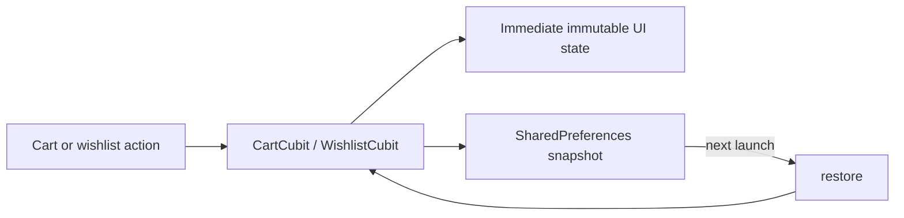

# Elite storefront walkthrough

## Why this slice is local

The supplied materials define visual and interaction requirements, not a backend contract. The storefront uses a fixed catalogue and in-memory cart so the product-to-checkout flow can be understood without hiding decisions behind HTTP, caching, authentication, or payment integrations.


## Search and catalog refinement

### Problem and approach

The original search field was visual-only, while category selection was the only discovery control. This slice makes product discovery deterministic and local: `CatalogCubit` owns the selected category, query, and sort order; `CatalogState.visible` derives the displayed list from those inputs and the fixed product catalogue.

The UI never filters or sorts a collection itself. It sends user intent (`updateQuery`, `select`, `selectSort`, or `clearFilters`) and renders the resulting state. This keeps the same ownership boundary if a future repository replaces the fixed product list.

### Why this instead of a repository now?

A repository would be appropriate once the catalogue is remote, paginated, or cached. For five supplied mock products it would be ceremonial architecture: there is no data source, error contract, or paging behavior to abstract yet. The Cubit is still the correct presentation-state boundary, and the existing `Product` entity remains framework-free.

### Ownership

- `core/entities/product.dart`: framework-free `Product` and configured `CartItem` value objects.
- `storefront_cubits.dart`: catalogue query, category, sorting, countdown, cart calculation, and the other local interaction Cubits.
- `store_pages.dart`: screen composition, a controlled search field, sort menu, and explicit catalog empty state. It only dispatches Cubit intents.
- `catalog_cubit_test.dart`: deterministic coverage for query matching, sort state, and clearing all discovery controls.
- `app_shell.dart`: five-destination navigation and cart quantity badge.
- `app_router.dart`: route parameters for product details plus detail/transactional routes.

### Data-flow details

`CatalogState.visible` normalizes the query with `trim().toLowerCase()`, then matches product names and categories. It applies the selected category in the same pass and sorts a fresh list afterward. The fixed `products` constant is never mutated; that detail matters because one state transition must not affect a later state.

The search control uses a `TextEditingController` only to manage the input widget. The query itself remains in the Cubit. This is a small but important distinction: a controller is presentation plumbing, whereas the Cubit state is the source used to derive the catalogue.

`clearFilters` resets query, category, and sort in one state transition. The empty state can therefore offer a single reliable recovery action rather than duplicating filtering logic in the widget.

## Existing cart state decisions

The cart key combines product, color, and length. This intentionally permits two configurations of the same fabric to coexist. Quantity changes are clamped at the Cubit boundary, so controls cannot create a zero or negative cart line. Checkout simulates order submission for 1.5 seconds, then clears the shared cart only on completion.

## Verification

- Added deterministic `CatalogCubit` behavior tests for case-insensitive searching, stateful sorting, and reset behavior.
- Existing `CartCubit` test remains as regression coverage for configured-line merging and totals.
- Flutter/Dart executables were not available in this environment, so `flutter test` could not be executed here. Run the commands below after extracting the archive.

```bash
flutter pub get
flutter gen-l10n
flutter test
flutter run
```

## Limitations before production

- Catalogue data, images, orders, address selection, payment, and search results are local mock data.
- Search matches only product name and category; there is no typo tolerance, debounce, analytics, pagination, or remote error state.
- Search and category filters intentionally combine. A category selection does not erase a typed query; the empty state provides a one-tap reset.
- Checkout does not persist a generated order.

## Self-check

1. Why is filtering derived from immutable `CatalogState` rather than performed inside `GridView.builder`?
2. Why does `visible` create and sort a new list instead of sorting `products` directly?
3. What is the difference between the text controller's responsibility and the Cubit's responsibility?
4. At what point would a `CatalogRepository` become worthwhile rather than ceremonial?
5. If searching moved to an API, which loading, error, and stale-result states would the Cubit need to add?

## Cart and wishlist persistence

### Problem and approach

The configured cart and wishlist previously disappeared when the app restarted, which made the storefront feel less like a usable local shop. This slice persists only those two client-owned collections through `SharedPreferences`: cart lines are stored as product ID, color, length, and quantity; wishlist entries are stored as product IDs.

At launch, `AlBatalApp` creates the two Cubits with `LocalStorefrontPersistence` and calls `restore()`. Each subsequent cart or wishlist intent updates the visible Cubit state immediately and writes a compact local snapshot in the background. Restored cart lines are joined back to the fixed `products` catalogue by ID. An unknown or malformed line is discarded rather than preventing the rest of the cart from loading.



### Why local preferences rather than a database or backend?

The task is limited to retaining a tiny amount of device-local state. `SharedPreferences` is already a project dependency for settings, needs no account or migration service, and keeps the data model deliberately simple. A database would become worthwhile for a large offline catalogue, migrations, complex queries, or durable order history. A backend would require authentication, sync, conflict, privacy, and error contracts that have not been supplied.

### Ownership and tradeoffs

- `storefront_persistence.dart` owns serialization, defensive reads, and the production `SharedPreferences` adapter.
- `CartCubit` and `WishlistCubit` own when a state transition is saved or restored.
- Widgets remain unaware of storage and continue to render Cubit state only.
- `MemoryStorefrontPersistence` provides a deterministic substitute for behavior tests.

Persistence is best-effort: if local storage is malformed or unavailable, the storefront keeps working with an empty restored collection. This is appropriate for saved cart/wishlist convenience data, but it is not an order, payment, or user-account guarantee. Storage is device-local only; it does not synchronize between devices and uninstalling the app may remove it.

### Added verification

`cart_cubit_test.dart` now verifies that a configured cart line and wishlist ID survive a Cubit recreation when backed by the same memory persistence store. Runtime Flutter tests still need to be run locally because the Flutter/Dart SDK is not available in this environment.

### Self-check

1. Why does the cart store a product ID instead of serializing the whole product object?
2. Why is local storage a sensible boundary for cart/wishlist but not sufficient for payment or order records?
3. What happens when a saved product ID no longer exists in the catalogue?
4. Which states and conflict rules would be needed before synchronizing the wishlist across devices?
