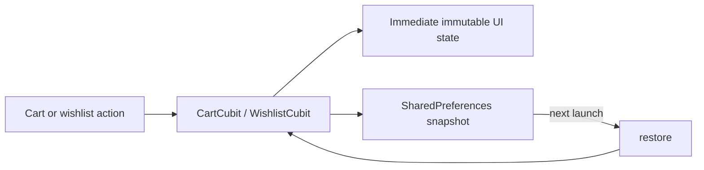
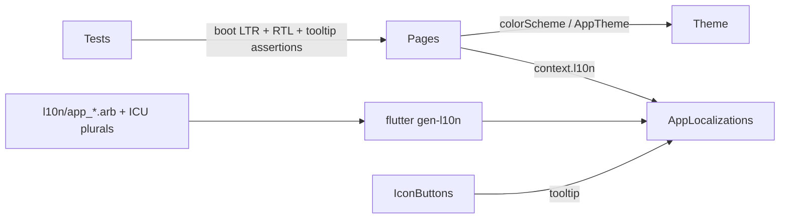
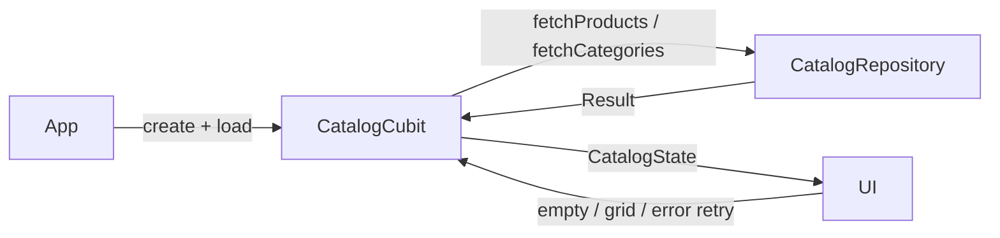

# Elite storefront walkthrough

## Why this slice is local

The supplied materials define visual and interaction requirements, not a backend contract. The storefront uses a fixed catalogue and in-memory cart so the product-to-checkout flow can be understood without hiding decisions behind HTTP, caching, authentication, or payment integrations.


## Search and catalog refinement

### Problem and approach

The original search field was visual-only, while category selection was the only discovery control. This slice makes product discovery deterministic and local: `CatalogCubit` owns the selected category, query, and sort order; `CatalogState.visible` derives the displayed list from those inputs and the fixed product catalogue.

The UI never filters or sorts a collection itself. It sends user intent (`updateQuery`, `select`, `selectSort`, or `clearFilters`) and renders the resulting state. This keeps the same ownership boundary if a future repository replaces the fixed product list.

### Why this instead of a repository now?

A repository would be appropriate once the catalogue is remote, paginated, or cached. For five supplied mock products it would be ceremonial architecture: there is no data source, error contract, or paging behavior to abstract yet. The Cubit is still the correct presentation-state boundary, and the existing `Product` entity remains framework-free.

### Ownership

- `core/entities/product.dart`: framework-free `Product` and configured `CartItem` value objects.
- `storefront_cubits.dart`: catalogue query, category, sorting, countdown, cart calculation, and the other local interaction Cubits.
- `store_pages.dart`: screen composition, a controlled search field, sort menu, and explicit catalog empty state. It only dispatches Cubit intents.
- `catalog_cubit_test.dart`: deterministic coverage for query matching, sort state, and clearing all discovery controls.
- `app_shell.dart`: five-destination navigation and cart quantity badge.
- `app_router.dart`: route parameters for product details plus detail/transactional routes.

### Data-flow details

`CatalogState.visible` normalizes the query with `trim().toLowerCase()`, then matches product names and categories. It applies the selected category in the same pass and sorts a fresh list afterward. The fixed `products` constant is never mutated; that detail matters because one state transition must not affect a later state.

The search control uses a `TextEditingController` only to manage the input widget. The query itself remains in the Cubit. This is a small but important distinction: a controller is presentation plumbing, whereas the Cubit state is the source used to derive the catalogue.

`clearFilters` resets query, category, and sort in one state transition. The empty state can therefore offer a single reliable recovery action rather than duplicating filtering logic in the widget.

## Existing cart state decisions

The cart key combines product, color, and length. This intentionally permits two configurations of the same fabric to coexist. Quantity changes are clamped at the Cubit boundary, so controls cannot create a zero or negative cart line. Checkout simulates order submission for 1.5 seconds, then clears the shared cart only on completion.

## Verification

- Added deterministic `CatalogCubit` behavior tests for case-insensitive searching, stateful sorting, and reset behavior.
- Existing `CartCubit` test remains as regression coverage for configured-line merging and totals.
- Flutter/Dart executables were not available in this environment, so `flutter test` could not be executed here. Run the commands below after extracting the archive.

```bash
flutter pub get
flutter gen-l10n
flutter test
flutter run
```

## Limitations before production

- Catalogue data, images, orders, address selection, payment, and search results are local mock data.
- Search matches only product name and category; there is no typo tolerance, debounce, analytics, pagination, or remote error state.
- Search and category filters intentionally combine. A category selection does not erase a typed query; the empty state provides a one-tap reset.
- Checkout does not persist a generated order.

## Self-check

1. Why is filtering derived from immutable `CatalogState` rather than performed inside `GridView.builder`?
2. Why does `visible` create and sort a new list instead of sorting `products` directly?
3. What is the difference between the text controller's responsibility and the Cubit's responsibility?
4. At what point would a `CatalogRepository` become worthwhile rather than ceremonial?
5. If searching moved to an API, which loading, error, and stale-result states would the Cubit need to add?

## Cart and wishlist persistence

### Problem and approach

The configured cart and wishlist previously disappeared when the app restarted, which made the storefront feel less like a usable local shop. This slice persists only those two client-owned collections through `SharedPreferences`: cart lines are stored as product ID, color, length, and quantity; wishlist entries are stored as product IDs.

At launch, `AlBatalApp` creates the two Cubits with `LocalStorefrontPersistence` and calls `restore()`. Each subsequent cart or wishlist intent updates the visible Cubit state immediately and writes a compact local snapshot in the background. Restored cart lines are joined back to the fixed `products` catalogue by ID. An unknown or malformed line is discarded rather than preventing the rest of the cart from loading.



### Why local preferences rather than a database or backend?

The task is limited to retaining a tiny amount of device-local state. `SharedPreferences` is already a project dependency for settings, needs no account or migration service, and keeps the data model deliberately simple. A database would become worthwhile for a large offline catalogue, migrations, complex queries, or durable order history. A backend would require authentication, sync, conflict, privacy, and error contracts that have not been supplied.

### Ownership and tradeoffs

- `storefront_persistence.dart` owns serialization, defensive reads, and the production `SharedPreferences` adapter.
- `CartCubit` and `WishlistCubit` own when a state transition is saved or restored.
- Widgets remain unaware of storage and continue to render Cubit state only.
- `MemoryStorefrontPersistence` provides a deterministic substitute for behavior tests.

Persistence is best-effort: if local storage is malformed or unavailable, the storefront keeps working with an empty restored collection. This is appropriate for saved cart/wishlist convenience data, but it is not an order, payment, or user-account guarantee. Storage is device-local only; it does not synchronize between devices and uninstalling the app may remove it.

### Added verification

`cart_cubit_test.dart` now verifies that a configured cart line and wishlist ID survive a Cubit recreation when backed by the same memory persistence store. Runtime Flutter tests still need to be run locally because the Flutter/Dart SDK is not available in this environment.

### Self-check

1. Why does the cart store a product ID instead of serializing the whole product object?
2. Why is local storage a sensible boundary for cart/wishlist but not sufficient for payment or order records?
3. What happens when a saved product ID no longer exists in the catalogue?
4. Which states and conflict rules would be needed before synchronizing the wishlist across devices?

## Accessibility and visual polish pass

### Problem and approach

Switching the app to Arabic exposed the largest accessibility gap: dozens of storefront strings were hardcoded English (`'My Cart'`, `'Add to Cart'`, `'Flash Sale'`, `'Remove'`, `'Checkout'`, `'Success!'`...), and the `app_ar.arb` file left roughly twenty storefront keys untranslated. Arabic users saw a mixed-language UI. The same pass also surfaced two related classes of issues: icon-only controls (favorite, share, settings, quantity ±, edit profile, cart badge) had no `tooltip` or `Semantics` label, so assistive technology announced them as unlabeled buttons; and pages drifted from `DESIGN.md` by hardcoding color literals (`Color(0xFF064E3B)`, `Color(0xFFD97706)`, `Color(0xFFBA1A1A)`, `Colors.red`) instead of referencing `ColorScheme` / `AppTheme` tokens, which silently broke dark-mode contrast and the hand-tuned dark palette.

This slice localizes every storefront surface, completes the Arabic translation table, replaces color literals with theme tokens, derives the discount chip from `oldPrice` instead of hardcoding `'-15%'`, restores the DESIGN-mandated primary-tinted halo shadow on the fabric swatch, and adds tooltips on every icon-only control.



### Why these changes instead of a deeper refactor

The instruction set (`INSTRUCTIONS.md` Section D) requires the smallest change that solves the problem, no unrelated refactoring, and RTL correctness without per-language branching. Localizing the strings and routing colors through the existing theme tokens accomplishes all three without inventing new abstractions: `AppLocalizations` was already wired, `ColorScheme` was already populated, and `EdgeInsetsDirectional` + Material directional icons were already in place — the gap was consistency, not architecture. A deeper refactor (per-screen fonts, semantic-only widget trees, a contrast-checking pass) would be appropriate once real product photography, a real catalog repository, and a design-token lint are introduced.

### Ownership and tradeoffs

- `l10n/app_en.arb` and `l10n/app_ar.arb`: the full storefront vocabulary, including ICU plural messages for `fabricsFound` and `curatedFabrics` so English and Arabic plurality rules stay correct at 1 vs. many.
- `lib/generated/l10n/`: regenerated via `flutter gen-l10n`; never edited by hand.
- All pages and feature widgets: read strings through `context.l10n` and colors through `Theme.of(context).colorScheme` or `AppTheme` tokens — no raw `Color(0x...)` literals remain in the storefront surface.
- `product_image_placeholder.dart`: now owns the faint primary-tinted `BoxShadow` (3.5% alpha light / 12% alpha dark) called out by `DESIGN.md` Level 1 elevation, so the swatch floats on the brand halo instead of a hard shadow.
- `details_page.dart`: the discount chip is computed as `((oldPrice - price) / oldPrice * 100).round()`, so the badge stays correct if a product's markdown changes.
- `accessibility_test.dart`: deterministic coverage that the app boots in LTR and RTL, that Arabic resolves the RTL text direction and returns translated strings, and that the home search/settings IconButtons expose localized tooltips.

Tooltips were chosen over inline `Semantics(label:)` because the controls are already `IconButton` widgets — `tooltip` is the idiomatic Material affordance and Flutter automatically forwards it to the semantics tree. A dedicated `Semantics` wrapper would duplicate the label and risk drift between the visible tooltip and the announced label.

### Added verification

- `flutter analyze` runs clean (no new warnings).
- `flutter test` passes the existing catalog, cart, settings, app-boot, and the new accessibility suite.
- `flutter gen-l10n` regenerates both locales without warnings.

### Self-check

1. Why is `tooltip` sufficient for an `IconButton` instead of a separate `Semantics(label:)` wrapper?
2. What would break in dark mode if a page hardcoded `Color(0xFF064E3B)` instead of reading `colorScheme.primary`?
3. Why are `fabricsFound` and `curatedFabrics` declared with ICU plural messages instead of two separate keys like `oneFabricFound` / `manyFabricsFound`?
4. If the discount chip were still hardcoded to `-15%`, which kind of product data change would silently produce a wrong badge?
5. Why does the accessibility test assert `TextDirection.rtl` rather than checking an Arabic string substring?

## Order persistence and functional orders loop

### Problem and approach

Checkout completed by clearing the cart and navigating to a static "Success!" page. No order was persisted. The orders page showed a hardcoded `#ORD-2023-8472` with a fixed progress bar. The cart → checkout → orders loop didn't close — users had no way to see what they'd actually ordered.

This slice adds an `Order` value object that snapshots the cart at confirmation time (items, totals, payment method, timestamp), persists orders through `SharedPreferences` (same pattern as cart/wishlist), rewrites `OrdersCubit` with `place()` / `restore()` / `advance()` intents, rewrites the orders page with real `TabBar` + per-tab empty states, and wires the checkout to call `OrdersCubit.place()` before clearing the cart. The success page receives the order ID via `GoRouterState.extra`.

```mermaid
flowchart LR
  Checkout -->|place(cart, payment)| OrdersCubit
  OrdersCubit -->|snapshot + persist| Persistence
  OrdersCubit -->|emit List<Order>| OrdersPage
  OrdersPage -->|tab: active / completed / cancelled| UI
```

### Why snapshot the full Product, not just an ID?

A cart stores a product reference, because the live product is always available. An order stores a frozen copy, because a real receipt must survive catalog changes — a product rename, price edit, or removal must not rewrite historical orders. The `OrderCodec` serializes the full `Product` fields (id, name, category, price, imageColor, oldPrice) alongside each `CartItem`, so restored orders are self-contained.

### Ownership

- `core/entities/order.dart`: framework-free `Order` and `OrderStatus` value objects.
- `storefront_persistence.dart`: extended with `readOrders()` / `writeOrders()` and a shared `OrderCodec` for both `LocalStorefrontPersistence` and `MemoryStorefrontPersistence`.
- `orders_cubit.dart`: rewritten to own `OrdersState { orders, status }`, with `place()`, `restore()`, and `advance()` intents. Orders are sorted most-recent-first in each tab.
- `checkout_page.dart`: calls `OrdersCubit.place()` before `CartCubit.clear()`, passes `order.id` via `GoRouterState.extra`.
- `orders_page.dart`: rewritten with `DefaultTabController` + `TabBar` (Active / Completed / Cancelled), each tab rendering its filtered list with a `_StatusProgress` indicator and an "Advance order" button for demo purposes.
- `orders_cubit_test.dart`: 3 tests — place, advance lifecycle, persistence across cubit recreation.

### Added verification

- `flutter analyze` clean.
- 15 → 20 tests passing (3 order cubit tests + 2 new catalog tests for debounce/recent queries).

### Self-check

1. Why does `Order.items` contain full `CartItem` objects rather than just product IDs + quantities?
2. What would happen if `OrdersCubit.place()` cleared the cart instead of letting the checkout listener own that decision?
3. The orders page uses `DefaultTabController` instead of the earlier `SegmentedButton`. Why is a `TabBar` a better fit when each tab needs its own scrolling list?

## Catalog repository abstraction

### Problem and approach

`CatalogCubit` previously read a hardcoded `products` constant directly, with no data layer between the entity and the Cubit. This meant there was no place to swap in a remote API, no `Result<T>` error contract, and no `loading` / `ready` / `error` status lifecycle — the Cubit just "had" products from construction.

This slice extracts a `CatalogRepository` interface (returning `Result<List<Product>>`), implements it as `LocalCatalogRepository` backed by the fixed product list, registers it in `GetIt`, and rewrites `CatalogCubit` with a `load()` intent that transitions through `CatalogStatus.initial → loading → ready | error`. The Cubit no longer auto-loads from its constructor — `AlBatalApp` calls `..load()` explicitly, matching the `CartCubit..restore()` pattern.



### Why this abstraction is not ceremony

The repository is thin — it returns `List.of(products)` — but it earns its keep in three ways: (a) the Cubit is now testable with both a `StubCatalogRepository` (happy path) and a `FailingCatalogRepository` (error path) without touching the UI; (b) swapping in a remote API later means changing one file (`remote_catalog_repository.dart`) not the Cubit or every widget; (c) the `Result<T>` error contract forces explicit handling — the Cubit cannot silently swallow a failure because the state must transition to `CatalogStatus.error`.

### Ownership

- `domain/repositories/catalog_repository.dart`: abstract interface + `CatalogData` value class.
- `data/local_catalog_repository.dart`: local in-memory implementation.
- `service_locator.dart`: registers `CatalogRepository` as `LazySingleton`.
- `app.dart`: `CatalogCubit(getIt<CatalogRepository>())..load()`.
- `catalog_cubit.dart`: rewritten with `CatalogStatus`, `load()`, debounced `updateQuery`, recent queries, and `deleteRecentQuery`.
- `catalog_cubit_test.dart`: rewritten with `StubCatalogRepository` / `FailingCatalogRepository`, covering load, filtering, sorting, debounce, and error retry — 8 tests.

### Self-check

1. What would change in `RemoteCatalogRepository` that would NOT require touching `CatalogCubit`?
2. Why does `CatalogCubit.load()` emit `loading` before the `await` rather than after?
3. If `fetchProducts()` returned an empty list (success but no data), how would the current Cubit handle it — and what should the UI show?

## Search refinement — debounce, recent queries, in-place category filtering

### Problem and approach

Search was instant on every keystroke (no debounce), queries were not remembered, and the categories page redirected to home on tap. This slice adds a 350ms debounce to `updateQuery` (preventing grid rebuild on every character), records the 5 most recent successful queries, shows them as deletable chips below the search bar, and rewrites the categories page to show a filtered product grid in-place when a category is selected (with a back button to return to the tile view).

### Why debounce matters

With 5 products the instant rebuild is invisible. With a real catalog of hundreds, every keystroke would trigger a full filter + sort + grid rebuild. The 350ms debounce is a standard mobile search interval — fast enough to feel instant, slow enough to skip intermediate states. The debounce timer is stored as `_debounce` on the Cubit and cancelled on each new keystroke, so only the final query triggers a `recentQueries` record.

### Ownership

- `catalog_cubit.dart`: `_debounce` timer, `_recordRecentQuery`, `deleteRecentQuery`.
- `home_page.dart`: recent queries chips rendered via `Wrap` below the search field when `query.isEmpty && recentQueries.isNotEmpty`.
- `categories_page.dart`: rewritten with `_CategoryGrid` (reads `CatalogCubit` state) and `_FilteredCategoryView` (shows filtered `GridView` with a back button). The page no longer calls `context.go('/home')`.
- `catalog_cubit_test.dart`: two new tests for debounce behavior and recent query recording.

### Self-check

1. Why does the debounce record the query in a separate timer rather than immediately in `updateQuery`?
2. What problem would occur if recent queries were stored in `SharedPreferences` instead of Cubit state?
3. When a user taps a category chip on the categories page, what state transition occurs, and how does the page re-render without a navigation event?

## Procedural fabric-weave imagery

### Problem and approach

Product swatches were flat color blocks with a centered texture icon — visually functional but the biggest "mock" tell in the app. Real fabric photography requires supplied assets that don't exist yet. This slice adds a `FabricWeavePainter` (a `CustomPainter`) that renders a subtle cross-hatch weave pattern over the product's base color, giving each swatch a more tactile, cloth-like appearance without pretending to be a photograph.

The painter draws horizontal and vertical "threads" with a slight per-line wobble for organic feel, plus a faint diagonal highlight that reinforces the woven texture. The pattern scales to any container size and adapts to the product's color. When real photography is supplied later, the painter is removed and `Image.asset` takes its place — the rest of the widget tree is unchanged.

### Why CustomPainter instead of an SVG or raster texture

A `CustomPainter` is framework-native, requires no asset pipeline, scales to any resolution without aliasing, and composes directly with `Container`'s box shadow and border radius. An SVG texture would need asset bundling and a rendering wrapper; a raster texture would need multiple resolutions for different screen densities. The painter is the simplest honest placeholder that adds visual interest without inventing infrastructure.

### Ownership

- `fabric_weave_painter.dart`: the `CustomPainter` — `baseColor`, `threadCount`, optional `threadColor`.
- `product_image_placeholder.dart`: now wraps its content in `CustomPaint(painter: FabricWeavePainter(...))` with `Clip.antiAlias` for clean corner rounding.

### Self-check

1. Why does `shouldRepaint` compare `baseColor` and `threadCount` rather than always returning `true`?
2. If the painter drew 50 threads instead of 12, what performance concern would arise on low-end devices?
3. When real product photos arrive, what is the minimal change to `product_image_placeholder.dart` — and which files are NOT touched?
