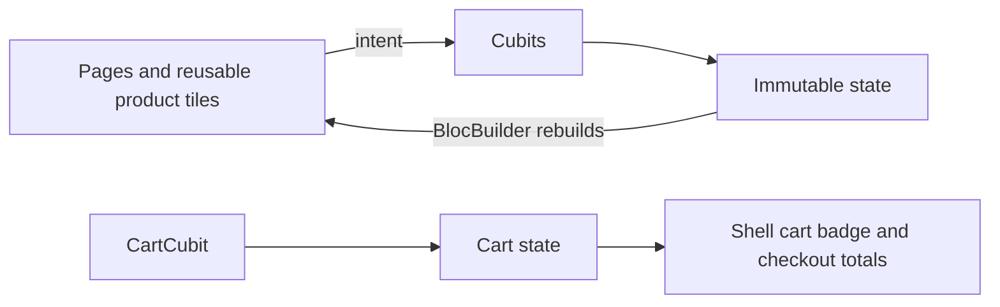

# Elite storefront walkthrough

## Why this slice is local
The supplied materials define visual and interaction requirements, not a backend contract. The storefront uses a fixed catalogue and in-memory cart so the product-to-checkout flow can be understood without hiding decisions behind HTTP, caching, authentication, or payment integrations.

## Ownership

- `core/entities/product.dart`: framework-free `Product` and configured `CartItem` value objects.
- `storefront_cubits.dart`: catalogue selection/countdown, wishlist IDs, configured-cart calculation, product detail options, checkout placement state, and orders tab state.
- `store_pages.dart`: screen composition and UI-only event dispatching. Pages do not calculate prices or mutate collections.
- `app_shell.dart`: five-destination navigation and cart quantity badge.
- `app_router.dart`: route parameters for product details plus detail/transactional routes.

## State decisions

The cart key combines product, color, and length. This intentionally permits two configurations of the same fabric to coexist. Quantity changes are clamped at the Cubit boundary, so controls cannot create a zero or negative cart line. Checkout simulates order submission for 1.5 seconds, then clears the shared cart only on completion.

## Limitations before production

- Product data, orders, address selection, payment, and images are local mock data.
- No real font binaries were supplied; theme fallback remains active.
- Checkout does not persist a generated order.
- Search and voice icon are visual only; filters are category based.

## Self-check

1. Why is a configured cart item keyed by product, color, and length rather than product alone?
2. Which state should rebuild the navigation cart badge, and why?
3. Why is the checkout delay held in the Cubit rather than the button callback?
4. At which boundary would a remote catalogue repository be introduced?
5. What new state would be needed to make address selection real?

## Branding pass

The final branding pass embeds Montserrat and Inter as local assets, so the storefront does not depend on a runtime font download. `AppTheme` assigns Inter globally for commerce copy and applies Montserrat to display/headline styles, with the Al Batal Elite wordmark and hero typography explicitly using Montserrat. The theme also centralizes the emerald, gold, terracotta, surfaces, 16px card radius, 8px control radius, subtle tinted depth, and focused input treatment.

## Saved address book slice
`AddressesCubit` owns the address-list state and is created from the app composition root. `AddressRepository` keeps SharedPreferences and JSON mapping in the data layer. The checkout reads the selected default address, while Profile routes to the management page. Addresses remain device-local; account sync is explicitly out of scope until authentication and privacy rules exist.
